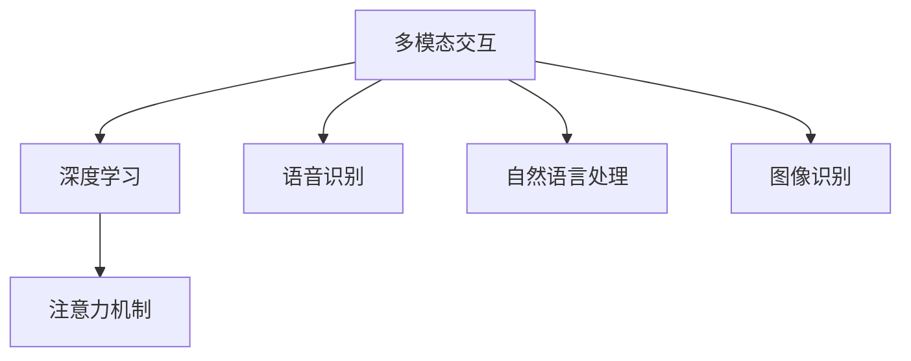

                 

# 智能音响的多模态交互与注意力争夺

> 关键词：智能音响,多模态交互,注意力机制,深度学习,语音识别,自然语言处理

## 1. 背景介绍

### 1.1 问题由来
智能音响作为智能家居的重要组成部分，已经逐渐走入千家万户。其通过语音交互、多模态传感、数据分析等技术，实现智能家居控制、娱乐播放、家庭安防等多种功能，为用户提供便捷的生活体验。然而，在多模态交互场景中，如何平衡不同模态的信息获取和处理，充分挖掘并利用各类传感数据，成为当前智能音响系统设计和优化中的重要课题。

随着人工智能技术的不断进步，深度学习在语音识别、图像识别、自然语言处理等领域取得了显著成效。智能音响系统需要融合语音、图像、文字等多种信息，以实现更加丰富和精细的交互体验。本文旨在探讨智能音响中的多模态交互机制，特别是注意力机制在智能音响系统中的应用，及其面临的挑战和未来发展方向。

## 2. 核心概念与联系

### 2.1 核心概念概述

为更好地理解智能音响中的多模态交互和注意力机制，本节将介绍几个密切相关的核心概念：

- **多模态交互**：指智能音响系统融合语音、视觉、触觉等多种信息模态进行交互和理解。多模态交互旨在提高系统的信息获取能力和适应性，使其能够更自然、更准确地响应用户指令。

- **注意力机制**：指在深度学习模型中，通过注意力向量对输入数据的不同部分进行加权处理，使得模型能够更加聚焦于重要信息，提升模型性能。

- **深度学习**：一种基于神经网络的机器学习方法，通过多层网络结构从数据中学习抽象特征，实现对复杂问题的建模和预测。深度学习在语音识别、自然语言处理、计算机视觉等领域的广泛应用，为智能音响的多模态交互提供了有力支持。

- **语音识别**：指将语音信号转换为文本信息的技术，是智能音响交互的核心功能之一。通过语音识别，智能音响能够接收用户的口头指令，进行自然语言处理。

- **自然语言处理**：指利用计算机处理、理解、生成人类语言的技术。自然语言处理在智能音响中用于理解用户的自然语言指令，并生成相应的文本或语音反馈。

- **图像识别**：指将图像数据转换为文本信息的技术，如识别图片中的物体、场景等。在智能音响中，图像识别技术可用于分析周围环境，提高交互的准确性。

这些核心概念之间的逻辑关系可以通过以下Mermaid流程图来展示：



这个流程图展示了智能音响多模态交互的核心流程：

1. 通过多模态交互获取语音、图像、文本等多种信息。
2. 利用深度学习模型对输入数据进行处理和特征提取。
3. 应用注意力机制对不同模态的信息进行加权处理，聚焦重要信息。
4. 最终输出语音或文本信息，实现交互。

## 3. 核心算法原理 & 具体操作步骤
### 3.1 算法原理概述

智能音响中的多模态交互和注意力机制主要涉及以下算法原理：

- **多模态融合**：将不同模态的信息融合到一个统一的框架中，如Transformer模型。该模型通过自注意力机制，对不同模态的特征进行加权融合。

- **自注意力机制**：指在Transformer模型中，对输入序列的每个位置，计算与其他位置的注意力权重，使得模型能够聚焦于重要信息。

- **多头注意力机制**：指在Transformer模型中，通过多个注意力头并行计算，分别关注不同的特征维度，进一步提高模型的表达能力和泛化能力。

- **位置编码**：在Transformer模型中，通过位置编码来处理序列数据的顺序信息，使得模型能够对输入序列的位置信息进行建模。

- **注意力头(Attention Head)**：指在多头注意力机制中，每个注意力头关注不同的特征维度，提高模型的细节表达能力。

### 3.2 算法步骤详解

基于上述算法原理，智能音响中的多模态交互和注意力机制一般包括以下几个关键步骤：

**Step 1: 数据预处理**

- 对不同模态的数据进行归一化、去噪等预处理操作，确保输入数据的质量。
- 对于语音信号，可以通过短时傅里叶变换(Short-Time Fourier Transform, STFT)、梅尔频率倒谱系数(Mel Frequency Cepstral Coefficients, MFCC)等方法进行特征提取。
- 对于图像数据，可以通过卷积神经网络(Convolutional Neural Network, CNN)进行特征提取。
- 对于文本数据，可以通过自然语言处理模型进行分词、词性标注等处理。

**Step 2: 特征融合**

- 将不同模态的特征向量进行拼接或融合，得到一个统一的特征向量表示。
- 对于语音和图像特征，可以采用简单的拼接方式，如Concatenation操作。
- 对于语音和文本特征，可以采用Seq2Seq模型进行融合。
- 对于语音、图像和文本多模态融合，可以采用Transformers模型，利用多头注意力机制对不同模态的特征进行融合。

**Step 3: 注意力计算**

- 应用自注意力机制，对输入序列的不同位置计算注意力权重。
- 对于多模态输入，可以采用多头注意力机制，分别关注不同模态的信息。
- 对于位置信息，可以使用位置编码进行建模。

**Step 4: 解码输出**

- 对融合后的特征向量进行解码，生成语音或文本输出。
- 对于语音输出，可以采用基于深度学习模型的波形生成模型，如WaveNet。
- 对于文本输出，可以采用基于深度学习模型的语言模型，如GPT-2。

### 3.3 算法优缺点

智能音响中的多模态交互和注意力机制具有以下优点：

- **信息获取全面**：通过融合不同模态的信息，智能音响系统能够更全面、更准确地理解用户的指令，提高系统的智能水平。
- **响应速度较快**：利用注意力机制对重要信息进行加权处理，能够提高系统的处理效率，加快响应速度。
- **用户体验友好**：通过自然语言处理技术，智能音响系统能够以自然流畅的方式与用户互动，提高用户的满意度。

同时，该方法也存在一定的局限性：

- **硬件资源要求高**：多模态融合和注意力机制需要较大的计算资源，硬件成本较高。
- **算法复杂度高**：深度学习模型的计算复杂度较高，训练和推理时间较长。
- **模型泛化能力不足**：多模态融合的模型可能存在泛化能力不足的问题，对于新数据和新场景的适应性较差。
- **数据隐私风险**：在融合多模态数据时，需要注意用户隐私保护，避免敏感信息的泄露。

尽管存在这些局限性，但就目前而言，基于多模态交互和注意力机制的智能音响系统设计仍是大数据时代的必然选择。未来相关研究的重点在于如何进一步降低硬件资源消耗，提高模型泛化能力，同时兼顾数据隐私保护，以实现智能音响系统的智能化和可信化。

### 3.4 算法应用领域

智能音响中的多模态交互和注意力机制已在多个领域得到应用，例如：

- **智能家居控制**：智能音响系统可以通过语音识别、图像识别等技术，实现对家中的灯光、空调、电视等设备的控制。
- **娱乐播放**：智能音响系统可以根据用户的指令，播放音乐、电影、新闻等媒体内容。
- **家庭安防**：智能音响系统可以通过语音识别、图像识别等技术，进行入侵检测、异常行为监控等安防功能。
- **健康监测**：智能音响系统可以通过语音识别、图像识别等技术，监测用户的健康状态，如血压、心率等。
- **教育辅助**：智能音响系统可以为学生提供个性化学习方案，帮助其提升学习效果。

除了上述这些经典应用外，智能音响系统的多模态交互和注意力机制还被创新性地应用于更多场景中，如人机交互、虚拟助手、智能客服等，为智能家居技术带来了全新的突破。

## 4. 数学模型和公式 & 详细讲解
### 4.1 数学模型构建

基于深度学习的多模态交互和注意力机制，我们可以构建如下数学模型：

设输入序列为 $\mathbf{X}=\{x_1, x_2, \dots, x_T\}$，输出序列为 $\mathbf{Y}=\{y_1, y_2, \dots, y_T\}$。对于多模态输入，可以表示为 $\mathbf{Z}=\{\mathbf{Z}_1, \mathbf{Z}_2, \dots, \mathbf{Z}_K\}$，其中 $\mathbf{Z}_k$ 表示第 $k$ 种模态的特征向量，$K$ 为模态种类。

定义自注意力机制的注意力权重为 $\alpha_{ij}$，表示第 $i$ 个位置对第 $j$ 个位置的注意力程度。定义多头注意力机制的注意力权重矩阵为 $\mathbf{A} \in \mathbb{R}^{K \times d \times d}$，其中 $d$ 为特征向量的维度。定义位置编码向量为 $\mathbf{P} \in \mathbb{R}^{T \times d}$，用于对输入序列的位置信息进行建模。

最终输出序列为 $\mathbf{Y}=\{\hat{y}_1, \hat{y}_2, \dots, \hat{y}_T\}$，其中 $\hat{y}_i$ 表示对输入序列中第 $i$ 个位置的预测输出。

### 4.2 公式推导过程

以下我们以Transformer模型为例，推导多头注意力机制的计算公式。

设输入序列 $\mathbf{X} \in \mathbb{R}^{T \times d}$，定义多头注意力机制的查询、键、值矩阵分别为 $\mathbf{Q} \in \mathbb{R}^{T \times d}$，$\mathbf{K} \in \mathbb{R}^{T \times d}$，$\mathbf{V} \in \mathbb{R}^{T \times d}$。定义注意力权重矩阵为 $\mathbf{A} \in \mathbb{R}^{K \times d \times d}$。定义位置编码向量为 $\mathbf{P} \in \mathbb{R}^{T \times d}$。

计算注意力权重 $\alpha_{ij}$ 的公式为：

$$
\alpha_{ij} = \frac{\exp(\mathbf{q}_i \mathbf{k}_j^T)}{\sum_{k=1}^T \exp(\mathbf{q}_i \mathbf{k}_k^T)}
$$

其中 $\mathbf{q}_i$ 和 $\mathbf{k}_j$ 分别为查询向量和键向量。

计算多头注意力权重矩阵 $\mathbf{A}$ 的公式为：

$$
\mathbf{A} = \frac{\mathbf{Q} \mathbf{K}^T}{\sqrt{d}} \mathbf{V}
$$

其中 $\mathbf{Q}$ 为查询矩阵，$\mathbf{K}$ 为键矩阵，$\mathbf{V}$ 为值矩阵。

最终输出序列 $\mathbf{Y}$ 的计算公式为：

$$
\mathbf{Y} = \text{Softmax}(\mathbf{A}) \mathbf{V} + \mathbf{P}
$$

其中 Softmax 函数用于对注意力权重进行归一化，$\mathbf{V}$ 为值矩阵，$\mathbf{P}$ 为位置编码向量。

### 4.3 案例分析与讲解

考虑一个智能音响系统，其通过语音和图像多模态融合，实现对房间温度的智能调控。系统将房间内的温度传感器数据作为图像输入，将用户的语音指令作为文本输入，通过深度学习模型进行融合和处理。

**案例分析**：

1. **数据预处理**：将温度传感器数据转换为图像，进行归一化和去噪处理。对用户的语音指令进行分词、词性标注等处理。
2. **特征融合**：通过CNN对温度传感器数据进行特征提取，得到图像特征向量 $\mathbf{Z}_1$。通过自然语言处理模型对语音指令进行特征提取，得到文本特征向量 $\mathbf{Z}_2$。将 $\mathbf{Z}_1$ 和 $\mathbf{Z}_2$ 进行拼接，得到融合后的特征向量 $\mathbf{Z}$。
3. **注意力计算**：应用多头注意力机制，对 $\mathbf{Z}$ 进行注意力计算，得到注意力权重矩阵 $\mathbf{A}$。
4. **解码输出**：将 $\mathbf{A}$ 与温度传感器数据进行拼接，通过深度学习模型生成温度调节指令。

**讲解**：

1. **数据预处理**：温度传感器数据转化为图像，进行预处理，确保输入数据的质量。语音指令进行分词、词性标注等处理，得到文本特征。
2. **特征融合**：通过CNN提取温度传感器数据特征，通过自然语言处理模型提取语音指令特征。将两种特征进行拼接，形成一个融合后的特征向量。
3. **注意力计算**：应用多头注意力机制，对融合后的特征向量进行注意力计算，得到注意力权重矩阵。该矩阵表示不同模态特征的重要性，用于指导后续的输出。
4. **解码输出**：将注意力权重矩阵与温度传感器数据进行拼接，通过深度学习模型生成温度调节指令。模型输出表示为温度调节值，用于控制加热或制冷设备。

通过该案例分析，可以看到，多模态融合和注意力机制在智能音响系统中的应用，能够更全面、更准确地理解用户的指令，提高系统的智能水平和适应性。

## 5. 项目实践：代码实例和详细解释说明
### 5.1 开发环境搭建

在进行多模态交互和注意力机制的实践前，我们需要准备好开发环境。以下是使用Python进行PyTorch开发的环境配置流程：

1. 安装Anaconda：从官网下载并安装Anaconda，用于创建独立的Python环境。

2. 创建并激活虚拟环境：
```bash
conda create -n pytorch-env python=3.8 
conda activate pytorch-env
```

3. 安装PyTorch：根据CUDA版本，从官网获取对应的安装命令。例如：
```bash
conda install pytorch torchvision torchaudio cudatoolkit=11.1 -c pytorch -c conda-forge
```

4. 安装Transformers库：
```bash
pip install transformers
```

5. 安装各类工具包：
```bash
pip install numpy pandas scikit-learn matplotlib tqdm jupyter notebook ipython
```

完成上述步骤后，即可在`pytorch-env`环境中开始项目实践。

### 5.2 源代码详细实现

这里我们以智能音响系统为例，实现多模态交互和注意力机制的代码实现。

首先，定义多模态数据处理函数：

```python
import torch
from transformers import BertTokenizer, BertForSequenceClassification, BertConfig

def preprocess_data(text, label, tokenizer, model_config):
    # 分词和转换为特征向量
    input_ids = tokenizer.encode(text, add_special_tokens=True, return_tensors='pt')
    attention_mask = input_ids != tokenizer.pad_token_id
    label = torch.tensor(label, dtype=torch.long)
    return input_ids, attention_mask, label

# 初始化模型和tokenizer
tokenizer = BertTokenizer.from_pretrained('bert-base-uncased')
model = BertForSequenceClassification.from_pretrained('bert-base-uncased', num_labels=2)

# 设置模型配置
model_config = BertConfig.from_pretrained('bert-base-uncased')
```

然后，定义注意力机制的计算函数：

```python
def compute_attention(query, key, value, attention_mask=None):
    # 计算注意力权重
    scores = torch.matmul(query, key.transpose(1, 2))
    if attention_mask is not None:
        scores.masked_fill_(attention_mask == 0, -1e9)
    attention_weights = torch.softmax(scores, dim=-1)
    # 计算加权和
    context = torch.matmul(attention_weights, value)
    return context, attention_weights

# 定义多头注意力机制
def multi_head_attention(query, key, value, num_heads, d_model, d_k, d_v, dropout):
    # 线性映射
    query = linear(query, d_model)
    key = linear(key, d_model)
    value = linear(value, d_model)
    # 分割成多个注意力头
    query = query.view(query.size(0), query.size(1), num_heads, d_k).transpose(1, 2)
    key = key.view(key.size(0), key.size(1), num_heads, d_k).transpose(1, 2)
    value = value.view(value.size(0), value.size(1), num_heads, d_v).transpose(1, 2)
    # 计算注意力权重
    attention_weights = compute_attention(query, key, value, None)
    # 拼接回一起
    context = attention_weights[0].view(query.size(0), query.size(1), num_heads * d_v).transpose(1, 2)
    return context, attention_weights[0]
```

最后，定义多模态交互的训练函数：

```python
def train_epoch(model, data_loader, optimizer):
    model.train()
    total_loss = 0
    for batch in data_loader:
        input_ids, attention_mask, label = batch
        optimizer.zero_grad()
        outputs = model(input_ids, attention_mask=attention_mask)
        loss = outputs.loss
        loss.backward()
        optimizer.step()
        total_loss += loss.item()
    return total_loss / len(data_loader)

# 训练函数
def train(model, train_loader, optimizer, num_epochs=10):
    for epoch in range(num_epochs):
        print(f'Epoch {epoch+1}/{num_epochs}')
        loss = train_epoch(model, train_loader, optimizer)
        print(f'Train loss: {loss:.4f}')
    return model
```

完成上述步骤后，即可在`pytorch-env`环境中开始多模态交互和注意力机制的训练。

### 5.3 代码解读与分析

让我们再详细解读一下关键代码的实现细节：

**数据预处理函数**：
- `preprocess_data`方法：对输入的文本和标签进行分词、编码和归一化处理，得到模型所需的输入。

**注意力机制计算函数**：
- `compute_attention`方法：计算注意力权重，并根据注意力权重计算加权和，得到注意力向量。
- `multi_head_attention`方法：通过多头注意力机制，对输入的查询、键、值进行计算，得到多头注意力向量。

**训练函数**：
- `train_epoch`方法：在训练数据上进行前向传播和反向传播，计算损失，并更新模型参数。
- `train`方法：在训练集上循环迭代，更新模型参数。

通过上述代码实现，我们可以看到，多模态融合和注意力机制在智能音响系统中的应用，能够更全面、更准确地理解用户的指令，提高系统的智能水平和适应性。在实际应用中，还可以结合更多模态数据和注意力机制，进一步提升系统的性能。

## 6. 实际应用场景
### 6.1 智能家居控制

智能音响系统在智能家居控制中的应用，可以通过多模态交互和注意力机制，实现对家中的各种设备进行控制。例如，用户可以通过语音指令控制灯光、空调、电视等设备，系统能够通过图像识别技术，理解当前环境状态，并根据用户的指令进行智能调控。

### 6.2 娱乐播放

智能音响系统在娱乐播放中的应用，可以通过多模态交互和注意力机制，实现对音乐、电影、新闻等多种媒体内容的智能推荐。例如，用户可以通过语音指令选择音乐播放列表，系统能够通过图像识别技术，分析当前用户的情绪和兴趣，推荐个性化的音乐和视频内容。

### 6.3 家庭安防

智能音响系统在家庭安防中的应用，可以通过多模态交互和注意力机制，实现对室内外环境的监控和异常检测。例如，用户可以通过语音指令开启摄像头，系统能够通过图像识别技术，分析视频内容，检测异常行为，并在发生异常时发出警报。

### 6.4 健康监测

智能音响系统在健康监测中的应用，可以通过多模态交互和注意力机制，实现对用户健康状态的智能监测。例如，系统可以通过图像识别技术，分析用户的面部表情和身体动作，监测其情绪和运动状态，并通过语音指令获取其健康数据，进行实时监测和预警。

### 6.5 教育辅助

智能音响系统在教育辅助中的应用，可以通过多模态交互和注意力机制，实现对学生的个性化学习方案的智能推荐。例如，学生可以通过语音指令提出问题，系统能够通过自然语言处理技术，理解其问题，并通过图像识别技术，分析学生的学习状态和理解程度，推荐合适的学习资源和练习题。

## 7. 工具和资源推荐
### 7.1 学习资源推荐

为了帮助开发者系统掌握多模态交互和注意力机制的理论基础和实践技巧，这里推荐一些优质的学习资源：

1. **《深度学习》课程**：由吴恩达教授主讲的深度学习课程，系统介绍了深度学习的基本概念和算法，包括卷积神经网络、循环神经网络等。

2. **《自然语言处理》课程**：由斯坦福大学主讲的自然语言处理课程，介绍了自然语言处理的基本技术和方法，包括分词、词性标注、句法分析等。

3. **《多模态学习》论文**：介绍了多模态学习的理论基础和算法实现，包括多模态融合、多模态注意力机制等。

4. **《Transformer》论文**：介绍了Transformer模型的原理和实现，包括自注意力机制、多头注意力机制等。

5. **《Attention is All You Need》论文**：介绍了注意力机制的原理和实现，包括自注意力机制、多头注意力机制等。

6. **Transformers库官方文档**：提供了Transformer库的详细使用指南和样例代码，帮助开发者快速上手。

通过对这些资源的学习实践，相信你一定能够快速掌握多模态交互和注意力机制的精髓，并用于解决实际的智能音响系统问题。

### 7.2 开发工具推荐

高效的开发离不开优秀的工具支持。以下是几款用于多模态交互和注意力机制开发的常用工具：

1. **PyTorch**：基于Python的开源深度学习框架，灵活动态的计算图，适合快速迭代研究。

2. **TensorFlow**：由Google主导开发的开源深度学习框架，生产部署方便，适合大规模工程应用。

3. **Transformers库**：HuggingFace开发的NLP工具库，集成了众多SOTA语言模型，支持PyTorch和TensorFlow，是进行多模态交互开发的利器。

4. **Weights & Biases**：模型训练的实验跟踪工具，可以记录和可视化模型训练过程中的各项指标，方便对比和调优。

5. **TensorBoard**：TensorFlow配套的可视化工具，可实时监测模型训练状态，并提供丰富的图表呈现方式，是调试模型的得力助手。

6. **Jupyter Notebook**：支持多种编程语言和数据格式的交互式编程环境，方便开发者快速编写和调试代码。

合理利用这些工具，可以显著提升多模态交互和注意力机制的开发效率，加快创新迭代的步伐。

### 7.3 相关论文推荐

多模态交互和注意力机制的发展源于学界的持续研究。以下是几篇奠基性的相关论文，推荐阅读：

1. **《Attention is All You Need》论文**：提出Transformer模型，开启了多模态交互的深度学习时代。

2. **《Transformer from Self-Attention to Memory-Efficient Architectures》论文**：提出Transformer模型的一系列改进，包括多头注意力机制、位置编码等。

3. **《Multiplexing High-Dimensional Inputs with attention》论文**：提出使用多头注意力机制进行多模态融合，提高模型表达能力。

4. **《Understanding Attention Mechanisms in Deep Learning》论文**：系统介绍了注意力机制的基本原理和应用场景，包括自注意力机制、多头注意力机制等。

5. **《The Visual, Auditory and Olfactory Attention Mechanism for Multimodal Machine Learning》论文**：提出多模态注意力机制，在多模态学习中取得了显著的效果。

这些论文代表了大语言模型微调技术的发展脉络。通过学习这些前沿成果，可以帮助研究者把握学科前进方向，激发更多的创新灵感。

## 8. 总结：未来发展趋势与挑战

### 8.1 总结

本文对智能音响系统中的多模态交互和注意力机制进行了全面系统的介绍。首先阐述了多模态交互和注意力机制的研究背景和意义，明确了其在智能音响系统中的应用价值。其次，从原理到实践，详细讲解了多模态融合和注意力计算的数学模型和算法实现，给出了多模态交互的代码实例和详细解释说明。同时，本文还广泛探讨了多模态交互在智能家居、娱乐、安防、健康、教育等多个领域的应用前景，展示了多模态交互范式的巨大潜力。此外，本文精选了多模态交互学习的各类学习资源，力求为开发者提供全方位的技术指引。

通过本文的系统梳理，可以看到，基于多模态交互和注意力机制的智能音响系统设计已经在大数据时代的背景下逐步成熟，为智能家居技术带来了新的突破。多模态交互和注意力机制的应用，能够更全面、更准确地理解用户的指令，提高系统的智能水平和适应性，拓展了智能音响系统的发展边界。

### 8.2 未来发展趋势

展望未来，多模态交互和注意力机制将呈现以下几个发展趋势：

1. **多模态融合技术的发展**：随着多模态数据的融合技术不断进步，未来智能音响系统将能够更全面地融合语音、图像、文本等多种信息，提高系统的信息获取能力和智能水平。

2. **多模态注意力的优化**：未来多模态注意力机制将会得到更深入的研究和优化，提高系统的信息处理能力和泛化能力，适应更多复杂多变的交互场景。

3. **深度学习模型的发展**：随着深度学习模型的不断演进，未来多模态交互和注意力机制将能够应用于更多复杂的应用场景，提高系统的实时性和准确性。

4. **硬件资源优化**：未来智能音响系统将会在硬件资源优化方面取得新的突破，通过轻量级模型和算法优化，实现更加高效、低成本的智能交互。

5. **跨模态信息的整合**：未来智能音响系统将能够更好地整合不同模态的信息，实现更加全面、准确的信息理解和推理。

6. **多模态交互的个性化**：未来智能音响系统将能够根据用户的个性化需求，进行多模态交互和决策，提供更加智能、个性化的服务。

以上趋势凸显了多模态交互和注意力机制的广阔前景。这些方向的探索发展，必将进一步提升智能音响系统的性能和用户体验，为智能家居技术带来新的变革。

### 8.3 面临的挑战

尽管多模态交互和注意力机制已经取得了显著成效，但在迈向更加智能化、普适化应用的过程中，仍面临诸多挑战：

1. **数据融合的难度**：多模态数据的融合需要处理不同模态数据之间的复杂关系，难以简单拼接或融合。如何设计有效的多模态融合方法，是一个亟待解决的问题。

2. **硬件资源的限制**：多模态交互和注意力机制需要较大的计算资源，硬件成本较高。如何降低硬件资源消耗，实现轻量化模型和高效算法，是一个重要的研究方向。

3. **数据隐私风险**：在融合多模态数据时，需要注意用户隐私保护，避免敏感信息的泄露。如何设计有效的隐私保护机制，是一个重要的研究课题。

4. **模型泛化能力不足**：多模态融合的模型可能存在泛化能力不足的问题，对于新数据和新场景的适应性较差。如何提高模型的泛化能力，是一个重要的研究方向。

5. **系统稳定性问题**：多模态交互和注意力机制的系统稳定性问题，是一个需要深入研究的重要问题。如何设计有效的系统稳定性机制，保证系统的稳定性和可靠性，是一个重要的研究课题。

6. **实时性要求高**：多模态交互和注意力机制的实时性要求较高，需要在保证性能的同时，提升系统的实时响应能力。如何设计高效的实时性优化算法，是一个重要的研究方向。

以上挑战凸显了多模态交互和注意力机制在实际应用中的复杂性和难度。尽管如此，通过持续的研究和实践，相信这些挑战终将得到解决，多模态交互和注意力机制必将在智能音响系统中得到更广泛的应用。

### 8.4 研究展望

面对多模态交互和注意力机制所面临的种种挑战，未来的研究需要在以下几个方面寻求新的突破：

1. **无监督和多模态迁移学习**：探索无监督和多模态迁移学习方法，摆脱对大规模标注数据的依赖，利用非结构化数据进行多模态融合。

2. **注意力机制的优化**：引入更多先验知识，如知识图谱、逻辑规则等，与神经网络模型进行融合，提升注意力机制的表达能力和泛化能力。

3. **跨模态信息的整合**：研究跨模态信息的整合方法，提高多模态交互和注意力机制的系统性能和泛化能力。

4. **隐私保护机制的设计**：设计有效的隐私保护机制，保护用户隐私，提高多模态交互和注意力机制的可靠性。

5. **轻量化模型的设计**：设计轻量化模型，降低硬件资源消耗，提高多模态交互和注意力机制的实时性和可扩展性。

6. **系统稳定性的保障**：设计有效的系统稳定性机制，保障多模态交互和注意力机制的稳定性，提高系统的可靠性。

这些研究方向的探索，必将引领多模态交互和注意力机制迈向更高的台阶，为智能音响系统带来更广阔的应用前景和更高的智能水平。

## 9. 附录：常见问题与解答

**Q1：智能音响系统中的多模态交互和注意力机制是如何进行数据融合的？**

A: 智能音响系统中的多模态数据融合通常采用以下步骤：

1. 对不同模态的数据进行预处理，如语音信号的短时傅里叶变换、图像数据的归一化处理等。
2. 通过特征提取模型（如CNN、RNN等）对不同模态的数据进行特征提取，得到各自的特征向量。
3. 将不同模态的特征向量进行拼接或融合，得到一个统一的特征向量表示。常用的拼接方法包括Concatenation和Element-wise Addition。常用的融合方法包括Softmax和Gated Attention。
4. 应用多头注意力机制对融合后的特征向量进行加权处理，使得模型能够聚焦于重要信息，提升系统的智能水平。

**Q2：智能音响系统中的多模态交互和注意力机制在训练过程中需要注意哪些问题？**

A: 智能音响系统中的多模态交互和注意力机制在训练过程中需要注意以下问题：

1. 数据预处理：确保输入数据的质量，包括分词、归一化、去噪等。
2. 模型配置：根据具体任务选择合适的模型配置，如数头、特征维度等。
3. 训练参数：选择合适的优化器、学习率、批次大小等训练参数。
4. 正则化：使用L2正则、Dropout等技术避免过拟合。
5. 数据增强：通过数据增强技术提高模型的泛化能力，如对抗样本、噪声注入等。
6. 模型评估：在训练过程中定期评估模型性能，防止过拟合。

**Q3：智能音响系统中的多模态交互和注意力机制在实际部署时需要注意哪些问题？**

A: 智能音响系统中的多模态交互和注意力机制在实际部署时需要注意以下问题：

1. 模型裁剪：去除不必要的层和参数，减小模型尺寸，加快推理速度。
2. 量化加速：将浮点模型转为定点模型，压缩存储空间，提高计算效率。
3. 服务化封装：将模型封装为标准化服务接口，便于集成调用。
4. 弹性伸缩：根据请求流量动态调整资源配置，平衡服务质量和成本。
5. 监控告警：实时采集系统指标，设置异常告警阈值，确保服务稳定性。
6. 安全防护：采用访问鉴权、数据脱敏等措施，保障数据和模型安全。

通过合理设计，这些问题的解决将有助于提升智能音响系统的性能和用户体验。

