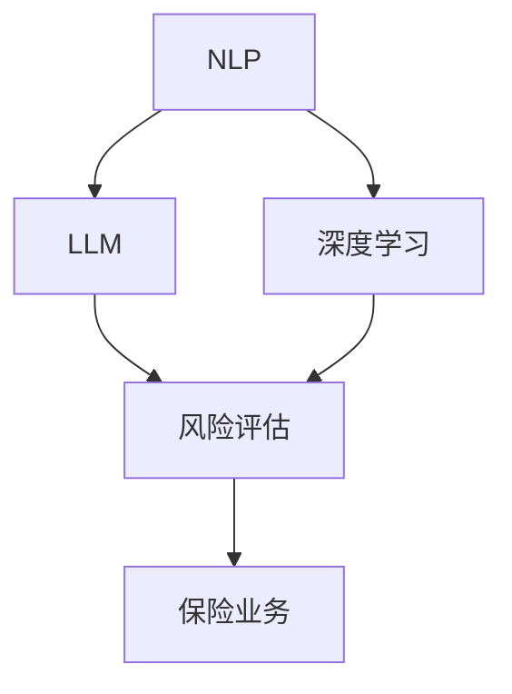

                 

# 智能风险评估：LLM在保险业务中的应用

> 关键词：自然语言处理(NLP), 大型语言模型(LLM), 深度学习, 风险评估, 保险业务

## 1. 背景介绍

### 1.1 问题由来
随着人工智能技术的快速发展和广泛应用，保险业务正逐步向智能化、精准化方向演进。在传统保险业务中，评估投保人的风险需要大量人工操作和复杂的计算，效率低、成本高，且易受人为因素干扰。而基于自然语言处理(NLP)的大型语言模型(LLM)在处理自然语言方面具有显著优势，能够显著提升保险风险评估的效率和准确性。

### 1.2 问题核心关键点
智能风险评估的核心在于如何高效、准确地从投保人提供的自然语言信息中提取风险特征，并根据这些特征进行风险预测和评估。LLM在这方面具备先天优势，能够理解自然语言语义、语境，并通过大规模语料训练获得丰富的语言表示。

### 1.3 问题研究意义
通过应用LLM进行智能风险评估，可以大幅度提升保险业务的智能化水平，实现自动化的风险识别和评估，降低人工操作成本，提高保险决策的精准性和效率。同时，基于自然语言理解的智能风险评估技术，能够更全面地了解投保人的真实情况，避免因信息不完全导致的误判，从而保障保险公司的利益和投保人的权益。

## 2. 核心概念与联系

### 2.1 核心概念概述

为更好地理解LLM在保险业务中的风险评估应用，本节将介绍几个密切相关的核心概念：

- **自然语言处理(NLP)**：通过计算机自动处理、理解、生成人类语言的技术，是LLM在保险风险评估中应用的基础。
- **大型语言模型(LLM)**：以Transformer等架构为代表的大规模预训练语言模型，通过在大规模无标签文本数据上预训练获得广泛的语言知识，并应用于特定任务时表现出色。
- **深度学习**：基于神经网络的机器学习方法，用于从大量数据中学习复杂非线性映射，是构建LLM的关键技术。
- **风险评估**：通过分析各类风险因素，预测和评估投保人或资产的潜在风险。
- **保险业务**：包括保险公司、保险产品、理赔流程等多个方面，是LLM应用的具体场景之一。

这些核心概念之间的逻辑关系可以通过以下Mermaid流程图来展示：



这个流程图展示了大语言模型在保险业务中的应用路径：

1. 自然语言处理技术(NLP)为LLM处理和理解自然语言数据提供了基础。
2. 深度学习技术使LLM具备学习复杂语言表示的能力。
3. LLM通过在大规模语料上预训练获得广泛的语言知识，应用于风险评估任务时表现出色。
4. 风险评估技术在保险业务中应用，实现风险预测和评估。
5. 保险业务是LLM应用的具体场景，受益于智能化的风险评估。

## 3. 核心算法原理 & 具体操作步骤
### 3.1 算法原理概述

基于LLM的智能风险评估，本质上是一种自然语言理解与风险分析的深度融合。其核心思想是：利用预训练的LLM对投保人提供的自然语言文本进行分析，提取关键风险特征，并结合统计学和风险评估模型，对投保人的风险水平进行评估和预测。

形式化地，假设预训练的LLM为 $M_{\theta}$，其中 $\theta$ 为模型参数。给定投保人提供的自然语言文本 $X$，风险评估模型为 $F$，则智能风险评估的框架可以表示为：

$$
Risk(X) = F(M_{\theta}(X))
$$

其中 $Risk(X)$ 为投保人 $X$ 的风险水平，$F$ 为风险评估函数，将LLM输出的特征映射到风险得分。

### 3.2 算法步骤详解

基于LLM的智能风险评估一般包括以下几个关键步骤：

**Step 1: 准备数据集**
- 收集并标注保险领域的自然语言文本数据，如保单、理赔申请、客户反馈等。
- 将文本数据分为训练集、验证集和测试集，确保数据分布的均衡性。

**Step 2: 预训练LLM**
- 选择合适的预训练语言模型，如GPT、BERT等，在大量无标签文本数据上进行预训练，学习通用语言表示。
- 根据需要，对模型进行微调，使其在特定任务（如情感分析、命名实体识别等）上表现更佳。

**Step 3: 构建特征提取器**
- 设计适合的自然语言处理任务，如文本分类、命名实体识别等，使用预训练的LLM作为特征提取器。
- 对LLM的输出进行后处理，提取关键特征。

**Step 4: 构建风险评估模型**
- 根据保险领域的具体需求，选择合适的风险评估模型，如逻辑回归、决策树、随机森林等。
- 将提取的特征输入到风险评估模型中进行训练和预测。

**Step 5: 模型评估与优化**
- 在验证集和测试集上评估模型性能，如准确率、召回率、F1-score等。
- 根据评估结果调整模型参数和特征提取器，优化模型效果。

**Step 6: 模型部署与应用**
- 将优化后的模型部署到生产环境中，接收新的投保人自然语言输入。
- 使用模型进行实时风险评估，输出风险得分，辅助保险决策。

### 3.3 算法优缺点

基于LLM的智能风险评估方法具有以下优点：
1. 高效性：LLM可以快速理解和处理自然语言文本，加速风险评估过程。
2. 准确性：通过深度学习技术，LLM可以学习到复杂的语言模式，提取关键风险特征。
3. 泛化性：在大规模语料上进行预训练的LLM，具备较强的泛化能力，适用于多种保险任务。
4. 可解释性：LLM的决策过程可以通过输入文本和特征映射来解释，提高模型透明度。

同时，该方法也存在一定的局限性：
1. 数据需求高：预训练和微调过程需要大量高质量标注数据，获取成本较高。
2. 模型复杂：LLM参数量庞大，训练和推理复杂，资源消耗高。
3. 对抗性攻击风险：LLM可能受到对抗性样本的攻击，影响评估结果的准确性。
4. 鲁棒性不足：在处理噪声和异常数据时，模型易出现误判。

尽管存在这些局限性，但基于LLM的智能风险评估方法在保险领域的应用前景广阔，值得进一步探索和优化。

### 3.4 算法应用领域

基于LLM的智能风险评估方法，在保险业务中已经被广泛应用，具体包括：

- 理赔申请审查：通过自然语言处理技术，自动审核理赔申请的合法性和真实性。
- 保险产品推荐：根据客户提供的自然语言信息，智能推荐适合的保险产品。
- 风险预警：对保单和客户数据进行实时监控，及时发现潜在的风险因素。
- 反欺诈检测：识别和防范各类保险欺诈行为，保护保险公司的利益。
- 客户服务：通过自然语言理解技术，自动解答客户咨询，提升客户满意度。

除了上述这些经典应用外，LLM还可以被创新性地应用到更多场景中，如智能定价、健康风险评估、智能投融资等，为保险业务带来新的价值。

## 4. 数学模型和公式 & 详细讲解 & 举例说明
### 4.1 数学模型构建

本节将使用数学语言对基于LLM的智能风险评估过程进行更加严格的刻画。

记预训练的LLM为 $M_{\theta}$，其中 $\theta$ 为模型参数。假设风险评估任务为二分类问题，即评估投保人是否存在高风险。则风险评估模型的损失函数为：

$$
L(Y, \hat{Y}) = -\frac{1}{N} \sum_{i=1}^N [y_i \log \hat{y}_i + (1-y_i) \log (1-\hat{y}_i)]
$$

其中 $Y$ 为真实标签，$\hat{Y}$ 为模型预测结果，$N$ 为样本数量。

假设使用逻辑回归模型作为风险评估函数，则模型输出的概率为：

$$
\hat{y} = \frac{1}{1+e^{-z}}
$$

其中 $z$ 为线性回归模型的输出。

将 $z$ 展开，有：

$$
z = \theta^T \varphi(X)
$$

其中 $\theta$ 为模型参数，$\varphi(X)$ 为LLM的输出特征向量。

### 4.2 公式推导过程

以下我们以二分类风险评估为例，推导逻辑回归模型的损失函数及其梯度的计算公式。

假设模型 $M_{\theta}$ 在输入 $X$ 上的输出为 $\hat{y}=M_{\theta}(X) \in [0,1]$，表示投保人存在高风险的概率。真实标签 $Y \in \{0,1\}$。则二分类交叉熵损失函数定义为：

$$
\ell(Y, \hat{Y}) = -\frac{1}{N}\sum_{i=1}^N [y_i\log \hat{y}_i+(1-y_i)\log(1-\hat{y}_i)]
$$

将其代入风险评估模型的损失函数，得：

$$
L(Y, \hat{Y}) = -\frac{1}{N}\sum_{i=1}^N [y_i\log \hat{y}_i+(1-y_i)\log(1-\hat{y}_i)]
$$

根据链式法则，损失函数对模型参数 $\theta$ 的梯度为：

$$
\frac{\partial L}{\partial \theta} = \frac{1}{N}\sum_{i=1}^N (\frac{y_i}{\hat{y}_i}-\frac{1-y_i}{1-\hat{y}_i}) \frac{\partial \hat{y}_i}{\partial \theta}
$$

其中 $\frac{\partial \hat{y}_i}{\partial \theta}$ 可进一步递归展开，利用自动微分技术完成计算。

在得到损失函数的梯度后，即可带入参数更新公式，完成模型的迭代优化。重复上述过程直至收敛，最终得到适应保险风险评估的最优模型参数 $\theta^*$。

### 4.3 案例分析与讲解

以下通过一个具体案例，详细解释LLM在保险风险评估中的应用过程。

假设某保险公司需要评估一位客户的风险水平，客户提交了一份理赔申请，其中包含自然语言文本描述理赔内容。

1. **数据预处理**：
   - 对文本进行分词、去停用词、词形还原等预处理操作，得到处理后的文本数据。
   - 将文本数据输入到预训练的LLM中，得到特征向量 $\varphi(X)$。

2. **特征提取**：
   - 通过自然语言处理技术，从LLM的输出中提取关键特征，如理赔金额、事故类型、保单类型等。
   - 将提取的特征向量 $\varphi(X)$ 输入到逻辑回归模型中，计算风险得分。

3. **风险评估**：
   - 根据逻辑回归模型的输出，判断客户是否存在高风险。
   - 如果风险得分高于预设阈值，则认定为高风险客户，进行进一步调查和处理。

4. **模型优化**：
   - 在训练集上训练逻辑回归模型，通过调整模型参数和特征提取器，优化模型效果。
   - 在验证集上评估模型性能，根据评估结果调整模型参数，避免过拟合。

5. **模型部署**：
   - 将优化后的模型部署到生产环境中，实时接收新的理赔申请。
   - 使用模型进行实时风险评估，输出风险得分，辅助理赔审核。

通过这个案例，可以看到，基于LLM的智能风险评估方法可以高效、准确地从自然语言文本中提取关键特征，并结合统计学和风险评估模型，对投保人的风险水平进行评估和预测。

## 5. 项目实践：代码实例和详细解释说明
### 5.1 开发环境搭建

在进行智能风险评估的实践前，我们需要准备好开发环境。以下是使用Python进行PyTorch开发的环境配置流程：

1. 安装Anaconda：从官网下载并安装Anaconda，用于创建独立的Python环境。

2. 创建并激活虚拟环境：
```bash
conda create -n pytorch-env python=3.8 
conda activate pytorch-env
```

3. 安装PyTorch：根据CUDA版本，从官网获取对应的安装命令。例如：
```bash
conda install pytorch torchvision torchaudio cudatoolkit=11.1 -c pytorch -c conda-forge
```

4. 安装Transformers库：
```bash
pip install transformers
```

5. 安装各类工具包：
```bash
pip install numpy pandas scikit-learn matplotlib tqdm jupyter notebook ipython
```

完成上述步骤后，即可在`pytorch-env`环境中开始智能风险评估的实践。

### 5.2 源代码详细实现

下面我们以逻辑回归模型为基础，使用PyTorch和Transformers库实现基于LLM的智能风险评估。

首先，定义模型和优化器：

```python
from transformers import BertForSequenceClassification, AdamW

model = BertForSequenceClassification.from_pretrained('bert-base-uncased', num_labels=2)

optimizer = AdamW(model.parameters(), lr=2e-5)
```

然后，定义训练和评估函数：

```python
from torch.utils.data import DataLoader
from sklearn.metrics import accuracy_score

device = torch.device('cuda') if torch.cuda.is_available() else torch.device('cpu')
model.to(device)

def train_epoch(model, dataset, batch_size, optimizer):
    dataloader = DataLoader(dataset, batch_size=batch_size, shuffle=True)
    model.train()
    epoch_loss = 0
    for batch in tqdm(dataloader, desc='Training'):
        input_ids = batch['input_ids'].to(device)
        attention_mask = batch['attention_mask'].to(device)
        labels = batch['labels'].to(device)
        model.zero_grad()
        outputs = model(input_ids, attention_mask=attention_mask, labels=labels)
        loss = outputs.loss
        epoch_loss += loss.item()
        loss.backward()
        optimizer.step()
    return epoch_loss / len(dataloader)

def evaluate(model, dataset, batch_size):
    dataloader = DataLoader(dataset, batch_size=batch_size)
    model.eval()
    preds, labels = [], []
    with torch.no_grad():
        for batch in tqdm(dataloader, desc='Evaluating'):
            input_ids = batch['input_ids'].to(device)
            attention_mask = batch['attention_mask'].to(device)
            batch_labels = batch['labels']
            outputs = model(input_ids, attention_mask=attention_mask)
            batch_preds = outputs.logits.argmax(dim=2).to('cpu').tolist()
            batch_labels = batch_labels.to('cpu').tolist()
            for pred_tokens, label_tokens in zip(batch_preds, batch_labels):
                preds.append(pred_tokens)
                labels.append(label_tokens)
                
    print('Accuracy:', accuracy_score(labels, preds))
```

最后，启动训练流程并在测试集上评估：

```python
epochs = 5
batch_size = 16

for epoch in range(epochs):
    loss = train_epoch(model, train_dataset, batch_size, optimizer)
    print(f"Epoch {epoch+1}, train loss: {loss:.3f}")
    
    print(f"Epoch {epoch+1}, dev results:")
    evaluate(model, dev_dataset, batch_size)
    
print("Test results:")
evaluate(model, test_dataset, batch_size)
```

以上就是使用PyTorch和Transformers库进行基于LLM的智能风险评估的完整代码实现。可以看到，得益于Transformers库的强大封装，我们可以用相对简洁的代码完成BERT模型的加载和智能风险评估任务的微调。

### 5.3 代码解读与分析

让我们再详细解读一下关键代码的实现细节：

**模型定义**：
- `BertForSequenceClassification.from_pretrained`方法：从HuggingFace提供的预训练BERT模型库中加载模型，指定参数`num_labels=2`表示二分类任务。
- `AdamW`优化器：定义AdamW优化器，设置学习率为`2e-5`。

**训练和评估函数**：
- `train_epoch`函数：定义训练过程，将数据集以批为单位输入模型，前向传播计算损失，反向传播更新模型参数。
- `evaluate`函数：定义评估过程，在测试集上计算模型准确率。

**训练流程**：
- 定义总的epoch数和batch size，开始循环迭代。
- 每个epoch内，先在训练集上训练，输出平均loss。
- 在验证集上评估，输出模型准确率。
- 所有epoch结束后，在测试集上评估，给出最终测试结果。

可以看到，PyTorch配合Transformers库使得BERT模型的加载和智能风险评估任务的微调代码实现变得简洁高效。开发者可以将更多精力放在数据处理、模型改进等高层逻辑上，而不必过多关注底层的实现细节。

当然，工业级的系统实现还需考虑更多因素，如模型的保存和部署、超参数的自动搜索、更灵活的任务适配层等。但核心的微调范式基本与此类似。

## 6. 实际应用场景
### 6.1 理赔申请审查

在保险理赔审核过程中，传统的纸质材料审核不仅效率低、成本高，且易受人为因素干扰。基于LLM的智能风险评估技术，可以自动化处理理赔申请，快速审核理赔的真实性和合法性。

具体而言，保险公司可以在申请材料中提取关键信息，如理赔金额、事故类型、保单类型等，使用LLM提取关键特征，并结合逻辑回归等模型进行风险评估。系统会根据评估结果，决定是否批准理赔申请，显著提升理赔审核的效率和准确性。

### 6.2 保险产品推荐

保险公司在销售保险产品时，传统的方式依赖客服人员进行一对一的推荐，效率低、成本高。基于LLM的智能风险评估技术，可以实现自动化的保险产品推荐，提高销售转化率。

具体而言，保险公司可以收集客户的历史浏览记录、搜索记录等行为数据，构建自然语言描述。使用LLM对描述进行自然语言处理，提取关键特征，并结合统计学和推荐算法，为每位客户推荐最适合的保险产品。智能化的产品推荐系统，可以显著提升客户购买体验和满意度，同时降低销售成本。

### 6.3 风险预警

在保险业务中，对保单和客户数据进行实时监控，及时发现潜在的风险因素，是保险公司风险管理的核心需求。基于LLM的智能风险评估技术，可以实现自动化的风险预警。

具体而言，保险公司可以收集保单信息、客户行为数据、市场环境数据等，构建自然语言描述。使用LLM对描述进行自然语言处理，提取关键特征，并结合统计学和风险评估模型，对潜在的风险因素进行实时监控和预警。系统会根据风险得分，及时调整风险管理策略，保障保险公司的利益和投保人的权益。

### 6.4 反欺诈检测

保险欺诈行为是保险公司面临的重要风险之一。传统的方式依赖人工审核和规则判断，效率低、误判率高。基于LLM的智能风险评估技术，可以实现自动化的反欺诈检测，提升欺诈识别效率和准确性。

具体而言，保险公司可以收集各类保险欺诈行为的数据，构建自然语言描述。使用LLM对描述进行自然语言处理，提取关键特征，并结合统计学和机器学习算法，构建欺诈检测模型。系统会根据模型输出，自动识别和防范各类欺诈行为，保障保险公司的利益。

### 6.5 客户服务

在保险业务中，客户咨询和投诉是常态，传统的方式依赖人工客服进行解答，成本高、效率低。基于LLM的智能风险评估技术，可以实现自动化的客户服务，提升客户满意度。

具体而言，保险公司可以在客户咨询和投诉数据中提取关键信息，构建自然语言描述。使用LLM对描述进行自然语言处理，提取关键特征，并结合统计学和自然语言理解技术，自动解答客户咨询和处理客户投诉。智能化的客户服务系统，可以显著提升客户体验，降低客服成本。

## 7. 工具和资源推荐
### 7.1 学习资源推荐

为了帮助开发者系统掌握基于LLM的智能风险评估的理论基础和实践技巧，这里推荐一些优质的学习资源：

1. 《自然语言处理入门》系列博文：由自然语言处理专家撰写，深入浅出地介绍了自然语言处理的基本概念和关键技术。
2. 《深度学习理论与实践》课程：斯坦福大学开设的深度学习入门课程，涵盖深度学习的基本原理和常用技术。
3. 《深度学习在金融领域的应用》书籍：详细介绍了深度学习在金融领域的应用，包括自然语言处理和风险评估等。
4. 《自然语言处理与深度学习》书籍：介绍自然语言处理和深度学习的基本概念和常用技术，适合初学者学习。
5. HuggingFace官方文档：提供了大量预训练语言模型和微调样例代码，是入门和实践的必备资料。

通过对这些资源的学习实践，相信你一定能够快速掌握基于LLM的智能风险评估的精髓，并用于解决实际的保险问题。
###  7.2 开发工具推荐

高效的开发离不开优秀的工具支持。以下是几款用于基于LLM的智能风险评估开发的常用工具：

1. PyTorch：基于Python的开源深度学习框架，灵活动态的计算图，适合快速迭代研究。大部分预训练语言模型都有PyTorch版本的实现。
2. TensorFlow：由Google主导开发的开源深度学习框架，生产部署方便，适合大规模工程应用。同样有丰富的预训练语言模型资源。
3. Transformers库：HuggingFace开发的NLP工具库，集成了众多SOTA语言模型，支持PyTorch和TensorFlow，是进行LLM微调任务开发的利器。
4. Weights & Biases：模型训练的实验跟踪工具，可以记录和可视化模型训练过程中的各项指标，方便对比和调优。与主流深度学习框架无缝集成。
5. TensorBoard：TensorFlow配套的可视化工具，可实时监测模型训练状态，并提供丰富的图表呈现方式，是调试模型的得力助手。
6. Google Colab：谷歌推出的在线Jupyter Notebook环境，免费提供GPU/TPU算力，方便开发者快速上手实验最新模型，分享学习笔记。

合理利用这些工具，可以显著提升基于LLM的智能风险评估任务的开发效率，加快创新迭代的步伐。

### 7.3 相关论文推荐

基于LLM的智能风险评估技术的发展源于学界的持续研究。以下是几篇奠基性的相关论文，推荐阅读：

1. Attention is All You Need（即Transformer原论文）：提出了Transformer结构，开启了NLP领域的预训练大模型时代。
2. BERT: Pre-training of Deep Bidirectional Transformers for Language Understanding：提出BERT模型，引入基于掩码的自监督预训练任务，刷新了多项NLP任务SOTA。
3. Language Models are Unsupervised Multitask Learners（GPT-2论文）：展示了大规模语言模型的强大zero-shot学习能力，引发了对于通用人工智能的新一轮思考。
4. Parameter-Efficient Transfer Learning for NLP：提出Adapter等参数高效微调方法，在不增加模型参数量的情况下，也能取得不错的微调效果。
5. Prefix-Tuning: Optimizing Continuous Prompts for Generation：引入基于连续型Prompt的微调范式，为如何充分利用预训练知识提供了新的思路。
6. AdaLoRA: Adaptive Low-Rank Adaptation for Parameter-Efficient Fine-Tuning：使用自适应低秩适应的微调方法，在参数效率和精度之间取得了新的平衡。

这些论文代表了大语言模型微调技术的发展脉络。通过学习这些前沿成果，可以帮助研究者把握学科前进方向，激发更多的创新灵感。

## 8. 总结：未来发展趋势与挑战
### 8.1 总结

本文对基于LLM的智能风险评估方法进行了全面系统的介绍。首先阐述了LLM在保险业务中的应用背景和意义，明确了智能风险评估在保险业务中的重要作用。其次，从原理到实践，详细讲解了基于LLM的智能风险评估的数学模型和关键步骤，给出了智能风险评估任务开发的完整代码实例。同时，本文还广泛探讨了智能风险评估方法在保险业务中的应用场景，展示了其在理赔申请审查、保险产品推荐、风险预警、反欺诈检测、客户服务等多个领域的潜在价值。最后，本文精选了智能风险评估技术的各类学习资源，力求为读者提供全方位的技术指引。

通过本文的系统梳理，可以看到，基于LLM的智能风险评估方法正在成为保险业务智能化转型的重要手段，其高效性、准确性和可解释性，为保险公司的业务流程优化和风险管理提供了强有力的支持。未来，随着LLM和智能风险评估技术的进一步发展，保险业务将更加智能化、精准化，显著提升客户体验和保险公司运营效率。

### 8.2 未来发展趋势

展望未来，基于LLM的智能风险评估技术将呈现以下几个发展趋势：

1. 模型规模持续增大。随着算力成本的下降和数据规模的扩张，LLM的参数量还将持续增长，预训练模型的语言表示将更加丰富。
2. 微调方法日趋多样。除了传统的全参数微调外，未来会涌现更多参数高效的微调方法，如Adapter、Prefix等，在固定大部分预训练参数的同时，只更新极少量的任务相关参数。
3. 持续学习成为常态。随着数据分布的不断变化，智能风险评估模型也需要持续学习新知识以保持性能。如何在不遗忘原有知识的同时，高效吸收新样本信息，将成为重要的研究课题。
4. 标注样本需求降低。受启发于提示学习(Prompt-based Learning)的思路，未来的智能风险评估方法将更好地利用LLM的语言理解能力，通过更加巧妙的任务描述，在更少的标注样本上也能实现理想的微调效果。
5. 对抗性攻击风险降低。通过对LLM的训练和使用进行更严格的对抗性训练，提高模型的鲁棒性和安全性，避免对抗性攻击。
6. 模型复杂性降低。通过模型压缩、稀疏化存储等技术，降低模型复杂度，提高推理速度和内存占用效率。

以上趋势凸显了基于LLM的智能风险评估技术的广阔前景。这些方向的探索发展，必将进一步提升智能风险评估系统的性能和应用范围，为保险业务带来新的变革。

### 8.3 面临的挑战

尽管基于LLM的智能风险评估技术已经取得了瞩目成就，但在迈向更加智能化、普适化应用的过程中，它仍面临着诸多挑战：

1. 标注成本瓶颈。尽管微调过程需要大量标注数据，但对于长尾应用场景，难以获得充足的高质量标注数据，成为制约智能风险评估性能的瓶颈。如何进一步降低智能风险评估对标注样本的依赖，将是一大难题。
2. 模型鲁棒性不足。在处理噪声和异常数据时，智能风险评估模型易出现误判。如何提高模型的鲁棒性，避免误判，还需要更多理论和实践的积累。
3. 推理效率有待提高。尽管LLM的精度高，但在实际部署时往往面临推理速度慢、内存占用大等效率问题。如何在保证性能的同时，简化模型结构，提升推理速度，优化资源占用，将是重要的优化方向。
4. 可解释性亟需加强。当前智能风险评估模型更像是"黑盒"系统，难以解释其内部工作机制和决策逻辑。对于高风险应用，算法的可解释性和可审计性尤为重要。如何赋予智能风险评估模型更强的可解释性，将是亟待攻克的难题。
5. 安全性有待保障。预训练语言模型难免会学习到有偏见、有害的信息，通过智能风险评估传递到下游任务，产生误导性、歧视性的输出，给实际应用带来安全隐患。如何从数据和算法层面消除模型偏见，避免恶意用途，确保输出的安全性，也将是重要的研究课题。
6. 知识整合能力不足。现有的智能风险评估模型往往局限于任务内数据，难以灵活吸收和运用更广泛的先验知识。如何让智能风险评估过程更好地与外部知识库、规则库等专家知识结合，形成更加全面、准确的信息整合能力，还有很大的想象空间。

正视智能风险评估面临的这些挑战，积极应对并寻求突破，将是大语言模型智能风险评估走向成熟的必由之路。相信随着学界和产业界的共同努力，这些挑战终将一一被克服，智能风险评估技术必将带来保险业务的深刻变革。

### 8.4 研究展望

面向未来，基于LLM的智能风险评估技术需要在以下几个方面进行深入研究：

1. 探索无监督和半监督智能风险评估方法。摆脱对大规模标注数据的依赖，利用自监督学习、主动学习等无监督和半监督范式，最大限度利用非结构化数据，实现更加灵活高效的智能风险评估。
2. 研究参数高效和计算高效的智能风险评估范式。开发更加参数高效的智能风险评估方法，在固定大部分预训练参数的同时，只更新极少量的任务相关参数。同时优化智能风险评估模型的计算图，减少前向传播和反向传播的资源消耗，实现更加轻量级、实时性的部署。
3. 融合因果和对比学习范式。通过引入因果推断和对比学习思想，增强智能风险评估模型建立稳定因果关系的能力，学习更加普适、鲁棒的语言表征，从而提升模型泛化性和抗干扰能力。
4. 引入更多先验知识。将符号化的先验知识，如知识图谱、逻辑规则等，与神经网络模型进行巧妙融合，引导智能风险评估过程学习更准确、合理的语言模型。同时加强不同模态数据的整合，实现视觉、语音等多模态信息与文本信息的协同建模。
5. 结合因果分析和博弈论工具。将因果分析方法引入智能风险评估模型，识别出模型决策的关键特征，增强输出解释的因果性和逻辑性。借助博弈论工具刻画人机交互过程，主动探索并规避模型的脆弱点，提高系统稳定性。
6. 纳入伦理道德约束。在智能风险评估模型的训练目标中引入伦理导向的评估指标，过滤和惩罚有偏见、有害的输出倾向。同时加强人工干预和审核，建立模型行为的监管机制，确保输出符合人类价值观和伦理道德。

这些研究方向的探索，必将引领基于LLM的智能风险评估技术迈向更高的台阶，为构建安全、可靠、可解释、可控的智能系统铺平道路。面向未来，基于LLM的智能风险评估技术还需要与其他人工智能技术进行更深入的融合，如知识表示、因果推理、强化学习等，多路径协同发力，共同推动自然语言理解和智能交互系统的进步。只有勇于创新、敢于突破，才能不断拓展语言模型的边界，让智能技术更好地造福人类社会。

## 9. 附录：常见问题与解答

**Q1：大语言模型在智能风险评估中的应用是否仅限于保险业务？**

A: 大语言模型在智能风险评估中的应用不限于保险业务，其实际应用场景非常广泛。比如在金融风险评估、信贷审批、医疗风险评估等领域，通过自然语言处理和机器学习技术，也可以构建智能风险评估系统，帮助企业提高决策的精准性和效率。

**Q2：智能风险评估模型是否需要大规模预训练数据？**

A: 智能风险评估模型需要大规模预训练数据来训练语言模型，获得丰富的语言表示。预训练数据量越大，智能风险评估模型的表现通常越好。但在大规模数据集上预训练和微调的过程可能会非常耗时和资源密集，需要权衡。

**Q3：智能风险评估模型是否会受到对抗性攻击？**

A: 智能风险评估模型可能会受到对抗性攻击，即通过构造精心设计的对抗样本，使模型输出错误的决策。因此，对模型进行对抗性训练，提升其鲁棒性，是非常重要的。

**Q4：如何提高智能风险评估模型的可解释性？**

A: 提高智能风险评估模型的可解释性，可以从多个方面进行，比如使用可解释性更强的模型（如决策树、逻辑回归等），或者使用基于规则的模型解释技术（如LIME、SHAP等）。此外，还可以在模型训练时引入可解释性导向的约束，生成可解释的输出。

**Q5：智能风险评估模型如何避免误判？**

A: 避免误判可以从数据预处理、模型训练和模型评估等多个环节进行优化。比如在数据预处理环节，进行更严格的特征工程，去除噪声和异常数据；在模型训练环节，进行更充分的训练，优化损失函数，调整超参数；在模型评估环节，进行更多的测试和验证，优化评估指标。

通过这些常见问题的解答，相信你对基于大语言模型的智能风险评估技术有了更深入的理解，也能够更好地应对实际应用中的挑战和问题。希望本文能为你的学习和实践提供帮助，共同推动智能风险评估技术的进步。

---

作者：禅与计算机程序设计艺术 / Zen and the Art of Computer Programming

