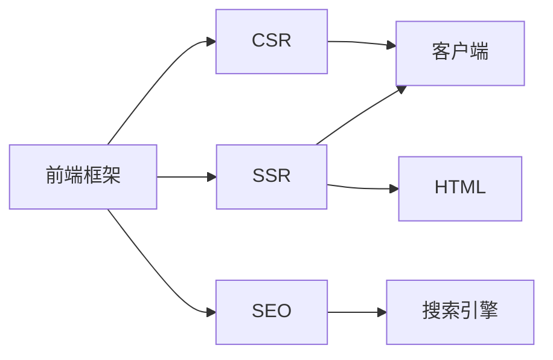

                 

# 服务器端渲染（SSR）：提升首屏加载速度

> 关键词：服务器端渲染, 首屏加载速度, 性能优化, 前端开发, 用户体验

## 1. 背景介绍

在当前的互联网应用中，网页的加载速度是决定用户体验的关键因素之一。首屏加载时间（First Contentful Paint, FCP）直接影响着用户对网页的感知和行为。随着内容服务的复杂性不断增加，如何在保证内容丰富性和交互性提升的同时，不牺牲页面加载速度，成为了前端开发者面临的重大挑战。服务器端渲染（Server Side Rendering, SSR）技术，通过将前端渲染逻辑放到服务器端执行，能在一定程度上缓解页面渲染压力，提升首屏加载速度，改善用户体验。

### 1.1 问题由来
随着Web技术的不断发展，传统的客户端渲染（Client Side Rendering, CSR）方式已逐渐暴露出一些性能瓶颈：

- **白屏时间过长**：CSR模式下，页面内容需要在客户端浏览器中渲染，当浏览器接收到服务器响应时，仍需要解析、渲染DOM树和应用层逻辑，这个过程需要一定的时间，导致页面出现白屏。
- ** SEO 优化困难**：CSR模式下，页面需要等待浏览器解析和渲染后才能被搜索引擎抓取，因此对于搜索引擎优化（SEO）效果较差。
- ** 页面交互卡顿**：当页面内容过于复杂时，客户端渲染机制容易出现卡顿现象，影响用户交互体验。
- ** 首屏加载时间长**：尤其是对于复杂的单页应用（SPA），首屏加载时间较长，影响用户体验。

针对这些问题，服务器端渲染技术应运而生，通过提前在服务器端生成完整的HTML页面，再将渲染好的页面发送给客户端，从而大幅提升首屏加载速度和SEO效果。

### 1.2 问题核心关键点
SSR技术能够通过将前端渲染逻辑放到服务器端执行，减少客户端渲染时间，提升首屏加载速度。其实现的核心关键点包括：

- ** 服务器渲染**：通过服务器端运行前端代码，生成完整的HTML页面。
- ** 增量更新**：仅对页面发生变化的部分进行重新渲染，而非重新渲染整个页面。
- ** SEO 友好**：渲染后的页面直接发送给搜索引擎，提升搜索引擎抓取效率。
- ** 双端渲染**：兼顾CSR和SSR的优点，结合两者的长处，优化用户体验。

这些关键点使得SSR成为提升首屏加载速度、优化用户体验的重要手段。

## 2. 核心概念与联系

### 2.1 核心概念概述

为了更好地理解SSR的原理和实现方式，本节将介绍几个关键概念：

- ** 服务器端渲染 (SSR)**：通过服务器端生成HTML页面，并将渲染结果发送给客户端，从而提升页面加载速度和SEO效果。
- ** 客户端渲染 (CSR)**：在浏览器中通过执行JavaScript代码生成HTML页面，实现动态内容展示。
- ** 双端渲染 (SSG/SSR+CSR)**：结合SSR和CSR的优点，提升页面加载速度和用户体验。
- ** SEO (搜索引擎优化)**：通过优化页面加载速度、提升搜索引擎抓取效率，提高网站在搜索引擎中的排名。

这些核心概念之间的逻辑关系可以通过以下Mermaid流程图来展示：



这个流程图展示了几者之间的基本关系：

1. 前端框架在客户端执行CSR渲染，生成页面。
2. 同时，前端框架调用服务器端执行SSR渲染，生成HTML。
3. 最终，服务器将渲染后的HTML页面发送给客户端。
4. 搜索引擎直接抓取SSR渲染的HTML页面，提升抓取效率。

## 3. 核心算法原理 & 具体操作步骤
### 3.1 算法原理概述

服务器端渲染的核心原理是利用服务器资源进行页面渲染，减少客户端负担。SSR技术的实现流程如下：

1. ** 客户端请求**：浏览器向服务器发送请求。
2. ** 服务器响应**：服务器根据请求内容，运行前端代码生成HTML页面。
3. ** 传输HTML**：服务器将渲染好的HTML页面发送给浏览器。
4. ** 客户端展示**：浏览器接收HTML页面，展示渲染结果。

这个流程中，关键点在于如何高效地将前端代码运行在服务器端，生成HTML页面。常见的实现方式包括：

- ** 服务器渲染引擎**：利用专门的渲染引擎，将前端代码转化为HTML页面。
- ** 中间件实现**：通过编写中间件，实现前后端数据的传输和处理。
- ** 服务端计算工具**：如Node.js、Gatsby等，提供前端代码运行的运行时环境。

### 3.2 算法步骤详解

以下是SSR技术的主要实现步骤：

1. ** 构建服务器环境**：选择合适的服务器环境，如Node.js、Django等，提供前端代码的运行环境。
2. ** 开发前端代码**：使用React、Vue等前端框架，开发页面逻辑和UI部分。
3. ** 集成中间件**：使用Express、Koa等中间件，实现服务器端和客户端的通信。
4. ** 实现服务器渲染**：使用Nuxt.js、Gatsby等框架，自动生成HTML页面。
5. ** 发布部署**：将渲染好的HTML页面部署到服务器，提供给客户端展示。

### 3.3 算法优缺点

SSR技术在提升首屏加载速度和SEO效果方面具有显著优势，但也存在一些局限性：

**优点：**

- ** 提升首屏加载速度**：通过服务器端提前渲染，减少客户端渲染时间，提升首屏加载速度。
- ** SEO 优化**：渲染后的页面直接发送给搜索引擎，提升抓取效率。
- ** 提升用户体验**：双端渲染模式下，结合CSR和SSR的优点，优化用户体验。

**缺点：**

- ** 服务器性能要求高**：服务器需要处理大量的前端代码，对服务器性能要求较高。
- ** 维护成本高**：需要同时维护前后端代码，增加了开发和维护成本。
- ** 数据共享困难**：前后端数据共享需要额外设计和实现，增加开发难度。

### 3.4 算法应用领域

SSR技术主要应用于对首屏加载速度和SEO效果要求较高的Web应用中，包括：

- ** 电子商务网站**：需要快速响应客户请求，提升购物体验。
- ** 新闻门户网站**：需快速展示新闻内容，提升用户体验。
- ** 在线教育平台**：需快速展示教学资源，提升学习效果。
- ** 企业内部应用**：需快速展示工作内容，提升工作效率。

## 4. 数学模型和公式 & 详细讲解 & 举例说明
### 4.1 数学模型构建

SSR技术主要关注如何高效生成HTML页面，提升首屏加载速度和SEO效果。以下是一个简单的数学模型，用于描述SSR渲染过程：

设页面渲染时间为 $T$，客户端渲染时间为 $t$，服务器渲染时间为 $s$，则有：

$$ T = s + t $$

其中 $s$ 远小于 $t$，即服务器渲染时间远小于客户端渲染时间。

### 4.2 公式推导过程

通过上述模型，我们可以推导出如下公式：

$$ T_{\text{min}} = s $$

即通过服务器端渲染，页面加载时间可以最小化到服务器渲染时间，显著提升首屏加载速度。

### 4.3 案例分析与讲解

以Gatsby为例，分析SSR的实现过程：

1. ** 构建项目**：使用Gatsby构建Web应用，自动生成HTML页面。
2. ** 开发前端代码**：使用React、Vue等前端框架，开发页面逻辑和UI部分。
3. ** 集成中间件**：使用Express、Koa等中间件，实现服务器端和客户端的通信。
4. ** 发布部署**：将渲染好的HTML页面部署到服务器，提供给客户端展示。

通过上述过程，Gatsby将前端代码运行在服务器端，自动生成HTML页面，显著提升了首屏加载速度和SEO效果。

## 5. 项目实践：代码实例和详细解释说明
### 5.1 开发环境搭建

在进行SSR实践前，我们需要准备好开发环境。以下是使用Node.js和Express搭建SSR环境的步骤：

1. 安装Node.js：从官网下载并安装Node.js，提供前端代码的运行环境。
2. 安装Express：使用npm安装Express，提供中间件的实现。
3. 安装依赖包：使用npm安装依赖包，如react、react-dom等。
4. 创建项目结构：创建项目文件夹，包括src、build、public等子目录。

### 5.2 源代码详细实现

以下是使用React和Express实现SSR的代码实现：

```javascript
// 前端代码
import React from 'react';
import ReactDOMServer from 'react-dom/server';

function App() {
  return (
    <div>
      <h1>Hello World</h1>
    </div>
  );
}

// 服务器端渲染
import express from 'express';
import React from 'react';
import ReactDOMServer from 'react-dom/server';

const app = express();

app.get('/', (req, res) => {
  const html = ReactDOMServer.renderToString(<App />);
  res.send(`
    <html>
      <head><title>Hello World</title></head>
      <body>
        ${html}
      </body>
    </html>
  `);
});

app.listen(3000, () => {
  console.log('Server listening on port 3000');
});
```

### 5.3 代码解读与分析

**App.js**：
- 定义一个简单的React组件，用于渲染页面内容。

**server.js**：
- 使用Express框架，监听请求，调用ReactDOMServer.renderToString方法将React组件渲染为HTML字符串。
- 将渲染好的HTML字符串嵌入到完整的HTML页面中，发送给客户端。

### 5.4 运行结果展示

启动服务器后，在浏览器访问`http://localhost:3000`，即可看到渲染后的页面内容，展示了SSR的渲染效果。

## 6. 实际应用场景
### 6.1 电商网站

电商网站对首屏加载速度和SEO效果要求较高。通过SSR技术，电商网站可以在服务器端提前渲染商品展示页面，显著提升页面加载速度，提升用户购物体验。

### 6.2 新闻门户

新闻门户网站需快速展示新闻内容，提升用户体验。SSR技术可以通过提前渲染新闻文章，快速展示页面内容，提升用户阅读效率。

### 6.3 在线教育

在线教育平台需快速展示教学资源，提升学习效果。SSR技术可以提前渲染课程内容，减少用户等待时间，提升学习体验。

### 6.4 企业应用

企业内部应用需快速展示工作内容，提升工作效率。SSR技术可以提前渲染页面内容，减少用户等待时间，提升工作效率。

## 7. 工具和资源推荐
### 7.1 学习资源推荐

以下是一些推荐的SSR学习资源，可以帮助开发者系统掌握SSR技术：

1. **《SSR原理与实践》系列博文**：由前端大牛撰写，深入浅出地介绍了SSR原理、实现方法和优化策略。
2. **Gatsby官方文档**：提供全面的SSR框架文档，包括安装、配置、使用等详细信息。
3. **《前端性能优化实战》书籍**：介绍了一系列前端性能优化技术，包括SSR、懒加载、CDN等。
4. **React官方文档**：提供全面的React框架文档，包括服务器渲染、React Router等。
5. **《JavaScript框架开发实战》书籍**：深入讲解了Node.js、Express、React等前端开发工具的原理和应用。

### 7.2 开发工具推荐

以下是一些推荐的SSR开发工具，可以帮助开发者高效开发SSR项目：

1. **Node.js**：提供JavaScript运行环境，适合SSR项目开发。
2. **Express**：提供中间件支持，适合SSR项目后端开发。
3. **React**：提供前端开发框架，适合SSR项目前端开发。
4. **Gatsby**：提供自动生成HTML页面的SSR框架，适合SSR项目开发。
5. **Webpack**：提供模块化打包工具，适合SSR项目打包构建。

### 7.3 相关论文推荐

SSR技术的发展源于学界的持续研究。以下是几篇奠基性的相关论文，推荐阅读：

1. **《Server-Side Rendering: A New Approach for Dynamic Content》**：提出SSR技术，通过服务器端提前渲染，提升页面加载速度。
2. **《Gatsby: A new SSR framework》**：介绍Gatsby框架，提供自动生成HTML页面的SSR解决方案。
3. **《Fastify: Fast and Low-overhead Node.js Web Framework》**：介绍Fastify框架，提供高效的SSR渲染引擎。
4. **《React Server Components: A server component model》**：提出React Server Components，提供基于React的SSR渲染方案。
5. **《Universal React Router》**：介绍Universal React Router，提供全面的SSR支持。

## 8. 总结：未来发展趋势与挑战
### 8.1 总结

本文对服务器端渲染（SSR）技术进行了全面系统的介绍。首先阐述了SSR技术的背景和意义，明确了SSR在提升首屏加载速度、优化用户体验方面的独特价值。其次，从原理到实践，详细讲解了SSR的数学模型和实现步骤，给出了SSR项目开发的完整代码实例。同时，本文还探讨了SSR技术在电商、新闻、教育、企业等多个行业领域的应用前景，展示了SSR技术的巨大潜力。

通过本文的系统梳理，可以看到，SSR技术已经成为提升页面加载速度、优化用户体验的重要手段。服务器端提前渲染HTML页面，显著减少了客户端渲染时间，提升了首屏加载速度和SEO效果。未来，伴随SSR技术的持续演进，相信Web应用将更加流畅、高效、用户友好。

### 8.2 未来发展趋势

展望未来，SSR技术将呈现以下几个发展趋势：

1. ** 更高效的渲染引擎**：随着技术进步，渲染引擎将更加高效，能够处理更复杂的HTML和CSS，提升渲染速度。
2. ** 更灵活的配置选项**：开发工具将提供更丰富的配置选项，方便开发者进行SSR优化。
3. ** 更好的用户体验**：结合CSR和SSR的优点，提升用户体验，增强用户粘性。
4. ** 更广泛的适用性**：SSR技术将应用于更多领域，如游戏、社交网络等。
5. ** 更高的性能要求**：随着应用场景的复杂性增加，对SSR的性能要求将更高，需要不断优化算法和代码。

以上趋势凸显了SSR技术的广阔前景。这些方向的探索发展，必将进一步提升Web应用的用户体验，带来更好的用户交互体验。

### 8.3 面临的挑战

尽管SSR技术已经取得了显著进展，但在迈向更加智能化、普适化应用的过程中，仍面临以下挑战：

1. ** 服务器性能瓶颈**：大规模的Web应用需要处理大量前端代码，对服务器性能要求较高，需要优化算法和代码以提高性能。
2. ** 数据共享困难**：前后端数据共享需要额外设计和实现，增加开发难度。
3. ** 用户体验不一致**：CSR和SSR结合时，用户体验可能出现不一致，需要进行全面的测试和优化。
4. ** SEO 优化复杂**：SSR渲染的HTML页面需要合理设计，才能满足搜索引擎抓取要求。
5. ** 开发和维护成本高**：SSR需要同时维护前后端代码，增加了开发和维护成本。

### 8.4 未来突破

面对SSR面临的这些挑战，未来的研究需要在以下几个方面寻求新的突破：

1. ** 优化渲染引擎**：开发更高效的渲染引擎，提升渲染速度和质量。
2. ** 提升数据共享能力**：开发数据共享机制，方便前后端数据共享。
3. ** 优化用户体验**：通过全面的测试和优化，提升用户体验的一致性。
4. ** 简化SEO优化**：提供自动化的SEO优化工具，简化SSR渲染的HTML页面设计。
5. ** 降低开发成本**：开发易于维护的SSR框架，降低开发和维护成本。

这些研究方向将推动SSR技术的进一步发展，使其能够更好地应用于Web应用中，提升用户体验和页面加载速度。总之，SSR技术在未来Web应用中仍将发挥重要作用，需要不断创新和优化，才能真正实现其应用潜力。

## 9. 附录：常见问题与解答

**Q1：SSR技术是否适用于所有Web应用？**

A: SSR技术适用于对首屏加载速度和SEO效果要求较高的Web应用，如电商、新闻、在线教育等。但对于实时性要求高、用户交互频繁的应用，如聊天应用、游戏等，可能需要结合CSR和SSR的优点，采用双端渲染技术。

**Q2：SSR技术是否影响SEO效果？**

A: SSR技术可以显著提升SEO效果，因为渲染后的页面直接发送给搜索引擎，提高了搜索引擎抓取效率。但需要注意，渲染的HTML页面需要合理设计，才能满足搜索引擎抓取要求。

**Q3：SSR技术是否需要额外的开发成本？**

A: SSR技术需要同时维护前后端代码，增加了开发和维护成本。但通过使用现成的SSR框架，如Gatsby、Nuxt.js等，可以降低开发成本。

**Q4：SSR技术是否影响用户体验？**

A: SSR技术可以提升首屏加载速度和SEO效果，但需要在CSR和SSR之间进行权衡，避免用户体验不一致。通过全面的测试和优化，可以提升用户体验的一致性。

---

作者：禅与计算机程序设计艺术 / Zen and the Art of Computer Programming

