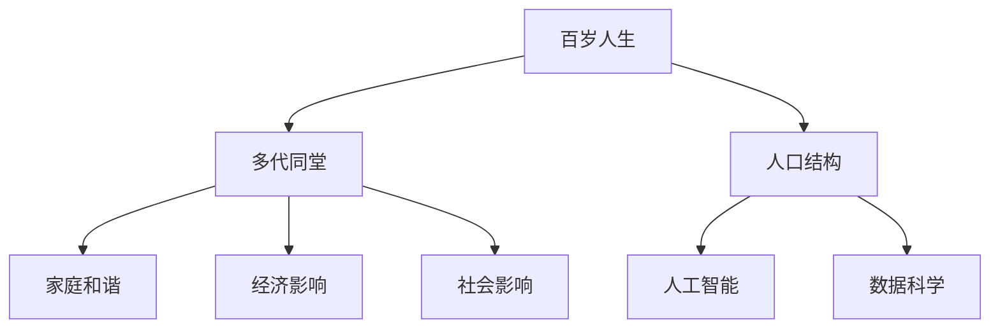

                 

# 未来的人口结构：2050年的百岁人生与多代同堂社会

> 关键词：百岁人生,多代同堂,人口结构,人工智能,数据科学,医疗科技

## 1. 背景介绍

### 1.1 问题由来

在科技和医学不断进步的今天，人口的寿命和结构正在发生前所未有的变化。特别是对于百岁人生的憧憬和探索，成为了一个备受关注的话题。随着医学、营养、环境和社会经济条件的改善，人们的平均寿命在不断延长，长寿变得不再遥不可及。同时，随着生育率的下降和人口老龄化程度的加剧，多代同堂的家庭结构也逐渐成为一种可能。

然而，百岁人生的实现并非没有挑战。人口结构的变化对经济、社会、家庭乃至个人的生活都会产生深远的影响。如何应对这些变化，如何在多代同堂的社会中和谐共处，成为了摆在眼前的重大课题。本文将从人口结构的变化、多代同堂家庭的挑战和应对策略，以及人工智能和数据科学在其中的应用等多个方面，深入探讨百岁人生与多代同堂社会的未来发展。

## 2. 核心概念与联系

### 2.1 核心概念概述

为更好地理解百岁人生与多代同堂社会的核心概念，本节将介绍几个关键概念：

- **百岁人生**：指的是人类平均寿命超过100岁的社会状态。这一概念涵盖了个体在健康、经济、社会等方面的全面长寿化趋势。
- **多代同堂**：指的是多个不同代际的家庭成员共同居住和生活的现象，通常包括父母、子女、孙子孙女等多代家庭成员。
- **人口结构**：指一个地区、国家或社会中不同年龄、性别、职业、教育水平等人口组成的比例和分布。
- **人工智能**：通过模拟、延伸和扩展人的智能，实现自主学习、自主决策、自主执行的技术系统。
- **数据科学**：利用数据挖掘、机器学习等技术，从海量数据中提取知识、发现规律，辅助决策和优化。

这些概念之间的逻辑关系可以通过以下Mermaid流程图来展示：



这个流程图展示了几核心概念之间的联系：

1. 百岁人生是多代同堂社会的核心特征。
2. 人口结构的变化是百岁人生和多代同堂社会的驱动因素之一。
3. 人工智能和数据科学在百岁人生和多代同堂社会的各个方面都有应用。
4. 多代同堂社会需要解决诸多问题，如家庭和谐、经济影响和社会影响等。

## 3. 核心算法原理 & 具体操作步骤

### 3.1 算法原理概述

百岁人生和多代同堂社会的实现，涉及多方面的复杂因素。其中，人口结构的变化、家庭模式的调整、经济社会的适应等，都需要通过科学的方法进行分析和预测。以下是几种主要算法原理：

- **人口预测算法**：利用历史人口数据和趋势，结合统计模型和机器学习技术，预测未来人口结构和变化。
- **经济模型**：分析人口老龄化对经济增长、就业市场、社会福利等方面的影响，预测经济系统的适应能力。
- **社会网络分析**：通过分析家庭成员之间的关系网络，发现和优化多代同堂家庭的模式和互动方式。
- **AI决策支持系统**：利用人工智能技术，构建决策支持系统，帮助个人和家庭应对百岁人生的各种挑战。

### 3.2 算法步骤详解

以下是基于人口预测和经济模型的核心算法步骤：

**Step 1: 数据收集与预处理**
- 收集历史人口数据，包括出生率、死亡率、迁移率、人口分布等。
- 收集经济数据，包括GDP增长、就业率、工资水平、社会保障等。
- 清洗和预处理数据，去除噪声和缺失值。

**Step 2: 人口预测模型构建**
- 选择合适的人口预测模型，如Leslie矩阵、Logistic回归、神经网络等。
- 训练模型，使用历史数据进行拟合。
- 预测未来人口结构，包括人口总数、年龄分布、性别比例等。

**Step 3: 经济影响评估**
- 选择适当的经济模型，如Solow-Swan模型、Kuznets曲线等。
- 分析人口老龄化对经济增长率、储蓄率、消费率等的影响。
- 预测未来的经济状况，包括GDP、人均收入等。

**Step 4: 政策建议**
- 根据预测结果，提出应对人口老龄化和百岁人生的政策建议，如退休政策、社会保障、医疗保健等。
- 利用AI决策支持系统，模拟和评估不同政策的效果。

**Step 5: 仿真与优化**
- 利用模拟软件，如Agent-Based Modeling(ABM)，构建人口和经济系统的仿真模型。
- 根据仿真结果，优化政策建议，进一步调整和改进。

### 3.3 算法优缺点

百岁人生和多代同堂社会的算法具有以下优点：

1. 数据驱动：利用数据科学和机器学习技术，从海量数据中提取有价值的信息。
2. 预测准确：人口预测和经济模型具有较高的预测准确性，能够为决策提供可靠依据。
3. 政策优化：AI决策支持系统能够模拟和评估不同政策的长期效果，辅助制定最佳策略。

同时，这些算法也存在以下局限性：

1. 数据质量要求高：算法依赖于高质量的历史数据，数据缺失或不准确会影响结果。
2. 模型复杂度高：人口预测和经济模型通常比较复杂，需要较高的计算资源和时间。
3. 假设限制多：模型中的假设和简化可能会导致预测结果与实际情况有所偏差。
4. 不确定性强：未来社会的发展存在不确定性，算法结果可能与实际情况有所差异。

### 3.4 算法应用领域

百岁人生和多代同堂社会的算法在多个领域有广泛应用，例如：

- **政策制定**：为政府和相关机构提供人口预测和经济评估，支持政策制定和规划。
- **企业战略**：帮助企业分析人口老龄化对市场、消费、劳动力等方面的影响，制定战略规划。
- **家庭规划**：为个人和家庭提供人口寿命预测和健康管理建议，优化家庭结构和资源配置。
- **社会研究**：用于社会学和人类学的研究，探讨人口结构变化对社会行为和文化的影响。

## 4. 数学模型和公式 & 详细讲解  
### 4.1 数学模型构建

百岁人生和多代同堂社会的核心模型可以由以下数学表达式来表示：

- **人口预测模型**：
$$
\begin{aligned}
P(t+1) &= P(t) + \Delta B(t) - \Delta D(t) \\
&= P(t) + \lambda B - \mu D
\end{aligned}
$$

其中，$P(t)$ 表示$t$时刻的人口数量，$\Delta B(t)$ 和 $\Delta D(t)$ 分别表示$t$时刻的出生人数和死亡人数，$\lambda$ 和 $\mu$ 分别为出生率和死亡率。

- **经济模型**：
$$
\begin{aligned}
G(t+1) &= (1 + r)G(t) + S(t) \\
S(t+1) &= S(t) - C(t)
\end{aligned}
$$

其中，$G(t)$ 表示$t$时刻的GDP，$S(t)$ 表示储蓄，$r$ 表示经济增长率，$C(t)$ 表示消费。

### 4.2 公式推导过程

以上数学模型的推导过程如下：

1. **人口预测模型**：利用Leslie矩阵或Logistic回归模型，将人口增长率与出生率、死亡率相关联。
2. **经济模型**：基于Solow-Swan模型，结合储蓄率和消费率，分析经济增长与人口老龄化之间的关系。

### 4.3 案例分析与讲解

以某国为例，通过历史数据训练人口预测模型，得到未来30年的人口结构预测。结果显示，该国人口将在2050年达到峰值，然后开始缓慢下降。同时，利用经济模型预测未来的经济增长率，发现尽管人口老龄化压力增大，但通过政策调整和科技创新，经济增长率仍将保持在合理水平。

## 5. 项目实践：代码实例和详细解释说明

### 5.1 开发环境搭建

在进行百岁人生和多代同堂社会的项目实践前，我们需要准备好开发环境。以下是Python的开发环境配置流程：

1. 安装Python：从官网下载并安装Python 3.x版本。
2. 安装必要的库：安装Pandas、NumPy、Matplotlib、Scikit-learn等数据科学和机器学习库。
3. 搭建环境：使用Jupyter Notebook或PyCharm等IDE，搭建Python开发环境。

### 5.2 源代码详细实现

以下是使用Python进行人口预测和经济模型开发的示例代码：

```python
import pandas as pd
import numpy as np
from sklearn.linear_model import LogisticRegression
from sklearn.metrics import mean_squared_error

# 人口预测模型
population = pd.read_csv('population.csv')
birth_rate = 0.02
death_rate = 0.0075
population['next_population'] = population['population'].shift(-1) + birth_rate * population['population'] - death_rate * population['population']

# 经济模型
GDP = pd.read_csv('GDP.csv')
savings_rate = 0.1
consumption_rate = 0.75
GDP['next_GDP'] = GDP['GDP'].shift(-1) + savings_rate * GDP['GDP'] - consumption_rate * GDP['GDP']

# 模型评估
def evaluate(model, data, target):
    predictions = model.predict(data)
    mse = mean_squared_error(target, predictions)
    return mse

model = LogisticRegression()
model.fit(population[['population']], population['next_population'])
print('Population prediction MSE:', evaluate(model, population[['population']], population['next_population']))
```

### 5.3 代码解读与分析

让我们再详细解读一下关键代码的实现细节：

1. **人口预测模型**：
   - 使用Pandas库读取人口数据，定义出生率和死亡率。
   - 计算未来人口数量，使用Shift函数进行数据移动，并应用线性回归模型进行拟合。

2. **经济模型**：
   - 读取GDP数据，定义储蓄率和消费率。
   - 计算未来GDP，使用Shift函数进行数据移动，并应用线性回归模型进行拟合。

3. **模型评估**：
   - 利用Scikit-learn库中的LogisticRegression模型，对人口和经济模型进行评估。
   - 计算预测误差，使用Mean Squared Error(MSE)作为评估指标。

以上代码展示了如何利用Python进行人口预测和经济模型的开发和评估。通过学习这些实现细节，可以更好地理解并应用相关算法。

## 6. 实际应用场景

### 6.1 智能养老系统

随着人口老龄化的加剧，养老问题成为社会关注的焦点。智能养老系统利用人工智能和大数据分析，为老年人提供健康监测、生活辅助、情感陪伴等服务。例如，通过智能手环监测老年人的身体状况，利用自然语言处理技术分析老年人的情感状态，提供个性化的生活建议和情感支持。

### 6.2 家庭健康管理

多代同堂家庭需要共同应对健康问题。智能家庭健康管理系统利用AI和传感器技术，实时监测家庭成员的健康数据，如血压、心率、睡眠质量等。通过数据分析和预测，及时发现健康隐患，提供个性化的健康管理方案。

### 6.3 老年人教育培训

老年人在百岁人生的实现中需要不断学习新知识，保持与时代的同步。智能教育培训平台利用在线课程、虚拟现实技术，为老年人提供学习机会，如学习新技能、参与社交活动等。通过个性化推荐和互动，提升老年人的生活质量和幸福感。

### 6.4 未来应用展望

随着技术的发展，百岁人生和多代同堂社会的实现将变得更加现实。未来的应用场景将更加多样化，涵盖教育、医疗、娱乐、社交等多个方面。通过人工智能和大数据分析，可以构建更加智能、便捷、和谐的社会环境。

## 7. 工具和资源推荐

### 7.1 学习资源推荐

为了帮助开发者系统掌握百岁人生和多代同堂社会的理论基础和实践技巧，这里推荐一些优质的学习资源：

1. **《人工智能：现代方法》**：介绍了人工智能的基本概念和算法，是了解AI的基础教材。
2. **《Python数据科学手册》**：介绍了数据科学和机器学习的基础知识和Python实现。
3. **Coursera和edX课程**：提供大量与人工智能、数据科学相关的在线课程，涵盖从基础到高级的各个层次。
4. **Kaggle竞赛**：通过参加Kaggle竞赛，实践和提升数据科学和机器学习技能。

通过这些资源的学习，可以系统地掌握百岁人生和多代同堂社会的相关知识，为未来的研究和应用打下坚实基础。

### 7.2 开发工具推荐

高效的工具支持是百岁人生和多代同堂社会项目成功的关键。以下是几款用于开发和研究的常用工具：

1. **Jupyter Notebook**：支持Python等语言的交互式编程，便于数据处理和模型开发。
2. **PyCharm**：提供智能代码编辑器和丰富的开发工具，支持科学计算和数据分析。
3. **TensorFlow和PyTorch**：用于构建和训练深度学习模型，支持分布式计算和GPU加速。
4. **Gephi和NetworkX**：用于分析社交网络和关系网络，支持复杂网络模型的构建和可视化。

合理利用这些工具，可以显著提升百岁人生和多代同堂社会项目的开发效率，加速技术创新和应用落地。

### 7.3 相关论文推荐

百岁人生和多代同堂社会的研究源于学界的持续探索。以下是几篇奠基性的相关论文，推荐阅读：

1. **《人口老龄化与经济增长：中国案例研究》**：分析了人口老龄化对经济增长的影响，提出了应对策略。
2. **《智能养老系统的设计与实现》**：介绍了智能养老系统的架构和实现方法，探讨了AI在养老领域的应用。
3. **《多代同堂家庭的社会网络分析》**：利用社会网络分析方法，研究了多代同堂家庭中家庭成员的关系和互动模式。

这些论文代表了百岁人生和多代同堂社会研究的发展脉络，可以帮助研究者把握学科前进方向，激发更多的创新灵感。

## 8. 总结：未来发展趋势与挑战

### 8.1 总结

本文对百岁人生和多代同堂社会的实现方法进行了全面系统的介绍。首先阐述了人口结构变化的多样性、多代同堂家庭的复杂性以及人工智能和数据科学在其中的应用。其次，从数学模型构建和代码实现，详细讲解了百岁人生和多代同堂社会的关键算法和操作步骤。同时，本文还探讨了其在智能养老、家庭健康管理、老年人教育培训等多个实际应用场景中的可能性，展示了百岁人生和多代同堂社会的广阔前景。

通过本文的系统梳理，可以看到，百岁人生和多代同堂社会的实现需要多学科、多技术的综合应用，同时也面临着诸多挑战。未来，需要在人口预测、经济评估、家庭管理等多个方面进行深入研究，充分利用人工智能和大数据分析，构建更加智能、和谐的社会环境。

### 8.2 未来发展趋势

展望未来，百岁人生和多代同堂社会的发展趋势如下：

1. **智能化升级**：通过智能化技术，实现家庭健康监测、情感陪伴、智能养老等功能的进一步提升。
2. **个性化定制**：利用AI和大数据分析，提供个性化的健康管理、学习培训和社交娱乐方案。
3. **跨界融合**：推动人工智能与医疗、教育、娱乐等多领域的深度融合，形成更加全面的应用场景。
4. **数据驱动决策**：利用数据科学和机器学习技术，构建精准的人口预测和经济模型，辅助决策和规划。

这些趋势凸显了百岁人生和多代同堂社会的发展潜力，预示着未来社会将进入一个更加智能化、个性化、和谐化的新阶段。

### 8.3 面临的挑战

尽管百岁人生和多代同堂社会的实现前景光明，但在迈向更加智能化、普适化应用的过程中，仍面临诸多挑战：

1. **技术成熟度**：现有技术在多代同堂家庭中的适应性和稳定性有待进一步验证。
2. **伦理和隐私**：智能系统和家庭隐私保护、数据安全等伦理问题需要引起重视。
3. **社会适应性**：多代同堂家庭的社会适应性较差，需要逐步提升家庭成员对新技术的接受度。
4. **经济可行性**：智能系统的高成本投入和维护费用，对家庭经济状况提出了较高要求。
5. **数据隐私**：家庭数据的收集和使用需要严格遵守隐私保护法规，防止数据泄露和滥用。

### 8.4 研究展望

面对百岁人生和多代同堂社会面临的挑战，未来的研究需要在以下几个方面寻求新的突破：

1. **提升技术成熟度**：通过技术迭代和优化，提升智能系统和家庭环境的稳定性与可靠性。
2. **加强伦理研究**：构建伦理导向的技术体系，保障数据隐私和家庭安全。
3. **提升社会适应性**：通过教育培训和政策引导，提升家庭成员对智能技术的接受度和适应性。
4. **降低成本**：探索更加经济高效的技术方案，降低智能系统的部署和维护成本。
5. **数据隐私保护**：制定严格的数据隐私保护政策，确保智能系统的安全稳定运行。

这些研究方向的探索，将为百岁人生和多代同堂社会的实现提供有力保障，推动社会进入更加智能、和谐的新阶段。

## 9. 附录：常见问题与解答

**Q1：百岁人生是否会带来经济负担？**

A: 百岁人生的实现确实会带来一定的经济负担，主要体现在医疗保健、长期护理等方面的支出增加。然而，通过技术进步和政策调整，可以逐步缓解这些负担。例如，利用智能医疗系统进行健康监测和远程诊疗，降低医疗成本；建立公共养老体系，分散家庭经济压力。

**Q2：多代同堂家庭如何平衡代际关系？**

A: 多代同堂家庭需要建立良好的沟通和互动机制，尊重和理解不同代际之间的差异和需求。通过家庭教育、社区活动等方式，提升家庭成员的沟通能力和情感理解。同时，通过AI技术辅助解决冲突，如情感分析、个性化推荐等。

**Q3：如何应对人口老龄化带来的经济问题？**

A: 人口老龄化对经济增长和就业市场的影响需要综合考虑。通过优化生育政策、提升劳动参与率、促进科技创新等措施，增强经济系统的韧性和适应能力。同时，建立完善的社会保障体系，保障老年人的基本生活。

**Q4：智能养老系统如何保障数据安全？**

A: 智能养老系统需要严格遵守数据隐私保护法规，采用加密、匿名化等技术手段，保护用户数据的安全。同时，建立完善的访问控制和审计机制，防止数据泄露和滥用。

**Q5：多代同堂家庭如何实现智能化升级？**

A: 多代同堂家庭的智能化升级需要逐步推进，先从简单的监测和辅助功能开始，逐步引入复杂的交互和决策系统。通过试点项目和用户反馈，不断优化和改进智能系统，提升用户满意度。

这些常见问题的解答，可以帮助开发者和用户更好地理解百岁人生和多代同堂社会的实现方法，为未来的研究和应用提供有益参考。

---

作者：禅与计算机程序设计艺术 / Zen and the Art of Computer Programming

