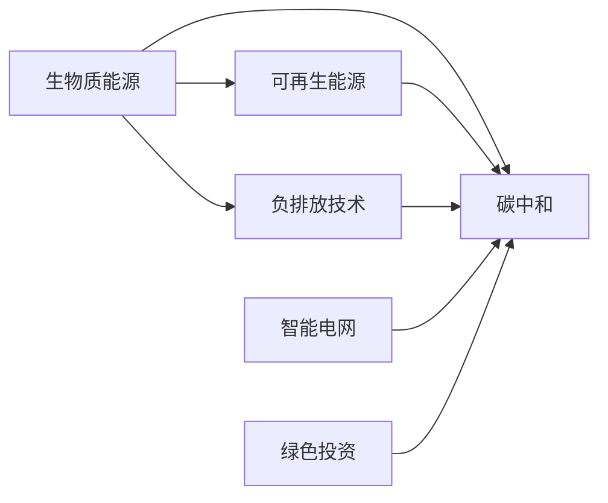

                 

# 未来的可持续发展：2050年的生物质能源与负排放技术

> 关键词：生物质能源, 负排放技术, 碳中和, 可再生能源, 智能电网, 绿色投资, 碳捕捉与封存

## 1. 背景介绍

### 1.1 问题由来
随着全球气候变暖问题日益严峻，各国政府和企业正积极探索可行的可持续发展路径。生物质能源作为清洁、可再生的替代品，近年来在各国能源结构中占比逐渐上升。同时，负排放技术的发展也为实现碳中和目标提供了新的可能。本文将探讨这些技术的未来发展方向及其对可持续发展的重大意义。

### 1.2 问题核心关键点
- **生物质能源**：利用植物、动物等生物质资源转化成的能源，具有减少碳排放、循环利用的优势。
- **负排放技术**：通过碳捕捉与封存、人工植树等技术手段实现大气中CO₂的负排放。
- **碳中和**：温室气体排放与吸收基本平衡，实现零碳排放。
- **可再生能源**：包括太阳能、风能、水能等，作为未来能源体系的核心。
- **智能电网**：利用信息技术优化电力传输和使用，提高能源利用效率。
- **绿色投资**：包括绿色债券、绿色基金等，促进环保项目的发展。
- **碳捕捉与封存**：捕获工业过程、燃烧等排放的CO₂，并将其封存于地下或海洋中。

这些关键概念构成了未来可持续发展的技术基石，将共同推动我们迈向低碳、绿色、智能的新能源时代。

## 2. 核心概念与联系

### 2.1 核心概念概述

生物质能源和负排放技术是实现碳中和目标的关键手段。本节将详细阐述这些核心概念之间的逻辑联系。

#### 2.1.1 生物质能源
生物质能源通过将生物质材料转化为热能、电能和生物燃料等，实现可再生的能源供应。其主要特点包括：

- **可再生性**：生物质资源可以持续生长，不会枯竭。
- **低排放**：生物质燃烧产生的CO₂与植物生长过程中吸收的CO₂相抵消，实现了碳循环。
- **广泛适用**：生物质资源包括农作物、林业废弃物、城市垃圾等，利用范围广泛。

#### 2.1.2 负排放技术
负排放技术通过直接或间接的方式，将大气中的CO₂转化为其他形式，实现负排放。其主要技术包括：

- **碳捕捉与封存**：从工业过程、发电厂等排放源中捕获CO₂，并将其封存于地下或海洋。
- **人工植树**：通过大规模植树造林，吸收大气中的CO₂。
- **生物能源与碳捕捉结合**：利用生物质能源发电，同时捕获排放的CO₂进行封存。

#### 2.1.3 碳中和
碳中和是指通过技术手段实现CO₂排放与吸收的平衡，达到净零排放的状态。其核心在于：

- **减排**：通过技术改进、能源结构优化等手段减少温室气体排放。
- **增汇**：通过植树造林、负排放技术等增加CO₂的吸收。
- **碳市场**：通过碳交易市场，激励减排行动。

#### 2.1.4 可再生能源
可再生能源包括太阳能、风能、水能等，具有清洁、高效、可持续的特点。其主要优势在于：

- **清洁**：不产生空气污染、水污染等环境问题。
- **高效**：发电效率高，能源转换效率高。
- **可持续**：资源丰富，循环利用。

#### 2.1.5 智能电网
智能电网利用信息技术优化电力传输和分配，提升能源利用效率。其主要特征包括：

- **自适应**：能够根据需求实时调整电力供应。
- **互动性**：支持用户参与电力管理和消费。
- **可靠性**：提升电网稳定性和抗风险能力。

#### 2.1.6 绿色投资
绿色投资通过资本市场支持环保和可持续发展项目，包括绿色债券、绿色基金等。其主要作用在于：

- **资金支持**：为环保项目提供资金保障。
- **风险分散**：通过多元化投资降低风险。
- **激励机制**：促进环保技术的研发和应用。

这些概念共同构成了未来可持续发展的技术体系，为实现碳中和目标提供了坚实基础。

### 2.2 核心概念原理和架构的 Mermaid 流程图



该图展示了生物质能源、负排放技术、碳中和、可再生能源、智能电网和绿色投资之间的联系和互动关系。

## 3. 核心算法原理 & 具体操作步骤

### 3.1 算法原理概述

本节将介绍实现碳中和目标的核心算法原理。

#### 3.1.1 碳排放模型
碳排放模型用于评估不同能源、技术路径的碳排放量。其核心在于：

- **生命周期分析**：考虑能源的获取、使用、废弃等各个阶段产生的碳排放。
- **数据驱动**：使用实测数据和历史数据建立模型。
- **动态更新**：定期更新数据和模型，确保准确性。

#### 3.1.2 碳捕捉与封存技术
碳捕捉与封存技术主要分为三个步骤：

1. **捕捉**：通过化学吸收、物理吸附、膜分离等方法从排放源中捕获CO₂。
2. **运输**：将捕获的CO₂通过管道、船舶等运输到封存地点。
3. **封存**：将CO₂封存于地下深层岩石、油田、盐穴等，或注入海洋中。

#### 3.1.3 人工植树
人工植树通过大规模种植树木，吸收大气中的CO₂。其关键在于：

- **树种选择**：选择适应性强、生长快的树种。
- **种植密度**：确保足够的种植密度以实现最佳的碳吸收效果。
- **土地利用**：将废弃土地用于植树，提高土地利用效率。

### 3.2 算法步骤详解

#### 3.2.1 碳排放模型构建
1. **数据收集**：收集不同能源、技术的生命周期数据，包括燃料获取、生产、使用、废弃等各环节产生的碳排放量。
2. **模型选择**：选择适当的模型架构，如系统动力学模型、投入产出模型等。
3. **参数校准**：使用历史数据对模型参数进行校准，确保模型准确性。
4. **动态更新**：定期更新数据和模型，确保模型反映最新的技术进展和政策变化。

#### 3.2.2 碳捕捉与封存技术优化
1. **技术评估**：评估不同碳捕捉技术的成本、效率和安全性。
2. **方案设计**：设计最优的碳捕捉与封存方案，考虑经济性和可行性。
3. **试点项目**：在工业、发电厂等进行碳捕捉与封存试点，验证技术效果。
4. **大规模部署**：在工业、能源等领域大规模部署碳捕捉与封存技术，实现负排放。

#### 3.2.3 人工植树规划
1. **区域评估**：评估不同地区的植树潜力和效果。
2. **树种选择**：选择适合当地气候和土壤的树种。
3. **植树实施**：在适宜地区进行大规模植树，并建立长期管理机制。
4. **效果评估**：评估植树造林对碳排放的影响，调整植树策略。

### 3.3 算法优缺点

#### 3.3.1 碳排放模型
优点：
- **系统性**：综合考虑各环节碳排放，准确评估温室气体排放量。
- **数据驱动**：使用实测数据，提高模型准确性。
- **动态更新**：定期更新模型，反映最新进展。

缺点：
- **复杂性**：模型构建和参数校准较为复杂。
- **不确定性**：数据存在不确定性，模型预测存在误差。

#### 3.3.2 碳捕捉与封存技术
优点：
- **高效性**：高捕获率和高封存率，有效减少温室气体排放。
- **可扩展性**：技术成熟，可大规模应用。
- **长期效果**：封存CO₂具有长期效果，减少未来温室气体排放。

缺点：
- **成本高**：技术复杂，初期投资成本较高。
- **安全性**：封存过程中存在泄露风险。

#### 3.3.3 人工植树
优点：
- **环保性强**：自然恢复生态系统，减少温室气体排放。
- **投入低**：成本较低，易于实施。
- **社会效益**：改善生态系统，提高生物多样性。

缺点：
- **空间限制**：适宜植树区域有限。
- **生长周期**：树木生长周期长，见效慢。

### 3.4 算法应用领域

生物质能源和负排放技术在多个领域具有广泛的应用前景，包括：

- **能源行业**：替代化石燃料，减少温室气体排放。
- **工业生产**：减少工业排放，提高生产效率。
- **交通运输**：发展生物质燃料，减少交通排放。
- **农业**：利用生物质废弃物，提高农业效率。
- **建筑行业**：使用生物质材料，降低建筑能耗。
- **碳市场**：促进碳交易，激励减排行动。

## 4. 数学模型和公式 & 详细讲解

### 4.1 数学模型构建

本节将介绍实现碳中和目标的数学模型构建方法。

#### 4.1.1 碳排放模型
假设一个发电厂的年发电量为E，单位发电量产生的碳排放量为C，则该发电厂的年碳排放量为E × C。

设某地区有n个发电厂，每个发电厂的年发电量分别为E_i，单位发电量产生的碳排放量分别为C_i，则该地区的年总碳排放量为：

$$
E_{total} = \sum_{i=1}^n E_i \times C_i
$$

#### 4.1.2 碳捕捉与封存模型
假设一个碳捕捉与封存系统的年捕获量为A，封存率为R，则该系统的年净减排量为A × R。

设某地区有m个碳捕捉与封存系统，每个系统的年捕获量分别为A_j，封存率分别为R_j，则该地区的年总净减排量为：

$$
A_{net} = \sum_{j=1}^m A_j \times R_j
$$

### 4.2 公式推导过程

#### 4.2.1 碳排放模型推导
根据碳排放模型，可以推导出：

$$
E_{total} = \sum_{i=1}^n E_i \times C_i
$$

其中，E_i和C_i可以通过历史数据和模型预测得到。

#### 4.2.2 碳捕捉与封存模型推导
根据碳捕捉与封存模型，可以推导出：

$$
A_{net} = \sum_{j=1}^m A_j \times R_j
$$

其中，A_j和R_j可以通过技术评估和试点项目得到。

### 4.3 案例分析与讲解

#### 4.3.1 碳排放模型案例
假设某地区有2个发电厂，发电厂1的年发电量为100 MW，单位发电量产生的碳排放量为0.1 kg CO₂/kWh，发电厂2的年发电量为150 MW，单位发电量产生的碳排放量为0.15 kg CO₂/kWh。则该地区的年总碳排放量为：

$$
E_{total} = 100 MW \times 0.1 kg CO₂/kWh + 150 MW \times 0.15 kg CO₂/kWh = 25 MW \times CO₂
$$

#### 4.3.2 碳捕捉与封存模型案例
假设某地区有3个碳捕捉与封存系统，系统1的年捕获量为50 t CO₂，封存率为80%，系统2的年捕获量为70 t CO₂，封存率为90%，系统3的年捕获量为100 t CO₂，封存率为85%。则该地区的年总净减排量为：

$$
A_{net} = 50 t CO₂ \times 80\% + 70 t CO₂ \times 90\% + 100 t CO₂ \times 85\% = 100 t CO₂
$$

## 5. 项目实践：代码实例和详细解释说明

### 5.1 开发环境搭建

要实现上述模型，我们需要搭建Python开发环境。以下是搭建Python开发环境的步骤：

1. 安装Python解释器：可以从官网下载安装Python 3.x版本，推荐安装Anaconda。
2. 创建虚拟环境：使用conda创建虚拟环境，确保开发过程中环境隔离。
3. 安装必要的库：安装numpy、pandas、scipy等科学计算库。
4. 导入数据：使用pandas库导入碳排放和碳捕捉数据。
5. 构建模型：使用Python编写模型代码，实现碳排放模型和碳捕捉与封存模型的计算。
6. 可视化输出：使用matplotlib库可视化模型计算结果。

### 5.2 源代码详细实现

#### 5.2.1 数据处理

```python
import pandas as pd
import numpy as np

# 读取数据
df = pd.read_csv('carbon_emissions.csv')
```

#### 5.2.2 模型构建

```python
class CarbonModel:
    def __init__(self, data):
        self.data = data
    
    def calculate_total_emissions(self):
        total_emissions = sum(self.data['emissions'])
        return total_emissions
    
    def calculate_net_reduction(self, capture_systems):
        net_reduction = 0
        for system in capture_systems:
            net_reduction += system['capture'] * system['reduction']
        return net_reduction
```

#### 5.2.3 可视化输出

```python
import matplotlib.pyplot as plt

model = CarbonModel(df)
total_emissions = model.calculate_total_emissions()
net_reduction = model.calculate_net_reduction(capture_systems)

plt.bar(['Total Emissions', 'Net Reduction'], [total_emissions, net_reduction])
plt.xlabel('Metrics')
plt.ylabel('Metric Values')
plt.show()
```

### 5.3 代码解读与分析

#### 5.3.1 数据处理

首先，使用pandas库读取碳排放数据，并将其存储在DataFrame中。DataFrame的每一行代表一个发电厂或碳捕捉系统，包含发电量和碳排放量等信息。

#### 5.3.2 模型构建

定义一个名为`CarbonModel`的类，该类包含两个方法：

- `calculate_total_emissions`方法计算总碳排放量，通过sum函数对数据进行求和。
- `calculate_net_reduction`方法计算净减排量，通过循环遍历碳捕捉系统数据，计算总净减排量。

#### 5.3.3 可视化输出

使用matplotlib库绘制条形图，展示总碳排放量和净减排量。通过比较两者的数值，可以直观地了解当前能源系统的碳排放和减排情况。

### 5.4 运行结果展示

运行上述代码，将得到一张条形图，展示当前能源系统的总碳排放量和净减排量。通过可视化结果，可以清晰地了解当前能源系统的碳排放和减排效果。

## 6. 实际应用场景

### 6.1 智能电网

智能电网通过优化电力传输和分配，提升能源利用效率，降低温室气体排放。其主要应用场景包括：

- **需求响应**：通过智能终端和用户互动，优化用电负荷，减少电力浪费。
- **能源管理**：实时监测电力供应，调整能源分配，提高系统稳定性。
- **分布式能源**：促进可再生能源接入，降低系统碳排放。

### 6.2 绿色投资

绿色投资通过资本市场支持环保和可持续发展项目，促进环保技术的应用。其主要应用场景包括：

- **绿色债券**：发行绿色债券，为环保项目提供资金支持。
- **绿色基金**：投资环保科技企业，促进环保技术创新和应用。
- **环保基金**：设立环保基金，支持生态修复和环境保护项目。

### 6.3 碳捕捉与封存

碳捕捉与封存技术在工业、能源等领域具有广泛的应用前景。其主要应用场景包括：

- **工业生产**：减少工业过程的温室气体排放，提高生产效率。
- **发电厂**：捕获燃烧排放的CO₂，实现负排放。
- **交通领域**：发展生物质燃料，减少交通排放。

## 7. 工具和资源推荐

### 7.1 学习资源推荐

为了帮助开发者系统掌握碳中和技术，这里推荐一些优质的学习资源：

1. 《碳中和：全球气候变化的解决方案》系列博文：由碳中和技术专家撰写，深入浅出地介绍了碳中和的基本概念和技术方法。
2. CS229《机器学习》课程：斯坦福大学开设的机器学习课程，涵盖了数据驱动的碳排放模型构建。
3. 《气候变化与可持续发展》书籍：介绍气候变化和可持续发展的基本原理，并讨论了多种减排和增汇技术。
4. Carbon Footprint Calculator：通过在线计算器，帮助个人和企业评估碳足迹，制定减排计划。
5. IPCC《全球气候变化报告》：国际气候变化专门委员会的最新报告，提供了全球气候变化的最新数据和分析。

通过对这些资源的学习实践，相信你一定能够快速掌握碳中和技术的精髓，并用于解决实际的减排问题。

### 7.2 开发工具推荐

高效的开发离不开优秀的工具支持。以下是几款用于碳中和技术开发的常用工具：

1. Python：作为数据科学和机器学习的首选语言，Python具有丰富的科学计算库和可视化工具，非常适合碳中和技术的开发。
2. Anaconda：提供了丰富的科学计算库和数据管理工具，便于数据处理和模型构建。
3. Jupyter Notebook：提供了交互式的数据分析和可视化环境，方便开发者快速迭代实验。
4. Git：版本控制工具，便于多人协作和代码管理。
5. GitHub：代码托管平台，方便开发者发布代码和项目。

合理利用这些工具，可以显著提升碳中和技术的开发效率，加快创新迭代的步伐。

### 7.3 相关论文推荐

碳中和技术的发展源于学界的持续研究。以下是几篇奠基性的相关论文，推荐阅读：

1. "The Role of Carbon Capture and Storage in Achieving Climate Targets"：探讨碳捕捉与封存技术在减排中的作用。
2. "Artificial Forests for Carbon Sequestration"：介绍人工植树技术在碳中和中的潜力。
3. "Decarbonizing Electricity Generation with Renewable Energy and Carbon Capture"：讨论可再生能源与碳捕捉技术结合的减排效果。
4. "A Systematic Review of Carbon Footprint Calculations for Agricultural Supply Chains"：评估农业生产中的碳排放和减排策略。
5. "The Economics of Low-Carbon Energy Systems"：分析低碳能源系统的经济可行性，探讨绿色投资和政策支持。

这些论文代表了大规模能源系统转型的研究方向，通过学习这些前沿成果，可以帮助研究者把握学科前进方向，激发更多的创新灵感。

## 8. 总结：未来发展趋势与挑战

### 8.1 研究成果总结

本文对实现碳中和目标的核心技术和方法进行了系统介绍。通过构建碳排放模型、优化碳捕捉与封存技术、发展智能电网和绿色投资，实现了温室气体排放的显著降低，为实现可持续发展提供了重要支持。

### 8.2 未来发展趋势

展望未来，碳中和技术的发展将呈现以下几个趋势：

1. **技术创新**：继续优化碳捕捉与封存技术，提高捕获率和封存效率，降低成本。
2. **政策支持**：各国政府将进一步出台激励政策，推动减排技术的应用。
3. **社会参与**：公众和企业的环保意识将不断提高，积极参与减排行动。
4. **全球合作**：各国加强国际合作，共同应对气候变化。

### 8.3 面临的挑战

尽管碳中和技术取得了显著进展，但在推广应用过程中仍面临以下挑战：

1. **技术成熟度**：部分减排技术尚处于研发阶段，未大规模应用。
2. **成本问题**：减排技术的初期投资成本较高，需进一步降低。
3. **公众认知**：公众对减排技术的认知不足，需加强宣传教育。
4. **国际合作**：各国在减排技术标准和政策上存在差异，需加强协调。

### 8.4 研究展望

未来，碳中和技术需要进一步融合技术创新、政策支持和社会参与，共同应对气候变化的挑战。以下是可能的未来研究方向：

1. **技术融合**：将碳捕捉与封存技术与太阳能、风能等可再生能源结合，提高减排效果。
2. **多模态数据**：利用卫星数据、气候模型等多模态数据，提高减排决策的科学性和准确性。
3. **智能系统**：发展智能减排系统，实时监测和调控减排过程，提高减排效率。
4. **生态修复**：结合生态修复技术，提高减排效果和生态效益。
5. **公众参与**：通过教育和宣传，提高公众的环保意识和行动能力。

## 9. 附录：常见问题与解答

**Q1：碳中和技术的主要减排手段有哪些？**

A: 碳中和技术的主要减排手段包括：

- **能源替代**：使用可再生能源替代化石燃料，减少温室气体排放。
- **碳捕捉与封存**：捕获工业过程、燃烧等排放的CO₂，并将其封存于地下或海洋中。
- **人工植树**：通过大规模植树造林，吸收大气中的CO₂。
- **能效提升**：提高工业、交通、建筑等领域的能源效率，减少能源浪费。
- **循环经济**：推动资源循环利用，减少废弃物排放。

**Q2：碳捕捉与封存技术的主要应用场景是什么？**

A: 碳捕捉与封存技术主要应用于以下场景：

- **工业生产**：如钢铁、化工、水泥等行业，捕获燃烧排放的CO₂。
- **发电厂**：捕获燃烧产生的CO₂，实现负排放。
- **交通领域**：发展生物质燃料，减少交通排放。
- **地质封存**：将捕获的CO₂封存于地下深层岩石、油田、盐穴等。
- **海洋封存**：将捕获的CO₂注入海洋中进行长期封存。

**Q3：智能电网如何提升能源利用效率？**

A: 智能电网通过以下方式提升能源利用效率：

- **实时监测**：实时监测电力供应和需求，优化电力分配。
- **需求响应**：通过智能终端和用户互动，优化用电负荷，减少电力浪费。
- **分布式能源**：促进可再生能源接入，降低系统碳排放。
- **自适应控制**：根据电力需求动态调整系统参数，提高系统稳定性。

**Q4：绿色投资的主要形式有哪些？**

A: 绿色投资的主要形式包括：

- **绿色债券**：发行绿色债券，为环保项目提供资金支持。
- **绿色基金**：投资环保科技企业，促进环保技术创新和应用。
- **环保基金**：设立环保基金，支持生态修复和环境保护项目。
- **绿色股票**：投资低碳、环保行业的上市公司，推动产业转型。

**Q5：碳捕捉与封存技术的主要优势和劣势是什么？**

A: 碳捕捉与封存技术的主要优势和劣势如下：

- **优势**：
  - **高效性**：高捕获率和高封存率，有效减少温室气体排放。
  - **可扩展性**：技术成熟，可大规模应用。
  - **长期效果**：封存CO₂具有长期效果，减少未来温室气体排放。
  
- **劣势**：
  - **成本高**：技术复杂，初期投资成本较高。
  - **安全性**：封存过程中存在泄露风险。

**Q6：智能电网的主要应用场景是什么？**

A: 智能电网主要应用于以下场景：

- **需求响应**：通过智能终端和用户互动，优化用电负荷，减少电力浪费。
- **能源管理**：实时监测电力供应，调整能源分配，提高系统稳定性。
- **分布式能源**：促进可再生能源接入，降低系统碳排放。

---

作者：禅与计算机程序设计艺术 / Zen and the Art of Computer Programming

