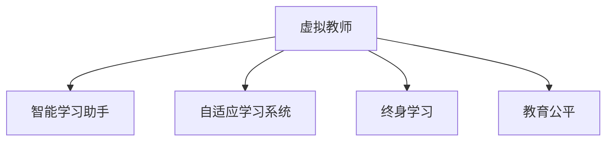

                 

# 未来的教育变革：2050年的虚拟教师与智能学习助手

## 1. 背景介绍

### 1.1 问题由来
随着人工智能(AI)技术的迅猛发展，教育领域正在经历一场革命性的变革。从虚拟教师到智能学习助手，AI正日益成为推动教育公平、个性化学习的重要手段。未来教育将如何利用AI技术，实现更加智能化、个性化的学习体验？本文将探讨2050年虚拟教师与智能学习助手的兴起对教育领域的影响，并展望其未来发展趋势。

### 1.2 问题核心关键点
1. **虚拟教师**：基于AI技术的虚拟教师能够提供24/7的个性化辅导，帮助学生解决学习难题。
2. **智能学习助手**：利用AI技术，智能学习助手能够根据学生的学习进度和兴趣，推荐适合的学习内容和资源。
3. **自适应学习系统**：通过分析学生的学习行为和表现，自适应学习系统能够动态调整学习内容和难度，提升学习效率。
4. **终身学习**：利用AI技术，学习者能够随时随地进行学习，不受时间和空间限制。
5. **教育公平**：AI技术的应用有助于缩小教育资源的不平等差距，让更多人享受高质量的教育。

### 1.3 问题研究意义
研究2050年虚拟教师与智能学习助手的应用，对于推动教育公平、提升教育质量、促进终身学习具有重要意义。AI技术的应用能够使教育资源更加普及，让更多人享受到高质量的教育，同时也能为教育工作者提供有力的辅助工具，提高教学效率和质量。

## 2. 核心概念与联系

### 2.1 核心概念概述

为更好地理解虚拟教师和智能学习助手的核心概念及其之间的联系，本节将介绍几个密切相关的核心概念：

- **虚拟教师**：基于AI技术的虚拟教师可以提供即时、个性化的学习指导，帮助学生解决学习中的疑难问题。
- **智能学习助手**：利用AI技术，智能学习助手能够根据学生的学习进度和兴趣，推荐适合的学习内容和资源。
- **自适应学习系统**：通过分析学生的学习行为和表现，自适应学习系统能够动态调整学习内容和难度，提升学习效率。
- **终身学习**：利用AI技术，学习者能够随时随地进行学习，不受时间和空间限制。
- **教育公平**：AI技术的应用有助于缩小教育资源的不平等差距，让更多人享受高质量的教育。

这些核心概念之间的逻辑关系可以通过以下Mermaid流程图来展示：



这个流程图展示了一体化AI教育系统的核心概念及其之间的联系：

1. 虚拟教师通过个性化辅导帮助学生学习。
2. 智能学习助手根据学生的学习进度和兴趣，推荐适合的学习内容和资源。
3. 自适应学习系统动态调整学习内容和难度，提升学习效率。
4. 终身学习使得学习者能够随时随地进行学习，不受时间和空间限制。
5. 教育公平旨在通过AI技术缩小教育资源的不平等差距，让更多人享受高质量的教育。

这些概念共同构成了AI教育系统的基本框架，使其能够在多个层面提升教育质量和效率。

## 3. 核心算法原理 & 具体操作步骤

### 3.1 算法原理概述

虚拟教师和智能学习助手的核心算法原理基于机器学习和自然语言处理(NLP)技术。通过分析学生的学习行为、情感和反馈，AI系统能够提供个性化的学习指导和资源推荐。以下详细介绍这一核心算法原理。

### 3.2 算法步骤详解

虚拟教师和智能学习助手的实现步骤主要包括数据收集、模型训练和应用部署三个环节。

**数据收集**：
1. 收集学生的学习行为数据，包括学习时间、进度、测试成绩等。
2. 收集学生的情感数据，包括课堂反馈、作业评论等。
3. 收集学生的兴趣爱好数据，包括阅读偏好、课程选择等。

**模型训练**：
1. 使用收集到的数据训练深度学习模型，如循环神经网络(RNN)、长短时记忆网络(LSTM)等，用于预测学生的学习行为和情感变化。
2. 使用NLP技术训练语言模型，用于分析学生的作业、论文等文本数据，提取关键信息和情感倾向。

**应用部署**：
1. 将训练好的模型部署到虚拟教师和智能学习助手平台，实时分析学生的学习数据，提供个性化的学习指导和资源推荐。
2. 平台应具备自适应学习系统，能够根据学生的学习进度和兴趣动态调整学习内容和难度。
3. 平台应支持终身学习，通过移动应用、在线课程等方式，使学习者能够随时随地进行学习。

### 3.3 算法优缺点

虚拟教师和智能学习助手的实现基于AI技术，具有以下优点：
1. 个性化辅导：能够提供即时、个性化的学习指导，帮助学生解决学习中的疑难问题。
2. 资源推荐：根据学生的学习进度和兴趣，推荐适合的学习内容和资源。
3. 动态调整：通过分析学生的学习行为和表现，动态调整学习内容和难度，提升学习效率。
4. 终身学习：使学习者能够随时随地进行学习，不受时间和空间限制。
5. 教育公平：有助于缩小教育资源的不平等差距，让更多人享受高质量的教育。

同时，该方法也存在一定的局限性：
1. 数据隐私：学生的学习数据涉及个人隐私，需要采取有效的数据保护措施。
2. 模型鲁棒性：AI模型的预测可能受到数据偏差的影响，需要不断优化和调整。
3. 技术依赖：虚拟教师和智能学习助手的应用依赖于高精度的AI模型和技术基础设施，存在一定的技术门槛。
4. 缺乏情感理解：当前的AI模型在理解和处理复杂情感方面仍有局限，需要进一步提升情感智能。
5. 人类教师的替代：虚拟教师和智能学习助手不能完全替代人类教师的角色，需要与人类教师协同工作。

### 3.4 算法应用领域

虚拟教师和智能学习助手的应用领域广泛，包括但不限于以下方面：

1. **K-12教育**：为中小学生提供个性化辅导和学习资源推荐，帮助他们提升学习成绩。
2. **高等教育**：为大学生提供课程选择、论文写作指导等，提升学习效率和科研能力。
3. **职业技能培训**：为职业培训学习者提供技能学习路径和资源推荐，帮助他们顺利转岗或提升技能。
4. **终身学习**：为成人学习者提供灵活的学习方式和资源，支持他们随时随地的学习需求。
5. **企业培训**：为企业员工提供个性化学习计划和资源，提升职业技能和工作表现。

## 4. 数学模型和公式 & 详细讲解

### 4.1 数学模型构建

虚拟教师和智能学习助手的数学模型主要包括两部分：学习行为预测模型和情感分析模型。

**学习行为预测模型**：
- 输入：学生的学习时间、进度、测试成绩等。
- 输出：学生可能的学习行为，如是否参加复习、是否完成作业等。
- 模型：使用RNN或LSTM等序列模型，分析时间序列数据。

**情感分析模型**：
- 输入：学生的课堂反馈、作业评论等文本数据。
- 输出：学生的情感倾向，如积极、消极、中性等。
- 模型：使用LSTM或Transformer等语言模型，进行文本分类和情感分析。

### 4.2 公式推导过程

以下以学习行为预测模型为例，推导RNN模型在时间序列数据分析中的基本公式。

假设时间序列数据为 $(x_t, y_t)$，其中 $x_t$ 表示第 $t$ 个时间步的学习行为，$y_t$ 表示第 $t$ 个时间步的学习效果。RNN模型的基本公式如下：

$$
h_t = \sigma(W_{hh}h_{t-1} + W_{xh}x_t + b_h)
$$

$$
y_t = \sigma(W_{hy}h_t + b_y)
$$

其中，$h_t$ 表示第 $t$ 个时间步的隐藏状态，$\sigma$ 表示激活函数，$W_{hh}$、$W_{xh}$、$W_{hy}$ 和 $b_h$、$b_y$ 为模型参数。

通过上述公式，RNN模型能够对时间序列数据进行建模，预测学生可能的学习行为和效果。

### 4.3 案例分析与讲解

以一个简单的学习行为预测案例进行分析：假设某学生每天的学习时间 $x_t$ 和数学成绩 $y_t$ 如下表所示：

| $t$ | $x_t$ | $y_t$ |
|-----|-------|-------|
| 1   | 2     | 80    |
| 2   | 4     | 90    |
| 3   | 3     | 85    |
| 4   | 5     | 90    |
| 5   | 4     | 95    |

使用RNN模型进行预测，可以发现随着学习时间的增加，学生的数学成绩呈上升趋势。通过模型参数的不断调整和优化，模型能够更准确地预测学生的学习行为和效果。

## 5. 项目实践：代码实例和详细解释说明

### 5.1 开发环境搭建

在进行虚拟教师和智能学习助手的开发实践前，我们需要准备好开发环境。以下是使用Python进行TensorFlow开发的配置流程：

1. 安装Anaconda：从官网下载并安装Anaconda，用于创建独立的Python环境。
2. 创建并激活虚拟环境：
```bash
conda create -n tf-env python=3.8 
conda activate tf-env
```
3. 安装TensorFlow：根据CUDA版本，从官网获取对应的安装命令。例如：
```bash
conda install tensorflow -c tf
```
4. 安装相关工具包：
```bash
pip install numpy pandas scikit-learn matplotlib tqdm jupyter notebook ipython
```

完成上述步骤后，即可在`tf-env`环境中开始项目开发。

### 5.2 源代码详细实现

下面以一个简单的学习行为预测模型为例，给出使用TensorFlow进行开发和训练的代码实现。

```python
import tensorflow as tf
import numpy as np

# 创建时间序列数据
X = np.array([[2, 4, 3, 5, 4],
              [80, 90, 85, 90, 95]]).T
y = np.array([80, 90, 85, 90, 95])

# 定义模型参数
num_input = 1
num_output = 1
num_hidden = 2

# 定义RNN模型
model = tf.keras.Sequential([
    tf.keras.layers.SimpleRNN(units=num_hidden, input_shape=(num_input,)),
    tf.keras.layers.Dense(units=num_output)
])

# 定义损失函数和优化器
loss_fn = tf.keras.losses.MeanSquaredError()
optimizer = tf.keras.optimizers.Adam(learning_rate=0.01)

# 编译模型
model.compile(optimizer=optimizer, loss=loss_fn)

# 训练模型
model.fit(X, y, epochs=100, verbose=0)
```

上述代码实现了RNN模型的基本构建和训练过程。通过不断调整模型参数和优化算法，可以逐步提高模型的预测精度。

### 5.3 代码解读与分析

**创建时间序列数据**：
- 使用numpy创建时间序列数据，包含学习时间和数学成绩。
- 数据格式为 $(x_t, y_t)$，用于训练和测试模型。

**定义模型参数**：
- 输入层、隐藏层和输出层的节点数，以及学习率等超参数。
- 输入层节点数为1，表示每次输入学习时间。

**定义RNN模型**：
- 使用Sequential模型，添加SimpleRNN层和Dense层。
- SimpleRNN层用于处理时间序列数据，Dense层用于输出预测结果。

**定义损失函数和优化器**：
- 使用均方误差损失函数，优化器为Adam。
- 均方误差损失函数适用于回归任务，Adam优化器具有较快的收敛速度和较好的性能。

**编译模型**：
- 通过compile方法将模型和损失函数、优化器绑定。
- 设置模型的训练过程，包括训练轮数和输出细节。

**训练模型**：
- 通过fit方法进行模型训练，不断迭代优化模型参数。
- 训练过程中，模型将预测值与真实值进行比较，更新参数以减小误差。

### 5.4 运行结果展示

运行上述代码，训练完成后，可以输出模型参数和预测结果。

```python
# 获取模型参数
print(model.get_weights())

# 进行预测
prediction = model.predict(X)
print(prediction)
```

这将输出模型参数和预测值，显示模型对新数据的预测能力。

## 6. 实际应用场景

### 6.1 智能课堂系统

智能课堂系统通过虚拟教师和智能学习助手，为课堂教学提供全方位的支持。虚拟教师可以实时回答学生问题，提供个性化的学习指导。智能学习助手根据学生的学习进度和兴趣，推荐适合的学习内容和资源，提升学习效果。

在技术实现上，智能课堂系统可以集成虚拟教师和智能学习助手，利用NLP技术分析学生的学习行为和情感，提供个性化的学习建议。通过实时监测和调整，系统能够最大化地提升学习效率。

### 6.2 在线教育平台

在线教育平台通过虚拟教师和智能学习助手，提供灵活的学习方式和资源。学生可以根据自己的学习进度和兴趣，选择适合的学习内容和节奏。虚拟教师能够提供24/7的学习指导，解答学生的疑难问题，提升学习效果。

在技术实现上，在线教育平台可以使用虚拟教师和智能学习助手，提供个性化的学习计划和资源推荐。系统可以通过分析学生的学习行为和表现，动态调整学习内容和难度，提升学习效率。

### 6.3 企业培训系统

企业培训系统通过虚拟教师和智能学习助手，为员工提供灵活的培训方式和资源。员工可以根据自己的需求和时间安排，选择适合的学习内容和节奏。虚拟教师能够提供定制化的培训指导，解答员工的疑难问题，提升培训效果。

在技术实现上，企业培训系统可以集成虚拟教师和智能学习助手，提供个性化的培训计划和资源推荐。系统可以通过分析员工的学习行为和表现，动态调整培训内容和难度，提升培训效率。

## 7. 工具和资源推荐

### 7.1 学习资源推荐

为了帮助开发者系统掌握虚拟教师和智能学习助手的理论基础和实践技巧，这里推荐一些优质的学习资源：

1. 《深度学习与自然语言处理》系列书籍：详细介绍了深度学习在NLP领域的应用，包括虚拟教师和智能学习助手等前沿话题。
2. Coursera《深度学习专项课程》：斯坦福大学开设的深度学习系列课程，涵盖深度学习在NLP、计算机视觉等领域的应用。
3. TensorFlow官方文档：TensorFlow的详细文档，提供了大量预训练语言模型和微调样例代码。
4. HuggingFace官方文档：Transformers库的官方文档，提供了海量预训练语言模型和微调样例代码。
5. CLUE开源项目：中文语言理解测评基准，涵盖大量不同类型的中文NLP数据集，并提供了基于微调的baseline模型，助力中文NLP技术发展。

通过对这些资源的学习实践，相信你一定能够快速掌握虚拟教师和智能学习助手的精髓，并用于解决实际的NLP问题。

### 7.2 开发工具推荐

高效的开发离不开优秀的工具支持。以下是几款用于虚拟教师和智能学习助手开发的常用工具：

1. TensorFlow：基于Python的开源深度学习框架，灵活动态的计算图，适合快速迭代研究。
2. PyTorch：基于Python的开源深度学习框架，灵活高效，支持GPU加速。
3. TensorBoard：TensorFlow配套的可视化工具，可实时监测模型训练状态，并提供丰富的图表呈现方式。
4. Weights & Biases：模型训练的实验跟踪工具，可以记录和可视化模型训练过程中的各项指标，方便对比和调优。
5. Jupyter Notebook：开源的交互式计算环境，适合进行数据探索、模型训练和结果展示。

合理利用这些工具，可以显著提升虚拟教师和智能学习助手开发的效率，加快创新迭代的步伐。

### 7.3 相关论文推荐

虚拟教师和智能学习助手的发展源于学界的持续研究。以下是几篇奠基性的相关论文，推荐阅读：

1. "A Survey of Deep Learning in Educational Technologies"（《深度学习在教育技术中的应用综述》）：综述了深度学习在教育领域的应用，包括虚拟教师和智能学习助手等前沿技术。
2. "Learning as a Service: An Overview"（《作为服务的学习：综述》）：介绍了基于云计算的学习服务，包括在线教育平台、虚拟教师和智能学习助手等应用。
3. "Teaching Machines to Teach"（《教机器教书》）：探讨了通过AI技术提升教育质量的方法，包括虚拟教师和智能学习助手等技术。
4. "The Impact of Artificial Intelligence on Education"（《人工智能对教育的影响》）：分析了AI技术在教育领域的应用和未来发展趋势，包括虚拟教师和智能学习助手等前沿技术。

这些论文代表了大语言模型微调技术的发展脉络。通过学习这些前沿成果，可以帮助研究者把握学科前进方向，激发更多的创新灵感。

## 8. 总结：未来发展趋势与挑战

### 8.1 总结

本文对虚拟教师和智能学习助手的核心算法原理和具体操作步骤进行了全面系统的介绍。首先阐述了虚拟教师和智能学习助手的背景和意义，明确了其在推动教育公平、提升教育质量、促进终身学习等方面的重要价值。其次，从原理到实践，详细讲解了虚拟教师和智能学习助手的数学模型和实现步骤，给出了虚拟教师和智能学习助手的代码实例和详细解释。同时，本文还广泛探讨了虚拟教师和智能学习助手在智能课堂、在线教育、企业培训等实际应用场景中的前景和应用。

通过本文的系统梳理，可以看到，虚拟教师和智能学习助手作为AI教育系统的重要组成部分，将在未来教育中发挥越来越重要的作用。AI技术的应用能够使教育资源更加普及，让更多人享受高质量的教育，同时也能为教育工作者提供有力的辅助工具，提高教学效率和质量。

### 8.2 未来发展趋势

展望未来，虚拟教师和智能学习助手的发展趋势主要包括：

1. **多模态融合**：未来的虚拟教师和智能学习助手将不仅仅局限于文本数据，还将融合语音、视频等多模态数据，提升交互体验和教学效果。
2. **情感智能**：通过引入情感智能，未来的虚拟教师和智能学习助手将能够更好地理解学生的情感和需求，提供更加个性化和人性化的学习指导。
3. **自适应学习**：未来的自适应学习系统将更加智能化，能够动态调整学习内容和难度，提升学习效率。
4. **终身学习**：未来的虚拟教师和智能学习助手将支持终身学习，使学习者能够随时随地进行学习，不受时间和空间限制。
5. **教育公平**：未来的AI教育系统将通过虚拟教师和智能学习助手，进一步缩小教育资源的不平等差距，让更多人享受高质量的教育。

以上趋势凸显了虚拟教师和智能学习助手在教育领域的应用前景。这些方向的探索发展，必将进一步提升教育质量和效率，推动教育公平和终身学习的发展。

### 8.3 面临的挑战

尽管虚拟教师和智能学习助手已经取得了瞩目成就，但在迈向更加智能化、普适化应用的过程中，它仍面临诸多挑战：

1. **数据隐私**：学生的学习数据涉及个人隐私，需要采取有效的数据保护措施。
2. **模型鲁棒性**：AI模型的预测可能受到数据偏差的影响，需要不断优化和调整。
3. **技术依赖**：虚拟教师和智能学习助手的应用依赖于高精度的AI模型和技术基础设施，存在一定的技术门槛。
4. **缺乏情感理解**：当前的AI模型在理解和处理复杂情感方面仍有局限，需要进一步提升情感智能。
5. **人类教师的替代**：虚拟教师和智能学习助手不能完全替代人类教师的角色，需要与人类教师协同工作。

### 8.4 研究展望

面对虚拟教师和智能学习助手所面临的挑战，未来的研究需要在以下几个方面寻求新的突破：

1. **数据隐私保护**：开发更先进的数据保护技术和算法，确保学生数据的安全和隐私。
2. **模型鲁棒性提升**：通过改进数据预处理、模型优化等技术手段，提升AI模型的鲁棒性和泛化能力。
3. **多模态融合**：结合语音、视频等多模态数据，提升虚拟教师和智能学习助手的交互体验和教学效果。
4. **情感智能增强**：引入情感智能，使虚拟教师和智能学习助手能够更好地理解学生的情感和需求。
5. **人机协同**：通过技术手段，增强虚拟教师和智能学习助手与人类教师的协同工作，提升教学效果和质量。

这些研究方向的探索，必将引领虚拟教师和智能学习助手技术迈向更高的台阶，为构建人机协同的智能教育系统铺平道路。面向未来，虚拟教师和智能学习助手需要与其他AI技术进行更深入的融合，如知识表示、因果推理、强化学习等，多路径协同发力，共同推动教育领域的变革和进步。

## 9. 附录：常见问题与解答

**Q1：虚拟教师和智能学习助手是否适用于所有教育场景？**

A: 虚拟教师和智能学习助手在大多数教育场景中都能取得不错的效果，但对于一些需要高度情感交流和人际互动的场景，如心理健康辅导、艺术教育等，虚拟教师和智能学习助手可能难以完全替代人类教师。因此，在这些场景中，虚拟教师和智能学习助手应与人类教师协同工作。

**Q2：虚拟教师和智能学习助手如何保障数据隐私？**

A: 虚拟教师和智能学习助手在应用过程中，需要严格遵守数据隐私保护法规，如GDPR、CCPA等。具体措施包括：
1. 数据匿名化处理：通过去除个人标识信息，保护用户隐私。
2. 数据加密传输：通过SSL/TLS等加密协议，保护数据传输过程中的安全。
3. 权限控制：对数据访问进行严格的权限控制，确保只有授权用户才能访问数据。
4. 隐私保护技术：引入差分隐私、联邦学习等技术，保护用户隐私。

**Q3：虚拟教师和智能学习助手在实际应用中需要注意哪些问题？**

A: 虚拟教师和智能学习助手在实际应用中，需要注意以下问题：
1. 模型鲁棒性：确保模型在面对不同类型的数据时，具有较高的鲁棒性和泛化能力。
2. 数据质量：确保输入数据的质量，避免数据偏差和噪声。
3. 用户体验：设计友好的用户界面，提升用户体验。
4. 伦理道德：确保虚拟教师和智能学习助手在应用过程中，符合伦理道德标准，避免有害信息的传播。
5. 技术迭代：持续优化和迭代虚拟教师和智能学习助手，提升性能和用户体验。

**Q4：虚拟教师和智能学习助手如何实现终身学习？**

A: 虚拟教师和智能学习助手通过以下方式实现终身学习：
1. 多设备支持：支持PC、手机、平板等多设备平台，使学习者随时随地进行学习。
2. 个性化推荐：根据学习者的学习进度和兴趣，推荐适合的学习内容和资源。
3. 动态调整：通过分析学习者的学习行为和表现，动态调整学习内容和难度，提升学习效率。
4. 内容更新：定期更新学习内容和资源，确保学习者能够获取最新的知识和信息。

**Q5：虚拟教师和智能学习助手如何实现教育公平？**

A: 虚拟教师和智能学习助手通过以下方式实现教育公平：
1. 免费资源：提供免费的虚拟教师和智能学习助手服务，使更多人能够享受高质量的教育资源。
2. 个性化辅导：通过虚拟教师和智能学习助手，提供个性化的学习指导，缩小不同学生之间的学习差距。
3. 跨地域支持：通过虚拟教师和智能学习助手，支持偏远地区和弱势群体的学习需求，缩小地域和群体之间的教育差距。

通过以上问题的解答，可以看到，虚拟教师和智能学习助手在实际应用中，仍需要不断优化和改进，以确保其技术成熟度和应用效果。通过技术手段和政策措施，未来的虚拟教师和智能学习助手将为教育公平和终身学习提供强有力的支持。

---

作者：禅与计算机程序设计艺术 / Zen and the Art of Computer Programming

