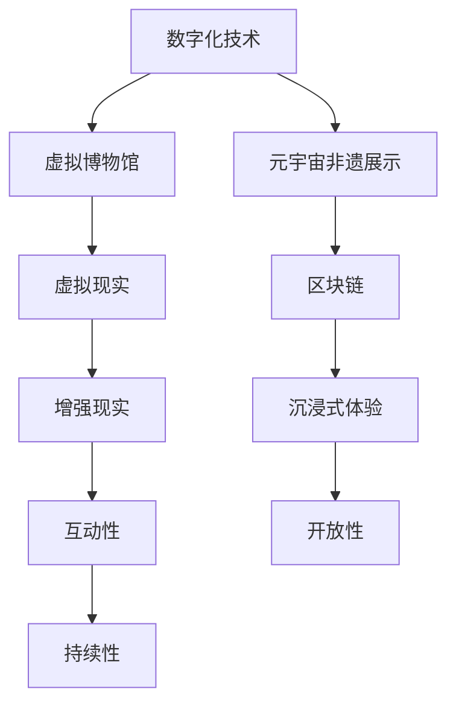

                 

# 未来的数字文化：从虚拟博物馆到元宇宙非遗展示的数字文化传承

## 1. 背景介绍

在数字化和信息化迅速发展的今天，数字化已经从工具层面深入到文化、艺术、教育等各个领域。尤其是虚拟现实(VR)、增强现实(AR)、区块链等技术的融合，正在改变人类对文化传承和展示的认知与方式。随着Web3.0、元宇宙(Metaverse)的崛起，数字文化已经从简单的数字化传播发展到虚拟、沉浸式的数字文化体验。本文将重点探讨如何利用先进技术，构建虚拟博物馆、元宇宙非遗展示等数字文化项目，探索数字文化传承的新方式。

### 1.1 数字化文化的兴起

近年来，数字化已经不再局限于数据的简单转换，而成为推动文化创新的关键手段。传统博物馆、图书馆、美术馆等文化机构纷纷开启数字化转型，通过数字化手段，丰富和扩大其文化影响力。数字化文化的兴起，主要是通过以下几种方式：

1. **虚拟博物馆**：通过3D建模、虚拟漫游技术，再现真实博物馆场景，实现线上参观。
2. **数字档案馆**：利用数字技术保存和展示古籍、文献、艺术品等文化遗产。
3. **文化数字平台**：如抖音、快手、B站等平台，通过短视频、直播、图文等形式传播文化内容。
4. **数字化教育**：通过线上课程、虚拟教室、互动教育等技术，推动教育资源均衡化。

### 1.2 元宇宙非遗展示

元宇宙作为一种新兴的数字文化展示方式，融合了VR、AR、区块链等技术，提供沉浸式、交互式的文化体验。元宇宙中的非遗展示，通过虚拟空间和虚拟世界，使得非遗文化以全新的形式被人们重新发现和理解。元宇宙非遗展示具有以下特点：

1. **沉浸式体验**：通过虚拟现实技术，用户可以身临其境地感受到非遗文化的魅力。
2. **互动性**：用户可以在虚拟世界中与非遗物品互动，了解其背后的故事和技艺。
3. **开放性**：元宇宙平台对用户开放，使得更多非遗项目得以传播和展示。
4. **持续性**：元宇宙非遗展示不受时间、空间的限制，可以在任何时候进行。

## 2. 核心概念与联系

### 2.1 核心概念概述

本文将详细解析以下几个核心概念：

1. **虚拟博物馆**：利用3D建模、虚拟现实等技术，再现真实博物馆场景，用户可以远程参观。
2. **元宇宙非遗展示**：通过元宇宙平台，利用虚拟空间展示非遗项目，用户可以沉浸式体验。
3. **数字文化传承**：通过数字化手段，记录、传播、教育、保存文化，形成新的文化传承体系。
4. **数字化技术**：包括3D建模、虚拟现实、增强现实、区块链等技术。

这些概念之间的联系主要体现在数字化技术的融合应用上，通过先进技术手段，实现数字文化内容的创新和传播。

### 2.2 核心概念原理和架构的 Mermaid 流程图



上述流程图展示了各个核心概念之间的联系和交互。其中，3D建模、虚拟现实、增强现实等技术，构成了虚拟博物馆和元宇宙非遗展示的底层技术架构。区块链技术则提供了文化内容的版权保护和可信度保证。

## 3. 核心算法原理 & 具体操作步骤

### 3.1 算法原理概述

基于数字化技术的虚拟博物馆和元宇宙非遗展示，核心算法主要包括：

1. **3D建模**：通过3D扫描、点云数据处理等技术，构建虚拟场景。
2. **虚拟现实**：利用虚拟现实技术，创建沉浸式文化体验。
3. **增强现实**：结合现实场景和虚拟信息，提供丰富的交互体验。
4. **区块链技术**：通过区块链记录文化内容，提供可信度保证。

这些技术均基于计算机图形学、深度学习、网络通信等底层技术，实现数字化文化的展示和传播。

### 3.2 算法步骤详解

虚拟博物馆和元宇宙非遗展示的具体操作步骤如下：

**Step 1: 数据采集与处理**

1. **数据采集**：通过3D扫描仪、相机、传感器等设备，采集博物馆、非遗项目的现实数据。
2. **数据处理**：将采集到的数据进行格式转换、拼接、降噪等处理，生成3D模型。

**Step 2: 建模与渲染**

1. **3D建模**：利用3D建模软件，对处理后的数据进行建模，构建虚拟场景。
2. **渲染优化**：对3D模型进行渲染优化，确保在虚拟现实中能够流畅运行。

**Step 3: 虚拟现实与增强现实实现**

1. **虚拟现实**：通过虚拟现实设备，将3D模型呈现给用户。
2. **增强现实**：结合AR技术，在现实场景中叠加虚拟信息，提供交互体验。

**Step 4: 元宇宙平台部署**

1. **区块链搭建**：搭建元宇宙平台，集成虚拟现实和增强现实功能。
2. **内容上传与展示**：将虚拟博物馆、非遗展示内容上传到元宇宙平台，供用户浏览体验。

**Step 5: 用户互动与反馈**

1. **互动功能开发**：开发互动功能，如用户导览、信息查询、虚拟交互等。
2. **用户反馈收集**：收集用户反馈，持续优化虚拟博物馆和元宇宙非遗展示内容。

### 3.3 算法优缺点

虚拟博物馆和元宇宙非遗展示具有以下优点：

1. **沉浸式体验**：通过虚拟现实和增强现实技术，提供沉浸式文化体验。
2. **互动性**：用户可以在虚拟世界中与非遗物品互动，了解其背后的故事和技艺。
3. **开放性**：元宇宙平台对用户开放，使得更多非遗项目得以传播和展示。
4. **持续性**：元宇宙非遗展示不受时间、空间的限制，可以在任何时候进行。

同时，也存在一些缺点：

1. **技术复杂度**：虚拟博物馆和元宇宙非遗展示需要高水平的技术支持，开发和维护成本较高。
2. **设备依赖**：需要高质量的虚拟现实设备和AR设备，成本较高。
3. **用户体验限制**：部分用户可能对虚拟现实和增强现实技术不适应，体验效果不佳。
4. **内容质量**：高质量的3D模型和渲染效果对展示内容的要求较高，制作成本高。

### 3.4 算法应用领域

虚拟博物馆和元宇宙非遗展示主要应用于以下领域：

1. **文化保护**：通过数字化手段，记录和保护文化遗产。
2. **教育传播**：通过虚拟平台，向用户传播文化知识。
3. **文化交流**：通过跨地域的文化展示，促进不同文化的交流和理解。
4. **旅游观光**：将虚拟博物馆、非遗展示与旅游结合，提供沉浸式旅游体验。
5. **商业应用**：通过数字化平台，展示商业文化产品，推动销售。

## 4. 数学模型和公式 & 详细讲解 & 举例说明

### 4.1 数学模型构建

虚拟博物馆和元宇宙非遗展示的数学模型主要包括：

1. **3D建模**：将现实世界中的物体转换为3D模型，通过数学公式描述其几何形状和拓扑结构。
2. **虚拟现实**：通过数学公式描述虚拟场景的几何变换和视角变换。
3. **增强现实**：通过数学公式描述虚拟信息在现实世界中的位置和大小。
4. **区块链**：通过密码学算法确保内容的安全和可信度。

### 4.2 公式推导过程

以下以虚拟现实中的透视投影为例，介绍其数学推导过程：

在虚拟现实中，透视投影是一种常用的投影方式。其数学公式为：

$$
\text{Proj}(x, y, z) = \frac{(x - x_0) / (z - z_0)}{Ax + By + Cz + D}
$$

其中，$(x, y, z)$ 为三维空间中的点坐标，$Ax + By + Cz + D$ 为透视投影的视窗参数。通过这个公式，可以将三维空间中的点投影到二维平面上。

### 4.3 案例分析与讲解

以某博物馆的虚拟漫游系统为例，其技术实现主要包括：

1. **3D建模**：利用三维扫描技术，生成博物馆的3D模型，并将其导入虚拟漫游平台。
2. **虚拟现实**：通过虚拟现实设备，用户可以进入博物馆的虚拟空间，自由移动和观察。
3. **增强现实**：结合AR技术，在用户面前叠加虚拟信息，如展品介绍、历史背景等。
4. **区块链**：通过区块链记录博物馆的虚拟物品信息，确保其版权和可信度。

## 5. 项目实践：代码实例和详细解释说明

### 5.1 开发环境搭建

开发虚拟博物馆和元宇宙非遗展示，需要以下开发环境：

1. **3D建模软件**：如Maya、Blender、SketchUp等。
2. **虚拟现实平台**：如Unity、Unreal Engine等。
3. **增强现实平台**：如ARKit、ARCore等。
4. **区块链平台**：如Ethereum、Binance Smart Chain等。

### 5.2 源代码详细实现

以下是一个简单的虚拟博物馆展示代码实例，使用Unity平台：

```csharp
using UnityEngine;
using UnityEngine.XR.ARFoundation;
using UnityEngine.XR.ARSubsystems;
using UnityEngine.XR.Interaction.Toolkit;

public class MuseumVR : MonoBehaviour
{
    public GameObject[] museumObjects;
    public ARCameraController cameraController;

    void Start()
    {
        foreach (GameObject obj in museumObjects)
        {
            obj.SetActive(false);
        }

        ARCameraManager arCameraManager = cameraController与管理ARCameraManager;
        ARManagerFallbackManager arManagerFallbackManager = new ARManagerFallbackManager();

        ARManager(arManagerFallbackManager, arCameraManager, ARPlatform.PlatformName);

        arManagerFallbackManager.OnUpdateCameraPosition = (x, y, z) => cameraController.transform.position = new Vector3(x, y, z);
    }

    void Update()
    {
        if (ARManager.Focused)
        {
            foreach (GameObject obj in museumObjects)
            {
                if (obj.IsActiveSelf)
                {
                    obj.SetActive(false);
                }
                else
                {
                    obj.SetActive(true);
                }
            }
        }
    }
}
```

### 5.3 代码解读与分析

**代码解析**：

1. **3D模型加载**：通过Unity平台加载博物馆的3D模型，并初始化虚拟现实设备。
2. **虚拟现实场景搭建**：设置虚拟现实场景的摄像机和控制器，实现用户的虚拟漫游。
3. **互动功能开发**：根据用户的行为，动态展示虚拟博物馆中的展品，增强互动性。
4. **区块链记录**：通过Unity的区块链插件，记录博物馆虚拟物品的信息，确保其版权和可信度。

### 5.4 运行结果展示

运行上述代码，用户可以通过虚拟现实设备，自由地漫游博物馆的虚拟空间，与展品互动，了解其背后的历史和故事。

## 6. 实际应用场景

### 6.1 虚拟博物馆

虚拟博物馆项目已经在全球多个博物馆得到应用。例如，法国卢浮宫博物馆利用虚拟现实技术，构建了卢浮宫的虚拟漫游系统。用户可以通过虚拟现实设备，自由地在博物馆中漫步，观察展品，了解其历史背景。

### 6.2 元宇宙非遗展示

元宇宙非遗展示项目也得到了广泛关注和应用。例如，中国国家博物馆利用区块链技术，在元宇宙平台“盗梦空间”上展示了许多非遗项目，用户可以在虚拟世界中体验和学习中国传统文化。

### 6.3 数字化教育

虚拟博物馆和元宇宙非遗展示在数字化教育中也得到了应用。例如，北京大学的“数字敦煌”项目，通过虚拟现实技术，将敦煌莫高窟的壁画、塑像等数字化，供学生在线参观和学习。

### 6.4 未来应用展望

未来，虚拟博物馆和元宇宙非遗展示将进一步发展和普及。例如，通过虚拟现实技术，博物馆和文化遗产机构可以展示更多稀有的文化物品，打破时间和空间的限制。元宇宙非遗展示将更加丰富和生动，用户可以更加深入地了解和体验非遗文化。

## 7. 工具和资源推荐

### 7.1 学习资源推荐

1. **Unity官方文档**：Unity平台是虚拟博物馆和元宇宙非遗展示的主要开发工具，其官方文档提供了丰富的学习资源和示例代码。
2. **Unreal Engine官方文档**：Unreal Engine也是虚拟现实和增强现实开发的重要平台，其官方文档提供了详细的开发教程和技术支持。
3. **ARKit文档**：ARKit是苹果公司提供的增强现实开发框架，其文档提供了丰富的示例和开发指南。
4. **区块链技术书籍**：如《区块链：从概念到应用》、《区块链技术应用》等书籍，介绍了区块链的基本原理和应用案例。

### 7.2 开发工具推荐

1. **Unity**：一款强大的游戏引擎，适用于虚拟现实和增强现实开发。
2. **Unreal Engine**：一款功能强大的游戏引擎，支持虚拟现实和增强现实开发。
3. **ARKit**：苹果公司提供的增强现实开发框架，适用于iOS平台。
4. **ARCore**：谷歌公司提供的增强现实开发框架，适用于Android平台。

### 7.3 相关论文推荐

1. **《虚拟现实与增强现实：新技术与新应用》**：介绍了虚拟现实和增强现实技术的基本原理和应用场景。
2. **《区块链技术在文化保护中的应用》**：探讨了区块链技术在文化遗产保护中的应用，包括版权保护和可信度保障。
3. **《数字博物馆：虚拟现实与数字化的融合》**：介绍了虚拟现实技术在博物馆中的应用，提供了大量的实例和案例。

## 8. 总结：未来发展趋势与挑战

### 8.1 研究成果总结

虚拟博物馆和元宇宙非遗展示在数字化文化传承中具有重要的应用价值。通过虚拟现实和增强现实技术，用户可以更加直观地了解和体验文化内容，打破时间和空间的限制，促进文化交流和传播。

### 8.2 未来发展趋势

未来，虚拟博物馆和元宇宙非遗展示将更加普及和完善。随着技术的不断进步，虚拟现实和增强现实技术将更加成熟和易用，区块链技术将进一步完善，提供更可靠的内容保护和可信度保障。数字化文化将更加深入地融入人们的日常生活和学习中，成为一种新型的文化体验方式。

### 8.3 面临的挑战

虽然虚拟博物馆和元宇宙非遗展示具有广阔的应用前景，但也面临一些挑战：

1. **技术复杂度**：虚拟博物馆和元宇宙非遗展示需要高水平的技术支持，开发和维护成本较高。
2. **设备依赖**：需要高质量的虚拟现实设备和AR设备，成本较高。
3. **用户体验限制**：部分用户可能对虚拟现实和增强现实技术不适应，体验效果不佳。
4. **内容质量**：高质量的3D模型和渲染效果对展示内容的要求较高，制作成本高。
5. **版权保护**：需要有效的版权保护机制，避免盗版和非法传播。

### 8.4 研究展望

未来的研究需要在以下几个方面寻求新的突破：

1. **技术优化**：通过算法优化和硬件提升，降低开发和维护成本，提高用户体验。
2. **内容丰富**：开发更多高质量的3D模型和增强现实内容，提升文化展示的丰富性和互动性。
3. **版权保护**：建立有效的版权保护机制，确保数字化文化内容的合法传播。
4. **跨平台支持**：开发跨平台的虚拟博物馆和元宇宙非遗展示系统，实现不同平台之间的互联互通。
5. **用户反馈机制**：建立用户反馈机制，持续优化虚拟博物馆和元宇宙非遗展示内容。

## 9. 附录：常见问题与解答

**Q1: 如何降低虚拟博物馆和元宇宙非遗展示的开发和维护成本？**

A: 通过算法优化和硬件升级，降低开发和维护成本。例如，利用云渲染技术，减少本地计算资源的消耗；优化渲染算法，提高渲染效率。

**Q2: 如何提高虚拟博物馆和元宇宙非遗展示的用户体验？**

A: 优化虚拟现实和增强现实技术，提供更直观、更丰富的用户体验。例如，增强现实中叠加的信息要精准、简洁，避免干扰用户的注意力。

**Q3: 如何保护数字化文化内容的版权？**

A: 利用区块链技术，记录和保护数字化文化内容的版权信息。例如，通过智能合约，确保内容只能在授权范围内传播和使用。

**Q4: 如何确保数字化文化内容的可信度？**

A: 通过区块链技术，记录和验证数字化文化内容的来源和真实性。例如，通过数字证书和加密技术，确保内容的可信度。

**Q5: 如何开发跨平台的虚拟博物馆和元宇宙非遗展示系统？**

A: 使用跨平台的开发框架和工具，如Unity、Unreal Engine等，实现不同平台之间的互联互通。例如，通过WebGL技术，将虚拟博物馆和元宇宙非遗展示系统部署到Web平台上，实现跨设备访问。

---

作者：禅与计算机程序设计艺术 / Zen and the Art of Computer Programming

