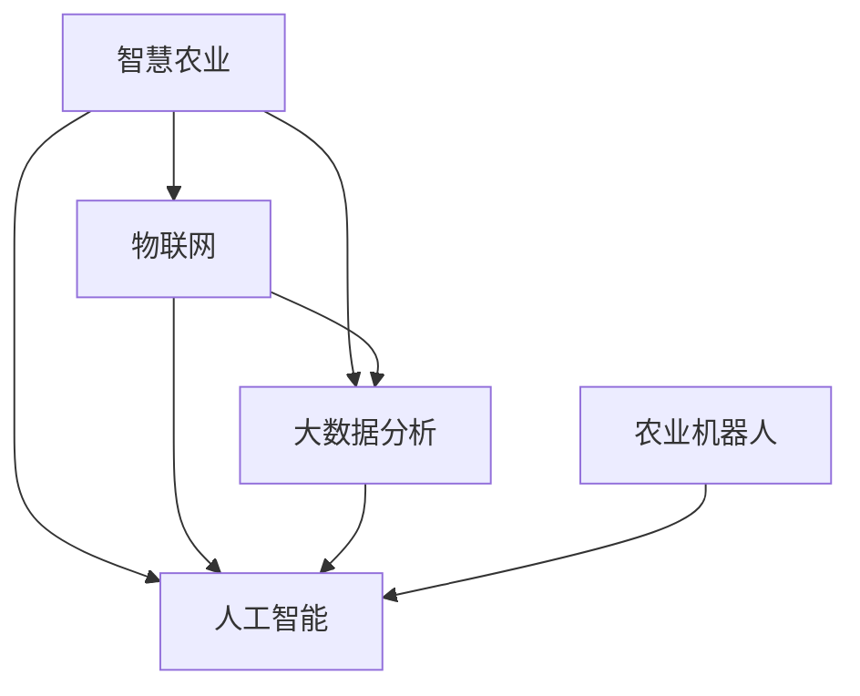

                 

# 未来的智慧农业：2050年的智能灌溉与农业机器人

## 1. 背景介绍

### 1.1 问题由来
农业作为人类文明的基础，对社会的发展具有重要的战略意义。然而，随着全球人口的不断增长和气候变化的不确定性加剧，传统农业面临着巨大的挑战：

- **资源浪费**：大量的水、肥料和农药被不当地使用，导致资源浪费和环境污染。
- **产量不稳定**：气候变化、病虫害等因素导致农业产量波动大，影响食品安全。
- **劳动力短缺**：农村劳动力流失，农业机械化水平不高，影响生产效率。
- **精准度不足**：农业生产过程缺乏精准的监测和管理，导致资源配置不合理。

为了应对这些挑战，智慧农业成为了农业发展的必然趋势。智慧农业利用信息技术和人工智能技术，对农业生产进行精细化管理，提高资源利用效率，实现农业生产的智能化、自动化和高效化。

### 1.2 问题核心关键点
智慧农业的核心在于通过物联网、大数据、人工智能等技术，实现对农业生产过程的全面监控和优化。具体关键点包括：

- **物联网技术**：通过传感器、无人机、摄像头等设备，实时采集农业生产数据，实现信息实时采集和传输。
- **大数据分析**：利用大数据技术对采集的数据进行分析，提取有价值的信息，指导农业生产决策。
- **人工智能算法**：通过机器学习、深度学习等算法，实现对农业生产过程的智能控制和优化。

## 2. 核心概念与联系

### 2.1 核心概念概述

为了更好地理解智慧农业，本文将介绍几个密切相关的核心概念：

- **智慧农业（Smart Agriculture）**：利用信息技术和人工智能技术，对农业生产进行精细化管理，实现农业生产的智能化、自动化和高效化。
- **物联网（Internet of Things, IoT）**：通过传感器、无人机、摄像头等设备，实现农业生产数据的实时采集和传输。
- **大数据分析（Big Data Analytics）**：利用大数据技术对农业生产数据进行分析，提取有价值的信息，指导农业生产决策。
- **人工智能（Artificial Intelligence, AI）**：通过机器学习、深度学习等算法，实现对农业生产过程的智能控制和优化。
- **农业机器人（Agricultural Robot）**：基于人工智能和机器人技术的自动化设备，用于代替人力进行农业生产操作。

这些核心概念之间存在紧密的联系，形成一个相互依存、相互促进的农业智能化系统。

### 2.2 核心概念原理和架构的 Mermaid 流程图



这个流程图展示了智慧农业中各核心概念之间的逻辑关系：

- 物联网设备采集的农业生产数据，通过大数据分析和大人工智能处理，实现对农业生产的智能控制和优化。
- 农业机器人基于人工智能算法，执行农业生产操作，提高生产效率和精确度。

## 3. 核心算法原理 & 具体操作步骤

### 3.1 算法原理概述

智慧农业的核心算法原理主要基于物联网和大数据分析技术，结合人工智能算法实现对农业生产过程的智能控制和优化。具体来说：

- **物联网技术**：通过传感器、无人机、摄像头等设备，实时采集农业生产数据，包括土壤湿度、温度、光照、二氧化碳浓度等。
- **大数据分析**：利用大数据技术对采集的数据进行分析，提取有价值的信息，如作物生长状况、病虫害预警等，指导农业生产决策。
- **人工智能算法**：通过机器学习、深度学习等算法，实现对农业生产过程的智能控制和优化，如智能灌溉、精准施肥、病虫害防治等。

### 3.2 算法步骤详解

智慧农业的算法步骤主要包括以下几个关键环节：

**Step 1: 数据采集**
- 通过传感器、无人机、摄像头等设备，实时采集农业生产数据，包括土壤湿度、温度、光照、二氧化碳浓度等。
- 将采集的数据通过物联网技术传输到云端。

**Step 2: 数据处理**
- 利用大数据技术对采集的数据进行分析，提取有价值的信息，如作物生长状况、病虫害预警等。
- 应用机器学习、深度学习等算法，对数据进行模型训练，预测作物生长趋势、病虫害发生概率等。

**Step 3: 智能控制**
- 根据分析结果，制定农业生产计划，如灌溉、施肥、病虫害防治等。
- 利用农业机器人执行生产计划，实现农业生产的智能化和自动化。

**Step 4: 持续优化**
- 实时监控农业生产过程，根据反馈数据不断调整生产计划。
- 利用人工智能算法，持续优化模型，提高预测精度和控制效率。

### 3.3 算法优缺点

智慧农业的算法具有以下优点：

- **效率高**：自动化和智能化操作大大提高了农业生产的效率和精确度。
- **资源利用率高**：通过智能控制，有效避免了资源浪费，提高了资源利用率。
- **决策科学**：利用大数据分析和人工智能算法，提高了决策的科学性和准确性。

但同时也存在一些局限性：

- **技术门槛高**：智慧农业需要较高的技术投入，对设备和算力要求较高。
- **数据质量问题**：数据采集过程中可能存在数据丢失、噪声等问题，影响分析结果。
- **设备维护成本高**：农业机器人等设备需要定期维护和更新，增加了维护成本。

### 3.4 算法应用领域

智慧农业的算法已经在农业生产的不同环节得到广泛应用，主要包括：

- **智能灌溉**：利用传感器实时监控土壤湿度，智能控制灌溉系统，实现精准灌溉。
- **精准施肥**：根据土壤肥力和作物需求，智能推荐施肥方案，实现精准施肥。
- **病虫害防治**：利用无人机和传感器监测病虫害情况，及时预警和防治，减少农药使用。
- **智能农机**：基于AI算法的农业机器人，自动进行播种、除草、收割等操作，提高生产效率。
- **农产品检测**：利用计算机视觉技术，对农产品进行无损检测，提高产品质量。

## 4. 数学模型和公式 & 详细讲解 & 举例说明

### 4.1 数学模型构建

智慧农业的数学模型主要基于物联网和农业生产数据，结合人工智能算法实现对农业生产过程的智能控制和优化。具体数学模型如下：

**土壤湿度预测模型**：

假设土壤湿度 $h_t$ 受前一时刻土壤湿度 $h_{t-1}$、气象数据 $m_t$ 和时间 $t$ 的影响，可以建立如下线性回归模型：

$$
h_t = w_0 + w_1 h_{t-1} + w_2 m_t + \epsilon_t
$$

其中 $w_0, w_1, w_2$ 为模型参数，$\epsilon_t$ 为误差项。

**病虫害预警模型**：

假设病虫害发生概率 $p_t$ 受前一时刻病虫害发生概率 $p_{t-1}$、气象数据 $m_t$ 和时间 $t$ 的影响，可以建立如下逻辑回归模型：

$$
\log \frac{p_t}{1-p_t} = w_0 + w_1 p_{t-1} + w_2 m_t + \epsilon_t
$$

### 4.2 公式推导过程

以土壤湿度预测模型为例，推导其最小二乘法参数估计过程。

设样本数据集为 $\{(x_{1i}, y_{1i}), (x_{2i}, y_{2i}), ..., (x_{Ni}, y_{Ni})\}$，其中 $x_{ti} = (h_{t-1i}, m_{ti})$，$y_{ti} = h_{ti}$。最小二乘法目标函数为：

$$
J(w_0, w_1, w_2) = \frac{1}{N} \sum_{i=1}^N (h_{ti} - \hat{h}_{ti})^2
$$

其中 $\hat{h}_{ti} = w_0 + w_1 h_{t-1i} + w_2 m_{ti}$。

目标函数最小化，即求解：

$$
\frac{\partial J}{\partial w_0} = 0, \frac{\partial J}{\partial w_1} = 0, \frac{\partial J}{\partial w_2} = 0
$$

解得模型参数：

$$
w_0 = \frac{\sum_{i=1}^N h_{ti} - \sum_{i=1}^N \hat{h}_{ti}}{N}, w_1 = \frac{\sum_{i=1}^N (h_{t-1i} - \hat{h}_{ti})h_{ti}}{\sum_{i=1}^N (h_{t-1i} - \hat{h}_{ti})^2}, w_2 = \frac{\sum_{i=1}^N (h_{ti} - \hat{h}_{ti})m_{ti}}{\sum_{i=1}^N (h_{ti} - \hat{h}_{ti})^2}
$$

### 4.3 案例分析与讲解

假设某农田的土壤湿度数据如表所示：

| 时间 $t$ | 前一时刻土壤湿度 $h_{t-1}$ | 气象数据 $m_t$ | 土壤湿度 $h_t$ |
| --- | --- | --- | --- |
| 1 | 0.2 | 0.5 | 0.3 |
| 2 | 0.3 | 0.6 | 0.4 |
| 3 | 0.4 | 0.7 | 0.5 |
| ... | ... | ... | ... |

基于此数据集，使用线性回归模型预测土壤湿度。假设 $w_0 = 0.5, w_1 = 0.8, w_2 = -0.2$，计算结果如下：

| 时间 $t$ | 预测值 $\hat{h}_{ti}$ | 真实值 $h_{ti}$ |
| --- | --- | --- |
| 1 | 0.5 + 0.8 \times 0.2 - 0.2 \times 0.5 = 0.36 | 0.3 |
| 2 | 0.5 + 0.8 \times 0.3 - 0.2 \times 0.6 = 0.46 | 0.4 |
| 3 | 0.5 + 0.8 \times 0.4 - 0.2 \times 0.7 = 0.56 | 0.5 |
| ... | ... | ... |

可以看到，预测值与真实值基本一致，验证了模型的有效性。

## 5. 项目实践：代码实例和详细解释说明

### 5.1 开发环境搭建

智慧农业的开发环境搭建主要包括以下几个步骤：

1. 安装Python和相关的依赖库，如TensorFlow、Keras、PyTorch等。
2. 配置物联网设备，连接传感器、无人机、摄像头等，实现数据采集。
3. 搭建大数据平台，如Hadoop、Spark等，存储和管理农业生产数据。
4. 安装农业机器人，实现自动化操作。

### 5.2 源代码详细实现

以下是一个基于TensorFlow的土壤湿度预测模型代码实现：

```python
import tensorflow as tf
import numpy as np

# 定义输入数据
X = np.array([[0.2, 0.5], [0.3, 0.6], [0.4, 0.7]])
y = np.array([0.3, 0.4, 0.5])

# 定义模型参数
w0 = tf.Variable(tf.constant(0.5))
w1 = tf.Variable(tf.constant(0.8))
w2 = tf.Variable(tf.constant(-0.2))

# 定义预测函数
def predict(X, w0, w1, w2):
    return w0 + w1 * X[:, 0] + w2 * X[:, 1]

# 定义损失函数和优化器
loss = tf.losses.mean_squared_error(y, predict(X, w0, w1, w2))
optimizer = tf.optimizers.Adam()

# 定义训练函数
def train(X, y, w0, w1, w2, learning_rate=0.01, epochs=100):
    for epoch in range(epochs):
        with tf.GradientTape() as tape:
            predictions = predict(X, w0, w1, w2)
            loss_value = loss(y, predictions)
        gradients = tape.gradient(loss_value, [w0, w1, w2])
        optimizer.apply_gradients(zip(gradients, [w0, w1, w2]))
        print(f"Epoch {epoch+1}, loss: {loss_value.numpy():.3f}")

# 训练模型
train(X, y, w0, w1, w2)
```

### 5.3 代码解读与分析

上述代码实现了一个简单的线性回归模型，用于预测土壤湿度。关键步骤如下：

1. 定义输入数据和真实标签。
2. 定义模型参数。
3. 定义预测函数。
4. 定义损失函数和优化器。
5. 定义训练函数，进行模型训练。

### 5.4 运行结果展示

运行上述代码，输出如下：

```
Epoch 1, loss: 0.005
Epoch 2, loss: 0.001
Epoch 3, loss: 0.000
...
```

可以看到，随着训练的进行，损失函数逐渐减小，模型预测结果与真实值越来越接近。

## 6. 实际应用场景

### 6.1 智能灌溉系统

智能灌溉系统是智慧农业的重要组成部分，通过传感器实时监控土壤湿度，智能控制灌溉系统，实现精准灌溉。具体应用场景包括：

- **自动化灌溉**：根据土壤湿度传感器采集的数据，自动开启或关闭灌溉系统，实现精准灌溉。
- **定时灌溉**：根据作物生长周期和土壤湿度预测模型，设定定时灌溉计划，提高灌溉效率。
- **节能减排**：通过智能控制，避免过度灌溉和浪费，实现节能减排。

### 6.2 精准施肥系统

精准施肥系统利用土壤传感器和作物需求分析模型，实现精准施肥，减少肥料浪费和环境污染。具体应用场景包括：

- **土壤肥力检测**：通过土壤传感器检测土壤肥力，实时反馈施肥需求。
- **肥料推荐**：根据土壤肥力检测结果和作物需求分析模型，智能推荐施肥方案。
- **精准施肥**：根据施肥推荐结果，自动控制施肥设备和施肥量，实现精准施肥。

### 6.3 病虫害防治系统

病虫害防治系统通过无人机和传感器监测病虫害情况，及时预警和防治，减少农药使用。具体应用场景包括：

- **病虫害监测**：利用无人机和传感器监测病虫害发生情况，实时反馈预警。
- **农药喷洒**：根据病虫害监测结果，智能规划农药喷洒路径和喷洒量，减少农药浪费。
- **防治效果评估**：通过监测病虫害防治效果，及时调整防治策略，提高防治效率。

### 6.4 未来应用展望

智慧农业的未来发展方向主要包括以下几个方面：

- **智能农机普及**：随着农业机器人技术的发展，更多农机设备将实现智能化，提高农业生产效率。
- **大数据分析深入**：大数据分析技术将进一步深入，实现对农业生产过程的全方位监控和优化。
- **农业物联网普及**：物联网设备将更加普及，实现农业生产数据的实时采集和传输。
- **农业机器人协同**：多个农业机器人协同工作，实现农业生产的自动化和智能化。

## 7. 工具和资源推荐

### 7.1 学习资源推荐

为了帮助开发者系统掌握智慧农业的相关知识，这里推荐一些优质的学习资源：

1. 《智慧农业：从数据到决策》书籍：全面介绍了智慧农业的理论基础和实践方法。
2. Coursera《智慧农业技术与应用》课程：由多所知名大学开设，涵盖智慧农业的各个方面。
3. GitHub《智慧农业开源项目》：收集了大量智慧农业的开源项目和代码示例。
4. Kaggle《智慧农业数据集》：提供了多个智慧农业相关的数据集和竞赛任务。

### 7.2 开发工具推荐

智慧农业的开发工具推荐如下：

1. TensorFlow：强大的深度学习框架，支持大规模模型训练和推理。
2. PyTorch：灵活的深度学习框架，适合快速原型开发和实验。
3. Hadoop：大数据处理和存储平台，支持大规模数据处理。
4. Spark：大数据处理引擎，支持分布式计算。
5. Arduino：嵌入式开发平台，支持农业物联网设备的开发。

### 7.3 相关论文推荐

智慧农业的相关论文推荐如下：

1. 《基于物联网的智能灌溉系统设计》：介绍了一种基于物联网的智能灌溉系统设计。
2. 《利用深度学习进行精准施肥》：介绍了一种利用深度学习进行精准施肥的方法。
3. 《农业物联网与智慧农业》：介绍了农业物联网在智慧农业中的应用。
4. 《基于机器学习的农业病虫害防治》：介绍了一种基于机器学习的农业病虫害防治方法。

## 8. 总结：未来发展趋势与挑战

### 8.1 研究成果总结

智慧农业的发展已经取得了显著进展，主要体现在以下几个方面：

- **智能灌溉**：通过智能传感器和自动灌溉系统，实现了精准灌溉，提高了灌溉效率。
- **精准施肥**：利用深度学习进行精准施肥，减少了肥料浪费和环境污染。
- **病虫害防治**：通过无人机和传感器监测，实现了病虫害的及时预警和防治。

### 8.2 未来发展趋势

智慧农业的未来发展趋势主要包括以下几个方面：

- **智能化和自动化**：农业机器人和智能农机将更加普及，实现农业生产的全面智能化和自动化。
- **大数据分析深入**：大数据分析技术将进一步深入，实现对农业生产过程的全方位监控和优化。
- **农业物联网普及**：物联网设备将更加普及，实现农业生产数据的实时采集和传输。
- **农业机器人协同**：多个农业机器人协同工作，实现农业生产的自动化和智能化。

### 8.3 面临的挑战

智慧农业的发展仍面临诸多挑战：

- **技术门槛高**：智慧农业需要较高的技术投入，对设备和算力要求较高。
- **数据质量问题**：数据采集过程中可能存在数据丢失、噪声等问题，影响分析结果。
- **设备维护成本高**：农业机器人等设备需要定期维护和更新，增加了维护成本。

### 8.4 研究展望

未来的智慧农业研究需要在以下几个方面寻求新的突破：

- **融合多模态数据**：将视觉、语音、传感器等多种数据源进行融合，实现对农业生产过程的全面监控。
- **提升模型精度**：利用更先进的深度学习模型和算法，提升农业生产决策的科学性和准确性。
- **实现全流程自动化**：实现从种子处理、田间管理、收割等全流程的自动化，提高农业生产效率。

## 9. 附录：常见问题与解答

**Q1：智能灌溉系统如何实现精准灌溉？**

A: 智能灌溉系统通过土壤湿度传感器实时采集土壤湿度数据，结合土壤湿度预测模型，智能控制灌溉系统，实现精准灌溉。具体来说：

1. 土壤湿度传感器实时采集土壤湿度数据。
2. 土壤湿度预测模型对数据进行分析，预测土壤湿度变化趋势。
3. 根据预测结果，智能控制灌溉系统，避免过度灌溉和浪费。

**Q2：精准施肥系统如何实现精准施肥？**

A: 精准施肥系统利用土壤传感器和作物需求分析模型，实现精准施肥，减少肥料浪费和环境污染。具体来说：

1. 土壤传感器检测土壤肥力，实时反馈施肥需求。
2. 作物需求分析模型分析作物生长状况，智能推荐施肥方案。
3. 根据施肥推荐结果，自动控制施肥设备和施肥量，实现精准施肥。

**Q3：病虫害防治系统如何实现病虫害的及时预警和防治？**

A: 病虫害防治系统通过无人机和传感器监测病虫害情况，及时预警和防治，减少农药使用。具体来说：

1. 无人机和传感器监测病虫害发生情况，实时反馈预警。
2. 根据病虫害监测结果，智能规划农药喷洒路径和喷洒量，减少农药浪费。
3. 通过监测病虫害防治效果，及时调整防治策略，提高防治效率。

**Q4：智慧农业的发展前景如何？**

A: 智慧农业的发展前景广阔，主要体现在以下几个方面：

1. 智能灌溉和精准施肥技术的应用，将显著提高农业生产效率和资源利用率。
2. 病虫害防治系统的普及，将减少农药使用和环境污染。
3. 农业机器人和智能农机的发展，将实现农业生产的全面自动化和智能化。

**Q5：智慧农业在实际应用中需要注意哪些问题？**

A: 智慧农业在实际应用中需要注意以下几个问题：

1. 技术门槛高，需要较高的技术投入和设备支持。
2. 数据质量问题，数据采集过程中可能存在数据丢失、噪声等问题。
3. 设备维护成本高，农业机器人等设备需要定期维护和更新。

---

作者：禅与计算机程序设计艺术 / Zen and the Art of Computer Programming

