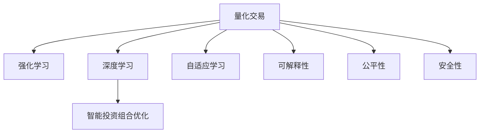

                 

# 未来的智能投资：2050年的AI量化交易与智能投资组合优化

## 1. 背景介绍

### 1.1 问题由来

随着人工智能(AI)技术的发展，特别是在深度学习、自然语言处理(NLP)和强化学习(Reinforcement Learning)等领域的突破，AI在金融领域的应用前景被广泛关注。量化交易(Qualitative Trading)是利用计算机算法在金融市场进行高频交易和风险管理的重要手段，近年来通过AI的引入，量化交易实现了从规则驱动到智能驱动的转型，显现出巨大的潜力。

特别是在智能投资组合优化领域，AI通过高效的数据分析和智能策略优化，能够提升资产管理的效率和精准度。但目前AI在金融领域的实际应用仍然面临诸多挑战，如模型鲁棒性、数据隐私和伦理风险等。展望未来，2050年AI量化交易和智能投资组合优化将如何演变，将成为金融行业的重要研究课题。

### 1.2 问题核心关键点

本文聚焦于2050年AI量化交易和智能投资组合优化，旨在回答以下关键问题：
- 如何构建基于AI的量化交易模型，提升交易效率和收益？
- 智能投资组合优化的核心算法和技术路线有哪些？
- 未来的AI量化交易和智能投资组合优化将面临哪些挑战和机遇？
- 未来的AI量化交易和智能投资组合优化如何确保数据隐私和伦理安全？

## 2. 核心概念与联系

### 2.1 核心概念概述

为更好地理解未来的AI量化交易和智能投资组合优化，本节将介绍几个密切相关的核心概念：

- 量化交易(Quantitative Trading)：利用计算机算法进行高频交易，通过量化模型预测市场趋势，自动化决策。
- 强化学习(Reinforcement Learning, RL)：AI通过试错迭代优化决策策略，最大化预期收益。
- 深度学习(Deep Learning, DL)：通过神经网络模型进行数据特征提取和模式识别。
- 智能投资组合优化(Intelligent Portfolio Optimization, IPO)：基于AI优化资产配置，实现风险-收益的最优平衡。
- 自适应学习(Adaptive Learning)：模型能够根据市场变化动态调整策略，适应不断变化的环境。
- 可解释性(Explainability)：确保AI决策的透明性和可解释性，降低风险。
- 公平性(Fairness)：确保AI模型不会产生偏见，公平对待不同资产。
- 安全性(Security)：保护数据隐私，确保模型的安全性和稳健性。

这些核心概念之间的逻辑关系可以通过以下Mermaid流程图来展示：



这个流程图展示了大语言模型的核心概念及其之间的关系：

1. 量化交易利用深度学习和强化学习等技术，构建预测模型。
2. 智能投资组合优化通过优化模型参数，实现资产配置的智能管理。
3. 自适应学习使得模型能够根据市场变化动态调整策略。
4. 可解释性增强了模型的透明性和可信度。
5. 公平性确保了模型的公平性，避免偏见。
6. 安全性保护了数据隐私和模型安全。

这些概念共同构成了AI量化交易和智能投资组合优化的基本框架，使其能够在各种场景下发挥强大的市场预测和资产管理能力。通过理解这些核心概念，我们可以更好地把握未来AI量化交易和智能投资组合优化技术的发展方向。

## 3. 核心算法原理 & 具体操作步骤
### 3.1 算法原理概述

未来的AI量化交易和智能投资组合优化，本质上是通过深度学习和强化学习等AI技术，对金融市场数据进行高效分析，构建预测模型和优化算法，以实现交易效率提升和资产配置优化。

其核心思想是：
- 利用深度学习模型对历史数据进行特征提取，构建市场预测模型。
- 通过强化学习算法优化资产配置策略，实现风险-收益的最优平衡。
- 在交易策略和投资组合中引入自适应学习机制，提升模型的适应性和鲁棒性。
- 采用可解释性技术，确保模型决策的透明性和可信度。
- 通过公平性和安全性设计，确保模型无偏见，保护数据隐私。

### 3.2 算法步骤详解

未来的AI量化交易和智能投资组合优化一般包括以下几个关键步骤：

**Step 1: 数据收集与预处理**
- 收集历史交易数据、市场新闻、公司财务数据等，构建多维度数据集。
- 对数据进行清洗、归一化、特征提取等预处理，确保数据质量。

**Step 2: 市场预测模型构建**
- 利用深度学习模型（如CNN、RNN、Transformer等），对历史数据进行特征提取和模式识别。
- 根据市场预测任务，选择适当的模型结构和损失函数，训练市场预测模型。

**Step 3: 强化学习策略设计**
- 设计强化学习算法（如DQN、PPO、REINFORCE等），优化交易策略。
- 确定强化学习的奖励函数、状态表示、策略更新规则等关键参数。

**Step 4: 投资组合优化**
- 根据市场预测结果，构建资产配置策略。
- 利用线性规划、整数规划等优化算法，求解资产配置问题。
- 引入自适应学习机制，动态调整资产配置策略。

**Step 5: 风险控制与模型评估**
- 通过历史回测和风险控制模型，评估投资组合的性能。
- 引入可解释性技术，如LIME、SHAP等，提升模型解释性。
- 使用公平性和安全性设计，确保模型无偏见，保护数据隐私。

**Step 6: 实时交易与策略迭代**
- 利用算法交易系统(Algorithmic Trading System)，实现实时交易。
- 根据市场变化，不断迭代优化交易策略和资产配置。

### 3.3 算法优缺点

未来的AI量化交易和智能投资组合优化方法具有以下优点：
1. 高效率。利用深度学习和强化学习技术，能够实现高频交易和实时决策，显著提升交易效率。
2. 高精度。通过多维度数据融合和深度模型构建，提高市场预测和资产配置的准确性。
3. 自适应性。引入自适应学习机制，模型能够根据市场变化动态调整策略，提升鲁棒性。
4. 可解释性。通过可解释性技术，提升模型决策的透明性和可信度。
5. 安全性。通过公平性和安全性设计，确保模型无偏见，保护数据隐私。

同时，这些方法也存在一些局限性：
1. 数据依赖性。模型的效果很大程度上依赖于数据的质量和多样性。
2. 高复杂度。深度学习模型和强化学习算法需要大量计算资源，模型复杂度较高。
3. 过拟合风险。复杂的模型容易过拟合，需要大量标注数据和正则化技术来缓解。
4. 模型解释性不足。深度学习模型往往是“黑盒”，难以解释决策过程。
5. 伦理和隐私问题。模型可能存在偏见，需要多维度伦理考量和数据隐私保护。

尽管存在这些局限性，但就目前而言，基于深度学习和强化学习的AI量化交易和智能投资组合优化方法仍是大势所趋，将深刻影响未来的金融市场。

### 3.4 算法应用领域

未来的AI量化交易和智能投资组合优化方法将广泛应用于金融市场的各个领域，包括但不限于：

- 股票、债券、期货等传统金融产品的量化交易。
- 数字货币、加密资产等新兴金融产品的交易。
- 保险、养老金等资产配置与风险管理。
- 企业风险管理与财务规划。
- 量化资产组合优化与策略迭代。
- 高频交易与套利策略。

此外，AI量化交易和智能投资组合优化也将促进金融科技的创新，如智能投顾、智能合规、智能审计等，为金融服务带来新的发展方向。

## 4. 数学模型和公式 & 详细讲解
### 4.1 数学模型构建

未来的AI量化交易和智能投资组合优化，涉及多种数学模型和公式。以下将以深度学习和强化学习为主要内容，构建基本的数学模型。

**深度学习模型**：
假设市场预测模型为 $M_{\theta}$，其中 $\theta$ 为模型参数。通过深度学习模型对历史数据 $D=\{x_1, x_2, ..., x_n\}$ 进行训练，得到市场预测函数：

$$
M_{\theta}(x) = f_{\theta}(x)
$$

其中 $f_{\theta}$ 为深度神经网络模型，如卷积神经网络(CNN)、循环神经网络(RNN)、变压器(Transformer)等。

**强化学习模型**：
假设强化学习算法为 $A_{\pi}$，其中 $\pi$ 为策略函数。通过强化学习算法在历史交易数据 $D=\{s_1, a_1, r_1, s_2, a_2, r_2, ..., s_n, a_n, r_n\}$ 上进行训练，得到策略函数：

$$
A_{\pi}(s, a) = \pi(a|s)
$$

其中 $s$ 为市场状态，$a$ 为交易策略，$r$ 为交易收益。

**投资组合优化模型**：
假设投资组合优化问题为线性规划问题，求解目标函数：

$$
\min_{x} \quad c^T x
$$

满足约束条件：

$$
Ax = b, \quad x \geq 0
$$

其中 $c$ 为收益向量，$A$ 为约束矩阵，$b$ 为约束向量。

### 4.2 公式推导过程

**深度学习模型的推导**：
以卷积神经网络(CNN)为例，其基本结构如下：

$$
f_{\theta}(x) = W_1 h_1(x) + b_1
$$

$$
h_1(x) = \max_{i=1}^n \{W_2 x_i + b_2\}
$$

其中 $W_i$ 和 $b_i$ 为卷积核和偏置项。通过反向传播算法，计算损失函数对参数 $\theta$ 的梯度，进行参数更新：

$$
\theta \leftarrow \theta - \eta \nabla_{\theta}\mathcal{L}(\theta)
$$

**强化学习模型的推导**：
以深度Q网络(DQN)为例，其基本结构如下：

$$
Q_{\theta}(s, a) = W h(s, a) + b
$$

其中 $h(s, a)$ 为状态-动作的特征表示，$W$ 和 $b$ 为神经网络参数。通过损失函数：

$$
\mathcal{L}(\theta) = \frac{1}{N} \sum_{i=1}^N (Q_{\theta}(s_i, a_i) - y_i)^2
$$

进行参数更新：

$$
\theta \leftarrow \theta - \eta \nabla_{\theta}\mathcal{L}(\theta)
$$

其中 $y_i$ 为实际的Q值。

**投资组合优化模型的推导**：
以线性规划问题为例，求解目标函数：

$$
\min_{x} \quad c^T x
$$

满足约束条件：

$$
Ax = b, \quad x \geq 0
$$

通过求解器（如CPLEX、Gurobi等），求解最优解：

$$
x^* = \arg\min_x \left\{ c^T x : Ax = b, x \geq 0 \right\}
$$

其中 $x^*$ 为最优解向量。

### 4.3 案例分析与讲解

**案例1：股票价格预测**
- 数据：历史股票价格、交易量、公司财务数据等。
- 模型：卷积神经网络(CNN)。
- 训练：利用历史数据对CNN模型进行训练，得到市场预测函数 $M_{\theta}$。
- 应用：根据市场预测函数 $M_{\theta}$，预测未来股票价格，指导交易策略。

**案例2：智能投资组合优化**
- 数据：市场数据、公司财务数据、风险评估指标等。
- 模型：线性规划问题。
- 训练：利用历史数据和市场预测结果，求解最优资产配置 $x^*$。
- 应用：根据最优资产配置 $x^*$，动态调整投资组合，实现风险-收益的最优平衡。

**案例3：高频交易策略**
- 数据：市场深度数据、交易价格、成交量等。
- 模型：强化学习算法(DQN)。
- 训练：利用历史交易数据对DQN算法进行训练，得到交易策略 $A_{\pi}$。
- 应用：根据交易策略 $A_{\pi}$，进行高频交易，实现套利收益。

## 5. 项目实践：代码实例和详细解释说明
### 5.1 开发环境搭建

在进行AI量化交易和智能投资组合优化实践前，我们需要准备好开发环境。以下是使用Python进行TensorFlow和PyTorch开发的环境配置流程：

1. 安装Anaconda：从官网下载并安装Anaconda，用于创建独立的Python环境。

2. 创建并激活虚拟环境：
```bash
conda create -n pytorch-env python=3.8 
conda activate pytorch-env
```

3. 安装TensorFlow和PyTorch：根据CUDA版本，从官网获取对应的安装命令。例如：
```bash
conda install tensorflow -c tensorflow
conda install pytorch torchvision torchaudio cudatoolkit=11.1 -c pytorch -c conda-forge
```

4. 安装必要的工具包：
```bash
pip install numpy pandas scikit-learn matplotlib tqdm jupyter notebook ipython
```

完成上述步骤后，即可在`pytorch-env`环境中开始AI量化交易和智能投资组合优化的实践。

### 5.2 源代码详细实现

下面我们以股票价格预测任务为例，给出使用TensorFlow和PyTorch进行深度学习的PyTorch代码实现。

**股票价格预测模型**

```python
import tensorflow as tf
from tensorflow.keras import layers

class CNNModel(tf.keras.Model):
    def __init__(self):
        super(CNNModel, self).__init__()
        self.conv1 = layers.Conv2D(32, (3, 3), activation='relu')
        self.pool1 = layers.MaxPooling2D((2, 2))
        self.conv2 = layers.Conv2D(64, (3, 3), activation='relu')
        self.pool2 = layers.MaxPooling2D((2, 2))
        self.flatten = layers.Flatten()
        self.dense1 = layers.Dense(256, activation='relu')
        self.dense2 = layers.Dense(1)

    def call(self, inputs):
        x = self.conv1(inputs)
        x = self.pool1(x)
        x = self.conv2(x)
        x = self.pool2(x)
        x = self.flatten(x)
        x = self.dense1(x)
        return self.dense2(x)

model = CNNModel()

optimizer = tf.keras.optimizers.Adam(learning_rate=0.001)
loss_fn = tf.keras.losses.MeanSquaredError()

# 训练
model.compile(optimizer=optimizer, loss=loss_fn)

# 数据准备
train_data = # 训练集数据
val_data = # 验证集数据

# 训练
model.fit(train_data, validation_data=val_data, epochs=10)

# 测试
test_data = # 测试集数据
predictions = model.predict(test_data)
```

**智能投资组合优化模型**

```python
import pandas as pd
from scipy.optimize import linprog

# 构建投资组合优化问题
c = [1, 1]  # 目标函数系数
A = [[1, 0], [0, 1]]  # 约束矩阵
b = [1, 1]  # 约束向量

# 求解投资组合优化问题
x = linprog(c, A_ub=A, b_ub=b, bounds=(0, None), method='simplex')
print(x)

# 输出最优投资组合
print('最优资产配置：')
print(x.x)
```

### 5.3 代码解读与分析

让我们再详细解读一下关键代码的实现细节：

**CNNModel类**：
- `__init__`方法：初始化卷积层、池化层、全连接层等基本组件。
- `call`方法：前向传播过程，通过卷积和全连接层计算输出。

**投资组合优化模型**：
- 使用`linprog`函数，通过线性规划求解最优资产配置。

**数据准备**：
- 数据预处理包括归一化、特征提取等步骤。
- 数据集应包括历史价格、交易量等关键指标，用于模型训练和预测。

**训练过程**：
- 使用`compile`函数，配置优化器和损失函数。
- 使用`fit`函数，进行模型训练，设定训练轮数和验证集。
- 使用`predict`函数，进行模型测试，输出预测结果。

**投资组合优化**：
- 通过线性规划求解最优资产配置，输出最优权重。
- 结合市场预测结果，动态调整投资组合。

## 6. 实际应用场景
### 6.1 智能投顾系统

未来的智能投顾系统将结合AI量化交易和智能投资组合优化技术，为用户提供个性化的资产配置建议。通过深度学习模型对市场数据进行分析，AI投顾系统能够实时预测股票、基金等金融产品的价格变化，指导用户进行投资决策。

智能投顾系统通过用户画像、风险偏好等个人信息，构建个性化的投资组合，并通过强化学习算法动态调整策略，最大化用户收益。同时，AI投顾系统还能够提供实时市场分析报告，增强用户体验。

### 6.2 量化交易策略

未来的量化交易策略将更加智能化和自动化。通过深度学习模型进行市场预测，结合强化学习算法进行策略优化，量化交易系统能够实现高频交易、套利等复杂策略，最大化投资收益。

例如，利用深度学习模型对历史交易数据进行特征提取，构建股票价格预测模型 $M_{\theta}$。结合强化学习算法，量化交易系统能够在股票价格变化时，自动调整交易策略，进行高频交易和套利操作。

### 6.3 智能风险管理

未来的智能风险管理系统将结合AI量化交易和智能投资组合优化技术，实现对风险的有效控制和预测。通过深度学习模型对市场数据进行分析，智能风险管理系统能够预测市场波动和风险事件，及时发出预警信号，帮助用户规避风险。

例如，利用深度学习模型对历史数据进行特征提取，构建市场风险预测模型。结合智能投资组合优化算法，风险管理系统能够根据市场波动动态调整资产配置，实现风险控制。

### 6.4 未来应用展望

随着AI量化交易和智能投资组合优化技术的不断演进，未来的金融市场将更加智能化和自动化。以下是对未来应用场景的展望：

- **智能投顾系统**：结合AI量化交易和智能投资组合优化技术，提供个性化的资产配置建议。
- **量化交易策略**：通过深度学习模型和强化学习算法，实现高频交易、套利等复杂策略。
- **智能风险管理**：结合AI量化交易和智能投资组合优化技术，实现对风险的有效控制和预测。
- **金融科技**：通过AI量化交易和智能投资组合优化技术，推动金融科技的发展，如智能合约、智能审计等。
- **区块链金融**：结合AI量化交易和智能投资组合优化技术，推动区块链金融的应用和发展。
- **跨境金融**：通过AI量化交易和智能投资组合优化技术，推动跨境金融的发展，实现全球金融市场的互联互通。

这些未来应用场景展示了AI量化交易和智能投资组合优化技术的巨大潜力，将深刻影响未来的金融市场和金融科技产业。

## 7. 工具和资源推荐
### 7.1 学习资源推荐

为了帮助开发者系统掌握AI量化交易和智能投资组合优化技术，这里推荐一些优质的学习资源：

1. 《Deep Learning for Trading》系列博文：由AI量化交易领域的专家撰写，深入浅出地介绍了AI量化交易的核心技术和应用案例。

2. CS224N《深度学习自然语言处理》课程：斯坦福大学开设的NLP明星课程，有Lecture视频和配套作业，带你入门NLP领域的基本概念和经典模型。

3. 《Reinforcement Learning: An Introduction》书籍：由Reinforcement Learning领域的权威学者撰写，全面介绍了强化学习的基本原理和应用案例。

4. TensorFlow和PyTorch官方文档：提供了深度学习框架的详细介绍和官方样例，是学习深度学习的重要资源。

5. Coursera《Machine Learning》课程：由斯坦福大学的Andrew Ng教授主讲，深入讲解了机器学习和深度学习的基本原理和应用。

通过对这些资源的学习实践，相信你一定能够快速掌握AI量化交易和智能投资组合优化技术的精髓，并用于解决实际的金融问题。
###  7.2 开发工具推荐

高效的开发离不开优秀的工具支持。以下是几款用于AI量化交易和智能投资组合优化开发的常用工具：

1. TensorFlow：由Google主导开发的深度学习框架，生产部署方便，适合大规模工程应用。同样有丰富的预训练语言模型资源。

2. PyTorch：基于Python的开源深度学习框架，灵活动态的计算图，适合快速迭代研究。大部分预训练语言模型都有PyTorch版本的实现。

3. Jupyter Notebook：交互式编程环境，便于进行代码调试和实验展示，支持Python、R等多种语言。

4. Weights & Biases：模型训练的实验跟踪工具，可以记录和可视化模型训练过程中的各项指标，方便对比和调优。与主流深度学习框架无缝集成。

5. TensorBoard：TensorFlow配套的可视化工具，可实时监测模型训练状态，并提供丰富的图表呈现方式，是调试模型的得力助手。

6. Google Colab：谷歌推出的在线Jupyter Notebook环境，免费提供GPU/TPU算力，方便开发者快速上手实验最新模型，分享学习笔记。

合理利用这些工具，可以显著提升AI量化交易和智能投资组合优化的开发效率，加快创新迭代的步伐。

### 7.3 相关论文推荐

AI量化交易和智能投资组合优化技术的发展源于学界的持续研究。以下是几篇奠基性的相关论文，推荐阅读：

1. Deep Learning for Trading: A Survey and Taxonomy：综述了深度学习在量化交易中的应用，介绍了多个经典模型和应用案例。

2. Reinforcement Learning for Trading：通过强化学习进行量化交易策略优化，介绍了DQN、PPO等算法在交易中的应用。

3. High-frequency Trading with Deep Learning：利用深度学习进行高频交易，介绍了LSTM、CNN等模型在交易中的应用。

4. Robust Model-based Decision Making for Trading：通过模型预测和风险控制相结合，提高了量化交易的鲁棒性。

5. Algorithmic Trading in Fixed-Income Markets：介绍了量化交易在固定收益市场的应用，包括模型构建和策略优化。

这些论文代表了大语言模型微调技术的发展脉络。通过学习这些前沿成果，可以帮助研究者把握学科前进方向，激发更多的创新灵感。

## 8. 总结：未来发展趋势与挑战
### 8.1 总结

本文对未来的AI量化交易和智能投资组合优化技术进行了全面系统的介绍。首先阐述了AI量化交易和智能投资组合优化的研究背景和意义，明确了其在金融市场的重要作用。其次，从原理到实践，详细讲解了AI量化交易和智能投资组合优化的数学模型和操作步骤，给出了完整代码实例和详细解释说明。同时，本文还广泛探讨了AI量化交易和智能投资组合优化在实际应用中的场景和展望，展示了其巨大的潜力和应用前景。此外，本文还精选了相关的学习资源和工具推荐，力求为开发者提供全方位的技术指引。

通过本文的系统梳理，可以看到，未来的AI量化交易和智能投资组合优化技术将在金融市场和金融科技领域发挥重要作用，通过深度学习和强化学习等AI技术，提升交易效率和资产配置的精准度。但同时，这些技术也面临诸多挑战，如模型鲁棒性、数据隐私和伦理风险等，需要学术界和产业界的共同努力，才能实现技术的成熟落地。

### 8.2 未来发展趋势

展望未来，AI量化交易和智能投资组合优化技术将呈现以下几个发展趋势：

1. 模型复杂度持续增大。随着算力成本的下降和数据规模的扩张，深度学习模型的复杂度将继续提升，能够学习更复杂的金融市场模式。

2. 多模态融合。未来的AI量化交易和智能投资组合优化将融合股票、债券、衍生品等多模态数据，提升市场预测和资产配置的准确性。

3. 实时交易与高频交易。通过AI技术，实现高频交易和实时决策，提升交易效率和收益。

4. 自适应学习机制。引入自适应学习机制，模型能够根据市场变化动态调整策略，提升鲁棒性和适应性。

5. 智能投顾与智能合规。通过AI技术，实现智能投顾和智能合规，提高用户体验和合规性。

6. 多层次风险控制。结合深度学习、强化学习等多种技术，实现多层次风险控制，提升金融系统的安全性。

以上趋势凸显了AI量化交易和智能投资组合优化技术的广阔前景，这些方向的探索发展，必将进一步提升金融市场的智能化水平，推动金融科技的创新。

### 8.3 面临的挑战

尽管AI量化交易和智能投资组合优化技术已经取得了显著进展，但在迈向更加智能化、普适化应用的过程中，仍面临诸多挑战：

1. 数据隐私问题。AI模型的训练依赖大量数据，如何保护用户隐私和数据安全，成为重要课题。

2. 模型鲁棒性不足。模型在面对新的市场数据时，容易出现过拟合或泛化能力不足的问题。

3. 模型解释性不足。深度学习模型往往是“黑盒”，难以解释决策过程，缺乏可信度。

4. 伦理和公平性问题。AI模型可能存在偏见，需要多维度伦理考量和公平性设计。

5. 算力资源限制。深度学习和强化学习模型需要大量计算资源，硬件瓶颈限制了模型的扩展。

6. 多场景适应性。AI量化交易和智能投资组合优化需要适应多种市场场景，需要灵活设计策略和模型。

正视这些挑战，积极应对并寻求突破，将是大语言模型微调技术迈向成熟的必由之路。相信随着学界和产业界的共同努力，这些挑战终将一一被克服，AI量化交易和智能投资组合优化必将在构建人机协同的智能金融体系中扮演越来越重要的角色。

### 8.4 研究展望

面向未来，AI量化交易和智能投资组合优化技术的研究需要在以下几个方面寻求新的突破：

1. 探索无监督和半监督学习方法。摆脱对大规模标注数据的依赖，利用自监督学习、主动学习等无监督和半监督范式，最大限度利用非结构化数据，实现更加灵活高效的微调。

2. 开发更加高效的优化算法。引入更加高效的优化算法，如自适应梯度优化、分布式训练等，提升模型的训练效率和优化性能。

3. 研究多层次风险控制方法。结合深度学习、强化学习等多种技术，实现多层次风险控制，提升金融系统的安全性。

4. 融合更多先验知识。将符号化的先验知识，如知识图谱、逻辑规则等，与神经网络模型进行巧妙融合，引导微调过程学习更准确、合理的语言模型。

5. 引入公平性和安全性设计。在模型训练目标中引入伦理导向的评估指标，过滤和惩罚有偏见、有害的输出倾向，确保数据隐私和伦理安全。

这些研究方向的探索，必将引领AI量化交易和智能投资组合优化技术迈向更高的台阶，为构建安全、可靠、可解释、可控的智能金融系统铺平道路。面向未来，AI量化交易和智能投资组合优化技术还需要与其他人工智能技术进行更深入的融合，如知识表示、因果推理、强化学习等，多路径协同发力，共同推动金融科技的发展。只有勇于创新、敢于突破，才能不断拓展语言模型的边界，让智能技术更好地造福人类社会。

## 9. 附录：常见问题与解答

**Q1：未来的AI量化交易和智能投资组合优化是否会面临数据隐私问题？**

A: 未来的AI量化交易和智能投资组合优化确实会面临数据隐私问题。AI模型的训练依赖大量数据，如何保护用户隐私和数据安全，成为重要课题。未来需要通过多维度设计，如数据匿名化、差分隐私等技术，确保数据的隐私和安全。

**Q2：未来的AI量化交易和智能投资组合优化是否会面临模型鲁棒性不足的问题？**

A: 未来的AI量化交易和智能投资组合优化确实会面临模型鲁棒性不足的问题。模型在面对新的市场数据时，容易出现过拟合或泛化能力不足的问题。未来需要通过模型融合、多模态学习等方法，提升模型的鲁棒性和泛化能力。

**Q3：未来的AI量化交易和智能投资组合优化是否会面临模型解释性不足的问题？**

A: 未来的AI量化交易和智能投资组合优化确实会面临模型解释性不足的问题。深度学习模型往往是“黑盒”，难以解释决策过程，缺乏可信度。未来需要通过可解释性技术，如LIME、SHAP等，提升模型的解释性和透明性。

**Q4：未来的AI量化交易和智能投资组合优化是否会面临伦理和公平性问题？**

A: 未来的AI量化交易和智能投资组合优化确实会面临伦理和公平性问题。AI模型可能存在偏见，需要多维度伦理考量和公平性设计。未来需要通过模型公平性评估、数据清洗等方法，确保模型的公平性和公正性。

**Q5：未来的AI量化交易和智能投资组合优化是否会面临算力资源限制？**

A: 未来的AI量化交易和智能投资组合优化确实会面临算力资源限制。深度学习和强化学习模型需要大量计算资源，硬件瓶颈限制了模型的扩展。未来需要通过分布式训练、硬件加速等方法，提升模型的训练效率和计算性能。

通过本文的系统梳理，可以看到，未来的AI量化交易和智能投资组合优化技术将在金融市场和金融科技领域发挥重要作用，通过深度学习和强化学习等AI技术，提升交易效率和资产配置的精准度。但同时，这些技术也面临诸多挑战，如数据隐私、模型鲁棒性、解释性等，需要学术界和产业界的共同努力，才能实现技术的成熟落地。相信随着学界和产业界的共同努力，这些挑战终将一一被克服，AI量化交易和智能投资组合优化必将在构建人机协同的智能金融体系中扮演越来越重要的角色。

---

作者：禅与计算机程序设计艺术 / Zen and the Art of Computer Programming

