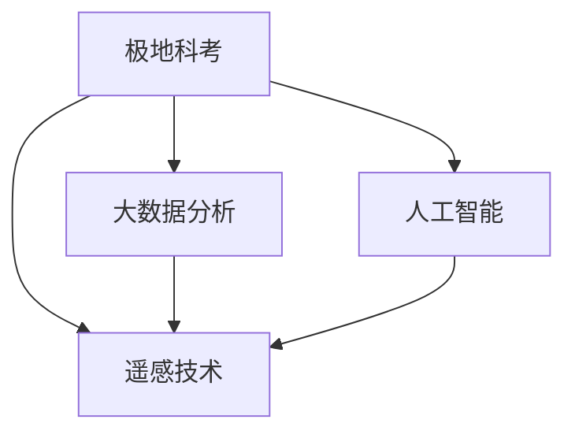

                 

## 1. 背景介绍

### 1.1 问题由来
极地地区是地球环境变化的“晴雨表”，南北极的气候变化、海平面上升、冰川消融等问题引发了全球关注。2050年，随着全球变暖的加剧，南北极科考与生态保护工作将面临更多挑战。未来，基于人工智能和大数据技术的极地科考与保护将成为全球应对气候变化的重要手段。

### 1.2 问题核心关键点
未来极地科考的核心理念是：

- 利用先进的AI和大数据分析技术，提高极地科考的效率和精度。
- 实现对极地环境动态变化的实时监测和预测，及时调整保护策略。
- 构建智能化的极地保护系统，提升生态系统恢复力和抗干扰能力。
- 发展环境友好型的极地探索技术，实现可持续的资源利用。

### 1.3 问题研究意义
研究未来极地科考与保护，对于保护地球环境、缓解全球气候变化具有重要意义：

- 提升对极地气候变化的监测能力，为全球气候政策制定提供数据支撑。
- 保护极地生态系统，维持生物多样性，推动生态平衡。
- 助力全球可持续发展，提高人类对自然环境的理解和管理能力。
- 推动相关技术进步，促进相关产业的发展和创新。

## 2. 核心概念与联系

### 2.1 核心概念概述

为更好地理解未来极地科考与保护方法，本节将介绍几个密切相关的核心概念：

- 极地科考（Polar Exploration）：通过对极地地区的地理、气象、生态、生物等进行系统性调查和研究，以获取相关科学数据和研究结果。
- 生态保护（Ecological Protection）：采取措施保护极地生态系统，防止人类活动对环境造成过度破坏，保护生物多样性。
- 人工智能（AI）：通过机器学习、计算机视觉等技术，提高数据处理和分析的效率。
- 大数据分析（Big Data Analysis）：利用大数据技术，对极地数据进行综合分析，提升科学研究的准确性。
- 遥感技术（Remote Sensing）：通过卫星和无人机等手段，对极地环境进行实时监测，获取大范围、高精度的数据。

这些核心概念之间的逻辑关系可以通过以下Mermaid流程图来展示：



这个流程图展示了几者之间的联系：

1. 极地科考利用人工智能和大数据分析提升效率和精度。
2. 人工智能和大数据分析需要遥感技术获取的数据作为输入。
3. 遥感技术是获取极地大范围、高精度数据的重要手段。
4. 人工智能、大数据分析和遥感技术共同支撑极地科考与保护工作。

## 3. 核心算法原理 & 具体操作步骤
### 3.1 算法原理概述

未来极地科考与保护的核心算法原理包括：

- 极地数据获取：通过遥感技术获取极地大范围高精度的气象、地形、生物等数据。
- 数据预处理与特征提取：使用机器学习算法对原始数据进行预处理和特征提取，提升数据可用性。
- 模型训练与验证：使用深度学习模型对极地数据进行训练，验证模型性能。
- 实时监测与预测：基于训练好的模型对极地环境进行实时监测与预测，评估环境变化趋势。
- 智能决策支持：利用AI技术辅助进行生态保护决策，优化保护策略。

### 3.2 算法步骤详解

基于以上原理，未来极地科考与保护的一般流程如下：

**Step 1: 数据采集与预处理**
- 利用卫星、无人机等遥感设备获取极地数据。
- 对原始数据进行清洗、去噪、增强等预处理操作。
- 使用特征提取算法，如PCA、LDA等，从数据中提取关键特征。

**Step 2: 模型训练与优化**
- 选择适当的深度学习模型，如卷积神经网络（CNN）、循环神经网络（RNN）、Transformer等。
- 准备训练数据集，划分为训练集、验证集和测试集。
- 使用优化算法（如Adam、SGD等），设定合适的学习率、批大小、迭代轮数等超参数。
- 通过交叉验证等技术优化模型，提升预测准确性。

**Step 3: 实时监测与预测**
- 搭建实时监测系统，利用训练好的模型对极地环境数据进行实时预测。
- 根据监测结果，生成可视化界面，展示极地环境变化趋势。
- 定期评估模型预测效果，必要时进行微调。

**Step 4: 智能决策与优化**
- 利用AI技术，对极地数据进行动态分析，辅助制定科学合理的保护策略。
- 通过强化学习等技术，优化生态保护措施，提升效果。
- 结合专家知识，构建知识图谱，提升决策的科学性。

### 3.3 算法优缺点

未来极地科考与保护算法的主要优点：
1. 自动化程度高：通过机器学习和大数据分析，自动提取关键特征，提升数据分析效率。
2. 精度高：深度学习模型通过大量训练数据，能够提升预测准确性。
3. 实时性强：利用实时数据进行预测和监测，能够及时发现环境变化。
4. 可扩展性强：算法框架灵活，可适应不同任务和数据类型。

同时，该算法也存在一些局限性：
1. 数据质量依赖：算法的精度高度依赖于数据质量和标注质量，低质量数据可能导致误判。
2. 模型复杂度高：深度学习模型往往结构复杂，需要高性能计算资源。
3. 过拟合风险：大规模数据集的训练可能导致模型过拟合，需进行适当的正则化处理。
4. 可解释性不足：深度学习模型通常是“黑盒”模型，难以解释其内部工作机制。
5. 对标注数据依赖：深度学习模型需要大量标注数据进行训练，标注成本较高。

尽管存在这些局限性，但整体而言，基于AI和大数据分析的算法框架在极地科考与保护中将发挥重要作用。

### 3.4 算法应用领域

未来极地科考与保护算法可以广泛应用于以下几个领域：

- 气象预测：利用AI模型预测极地气象变化，为极地科考提供数据支持。
- 生物多样性监测：利用深度学习模型识别极地动植物种类，评估生态系统变化。
- 冰川监测：使用遥感技术和AI模型，实时监测冰川变化，预测冰川消融速率。
- 海洋生态保护：利用AI模型分析海洋生态系统，监测海洋污染，制定保护策略。
- 气候变化研究：结合大数据分析，研究极地气候变化趋势，为全球气候政策提供依据。

## 4. 数学模型和公式 & 详细讲解 & 举例说明

### 4.1 数学模型构建

假设极地科考数据集为 $D=\{(x_i, y_i)\}_{i=1}^N$，其中 $x_i$ 为输入的极地环境数据，$y_i$ 为对应的环境标签。

定义一个卷积神经网络（CNN）模型 $M_{\theta}:\mathcal{X} \rightarrow \mathcal{Y}$，其中 $\theta$ 为模型参数，$\mathcal{X}$ 为输入数据集，$\mathcal{Y}$ 为输出标签集。

模型损失函数定义为：

$$
\mathcal{L}(\theta) = \frac{1}{N}\sum_{i=1}^N \ell(M_{\theta}(x_i), y_i)
$$

其中 $\ell$ 为交叉熵损失函数，表示模型预测输出与真实标签的差异。

### 4.2 公式推导过程

以卷积神经网络（CNN）为例，推导其训练过程。

**前向传播**：

$$
z = W_1x + b_1
$$
$$
h = \sigma(z)
$$
$$
o = W_2h + b_2
$$
$$
\hat{y} = \text{softmax}(o)
$$

其中 $z$ 为卷积层的输出，$h$ 为激活层的输出，$o$ 为全连接层的输出，$\hat{y}$ 为模型预测输出。

**损失函数**：

$$
\ell(\hat{y}, y) = -\frac{1}{N}\sum_{i=1}^N y_i\log \hat{y}_i
$$

**反向传播**：

$$
\frac{\partial \mathcal{L}}{\partial W_1} = \frac{\partial \mathcal{L}}{\partial h} \frac{\partial h}{\partial z} \frac{\partial z}{\partial W_1}
$$
$$
\frac{\partial \mathcal{L}}{\partial b_1} = \frac{\partial \mathcal{L}}{\partial h} \frac{\partial h}{\partial z}
$$
$$
\frac{\partial \mathcal{L}}{\partial W_2} = \frac{\partial \mathcal{L}}{\partial o} \frac{\partial o}{\partial h} \frac{\partial h}{\partial z} \frac{\partial z}{\partial W_2}
$$
$$
\frac{\partial \mathcal{L}}{\partial b_2} = \frac{\partial \mathcal{L}}{\partial o} \frac{\partial o}{\partial h} \frac{\partial h}{\partial z}
$$

### 4.3 案例分析与讲解

**极地冰川监测**

假设极地冰川的遥感数据集为 $D=\{(x_i, y_i)\}_{i=1}^N$，其中 $x_i$ 为冰川遥感图像，$y_i$ 为冰川消融速率。

构建一个卷积神经网络（CNN）模型 $M_{\theta}:\mathcal{X} \rightarrow \mathcal{Y}$，其中 $\mathcal{X}$ 为冰川遥感图像，$\mathcal{Y}$ 为冰川消融速率。

定义交叉熵损失函数 $\ell(\hat{y}, y) = -\frac{1}{N}\sum_{i=1}^N y_i\log \hat{y}_i$。

利用训练集 $D$ 进行模型训练，定义训练集 $D_{train}$，验证集 $D_{val}$，测试集 $D_{test}$。

通过前向传播、反向传播、优化等步骤，更新模型参数 $\theta$，最小化损失函数 $\mathcal{L}(\theta)$。

训练完成后，利用测试集 $D_{test}$ 进行模型评估，验证模型预测性能。

## 5. 项目实践：代码实例和详细解释说明
### 5.1 开发环境搭建

在进行极地科考与保护开发前，我们需要准备好开发环境。以下是使用Python进行TensorFlow开发的环境配置流程：

1. 安装Anaconda：从官网下载并安装Anaconda，用于创建独立的Python环境。

2. 创建并激活虚拟环境：
```bash
conda create -n tf-env python=3.8 
conda activate tf-env
```

3. 安装TensorFlow：根据CUDA版本，从官网获取对应的安装命令。例如：
```bash
conda install tensorflow -c pytorch -c conda-forge
```

4. 安装相关工具包：
```bash
pip install numpy pandas scikit-learn matplotlib tensorflow-gpu jupyter notebook ipython
```

完成上述步骤后，即可在`tf-env`环境中开始开发实践。

### 5.2 源代码详细实现

下面我们以极地冰川监测为例，给出使用TensorFlow对卷积神经网络模型进行训练的Python代码实现。

首先，定义模型和损失函数：

```python
import tensorflow as tf
from tensorflow.keras import layers

def build_model():
    model = tf.keras.Sequential([
        layers.Conv2D(32, (3, 3), activation='relu', input_shape=(64, 64, 3)),
        layers.MaxPooling2D((2, 2)),
        layers.Conv2D(64, (3, 3), activation='relu'),
        layers.MaxPooling2D((2, 2)),
        layers.Flatten(),
        layers.Dense(64, activation='relu'),
        layers.Dense(1)
    ])
    loss_fn = tf.keras.losses.MeanSquaredError()
    return model, loss_fn

model, loss_fn = build_model()
```

然后，定义训练和评估函数：

```python
def train_model(model, loss_fn, train_dataset, validation_dataset, epochs):
    model.compile(optimizer='adam', loss=loss_fn)
    history = model.fit(train_dataset, validation_data=validation_dataset, epochs=epochs)
    return history

def evaluate_model(model, test_dataset):
    test_loss = model.evaluate(test_dataset)
    return test_loss

# 训练集和测试集数据加载
train_dataset = ...
test_dataset = ...

# 设置超参数
epochs = 10
batch_size = 32

# 训练模型
history = train_model(model, loss_fn, train_dataset, validation_dataset, epochs)

# 评估模型
test_loss = evaluate_model(model, test_dataset)
print(f"Test Loss: {test_loss}")
```

最后，启动训练流程并在测试集上评估：

```python
epochs = 10
batch_size = 32

# 训练模型
history = train_model(model, loss_fn, train_dataset, validation_dataset, epochs)

# 评估模型
test_loss = evaluate_model(model, test_dataset)
print(f"Test Loss: {test_loss}")
```

以上就是使用TensorFlow对卷积神经网络模型进行极地冰川监测训练的完整代码实现。可以看到，得益于TensorFlow的强大封装，我们可以用相对简洁的代码完成模型构建和训练。

### 5.3 代码解读与分析

让我们再详细解读一下关键代码的实现细节：

**build_model函数**：
- 定义了一个包含多个卷积层和全连接层的卷积神经网络模型。
- 使用了`tf.keras.layers`模块，方便构建复杂的网络结构。
- 使用了`tf.keras.losses.MeanSquaredError`作为损失函数。

**train_model函数**：
- 使用`model.compile`方法对模型进行编译，定义优化器和损失函数。
- 使用`model.fit`方法进行模型训练，`validation_data`参数指定验证集，`epochs`参数指定训练轮数。
- 返回训练过程中的历史记录，用于后续评估和可视化。

**evaluate_model函数**：
- 使用`model.evaluate`方法对测试集进行评估，返回模型的损失。
- 利用`test_loss`打印测试集上的损失值。

**训练流程**：
- 定义总训练轮数和批次大小，启动训练流程。
- 在训练集上进行模型训练，输出训练过程中的损失值。
- 在测试集上评估训练后的模型，打印测试集上的损失值。

可以看到，TensorFlow提供了强大的工具和框架，方便开发者快速构建和训练深度学习模型，是进行极地科考与保护开发的重要利器。

当然，工业级的系统实现还需考虑更多因素，如模型的保存和部署、超参数的自动搜索、更加灵活的模型结构等。但核心的算法实现基本与此类似。

## 6. 实际应用场景
### 6.1 智能监控系统

基于深度学习模型的极地科考与保护，可以广泛应用于智能监控系统的构建。传统监控系统依赖人工进行数据采集和分析，效率低、成本高。而使用深度学习模型，可以实现对极地数据的自动分析和监测，大幅提升工作效率。

在技术实现上，可以部署遥感设备，实时获取极地环境数据，送入深度学习模型中进行处理。模型能够自动提取关键特征，生成实时监测报告，供科研人员和保护人员参考。

### 6.2 生态保护预警系统

未来的极地生态保护系统，可以借助深度学习模型，实现对环境变化的实时预警。利用极地科考数据，训练模型识别环境异常情况，如冰川消融、海洋污染等，及时触发预警信号。

在实现上，可以将历史科考数据进行标注，作为训练数据集，训练模型。当模型监测到异常情况时，系统会生成预警报告，自动通知相关人员进行应急处理。

### 6.3 环境变化评估

深度学习模型可以用于评估极地环境的变化趋势。通过极地科考数据的长期监测，训练模型预测冰川消融速率、海洋温度变化等环境指标。结合历史数据和模型预测结果，可以评估极地环境变化的趋势和影响。

在实现上，可以利用极地科考数据集，训练时间序列预测模型，如LSTM、GRU等，用于预测环境变化趋势。

### 6.4 未来应用展望

随着深度学习模型的不断进步，极地科考与保护的应用前景将更加广阔。

在智慧能源领域，深度学习模型可以用于预测极地冰川的消融情况，评估全球气候变化的影响。

在智慧农业领域，深度学习模型可以用于预测极地气候变化对农作物的影响，指导农业生产。

在智慧交通领域，深度学习模型可以用于分析极地交通数据，预测极端天气事件，保障极端天气下的交通运输安全。

此外，在金融、教育、公共安全等多个领域，深度学习模型也将在极地科考与保护中发挥重要作用。

## 7. 工具和资源推荐
### 7.1 学习资源推荐

为了帮助开发者系统掌握深度学习在极地科考与保护中的应用，这里推荐一些优质的学习资源：

1. 《深度学习》书籍：Ian Goodfellow、Yoshua Bengio 和 Aaron Courville 所著，全面介绍了深度学习的基本概念和前沿技术，是深度学习入门的经典教材。
2. CS231n《卷积神经网络》课程：斯坦福大学开设的计算机视觉课程，涵盖卷积神经网络的基本原理和应用，适合深度学习初学者。
3. CS224n《序列模型》课程：斯坦福大学开设的自然语言处理课程，介绍了深度学习在文本处理中的应用，如RNN、LSTM等。
4. TensorFlow官方文档：TensorFlow的官方文档，提供了大量深度学习模型的实现和应用案例，适合开发者学习和实践。
5. PyTorch官方文档：PyTorch的官方文档，提供了丰富的深度学习框架API和工具，方便开发者构建和训练深度学习模型。

通过对这些资源的学习实践，相信你一定能够快速掌握深度学习在极地科考与保护中的应用，并用于解决实际的极地环境问题。

### 7.2 开发工具推荐

高效的开发离不开优秀的工具支持。以下是几款用于深度学习在极地科考与保护开发的常用工具：

1. TensorFlow：由Google主导开发的开源深度学习框架，生产部署方便，适合大规模工程应用。
2. PyTorch：Facebook开发的开源深度学习框架，灵活性高，适合快速迭代研究。
3. Keras：高层次的深度学习API，提供了丰富的模型构建工具，方便开发者快速上手。
4. Jupyter Notebook：交互式开发环境，支持多种语言和工具，适合数据科学家的研究和实践。
5. Google Colab：谷歌推出的在线Jupyter Notebook环境，免费提供GPU/TPU算力，方便开发者快速实验最新模型。

合理利用这些工具，可以显著提升深度学习在极地科考与保护开发的效率，加快创新迭代的步伐。

### 7.3 相关论文推荐

深度学习在极地科考与保护领域的研究源于学界的持续研究。以下是几篇奠基性的相关论文，推荐阅读：

1. ImageNet Large Scale Visual Recognition Challenge（ILSVRC）：ImageNet大规模视觉识别挑战赛，展示了深度学习在图像分类任务上的潜力。
2. Rethinking the Inception Architecture for Computer Vision（Rethinking Inception）：Google提出的Inception网络，展示了深度学习在图像识别任务上的突破。
3. Convolutional Neural Networks for Sentence Classification（CNN for Sentence Classification）：Yoav Goldberg等人提出基于CNN的文本分类模型，展示了深度学习在自然语言处理任务上的应用。
4. Deep Residual Learning for Image Recognition（ResNet）：Kaiming He等人提出残差网络，展示了深度学习在图像分类任务上的深度和广度。
5. Attention Is All You Need（Transformer）：Google提出的Transformer模型，展示了深度学习在自然语言处理任务上的灵活性和强大表现。

这些论文代表了大规模深度学习在极地科考与保护领域的研究进展，对于理解深度学习在极地环境监测和保护中的应用具有重要意义。

## 8. 总结：未来发展趋势与挑战

### 8.1 总结

本文对基于深度学习的极地科考与保护方法进行了全面系统的介绍。首先阐述了极地科考与保护的研究背景和意义，明确了深度学习在提升极地环境监测和保护中的应用价值。其次，从原理到实践，详细讲解了深度学习在极地数据获取、特征提取、模型训练等方面的实现方法，给出了极地冰川监测的代码实例。同时，本文还广泛探讨了深度学习在极地监控、预警、评估等环节的应用前景，展示了深度学习在极地环境监测和保护中的巨大潜力。此外，本文精选了深度学习在极地科考与保护领域的学习资源、开发工具和相关论文，力求为开发者提供全方位的技术指引。

通过本文的系统梳理，可以看到，基于深度学习的极地科考与保护技术正在快速发展，为极地环境监测和保护提供了新的方法和工具。未来，伴随深度学习技术的不断进步，极地科考与保护将更加智能化、高效化、精准化，为全球环境保护贡献力量。

### 8.2 未来发展趋势

展望未来，深度学习在极地科考与保护领域将呈现以下几个发展趋势：

1. 模型规模和复杂度提升：随着计算资源的提升和算法技术的进步，深度学习模型的规模和复杂度将进一步提升，能够处理更多、更复杂的数据。
2. 实时性和动态性增强：利用高性能计算资源和高效算法，实现对极地数据的实时处理和动态分析，提高环境监测的及时性和准确性。
3. 多模态融合：结合图像、视频、音频等多模态数据，提升环境监测的全面性和深度性，更好地理解和预测极地环境变化。
4. 智能决策支持：利用强化学习、知识图谱等技术，提升极地生态保护决策的科学性和智能化。
5. 跨领域协同：与其他领域的技术和资源进行融合，推动极地科考与保护的协同创新和应用。

以上趋势凸显了深度学习在极地科考与保护中的广阔前景。这些方向的探索发展，必将进一步提升极地环境监测和保护的能力，为全球环境保护提供强有力的技术支撑。

### 8.3 面临的挑战

尽管深度学习在极地科考与保护领域已经取得了显著进展，但在实际应用过程中，仍面临诸多挑战：

1. 数据质量和标注成本：极地环境数据的获取和标注成本较高，数据质量和标注质量直接影响深度学习模型的性能。
2. 计算资源需求：深度学习模型往往需要高性能计算资源，如何降低计算成本，优化资源利用，仍是重要问题。
3. 模型可解释性：深度学习模型通常是“黑盒”模型，难以解释其内部工作机制，这对实际应用带来了挑战。
4. 模型鲁棒性和泛化能力：深度学习模型需要大量的训练数据，如何在不同环境下保持鲁棒性和泛化能力，仍需进一步研究。
5. 跨领域融合难度：极地科考与保护需要与其他领域的技术和资源进行融合，跨领域的协同创新仍需进一步探索。

尽管存在这些挑战，但整体而言，深度学习在极地科考与保护领域的应用前景广阔，未来仍有较大的发展空间。

### 8.4 研究展望

面向未来，深度学习在极地科考与保护领域的研究需要在以下几个方面寻求新的突破：

1. 探索新算法和新模型：结合符号化知识和深度学习，开发新算法和新模型，提升极地数据处理的效率和效果。
2. 引入更多先验知识：将知识图谱、逻辑规则等先验知识与深度学习模型进行融合，提升模型的准确性和可解释性。
3. 结合多模态数据：结合图像、视频、音频等多模态数据，提升极地环境监测的全面性和深度性。
4. 开发新应用新场景：利用深度学习模型，开发更多新应用和新场景，如极地冰川动态监测、极地气候预测、极地资源利用等。
5. 提升系统可靠性和鲁棒性：结合机器学习和强化学习，提升极地环境监测和保护系统的可靠性和鲁棒性。

这些研究方向的探索，必将引领深度学习在极地科考与保护领域迈向更高的台阶，为全球环境保护提供强有力的技术支撑。面向未来，深度学习需要与其他技术进行更深入的融合，如知识表示、因果推理、强化学习等，多路径协同发力，共同推动极地科考与保护技术的进步。

## 9. 附录：常见问题与解答

**Q1：深度学习在极地科考与保护中是否适用于所有环境监测任务？**

A: 深度学习在极地科考与保护中，适用于大多数环境监测任务，特别是数据量较大的任务。但对于一些特定领域，如深海、极端气候等，数据量较小且难度较高，深度学习模型的应用效果可能有限。此时需要结合传统方法，如人工监测、传感器等，综合使用多种手段进行环境监测。

**Q2：深度学习模型在极地科考与保护中是否容易出现过拟合问题？**

A: 深度学习模型在极地科考与保护中，容易出现过拟合问题，特别是数据量较少、标注质量不高的情况下。为缓解过拟合问题，可以采用以下策略：
1. 数据增强：通过图像旋转、裁剪、噪声注入等技术，扩充训练集，提升数据多样性。
2. 正则化：使用L2正则、Dropout、Early Stopping等技术，防止模型过度拟合训练数据。
3. 模型简化：通过特征选择、模型剪枝等技术，简化模型结构，提升泛化能力。
4. 数据扩充：结合多源数据和外部知识，扩充训练集，提升模型泛化能力。

这些策略往往需要根据具体任务和数据特点进行灵活组合，以提升深度学习模型的性能。

**Q3：如何提高深度学习模型在极地科考与保护中的实时性？**

A: 提高深度学习模型在极地科考与保护中的实时性，需要优化模型结构和训练方法：
1. 优化模型结构：采用更轻量级的网络结构，如MobileNet、EfficientNet等，提升模型的推理速度。
2. 优化训练方法：采用分布式训练、混合精度训练、梯度累积等技术，提升训练效率。
3. 硬件加速：利用GPU、TPU等高性能设备，加速模型的训练和推理过程。
4. 模型压缩：采用模型压缩技术，如模型剪枝、量化等，减小模型尺寸，提升推理速度。
5. 数据预处理：通过数据预处理技术，如数据批处理、并行计算等，提升数据处理效率。

这些策略可以有效提高深度学习模型在极地科考与保护中的实时性，提升系统的响应速度和稳定性。

**Q4：如何提高深度学习模型的可解释性？**

A: 提高深度学习模型的可解释性，需要结合符号化知识和深度学习模型：
1. 模型解释工具：利用模型解释工具，如SHAP、LIME等，分析模型预测结果，理解模型的内部工作机制。
2. 知识图谱融合：结合知识图谱，提供模型预测的符号化解释，提升模型的可解释性。
3. 可视化技术：利用可视化技术，如热力图、特征图等，展示模型的关键特征和决策过程，帮助理解和解释模型的输出。
4. 模型结构优化：设计更简单的模型结构，提升模型的可解释性。
5. 知识引导学习：结合先验知识，引导模型学习，提升模型的可解释性和鲁棒性。

这些策略可以有效提升深度学习模型的可解释性，帮助理解模型的决策过程和输出结果。

**Q5：深度学习模型在极地科考与保护中的应用需要考虑哪些伦理问题？**

A: 深度学习模型在极地科考与保护中的应用，需要考虑以下伦理问题：
1. 数据隐私：极地数据可能包含敏感信息，如何保护数据隐私，避免数据泄露和滥用，需要严格的数据保护措施。
2. 算法公平性：深度学习模型可能存在偏见，如何避免算法偏见，确保模型公平性，需要公正的数据标注和模型设计。
3. 模型可解释性：深度学习模型通常是“黑盒”模型，难以解释其内部工作机制，如何提高模型可解释性，确保模型透明度，需要透明的算法设计和数据标注。
4. 环境影响：深度学习模型需要高性能计算资源，如何降低计算成本，优化资源利用，避免环境影响，需要合理的计算资源管理和优化。
5. 伦理审核：深度学习模型需要经过伦理审核，确保其应用符合伦理道德规范，需要建立伦理审查机制。

这些问题需要在深度学习模型应用过程中进行全面考虑，确保其应用符合伦理道德规范，保障数据和模型的安全。

---

作者：禅与计算机程序设计艺术 / Zen and the Art of Computer Programming

