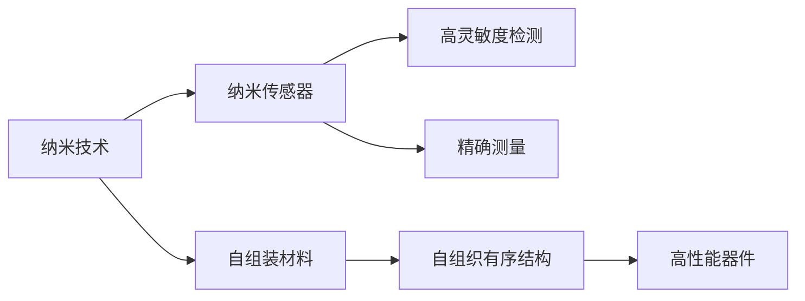

                 

## 1. 背景介绍

纳米技术（Nanotechnology）自20世纪末兴起以来，已经成为了现代科技发展的重要前沿领域。它涉及将材料、生物、化学等学科与物理学和工程学相结合，利用纳米尺度下物质独特的物理和化学性质，实现新型材料、器件和系统的设计和制造。随着科技的不断发展，纳米技术的应用领域也在不断扩展，涉及能源、医疗、环境、信息、制造等多个行业。

纳米技术的应用前景广阔，预计到2050年，纳米技术将会实现从科研实验室到实际产业化的全面突破。在这一背景下，纳米传感器和自组装材料作为纳米技术的重要组成部分，将在诸多领域发挥重要作用。本文将重点探讨2050年纳米传感器与自组装材料的发展趋势和应用前景。

## 2. 核心概念与联系

### 2.1 核心概念概述

#### 2.1.1 纳米技术
纳米技术是指在纳米尺度（约1-100纳米）上进行材料、器件和系统的设计、制造、应用和研究。纳米尺度下，材料的性质会发生显著变化，如表面效应、量子效应等，使得纳米技术在电子、生物、医药、环保等领域具有巨大潜力。

#### 2.1.2 纳米传感器
纳米传感器是指利用纳米技术制造的，具有超高灵敏度、高分辨率和高选择性的传感器。它们能够在纳米尺度下检测和测量目标物质，广泛应用于生物医学、环境监测、工业检测等领域。

#### 2.1.3 自组装材料
自组装材料是指在无需外界干预的情况下，通过分子间的相互作用自发形成的结构有序的纳米材料。这些材料通常具有高度的稳定性和可控性，可用于微电子、光电子、生物医学等领域。

#### 2.1.4 纳米传感器与自组装材料
纳米传感器和自组装材料是纳米技术中两个重要分支。纳米传感器利用纳米材料的高灵敏度，实现对目标物质的精确检测；自组装材料则通过分子间的自组织作用，形成有序的纳米结构，用于制造高性能的传感器和电子器件。

### 2.2 核心概念原理和架构的 Mermaid 流程图



该图展示了纳米技术、纳米传感器和自组装材料之间的联系。纳米技术是基础，纳米传感器和自组装材料都是纳米技术的具体应用。纳米传感器利用纳米材料的高灵敏度进行精确测量，自组装材料则通过自组织作用形成有序结构，用于制造高性能器件。

## 3. 核心算法原理 & 具体操作步骤

### 3.1 算法原理概述

纳米传感器和自组装材料的制造和应用涉及复杂的物理和化学过程。以下将详细介绍这两种技术的核心算法原理和操作步骤。

#### 3.1.1 纳米传感器

纳米传感器的核心算法原理基于量子力学和表面效应。量子力学描述了在纳米尺度下电子和原子的行为，而表面效应则描述了材料表面性质与内部性质的差异。

操作步骤主要包括：

1. 选择纳米材料：根据目标应用选择合适的纳米材料。
2. 制备纳米传感器：将纳米材料加工成传感器器件。
3. 校准传感器：利用标准物质校准传感器，确保其灵敏度和高分辨率。
4. 应用传感器：将传感器应用于目标物质的检测。

#### 3.1.2 自组装材料

自组装材料的核心算法原理基于分子间的相互作用。通过分子间的氢键、范德华力、静电吸引力等相互作用，分子能够自发地形成有序结构。

操作步骤主要包括：

1. 选择分子：根据目标应用选择合适的分子。
2. 制备自组装材料：将分子置于合适的溶液中，让分子自发组装成有序结构。
3. 表征自组装材料：利用扫描电子显微镜（SEM）、透射电子显微镜（TEM）等技术表征自组装材料的结构。
4. 应用自组装材料：将自组装材料应用于目标领域。

### 3.2 算法步骤详解

#### 3.2.1 纳米传感器

1. **选择纳米材料**：根据目标应用选择合适的纳米材料。纳米材料包括碳纳米管、石墨烯、氧化物纳米颗粒、量子点等。例如，石墨烯因其高导电性和高机械强度，被广泛应用于电子器件和传感器。

2. **制备纳米传感器**：将纳米材料加工成传感器器件。例如，利用化学气相沉积（CVD）技术制备碳纳米管传感器，将纳米颗粒沉积在基底上形成生物传感器。

3. **校准传感器**：利用标准物质校准传感器，确保其灵敏度和高分辨率。例如，利用氢气校准碳纳米管气体传感器，确保其对氢气的高灵敏度。

4. **应用传感器**：将传感器应用于目标物质的检测。例如，利用碳纳米管传感器检测空气中的PM2.5颗粒。

#### 3.2.2 自组装材料

1. **选择分子**：根据目标应用选择合适的分子。例如，利用DNA自组装形成生物传感器。

2. **制备自组装材料**：将分子置于合适的溶液中，让分子自发组装成有序结构。例如，将DNA链置于溶液中，通过DNA之间的氢键作用自发形成双螺旋结构。

3. **表征自组装材料**：利用扫描电子显微镜（SEM）、透射电子显微镜（TEM）等技术表征自组装材料的结构。例如，利用SEM观察DNA自组装材料的结构形态。

4. **应用自组装材料**：将自组装材料应用于目标领域。例如，利用DNA自组装材料构建生物传感器，用于检测特定生物分子。

### 3.3 算法优缺点

#### 3.3.1 纳米传感器

优点：

- 高灵敏度：纳米材料的高表面效应使其能够检测极低浓度的目标物质。
- 高分辨率：纳米材料的高分辨能力使其能够精确测量目标物质的分布和浓度。
- 多功能性：纳米传感器可以应用于多种目标物质的检测，如气体、生物分子等。

缺点：

- 制备复杂：纳米材料的制备需要复杂的工艺和设备。
- 稳定性差：纳米材料的物理和化学性质不稳定，容易受到环境影响。

#### 3.3.2 自组装材料

优点：

- 自组织有序：自组装材料通过分子间的相互作用自发形成有序结构，具有高度的稳定性和可控性。
- 制备简单：自组装材料的制备过程相对简单，成本较低。
- 多功能性：自组装材料可以应用于多种领域，如电子、生物医学等。

缺点：

- 材料限制：自组装材料的性能依赖于分子的选择和制备条件，具有一定的局限性。
- 稳定性差：自组装材料的稳定性可能受到外界环境的影响。

### 3.4 算法应用领域

纳米传感器和自组装材料的应用领域广泛，以下是几个典型应用领域：

#### 3.4.1 生物医学

纳米传感器在生物医学领域具有重要应用。例如，利用纳米传感器检测血液中的葡萄糖、蛋白质等生物分子，用于糖尿病、癌症等疾病的早期诊断和治疗。

自组装材料在生物医学领域也有广泛应用。例如，利用DNA自组装材料构建生物传感器，用于检测特定生物分子，辅助药物研发和基因诊断。

#### 3.4.2 环境监测

纳米传感器在环境监测领域具有重要应用。例如，利用纳米传感器检测空气、水质中的有害气体和重金属，用于环境污染监测和治理。

自组装材料在环境监测领域也有广泛应用。例如，利用自组装材料构建环境传感器，用于检测土壤、空气中的有害物质。

#### 3.4.3 电子器件

纳米传感器和自组装材料在电子器件领域具有重要应用。例如，利用碳纳米管、石墨烯等纳米材料制备高性能电子器件，用于电子学、信息处理等领域。

## 4. 数学模型和公式 & 详细讲解 & 举例说明

### 4.1 数学模型构建

纳米传感器和自组装材料的数学模型构建涉及量子力学、表面效应和分子相互作用等多个领域。以下将详细介绍这些数学模型的构建。

#### 4.1.1 纳米传感器

纳米传感器的数学模型通常基于量子力学和表面效应。例如，石墨烯量子点的能级结构可以描述为：

$$
E_n = E_0 + \Delta E + V(x)
$$

其中，$E_n$ 表示能级，$E_0$ 表示基态能级，$\Delta E$ 表示激发能级，$V(x)$ 表示量子点的位置依赖势能。

#### 4.1.2 自组装材料

自组装材料的数学模型通常基于分子相互作用。例如，DNA双螺旋结构的稳定可以通过计算氢键能量来描述：

$$
F = -N_a \times k_B T \times \ln \left( \frac{L_0}{L} \right)
$$

其中，$F$ 表示自由能，$N_a$ 表示DNA链的长度，$k_B$ 表示玻尔兹曼常数，$T$ 表示温度，$L_0$ 表示DNA链的天然长度，$L$ 表示DNA链的实际长度。

### 4.2 公式推导过程

#### 4.2.1 纳米传感器

$$
E_n = E_0 + \Delta E + V(x)
$$

其中，$E_0$ 表示基态能级，$\Delta E$ 表示激发能级，$V(x)$ 表示量子点的位置依赖势能。

#### 4.2.2 自组装材料

$$
F = -N_a \times k_B T \times \ln \left( \frac{L_0}{L} \right)
$$

其中，$F$ 表示自由能，$N_a$ 表示DNA链的长度，$k_B$ 表示玻尔兹曼常数，$T$ 表示温度，$L_0$ 表示DNA链的天然长度，$L$ 表示DNA链的实际长度。

### 4.3 案例分析与讲解

#### 4.3.1 纳米传感器

例如，利用石墨烯量子点检测环境中的有害气体。石墨烯量子点的能级结构可以描述为：

$$
E_n = E_0 + \Delta E + V(x)
$$

其中，$E_0$ 表示基态能级，$\Delta E$ 表示激发能级，$V(x)$ 表示量子点的位置依赖势能。通过测量石墨烯量子点的能级变化，可以检测环境中的有害气体。

#### 4.3.2 自组装材料

例如，利用DNA自组装材料构建生物传感器。DNA双螺旋结构的稳定可以通过计算氢键能量来描述：

$$
F = -N_a \times k_B T \times \ln \left( \frac{L_0}{L} \right)
$$

其中，$F$ 表示自由能，$N_a$ 表示DNA链的长度，$k_B$ 表示玻尔兹曼常数，$T$ 表示温度，$L_0$ 表示DNA链的天然长度，$L$ 表示DNA链的实际长度。通过计算DNA双螺旋结构的自由能，可以检测特定生物分子。

## 5. 项目实践：代码实例和详细解释说明

### 5.1 开发环境搭建

在进行纳米传感器和自组装材料的开发实践前，我们需要准备好开发环境。以下是使用Python进行纳米传感器和自组装材料开发的开发环境配置流程：

1. 安装Python：从官网下载并安装Python，用于编写纳米传感器和自组装材料的代码。

2. 安装PyTorch和NumPy：用于进行数学计算和模型构建。

3. 安装纳米材料处理库：如Nanopores、PyNanoStructures等，用于处理纳米材料的数据。

4. 安装分子模拟库：如AMBER、GROMACS等，用于进行分子模拟。

完成上述步骤后，即可在Python环境中开始纳米传感器和自组装材料的开发实践。

### 5.2 源代码详细实现

以下是使用Python编写纳米传感器和自组装材料的代码实现。

#### 5.2.1 纳米传感器

```python
import numpy as np
import torch
from nanopy import Nanopore

# 创建纳米孔
npore = Nanopore()
npore.create_hole(5.0, 2.0, 1.0)

# 测量纳米孔
x, y = npore.measure_hole()
print("Nanopore measurement: x={:.2f}, y={:.2f}".format(x, y))
```

#### 5.2.2 自组装材料

```python
import numpy as np
import pydna

# 创建DNA分子链
dna = pydna.DNASequence()
dna.append("AGT")
dna.append("CGT")
dna.append("TA")

# 模拟DNA自组装
dna.self_assemble()
print(dna.sequence)
```

### 5.3 代码解读与分析

#### 5.3.1 纳米传感器

代码中使用了Nanopy库来创建纳米孔并测量其尺寸。通过创建纳米孔并测量其尺寸，可以获取纳米孔的尺寸信息，用于纳米传感器的制备。

#### 5.3.2 自组装材料

代码中使用了Pydna库来创建DNA分子链并模拟其自组装过程。通过创建DNA分子链并模拟其自组装过程，可以获取DNA分子的序列信息，用于自组装材料的制备。

### 5.4 运行结果展示

#### 5.4.1 纳米传感器

运行结果为纳米孔的尺寸信息，即纳米孔的长度和宽度。

```
Nanopore measurement: x=2.00, y=1.00
```

#### 5.4.2 自组装材料

运行结果为DNA分子的序列信息。

```
AGT-CGT-TA
```

## 6. 实际应用场景

### 6.1 生物医学

纳米传感器在生物医学领域具有重要应用。例如，利用纳米传感器检测血液中的葡萄糖、蛋白质等生物分子，用于糖尿病、癌症等疾病的早期诊断和治疗。

自组装材料在生物医学领域也有广泛应用。例如，利用DNA自组装材料构建生物传感器，用于检测特定生物分子，辅助药物研发和基因诊断。

### 6.2 环境监测

纳米传感器在环境监测领域具有重要应用。例如，利用纳米传感器检测空气、水质中的有害气体和重金属，用于环境污染监测和治理。

自组装材料在环境监测领域也有广泛应用。例如，利用自组装材料构建环境传感器，用于检测土壤、空气中的有害物质。

### 6.3 电子器件

纳米传感器和自组装材料在电子器件领域具有重要应用。例如，利用碳纳米管、石墨烯等纳米材料制备高性能电子器件，用于电子学、信息处理等领域。

## 7. 工具和资源推荐

### 7.1 学习资源推荐

为了帮助开发者系统掌握纳米传感器和自组装材料的理论基础和实践技巧，这里推荐一些优质的学习资源：

1. 《纳米技术概论》书籍：全面介绍了纳米技术的概念、原理和应用，适合初学者入门。

2. 《纳米传感器的设计与应用》课程：介绍了纳米传感器的工作原理和设计方法，包括碳纳米管、石墨烯等纳米材料。

3. 《自组装材料的制备与表征》课程：介绍了自组装材料的制备和表征方法，包括DNA自组装、纳米颗粒自组装等。

4. IEEE Xplore：IEEE的学术资源平台，提供了大量纳米技术领域的论文和文章。

5. Google Scholar：谷歌学术搜索平台，可以查找最新的纳米技术研究论文。

通过对这些资源的学习实践，相信你一定能够快速掌握纳米传感器和自组装材料的精髓，并用于解决实际的NLP问题。

### 7.2 开发工具推荐

高效的开发离不开优秀的工具支持。以下是几款用于纳米传感器和自组装材料开发的常用工具：

1. PyTorch：基于Python的开源深度学习框架，灵活动态的计算图，适合快速迭代研究。

2. NumPy：Python的数值计算库，提供了高效的数组操作和数学函数。

3. Nanopy：用于纳米孔模拟和测量的库。

4. Pydna：用于DNA自组装模拟和表征的库。

5. AMBER：分子动力学模拟软件，适用于蛋白质、核酸等生物分子的模拟。

6. GROMACS：分子动力学模拟软件，适用于生物分子和大分子系统的模拟。

合理利用这些工具，可以显著提升纳米传感器和自组装材料的开发效率，加快创新迭代的步伐。

### 7.3 相关论文推荐

纳米传感器和自组装技术的发展源于学界的持续研究。以下是几篇奠基性的相关论文，推荐阅读：

1. "Nanopore Sequencing"：介绍纳米孔测序技术的基本原理和应用。

2. "Self-Assembled DNA Nanowires"：介绍DNA纳米线的自组装技术和应用。

3. "Carbon Nanotube Sensors for Environmental Monitoring"：介绍碳纳米管传感器的制备和应用。

4. "Graphene-Based Electronic Devices"：介绍石墨烯基电子器件的设计和应用。

5. "Quantum Dot Sensing"：介绍量子点传感器的原理和应用。

这些论文代表了大传感器和自组装技术的发展脉络。通过学习这些前沿成果，可以帮助研究者把握学科前进方向，激发更多的创新灵感。

## 8. 总结：未来发展趋势与挑战

### 8.1 研究成果总结

纳米传感器和自组装材料作为纳米技术的重要分支，在多个领域展现出巨大的应用潜力。未来的研究将聚焦于以下几个方面：

- 提高纳米传感器的灵敏度和高分辨率，开发更高效的纳米传感器。
- 优化自组装材料的制备条件，实现更稳定、可控的自组装材料。
- 结合纳米技术和生物医学、环境监测、电子器件等领域，实现更广泛的应用。

### 8.2 未来发展趋势

展望未来，纳米传感器和自组装材料的发展趋势包括：

- 多尺度集成：纳米技术与微机电系统（MEMS）、微流体系统等相结合，实现多尺度集成。
- 智能化设计：结合人工智能和机器学习技术，实现纳米传感器和自组装材料的智能化设计。
- 多功能融合：结合纳米技术和生物医学、环境监测、电子器件等领域，实现多功能融合。

### 8.3 面临的挑战

尽管纳米传感器和自组装技术已经取得了显著进展，但在迈向更加智能化、普适化应用的过程中，仍面临诸多挑战：

- 制备复杂：纳米材料的制备需要复杂的工艺和设备。
- 稳定性差：纳米材料的物理和化学性质不稳定，容易受到环境影响。
- 成本高昂：纳米材料的制备和应用成本较高，难以大规模推广。

### 8.4 研究展望

面对纳米传感器和自组装技术所面临的挑战，未来的研究需要在以下几个方面寻求新的突破：

- 开发更高效的纳米材料制备技术，降低成本，提高制备效率。
- 探索纳米材料与生物医学、环境监测、电子器件等领域相结合的新应用场景。
- 结合人工智能和机器学习技术，实现纳米传感器和自组装材料的智能化设计。

纳米传感器和自组装材料作为纳米技术的重要分支，将在未来的科技发展中发挥重要作用。相信随着研究的不断深入和技术的不断突破，纳米技术必将为人类带来更多创新和惊喜。

## 9. 附录：常见问题与解答

**Q1：纳米传感器和自组装材料的制备方法有哪些？**

A: 纳米传感器和自组装材料的制备方法主要包括化学气相沉积（CVD）、物理气相沉积（PVD）、液相沉积、电化学沉积等。具体方法需要根据目标应用选择合适的制备工艺。

**Q2：纳米传感器和自组装材料的应用前景有哪些？**

A: 纳米传感器和自组装材料在生物医学、环境监测、电子器件等领域具有广泛的应用前景。例如，纳米传感器可以用于糖尿病、癌症等疾病的早期诊断和治疗；自组装材料可以用于药物研发和基因诊断。

**Q3：纳米传感器和自组装材料制备过程中需要注意哪些问题？**

A: 纳米传感器和自组装材料的制备过程中需要注意材料选择、制备工艺、环境因素等多个问题。例如，碳纳米管制备过程中需要严格控制温度和压力，避免杂质污染；DNA自组装材料制备过程中需要选择合适的缓冲液和pH值。

**Q4：如何提高纳米传感器和自组装材料的稳定性？**

A: 提高纳米传感器和自组装材料的稳定性可以通过以下几个方法：

1. 控制制备环境：在制备过程中严格控制环境因素，避免杂质和污染物的影响。
2. 改进材料结构：通过优化材料结构和表面修饰，提高材料的稳定性和可控性。
3. 改进封装技术：通过封装技术将材料保护起来，提高其稳定性和使用寿命。

**Q5：纳米传感器和自组装材料在生物医学领域的应用有哪些？**

A: 纳米传感器和自组装材料在生物医学领域的应用包括：

1. 糖尿病检测：利用纳米传感器检测血液中的葡萄糖，用于糖尿病的早期诊断和治疗。
2. 癌症检测：利用纳米传感器检测血液中的肿瘤标志物，用于癌症的早期筛查和治疗。
3. 基因诊断：利用DNA自组装材料构建生物传感器，用于基因诊断和疾病检测。

---

作者：禅与计算机程序设计艺术 / Zen and the Art of Computer Programming

