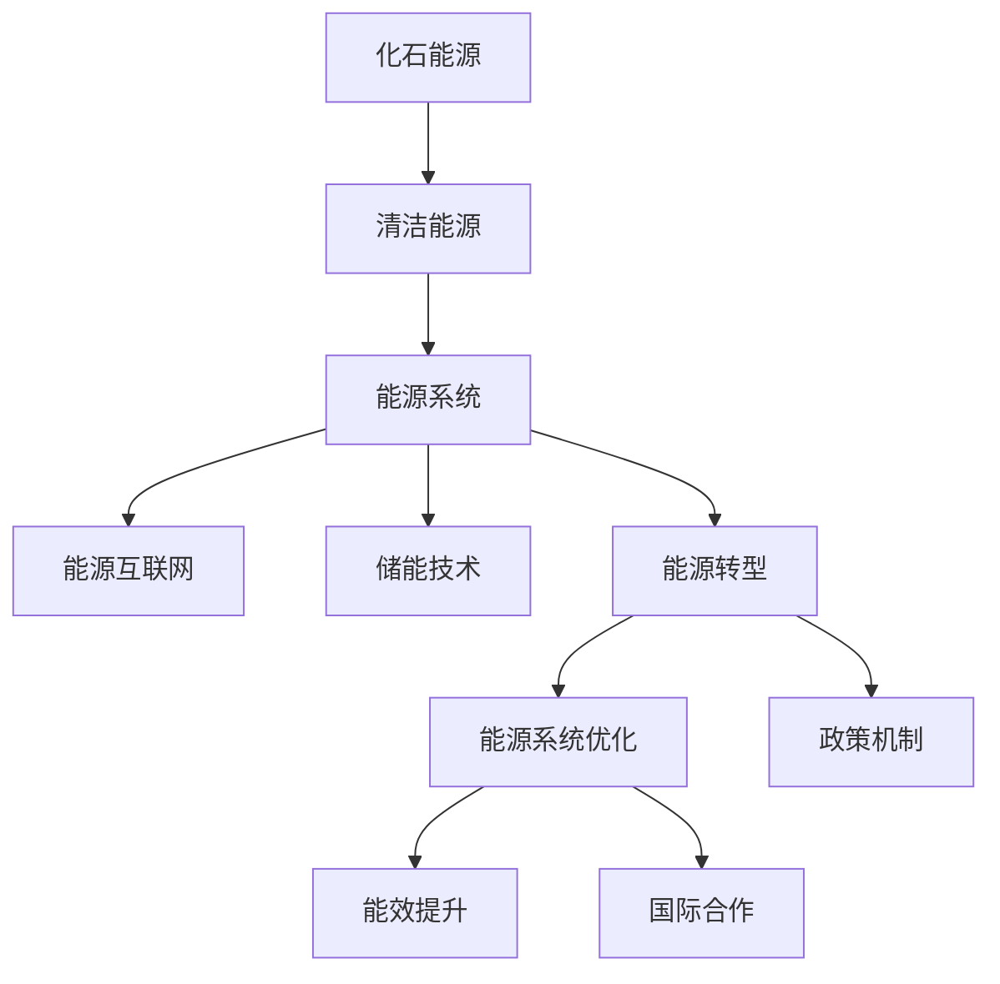

                 

# 未来的能源结构：2050年的清洁能源利用

## 1. 背景介绍

### 1.1 问题由来
能源是人类文明发展的基石，也是各国经济发展和社会进步不可或缺的重要资源。然而，当前的能源结构仍以化石燃料为主，高碳排放、环境污染等问题严重影响地球的可持续发展。如何在未来几十年内实现能源结构的绿色转型，是全球亟待解决的重大课题。

全球主要能源消费国都提出了在2050年前实现能源系统净零碳排放的目标。其中，美国计划到2035年实现电网净零碳排放，欧盟设定了2050年实现气候中和的宏伟目标，中国也提出了2060年前实现碳中和的愿景。能源结构转型迫在眉睫。

### 1.2 问题核心关键点
- **能源转型目标**：各国政府和企业提出的实现净零碳排放的具体路线图和时间表。
- **清洁能源技术**：太阳能、风能、水能、核能等清洁能源技术的现状和未来发展趋势。
- **能源系统优化**：如何在现有能源基础设施基础上，通过技术升级和政策调整，实现能源系统的整体优化。
- **能效提升**：如何通过提升终端能源使用效率，减少能源浪费，降低对清洁能源的依赖。
- **储能技术**：如何利用先进的储能技术，保障清洁能源的稳定供应。
- **政策机制**：政府如何通过财政、税收、补贴等政策手段，促进清洁能源的发展。
- **国际合作**：全球能源转型需要各国协同合作，共同应对能源供需和环境变化的挑战。

### 1.3 问题研究意义
研究和探讨2050年的清洁能源利用，对于全球能源结构的转型具有重要意义：

1. **推动技术创新**：通过技术研发和应用，促进清洁能源技术的进步，降低能源成本，提高能源利用效率。
2. **改善环境质量**：减少化石燃料的使用，降低碳排放，改善空气质量，保护生态环境。
3. **促进经济增长**：发展清洁能源产业，创造新的就业机会，带动相关产业链的发展。
4. **实现能源安全**：减少对化石燃料的依赖，增强能源供应的稳定性和安全性。
5. **应对气候变化**：通过清洁能源利用，应对全球气候变化，实现可持续发展目标。

## 2. 核心概念与联系

### 2.1 核心概念概述

为了更好地理解2050年清洁能源利用的背景和现状，我们需要先掌握以下几个核心概念：

- **化石能源**：指煤炭、石油、天然气等传统能源，是当前世界主要的能源消费来源。
- **清洁能源**：指太阳能、风能、水能、核能等可再生能源，具有环保、低碳、可持续的特点。
- **能源系统**：包括能源生产、传输、分配和使用等各个环节，是实现能源高效利用和绿色转型的关键。
- **能源转型**：指从传统的化石能源向清洁能源的转变，包括技术、经济、政策等多方面的变化。
- **储能技术**：指利用电池、抽水蓄能等技术，储存和释放电能，保障清洁能源的稳定供应。
- **能源互联网**：指通过物联网、区块链等技术，实现能源的智能互联和优化调度。

### 2.2 核心概念联系

这些核心概念之间的关系可以通过以下Mermaid流程图来展示：



这个流程图展示了化石能源到清洁能源的过渡路径，以及清洁能源如何通过技术进步、系统优化、政策支持等手段实现大规模应用。

## 3. 核心算法原理 & 具体操作步骤
### 3.1 算法原理概述

清洁能源的利用涉及能源生产、传输、分配和使用等各个环节，其核心算法原理主要包括以下几个方面：

- **能源生成算法**：如太阳能光伏、风能发电、水力发电、核能发电等，需要通过物理和数学模型进行预测和优化。
- **能量传输算法**：如电力输配电、输油管道、输气管道等，需要考虑电力电子、电磁场、管道流体力学等理论。
- **能量存储算法**：如电池储能、抽水蓄能、压缩空气储能等，需要解决储能密度、成本、寿命等问题。
- **能量分配算法**：如智能电网、分布式能源系统等，需要优化能源分配和调度，实现供需平衡。
- **能量利用算法**：如电动汽车、热电联供等，需要提高能源利用效率，降低能源浪费。

### 3.2 算法步骤详解

清洁能源的利用通常包括以下几个关键步骤：

1. **能源生成与采集**：
    - 太阳能光伏：通过光伏板将太阳能转换为直流电。
    - 风能发电：通过风力发电机将风能转换为电能。
    - 水力发电：通过水轮机将水能转换为电能。
    - 核能发电：通过核反应堆产生核能，转换为电能。
    - 采集储能系统：如电池储能、抽水蓄能等，用于储存和释放电能。

2. **能量传输与配送**：
    - 输电线路：采用高压或特高压输电技术，将电能从发电站传输到负荷中心。
    - 输油和输气管网：通过管道将天然气或石油从产地输送到终端用户。
    - 智能电网：通过电力物联网技术，实现电能的智能管理和优化调度。

3. **能源分配与消费**：
    - 智能电表：实时监测和记录用户用电量。
    - 负荷预测：预测未来电力负荷，优化分配策略。
    - 电动汽车充电桩：为电动汽车提供快速充电服务。
    - 智能家居：通过物联网技术，实现能源的智能控制和管理。

4. **能源监控与优化**：
    - 数据采集与分析：收集能源生产、传输、分配和消费的各类数据。
    - 能效评估：通过能源管理系统，评估能效水平，提出改进措施。
    - 优化调度：利用算法优化能源分配和调度，提高能源利用效率。

### 3.3 算法优缺点

清洁能源利用的算法具有以下优点：
- **减少碳排放**：清洁能源利用可以显著降低温室气体排放，减缓全球气候变暖。
- **提高能源效率**：通过智能化管理，优化能源生产和分配，提高能源利用效率。
- **促进能源多样化**：清洁能源可以减轻对化石燃料的依赖，增强能源供应的多样性和安全性。
- **推动技术进步**：清洁能源技术的进步可以推动相关领域的技术创新和产业升级。

同时，也存在一些缺点：
- **技术成本高**：清洁能源技术，尤其是可再生能源技术，当前仍存在技术成本高、设备寿命短等问题。
- **能源波动性**：太阳能、风能等可再生能源具有明显的波动性，需要储能系统进行调节。
- **基础设施改造复杂**：大规模清洁能源利用需要大量基础设施改造，涉及多方面利益协调和投资决策。
- **经济补贴依赖**：清洁能源项目往往需要政府补贴，政策不稳定可能影响其可持续发展。

### 3.4 算法应用领域

清洁能源的利用涉及多个领域，包括：

- **能源政策制定**：政府如何通过政策手段促进清洁能源的发展，实现能源结构转型。
- **能源企业运营**：能源企业如何通过技术创新和业务模式创新，提升清洁能源项目的盈利性和竞争力。
- **能源科学研究**：科学家如何通过技术研发和应用，推动清洁能源技术的进步。
- **能源市场交易**：如何通过市场机制，促进清洁能源的规模化应用和高效利用。
- **能源环境保护**：如何通过清洁能源的利用，减少环境污染，保护生态环境。

## 4. 数学模型和公式 & 详细讲解 & 举例说明

### 4.1 数学模型构建

清洁能源利用的数学模型主要涉及以下几个方面：

- **能源生成模型**：如太阳能光伏模型、风能发电模型、水力发电模型、核能发电模型等。
- **能量传输模型**：如电力输电模型、输油管网模型、输气管网模型等。
- **能量存储模型**：如电池储能模型、抽水蓄能模型等。
- **能量分配模型**：如智能电网模型、分布式能源系统模型等。
- **能量利用模型**：如电动汽车模型、热电联供模型等。

### 4.2 公式推导过程

以太阳能光伏发电模型为例，推导其数学模型和公式。

设太阳能电池板的面积为 $S$，太阳光辐照强度为 $I$，光转换效率为 $\eta$，电能转换效率为 $\eta_e$。则电池板在单位时间内产生的电能为：

$$
E = S \times I \times \eta \times \eta_e \times t
$$

其中 $t$ 为太阳光照射时间，$E$ 为电能，$S$、$I$、$\eta$、$\eta_e$ 和 $t$ 都是变量，需要根据具体条件进行调整。

对于风能发电，其模型推导与太阳能光伏类似，考虑风速、风力发电机的转换效率等因素。

### 4.3 案例分析与讲解

以一个具体的清洁能源项目为例，分析其能源生成、传输、分配和消费的全过程。

1. **能源生成**：在一个偏远地区的风电场，通过风力发电机将风能转换为电能，储存在电池储能系统中。
2. **能量传输**：通过高压输电线路将电能传输到负荷中心，为附近的乡村提供电力支持。
3. **能量分配**：智能电网实时监测用户用电量，根据负荷预测结果进行智能调度，优先分配给绿色能源项目。
4. **能量消费**：通过智能电表和充电桩，记录用户用电量和电动汽车充电量，评估能源利用效率。

通过这个案例，可以看到清洁能源项目从生成、传输、分配到消费的完整流程，以及各环节的优化和挑战。

## 5. 项目实践：代码实例和详细解释说明

### 5.1 开发环境搭建

要实现清洁能源项目的模拟和优化，需要搭建一个综合性的开发环境。以下是推荐的环境搭建步骤：

1. **安装Python**：确保系统安装了Python 3.x版本。
2. **安装依赖库**：安装NumPy、Pandas、SciPy、Matplotlib等科学计算库，以及OpenPyXL、Pandera等数据处理库。
3. **安装能源仿真软件**：如OpenStudio、EnergyPlus等，用于进行能源系统建模和仿真。
4. **安装机器学习库**：如Scikit-learn、TensorFlow、PyTorch等，用于优化和预测。
5. **安装可视化工具**：如Tableau、Power BI等，用于数据可视化和报告生成。

### 5.2 源代码详细实现

以下是一个基于Python的清洁能源项目模拟仿真代码，用于计算风电场的发电量和电网负荷。

```python
import numpy as np
import pandas as pd

# 定义风力发电模型
def wind_power_model(wind_speed, turbine_efficiency):
    # 风速和风力发电机的转换效率
    kW = 2.0  # 风力发电机装机容量
    power_curve = 0.4 * wind_speed**3  # 风力发电曲线
    return kW * turbine_efficiency * power_curve

# 定义智能电网调度模型
def smart_grid_model(grid负荷, grid容量):
    # 设定智能电网调度目标：最小化电能损失和运营成本
    # 假设电网容量为grid容量，负荷为grid负荷
    min_cost = np.inf
    for i in range(grid容量):
        for j in range(grid容量):
            cost = 0.1 * (grid负荷 - i) ** 2 + 0.2 * (grid负荷 - j) ** 2
            if cost < min_cost:
                min_cost = cost
                optimal_i = i
                optimal_j = j
    return optimal_i, optimal_j

# 数据加载
data = pd.read_csv('wind_data.csv')

# 数据预处理
data['wind_speed'] = data['wind_speed'].astype(float)
data['turbine_efficiency'] = data['turbine_efficiency'].astype(float)
data['grid负荷'] = data['grid负荷'].astype(float)

# 风力发电模拟
data['wind_power'] = data.apply(lambda row: wind_power_model(row['wind_speed'], row['turbine_efficiency']), axis=1)

# 智能电网调度模拟
data['optimal_i'], data['optimal_j'] = smart_grid_model(data['grid负荷'], data['grid容量'])

# 输出结果
print('风力发电电量：', data['wind_power'].sum())
print('智能电网调度结果：', data['optimal_i'], data['optimal_j'])
```

### 5.3 代码解读与分析

上述代码实现了一个简单的风电场模拟和智能电网调度过程。代码的主要逻辑包括：

1. **风力发电模型**：根据风速和风力发电机的转换效率，计算风力发电的总功率。
2. **智能电网调度模型**：通过优化算法，寻找最佳的负荷分配方案，最小化电能损失和运营成本。
3. **数据加载和预处理**：读取风电场的数据文件，并进行类型转换和计算。

运行结果展示了风力发电的总电量和智能电网调度后的负荷分配方案。通过这个例子，可以理解如何利用Python进行清洁能源项目的模拟和优化。

## 6. 实际应用场景

### 6.1 可再生能源并网

可再生能源并网是清洁能源利用的重要方向，可以有效提高能源利用效率，降低对化石燃料的依赖。

通过智能电网技术，将可再生能源与传统电网进行有效融合，可以实现以下几个方面：

1. **功率预测**：利用机器学习算法，对可再生能源的发电量进行预测，减少波动性对电网的影响。
2. **负荷调度**：根据预测结果，智能调度可再生能源和传统能源，确保电网稳定运行。
3. **储能管理**：利用电池储能、抽水蓄能等技术，调节可再生能源的输出，确保供需平衡。
4. **市场交易**：通过电力市场交易，促进清洁能源的规模化应用，提高能源价格竞争力。

### 6.2 电动汽车充电

电动汽车的普及是清洁能源利用的重要组成部分，可以有效减少化石燃料的使用。

电动汽车的充电过程涉及以下几个方面：

1. **充电桩建设**：在城市、乡村等区域建设充电桩，提供快速充电服务。
2. **智能充电管理**：通过智能电表和充电桩，记录电动汽车充电量和费用，优化充电策略。
3. **能源存储**：利用电池储能技术，为电动汽车提供稳定的充电保障。
4. **电能优化**：通过能源管理系统，优化电动汽车充电和能源分配，提高能源利用效率。

### 6.3 能源管理系统

能源管理系统是实现能源高效利用的重要手段，可以通过智能化管理优化能源的生产、传输、分配和消费。

主要应用场景包括：

1. **能效监测**：实时监测能源生产和消费的各项指标，评估能效水平。
2. **智能调度**：根据负荷预测和优化算法，智能调度能源分配，实现供需平衡。
3. **数据可视化**：通过可视化工具，展示能源系统的运行状态和优化效果。
4. **故障诊断**：通过数据分析，诊断能源系统的潜在故障，及时进行维护和修复。

## 7. 工具和资源推荐

### 7.1 学习资源推荐

为了帮助开发者系统掌握清洁能源利用的技术，这里推荐一些优质的学习资源：

1. **IEEE Transactions on Power Systems**：期刊，涵盖了电力系统、可再生能源、智能电网等领域的最新研究成果。
2. **International Renewable Energy Agency (IRENA)**：国际可再生能源机构，发布关于清洁能源转型的政策报告和技术指南。
3. **The Energy Transformation Handbook**：书籍，涵盖了能源转型的技术、经济和政策等多个方面的内容。
4. **Renewable Energy & Power Quality in Smart Grids**：课程，由IEEE开发，介绍了智能电网和可再生能源的技术和应用。
5. **Solar Energy International**：网站，提供关于太阳能光伏的最新研究、市场分析和技术资源。

### 7.2 开发工具推荐

以下是几款用于清洁能源项目开发的常用工具：

1. **OpenStudio**：开源的建筑能源模拟软件，用于建筑物能耗分析和优化。
2. **EnergyPlus**：建筑能耗模拟软件，支持多种建筑类型和气候条件。
3. **MATLAB**：科学计算和数据可视化工具，支持数学建模和算法实现。
4. **Python**：编程语言，支持数据处理、机器学习和数据分析。
5. **TensorFlow**：深度学习框架，支持神经网络和机器学习算法。

### 7.3 相关论文推荐

清洁能源利用的研究涉及多个学科，以下是几篇奠基性的相关论文，推荐阅读：

1. **"A Review of Modeling and Simulation Tools for Smart Grids"**：详细介绍了智能电网建模和仿真的常用工具和技术。
2. **"Comparative Life Cycle Assessment of Wind Turbine Types"**：比较了不同类型风力发电机的环境影响和生命周期成本。
3. **"Analysis of Photovoltaic System Feasibility Considering Grid Connection Limitations"**：分析了太阳能光伏系统与电网的连接限制和优化策略。
4. **"Energy Storage Systems and their Role in Smart Grids"**：介绍了电池储能、抽水蓄能等储能技术在智能电网中的应用。
5. **"Optimization of Wind Farm Operations for Increased Energy Production and Grid Stability"**：优化风力发电场的运行，提高能源产量和电网稳定性。

## 8. 总结：未来发展趋势与挑战

### 8.1 总结

本文对2050年清洁能源利用的背景、核心概念和应用场景进行了全面系统的介绍。首先阐述了全球能源结构转型的背景和目标，明确了清洁能源技术的应用前景。其次，从原理到实践，详细讲解了清洁能源利用涉及的数学模型和算法原理，给出了具体的代码实例。同时，本文还广泛探讨了清洁能源在智能电网、电动汽车、能源管理系统等实际应用场景中的应用，展示了清洁能源技术的巨大潜力。最后，本文精选了清洁能源利用的学习资源、开发工具和相关论文，力求为读者提供全方位的技术指引。

通过本文的系统梳理，可以看到，清洁能源的利用不仅是一个技术问题，更是一个涉及经济、政策、环境等多方面因素的复杂问题。要实现2050年净零碳排放的目标，需要全球各国和企业的共同努力，采取多层次、多路径的措施，才能在技术、经济、政策等多方面取得突破。

### 8.2 未来发展趋势

展望未来，清洁能源利用将呈现以下几个发展趋势：

1. **技术进步**：清洁能源技术将不断进步，降低成本，提高效率，推动可再生能源的规模化应用。
2. **政策支持**：各国政府将出台更多政策，支持清洁能源项目的发展，提供财政、税收、补贴等激励措施。
3. **市场化机制**：通过市场化机制，促进清洁能源项目的投资和运营，提高其经济性和可行性。
4. **智能化管理**：利用物联网、区块链等技术，实现能源系统的智能化管理，提高能源利用效率。
5. **跨学科融合**：结合物理学、化学、经济学、管理学等学科，推动清洁能源技术的综合创新和应用。

### 8.3 面临的挑战

尽管清洁能源利用具有广阔前景，但在迈向大规模应用的过程中，仍面临诸多挑战：

1. **技术成本**：清洁能源技术，尤其是可再生能源技术，当前仍存在技术成本高、设备寿命短等问题，需要进一步降低成本，提高可靠性。
2. **能源波动性**：可再生能源如太阳能、风能具有明显的波动性，需要储能技术进行调节，提高能源稳定性。
3. **电网安全**：大规模清洁能源并网对电网安全提出了新的挑战，需要优化电网结构和调度策略。
4. **经济补贴依赖**：清洁能源项目往往需要政府补贴，政策不稳定可能影响其可持续发展。
5. **社会接受度**：清洁能源项目的推广需要社会各界的支持和理解，提升公众环保意识。

### 8.4 研究展望

未来的研究需要在以下几个方面寻求新的突破：

1. **能源系统优化**：通过优化算法和技术创新，实现清洁能源系统的整体优化，提高能源利用效率。
2. **储能技术发展**：开发新型储能技术，如液流电池、压缩空气储能等，提高储能系统的效率和可靠性。
3. **智能电网建设**：推动智能电网技术的发展，实现能源的智能互联和优化调度。
4. **分布式能源系统**：发展分布式能源系统，实现能源生产和消费的本地化，降低传输损耗。
5. **多学科融合**：结合物理学、化学、经济学、管理学等学科，推动清洁能源技术的综合创新和应用。

## 9. 附录：常见问题与解答

**Q1：清洁能源利用是否适用于所有国家和地区？**

A: 清洁能源利用在全球范围内适用，但具体应用情况因各国经济、政策、环境等条件差异而异。需要根据各国具体情况，制定合理的清洁能源发展策略。

**Q2：如何平衡清洁能源的发展和传统能源的利用？**

A: 清洁能源的发展和传统能源的利用需要合理平衡。可以通过逐步减少化石燃料的使用，逐步增加清洁能源的比例，实现能源结构的绿色转型。同时，利用清洁能源和传统能源的互补性，优化能源系统的整体运行效率。

**Q3：清洁能源利用是否会带来能源价格波动？**

A: 初期阶段，清洁能源利用可能会带来能源价格波动，但随着技术进步和规模化应用，清洁能源的成本将逐渐降低，价格将趋于稳定。

**Q4：清洁能源利用对环境的影响如何？**

A: 清洁能源利用对环境的影响较小，可显著减少碳排放和污染物排放，改善空气质量和生态环境。但需要综合考虑清洁能源的生产过程和全生命周期对环境的影响。

**Q5：清洁能源利用对经济的影响如何？**

A: 清洁能源利用将推动相关产业的发展，创造新的就业机会，促进经济增长。但初期阶段可能需要一定的经济补贴和政策支持，逐步实现市场化运营。

---

作者：禅与计算机程序设计艺术 / Zen and the Art of Computer Programming

