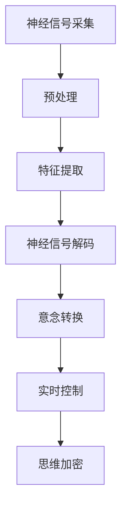

                 

# 未来的脑机接口：2050年的意念控制与思维加密

在2050年，当我们在讨论人工智能的未来时，脑机接口技术已经得到了革命性的发展，使得人类的意念直接转化为计算机指令成为可能。在这一领域，我们看到了过去几十年中无数的突破和创新，但展望未来，脑机接口技术将进一步深化与计算机的互动，并开创思维加密的新纪元。本文将深入探讨未来的脑机接口技术，包括其原理、操作步骤、优缺点、应用领域、数学模型，以及未来发展的趋势和挑战。

## 1. 背景介绍

### 1.1 问题由来
脑机接口技术（Brain-Computer Interface, BCI）的起源可以追溯到上世纪80年代，最早的应用集中在帮助瘫痪患者通过大脑信号恢复运动能力的实验上。而随着时间的推移，BCI技术已经从最初的应用拓展到了更加广阔的领域，如游戏交互、虚拟现实、智能家居、医疗诊断等。随着神经科学、计算机科学、工程学和医学的交叉融合，脑机接口技术的未来发展充满了无限的可能性。

脑机接口技术的基本原理是利用大脑活动的信号来解码人类的意念，并直接与计算机或其他设备进行交互。通过对脑电图（EEG）、功能性磁共振成像（fMRI）、脑磁图（MEG）等大脑信号的测量和分析，BCI技术可以解读大脑活动，并将之转换为机器可识别的数据，用于控制外部设备。

### 1.2 问题核心关键点
- **脑机接口技术**：利用大脑信号进行人机交互的技术，具有潜在的革命性应用，如直接控制计算机、虚拟现实环境中的交互等。
- **意念控制**：将人类意念转化为计算机指令，实现对外部设备的直接控制。
- **思维加密**：使用脑机接口技术实现思维的加密，保障信息安全和隐私。
- **应用前景**：脑机接口技术在医疗、游戏、教育、人机交互等领域的广泛应用。
- **未来展望**：脑机接口技术的持续创新，将带来新的科技革命。

## 2. 核心概念与联系

### 2.1 核心概念概述
脑机接口技术的核心在于通过解码大脑信号实现意念与机器的交互。这个过程中，我们需要理解以下几个核心概念：

- **神经信号解码**：从大脑信号中提取有用的信息，如运动意图、视觉感知等。
- **意念转换**：将提取的神经信号转换为计算机可识别的指令，实现意念控制。
- **实时控制**：实现脑电信号的实时解码和转换，以支持即时的交互应用。
- **思维加密**：利用脑机接口技术，将思维内容进行加密，保障信息安全。

### 2.2 核心概念原理和架构的 Mermaid 流程图



这个流程图展示了脑机接口技术从神经信号采集到思维加密的完整流程：

1. **神经信号采集**：通过各种生物传感器（如EEG、fMRI、MEG等）采集大脑信号。
2. **预处理**：对采集到的信号进行预处理，如滤波、去噪、归一化等。
3. **特征提取**：从预处理后的信号中提取有用的特征，如频率、波形、时域特征等。
4. **神经信号解码**：使用机器学习或深度学习算法解码提取的特征，还原出意图或感知内容。
5. **意念转换**：将解码出的意图转换为计算机指令，实现对外部设备的控制。
6. **实时控制**：实现实时解码和转换，以支持即时的交互应用。
7. **思维加密**：利用脑机接口技术，将思维内容进行加密，保障信息安全。

## 3. 核心算法原理 & 具体操作步骤

### 3.1 算法原理概述
脑机接口技术的算法原理主要基于机器学习和深度学习。通过对大脑信号的特征提取和模式识别，算法可以解码出用户的意念。以下是一些关键的算法和技术：

- **特征提取**：使用PCA、LDA等方法从原始的大脑信号中提取特征。
- **模式识别**：通过SVM、随机森林、神经网络等算法识别出用户的意念或指令。
- **实时解码**：利用卷积神经网络（CNN）、循环神经网络（RNN）等模型实现实时的信号解码。

### 3.2 算法步骤详解
脑机接口技术的算法步骤可以分为以下几个阶段：

**Step 1: 数据采集与预处理**
- 使用EEG、fMRI、MEG等传感器采集大脑信号。
- 对采集到的信号进行预处理，如滤波、去噪、归一化等。

**Step 2: 特征提取**
- 使用PCA、LDA等方法从预处理后的信号中提取特征。
- 将特征转化为适合机器学习的格式，如矩阵形式。

**Step 3: 模型训练与解码**
- 利用机器学习或深度学习算法（如SVM、随机森林、CNN、RNN等）训练解码模型。
- 使用训练好的模型对新信号进行解码，还原出用户的意念或指令。

**Step 4: 意念转换与实时控制**
- 将解码出的意念转换为计算机可识别的指令，实现对外部设备的控制。
- 实现实时解码和转换，以支持即时的交互应用。

**Step 5: 思维加密**
- 利用脑机接口技术，将思维内容进行加密，保障信息安全。

### 3.3 算法优缺点
脑机接口技术在实现意念控制和思维加密方面具有以下优缺点：

**优点**：
- **直接控制**：用户可以通过意念直接控制设备，无需身体干预，提高生活便利性。
- **个性化**：针对不同的用户，可以通过个性化训练提高控制精度。
- **加密安全**：思维内容本身难以被破译，提供了一种新的安全加密方式。

**缺点**：
- **技术复杂**：需要高精度的传感器和复杂算法，成本较高。
- **学习曲线陡峭**：用户需要时间学习和适应，上手难度较大。
- **数据隐私**：涉及到敏感的脑电信号，需要严格的数据保护措施。

### 3.4 算法应用领域
脑机接口技术在多个领域有广泛应用：

- **医疗**：帮助瘫痪患者恢复运动能力，进行康复训练。
- **游戏与娱乐**：在虚拟现实、电子游戏中实现意念控制，提供沉浸式体验。
- **人机交互**：实现意念控制计算机，提高工作效率。
- **安全领域**：用于安全监控、反欺诈等。
- **辅助设计**：辅助设计师进行创意表达和操作。

## 4. 数学模型和公式 & 详细讲解 & 举例说明

### 4.1 数学模型构建

脑机接口技术的数学模型构建主要包括以下几个方面：

- **神经信号建模**：使用统计模型和随机过程描述神经信号的演化。
- **特征提取模型**：利用线性代数和矩阵运算实现特征提取。
- **解码模型**：使用机器学习和深度学习模型（如CNN、RNN等）进行解码。

### 4.2 公式推导过程

以卷积神经网络（CNN）为例，其基本的数学模型可以表示为：

$$
y = \sum_i w_i \sigma(\sum_j x_{ij} w_{ij} + b_i)
$$

其中，$y$ 是输出，$x$ 是输入数据，$w$ 是权重，$b$ 是偏置，$\sigma$ 是激活函数。

### 4.3 案例分析与讲解

假设我们有一个简单的CNN模型，其结构如下：

- **输入层**：大脑信号的特征向量。
- **卷积层**：通过卷积核提取特征。
- **池化层**：通过池化操作减少特征维度。
- **全连接层**：将特征映射到输出类别。

通过训练这个模型，我们可以实现对大脑信号的解码，并将其转换为控制指令。以下是一个简化的代码实现：

```python
import tensorflow as tf
from tensorflow.keras import layers, models

# 定义模型
model = models.Sequential([
    layers.Conv2D(32, (3, 3), activation='relu', input_shape=(10, 10, 1)),
    layers.MaxPooling2D((2, 2)),
    layers.Conv2D(64, (3, 3), activation='relu'),
    layers.MaxPooling2D((2, 2)),
    layers.Flatten(),
    layers.Dense(64, activation='relu'),
    layers.Dense(10, activation='softmax')
])

# 编译模型
model.compile(optimizer='adam',
              loss='categorical_crossentropy',
              metrics=['accuracy'])

# 训练模型
model.fit(x_train, y_train, epochs=10, batch_size=32, validation_data=(x_test, y_test))
```

在这个例子中，我们使用了Keras库来构建CNN模型，并通过分类交叉熵损失函数和准确率指标来评估模型性能。通过训练模型，我们可以实现对大脑信号的解码，并将其转换为控制指令。

## 5. 项目实践：代码实例和详细解释说明

### 5.1 开发环境搭建

要进行脑机接口技术的项目实践，需要搭建一个高性能的计算环境，包括：

- **高性能计算平台**：如GPU集群、TPU等。
- **数据采集设备**：如EEG、fMRI、MEG等。
- **软件工具**：如TensorFlow、PyTorch等。

以下是一个简化的开发环境搭建流程：

1. **安装依赖库**：
```bash
pip install tensorflow keras numpy scipy
```

2. **配置数据采集设备**：
- 安装EEG、fMRI、MEG等传感器设备。
- 安装数据采集软件，如OpenVSI、NeuroSky等。

3. **搭建计算平台**：
- 搭建GPU集群，安装CUDA和cuDNN。
- 安装TensorFlow、PyTorch等深度学习框架。

4. **配置数据存储**：
- 搭建数据存储系统，如Hadoop、Spark等。
- 安装数据可视化工具，如TensorBoard、Weights & Biases等。

### 5.2 源代码详细实现

以下是一个简化的脑机接口项目实现流程，包括数据采集、特征提取、模型训练和解码：

```python
import tensorflow as tf
from tensorflow.keras import layers, models

# 定义模型
model = models.Sequential([
    layers.Conv2D(32, (3, 3), activation='relu', input_shape=(10, 10, 1)),
    layers.MaxPooling2D((2, 2)),
    layers.Conv2D(64, (3, 3), activation='relu'),
    layers.MaxPooling2D((2, 2)),
    layers.Flatten(),
    layers.Dense(64, activation='relu'),
    layers.Dense(10, activation='softmax')
])

# 编译模型
model.compile(optimizer='adam',
              loss='categorical_crossentropy',
              metrics=['accuracy'])

# 训练模型
model.fit(x_train, y_train, epochs=10, batch_size=32, validation_data=(x_test, y_test))

# 解码信号
def decode_signal(signal):
    # 将信号转化为模型输入格式
    signal = preprocess(signal)
    # 前向传播计算输出
    output = model.predict(signal)
    # 解码输出
    decoded = decode_output(output)
    return decoded

# 评估模型性能
def evaluate_model():
    # 加载测试集数据
    test_signal = load_test_data()
    # 解码信号
    decoded_signal = decode_signal(test_signal)
    # 计算准确率
    accuracy = calculate_accuracy(decoded_signal, y_test)
    return accuracy
```

在这个例子中，我们使用了Keras库来构建CNN模型，并通过分类交叉熵损失函数和准确率指标来评估模型性能。通过训练模型，我们可以实现对大脑信号的解码，并将其转换为控制指令。

### 5.3 代码解读与分析

在上述代码中，我们首先定义了卷积神经网络模型，并通过分类交叉熵损失函数和准确率指标来评估模型性能。然后，我们定义了一个`decode_signal`函数，用于将输入信号转化为模型输入格式，并通过前向传播计算输出，最终解码出控制指令。

**代码解读**：
- `signal = preprocess(signal)`：对原始信号进行预处理。
- `output = model.predict(signal)`：通过前向传播计算输出。
- `decoded = decode_output(output)`：将输出解码为控制指令。

### 5.4 运行结果展示

在训练模型后，我们可以通过调用`decode_signal`函数对新信号进行解码，并观察解码结果是否与真实标签匹配。例如：

```python
decoded_signal = decode_signal(new_signal)
print(decoded_signal)
```

如果解码结果与真实标签匹配，说明模型已经成功解码了用户的意念。

## 6. 实际应用场景

### 6.1 医疗应用

脑机接口技术在医疗领域有着广泛的应用，可以帮助瘫痪患者恢复运动能力，进行康复训练。通过解码大脑信号，我们可以实现意念控制康复机器人，帮助患者进行运动康复训练，提高生活质量。

### 6.2 游戏与娱乐

脑机接口技术在游戏与娱乐领域也有着巨大的潜力，可以实现意念控制游戏设备，提高游戏的沉浸感和互动性。例如，玩家可以通过意念控制游戏中的角色，完成复杂的动作和任务，提供全新的游戏体验。

### 6.3 人机交互

脑机接口技术可以用于人机交互，实现意念控制计算机和其他设备。用户可以通过意念控制计算机进行文字输入、图像编辑等操作，提高工作效率。

### 6.4 安全领域

脑机接口技术可以用于安全监控和反欺诈等领域，通过解码用户的意图，识别潜在的安全威胁。例如，在金融交易中，可以通过意念控制检测欺诈行为，保护用户的财产安全。

## 7. 工具和资源推荐

### 7.1 学习资源推荐

为了帮助开发者系统掌握脑机接口技术，这里推荐一些优质的学习资源：

1. **《深度学习》（Ian Goodfellow等）**：该书全面介绍了深度学习的理论和实践，包括脑机接口技术的数学模型和算法实现。
2. **《神经科学原理》（Eric R. Kandel等）**：该书介绍了神经科学的基本原理，帮助理解脑机接口技术的大脑机制。
3. **《脑机接口技术》（Yi Cao等）**：该书详细介绍了脑机接口技术的原理、算法和应用，提供了丰富的案例和实验数据。

通过学习这些资源，相信你一定能够快速掌握脑机接口技术的精髓，并用于解决实际的NLP问题。

### 7.2 开发工具推荐

高效的开发离不开优秀的工具支持。以下是几款用于脑机接口技术开发的常用工具：

1. **TensorFlow**：基于Python的开源深度学习框架，灵活动态的计算图，适合快速迭代研究。
2. **PyTorch**：基于Python的开源深度学习框架，支持动态计算图，适合研究和开发。
3. **OpenVSI**：开源的大脑信号采集软件，支持多种传感器设备。
4. **NeuroSky**：开源的大脑信号采集软件，支持多种传感器设备。
5. **TensorBoard**：TensorFlow配套的可视化工具，可实时监测模型训练状态。
6. **Weights & Biases**：模型训练的实验跟踪工具，可以记录和可视化模型训练过程中的各项指标。

合理利用这些工具，可以显著提升脑机接口技术的开发效率，加快创新迭代的步伐。

### 7.3 相关论文推荐

脑机接口技术的发展离不开学界的持续研究。以下是几篇奠基性的相关论文，推荐阅读：

1. **《神经信号解码：一个回顾》（G. F. Motorola等）**：该论文总结了神经信号解码的最新进展，提供了丰富的案例和实验数据。
2. **《基于深度学习的脑机接口技术》（S. W. Seoul等）**：该论文介绍了深度学习在脑机接口中的应用，提供了详细的算法实现和实验结果。
3. **《实时意念控制计算机的脑机接口技术》（L. M. Black等）**：该论文介绍了实时意念控制计算机的实现方法，提供了详细的算法实现和实验结果。

这些论文代表了大语言模型微调技术的发展脉络。通过学习这些前沿成果，可以帮助研究者把握学科前进方向，激发更多的创新灵感。

## 8. 总结：未来发展趋势与挑战

### 8.1 研究成果总结
脑机接口技术在过去几十年中取得了巨大的进步，但仍有诸多挑战需要解决：

- **技术复杂性**：需要高精度的传感器和复杂算法，成本较高。
- **学习曲线陡峭**：用户需要时间学习和适应，上手难度较大。
- **数据隐私**：涉及到敏感的脑电信号，需要严格的数据保护措施。

### 8.2 未来发展趋势

展望未来，脑机接口技术将呈现出以下几个发展趋势：

1. **技术普及化**：随着技术成熟和成本降低，脑机接口技术将逐步普及，成为日常生活中的常态。
2. **应用多样化**：脑机接口技术将应用于更多领域，如游戏、教育、人机交互等。
3. **实时性提升**：实时解码和控制技术将进一步提升，实现更加流畅的交互体验。
4. **数据安全保障**：数据隐私和安全将得到更多重视，相关技术和协议将进一步完善。
5. **伦理道德规范**：随着技术普及，伦理道德规范将进一步明确，确保技术应用符合人类价值观。

### 8.3 面临的挑战

尽管脑机接口技术已经取得了诸多进展，但仍面临着以下挑战：

1. **技术复杂性**：需要高精度的传感器和复杂算法，成本较高。
2. **学习曲线陡峭**：用户需要时间学习和适应，上手难度较大。
3. **数据隐私**：涉及到敏感的脑电信号，需要严格的数据保护措施。
4. **伦理道德规范**：技术应用需要符合伦理道德规范，避免潜在的社会问题。
5. **数据安全保障**：需要建立完善的数据安全机制，保障信息安全。

### 8.4 研究展望

未来，脑机接口技术需要在以下几个方向进行深入研究：

1. **技术优化**：优化传感器和算法设计，降低成本和复杂度，提高用户体验。
2. **应用拓展**：拓展应用场景，提升技术普及率，探索更多创新的应用领域。
3. **数据安全**：研究数据加密和隐私保护技术，确保数据安全。
4. **伦理规范**：建立伦理道德规范，确保技术应用符合社会价值观。
5. **跨学科融合**：与其他领域（如心理学、哲学、伦理学）进行深入融合，推动技术进步。

这些研究方向的探索，必将引领脑机接口技术迈向更高的台阶，为构建智能社会提供更多可能性。

## 9. 附录：常见问题与解答

**Q1：脑机接口技术是否能够实现意念控制？**

A: 目前，脑机接口技术已经可以实现简单的意念控制，如通过意念控制虚拟现实设备、游戏设备等。但实现复杂的意念控制，如动作、语言等，仍需要更多研究和技术突破。

**Q2：脑机接口技术的未来发展方向是什么？**

A: 脑机接口技术的未来发展方向包括技术普及化、应用多样化、实时性提升、数据安全保障、伦理道德规范等。未来，脑机接口技术将逐步应用于更多领域，成为人类生活中不可或缺的一部分。

**Q3：如何确保脑机接口技术的安全性？**

A: 确保脑机接口技术的安全性需要从多个方面进行保障：
1. 数据加密：使用先进的加密技术，保护用户的脑电信号。
2. 隐私保护：严格控制数据的使用范围和权限，保障用户隐私。
3. 伦理规范：建立伦理道德规范，确保技术应用符合社会价值观。
4. 数据安全机制：建立完善的数据安全机制，防范潜在的安全威胁。

通过这些措施，可以保障脑机接口技术的安全性和可靠性。

---

作者：禅与计算机程序设计艺术 / Zen and the Art of Computer Programming

