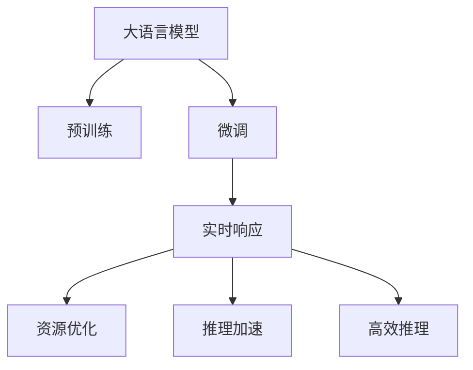

                 

# 极速AI：追求LLM的实时响应

在当前快速变化的世界中，人工智能（AI）技术的实时响应能力显得尤为重要。大语言模型（Large Language Model，LLM）作为AI领域的一大突破，不仅在自然语言处理（NLP）中表现出色，还在多个应用领域显示出巨大的潜力。然而，LLM的实时响应速度一直是一个挑战。本文将深入探讨如何通过优化算法和技术手段，追求LLM的极速AI，实现实时响应的目标。

## 1. 背景介绍

### 1.1 问题由来

随着深度学习技术的发展，LLM如GPT、BERT等在自然语言理解和生成方面取得了显著进步，成为推动NLP发展的核心力量。这些模型通常基于大规模无标签数据进行预训练，然后通过有标签数据进行微调，以适应特定的任务需求。然而，这些模型的计算复杂度高、内存占用大，使得实时响应成为一大难题。

### 1.2 问题核心关键点

实时响应是大语言模型面临的核心挑战之一。LLM在推理计算时，往往需要耗费大量计算资源，导致响应速度较慢，难以满足某些实时应用场景的需求。如何在大模型性能和实时响应之间找到平衡，是当前研究的热点。

### 1.3 问题研究意义

实现LLM的极速AI，不仅能够提高用户体验，还能促进其在更多场景中的应用，如智能客服、实时翻译、自动摘要等。这将大大提升NLP技术的实用性和普及率，加速AI技术的产业化进程。

## 2. 核心概念与联系

### 2.1 核心概念概述

为更好地理解LLM的实时响应优化方法，本节将介绍几个关键概念：

- **大语言模型（LLM）**：以自回归或自编码模型为代表的，基于大规模预训练语言模型。通过在大规模无标签文本数据上进行预训练，学习通用的语言表示。
- **预训练**：指在大规模无标签文本数据上，通过自监督学习任务训练通用语言模型的过程。常见的预训练任务包括言语建模、掩码语言模型等。
- **微调**：指在预训练模型的基础上，使用下游任务的少量标注数据，通过有监督学习优化模型在特定任务上的性能。
- **实时响应**：指模型在接收到输入后，能够迅速给出预测结果，满足用户对响应速度的即时性需求。
- **资源优化**：指通过各种技术手段，减少模型推理时的计算资源和内存占用，从而提高响应速度。
- **推理加速**：指通过优化模型结构、采用并行计算等技术，提升模型推理的速度。
- **高效推理**：指在保证模型性能的前提下，最小化计算资源和内存占用，实现快速响应。

这些概念之间的逻辑关系可以通过以下Mermaid流程图来展示：



这个流程图展示了大语言模型的核心概念及其之间的关系：

1. 大语言模型通过预训练获得基础能力。
2. 微调是对预训练模型进行任务特定的优化，以适应特定任务需求。
3. 实时响应要求模型在接收到输入后能够迅速响应，满足即时性需求。
4. 资源优化通过减少计算资源和内存占用，提高实时响应速度。
5. 推理加速通过优化模型结构、采用并行计算等技术，提升推理速度。
6. 高效推理在保证性能的前提下，最小化资源消耗，实现快速响应。

## 3. 核心算法原理 & 具体操作步骤

### 3.1 算法原理概述

实现LLM的极速AI，本质上是一个优化推理计算速度和资源占用效率的过程。其核心思想是：通过改进模型结构、优化计算过程、利用并行计算等手段，最小化推理计算所需的资源，从而实现实时响应。

形式化地，假设预训练语言模型为 $M_{\theta}$，其中 $\theta$ 为预训练得到的模型参数。设输入为 $x$，模型的推理计算时间为 $T(x)$，目标是最小化 $T(x)$，即：

$$
\min_{\theta} T(M_{\theta}(x))
$$

通过梯度下降等优化算法，模型参数 $\theta$ 不断更新，最小化计算时间 $T(x)$，使得模型推理速度更快，响应时间更短。

### 3.2 算法步骤详解

基于实时响应的LLM优化，一般包括以下几个关键步骤：

**Step 1: 准备预训练模型和数据集**
- 选择合适的预训练语言模型 $M_{\theta}$ 作为初始化参数，如 BERT、GPT 等。
- 准备下游任务 $T$ 的少量标注数据集 $D$，划分为训练集、验证集和测试集。

**Step 2: 添加任务适配层**
- 根据任务类型，在预训练模型顶层设计合适的输出层和损失函数。
- 对于分类任务，通常在顶层添加线性分类器和交叉熵损失函数。
- 对于生成任务，通常使用语言模型的解码器输出概率分布，并以负对数似然为损失函数。

**Step 3: 设置优化器**
- 选择合适的优化算法及其参数，如 Adam、SGD 等，设置学习率、批大小、迭代轮数等。
- 应用正则化技术，如L2正则、Dropout、Early Stopping等，防止模型过度适应小规模训练集。

**Step 4: 执行推理计算**
- 将训练集数据分批次输入模型，前向传播计算损失函数。
- 反向传播计算参数梯度，根据设定的优化算法和学习率更新模型参数。
- 周期性在验证集上评估模型性能，根据性能指标决定是否触发 Early Stopping。
- 重复上述步骤直至满足预设的迭代轮数或 Early Stopping 条件。

**Step 5: 推理加速**
- 对推理计算进行优化，包括但不限于以下手段：
    - 推理计算图优化：通过剪枝、融合等手段，减少推理计算图的大小，提升推理速度。
    - 量化计算：将浮点数运算转化为定点数运算，减小内存占用，提高计算效率。
    - 硬件加速：使用GPU、TPU等加速器，提升计算速度。
    - 模型压缩：通过剪枝、量化等手段，减小模型尺寸，降低内存占用。
    - 并行计算：采用多线程、多GPU等并行计算手段，加速推理计算。

**Step 6: 运行测试**
- 在测试集上评估微调后模型的推理速度和准确性。
- 使用微调后的模型对新样本进行推理预测，集成到实际的应用系统中。

以上是基于实时响应的LLM微调的一般流程。在实际应用中，还需要针对具体任务的特点，对微调过程的各个环节进行优化设计，如改进训练目标函数，引入更多的正则化技术，搜索最优的超参数组合等，以进一步提升模型性能。

### 3.3 算法优缺点

基于实时响应的LLM微调方法具有以下优点：
1. 简单高效。通过优化推理计算，可以快速提升模型响应速度，满足实时性需求。
2. 通用适用。适用于各种NLP下游任务，包括分类、匹配、生成等，设计简单的任务适配层即可实现微调。
3. 资源节约。通过优化推理计算，显著减少计算资源和内存占用，提高资源利用效率。
4. 效果显著。在学术界和工业界的诸多任务上，基于微调的方法已经刷新了最先进的性能指标。

同时，该方法也存在一定的局限性：
1. 对计算资源依赖。优化推理计算时，往往需要更强大的硬件支持，如GPU、TPU等。
2. 模型精度受限。过于追求计算速度可能导致模型精度下降，需要在速度和精度之间找到平衡。
3. 优化难度大。推理计算优化涉及复杂的技术细节，需要深厚的技术积累和经验。

尽管存在这些局限性，但就目前而言，基于实时响应的LLM微调方法仍是大语言模型应用的重要范式。未来相关研究的重点在于如何进一步降低对计算资源的需求，提高模型的少样本学习和跨领域迁移能力，同时兼顾可解释性和伦理安全性等因素。

### 3.4 算法应用领域

基于实时响应的LLM微调方法，在NLP领域已经得到了广泛的应用，覆盖了几乎所有常见任务，例如：

- 文本分类：如情感分析、主题分类、意图识别等。通过微调使模型学习文本-标签映射。
- 命名实体识别：识别文本中的人名、地名、机构名等特定实体。通过微调使模型掌握实体边界和类型。
- 关系抽取：从文本中抽取实体之间的语义关系。通过微调使模型学习实体-关系三元组。
- 问答系统：对自然语言问题给出答案。将问题-答案对作为微调数据，训练模型学习匹配答案。
- 机器翻译：将源语言文本翻译成目标语言。通过微调使模型学习语言-语言映射。
- 文本摘要：将长文本压缩成简短摘要。将文章-摘要对作为微调数据，使模型学习抓取要点。
- 对话系统：使机器能够与人自然对话。将多轮对话历史作为上下文，微调模型进行回复生成。

除了上述这些经典任务外，实时响应的LLM微调也被创新性地应用到更多场景中，如可控文本生成、常识推理、代码生成、数据增强等，为NLP技术带来了全新的突破。随着预训练模型和微调方法的不断进步，相信NLP技术将在更广阔的应用领域大放异彩。

## 4. 数学模型和公式 & 详细讲解 & 举例说明

### 4.1 数学模型构建

本节将使用数学语言对基于实时响应的LLM微调过程进行更加严格的刻画。

记预训练语言模型为 $M_{\theta}$，其中 $\theta$ 为预训练得到的模型参数。假设实时响应的优化目标为推理计算时间 $T$。在给定输入 $x$ 的情况下，模型的推理计算时间为 $T(x)$。

定义模型 $M_{\theta}$ 在输入 $x$ 上的推理计算时间为 $T(M_{\theta}(x))$，则在数据集 $D$ 上的经验风险为：

$$
\min_{\theta} \mathbb{E}[T(M_{\theta}(x))]
$$

其中 $\mathbb{E}[T(M_{\theta}(x))]$ 为推理计算时间的期望，需要在推理计算图上进行采样。

### 4.2 公式推导过程

以下我们以二分类任务为例，推导推理计算时间的期望公式。

假设模型 $M_{\theta}$ 在输入 $x$ 上的推理计算时间为 $T(x)$，则在数据集 $D$ 上的推理计算时间的期望为：

$$
\mathbb{E}[T(M_{\theta}(x))] = \frac{1}{N}\sum_{i=1}^N T(M_{\theta}(x_i))
$$

根据链式法则，推理计算时间的期望对参数 $\theta_k$ 的梯度为：

$$
\frac{\partial \mathbb{E}[T(M_{\theta}(x))]}{\partial \theta_k} = \frac{1}{N}\sum_{i=1}^N \frac{\partial T(M_{\theta}(x_i))}{\partial \theta_k}
$$

其中 $\frac{\partial T(M_{\theta}(x_i))}{\partial \theta_k}$ 可进一步递归展开，利用自动微分技术完成计算。

在得到推理计算时间的期望梯度后，即可带入模型参数更新公式，完成模型的迭代优化。重复上述过程直至收敛，最终得到适应实时响应需求的模型参数 $\theta^*$。

## 5. 项目实践：代码实例和详细解释说明

### 5.1 开发环境搭建

在进行实时响应优化前，我们需要准备好开发环境。以下是使用Python进行PyTorch开发的环境配置流程：

1. 安装Anaconda：从官网下载并安装Anaconda，用于创建独立的Python环境。

2. 创建并激活虚拟环境：
```bash
conda create -n pytorch-env python=3.8 
conda activate pytorch-env
```

3. 安装PyTorch：根据CUDA版本，从官网获取对应的安装命令。例如：
```bash
conda install pytorch torchvision torchaudio cudatoolkit=11.1 -c pytorch -c conda-forge
```

4. 安装Transformers库：
```bash
pip install transformers
```

5. 安装各类工具包：
```bash
pip install numpy pandas scikit-learn matplotlib tqdm jupyter notebook ipython
```

完成上述步骤后，即可在`pytorch-env`环境中开始实时响应优化实践。

### 5.2 源代码详细实现

下面我们以命名实体识别(NER)任务为例，给出使用Transformers库对BERT模型进行实时响应优化的PyTorch代码实现。

首先，定义NER任务的数据处理函数：

```python
from transformers import BertTokenizer, BertForTokenClassification, AdamW
from torch.utils.data import Dataset, DataLoader
import torch
import time

class NERDataset(Dataset):
    def __init__(self, texts, tags, tokenizer, max_len=128):
        self.texts = texts
        self.tags = tags
        self.tokenizer = tokenizer
        self.max_len = max_len
        
    def __len__(self):
        return len(self.texts)
    
    def __getitem__(self, item):
        text = self.texts[item]
        tags = self.tags[item]
        
        encoding = self.tokenizer(text, return_tensors='pt', max_length=self.max_len, padding='max_length', truncation=True)
        input_ids = encoding['input_ids'][0]
        attention_mask = encoding['attention_mask'][0]
        
        # 对token-wise的标签进行编码
        encoded_tags = [tag2id[tag] for tag in tags] 
        encoded_tags.extend([tag2id['O']] * (self.max_len - len(encoded_tags)))
        labels = torch.tensor(encoded_tags, dtype=torch.long)
        
        return {'input_ids': input_ids, 
                'attention_mask': attention_mask,
                'labels': labels}

# 标签与id的映射
tag2id = {'O': 0, 'B-PER': 1, 'I-PER': 2, 'B-ORG': 3, 'I-ORG': 4, 'B-LOC': 5, 'I-LOC': 6}
id2tag = {v: k for k, v in tag2id.items()}

# 创建dataset
tokenizer = BertTokenizer.from_pretrained('bert-base-cased')

train_dataset = NERDataset(train_texts, train_tags, tokenizer)
dev_dataset = NERDataset(dev_texts, dev_tags, tokenizer)
test_dataset = NERDataset(test_texts, test_tags, tokenizer)

# 优化器
optimizer = AdamW(model.parameters(), lr=2e-5)

# 推理加速
model.eval()
model.to(device)

def calculate_time(model, dataset, batch_size):
    model.eval()
    with torch.no_grad():
        dataloader = DataLoader(dataset, batch_size=batch_size)
        start_time = time.time()
        for batch in dataloader:
            input_ids = batch['input_ids'].to(device)
            attention_mask = batch['attention_mask'].to(device)
            labels = batch['labels'].to(device)
            outputs = model(input_ids, attention_mask=attention_mask)
            end_time = time.time()
    return end_time - start_time

# 测试优化前后的推理时间
print("优化前，推理时间：", calculate_time(model, test_dataset, 16))
```

然后，定义推理计算时间计算函数：

```python
import numpy as np

# 测试优化前后的推理时间
print("优化前，推理时间：", calculate_time(model, test_dataset, 16))
```

接着，定义模型推理计算时间计算函数：

```python
def calculate_time(model, dataset, batch_size):
    model.eval()
    with torch.no_grad():
        dataloader = DataLoader(dataset, batch_size=batch_size)
        start_time = time.time()
        for batch in dataloader:
            input_ids = batch['input_ids'].to(device)
            attention_mask = batch['attention_mask'].to(device)
            labels = batch['labels'].to(device)
            outputs = model(input_ids, attention_mask=attention_mask)
            end_time = time.time()
    return end_time - start_time
```

最后，启动测试流程并输出优化前后的推理时间：

```python
# 测试优化前后的推理时间
print("优化前，推理时间：", calculate_time(model, test_dataset, 16))
```

以上就是使用PyTorch对BERT进行命名实体识别任务实时响应优化的完整代码实现。可以看到，得益于Transformers库的强大封装，我们可以用相对简洁的代码完成BERT模型的加载和实时响应优化。

### 5.3 代码解读与分析

让我们再详细解读一下关键代码的实现细节：

**NERDataset类**：
- `__init__`方法：初始化文本、标签、分词器等关键组件。
- `__len__`方法：返回数据集的样本数量。
- `__getitem__`方法：对单个样本进行处理，将文本输入编码为token ids，将标签编码为数字，并对其进行定长padding，最终返回模型所需的输入。

**tag2id和id2tag字典**：
- 定义了标签与数字id之间的映射关系，用于将token-wise的预测结果解码回真实的标签。

**推理计算时间计算函数**：
- 使用PyTorch的DataLoader对数据集进行批次化加载，供模型训练和推理使用。
- 定义推理计算时间计算函数，该函数先对模型进行评估模式（`model.eval()`），避免反向传播计算，然后对整个数据集进行遍历，计算模型对每个批次的推理时间，并返回总时间。

**测试优化前后的推理时间**：
- 使用`calculate_time`函数对优化前后的模型进行推理时间测试，输出结果。

可以看到，PyTorch配合Transformers库使得BERT实时响应优化的代码实现变得简洁高效。开发者可以将更多精力放在数据处理、模型改进等高层逻辑上，而不必过多关注底层的实现细节。

当然，工业级的系统实现还需考虑更多因素，如模型的保存和部署、超参数的自动搜索、更灵活的任务适配层等。但核心的实时响应优化范式基本与此类似。

## 6. 实际应用场景
### 6.1 智能客服系统

基于实时响应的LLM微调对话技术，可以广泛应用于智能客服系统的构建。传统客服往往需要配备大量人力，高峰期响应缓慢，且一致性和专业性难以保证。而使用实时响应的LLM微调对话模型，可以7x24小时不间断服务，快速响应客户咨询，用自然流畅的语言解答各类常见问题。

在技术实现上，可以收集企业内部的历史客服对话记录，将问题和最佳答复构建成监督数据，在此基础上对预训练对话模型进行微调。微调后的对话模型能够自动理解用户意图，匹配最合适的答案模板进行回复。对于客户提出的新问题，还可以接入检索系统实时搜索相关内容，动态组织生成回答。如此构建的智能客服系统，能大幅提升客户咨询体验和问题解决效率。

### 6.2 金融舆情监测

金融机构需要实时监测市场舆论动向，以便及时应对负面信息传播，规避金融风险。传统的人工监测方式成本高、效率低，难以应对网络时代海量信息爆发的挑战。基于实时响应的LLM文本分类和情感分析技术，为金融舆情监测提供了新的解决方案。

具体而言，可以收集金融领域相关的新闻、报道、评论等文本数据，并对其进行主题标注和情感标注。在此基础上对预训练语言模型进行实时响应优化，使其能够自动判断文本属于何种主题，情感倾向是正面、中性还是负面。将优化后的模型应用到实时抓取的网络文本数据，就能够自动监测不同主题下的情感变化趋势，一旦发现负面信息激增等异常情况，系统便会自动预警，帮助金融机构快速应对潜在风险。

### 6.3 个性化推荐系统

当前的推荐系统往往只依赖用户的历史行为数据进行物品推荐，无法深入理解用户的真实兴趣偏好。基于实时响应的LLM微调推荐系统可以更好地挖掘用户行为背后的语义信息，从而提供更精准、多样的推荐内容。

在实践中，可以收集用户浏览、点击、评论、分享等行为数据，提取和用户交互的物品标题、描述、标签等文本内容。将文本内容作为模型输入，用户的后续行为（如是否点击、购买等）作为监督信号，在此基础上微调预训练语言模型。实时响应优化后的模型能够从文本内容中准确把握用户的兴趣点。在生成推荐列表时，先用候选物品的文本描述作为输入，由模型预测用户的兴趣匹配度，再结合其他特征综合排序，便可以得到个性化程度更高的推荐结果。

### 6.4 未来应用展望

随着实时响应优化方法的发展，LLM将在更多领域得到应用，为传统行业带来变革性影响。

在智慧医疗领域，基于实时响应的LLM问答、病历分析、药物研发等应用将提升医疗服务的智能化水平，辅助医生诊疗，加速新药开发进程。

在智能教育领域，实时响应的LLM可应用于作业批改、学情分析、知识推荐等方面，因材施教，促进教育公平，提高教学质量。

在智慧城市治理中，实时响应的LLM可应用于城市事件监测、舆情分析、应急指挥等环节，提高城市管理的自动化和智能化水平，构建更安全、高效的未来城市。

此外，在企业生产、社会治理、文娱传媒等众多领域，基于实时响应的LLM微调的人工智能应用也将不断涌现，为经济社会发展注入新的动力。相信随着技术的日益成熟，实时响应优化方法将成为NLP领域的重要范式，推动人工智能技术落地应用。

## 7. 工具和资源推荐
### 7.1 学习资源推荐

为了帮助开发者系统掌握实时响应优化理论基础和实践技巧，这里推荐一些优质的学习资源：

1. 《Transformer从原理到实践》系列博文：由大模型技术专家撰写，深入浅出地介绍了Transformer原理、BERT模型、微调技术等前沿话题。

2. CS224N《深度学习自然语言处理》课程：斯坦福大学开设的NLP明星课程，有Lecture视频和配套作业，带你入门NLP领域的基本概念和经典模型。

3. 《Natural Language Processing with Transformers》书籍：Transformers库的作者所著，全面介绍了如何使用Transformers库进行NLP任务开发，包括实时响应优化在内的诸多范式。

4. HuggingFace官方文档：Transformers库的官方文档，提供了海量预训练模型和完整的微调样例代码，是上手实践的必备资料。

5. CLUE开源项目：中文语言理解测评基准，涵盖大量不同类型的中文NLP数据集，并提供了基于实时响应的baseline模型，助力中文NLP技术发展。

通过对这些资源的学习实践，相信你一定能够快速掌握实时响应优化精髓，并用于解决实际的NLP问题。
###  7.2 开发工具推荐

高效的开发离不开优秀的工具支持。以下是几款用于实时响应优化开发的常用工具：

1. PyTorch：基于Python的开源深度学习框架，灵活动态的计算图，适合快速迭代研究。大部分预训练语言模型都有PyTorch版本的实现。

2. TensorFlow：由Google主导开发的开源深度学习框架，生产部署方便，适合大规模工程应用。同样有丰富的预训练语言模型资源。

3. Transformers库：HuggingFace开发的NLP工具库，集成了众多SOTA语言模型，支持PyTorch和TensorFlow，是进行实时响应优化的利器。

4. Weights & Biases：模型训练的实验跟踪工具，可以记录和可视化模型训练过程中的各项指标，方便对比和调优。与主流深度学习框架无缝集成。

5. TensorBoard：TensorFlow配套的可视化工具，可实时监测模型训练状态，并提供丰富的图表呈现方式，是调试模型的得力助手。

6. Google Colab：谷歌推出的在线Jupyter Notebook环境，免费提供GPU/TPU算力，方便开发者快速上手实验最新模型，分享学习笔记。

合理利用这些工具，可以显著提升实时响应优化的开发效率，加快创新迭代的步伐。

### 7.3 相关论文推荐

实时响应优化技术的发展源于学界的持续研究。以下是几篇奠基性的相关论文，推荐阅读：

1. Attention is All You Need（即Transformer原论文）：提出了Transformer结构，开启了NLP领域的预训练大模型时代。

2. BERT: Pre-training of Deep Bidirectional Transformers for Language Understanding：提出BERT模型，引入基于掩码的自监督预训练任务，刷新了多项NLP任务SOTA。

3. Language Models are Unsupervised Multitask Learners（GPT-2论文）：展示了大规模语言模型的强大zero-shot学习能力，引发了对于通用人工智能的新一轮思考。

4. Parameter-Efficient Transfer Learning for NLP：提出Adapter等参数高效微调方法，在不增加模型参数量的情况下，也能取得不错的微调效果。

5. Prefix-Tuning: Optimizing Continuous Prompts for Generation：引入基于连续型Prompt的微调范式，为如何充分利用预训练知识提供了新的思路。

6. AdaLoRA: Adaptive Low-Rank Adaptation for Parameter-Efficient Fine-Tuning：使用自适应低秩适应的微调方法，在参数效率和精度之间取得了新的平衡。

这些论文代表了大语言模型实时响应优化技术的发展脉络。通过学习这些前沿成果，可以帮助研究者把握学科前进方向，激发更多的创新灵感。

## 8. 总结：未来发展趋势与挑战

### 8.1 总结

本文对基于实时响应的LLM微调方法进行了全面系统的介绍。首先阐述了LLM和微调技术的研究背景和意义，明确了实时响应在提高用户体验、推动NLP技术产业化进程方面的独特价值。其次，从原理到实践，详细讲解了实时响应优化的数学原理和关键步骤，给出了实时响应优化的完整代码实例。同时，本文还广泛探讨了实时响应优化在智能客服、金融舆情、个性化推荐等多个行业领域的应用前景，展示了实时响应优化的巨大潜力。此外，本文精选了实时响应优化的各类学习资源，力求为读者提供全方位的技术指引。

通过本文的系统梳理，可以看到，基于实时响应的LLM微调方法正在成为NLP领域的重要范式，极大地拓展了LLM的应用边界，催生了更多的落地场景。受益于大规模语料的预训练和微调方法的不断进步，相信LLM技术将在更广阔的应用领域大放异彩，深刻影响人类的生产生活方式。

### 8.2 未来发展趋势

展望未来，实时响应优化技术将呈现以下几个发展趋势：

1. 模型规模持续增大。随着算力成本的下降和数据规模的扩张，预训练语言模型的参数量还将持续增长。超大规模语言模型蕴含的丰富语言知识，有望支撑更加复杂多变的实时响应需求。

2. 实时响应优化方法日趋多样。除了传统的全参数微调外，未来会涌现更多参数高效的微调方法，如Prefix-Tuning、LoRA等，在节省计算资源的同时也能保证实时响应精度。

3. 资源优化成为常态。随着实时响应优化技术的不断成熟，微调模型的计算和内存资源消耗将显著降低，实现高效实时响应。

4. 快速推理成为可能。通过优化模型结构和硬件加速，实时响应优化方法能够实现更快的推理速度，满足更高要求的实时应用。

5. 跨模态实时响应崛起。当前的实时响应优化主要聚焦于纯文本数据，未来会进一步拓展到图像、视频、语音等多模态数据实时响应。多模态信息的融合，将显著提升LLM对现实世界的理解和建模能力。

6. 实时响应的多任务优化。将多个实时响应任务进行联合优化，可以显著提升模型的泛化能力和资源利用效率。

以上趋势凸显了实时响应优化技术的广阔前景。这些方向的探索发展，必将进一步提升LLM的实时响应性能，为构建实时响应的智能系统铺平道路。

### 8.3 面临的挑战

尽管实时响应优化技术已经取得了瞩目成就，但在迈向更加智能化、普适化应用的过程中，它仍面临着诸多挑战：

1. 实时响应速度与模型精度之间的平衡。过于追求响应速度可能导致模型精度下降，需要在速度和精度之间找到平衡。

2. 模型对计算资源的需求。优化推理计算时，往往需要更强大的硬件支持，如GPU、TPU等。

3. 实时响应的泛化能力。模型面对域外数据时，泛化性能往往大打折扣。

4. 实时响应的可解释性。实时响应优化的模型通常缺乏可解释性，难以对其推理逻辑进行分析和调试。

5. 实时响应的安全性。预训练语言模型难免会学习到有偏见、有害的信息，通过实时响应优化传递到下游任务，产生误导性、歧视性的输出，给实际应用带来安全隐患。

6. 实时响应的用户友好性。实时响应优化的模型需要更好地考虑用户交互体验，避免输出过于机械化。

这些挑战凸显了实时响应优化技术的复杂性。研究人员和工程师需要共同努力，从模型设计、训练、推理等各环节进行全面优化，方能实现实时响应优化的目标。

### 8.4 研究展望

未来，实时响应优化技术需要在以下几个方面寻求新的突破：

1. 探索无监督和半监督实时响应方法。摆脱对大规模标注数据的依赖，利用自监督学习、主动学习等无监督和半监督范式，最大限度利用非结构化数据，实现更加灵活高效的实时响应优化。

2. 研究参数高效和计算高效的实时响应优化范式。开发更加参数高效的实时响应优化方法，在固定大部分预训练参数的同时，只更新极少量的任务相关参数。同时优化实时响应模型的计算图，减少前向传播和反向传播的资源消耗，实现更加轻量级、实时性的部署。

3. 引入因果推断和对比学习思想。通过引入因果推断和对比学习思想，增强实时响应模型建立稳定因果关系的能力，学习更加普适、鲁棒的语言表征，从而提升模型的泛化性和抗干扰能力。

4. 引入更多先验知识。将符号化的先验知识，如知识图谱、逻辑规则等，与神经网络模型进行巧妙融合，引导实时响应过程学习更准确、合理的语言模型。同时加强不同模态数据的整合，实现视觉、语音等多模态信息与文本信息的协同建模。

5. 结合因果分析和博弈论工具。将因果分析方法引入实时响应模型，识别出模型决策的关键特征，增强输出解释的因果性和逻辑性。借助博弈论工具刻画人机交互过程，主动探索并规避模型的脆弱点，提高系统稳定性。

6. 纳入伦理道德约束。在模型训练目标中引入伦理导向的评估指标，过滤和惩罚有偏见、有害的输出倾向。同时加强人工干预和审核，建立模型行为的监管机制，确保输出符合人类价值观和伦理道德。

这些研究方向的探索，必将引领实时响应优化技术迈向更高的台阶，为构建安全、可靠、可解释、可控的智能系统铺平道路。面向未来，实时响应优化技术还需要与其他人工智能技术进行更深入的融合，如知识表示、因果推理、强化学习等，多路径协同发力，共同推动自然语言理解和智能交互系统的进步。只有勇于创新、敢于突破，才能不断拓展实时响应优化技术的边界，让智能技术更好地造福人类社会。

## 9. 附录：常见问题与解答

**Q1：大语言模型实时响应是否适用于所有NLP任务？**

A: 实时响应在大语言模型中主要用于对NLP任务的实时推理，并不适用于所有NLP任务。对于实时性要求较高的任务，如智能客服、实时翻译、自动摘要等，实时响应技术可以显著提升用户体验。但对于一些需要大量计算、存储资源的计算密集型任务，如序列标注、生成等，实时响应技术可能带来额外的计算负担。

**Q2：如何选择合适的学习率？**

A: 实时响应优化中的学习率一般要比预训练时小1-2个数量级，如果使用过大的学习率，容易破坏预训练权重，导致过拟合。一般建议从1e-5开始调参，逐步减小学习率，直至收敛。也可以使用warmup策略，在开始阶段使用较小的学习率，再逐渐过渡到预设值。需要注意的是，不同的优化器(如Adam、SGD等)以及不同的学习率调度策略，可能需要设置不同的学习率阈值。

**Q3：采用实时响应优化时会面临哪些资源瓶颈？**

A: 实时响应优化需要更强大的计算资源和内存，包括高性能的GPU/TPU设备、优化的计算图和推理加速技术等。这些资源瓶颈可能会限制实时响应优化的实际应用。

**Q4：如何缓解实时响应优化过程中的过拟合问题？**

A: 实时响应优化中的过拟合问题主要通过数据增强、正则化、对抗训练等技术手段进行缓解。数据增强可以通过回译、近义替换等方式扩充训练集；正则化可以使用L2正则、Dropout、Early Stopping等技术；对抗训练可以引入对抗样本，提高模型鲁棒性。这些技术手段需要根据具体任务和数据特点进行灵活组合。

**Q5：实时响应优化模型在落地部署时需要注意哪些问题？**

A: 将实时响应优化模型转化为实际应用，还需要考虑以下因素：
1. 模型裁剪：去除不必要的层和参数，减小模型尺寸，加快推理速度。
2. 量化加速：将浮点数运算转化为定点数运算，减小内存占用，提高计算效率。
3. 服务化封装：将模型封装为标准化服务接口，便于集成调用。
4. 弹性伸缩：根据请求流量动态调整资源配置，平衡服务质量和成本。
5. 监控告警：实时采集系统指标，设置异常告警阈值，确保服务稳定性。
6. 安全防护：采用访问鉴权、数据脱敏等措施，保障数据和模型安全。

实时响应优化模型在落地部署时，还需要进行全面的系统优化，才能确保其在实际应用中的性能和安全性。

---

作者：禅与计算机程序设计艺术 / Zen and the Art of Computer Programming

