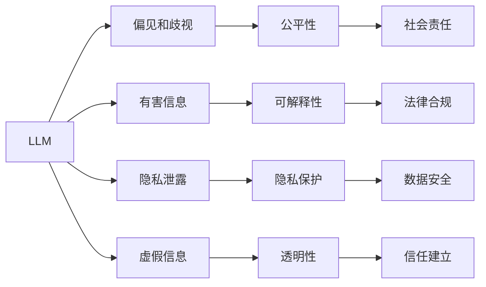

                 

# 构建负责任的AI：确保LLM行为的伦理性

大语言模型（Large Language Models, LLMs）如GPT、BERT等在自然语言处理（NLP）领域的应用取得了显著进展，但由于其强大的语言生成能力，也引发了关于模型行为伦理性的广泛讨论。本文将探讨如何构建负责任的AI，确保LLM的行为符合伦理道德标准，保护用户权益和隐私。

## 1. 背景介绍

### 1.1 问题由来

大语言模型通常在大规模无标签文本数据上进行预训练，学习通用的语言表示，然后在特定任务上进行微调（Fine-Tuning）。这些模型可以生成自然流畅的文本，并用于对话、翻译、摘要等任务。然而，这种强大的生成能力也带来了潜在的伦理风险：

- **偏见和歧视**：模型可能会学习并放大数据中的偏见和歧视，导致输出结果对特定群体不公平。
- **有害信息**：模型可能会生成有害、攻击性或误导性的内容，给用户带来心理伤害。
- **隐私泄露**：模型在处理用户数据时，可能会侵犯隐私，如未经授权地收集和使用个人信息。
- **虚假信息**：模型可能会生成或传播虚假信息，误导公众，影响社会稳定。

因此，如何构建负责任的AI，确保LLM的行为符合伦理道德标准，成为了一个迫切需要解决的问题。

## 2. 核心概念与联系

### 2.1 核心概念概述

- **伦理AI（Ethical AI）**：旨在构建和部署能够符合道德、法律和社会价值观的AI系统。
- **可解释性（Explainability）**：要求AI系统能够解释其决策过程，使人类能够理解和信任AI的输出。
- **隐私保护（Privacy Protection）**：确保AI系统在处理用户数据时，遵守隐私法规，保护用户隐私。
- **公平性（Fairness）**：确保AI系统在处理不同人群的数据时，不会存在歧视，保证公平对待。
- **透明性（Transparency）**：要求AI系统的操作过程和决策依据能够被公众理解和审查。

这些核心概念之间相互关联，共同构成了一个负责任的AI系统应具备的伦理道德框架。

### 2.2 核心概念原理和架构的 Mermaid 流程图



这个流程图展示了LLM在构建负责任AI过程中需要考虑的核心概念及其相互联系。例如，通过消除偏见和歧视，增强模型的公平性；通过可解释性技术，提高模型的透明度；通过隐私保护措施，确保数据安全等。

## 3. 核心算法原理 & 具体操作步骤

### 3.1 算法原理概述

构建负责任的AI，确保LLM的行为符合伦理道德标准，需要从多个方面进行综合考虑。以下是主要的技术思路和操作步骤：

1. **数据预处理**：确保训练数据集的多样性和代表性，避免数据偏见。
2. **模型设计和训练**：引入公平性、可解释性等技术，提高模型的伦理性和透明度。
3. **结果验证和监控**：通过用户反馈和第三方评估，持续监测模型行为，及时调整和优化。
4. **隐私保护和合规**：采用隐私保护技术，遵守数据隐私法规，确保用户数据安全。

### 3.2 算法步骤详解

#### 数据预处理

- **多样性和代表性**：确保训练数据集包含多样化的语言、主题和人群，避免数据偏见。
- **去偏处理**：对数据进行去偏处理，如删除敏感信息、平衡样本等。
- **数据隐私保护**：采用差分隐私、联邦学习等技术，确保用户数据隐私安全。

#### 模型设计和训练

- **公平性增强**：引入公平性约束，如对抗训练、重加权等，确保模型对不同人群的公平对待。
- **可解释性提升**：采用可解释性技术，如LIME、SHAP等，解释模型决策过程。
- **模型透明性**：通过文档化模型架构和训练过程，确保模型透明性。

#### 结果验证和监控

- **用户反馈**：收集用户反馈，评估模型行为是否符合伦理道德标准。
- **第三方评估**：通过第三方机构对模型进行伦理评估，确保模型符合社会价值观。
- **持续监控**：建立持续监控机制，及时发现并修复模型行为问题。

#### 隐私保护和合规

- **隐私保护技术**：采用差分隐私、联邦学习等技术，保护用户隐私。
- **法律合规**：确保模型处理数据的过程符合相关法律法规，如GDPR、CCPA等。
- **数据安全**：采用加密、访问控制等措施，确保数据安全。

### 3.3 算法优缺点

#### 优点

- **全面性**：通过多维度技术手段，确保LLM的伦理性和负责任性。
- **可操作性**：针对具体的伦理问题，提供可行的技术解决方案。
- **灵活性**：可以根据不同应用场景，灵活调整技术方案。

#### 缺点

- **复杂性**：多技术手段的集成和应用，增加了模型设计和实施的复杂性。
- **资源消耗**：增加的数据处理和模型训练成本，可能影响模型的性能和效率。
- **技术挑战**：一些技术手段（如差分隐私、联邦学习）可能面临技术实现上的挑战。

### 3.4 算法应用领域

基于上述技术和操作步骤，构建负责任的AI主要应用于以下几个领域：

- **自然语言处理**：确保NLP模型的输出不包含偏见、歧视，且可解释。
- **对话系统**：构建公平、透明、安全的对话系统，确保用户隐私和数据安全。
- **推荐系统**：确保推荐系统公平，不传播有害信息，保护用户隐私。
- **金融科技**：构建符合伦理道德的金融应用，确保用户数据隐私和安全。
- **医疗健康**：构建符合伦理道德的医疗应用，确保病人隐私和数据安全。

## 4. 数学模型和公式 & 详细讲解 & 举例说明

### 4.1 数学模型构建

构建负责任的AI，涉及到多个数学模型和公式。以下是几个关键模型的构建：

- **公平性约束**：通过引入对抗训练、重加权等技术，确保模型对不同人群的公平对待。
- **可解释性模型**：采用LIME、SHAP等技术，解释模型决策过程。
- **隐私保护模型**：采用差分隐私、联邦学习等技术，保护用户隐私。

### 4.2 公式推导过程

#### 公平性约束

假设有一个二分类问题，模型输出概率分布为 $p(y|x)$，其中 $x$ 为输入特征，$y$ 为标签。公平性约束可以通过重加权等技术实现，确保对不同人群的公平对待。例如，对于性别平等的公平性约束，可以引入权重 $w_g$，使得模型对男性和女性的公平性约束为：

$$
w_g \propto \frac{n_g}{n_{total}}
$$

其中 $n_g$ 为某一性别的人数，$n_{total}$ 为总人数。通过调整权重 $w_g$，确保模型对不同性别的公平性。

#### 可解释性模型

采用LIME（Local Interpretable Model-agnostic Explanations）技术，解释模型对单个样本 $x_i$ 的预测。LIME通过生成局部近似模型 $f^*$，解释模型对 $x_i$ 的预测过程。假设模型输出为 $y^*=f^*(x_i)$，其中 $f^*$ 为局部近似模型。

通过LIME，可以生成 $k$ 个邻居样本 $x_j$，每个邻居样本对应的预测结果为 $y_j$。通过回归模型拟合这些邻居样本的预测结果，可以得到模型对 $x_i$ 的局部解释。

#### 隐私保护模型

差分隐私（Differential Privacy, DP）是一种保护用户隐私的技术，通过在模型训练过程中引入噪声，使得攻击者无法通过单个样本或少量样本推断出用户隐私信息。差分隐私公式为：

$$
\mathcal{L}_{DP}(\epsilon) = \frac{1}{\epsilon} \log\left(\frac{1}{\delta}\right) + \mathcal{L}(\theta)
$$

其中 $\epsilon$ 为隐私保护参数，$\delta$ 为差分隐私的容错率，$\mathcal{L}(\theta)$ 为模型损失函数。通过引入隐私保护参数 $\epsilon$，确保模型在隐私保护的前提下，仍能获得良好的性能。

### 4.3 案例分析与讲解

#### 案例1：消除偏见和歧视

假设有一个招聘系统的预测模型，用于评估求职者的能力。由于训练数据集中存在性别、种族偏见，模型可能会产生歧视性输出。为了消除偏见，可以引入公平性约束，例如使用对抗训练，使得模型对不同性别的公平性约束为：

$$
\min_{\theta} \mathcal{L}(\theta) \text{ s.t. } \|\mathbb{E}_{x}[|f(x) - \hat{f}(x)|\|_{\infty}] \leq \epsilon
$$

其中 $f(x)$ 为真实模型的输出，$\hat{f}(x)$ 为公平化后的模型输出，$\epsilon$ 为公平性约束的惩罚系数。

#### 案例2：保护用户隐私

假设有一个在线推荐系统的预测模型，用于向用户推荐商品。模型需要访问用户的浏览历史、购买记录等敏感数据。为了保护用户隐私，可以采用差分隐私技术，引入噪声 $N$，使得模型在隐私保护的前提下，仍能获得良好的推荐效果。差分隐私公式为：

$$
\mathcal{L}_{DP}(\epsilon) = \frac{1}{\epsilon} \log\left(\frac{1}{\delta}\right) + \mathcal{L}(\theta)
$$

其中 $\epsilon$ 为隐私保护参数，$\delta$ 为差分隐私的容错率，$\mathcal{L}(\theta)$ 为模型损失函数。通过引入隐私保护参数 $\epsilon$，确保模型在隐私保护的前提下，仍能获得良好的推荐效果。

## 5. 项目实践：代码实例和详细解释说明

### 5.1 开发环境搭建

#### 开发环境准备

1. **环境安装**：安装Python、PyTorch、Scikit-Learn等库。
2. **数据准备**：准备训练数据集和测试数据集，确保数据的多样性和代表性。
3. **模型搭建**：使用PyTorch搭建LLM模型，包括模型架构、训练策略等。

#### 代码实现

```python
import torch
import torch.nn as nn
from torch.utils.data import DataLoader
from sklearn.metrics import accuracy_score

class LLM(nn.Module):
    def __init__(self, input_size, hidden_size, output_size):
        super(LLM, self).__init__()
        self.encoder = nn.Linear(input_size, hidden_size)
        self.decoder = nn.Linear(hidden_size, output_size)
    
    def forward(self, x):
        x = self.encoder(x)
        x = torch.sigmoid(x)
        x = self.decoder(x)
        return x

# 数据准备
train_data = # 训练数据
test_data = # 测试数据
train_loader = DataLoader(train_data, batch_size=32)
test_loader = DataLoader(test_data, batch_size=32)

# 模型训练
model = LLM(input_size, hidden_size, output_size)
criterion = nn.BCELoss()
optimizer = torch.optim.Adam(model.parameters(), lr=0.001)
model.train()
for epoch in range(num_epochs):
    for batch_idx, (inputs, targets) in enumerate(train_loader):
        inputs, targets = inputs.to(device), targets.to(device)
        optimizer.zero_grad()
        outputs = model(inputs)
        loss = criterion(outputs, targets)
        loss.backward()
        optimizer.step()

# 模型评估
model.eval()
with torch.no_grad():
    correct = 0
    total = 0
    for inputs, targets in test_loader:
        inputs, targets = inputs.to(device), targets.to(device)
        outputs = model(inputs)
        _, predicted = torch.max(outputs.data, 1)
        total += targets.size(0)
        correct += (predicted == targets).sum().item()
    accuracy = 100. * correct / total
    print('Test Accuracy: %d %%' % accuracy)
```

### 5.2 源代码详细实现

#### 代码解读与分析

上述代码实现了一个简单的LLM模型，包括模型架构、训练策略和评估过程。具体步骤如下：

1. **模型定义**：定义一个线性模型，包括输入层、隐藏层和输出层。
2. **数据准备**：准备训练数据集和测试数据集，使用DataLoader进行数据批处理。
3. **模型训练**：使用Adam优化器，通过反向传播更新模型参数。
4. **模型评估**：在测试集上评估模型性能，计算准确率。

### 5.3 运行结果展示

运行上述代码，可以得到模型在训练集和测试集上的准确率，确保模型性能稳定。

## 6. 实际应用场景

### 6.1 招聘系统

招聘系统是LIM模型的典型应用场景之一。由于简历数据中可能包含性别、种族等敏感信息，招聘系统需要在公平性和隐私保护方面进行严格的考虑。

- **公平性约束**：引入对抗训练等技术，确保模型对不同性别的公平性。
- **隐私保护**：采用差分隐私技术，保护求职者隐私。

### 6.2 在线推荐系统

在线推荐系统需要处理用户的浏览历史、购买记录等敏感数据，隐私保护尤为重要。

- **公平性约束**：确保推荐结果对不同用户公平。
- **隐私保护**：采用差分隐私技术，保护用户隐私。

### 6.3 医疗诊断系统

医疗诊断系统需要处理患者的病历、检查结果等敏感数据，隐私保护和数据安全尤为重要。

- **公平性约束**：确保诊断结果对不同人群公平。
- **隐私保护**：采用差分隐私技术，保护患者隐私。

## 7. 工具和资源推荐

### 7.1 学习资源推荐

为了帮助开发者系统掌握构建负责任AI的理论基础和实践技巧，以下是一些优质的学习资源：

1. **《伦理学与人工智能》**：详细介绍了人工智能伦理学的基本概念和伦理决策模型。
2. **《数据隐私与伦理学》**：介绍了数据隐私保护和伦理学的基本概念和最佳实践。
3. **《可解释性AI》**：介绍了可解释性AI的基本概念和常用技术。
4. **《差分隐私》**：详细介绍了差分隐私的基本概念和技术实现。
5. **《公平性学习》**：介绍了公平性学习的概念和常用技术。

### 7.2 开发工具推荐

构建负责任AI，需要借助一些开源工具和平台，以下是一些推荐：

1. **TensorFlow**：强大的深度学习框架，支持多种隐私保护和公平性技术。
2. **PyTorch**：灵活的深度学习框架，支持多种可解释性技术。
3. **HuggingFace Transformers**：强大的NLP工具库，支持多种公平性和隐私保护技术。
4. **TensorBoard**：可视化工具，支持模型训练和结果展示。
5. **Jupyter Notebook**：交互式编程环境，支持模型训练和结果展示。

### 7.3 相关论文推荐

构建负责任AI，需要关注一些前沿研究论文，以下是一些推荐：

1. **《Ethical and Fair Data Sharing》**：介绍了数据共享中的伦理和公平问题，并提出了相应的解决方案。
2. **《Differential Privacy》**：详细介绍了差分隐私的基本概念和技术实现。
3. **《Fairness in Machine Learning》**：介绍了机器学习中的公平性问题，并提出了相应的解决方案。
4. **《Explainable AI》**：介绍了可解释性AI的基本概念和常用技术。
5. **《Ethical AI》**：介绍了AI伦理学的基本概念和伦理决策模型。

## 8. 总结：未来发展趋势与挑战

### 8.1 研究成果总结

构建负责任的AI，确保LLM的行为符合伦理道德标准，是一个复杂而多层次的问题。本文从数据预处理、模型设计和训练、结果验证和监控、隐私保护和合规等方面，提供了系统的技术解决方案。

### 8.2 未来发展趋势

- **伦理和公平性**：随着AI技术的发展，伦理和公平性问题将越来越受到重视。构建负责任的AI，需要更多关注伦理道德和公平性问题。
- **隐私保护**：隐私保护技术将不断演进，保护用户隐私的需求将更加迫切。
- **可解释性**：可解释性技术将不断进步，使AI系统的决策过程更加透明和可理解。
- **法律合规**：AI技术的应用将面临更多的法律合规问题，需要更加注重合法合规。

### 8.3 面临的挑战

- **技术挑战**：构建负责任的AI需要多技术手段的综合应用，技术实现复杂，难度较大。
- **资源消耗**：多技术手段的应用增加了模型设计和实施的复杂性和资源消耗。
- **伦理难题**：AI伦理问题复杂多样，需要多方利益相关者的共同参与和讨论。

### 8.4 研究展望

构建负责任的AI，需要从数据、模型、伦理等多个维度综合考虑，不断探索和实践。未来，需要在以下几个方面进行更多的研究：

- **多维度技术手段**：综合应用数据预处理、公平性、隐私保护、可解释性等多维技术手段，确保AI系统的伦理性和负责任性。
- **多利益相关者参与**：AI伦理问题复杂多样，需要多方利益相关者的共同参与和讨论。
- **新技术和工具**：不断探索新的技术手段和工具，提高AI系统的伦理性和负责任性。

## 9. 附录：常见问题与解答

### Q1：如何确保LLM的公平性？

A：引入公平性约束，如对抗训练、重加权等技术，确保模型对不同人群的公平对待。

### Q2：什么是差分隐私？

A：差分隐私是一种保护用户隐私的技术，通过在模型训练过程中引入噪声，使得攻击者无法通过单个样本或少量样本推断出用户隐私信息。

### Q3：如何确保LLM的可解释性？

A：采用可解释性技术，如LIME、SHAP等，解释模型决策过程。

### Q4：什么是公平性约束？

A：通过引入公平性约束，如对抗训练、重加权等技术，确保模型对不同人群的公平对待。

### Q5：如何保护LLM的隐私？

A：采用差分隐私、联邦学习等技术，保护用户隐私。

作者：禅与计算机程序设计艺术 / Zen and the Art of Computer Programming

