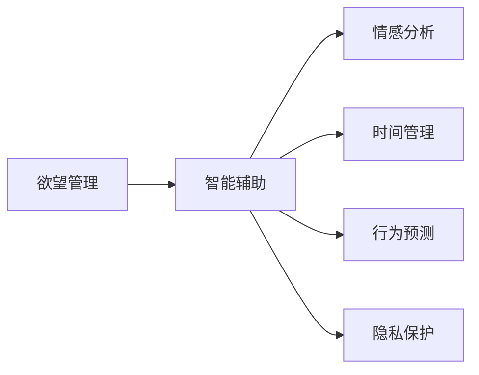

                 

# 欲望的智能调节：AI辅助的自我管理

在数字化浪潮中，人工智能（AI）技术日益融入人们生活的方方面面，而欲望调节的智能辅助便是其中的一朵璀璨之花。本博文将深入探讨这一主题，从背景介绍到核心算法，再到实践案例，全面解读欲望调节的AI辅助策略，并展望其未来应用前景。

## 1. 背景介绍

### 1.1 问题由来
随着社会经济的发展，欲望管理成为了现代生活中不可忽视的一个重要议题。人们面对诸多诱惑，如何有效管理自身欲望，提高生活质量，成为许多人追求的目标。

欲望管理的难点在于其复杂性和个体差异性。传统的欲望管理方法依赖于自我约束和心理调节，但效果往往难以持久。而人工智能技术的发展，特别是机器学习和大数据分析的进步，为欲望调节的智能辅助提供了新的可能。

### 1.2 问题核心关键点
欲望调节的智能辅助涉及多种技术手段，如情感分析、时间管理、行为预测等。核心问题包括：

1. **情感识别**：如何准确识别用户情绪，从而针对性地提供干预措施？
2. **行为建模**：如何建立行为模型，预测用户行为，提前介入以防止过激行为？
3. **数据隐私**：在收集和处理用户数据时，如何保障数据隐私和用户权益？

这些问题共同构成了欲望调节智能辅助技术的核心挑战。

### 1.3 问题研究意义
研究欲望调节的智能辅助方法，对于提升个人生活质量、提高社会治理效率、促进心理健康具有重要意义。AI辅助的欲望调节方法不仅能帮助个体自我管理，还能为心理健康专业人士提供数据支持，辅助其制定更加个性化和科学的干预方案。

## 2. 核心概念与联系

### 2.1 核心概念概述

欲望调节智能辅助涉及多个关键概念，如下：

- **欲望管理**：指通过各种手段，如心理干预、行为引导等，帮助个体控制和管理自身欲望的过程。
- **智能辅助**：指利用AI技术，如机器学习、数据分析、自然语言处理等，为欲望管理提供自动化、个性化、动态化的支持。
- **情感分析**：通过文本、语音、生理信号等数据，分析用户的情绪状态，提供情绪干预策略。
- **时间管理**：通过AI技术优化用户的时间规划，提升时间利用效率。
- **行为预测**：利用历史行为数据和机器学习模型，预测用户未来的行为，提前进行干预。
- **隐私保护**：在数据收集和使用过程中，确保用户隐私和数据安全。

这些概念通过逻辑关联，形成了一个多层次、多方位的欲望管理智能辅助框架。

### 2.2 核心概念原理和架构的 Mermaid 流程图



这个流程图展示了欲望管理智能辅助的核心架构，通过情感分析、时间管理、行为预测等多维度的技术支持，全面提升欲望调节的效果。

## 3. 核心算法原理 & 具体操作步骤

### 3.1 算法原理概述

欲望调节的智能辅助算法，主要依赖于机器学习和数据分析技术，通过对用户行为和情感数据的分析，实现个性化的欲望调节。其核心算法流程如下：

1. **数据收集**：收集用户的各种数据，如文本记录、语音、生理信号等。
2. **数据预处理**：对收集到的数据进行清洗、归一化等预处理步骤，确保数据质量。
3. **特征提取**：通过特征提取算法，如TF-IDF、word2vec等，从数据中提取有用的特征。
4. **模型训练**：使用机器学习算法（如SVM、RNN、LSTM等）对用户数据进行建模，建立欲望调节模型。
5. **结果预测**：根据已建立的模型，对用户的欲望行为进行预测，及时干预。

### 3.2 算法步骤详解

以下是具体的算法步骤：

1. **情感识别**：
   - **数据收集**：收集用户文本记录、语音、生理信号等数据。
   - **特征提取**：使用自然语言处理技术，提取文本中的情感词汇和句式特征。
   - **模型训练**：构建情感识别模型，如LSTM、CNN等，对情感进行分类。
   - **结果预测**：根据情感识别结果，提供相应的情绪干预策略，如冥想、运动等。

2. **行为建模**：
   - **数据收集**：收集用户的历史行为数据，如浏览记录、消费记录等。
   - **特征提取**：提取用户行为特征，如浏览频率、消费金额等。
   - **模型训练**：构建行为预测模型，如线性回归、随机森林等。
   - **结果预测**：根据行为预测结果，及时提醒用户避免过度消费等行为。

3. **时间管理**：
   - **数据收集**：收集用户的时间记录，如工作时间、娱乐时间等。
   - **特征提取**：提取时间序列特征，如工作时长、娱乐时长等。
   - **模型训练**：构建时间管理模型，如时间序列分析、时序预测等。
   - **结果预测**：根据时间管理模型，优化用户的时间分配，提升时间利用效率。

### 3.3 算法优缺点

欲望调节智能辅助算法具有以下优点：

- **个性化**：通过数据分析和机器学习，实现对个体欲望的个性化管理。
- **实时性**：结合实时数据，能够及时干预用户行为，防止过激行为。
- **自动化**：减少了人工干预的环节，提高欲望调节的效率。

然而，该算法也存在以下缺点：

- **数据隐私**：在收集和使用用户数据时，可能涉及隐私问题。
- **模型依赖**：依赖于数据质量和模型性能，如特征提取不准确、模型训练不足等，会影响效果。
- **用户接受度**：部分用户可能对AI介入感到抵触，需要加强用户教育和引导。

### 3.4 算法应用领域

欲望调节的智能辅助算法已经在多个领域得到了应用，例如：

- **心理健康**：通过情感识别和时间管理，帮助用户管理压力和情绪，预防抑郁症等心理疾病。
- **健康管理**：通过行为预测和时间管理，提醒用户注意饮食和运动，预防慢性疾病。
- **财务管理**：通过行为预测和实时提醒，帮助用户控制消费行为，避免财务危机。
- **娱乐管理**：通过时间管理和行为预测，优化娱乐时间分配，提升生活质量。

## 4. 数学模型和公式 & 详细讲解 & 举例说明

### 4.1 数学模型构建

欲望调节的智能辅助算法通常基于以下数学模型：

- **情感识别模型**：使用情感分析算法，将文本或语音转化为情感标签。
- **行为预测模型**：使用时间序列分析和回归模型，预测用户的行为。
- **时间管理模型**：使用优化算法和时序预测模型，优化时间分配。

### 4.2 公式推导过程

以情感识别模型为例，假设输入文本为$x=(x_1, x_2, ..., x_n)$，情感词汇表为$V=\{v_1, v_2, ..., v_m\}$，每个词汇的情感权重为$w_{v_i}$。情感识别模型可表示为：

$$
f(x) = \sum_{i=1}^n w_{v_i}h(v_i)(x_i)
$$

其中$h(v_i)(x_i)$表示文本中是否出现词汇$v_i$，若出现则返回1，否则返回0。

### 4.3 案例分析与讲解

假设用户文本为“我今天心情很不好，想一个人静静”。通过情感词汇表和权重，计算得到情感得分为-0.5，系统则建议进行冥想或运动等情绪调节活动。

## 5. 项目实践：代码实例和详细解释说明

### 5.1 开发环境搭建

1. 安装Python 3.8及以上版本。
2. 安装Jupyter Notebook和相关的Python库，如Numpy、Pandas、Scikit-learn等。

### 5.2 源代码详细实现

以下是一个简单的情感识别代码实现：

```python
import pandas as pd
from sklearn.feature_extraction.text import TfidfVectorizer
from sklearn.linear_model import LogisticRegression

# 读取数据
data = pd.read_csv('sentiment_data.csv')

# 特征提取
vectorizer = TfidfVectorizer(stop_words='english')
X = vectorizer.fit_transform(data['text'])
y = data['sentiment']

# 模型训练
model = LogisticRegression()
model.fit(X, y)

# 情感识别
def get_sentiment(text):
    text = vectorizer.transform([text])
    sentiment = model.predict(text)[0]
    return sentiment
```

### 5.3 代码解读与分析

以上代码实现了一个简单的情感识别模型。首先，通过Pandas读取数据，使用TF-IDF进行特征提取，构建逻辑回归模型。然后，定义了一个函数`get_sentiment`，用于预测给定文本的情感标签。

## 6. 实际应用场景

### 6.1 心理健康

AI辅助的心理健康应用已经广泛应用于临床实践，帮助患者进行情绪调节、压力管理等。例如，通过智能手表和手机应用，实时监测用户的生理信号和行为，提供情绪干预建议。

### 6.2 健康管理

智能健康管理应用通过分析用户的饮食、运动、睡眠等数据，提供个性化的健康管理方案，预防和控制慢性疾病。

### 6.3 财务管理

AI辅助的财务管理应用可以分析用户的消费记录，识别潜在的过度消费行为，提供预算管理建议。

### 6.4 未来应用展望

随着AI技术的不断进步，欲望调节智能辅助将拓展到更多领域。例如，智能家居系统可以根据用户的情绪和行为，自动调节环境温度、光线等，提升用户体验。

## 7. 工具和资源推荐

### 7.1 学习资源推荐

1. **《人工智能基础》**：介绍了AI基础理论和应用案例，适合入门学习。
2. **《机器学习实战》**：通过实例讲解机器学习算法，适合动手实践。
3. **Coursera课程**：由斯坦福大学等名校开设，提供系统化的AI学习路径。
4. **Kaggle竞赛**：参与实际问题解决，提升数据分析和建模能力。

### 7.2 开发工具推荐

1. **Jupyter Notebook**：适合数据科学和机器学习任务，支持Python等多种语言。
2. **TensorFlow**：开源深度学习框架，支持高效的神经网络模型训练。
3. **Scikit-learn**：开源机器学习库，提供了丰富的数据处理和模型训练工具。
4. **PyTorch**：动态图深度学习框架，适合快速迭代和实验。

### 7.3 相关论文推荐

1. **《情感计算：方法与工具》**：介绍了情感计算的理论基础和应用场景。
2. **《时间序列分析与预测》**：讲解了时间序列分析的原理和应用。
3. **《行为数据挖掘与分析》**：探讨了行为数据的挖掘和分析技术。

## 8. 总结：未来发展趋势与挑战

### 8.1 研究成果总结

欲望调节智能辅助技术在心理健康、健康管理、财务管理等领域取得了显著成果，通过AI技术提升了个体的生活质量。

### 8.2 未来发展趋势

1. **多模态融合**：结合生理信号、行为数据、情感数据等多种信息源，实现更加全面和精准的欲望调节。
2. **跨领域应用**：将欲望调节技术应用于更多领域，如教育、旅游等，提升用户体验和满意度。
3. **隐私保护**：在数据收集和处理过程中，加强隐私保护和数据安全措施，提高用户信任度。

### 8.3 面临的挑战

1. **数据隐私**：在收集和处理用户数据时，需严格遵守隐私保护法规。
2. **模型泛化**：需要构建具有良好泛化能力的模型，避免过拟合现象。
3. **用户接受度**：需加强用户教育和引导，提高用户对AI辅助的接受度。

### 8.4 研究展望

未来的研究将重点关注模型性能的提升和应用场景的拓展，推动欲望调节智能辅助技术的持续发展。

## 9. 附录：常见问题与解答

**Q1：欲望调节智能辅助技术是否适用于所有个体？**

A: 欲望调节智能辅助技术适用于大多数个体，但需根据不同个体的需求和特点进行个性化定制。

**Q2：如何平衡欲望调节和个性化需求？**

A: 通过用户反馈和机器学习模型，不断优化欲望调节策略，平衡个性化需求和欲望调节。

**Q3：欲望调节智能辅助的局限性有哪些？**

A: 数据隐私、模型泛化、用户接受度等是欲望调节智能辅助面临的主要挑战。

**Q4：欲望调节智能辅助技术的发展前景如何？**

A: 欲望调节智能辅助技术具有广阔的发展前景，未来将拓展到更多领域，提高用户的生活质量。

---

作者：禅与计算机程序设计艺术 / Zen and the Art of Computer Programming

