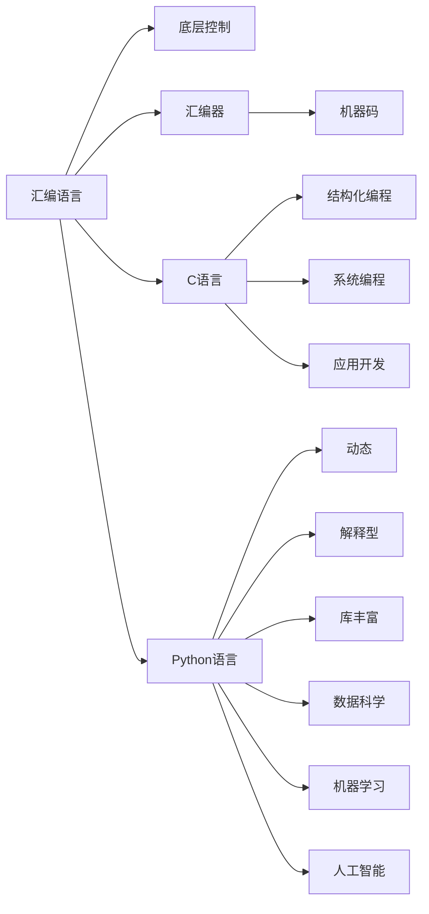

                 

# 汇编、C、Python：AI开发的语言基础

> 关键词：汇编语言, C语言, Python, AI, 编程基础

## 1. 背景介绍

### 1.1 问题由来
随着人工智能(AI)技术的迅猛发展，越来越多的开发者和研究者选择将AI技术应用于实际项目中。然而，对于这些开发者来说，掌握AI编程所需的基础知识，特别是编程语言的基础，是一项重要的挑战。汇编语言、C语言和Python是AI开发中最常用的三种编程语言。然而，由于它们的特性各不相同，初学者往往难以区分它们在AI开发中的作用和应用场景。

### 1.2 问题核心关键点
本文旨在通过详细讲解汇编语言、C语言和Python的特点和在AI开发中的应用，帮助读者理解它们在AI编程中的不同角色和重要性。文章将从语言基础、高级特性、应用场景等多个角度进行深入探讨，并给出一些实践建议，以指导开发者在AI开发中更高效地选择和应用这些语言。

## 2. 核心概念与联系

### 2.1 核心概念概述

- **汇编语言(Assembler)**：一种低级编程语言，直接操作计算机硬件的指令集。它几乎是最接近机器语言的编程语言，能够对计算机的底层进行精确控制。
- **C语言(C)**：一种高级编程语言，具有结构化编程的特点，广泛用于系统编程和应用开发。
- **Python语言(Python)**：一种动态、解释型的高级编程语言，具有简洁易学、库丰富等优点，广泛用于数据科学、机器学习和人工智能等领域。

### 2.2 核心概念原理和架构的 Mermaid 流程图



这个流程图展示了汇编语言、C语言和Python语言之间的联系和区别。汇编语言主要用于底层控制，C语言用于结构化编程、系统编程和应用开发，而Python语言则适用于动态编程、解释型执行、丰富的库支持以及数据科学、机器学习和人工智能等多个领域。

## 3. 核心算法原理 & 具体操作步骤

### 3.1 算法原理概述

在AI开发中，汇编语言、C语言和Python各自扮演着不同的角色。汇编语言主要用于系统编程和底层控制，C语言则用于系统级应用和高效算法实现，而Python则广泛用于数据处理、模型训练和机器学习等高层任务。

### 3.2 算法步骤详解

#### 3.2.1 汇编语言
- **编译过程**：汇编语言需要经过汇编器(Asembler)编译为机器码，才能在计算机上运行。汇编器将汇编代码翻译成二进制指令，交由计算机执行。
- **应用场景**：由于汇编语言可以直接操作计算机硬件，它在系统编程、嵌入式开发和实时控制系统等需要高效、精确控制的领域应用广泛。

#### 3.2.2 C语言
- **编译过程**：C语言通过编译器(Compiler)编译为机器码。编译器将C代码翻译成汇编代码，再由汇编器生成机器码。
- **应用场景**：C语言具有结构化编程的特性，适用于需要高效计算和内存管理的系统级应用，如操作系统、驱动程序、游戏引擎等。

#### 3.2.3 Python语言
- **解释过程**：Python是一种解释型语言，无需编译，直接通过解释器(Interpreter)运行。解释器将Python代码解释为机器码，由计算机执行。
- **应用场景**：Python库丰富，适用于数据科学、机器学习、自然语言处理等需要快速原型开发和高级库支持的高层任务。

### 3.3 算法优缺点

#### 3.3.1 汇编语言
- **优点**：汇编语言能够直接操作硬件，执行效率高，控制精确。
- **缺点**：编程复杂度高，易出错，可读性差，维护困难。

#### 3.3.2 C语言
- **优点**：结构化编程，执行效率高，灵活性大。
- **缺点**：语法复杂，编程难度大，需要丰富的系统编程知识。

#### 3.3.3 Python语言
- **优点**：语法简洁，易学易用，库支持丰富。
- **缺点**：执行效率较低，不适合需要高效计算和内存管理的底层任务。

### 3.4 算法应用领域

- **汇编语言**：主要用于系统编程、底层控制、实时系统、嵌入式开发等领域。
- **C语言**：广泛用于系统编程、高效算法实现、游戏引擎、操作系统、驱动程序等底层应用。
- **Python语言**：适用于数据科学、机器学习、自然语言处理、Web开发、科学计算等高层任务。

## 4. 数学模型和公式 & 详细讲解

### 4.1 数学模型构建

- **汇编语言**：主要用于低层次的算法实现，不涉及复杂的数学模型。
- **C语言**：在数学模型实现中，C语言通常用于高效算法的实现，如线性代数、数值计算等。
- **Python语言**：在数学模型实现中，Python通常用于快速原型开发和高级库的支持，如NumPy、SciPy、TensorFlow等。

### 4.2 公式推导过程

由于汇编语言和C语言主要用于底层控制和系统编程，不涉及复杂的数学模型推导。而Python语言在数学模型推导中则发挥了重要作用。以下是Python中常用的数学模型推导示例：

$$
\begin{align*}
y &= wx + b \\
\nabla_w L &= x^T y \\
\nabla_b L &= \frac{1}{m} \sum_{i=1}^m y_i
\end{align*}
$$

上述公式展示了线性回归模型在Python中的实现，其中 $w$ 和 $b$ 为模型参数，$x$ 和 $y$ 为输入和输出，$m$ 为样本数。

### 4.3 案例分析与讲解

在实际应用中，Python通常用于机器学习模型的构建和训练。以下是一个简单的线性回归模型训练示例：

```python
import numpy as np
from sklearn.linear_model import LinearRegression

# 构建训练数据
x = np.array([[1, 2], [3, 4], [5, 6]])
y = np.array([2, 4, 6])

# 构建模型
model = LinearRegression()
model.fit(x, y)

# 预测新样本
x_new = np.array([[7, 8]])
y_pred = model.predict(x_new)
print(y_pred)
```

## 5. 项目实践：代码实例和详细解释说明

### 5.1 开发环境搭建

为了在AI开发中高效使用汇编语言、C语言和Python，需要准备相应的开发环境。以下是搭建环境的步骤：

#### 5.1.1 汇编语言
- **安装MinGW**：MinGW提供了Windows平台下的汇编编译工具，支持多种汇编语言。
- **安装NASM**：NASM是流行的汇编器，可以从官网下载并配置到系统路径中。
- **编写汇编程序**：使用NASM编写汇编代码，并通过MinGW编译为可执行文件。

#### 5.1.2 C语言
- **安装MinGW-w64**：MinGW-w64提供了Windows平台下的C编译工具，支持多种C语言标准。
- **安装GCC**：GCC是流行的C编译器，可以从官网下载并配置到系统路径中。
- **编写C程序**：使用GCC编译C代码，生成可执行文件或库文件。

#### 5.1.3 Python语言
- **安装Anaconda**：Anaconda是一个科学计算的Python发行版，包含了大量常用的库和工具。
- **安装Python**：从Anaconda官网下载Python安装程序，进行安装。
- **编写Python程序**：使用Python解释器运行代码，或通过Anaconda管理工具安装库和依赖。

### 5.2 源代码详细实现

#### 5.2.1 汇编语言
以下是一个简单的汇编程序示例，用于计算两个整数的和：

```assembly
section .data
    num1 db 10
    num2 db 20
    sum db ?

section .text
    global _start
_start:
    mov al, [num1] ; 将num1的值存入al寄存器
    add al, [num2] ; 将num2的值加到al寄存器
    mov [sum], al ; 将al寄存器的值存入sum变量
    mov eax, 1 ; 设置syscall编号为1
    int 0x80 ; 执行syscall
```

#### 5.2.2 C语言
以下是一个简单的C程序示例，用于计算两个整数的和：

```c
#include <stdio.h>

int main() {
    int num1 = 10, num2 = 20, sum;
    sum = num1 + num2;
    printf("Sum: %d\n", sum);
    return 0;
}
```

#### 5.2.3 Python语言
以下是一个简单的Python程序示例，用于计算两个整数的和：

```python
num1 = 10
num2 = 20
sum = num1 + num2
print("Sum:", sum)
```

### 5.3 代码解读与分析

- **汇编语言**：汇编语言虽然直接操作硬件，但代码编写和调试难度较大。需要掌握CPU指令集、内存管理等底层知识。
- **C语言**：C语言具有结构化编程的特性，适用于需要高效计算和内存管理的底层任务。语法复杂，但执行效率高。
- **Python语言**：Python语言简洁易学，库支持丰富。适用于快速原型开发和高层任务的实现。

### 5.4 运行结果展示

- **汇编语言**：生成的可执行文件可以直接在操作系统中运行，执行效率高。
- **C语言**：生成的可执行文件可以在操作系统中运行，执行效率高。
- **Python语言**：生成的代码可以在Python解释器中执行，执行效率较低，但易于调试和维护。

## 6. 实际应用场景

### 6.1 汇编语言
- **系统编程**：操作系统、驱动程序等系统级应用。
- **实时控制**：嵌入式系统、工业控制等实时控制场景。
- **高性能计算**：需要高效计算和高精度控制的科学计算和工程应用。

### 6.2 C语言
- **系统编程**：操作系统、网络协议栈等系统级应用。
- **高效算法实现**：图像处理、音频处理、机器学习等需要高性能计算的领域。
- **游戏引擎**：游戏引擎、图形渲染等图形处理场景。

### 6.3 Python语言
- **数据科学**：数据收集、清洗、分析等数据科学任务。
- **机器学习**：模型训练、预测、调优等机器学习任务。
- **自然语言处理**：文本处理、语言模型训练、情感分析等自然语言处理任务。

## 7. 工具和资源推荐

### 7.1 学习资源推荐

- **《汇编语言》**：详细讲解汇编语言的基本概念、指令集和应用场景。
- **《C语言程序设计》**：系统介绍C语言的基本语法、数据类型、控制结构等。
- **《Python编程：从入门到实践》**：介绍了Python语言的基本语法、库和应用场景。

### 7.2 开发工具推荐

- **MinGW**：提供Windows平台下的汇编编译工具。
- **MinGW-w64**：提供Windows平台下的C编译工具。
- **Anaconda**：科学计算的Python发行版，包含了大量常用的库和工具。
- **Visual Studio**：提供C/C++和Python的开发环境。
- **PyCharm**：Python语言的最佳开发环境，支持丰富的功能和插件。

### 7.3 相关论文推荐

- **《机器学习中汇编语言的优化与实现》**：讨论了机器学习中汇编语言的应用和优化。
- **《C语言编程：理论与实践》**：系统介绍C语言的基本概念和应用场景。
- **《Python语言编程》**：详细讲解Python语言的基本语法和应用场景。

## 8. 总结：未来发展趋势与挑战

### 8.1 总结

本文通过详细讲解汇编语言、C语言和Python在AI开发中的应用，帮助读者理解这些语言在AI编程中的不同角色和重要性。汇编语言主要用于底层控制和系统编程，C语言适用于系统级应用和高效算法实现，而Python则适用于数据科学、机器学习和自然语言处理等高层任务的实现。这些语言在AI开发中各司其职，共同推动了AI技术的不断进步。

### 8.2 未来发展趋势

- **汇编语言**：在嵌入式系统和实时控制领域，汇编语言仍具有不可替代的地位。未来将更加注重汇编语言的高级特性和优化技术。
- **C语言**：在高效计算和系统编程领域，C语言将继续发挥重要作用。未来将进一步提升C语言在图形处理和游戏引擎等领域的地位。
- **Python语言**：在数据科学和机器学习领域，Python语言将继续引领潮流。未来将进一步发展Python的库支持和应用场景。

### 8.3 面临的挑战

- **汇编语言**：编程难度大，易出错，可读性差，维护困难。
- **C语言**：语法复杂，编程难度大，需要丰富的系统编程知识。
- **Python语言**：执行效率较低，不适合需要高效计算和内存管理的底层任务。

### 8.4 研究展望

- **汇编语言**：提升汇编语言的高级特性和优化技术，增强其灵活性和可维护性。
- **C语言**：进一步发展C语言在图形处理和游戏引擎等领域的地位，提升其执行效率和编程便利性。
- **Python语言**：发展Python的库支持和应用场景，提升其执行效率和编程便利性。

## 9. 附录：常见问题与解答

**Q1：汇编语言、C语言和Python各自在AI开发中的作用是什么？**

A: 汇编语言主要用于底层控制和系统编程，C语言适用于系统级应用和高效算法实现，而Python则适用于数据科学、机器学习和自然语言处理等高层任务的实现。

**Q2：如何选择合适的编程语言？**

A: 根据任务需求和应用场景选择合适的编程语言。汇编语言适用于底层控制和系统编程，C语言适用于系统级应用和高效算法实现，而Python则适用于数据科学、机器学习和自然语言处理等高层任务的实现。

**Q3：如何提高AI开发的效率？**

A: 选择合适的编程语言和工具，充分利用已有库和框架，避免重复造轮子。同时，注重代码可读性和维护性，提高开发效率。

**Q4：汇编语言、C语言和Python在AI开发中各自的优势和劣势是什么？**

A: 汇编语言优势在于执行效率高，直接操作硬件；劣势在于编程难度大，可读性差。C语言优势在于结构化编程，执行效率高；劣势在于语法复杂，编程难度大。Python语言优势在于语法简洁，库支持丰富；劣势在于执行效率较低，不适合底层任务。

**Q5：如何学习汇编语言、C语言和Python？**

A: 通过阅读经典教材、观看视频教程、参与开源项目等方式学习。同时，注重实践和代码实现，通过实际项目提升编程技能。

---

作者：禅与计算机程序设计艺术 / Zen and the Art of Computer Programming

