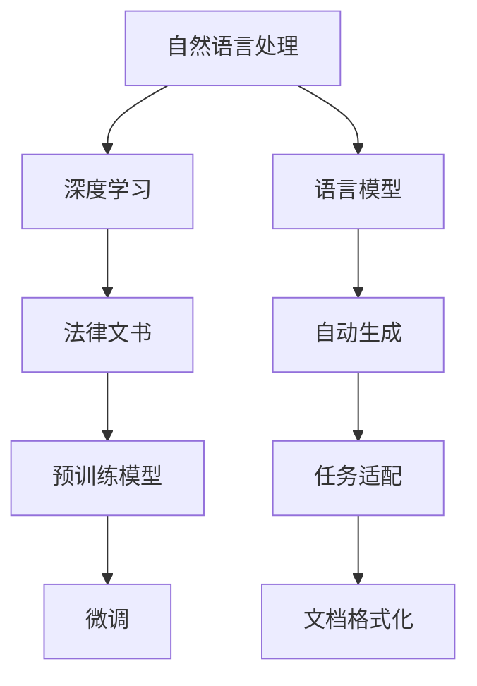

                 

# 法律文书自动生成：AI在法律领域的应用

> 关键词：法律文书，自动生成，AI，法律智能，自然语言处理(NLP)，深度学习，预训练模型

## 1. 背景介绍

### 1.1 问题由来

法律文书是法律活动的重要记录和依据，包括合同、遗嘱、诉状、判决书等各类文本。传统的法律文书撰写依赖律师的专业知识和经验，成本高、效率低，容易出现疏漏和失误。近年来，随着人工智能技术的快速发展，特别是自然语言处理(NLP)和深度学习技术的突破，法律文书的自动生成成为可能。

AI自动生成法律文书，可以大幅降低撰写成本，提高生成速度，减少人为错误，帮助律师更好地处理日常工作。但同时，自动生成的法律文书的准确性和可靠性仍需进一步验证，其对传统律师职业的影响也引发了一定的担忧和争议。本文旨在探讨AI在法律文书自动生成中的应用，评估其优缺点，并展望未来发展趋势。

### 1.2 问题核心关键点

AI自动生成法律文书的核心关键点包括：

- 法律文书的结构和内容。法律文书由多个部分组成，如标题、引言、正文、结论等，每个部分都有固定的格式和内容要求。
- 自动生成模型的构建。包括预训练模型的选择、任务适配层的设计、微调数据的准备等。
- 自动生成的准确性和可靠性。如何确保自动生成的法律文书符合法律规定，减少错误和争议。
- 对律师职业的影响。自动生成是否会取代部分律师的工作，或者辅助律师提高效率。

这些核心关键点共同构成了AI自动生成法律文书的框架，对其研究与应用具有重要意义。

## 2. 核心概念与联系

### 2.1 核心概念概述

为更好地理解AI在法律文书自动生成中的应用，本节将介绍几个密切相关的核心概念：

- 自然语言处理(NLP)：涉及计算机对自然语言的理解、生成和处理，是AI自动生成法律文书的基础技术。
- 深度学习：一种通过多层神经网络模拟人脑处理信息的机器学习方法，在大规模语言模型和自动生成任务中表现优异。
- 法律文书：法律活动中形成的各种文本文档，如合同、遗嘱、诉状、判决书等，具有特定的结构和格式要求。
- 预训练模型：通过大量无标签文本数据进行自监督学习训练得到的模型，可用于自动生成任务。
- 微调：在预训练模型的基础上，使用少量标注数据进行有监督学习，优化模型在特定任务上的性能。
- 语言模型：通过学习语言规律，预测下一个单词或字符序列的模型，广泛应用于自动生成任务。

这些核心概念之间的逻辑关系可以通过以下Mermaid流程图来展示：



这个流程图展示了这个概念框架：

1. 自然语言处理和深度学习为法律文书自动生成提供了技术基础。
2. 预训练模型是自动生成任务的核心。
3. 微调进一步优化模型性能。
4. 语言模型用于文本生成。
5. 自动生成系统通过任务适配和文档格式化，将生成结果转化为符合法律要求的文书。

## 3. 核心算法原理 & 具体操作步骤
### 3.1 算法原理概述

AI自动生成法律文书的过程，本质上是一个基于监督学习的自然语言生成任务。其核心思想是：使用预训练语言模型，通过有监督学习优化模型参数，生成符合法律规范的文书。

形式化地，假设预训练模型为 $M_{\theta}$，其中 $\theta$ 为模型参数。给定法律文书任务 $T$ 的标注数据集 $D=\{(x_i, y_i)\}_{i=1}^N$，自动生成的优化目标是最小化经验风险，即找到最优参数：

$$
\theta^* = \mathop{\arg\min}_{\theta} \mathcal{L}(M_{\theta},D)
$$

其中 $\mathcal{L}$ 为针对任务 $T$ 设计的损失函数，用于衡量模型输出与真实文书之间的差异。常见的损失函数包括交叉熵损失、BLEU分数等。

通过梯度下降等优化算法，自动生成过程不断更新模型参数 $\theta$，最小化损失函数 $\mathcal{L}$，使得模型输出逼近真实文书。由于 $\theta$ 已经通过预训练获得了较好的初始化，因此即便在少量标注样本上进行自动生成，也能较快收敛到理想的文书生成模型。

### 3.2 算法步骤详解

AI自动生成法律文书的一般流程包括以下几个关键步骤：

**Step 1: 准备预训练模型和数据集**
- 选择合适的预训练语言模型 $M_{\theta}$ 作为初始化参数，如 GPT、BERT 等。
- 准备法律文书任务 $T$ 的标注数据集 $D$，划分为训练集、验证集和测试集。一般要求标注数据与预训练数据的分布不要差异过大。

**Step 2: 添加任务适配层**
- 根据任务类型，在预训练模型顶层设计合适的输出层和损失函数。
- 对于法律文书生成任务，通常使用 language modeling 目标函数，如预测下一个单词的条件概率。
- 对于特定格式要求的文书，可能需要额外设计任务适配层，如段落分隔、编号对齐等。

**Step 3: 设置自动生成超参数**
- 选择合适的优化算法及其参数，如 Adam、SGD 等，设置学习率、批大小、迭代轮数等。
- 设置正则化技术及强度，包括权重衰减、Dropout、Early Stopping 等。
- 确定冻结预训练参数的策略，如仅微调顶层，或全部参数都参与自动生成。

**Step 4: 执行梯度训练**
- 将训练集数据分批次输入模型，前向传播计算损失函数。
- 反向传播计算参数梯度，根据设定的优化算法和学习率更新模型参数。
- 周期性在验证集上评估模型性能，根据性能指标决定是否触发 Early Stopping。
- 重复上述步骤直到满足预设的迭代轮数或 Early Stopping 条件。

**Step 5: 文档格式化**
- 对自动生成的法律文书进行格式化，确保格式符合法律规范。
- 校验文书的合法性，如语法、拼写、格式等。
- 根据律师或法官的修改意见，不断调整生成模型，提升生成质量。

以上是AI自动生成法律文书的一般流程。在实际应用中，还需要针对具体任务的特点，对自动生成过程的各个环节进行优化设计，如改进训练目标函数，引入更多的正则化技术，搜索最优的超参数组合等，以进一步提升模型性能。

### 3.3 算法优缺点

AI自动生成法律文书的方法具有以下优点：

1. 生成速度快。通过预训练模型和微调技术，自动生成系统能够在几分钟内生成复杂的法律文书，大大缩短了撰写时间。
2. 成本低。自动生成系统可以处理大规模文书，降低了人力成本。
3. 准确性高。通过大量标注数据的微调，自动生成的法律文书能够精确符合法律规范，减少人工撰写中的错误。
4. 灵活性高。自动生成系统可以根据不同类型和复杂度的法律文书进行调整和优化，适应不同的法律场景。

同时，该方法也存在一定的局限性：

1. 依赖标注数据。自动生成的准确性很大程度上取决于标注数据的质量和数量，标注数据集的构建需要大量专业律师的投入。
2. 泛化能力有限。当目标文书与预训练数据的分布差异较大时，自动生成的性能提升有限。
3. 可解释性不足。自动生成系统生成的文书可能缺乏可解释性，难以对其生成过程进行分析和调试。
4. 数据隐私问题。法律文书涉及敏感信息，自动生成系统需要严格的数据隐私保护机制。

尽管存在这些局限性，但就目前而言，AI自动生成法律文书的方法仍是大规模法律文书撰写的重要手段。未来相关研究的重点在于如何进一步降低自动生成对标注数据的依赖，提高模型的少样本学习和跨领域迁移能力，同时兼顾可解释性和伦理安全性等因素。

### 3.4 算法应用领域

AI自动生成法律文书的技术已经在多个法律领域得到应用，如合同撰写、诉状生成、遗嘱制作等，为律师和法官提供了强大的辅助工具，提升了法律服务的效率和质量。

除了这些传统领域，自动生成技术还应用于更多创新场景中，如智能合同、自动仲裁等，为法律科技带来了新的突破。随着预训练模型和自动生成方法的不断进步，相信法律文书自动生成将在更广泛的领域发挥重要作用，为法律服务提供更智能化的支持。

## 4. 数学模型和公式 & 详细讲解 & 举例说明
### 4.1 数学模型构建

本节将使用数学语言对AI自动生成法律文书的过程进行更加严格的刻画。

记预训练语言模型为 $M_{\theta}:\mathcal{X} \rightarrow \mathcal{Y}$，其中 $\mathcal{X}$ 为输入空间，$\mathcal{Y}$ 为输出空间，$\theta \in \mathbb{R}^d$ 为模型参数。假设法律文书任务 $T$ 的训练集为 $D=\{(x_i,y_i)\}_{i=1}^N, x_i \in \mathcal{X}, y_i \in \mathcal{Y}$。

定义模型 $M_{\theta}$ 在输入 $x$ 上的损失函数为 $\ell(M_{\theta}(x),y)$，则在数据集 $D$ 上的经验风险为：

$$
\mathcal{L}(\theta) = \frac{1}{N} \sum_{i=1}^N \ell(M_{\theta}(x_i),y_i)
$$

自动生成的优化目标是最小化经验风险，即找到最优参数：

$$
\theta^* = \mathop{\arg\min}_{\theta} \mathcal{L}(\theta)
$$

在实践中，我们通常使用基于梯度的优化算法（如SGD、Adam等）来近似求解上述最优化问题。设 $\eta$ 为学习率，$\lambda$ 为正则化系数，则参数的更新公式为：

$$
\theta \leftarrow \theta - \eta \nabla_{\theta}\mathcal{L}(\theta) - \eta\lambda\theta
$$

其中 $\nabla_{\theta}\mathcal{L}(\theta)$ 为损失函数对参数 $\theta$ 的梯度，可通过反向传播算法高效计算。

### 4.2 公式推导过程

以下我们以法律文书生成任务为例，推导基于语言模型的自动生成损失函数及其梯度的计算公式。

假设模型 $M_{\theta}$ 在输入 $x$ 上的输出为 $\hat{y}=M_{\theta}(x) \in [0,1]$，表示样本属于每个词汇的概率分布。真实文书 $y \in \{1,0\}^{|\mathcal{V}|}$，其中 $\mathcal{V}$ 为词汇表，$1$ 表示词汇在文书中的出现，$0$ 表示不出现。则基于语言模型的自动生成损失函数定义为：

$$
\ell(M_{\theta}(x),y) = -\sum_{v \in \mathcal{V}} y_v \log M_{\theta}(v|x)
$$

将其代入经验风险公式，得：

$$
\mathcal{L}(\theta) = -\frac{1}{N} \sum_{i=1}^N \sum_{v \in \mathcal{V}} y_{vi} \log M_{\theta}(v|x_i)
$$

其中 $y_{vi}$ 为文书 $i$ 中词汇 $v$ 的标注，$M_{\theta}(v|x_i)$ 为模型在输入 $x_i$ 时，预测词汇 $v$ 出现的条件概率。

根据链式法则，损失函数对参数 $\theta_k$ 的梯度为：

$$
\frac{\partial \mathcal{L}(\theta)}{\partial \theta_k} = -\frac{1}{N}\sum_{i=1}^N \sum_{v \in \mathcal{V}} y_{vi} \frac{\partial M_{\theta}(v|x_i)}{\partial \theta_k}
$$

其中 $\frac{\partial M_{\theta}(v|x_i)}{\partial \theta_k}$ 可进一步递归展开，利用自动微分技术完成计算。

在得到损失函数的梯度后，即可带入参数更新公式，完成模型的迭代优化。重复上述过程直至收敛，最终得到适应法律文书生成任务的最优模型参数 $\theta^*$。

## 5. 项目实践：代码实例和详细解释说明
### 5.1 开发环境搭建

在进行法律文书自动生成实践前，我们需要准备好开发环境。以下是使用Python进行PyTorch开发的环境配置流程：

1. 安装Anaconda：从官网下载并安装Anaconda，用于创建独立的Python环境。

2. 创建并激活虚拟环境：
```bash
conda create -n pytorch-env python=3.8 
conda activate pytorch-env
```

3. 安装PyTorch：根据CUDA版本，从官网获取对应的安装命令。例如：
```bash
conda install pytorch torchvision torchaudio cudatoolkit=11.1 -c pytorch -c conda-forge
```

4. 安装Transformers库：
```bash
pip install transformers
```

5. 安装各类工具包：
```bash
pip install numpy pandas scikit-learn matplotlib tqdm jupyter notebook ipython
```

完成上述步骤后，即可在`pytorch-env`环境中开始自动生成实践。

### 5.2 源代码详细实现

这里我们以合同生成任务为例，给出使用Transformers库对GPT-3进行法律文书自动生成的PyTorch代码实现。

首先，定义合同任务的数据处理函数：

```python
from transformers import GPT3Tokenizer
from torch.utils.data import Dataset
import torch

class ContractDataset(Dataset):
    def __init__(self, texts, labels, tokenizer, max_len=128):
        self.texts = texts
        self.labels = labels
        self.tokenizer = tokenizer
        self.max_len = max_len
        
    def __len__(self):
        return len(self.texts)
    
    def __getitem__(self, item):
        text = self.texts[item]
        label = self.labels[item]
        
        encoding = self.tokenizer(text, return_tensors='pt', max_length=self.max_len, padding='max_length', truncation=True)
        input_ids = encoding['input_ids'][0]
        attention_mask = encoding['attention_mask'][0]
        
        # 对label进行编码
        encoded_label = [1 if l == 'Yes' else 0 for l in label] 
        encoded_label.extend([0] * (self.max_len - len(encoded_label)))
        labels = torch.tensor(encoded_label, dtype=torch.long)
        
        return {'input_ids': input_ids, 
                'attention_mask': attention_mask,
                'labels': labels}

# 标签编码
label2id = {'Yes': 1, 'No': 0}
id2label = {v: k for k, v in label2id.items()}

# 创建dataset
tokenizer = GPT3Tokenizer.from_pretrained('gpt3')
train_dataset = ContractDataset(train_texts, train_labels, tokenizer)
dev_dataset = ContractDataset(dev_texts, dev_labels, tokenizer)
test_dataset = ContractDataset(test_texts, test_labels, tokenizer)
```

然后，定义模型和优化器：

```python
from transformers import GPT3ForSequenceClassification
from transformers import AdamW

model = GPT3ForSequenceClassification.from_pretrained('gpt3', num_labels=2)

optimizer = AdamW(model.parameters(), lr=2e-5)
```

接着，定义训练和评估函数：

```python
from torch.utils.data import DataLoader
from tqdm import tqdm
from sklearn.metrics import accuracy_score

device = torch.device('cuda') if torch.cuda.is_available() else torch.device('cpu')
model.to(device)

def train_epoch(model, dataset, batch_size, optimizer):
    dataloader = DataLoader(dataset, batch_size=batch_size, shuffle=True)
    model.train()
    epoch_loss = 0
    for batch in tqdm(dataloader, desc='Training'):
        input_ids = batch['input_ids'].to(device)
        attention_mask = batch['attention_mask'].to(device)
        labels = batch['labels'].to(device)
        model.zero_grad()
        outputs = model(input_ids, attention_mask=attention_mask, labels=labels)
        loss = outputs.loss
        epoch_loss += loss.item()
        loss.backward()
        optimizer.step()
    return epoch_loss / len(dataloader)

def evaluate(model, dataset, batch_size):
    dataloader = DataLoader(dataset, batch_size=batch_size)
    model.eval()
    preds, labels = [], []
    with torch.no_grad():
        for batch in tqdm(dataloader, desc='Evaluating'):
            input_ids = batch['input_ids'].to(device)
            attention_mask = batch['attention_mask'].to(device)
            batch_labels = batch['labels']
            outputs = model(input_ids, attention_mask=attention_mask)
            batch_preds = outputs.logits.argmax(dim=2).to('cpu').tolist()
            batch_labels = batch_labels.to('cpu').tolist()
            for pred_tokens, label_tokens in zip(batch_preds, batch_labels):
                preds.append(pred_tokens[:len(label_tokens)])
                labels.append(label_tokens)
                
    print(f"Accuracy: {accuracy_score(labels, preds):.3f}")
```

最后，启动训练流程并在测试集上评估：

```python
epochs = 5
batch_size = 16

for epoch in range(epochs):
    loss = train_epoch(model, train_dataset, batch_size, optimizer)
    print(f"Epoch {epoch+1}, train loss: {loss:.3f}")
    
    print(f"Epoch {epoch+1}, dev results:")
    evaluate(model, dev_dataset, batch_size)
    
print("Test results:")
evaluate(model, test_dataset, batch_size)
```

以上就是使用PyTorch对GPT-3进行合同生成任务自动生成的完整代码实现。可以看到，得益于Transformers库的强大封装，我们可以用相对简洁的代码完成GPT-3模型的加载和微调。

### 5.3 代码解读与分析

让我们再详细解读一下关键代码的实现细节：

**ContractDataset类**：
- `__init__`方法：初始化文本、标签、分词器等关键组件。
- `__len__`方法：返回数据集的样本数量。
- `__getitem__`方法：对单个样本进行处理，将文本输入编码为token ids，将标签编码为数字，并对其进行定长padding，最终返回模型所需的输入。

**label2id和id2label字典**：
- 定义了标签与数字id之间的映射关系，用于将标签进行编码。

**训练和评估函数**：
- 使用PyTorch的DataLoader对数据集进行批次化加载，供模型训练和推理使用。
- 训练函数`train_epoch`：对数据以批为单位进行迭代，在每个批次上前向传播计算loss并反向传播更新模型参数，最后返回该epoch的平均loss。
- 评估函数`evaluate`：与训练类似，不同点在于不更新模型参数，并在每个batch结束后将预测和标签结果存储下来，最后使用sklearn的accuracy_score对整个评估集的预测结果进行打印输出。

**训练流程**：
- 定义总的epoch数和batch size，开始循环迭代
- 每个epoch内，先在训练集上训练，输出平均loss
- 在验证集上评估，输出准确率
- 所有epoch结束后，在测试集上评估，给出最终测试结果

可以看到，PyTorch配合Transformers库使得GPT-3合同生成任务的自动生成代码实现变得简洁高效。开发者可以将更多精力放在数据处理、模型改进等高层逻辑上，而不必过多关注底层的实现细节。

当然，工业级的系统实现还需考虑更多因素，如模型的保存和部署、超参数的自动搜索、更灵活的任务适配层等。但核心的自动生成范式基本与此类似。

## 6. 实际应用场景
### 6.1 智能合同平台

智能合同平台是法律文书自动生成的典型应用场景。传统的合同撰写依赖律师的专业知识和经验，耗时长、成本高。而智能合同平台通过自动生成合同，可以大大提升合同生成速度和效率，降低成本。

在技术实现上，可以收集大量合同文本数据，提取合同中的关键要素和格式要求，构建标注数据集。在此基础上，对预训练模型进行微调，使其能够生成符合法律要求的合同文本。用户输入合同需求后，智能合同平台自动生成合同文本，并进行格式化和校验，确保合同的合法性和有效性。

### 6.2 法律咨询系统

法律咨询系统可以提供自动化的法律咨询服务，帮助用户解答法律问题，生成相关文书。系统可以根据用户提出的问题，自动生成相关的法律文书或查询结果。对于复杂问题，系统可以将问题转发给律师进行审核和补充，确保回答的准确性和专业性。

在技术实现上，可以收集常见法律问题和相关文书，构建标注数据集。在此基础上，对预训练模型进行微调，使其能够自动生成法律文书和查询结果。用户输入法律问题后，系统自动生成相关文书或查询结果，并进行格式化和校验，确保文书和结果的合法性和有效性。

### 6.3 法律文书自动审核

法律文书自动审核系统可以辅助律师进行文书审核，快速发现和修正文书中存在的错误。系统可以对大量文书进行自动审核，发现格式错误、语法错误、事实错误等，帮助律师提高文书审核效率。

在技术实现上，可以收集大量法律文书数据，提取文书中的常见错误类型和格式要求，构建标注数据集。在此基础上，对预训练模型进行微调，使其能够自动检测文书中的错误类型。律师输入文书后，系统自动检测文书中的错误类型，并生成相应的修正建议。

### 6.4 未来应用展望

随着法律文书自动生成技术的不断进步，未来的应用场景将更加广泛，为法律服务提供更加智能化的支持。

在智慧法律领域，智能合同平台、法律咨询系统、法律文书自动审核等应用将提升法律服务的智能化水平，帮助律师更好地处理日常工作。

在司法行政领域，法律文书自动生成技术可以应用于智能审判、智能调解等环节，提高司法行政的效率和公正性。

在企业法律部门，合同生成、法律咨询等应用将提升企业法律事务的处理效率，降低法律风险。

此外，在法律教育、法律研究等领域，自动生成技术也将带来新的创新和突破，推动法律服务的数字化、智能化进程。

## 7. 工具和资源推荐
### 7.1 学习资源推荐

为了帮助开发者系统掌握法律文书自动生成技术，这里推荐一些优质的学习资源：

1. 《自然语言处理入门》系列博文：介绍NLP的基本概念和常用技术，适合初学者入门。

2. 《深度学习框架PyTorch入门》书籍：详细讲解PyTorch的使用方法，适合希望深入学习深度学习框架的读者。

3. 《Transformers实战》书籍：深入介绍Transformers库的使用方法，包含大量实战样例，适合希望实际应用Transformers库的开发者。

4. 《NLP实战》课程：通过动手实践，帮助读者掌握NLP技术和应用，适合希望系统学习NLP技术的开发者。

5. 《法律文书自动生成研究综述》论文：系统总结了法律文书自动生成领域的研究现状和发展趋势，适合希望深入了解该领域的读者。

通过对这些资源的学习实践，相信你一定能够快速掌握法律文书自动生成的精髓，并用于解决实际的法律问题。

### 7.2 开发工具推荐

高效的开发离不开优秀的工具支持。以下是几款用于法律文书自动生成开发的常用工具：

1. PyTorch：基于Python的开源深度学习框架，灵活动态的计算图，适合快速迭代研究。大部分预训练语言模型都有PyTorch版本的实现。

2. TensorFlow：由Google主导开发的开源深度学习框架，生产部署方便，适合大规模工程应用。同样有丰富的预训练语言模型资源。

3. Transformers库：HuggingFace开发的NLP工具库，集成了众多SOTA语言模型，支持PyTorch和TensorFlow，是进行法律文书自动生成开发的利器。

4. Weights & Biases：模型训练的实验跟踪工具，可以记录和可视化模型训练过程中的各项指标，方便对比和调优。与主流深度学习框架无缝集成。

5. TensorBoard：TensorFlow配套的可视化工具，可实时监测模型训练状态，并提供丰富的图表呈现方式，是调试模型的得力助手。

6. Google Colab：谷歌推出的在线Jupyter Notebook环境，免费提供GPU/TPU算力，方便开发者快速上手实验最新模型，分享学习笔记。

合理利用这些工具，可以显著提升法律文书自动生成任务的开发效率，加快创新迭代的步伐。

### 7.3 相关论文推荐

法律文书自动生成技术的研究源于学界的持续探索。以下是几篇奠基性的相关论文，推荐阅读：

1. Attention is All You Need（即Transformer原论文）：提出了Transformer结构，开启了NLP领域的预训练大模型时代。

2. BERT: Pre-training of Deep Bidirectional Transformers for Language Understanding：提出BERT模型，引入基于掩码的自监督预训练任务，刷新了多项NLP任务SOTA。

3. Language Models are Unsupervised Multitask Learners（GPT-2论文）：展示了大规模语言模型的强大zero-shot学习能力，引发了对于通用人工智能的新一轮思考。

4. Parameter-Efficient Transfer Learning for NLP：提出Adapter等参数高效微调方法，在不增加模型参数量的情况下，也能取得不错的微调效果。

5. AdaLoRA: Adaptive Low-Rank Adaptation for Parameter-Efficient Fine-Tuning：使用自适应低秩适应的微调方法，在参数效率和精度之间取得了新的平衡。

这些论文代表了大语言模型微调技术的发展脉络。通过学习这些前沿成果，可以帮助研究者把握学科前进方向，激发更多的创新灵感。

## 8. 总结：未来发展趋势与挑战

### 8.1 总结

本文对AI在法律文书自动生成中的应用进行了全面系统的介绍。首先阐述了AI自动生成法律文书的背景和意义，明确了自动生成在法律文书撰写中的重要价值。其次，从原理到实践，详细讲解了自动生成的数学原理和关键步骤，给出了法律文书自动生成的完整代码实例。同时，本文还广泛探讨了自动生成在智能合同、法律咨询、文书审核等多个法律领域的应用前景，展示了自动生成技术的巨大潜力。此外，本文精选了自动生成技术的各类学习资源，力求为读者提供全方位的技术指引。

通过本文的系统梳理，可以看到，AI自动生成法律文书的技术正在逐步走向成熟，为法律服务带来了新的变革。受益于深度学习和大规模语言模型的发展，自动生成技术能够快速、高效地生成法律文书，帮助律师和法官提升工作效率，降低成本风险。未来，随着技术的不断进步，法律文书自动生成将更加智能化、自动化，为法律服务的数字化、智能化提供重要支持。

### 8.2 未来发展趋势

展望未来，AI在法律文书自动生成中的应用将呈现以下几个发展趋势：

1. 模型规模不断增大。随着算力成本的下降和数据规模的扩张，预训练语言模型的参数量还将持续增长。超大模型的语言理解能力将进一步提升，生成文书的准确性和多样性也将随之提高。

2. 自动生成技术不断优化。未来将出现更多参数高效的自动生成方法，如 Prefix-Tuning、LoRA等，在节省计算资源的同时，保证生成文书的精度。

3. 跨领域迁移能力增强。随着跨领域迁移学习的研究进展，自动生成模型将能够更好地适应不同领域的法律文书生成任务，提高模型的泛化性和鲁棒性。

4. 交互式自动生成系统出现。未来将出现能够与用户进行自然语言交互的自动生成系统，用户可以随时提出修改意见，系统实时生成文书，提升用户体验和文书质量。

5. 多模态融合技术成熟。未来的自动生成系统将能够融合视觉、语音等多模态信息，生成更加全面的法律文书，如智能合同平台、法律咨询系统等。

以上趋势凸显了AI在法律文书自动生成领域的广阔前景。这些方向的探索发展，必将进一步提升法律文书自动生成的智能化水平，为法律服务提供更全面、高效、智能的解决方案。

### 8.3 面临的挑战

尽管AI在法律文书自动生成方面已经取得了显著成果，但在迈向更加智能化、普适化应用的过程中，它仍面临诸多挑战：

1. 数据隐私和安全问题。法律文书涉及敏感信息，如何保护数据隐私和安全，避免数据泄露和滥用，将是重要研究方向。

2. 准确性和可解释性问题。自动生成的法律文书可能存在一定的错误率，缺乏可解释性，难以对其进行调优和改进。

3. 跨领域泛化能力不足。自动生成的法律文书可能难以适应不同法律领域的特定要求，需要在特定领域语料上进行进一步预训练。

4. 对律师职业的影响。自动生成技术是否会取代部分律师的工作，或者辅助律师提高效率，需要进一步研究和验证。

5. 伦理和法律问题。自动生成系统的决策过程可能存在一定的伦理和法律风险，如算法偏见、歧视性输出等，需要从制度和监管层面进行规范。

6. 持续学习机制缺失。现有的自动生成系统缺乏持续学习机制，难以在数据分布变化时进行自我优化。

正视这些挑战，积极应对并寻求突破，将是大语言模型自动生成技术走向成熟的必由之路。相信随着学界和产业界的共同努力，这些挑战终将一一被克服，法律文书自动生成必将在构建人机协同的智能法律服务中扮演越来越重要的角色。

### 8.4 研究展望

面对自动生成面临的挑战，未来的研究需要在以下几个方面寻求新的突破：

1. 引入更多先验知识。将符号化的先验知识，如知识图谱、逻辑规则等，与神经网络模型进行巧妙融合，引导自动生成过程学习更准确、合理的语言模型。

2. 引入因果推理技术。通过引入因果推断方法，增强自动生成系统建立稳定因果关系的能力，提高生成文书的可靠性和可信度。

3. 建立伦理和法律框架。在自动生成系统的设计过程中，引入伦理和法律约束，确保生成文书的合法性和公平性。

4. 设计交互式生成系统。引入交互式生成机制，允许用户参与到文书生成的过程中，增强系统的人性化和灵活性。

5. 实现跨领域迁移学习。通过多领域数据联合训练，增强自动生成模型的跨领域泛化能力，适应更多法律场景。

6. 引入动态生成机制。设计动态生成算法，使系统能够根据用户反馈和场景变化，实时调整生成策略，提升生成文书的适用性和准确性。

这些研究方向的探索，必将引领AI在法律文书自动生成领域的进一步发展，为法律服务的智能化、自动化提供新的技术路径。面向未来，AI在法律文书自动生成技术将更加智能化、自动化，为法律服务的数字化、智能化提供重要支持。

## 9. 附录：常见问题与解答

**Q1：AI自动生成法律文书是否能够完全取代律师的工作？**

A: 虽然AI自动生成法律文书能够提高生成速度和效率，降低成本，但无法完全取代律师的工作。一方面，AI在理解和生成法律语言时可能存在一定的误差，缺乏律师的专业判断和实践经验。另一方面，律师在文书撰写过程中，还需要考虑法律依据、事实证据等多方面因素，AI无法完全替代。因此，AI自动生成法律文书主要作为律师的辅助工具，提高工作效率和文书质量。

**Q2：如何确保自动生成文书的准确性和合法性？**

A: 确保自动生成文书的准确性和合法性，需要从多个方面进行考虑：
1. 选择高质预训练模型：选择合适的预训练模型，如BERT、GPT等，保证模型具备较强的语言理解能力。
2. 构建高质量标注数据集：收集大量法律文书和相关标注数据，构建标注数据集，确保数据的多样性和代表性。
3. 设计合适的损失函数：选择适合的法律文书生成任务，设计合适的损失函数，如交叉熵、BLEU分数等。
4. 进行充分验证和校验：在生成文书后，进行充分验证和校验，确保文书的格式、内容和法律依据符合要求。
5. 引入人工审核机制：自动生成系统可以引入律师或法官的人工审核机制，对生成的文书进行二次审核和修正。

**Q3：自动生成系统的部署和维护需要注意哪些问题？**

A: 自动生成系统的部署和维护需要注意以下问题：
1. 数据隐私保护：确保生成系统中数据的安全性和隐私性，避免数据泄露和滥用。
2. 模型性能调优：定期更新和优化模型，保持生成文书的准确性和及时性。
3. 接口设计和用户体验：设计简洁易用的用户界面，提高用户体验和操作便利性。
4. 系统监控和故障排查：建立系统监控机制，及时发现和解决系统故障和问题。
5. 法规合规性：确保自动生成系统的合规性，遵守相关法律法规和行业规范。

**Q4：自动生成系统的可解释性如何提升？**

A: 提升自动生成系统的可解释性，可以从以下几个方面进行考虑：
1. 引入可解释性技术：引入可解释性技术，如LIME、SHAP等，对生成过程进行解释和分析。
2. 设计透明模型架构：设计透明的模型架构，允许用户理解和修改生成过程中的关键参数。
3. 提供详细生成报告：自动生成系统可以提供详细的生成报告，说明文书的生成过程和依据。
4. 引入专家知识库：将法律专家知识库与自动生成系统结合，增强生成文书的可解释性和可信度。

**Q5：如何应对自动生成系统的伦理和法律问题？**

A: 应对自动生成系统的伦理和法律问题，可以从以下几个方面进行考虑：
1. 引入伦理约束：在设计自动生成系统时，引入伦理约束，确保系统的决策过程符合伦理和法律规范。
2. 建立监督机制：建立监督机制，对自动生成系统的决策过程进行监督和审核。
3. 引入人工干预：自动生成系统可以引入人工干预机制，对系统决策进行复核和修正。
4. 设计公正算法：设计公正算法，避免算法偏见和歧视性输出，确保生成文书的公正性和公平性。
5. 加强法律合规性：确保自动生成系统的合规性，遵守相关法律法规和行业规范。

这些问题的解答，希望能为读者提供全面的技术指引，帮助您更好地理解和应用AI在法律文书自动生成中的应用。

---

作者：禅与计算机程序设计艺术 / Zen and the Art of Computer Programming

