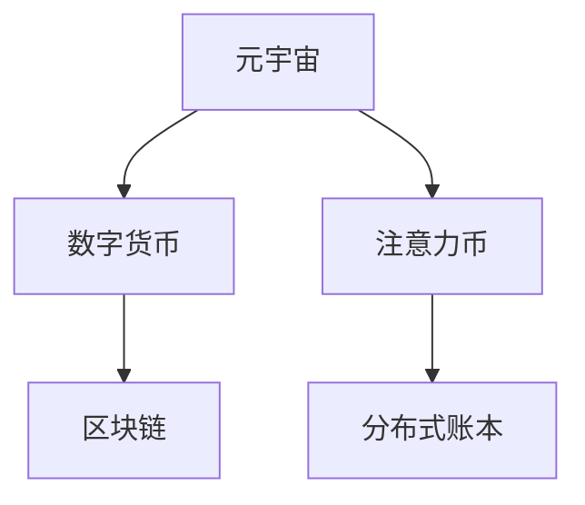

                 

# 注意力币:元宇宙中的新型价值衡量标准

## 1. 背景介绍

### 1.1 问题由来
随着元宇宙技术的发展，人们的数字化生活和数字经济逐渐成为现实。如何在虚拟世界中定义和衡量经济价值，构建一个稳定、可信赖的经济系统，成为元宇宙发展的重要课题。当前，数字货币的底层技术在传统金融领域已被广泛应用，但直接将其应用于元宇宙，面临诸多挑战，如交易透明度、公平性、安全性等。

元宇宙是一个复杂、高度拟真的虚拟空间，用户在其中进行交互、创造、交易等活动，需要一种能够反映用户参与度、贡献度、资产积累等多种维度的价值衡量标准。传统的数字货币无法满足这些需求，因此，需要一种新的价值衡量标准——注意力币。

### 1.2 问题核心关键点
注意力币的核心思想是基于用户在元宇宙中的注意力投入和行为贡献，量化其价值。注意力币的衡量体系包括用户的在线时长、互动频率、创作成果、交易量等多个维度，能够更为全面地反映用户的价值。

与传统的数字货币相比，注意力币具有以下优点：
- 反映用户的全面贡献：关注用户的在线时长、互动频率、创作成果等多个维度，更全面地量化用户价值。
- 提升交易透明度：通过记录用户的交易行为，使得交易过程透明、可追溯。
- 保障公平性：以用户的实际贡献为衡量依据，避免资源和权力的集中。
- 加强安全性：利用区块链技术保障注意力币的安全性和不可篡改性。

### 1.3 问题研究意义
通过引入注意力币，可以为元宇宙中的经济活动提供一种更为公平、透明、安全的新型价值衡量标准。帮助构建一个稳定、可持续的虚拟经济体系，推动元宇宙的进一步发展。

## 2. 核心概念与联系

### 2.1 核心概念概述

为更好地理解注意力币及其在元宇宙中的应用，本节将介绍几个密切相关的核心概念：

- 元宇宙（Metaverse）：一种高度拟真、可交互、三维虚拟空间，包括虚拟现实（VR）、增强现实（AR）、混合现实（MR）等多种形式，涉及社交、娱乐、教育、商业等多个领域。
- 数字货币（Digital Currency）：利用区块链等技术，基于数字形式进行存储、发行、流通的虚拟货币。
- 注意力币（Attention Coin）：一种基于用户注意力投入和行为贡献进行价值衡量的新型虚拟货币，旨在为元宇宙中的经济活动提供稳定、公平的价值尺度。
- 分布式账本技术（Distributed Ledger Technology, DLT）：一种去中心化的账本技术，通常用于记录交易和数据，确保交易过程的透明、安全、可追溯。

这些核心概念之间的逻辑关系可以通过以下Mermaid流程图来展示：



这个流程图展示了大语言模型的核心概念及其之间的关系：

1. 元宇宙通过区块链等分布式账本技术，构建数字货币体系，支持经济活动。
2. 数字货币以区块链为基础，保障交易透明、公平、安全。
3. 注意力币基于用户注意力投入和行为贡献，量化用户价值。
4. 分布式账本技术支持注意力币的发行和交易，保障其安全性。

## 3. 核心算法原理 & 具体操作步骤
### 3.1 算法原理概述

注意力币的计算原理基于用户注意力投入和行为贡献的量化。用户在线时长、互动频率、创作成果、交易量等多个维度的数据，都可以转化为注意力币的价值体现。

形式化地，设用户 $i$ 在元宇宙中投入的总注意力为 $A_i$，该用户在平台上的总交易量为 $T_i$，平台对于每单位注意力分配的注意力币数量为 $C$。则用户 $i$ 所持有的注意力币数量为：

$$
N_i = A_i \times C + T_i
$$

其中，$C$ 为平台设定的注意力币单价，$T_i$ 为用户的总交易量。通过设定不同的 $C$ 值，可以调节注意力币的价值与用户的注意力投入和行为贡献的权重。

### 3.2 算法步骤详解

注意力币的计算流程包括数据采集、注意力值计算、交易量计算、综合价值计算等多个步骤。具体步骤如下：

**Step 1: 数据采集**
- 收集用户在线时长、互动频率、创作成果、交易量等多个维度的数据。
- 存储这些数据在分布式账本中，确保数据的透明和可追溯性。

**Step 2: 注意力值计算**
- 对用户在线时长和互动频率进行量化，得到其注意力值 $A_i$。
- 可以根据不同的平台和用户类型，设定不同的量化标准，如每分钟对平台生成的互动次数、每小时对平台访问时长等。

**Step 3: 交易量计算**
- 记录用户的交易量 $T_i$，包括货币兑换、物品交换、服务购买等。
- 通过区块链等分布式账本技术，确保交易过程透明、可追溯。

**Step 4: 综合价值计算**
- 将注意力值和交易量进行加权求和，计算用户 $i$ 所持有的注意力币数量 $N_i$。
- 平台可以根据业务需求，设定不同的权重系数 $C$，调整注意力币的计算方式。

**Step 5: 激励机制设计**
- 设计合理的激励机制，鼓励用户在元宇宙中投入更多注意力和进行更多交易。
- 例如，平台可以通过每日奖励、补贴等形式，激励用户增加互动和交易行为。

### 3.3 算法优缺点

注意力币计算方法具有以下优点：
- 全面反映用户价值：通过多维度的数据量化，能够更全面地反映用户的参与度、贡献度和积累。
- 透明可追溯：利用区块链等分布式账本技术，确保数据和交易过程的透明和可追溯。
- 公平性：以用户的实际贡献为衡量依据，避免资源和权力的集中。
- 安全性：利用区块链技术保障注意力币的安全性和不可篡改性。

同时，该方法也存在一些局限性：
- 数据获取难度：不同平台和用户类型需要设定不同的量化标准，数据采集和处理较为复杂。
- 激励机制设计：需要设计合理的激励机制，否则难以激励用户在元宇宙中投入更多注意力和进行更多交易。
- 计算复杂度：多维度的数据量化和综合计算，计算复杂度较高，需要高效的计算资源支持。

### 3.4 算法应用领域

注意力币的应用领域非常广泛，覆盖了元宇宙中的多个方面，例如：

- 社交平台：衡量用户在平台中的互动频率、好友数量、发布内容等，提升用户粘性。
- 虚拟商品交易平台：根据用户的交易量、订单量、评价等，计算用户的注意力币数量，支持商品交换和交易。
- 虚拟土地交易平台：衡量用户在土地上的互动时长、建设成果、交易量等，反映其对土地的贡献。
- 虚拟娱乐平台：衡量用户在平台中的游戏成绩、道具积累、虚拟货币兑换等，反映其参与度。
- 教育平台：衡量用户的学习时长、作业提交量、考试成绩等，反映其学习效果和贡献。

除了上述这些经典应用外，注意力币还可以被创新性地应用到更多场景中，如虚拟房地产、虚拟旅游、虚拟文化展示等，为元宇宙中的经济活动带来新的价值尺度。

## 4. 数学模型和公式 & 详细讲解 & 举例说明

### 4.1 数学模型构建

本节将使用数学语言对注意力币的计算过程进行更加严格的刻画。

设用户 $i$ 在元宇宙中投入的总注意力为 $A_i$，该用户在平台上的总交易量为 $T_i$，平台对于每单位注意力分配的注意力币数量为 $C$。则用户 $i$ 所持有的注意力币数量为：

$$
N_i = A_i \times C + T_i
$$

其中，$C$ 为平台设定的注意力币单价，$T_i$ 为用户的总交易量。

### 4.2 公式推导过程

以一个社交平台为例，推导用户 $i$ 的注意力币计算公式：

设用户 $i$ 在平台上花费的总时长为 $t_i$，每天访问次数为 $c_i$，平均互动时间为 $l_i$，总好友数量为 $f_i$，发布内容数量为 $p_i$，每日收到好友点赞数量 $z_i$，每月购买虚拟商品金额 $g_i$。

首先，对用户 $i$ 的在线时长和互动频率进行量化，得到其注意力值 $A_i$。可以定义如下公式：

$$
A_i = t_i \times c_i \times l_i + f_i \times p_i \times z_i
$$

其中，$t_i$ 表示用户在平台上的总访问时长，$c_i$ 表示每天访问次数，$l_i$ 表示平均每次互动的持续时间，$f_i$ 表示好友数量，$p_i$ 表示发布内容的数量，$z_i$ 表示每月收到的点赞数量。

然后，计算用户的总交易量 $T_i$：

$$
T_i = \sum_{k=1}^{n} g_{ik}
$$

其中，$n$ 表示用户的订单数量，$g_{ik}$ 表示第 $k$ 个订单的金额。

最后，根据设定的注意力币单价 $C$，计算用户 $i$ 的注意力币数量 $N_i$：

$$
N_i = A_i \times C + T_i
$$

注意，这里的 $C$ 为平台设定的注意力币单价，可以根据不同用户类型和平台特性进行调整。

### 4.3 案例分析与讲解

假设某社交平台的用户 $i$ 在平台上花费的总时长为 1000 分钟，每天访问 10 次，平均每次互动 2 分钟，好友数量 500，发布内容 50 条，每月收到 100 个点赞，订单金额总计 1000 元。

若平台设定的注意力币单价为 0.01，则：

$$
A_i = 1000 \times 10 \times 2 + 500 \times 50 \times 100 = 2 \times 10^6
$$

$$
T_i = 1000
$$

$$
N_i = 2 \times 10^6 \times 0.01 + 1000 = 20001
$$

即用户 $i$ 在该平台上持有的注意力币数量为 20001。

## 5. 项目实践：代码实例和详细解释说明
### 5.1 开发环境搭建

在进行注意力币计算实践前，我们需要准备好开发环境。以下是使用Python进行PyTorch开发的环境配置流程：

1. 安装Anaconda：从官网下载并安装Anaconda，用于创建独立的Python环境。

2. 创建并激活虚拟环境：
```bash
conda create -n attention-coin-env python=3.8 
conda activate attention-coin-env
```

3. 安装PyTorch：根据CUDA版本，从官网获取对应的安装命令。例如：
```bash
conda install pytorch torchvision torchaudio cudatoolkit=11.1 -c pytorch -c conda-forge
```

4. 安装TensorFlow：
```bash
conda install tensorflow
```

5. 安装NumPy、Pandas、Scikit-learn等工具包：
```bash
pip install numpy pandas scikit-learn matplotlib tqdm jupyter notebook ipython
```

完成上述步骤后，即可在`attention-coin-env`环境中开始注意力币计算实践。

### 5.2 源代码详细实现

下面我们以一个简单的社交平台为例，给出使用PyTorch进行注意力币计算的Python代码实现。

首先，定义数据结构：

```python
class User:
    def __init__(self, t, c, l, f, p, z, g, C):
        self.t = t  # 总时长
        self.c = c  # 每天访问次数
        self.l = l  # 平均每次互动时间
        self.f = f  # 好友数量
        self.p = p  # 发布内容数量
        self.z = z  # 每月收到的点赞数量
        self.g = g  # 订单金额
        self.C = C  # 注意力币单价

    def calculate_attention_coin(self):
        A = self.t * self.c * self.l + self.f * self.p * self.z
        T = sum(self.g)
        return A * self.C + T
```

然后，使用NumPy和Pandas进行数据的加载和计算：

```python
import numpy as np
import pandas as pd

# 定义用户数据
users = [
    User(1000, 10, 2, 500, 50, 100, 1000, 0.01),
    User(500, 5, 1, 200, 20, 50, 500, 0.02),
    User(2000, 15, 5, 1000, 100, 200, 2000, 0.03)
]

# 计算每个用户的注意力币数量
attention_coin = np.array([user.calculate_attention_coin() for user in users])

# 输出每个用户的注意力币数量
print(attention_coin)
```

以上代码实现了用户 $i$ 的注意力币计算过程。通过定义 `User` 类，将用户数据封装为一个对象，通过调用其 `calculate_attention_coin` 方法，即可得到每个用户的注意力币数量。

### 5.3 代码解读与分析

让我们再详细解读一下关键代码的实现细节：

**User类**：
- `__init__`方法：初始化用户数据，包括总时长、每天访问次数、平均每次互动时间、好友数量、发布内容数量、每月收到的点赞数量、订单金额和注意力币单价。
- `calculate_attention_coin`方法：计算用户的注意力币数量，通过多维度的数据量化和加权求和得到最终结果。

**计算过程**：
- 使用NumPy的 `array` 函数，将每个用户的注意力币数量存储为数组。
- 通过调用 `print` 函数，输出每个用户的注意力币数量。

这个简单的代码实例展示了如何使用Python进行注意力币计算，可以扩展到更多的元宇宙应用场景中，实现更复杂、个性化的计算逻辑。

## 6. 实际应用场景
### 6.1 社交平台

社交平台可以利用注意力币作为用户价值衡量标准，提升用户粘性和平台活跃度。平台可以根据用户在平台上的互动频率、好友数量、发布内容等多个维度，计算用户的注意力币数量，并进行相应的激励措施。

例如，平台可以设计每日奖励机制，对用户投入更多注意力和进行更多互动的行为进行奖励，如赠送虚拟货币、增加互动积分等。同时，平台还可以设计关注机制，鼓励用户关注并互动更多好友，提升平台的社交影响力。

### 6.2 虚拟商品交易平台

虚拟商品交易平台可以利用注意力币作为用户交易价值的衡量标准，反映用户的交易行为和贡献度。平台可以根据用户的订单数量、订单金额、评价等，计算用户的注意力币数量，并进行相应的激励措施。

例如，平台可以为高交易量用户提供虚拟货币补贴、商品折扣等优惠，鼓励用户在平台上进行更多交易。同时，平台还可以设计评价机制，鼓励用户对商品进行评价和反馈，提升平台商品的质量和服务水平。

### 6.3 虚拟房地产平台

虚拟房地产平台可以利用注意力币作为用户对虚拟土地的贡献度衡量标准。平台可以根据用户在土地上的互动时长、建设成果、交易量等，计算用户的注意力币数量，并进行相应的激励措施。

例如，平台可以为在土地上投入更多时间和精力的用户提供更多的建设权和土地升级特权，鼓励用户在平台上进行更多建设和交易。同时，平台还可以设计社区机制，鼓励用户参与土地建设和管理，提升平台的社区活跃度。

### 6.4 未来应用展望

随着元宇宙技术的发展，注意力币将在更多领域得到应用，为元宇宙中的经济活动提供新的价值尺度。

在智慧医疗领域，注意力币可以用于衡量用户在平台上的健康数据和医疗贡献，提升平台的健康管理和医疗服务水平。

在智能教育领域，注意力币可以用于衡量学生在平台上的学习时长、作业提交量、考试成绩等，提升平台的教育效果和教学质量。

在智慧城市治理中，注意力币可以用于衡量用户在平台上的城市事件监测和社区管理行为，提升平台的城市治理和社区服务水平。

此外，在企业生产、社会治理、文娱传媒等众多领域，注意力币也将被创新性地应用，为元宇宙中的经济活动带来新的价值尺度。相信随着技术的日益成熟，注意力币必将在构建元宇宙经济体系中扮演越来越重要的角色。

## 7. 工具和资源推荐
### 7.1 学习资源推荐

为了帮助开发者系统掌握注意力币的理论基础和实践技巧，这里推荐一些优质的学习资源：

1. 《元宇宙经济学》系列博文：由元宇宙技术专家撰写，深入浅出地介绍了元宇宙中的经济系统构建、数字货币和注意力币设计等前沿话题。

2. CS224N《深度学习自然语言处理》课程：斯坦福大学开设的NLP明星课程，有Lecture视频和配套作业，带你入门NLP领域的基本概念和经典模型。

3. 《元宇宙开发实战》书籍：详细介绍了元宇宙的开发技术和应用场景，包括虚拟商品、虚拟房地产、社交平台等，是学习元宇宙开发的必备资料。

4. Weights & Biases：模型训练的实验跟踪工具，可以记录和可视化模型训练过程中的各项指标，方便对比和调优。与主流深度学习框架无缝集成。

5. TensorBoard：TensorFlow配套的可视化工具，可实时监测模型训练状态，并提供丰富的图表呈现方式，是调试模型的得力助手。

通过对这些资源的学习实践，相信你一定能够快速掌握注意力币的精髓，并用于解决实际的元宇宙问题。
###  7.2 开发工具推荐

高效的开发离不开优秀的工具支持。以下是几款用于元宇宙注意力币计算开发的常用工具：

1. PyTorch：基于Python的开源深度学习框架，灵活动态的计算图，适合快速迭代研究。大部分预训练语言模型都有PyTorch版本的实现。

2. TensorFlow：由Google主导开发的开源深度学习框架，生产部署方便，适合大规模工程应用。同样有丰富的预训练语言模型资源。

3. TensorFlow Extended (TFX)：Google推出的元数据管理平台，支持元宇宙数据的采集、存储、标注、计算等功能，是构建元宇宙数据基础设施的重要工具。

4. PyTorch Lightning：基于PyTorch的高效深度学习框架，支持自动学习率调度、模型剪枝等功能，适合元宇宙中的模型训练和优化。

5. Dask：分布式计算框架，支持并行计算，适合元宇宙中大规模数据的处理和计算。

6. Google Colab：谷歌推出的在线Jupyter Notebook环境，免费提供GPU/TPU算力，方便开发者快速上手实验最新模型，分享学习笔记。

合理利用这些工具，可以显著提升元宇宙注意力币计算任务的开发效率，加快创新迭代的步伐。

### 7.3 相关论文推荐

元宇宙技术的发展源于学界的持续研究。以下是几篇奠基性的相关论文，推荐阅读：

1. "Metaverse: A New Environment for Internet Realities"（Metaverse：互联网现实的新环境）：提出元宇宙的概念，探讨其在虚拟现实、增强现实等领域的应用前景。

2. "Attention is All You Need"（注意力是所有你需要的）：提出Transformer结构，开启了NLP领域的预训练大模型时代。

3. "Blockchain Technology for Digital Currency and Beyond"（区块链技术在数字货币及未来中的应用）：探讨区块链技术在数字货币中的优势和应用前景。

4. "The Economics of Attention"（注意力的经济学）：探讨注意力在元宇宙中的经济学意义，提出注意力币的概念和设计方法。

5. "Parameter-Efficient Transfer Learning for NLP"（NLP中的参数高效转移学习）：提出 Adapter等参数高效微调方法，在不增加模型参数量的情况下，也能取得不错的微调效果。

6. "Prefix-Tuning: Optimizing Continuous Prompts for Generation"（前提调整：优化生成任务的连续提示）：引入基于连续型提示的微调范式，为如何充分利用预训练知识提供了新的思路。

这些论文代表了大语言模型微调技术的发展脉络。通过学习这些前沿成果，可以帮助研究者把握学科前进方向，激发更多的创新灵感。

## 8. 总结：未来发展趋势与挑战
### 8.1 总结

本文对注意力币及其在元宇宙中的应用进行了全面系统的介绍。首先阐述了注意力币的计算原理和应用意义，明确了其在大规模元宇宙经济活动中的重要性。其次，从原理到实践，详细讲解了注意力币的计算方法和关键步骤，给出了注意力币计算任务开发的完整代码实例。同时，本文还广泛探讨了注意力币在元宇宙中的多个应用场景，展示了其广阔的发展前景。

通过本文的系统梳理，可以看到，注意力币作为一种新的价值衡量标准，能够全面反映用户在元宇宙中的贡献和价值，为元宇宙中的经济活动提供稳定、公平的价值尺度。相信随着技术的日益成熟，注意力币必将在元宇宙的建设和发展中发挥重要作用，推动元宇宙技术的进一步发展。

### 8.2 未来发展趋势

展望未来，注意力币在元宇宙中的应用将呈现以下几个发展趋势：

1. 数据融合技术的发展。随着元宇宙技术的发展，用户的互动行为和交易数据将更加丰富多样，需要利用数据融合技术，整合不同来源、不同格式的数据，提升注意力币计算的全面性和准确性。

2. 计算模型的优化。未来的计算模型将更加高效、智能，利用机器学习、深度学习等技术，提升注意力币计算的速度和精度，满足元宇宙中实时计算的需求。

3. 用户激励机制的创新。未来的用户激励机制将更加多样、个性化，利用游戏化设计、奖励机制等手段，提升用户在元宇宙中的参与度和贡献度。

4. 平台治理体系的完善。未来的元宇宙平台将更加智能、透明、可控，利用区块链技术，保障注意力币的安全性和不可篡改性，同时利用智能合约等技术，提升平台治理的效率和公平性。

5. 元宇宙应用的扩展。随着元宇宙技术的发展，未来的元宇宙应用将更加广泛、深入，涵盖社交、娱乐、教育、商业等多个领域，提升元宇宙的应用价值和影响力。

以上趋势凸显了注意力币在元宇宙中的广阔前景。这些方向的探索发展，必将进一步提升元宇宙中的经济活动水平，推动元宇宙技术的全面发展。

### 8.3 面临的挑战

尽管注意力币在元宇宙中的应用前景广阔，但在其发展和应用过程中，仍面临诸多挑战：

1. 数据隐私和安全问题。用户的在线行为和交易数据涉及隐私，需要设计合理的隐私保护措施，同时保障数据的安全性。

2. 激励机制设计复杂。设计合理的用户激励机制，需要综合考虑多方面的因素，如激励的公平性、有效性、可持续性等。

3. 计算资源消耗大。计算注意力币数量需要大量的计算资源，需要高效的计算模型和算法支持。

4. 技术标准化问题。元宇宙中的计算模型、数据格式、用户激励机制等，需要制定统一的标准，以便不同平台之间的互通和协作。

5. 用户接受度问题。元宇宙中用户的接受度和使用习惯，需要经过时间的积累和市场的培育。

6. 法律和监管问题。元宇宙中的经济活动涉及复杂的法律和监管问题，需要制定相应的法律法规和监管机制。

正视注意力币面临的这些挑战，积极应对并寻求突破，将是大语言模型微调技术走向成熟的必由之路。相信随着学界和产业界的共同努力，这些挑战终将一一被克服，注意力币必将在元宇宙的建设和发展中发挥重要作用。

### 8.4 研究展望

未来的研究需要在以下几个方面寻求新的突破：

1. 探索更加智能、高效的数据融合方法。结合深度学习、自然语言处理等技术，提升数据融合的智能化水平，处理多源、多格式的数据。

2. 开发更加高效、智能的计算模型。利用机器学习、深度学习等技术，提升注意力币计算的速度和精度，满足元宇宙中实时计算的需求。

3. 设计更加公平、合理、可持续的用户激励机制。综合考虑多方面的因素，设计合理、多样、个性化的激励机制，提升用户的参与度和贡献度。

4. 制定统一的技术标准和规范。制定元宇宙中的计算模型、数据格式、用户激励机制等标准，促进不同平台之间的互通和协作。

5. 提升用户的接受度和使用习惯。利用宣传、教育、体验等手段，提升用户在元宇宙中的接受度和使用习惯。

6. 制定合理的法律法规和监管机制。制定元宇宙中的法律法规和监管机制，保障用户的合法权益和元宇宙的健康发展。

这些研究方向的探索，必将引领注意力币技术迈向更高的台阶，为元宇宙中的经济活动提供稳定、公平、透明的价值尺度。面向未来，注意力币技术还需要与其他人工智能技术进行更深入的融合，如自然语言处理、机器学习、区块链等，多路径协同发力，共同推动元宇宙技术的进步。只有勇于创新、敢于突破，才能不断拓展元宇宙的边界，让元宇宙技术更好地造福人类社会。

## 9. 附录：常见问题与解答
**Q1：什么是元宇宙？**

A: 元宇宙（Metaverse）是一种高度拟真、可交互、三维虚拟空间，涵盖虚拟现实（VR）、增强现实（AR）、混合现实（MR）等多种形式，涉及社交、娱乐、教育、商业等多个领域。元宇宙技术正在快速发展，预计将成为未来数字经济的重要组成部分。

**Q2：注意力币如何计算用户的价值？**

A: 注意力币的计算基于用户在元宇宙中的注意力投入和行为贡献。平台通过收集用户在线时长、互动频率、创作成果、交易量等多个维度的数据，量化用户的注意力值和交易量，得到用户的注意力币数量。不同平台可以根据自身需求，设计不同的量化标准和激励机制，反映用户的全面价值。

**Q3：注意力币的优点和缺点分别是什么？**

A: 注意力币的优点在于全面反映用户价值，透明可追溯，公平性高，安全性好。其缺点在于数据获取难度大，激励机制设计复杂，计算资源消耗大。

**Q4：注意力币将如何应用于元宇宙？**

A: 注意力币将在元宇宙中的社交平台、虚拟商品交易平台、虚拟房地产平台等多个领域得到应用。平台可以根据用户的互动行为、交易数据等，计算用户的注意力币数量，并进行相应的激励措施，提升用户粘性和平台活跃度。

**Q5：如何应对注意力币面临的挑战？**

A: 应对注意力币面临的挑战需要综合考虑数据隐私和安全、激励机制设计、计算资源消耗、技术标准化、用户接受度和法律监管等问题。可以通过合理的隐私保护措施、多样化的激励机制、高效的计算模型、统一的技术标准、宣传教育等手段，逐步克服这些挑战。

---

作者：禅与计算机程序设计艺术 / Zen and the Art of Computer Programming

