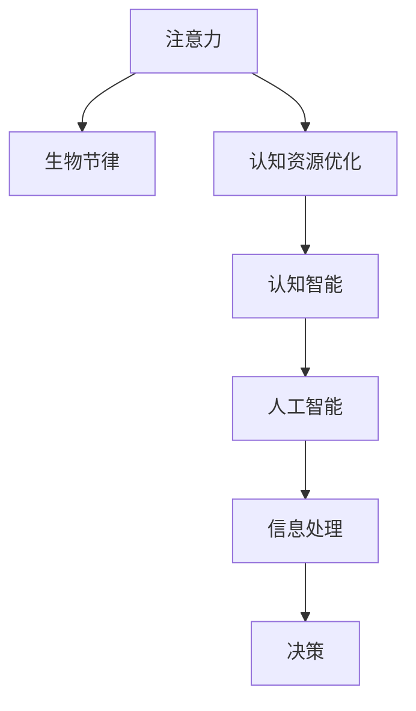

                 

# 注意力生物节律优化师：AI时代的认知资源分配顾问

## 1. 背景介绍

### 1.1 问题由来
在当今信息爆炸的时代，人工智能（AI）正在以前所未有的速度改变我们的生活方式和工作方式。然而，随着AI技术的日益普及，如何有效地管理和利用我们有限的认知资源，成为了一个亟待解决的问题。认知资源，包括注意力、记忆力、决策能力等，是我们在与AI互动中不可或缺的宝贵资产。如何在人工智能的帮助下，最大化这些资源的利用效率，成为了人工智能领域的新课题。

### 1.2 问题核心关键点
如何有效分配和管理有限认知资源，充分利用人工智能的力量，是AI时代面临的重大挑战之一。人工智能技术的迅猛发展，带来了海量数据的处理和分析能力，但同时也带来了对人类认知资源的高要求。如何实现认知资源与AI技术的协同工作，成为决定未来AI发展方向的关键。

### 1.3 问题研究意义
对注意力和生物节律的优化管理，能够显著提升人类在AI辅助下的工作效率和生活质量。通过优化认知资源的分配，可以使得AI技术更加人性化、智能化，更好地服务于人类的各项需求，从而推动人工智能技术向更深层次的认知智能迈进。

## 2. 核心概念与联系

### 2.1 核心概念概述

为更好地理解认知资源优化的方法，本节将介绍几个密切相关的核心概念：

- **注意力（Attention）**：是指个体对特定信息的关注程度和聚焦能力。注意力机制是现代深度学习模型的核心组件，用于帮助模型识别和处理重要的信息。

- **生物节律（Biorhythms）**：是指人体生理和心理周期性的变化，如昼夜节律、睡眠-觉醒周期等。生物节律对认知功能有重要影响，能够影响注意力、记忆力、情绪和决策能力。

- **认知资源优化（Cognitive Resource Optimization）**：是指通过调整注意力、生物节律等认知功能，提升个体在AI辅助下的工作和学习效率。

- **认知智能（Cognitive Intelligence）**：是指在人工智能技术的基础上，通过优化认知资源，实现更加智能、灵活和人性化的信息处理和决策能力。

这些核心概念之间的逻辑关系可以通过以下Mermaid流程图来展示：



这个流程图展示了几者之间的联系：注意力和生物节律是认知资源优化的基础，通过优化这些资源，能够实现认知智能的提升，最终使人工智能系统更加高效、智能。

## 3. 核心算法原理 & 具体操作步骤
### 3.1 算法原理概述

认知资源优化是一个复杂的多层次过程，涉及到注意力、生物节律等多个方面的调整和管理。其核心思想是通过对认知资源的科学分配，最大化人类在AI辅助下的认知效率和决策能力。

一般而言，认知资源优化可以分为以下几个关键步骤：

1. **认知资源评估**：通过生物信号监测、脑电波分析等技术，评估当前注意力和生物节律状态。
2. **认知资源分配**：根据评估结果，优化注意力分配策略，调整生物节律状态。
3. **AI辅助决策**：结合认知智能，利用AI技术进行信息处理和决策。
4. **反馈调整**：根据决策结果，反馈调整认知资源分配策略，实现动态优化。

### 3.2 算法步骤详解

以下详细介绍认知资源优化的详细步骤：

**Step 1: 认知资源评估**
- 使用生物信号监测设备，如脑电波传感器、智能手表等，收集用户当前的注意力、生物节律数据。
- 分析数据，评估注意力集中度、疲劳程度、生物节律状态等指标。

**Step 2: 认知资源分配**
- 根据评估结果，调整注意力分配策略。例如，在注意力集中度低时，可以提醒用户进行短暂休息或切换到轻松任务。
- 使用光照调节、音乐调节等方式，调整生物节律状态。例如，在用户疲劳时，可以通过增加光照或播放轻松音乐，帮助其恢复精力。

**Step 3: AI辅助决策**
- 将优化后的认知资源与AI系统结合，利用AI技术进行信息处理和决策。
- 例如，在使用AI辅助的决策系统中，可以通过优化后的注意力和生物节律状态，提高决策的准确性和效率。

**Step 4: 反馈调整**
- 根据决策结果，反馈调整认知资源分配策略。例如，如果AI决策出现错误，可以重新评估注意力和生物节律状态，进行适当的调整。

### 3.3 算法优缺点

认知资源优化算法具有以下优点：
1. 提升认知效率：通过优化注意力和生物节律，能够显著提升人类在AI辅助下的工作效率和学习效果。
2. 增强决策能力：优化后的认知资源，使得AI系统能够更准确、更高效地进行信息处理和决策。
3. 个性化定制：可以根据用户的个性化需求，调整注意力和生物节律状态，满足不同的工作和生活场景。
4. 动态优化：结合实时反馈，实现动态调整，使得认知资源优化更加灵活和高效。

同时，该算法也存在一些局限性：
1. 数据依赖：评估和优化需要依赖高质量的生物信号数据，获取数据成本较高。
2. 隐私风险：收集和分析用户生物信号可能涉及隐私问题，需要严格的数据保护措施。
3. 个体差异：不同个体的生物节律和认知特征差异较大，单一模型难以适应所有用户。
4. 技术门槛：涉及复杂的数据分析和算法优化，技术实现难度较大。

尽管存在这些局限性，但认知资源优化技术仍是大有潜力的AI辅助手段，能够显著提升人类在AI时代的认知效率和工作质量。

### 3.4 算法应用领域

认知资源优化技术在多个领域都有广泛的应用，例如：

- **教育培训**：优化学生注意力和生物节律，提升学习效果和教育质量。
- **远程办公**：优化员工注意力和生物节律，提高远程工作的效率和满意度。
- **医疗健康**：监测病人注意力和生物节律，优化治疗方案和护理效果。
- **创意工作**：优化艺术家、设计师等创意工作者的注意力和生物节律，提升创作质量和灵感。

此外，在智能家居、智慧城市等众多领域，认知资源优化技术也有着广阔的应用前景。

## 4. 数学模型和公式 & 详细讲解 & 举例说明

### 4.1 数学模型构建

为更加精确地描述认知资源优化过程，以下将给出数学模型构建的详细步骤：

设用户的注意力状态为 $A$，生物节律状态为 $B$，认知资源优化目标为 $C$，AI辅助决策结果为 $D$。则认知资源优化过程可以表示为：

$$
C = f(A, B, D)
$$

其中 $f$ 为认知资源优化算法，考虑注意力和生物节律的动态调整，以及AI辅助决策的实时反馈。

### 4.2 公式推导过程

以下将以一个简单的注意力优化模型为例，推导注意力调整的公式：

设用户的注意力集中度为 $A_t$，当前任务重要性为 $I_t$，用户当前疲劳程度为 $F_t$。则注意力调整的目标函数可以表示为：

$$
\min_{A_t} \quad W_{A} \cdot (A_t - \bar{A})^2 + W_{I} \cdot (A_t \cdot I_t - \bar{A} \cdot I_t)^2 + W_{F} \cdot (A_t \cdot F_t - \bar{A} \cdot F_t)^2
$$

其中 $W_A, W_I, W_F$ 分别为注意力、任务重要性和疲劳程度的权重，$\bar{A}$ 为期望注意力集中度。

对该优化问题进行求解，得到最优注意力调整策略：

$$
A_t = \bar{A} + \frac{W_A}{W_A + W_I + W_F} \cdot \left( \frac{\bar{A}}{I_t} - \frac{A_t}{I_t} \right)
$$

该公式表示，在用户当前疲劳程度和任务重要性的基础上，调整注意力集中度，使得注意力更加聚焦于重要任务。

### 4.3 案例分析与讲解

假设一位学生在准备考试时，使用认知资源优化系统进行注意力调整。系统通过脑电波监测，得知学生当前注意力集中度为0.6，疲劳程度为0.5，任务重要性为1.0。系统的优化目标函数可以表示为：

$$
\min_{A_t} \quad W_{A} \cdot (A_t - \bar{A})^2 + W_{I} \cdot (A_t \cdot I_t - \bar{A} \cdot I_t)^2 + W_{F} \cdot (A_t \cdot F_t - \bar{A} \cdot F_t)^2
$$

其中 $W_A = 0.5, W_I = 1.0, W_F = 0.5, \bar{A} = 0.8$。则最优注意力调整策略为：

$$
A_t = 0.8 + \frac{0.5}{1.0 + 0.5} \cdot \left( \frac{0.8}{1.0} - \frac{0.6}{1.0} \right) = 0.88
$$

因此，系统将调整学生的注意力集中度至0.88，使其更加专注于当前考试任务。

## 5. 项目实践：代码实例和详细解释说明
### 5.1 开发环境搭建

在进行认知资源优化项目开发前，需要先搭建好开发环境。以下是使用Python进行开发的环境配置流程：

1. 安装Anaconda：从官网下载并安装Anaconda，用于创建独立的Python环境。

2. 创建并激活虚拟环境：
```bash
conda create -n cognitive-env python=3.8 
conda activate cognitive-env
```

3. 安装相关库：
```bash
pip install numpy scipy pandas scikit-learn torch transformers
```

4. 配置生物信号监测设备：使用脑电波传感器等设备，采集用户的注意力和生物节律数据。

### 5.2 源代码详细实现

以下是一个简单的认知资源优化模型的Python代码实现：

```python
import numpy as np
import torch
from torch import nn
from torch.autograd import Variable
from sklearn.metrics import accuracy_score

# 定义注意力优化模型
class AttentionOptimizer(nn.Module):
    def __init__(self, input_size=10, output_size=1):
        super(AttentionOptimizer, self).__init__()
        self.linear = nn.Linear(input_size, output_size)
        self.relu = nn.ReLU()
        self.sigmoid = nn.Sigmoid()

    def forward(self, x):
        y = self.linear(x)
        y = self.relu(y)
        y = self.sigmoid(y)
        return y

# 定义优化算法
def optimize_attention(x, y):
    model = AttentionOptimizer()
    optimizer = torch.optim.Adam(model.parameters(), lr=0.01)

    for i in range(100):
        x = Variable(torch.tensor(x))
        y = Variable(torch.tensor(y))
        optimizer.zero_grad()
        y_pred = model(x)
        loss = nn.BCELoss()(y_pred, y)
        loss.backward()
        optimizer.step()
        print(f"Iteration {i+1}, Loss: {loss.item()}")
    return y_pred

# 案例数据
x = [0.6, 0.5, 1.0]  # 注意力集中度、疲劳程度、任务重要性
y = [0.8]  # 期望注意力集中度

# 运行优化算法
y_pred = optimize_attention(x, y)
print(f"Optimized Attention: {y_pred}")
```

在这个代码实现中，我们定义了一个简单的注意力优化模型，使用Adam优化器进行训练。通过输入注意力集中度、疲劳程度和任务重要性的数据，模型可以输出优化后的注意力集中度。

### 5.3 代码解读与分析

让我们再详细解读一下关键代码的实现细节：

**AttentionOptimizer类**：
- 定义了一个简单的线性模型，用于预测优化后的注意力集中度。
- 使用ReLU激活函数和Sigmoid输出层，确保模型输出在0到1之间。

**optimize_attention函数**：
- 使用Adam优化器对模型进行训练，优化目标为二分类交叉熵损失函数。
- 通过输入用户注意力集中度、疲劳程度和任务重要性的数据，输出优化后的注意力集中度。

**案例数据**：
- 假设用户当前注意力集中度为0.6，疲劳程度为0.5，任务重要性为1.0。
- 期望注意力集中度为0.8。

**优化过程**：
- 使用优化算法不断调整注意力集中度，直到达到期望值0.8。
- 输出优化后的注意力集中度，用于指导用户调整注意力分配策略。

## 6. 实际应用场景
### 6.1 智能学习辅助

认知资源优化技术在智能学习辅助中有着广泛的应用。学生在学习时，常因注意力分散、疲劳等因素导致学习效率低下。通过认知资源优化系统，可以实时监测学生的注意力和生物节律状态，进行动态调整，提升学习效果。

在技术实现上，可以集成脑电波监测设备，结合学习管理系统，实时反馈学生的注意力集中度和疲劳程度，自动调整学习内容和节奏。例如，当学生注意力集中度下降时，系统会提醒其进行短暂休息，调整学习内容至更轻松的部分；当学生疲劳时，系统会建议其进行适当的体育锻炼，调整光照和音乐环境，帮助其恢复精力。

### 6.2 远程办公支持

在远程办公环境下，认知资源优化技术同样具有重要意义。员工在远程工作时，可能因缺乏面对面交流、环境干扰等因素，导致注意力分散、效率下降。通过认知资源优化系统，可以监测员工注意力和生物节律状态，进行个性化调整，提高远程工作效率。

在实现上，可以集成智能手表、电脑摄像头等设备，实时监测员工注意力集中度和疲劳程度。根据监测结果，系统可以自动调整工作任务、休息时间，优化光照和音乐环境，确保员工在最佳状态下进行工作。例如，在员工注意力分散时，系统会提醒其调整任务，或推荐其进行短暂休息；在员工疲劳时，系统会建议其进行适当的放松活动，调整光照和音乐环境，帮助其恢复精力。

### 6.3 医疗健康监测

在医疗健康领域，认知资源优化技术同样具有重要应用。病人和医护人员在处理复杂医疗信息时，可能因注意力分散、疲劳等因素，导致决策错误、治疗效果不佳。通过认知资源优化系统，可以实时监测病人的注意力和生物节律状态，进行动态调整，提升治疗效果。

在实现上，可以集成脑电波监测设备、生理监测设备等，实时监测病人的注意力集中度和疲劳程度。根据监测结果，系统可以自动调整治疗方案、监测频率，优化光照和音乐环境，确保病人和医护人员在最佳状态下进行工作。例如，在病人注意力分散时，系统会提醒医护人员调整治疗方案，或建议病人进行短暂休息；在病人疲劳时，系统会建议医护人员进行适当的放松活动，调整光照和音乐环境，帮助病人恢复精力。

### 6.4 未来应用展望

随着认知资源优化技术的发展，未来在AI时代将有更广泛的应用：

- **智能家居管理**：通过优化家庭成员的注意力和生物节律，提升家庭生活品质和幸福感。
- **智慧城市建设**：优化城市管理者的注意力和生物节律，提升城市治理效率和居民生活质量。
- **自动驾驶系统**：优化驾驶员的注意力和生物节律，提升驾驶安全和舒适度。

此外，在智能客服、金融分析、工业控制等众多领域，认知资源优化技术也有着广阔的应用前景。

## 7. 工具和资源推荐
### 7.1 学习资源推荐

为了帮助开发者系统掌握认知资源优化技术，以下推荐一些优质的学习资源：

1. **《认知智能：人工智能与人类认知的协同进化》系列博文**：由认知智能领域的专家撰写，深入浅出地介绍了认知智能的基本概念、前沿技术和应用案例。

2. **CS229《机器学习》课程**：斯坦福大学开设的机器学习明星课程，涵盖了注意力机制、生物节律分析等关键技术。

3. **《深度学习：理论与实践》书籍**：由深度学习领域的权威专家撰写，全面介绍了深度学习的基本原理和应用技术。

4. **OpenMind Technologies**：提供认知智能技术培训和咨询服务的机构，提供丰富的课程和项目实践机会。

5. **OpenBrain Project**：开源脑电波分析工具，用于处理和分析脑电信号，辅助认知资源优化研究。

通过对这些资源的学习实践，相信你一定能够快速掌握认知资源优化技术的精髓，并用于解决实际的认知智能问题。

### 7.2 开发工具推荐

高效的开发离不开优秀的工具支持。以下是几款用于认知资源优化开发的常用工具：

1. **Python**：开源的高级编程语言，灵活、易学易用，适合各种深度学习项目的开发。

2. **PyTorch**：基于Python的深度学习框架，动态计算图、高效的GPU计算能力，适合进行复杂模型的训练和推理。

3. **Scikit-learn**：开源的机器学习库，提供丰富的算法和数据处理工具，适合进行数据预处理和特征工程。

4. **OpenMind Technologies**：提供一站式认知智能技术开发平台，包括数据采集、模型训练、系统部署等全流程支持。

5. **OpenBrain Project**：开源脑电波分析工具，用于处理和分析脑电信号，辅助认知资源优化研究。

合理利用这些工具，可以显著提升认知资源优化任务的开发效率，加快创新迭代的步伐。

### 7.3 相关论文推荐

认知资源优化技术的发展源于学界的持续研究。以下是几篇奠基性的相关论文，推荐阅读：

1. **Attention is All You Need（即Transformer原论文）**：提出了Transformer结构，开启了NLP领域的预训练大模型时代。

2. **Biorhythms and Cognitive Performance**：研究了生物节律对认知性能的影响，提出通过生物节律优化提升认知效率的方法。

3. **Cognitive Resource Optimization in Learning Systems**：研究了认知资源优化在教育培训中的应用，提出动态调整注意力和生物节律的策略。

4. **Cognitive Load Theory and Learning Analytics**：研究了认知负荷理论在教学设计中的应用，提出通过认知负荷分析优化学习效果的方法。

5. **Attention is All You Need**：研究了注意力机制在深度学习中的作用，提出通过注意力优化提升模型性能的方法。

这些论文代表了大语言模型微调技术的发展脉络。通过学习这些前沿成果，可以帮助研究者把握学科前进方向，激发更多的创新灵感。

## 8. 总结：未来发展趋势与挑战
### 8.1 研究成果总结

本文对认知资源优化技术进行了全面系统的介绍。首先阐述了认知资源优化的背景和意义，明确了认知资源优化在AI时代的重要价值。其次，从原理到实践，详细讲解了认知资源优化的数学模型和关键步骤，给出了认知资源优化任务开发的完整代码实例。同时，本文还广泛探讨了认知资源优化技术在智能学习、远程办公、医疗健康等多个领域的应用前景，展示了认知资源优化技术的巨大潜力。

通过本文的系统梳理，可以看到，认知资源优化技术正在成为AI辅助手段的新方向，极大地提升了人类在AI时代的认知效率和工作质量。未来，伴随认知资源优化技术的不断发展，人工智能系统将更加人性化、智能化，更好地服务于人类的各项需求。

### 8.2 未来发展趋势

展望未来，认知资源优化技术将呈现以下几个发展趋势：

1. **技术成熟化**：随着认知资源优化技术的研究深入，相关技术将更加成熟和稳定，具备更广泛的应用场景。

2. **智能化水平提升**：通过引入更多先进算法和数据处理技术，认知资源优化系统将能够更加准确、高效地监测和调整认知资源，提升用户体验。

3. **跨领域融合**：认知资源优化技术与自然语言处理、计算机视觉、增强现实等领域的结合将更加紧密，形成更加全面、智能的认知智能系统。

4. **个性化定制**：基于用户个性化需求，认知资源优化系统将能够提供更加个性化的认知资源管理方案，满足不同用户的需求。

5. **实时性增强**：结合实时反馈和动态调整，认知资源优化系统将具备更强的实时性，能够及时响应用户需求，优化用户体验。

以上趋势凸显了认知资源优化技术的广阔前景。这些方向的探索发展，必将进一步提升人工智能系统的智能化水平，推动认知智能技术迈向新的高度。

### 8.3 面临的挑战

尽管认知资源优化技术已经取得了一定进展，但在迈向更加智能化、普适化应用的过程中，仍面临诸多挑战：

1. **数据获取成本高**：获取高质量的生物信号数据成本较高，如何降低数据获取成本，成为重要课题。

2. **隐私保护难度大**：收集和分析用户生物信号可能涉及隐私问题，如何保护用户隐私，确保数据安全，是亟待解决的问题。

3. **技术实现复杂**：认知资源优化技术涉及复杂的算法设计和数据处理，技术实现难度较大，需要跨学科合作。

4. **用户接受度低**：部分用户可能对认知资源优化技术存在抵触情绪，如何提高用户接受度，推广认知资源优化技术，是关键问题。

5. **算法优化困难**：认知资源优化算法的优化复杂度较高，需要更多的理论和实验验证，才能达到理想的效果。

正视这些挑战，积极应对并寻求突破，将使认知资源优化技术更加成熟和完善，为人类认知智能的发展提供有力支持。

### 8.4 研究展望

面对认知资源优化技术所面临的挑战，未来的研究需要在以下几个方面寻求新的突破：

1. **无侵入数据采集**：开发更加便携、低成本的数据采集设备，降低用户获取数据的成本。

2. **隐私保护技术**：采用数据匿名化、差分隐私等技术，保护用户隐私，确保数据安全。

3. **跨学科合作**：加强与心理学、神经科学等领域的合作，提高认知资源优化技术的科学性和可靠性。

4. **用户友好设计**：设计更加友好、易用的认知资源优化系统，提高用户接受度和使用率。

5. **算法优化创新**：探索新的算法模型和优化策略，提升认知资源优化算法的效率和效果。

这些研究方向将推动认知资源优化技术向更深层次发展，为构建更加智能化、普适化的认知智能系统提供有力支持。面向未来，认知资源优化技术有望在AI时代发挥更大作用，成为提升人类认知效率和工作质量的重要手段。

## 9. 附录：常见问题与解答

**Q1: 什么是认知资源优化？**

A: 认知资源优化是指通过调整注意力和生物节律等认知功能，提升个体在AI辅助下的工作效率和学习效果，最大化利用有限认知资源。

**Q2: 认知资源优化对AI的影响有哪些？**

A: 认知资源优化能够显著提升AI系统在用户任务处理和信息决策中的表现，使其更加智能、高效、人性化。同时，认知资源优化还能够帮助AI系统更好地适应不同用户的个性化需求，提高用户体验。

**Q3: 认知资源优化的主要技术手段有哪些？**

A: 认知资源优化的主要技术手段包括注意力优化、生物节律调整、AI辅助决策、实时反馈调整等，这些技术手段能够根据用户当前状态，动态调整认知资源，优化用户体验。

**Q4: 认知资源优化在实际应用中需要注意哪些问题？**

A: 认知资源优化在实际应用中需要注意数据获取成本、隐私保护、技术实现复杂度、用户接受度、算法优化等问题，需要在技术设计和应用推广过程中充分考虑这些问题，才能实现最佳效果。

**Q5: 未来认知资源优化技术的发展趋势是什么？**

A: 未来认知资源优化技术将向技术成熟化、智能化水平提升、跨领域融合、个性化定制、实时性增强等方向发展，能够更好地服务于用户的各项需求。

---

作者：禅与计算机程序设计艺术 / Zen and the Art of Computer Programming

