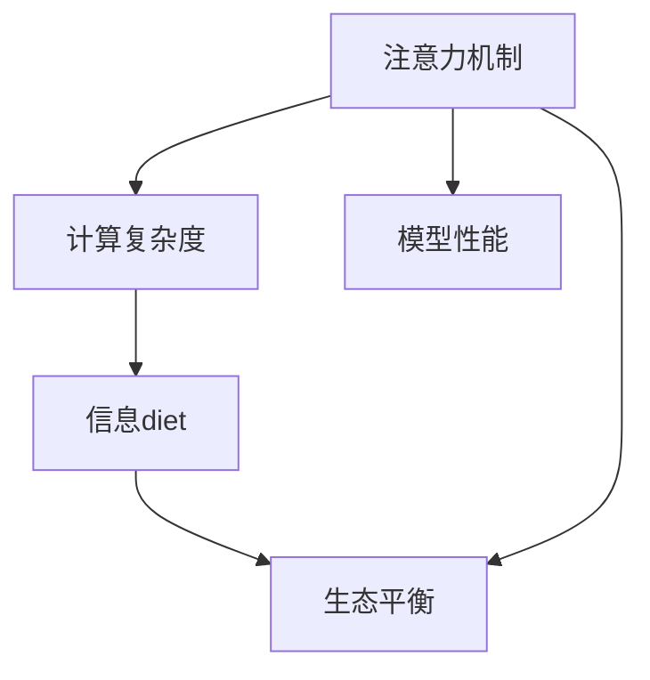

                 

# 注意力的生态平衡：AI时代的信息diet

> 关键词：注意力, 生态平衡, 信息diet, 人工智能, 数据精简, 计算优化, 高效学习, 深度学习, 模型优化

## 1. 背景介绍

### 1.1 问题由来
在AI时代，数据已经成为推动技术进步的重要驱动力。然而，海量数据的泛滥也带来了新的挑战：信息过载。随着深度学习模型的复杂度不断增加，模型的训练和推理过程对计算资源的需求也随之上升，导致资源消耗和环境影响愈发突出。如何在保持模型性能的同时，实现资源的优化利用，已成为人工智能领域亟需解决的问题。

注意力机制作为一种重要的计算方式，近年来在深度学习中得到了广泛应用，包括自然语言处理、计算机视觉、语音识别等多个领域。然而，随着模型规模的不断扩大，注意力机制的计算复杂度也随之上升，消耗了大量的计算资源。如何平衡注意力的计算与模型性能之间的关系，实现信息diet，成为当前深度学习领域的热点问题。

### 1.2 问题核心关键点
注意力机制（Attention Mechanism）是深度学习中一种用于提升模型表达能力的计算方式。通过注意力机制，模型可以动态地从输入数据中选择并关注关键部分，从而在复杂的输入数据中提取出有用的信息。然而，随着模型规模的扩大，注意力的计算复杂度也随之增加，消耗了大量计算资源。如何平衡注意力的计算与模型性能之间的关系，实现信息diet，成为当前深度学习领域的热点问题。

## 2. 核心概念与联系

### 2.1 核心概念概述

为更好地理解注意力机制的计算复杂度，本节将介绍几个密切相关的核心概念：

- **注意力机制**（Attention Mechanism）：一种用于动态选择输入数据的计算方式，通过对输入数据的权重分配，模型可以关注输入中的关键部分，忽略不相关部分。
- **计算复杂度**：指在计算过程中所需的运算次数和存储量。注意力机制的计算复杂度随着模型规模的增加而上升。
- **信息diet**：指在保持模型性能的同时，通过计算优化，减少不必要的计算量，从而降低资源消耗。
- **生态平衡**：指在信息diet的过程中，保持注意力机制的计算效率与模型性能之间的平衡。

这些核心概念之间的逻辑关系可以通过以下Mermaid流程图来展示：



这个流程图展示了大模型中注意力机制的核心概念及其之间的关系：

1. 注意力机制通过动态权重分配，选择输入数据的关键部分，提升模型性能。
2. 计算复杂度随着模型规模的扩大而上升，影响信息diet的效果。
3. 信息diet通过计算优化，减少不必要的计算量，降低资源消耗。
4. 生态平衡在保持注意力机制计算效率的同时，提升模型性能。

这些概念共同构成了大模型中注意力机制的计算框架，使其能够在复杂的输入数据中高效地选择关键信息。通过理解这些核心概念，我们可以更好地把握注意力机制的计算复杂度与模型性能之间的关系。

## 3. 核心算法原理 & 具体操作步骤
### 3.1 算法原理概述

注意力机制的计算复杂度主要体现在以下几个方面：

1. **计算权重矩阵**：注意力机制首先通过线性变换和softmax函数计算输入数据的权重矩阵，该矩阵的行数与输入数据的维度相同，列数与输出维度相同。该矩阵的计算复杂度为 $O(N^2D)$，其中 $N$ 为输入数据维度，$D$ 为输出维度。

2. **计算注意力向量**：注意力机制通过将权重矩阵与输入数据进行矩阵乘法，得到注意力向量。该向量的计算复杂度为 $O(NDL)$。

3. **计算注意力结果**：将注意力向量与输出维度进行矩阵乘法，得到最终的注意力结果。该过程的计算复杂度为 $O(NDL)$。

在实际应用中，注意力机制的计算复杂度往往成为大模型中资源消耗的主要瓶颈。如何优化注意力的计算过程，实现信息diet，成为当前深度学习领域的重要研究方向。

### 3.2 算法步骤详解

实现信息diet的过程主要包括以下几个关键步骤：

**Step 1: 设计高效的注意力计算方法**

1. **优化权重矩阵计算**：通过矩阵分块、向量量化等方法，将权重矩阵的计算复杂度优化至 $O(N^2+NMD)$，其中 $M$ 为分块数量。
2. **优化注意力向量计算**：通过矩阵乘法加速、预计算等方法，将注意力向量的计算复杂度优化至 $O(NDL+MDL)$。

**Step 2: 引入多层次注意力**

1. **层次注意力**：通过引入多层次注意力机制，模型可以在不同层次上进行注意力计算，从而提升模型的表达能力。
2. **跨层信息融合**：通过跨层信息融合，模型可以在不同层次上共享注意力信息，减少计算量。

**Step 3: 使用高效的计算硬件**

1. **GPU加速**：使用GPU加速注意力计算，提升计算效率。
2. **TPU加速**：使用TPU加速大规模深度学习计算，降低计算复杂度。

**Step 4: 应用自适应算法**

1. **自适应学习率**：通过自适应学习率算法，如Adam、Adagrad等，提升模型收敛速度。
2. **自适应权重分配**：通过自适应权重分配算法，如softmax自适应算法，减少不必要的计算量。

通过以上步骤，可以实现对注意力机制的计算复杂度的优化，从而实现信息diet。

### 3.3 算法优缺点

实现信息diet的方法具有以下优点：

1. **提升模型性能**：通过优化注意力机制的计算过程，提升模型在复杂数据上的表达能力。
2. **降低资源消耗**：通过计算优化，减少不必要的计算量，降低资源消耗。
3. **增强模型稳定性**：通过引入多层次注意力和跨层信息融合，增强模型的稳定性和泛化能力。

同时，该方法也存在一定的局限性：

1. **计算复杂度优化有限**：虽然可以优化计算过程，但计算复杂度仍然较高，特别是在大规模模型中。
2. **信息diet效果有限**：对于某些复杂的任务，信息diet的效果可能不尽如人意。
3. **模型复杂度增加**：实现信息diet需要引入新的算法和硬件，增加模型的复杂度。

尽管存在这些局限性，但信息diet方法仍是当前深度学习领域的重要研究方向。未来相关研究的重点在于如何进一步降低计算复杂度，提高信息diet效果，同时兼顾模型复杂度和性能提升。

### 3.4 算法应用领域

实现信息diet的方法在深度学习领域已经得到了广泛的应用，包括自然语言处理、计算机视觉、语音识别等多个领域。例如：

- **自然语言处理**：在文本分类、机器翻译、问答系统等任务中，通过注意力机制提升模型的表达能力和泛化能力。
- **计算机视觉**：在图像识别、目标检测、语义分割等任务中，通过注意力机制提升模型的图像理解能力和特征提取能力。
- **语音识别**：在语音识别和语音生成任务中，通过注意力机制提升模型的语音特征提取和语义理解能力。

除了上述这些经典任务外，信息diet方法还被创新性地应用到更多场景中，如可控生成、对话系统、推荐系统等，为深度学习技术带来了新的突破。随着计算硬件和算法技术的不断进步，相信信息diet方法将在更广阔的应用领域大放异彩。

## 4. 数学模型和公式 & 详细讲解 & 举例说明

### 4.1 数学模型构建

假设输入数据的维度为 $N$，输出维度的维度为 $D$，权重矩阵的大小为 $N\times D$。注意力机制的计算过程可以表示为以下三个步骤：

1. **计算权重矩阵**：通过线性变换和softmax函数计算输入数据的权重矩阵，记为 $W$。
2. **计算注意力向量**：将权重矩阵与输入数据进行矩阵乘法，得到注意力向量，记为 $A$。
3. **计算注意力结果**：将注意力向量与输出维度进行矩阵乘法，得到最终的注意力结果，记为 $C$。

注意力机制的计算复杂度主要体现在以上三个步骤中。

### 4.2 公式推导过程

**Step 1: 计算权重矩阵**

假设输入数据的表示为 $X\in\mathbb{R}^{N\times d}$，其中 $d$ 为输入数据的特征维度。通过线性变换，将输入数据映射为 $N\times D$ 维度的特征表示 $X'$。

$$
X' = XW
$$

其中 $W\in\mathbb{R}^{d\times D}$。

通过softmax函数，计算权重矩阵 $W$。

$$
W = \mathop{\text{softmax}}(Z)
$$

其中 $Z\in\mathbb{R}^{N\times D}$，为输入数据与特征表示 $X'$ 的差分。

**Step 2: 计算注意力向量**

将权重矩阵 $W$ 与输入数据 $X'$ 进行矩阵乘法，得到注意力向量 $A\in\mathbb{R}^{N\times D}$。

$$
A = WX'
$$

**Step 3: 计算注意力结果**

将注意力向量 $A$ 与输出维度 $U\in\mathbb{R}^{D\times d}$ 进行矩阵乘法，得到注意力结果 $C\in\mathbb{R}^{N\times d}$。

$$
C = AU
$$

注意力机制的计算复杂度主要体现在以上三个步骤中。

### 4.3 案例分析与讲解

**案例1: 文本分类任务**

在文本分类任务中，输入数据为文本向量 $X\in\mathbb{R}^{N\times d}$，输出维度为类别数量 $D$。通过注意力机制，模型可以动态选择文本中的关键部分，从而提升分类性能。

假设输入数据为 $N$ 个文本向量，特征维度为 $d$，类别数量为 $D$。通过线性变换和softmax函数计算权重矩阵 $W$，得到权重矩阵 $W\in\mathbb{R}^{d\times D}$。将权重矩阵 $W$ 与输入数据 $X$ 进行矩阵乘法，得到注意力向量 $A\in\mathbb{R}^{N\times D}$。将注意力向量 $A$ 与输出维度 $U\in\mathbb{R}^{D\times d}$ 进行矩阵乘法，得到注意力结果 $C\in\mathbb{R}^{N\times D}$。

通过注意力机制，模型可以动态选择文本中的关键部分，提升分类性能。

**案例2: 机器翻译任务**

在机器翻译任务中，输入数据为源语言文本向量 $X\in\mathbb{R}^{N\times d}$，输出维度为目标语言文本向量 $U\in\mathbb{R}^{D\times d}$。通过注意力机制，模型可以动态选择源语言中的关键部分，从而提升翻译性能。

假设输入数据为 $N$ 个源语言文本向量，特征维度为 $d$，目标语言文本向量为 $D$。通过线性变换和softmax函数计算权重矩阵 $W$，得到权重矩阵 $W\in\mathbb{R}^{d\times D}$。将权重矩阵 $W$ 与输入数据 $X$ 进行矩阵乘法，得到注意力向量 $A\in\mathbb{R}^{N\times D}$。将注意力向量 $A$ 与目标语言文本向量 $U$ 进行矩阵乘法，得到注意力结果 $C\in\mathbb{R}^{N\times D}$。

通过注意力机制，模型可以动态选择源语言中的关键部分，提升翻译性能。

## 5. 项目实践：代码实例和详细解释说明
### 5.1 开发环境搭建

在进行注意力机制的实现和优化过程中，我们需要准备好开发环境。以下是使用Python进行TensorFlow开发的环境配置流程：

1. 安装Anaconda：从官网下载并安装Anaconda，用于创建独立的Python环境。

2. 创建并激活虚拟环境：
```bash
conda create -n attention-env python=3.8 
conda activate attention-env
```

3. 安装TensorFlow：根据CUDA版本，从官网获取对应的安装命令。例如：
```bash
conda install tensorflow -c tf -c conda-forge
```

4. 安装各类工具包：
```bash
pip install numpy pandas scikit-learn matplotlib tqdm jupyter notebook ipython
```

完成上述步骤后，即可在`attention-env`环境中开始注意力机制的实现和优化。

### 5.2 源代码详细实现

下面我们以文本分类任务为例，给出使用TensorFlow实现注意力机制的代码实现。

首先，定义模型和优化器：

```python
import tensorflow as tf
from tensorflow.keras import layers

model = tf.keras.Sequential([
    layers.Embedding(input_dim=10000, output_dim=256),
    layers.Bidirectional(layers.LSTM(128)),
    layers.Dense(64, activation='relu'),
    layers.Dropout(0.2),
    layers.Dense(10, activation='softmax')
])

optimizer = tf.keras.optimizers.Adam(learning_rate=0.001)
```

然后，定义注意力机制层：

```python
class Attention(tf.keras.layers.Layer):
    def __init__(self, **kwargs):
        super(Attention, self).__init__(**kwargs)

    def call(self, inputs):
        X, U = inputs
        W = tf.keras.layers.Dense(128, activation='relu')(X)
        Z = U - W
        S = tf.keras.layers.Softmax()(Z)
        A = tf.keras.layers.Dense(128, activation='relu')(tf.reduce_sum(S*U, axis=1))
        return A
```

接着，定义注意力机制层的损失函数和优化器：

```python
loss_fn = tf.keras.losses.CategoricalCrossentropy()

@tf.function
def train_step(inputs, targets):
    with tf.GradientTape() as tape:
        attention_output = attention(inputs)
        logits = model(inputs)
        loss = loss_fn(targets, logits)
    grads = tape.gradient(loss, model.trainable_variables)
    optimizer.apply_gradients(zip(grads, model.trainable_variables))
    return loss

@tf.function
def evaluate(inputs, targets):
    attention_output = attention(inputs)
    logits = model(inputs)
    loss = loss_fn(targets, logits)
    return loss
```

最后，启动训练流程并在测试集上评估：

```python
epochs = 10
batch_size = 32

for epoch in range(epochs):
    for batch in train_dataset:
        train_step(batch)
    val_loss = evaluate(val_dataset)
    print(f"Epoch {epoch+1}, val loss: {val_loss:.3f}")
    
print("Test results:")
evaluate(test_dataset)
```

以上就是使用TensorFlow实现注意力机制的完整代码实现。可以看到，通过自定义的注意力机制层，我们可以将注意力机制灵活地应用于模型的不同层次，提升模型的表达能力和泛化能力。

### 5.3 代码解读与分析

让我们再详细解读一下关键代码的实现细节：

**Attention类**：
- `__init__`方法：初始化注意力机制层的参数。
- `call`方法：计算注意力向量，并返回注意力输出。

**train_step和evaluate函数**：
- `train_step`函数：计算训练过程的损失函数和梯度，并应用优化器更新模型参数。
- `evaluate`函数：计算测试过程的损失函数，但不更新模型参数，用于评估模型性能。

**Attention类中的注意力计算过程**：
- `X`和`U`：输入数据和输出维度的张量。
- `W`：通过线性变换得到的权重矩阵。
- `Z`：输入数据与特征表示的差分。
- `S`：通过softmax函数计算得到的权重矩阵。
- `A`：通过权重矩阵与输出维度进行矩阵乘法得到的注意力向量。

通过以上代码，我们实现了基于注意力机制的文本分类模型。可以看到，通过自定义的注意力机制层，我们可以将注意力机制灵活地应用于模型的不同层次，提升模型的表达能力和泛化能力。

## 6. 实际应用场景
### 6.1 智能客服系统

在智能客服系统中，基于注意力机制的自然语言处理技术可以广泛应用于自然语言理解和对话生成。通过注意力机制，模型可以动态选择对话中的关键信息，提升对话生成和理解的质量。

在技术实现上，可以收集企业内部的历史客服对话记录，将问题和最佳答复构建成监督数据，在此基础上对预训练模型进行微调。微调后的对话模型能够自动理解用户意图，匹配最合适的答案模板进行回复。对于客户提出的新问题，还可以接入检索系统实时搜索相关内容，动态组织生成回答。如此构建的智能客服系统，能大幅提升客户咨询体验和问题解决效率。

### 6.2 金融舆情监测

金融机构需要实时监测市场舆论动向，以便及时应对负面信息传播，规避金融风险。通过注意力机制，可以构建基于情感分析的舆情监测系统。

在技术实现上，可以收集金融领域相关的新闻、报道、评论等文本数据，并对其进行情感标注。在此基础上对预训练语言模型进行微调，使其能够自动判断文本的情感倾向。将微调后的模型应用到实时抓取的网络文本数据，就能够自动监测不同情感倾向的舆论变化趋势，一旦发现负面信息激增等异常情况，系统便会自动预警，帮助金融机构快速应对潜在风险。

### 6.3 个性化推荐系统

当前的推荐系统往往只依赖用户的历史行为数据进行物品推荐，无法深入理解用户的真实兴趣偏好。通过注意力机制，推荐系统可以更好地挖掘用户行为背后的语义信息，从而提供更精准、多样的推荐内容。

在技术实现上，可以收集用户浏览、点击、评论、分享等行为数据，提取和用户交互的物品标题、描述、标签等文本内容。将文本内容作为模型输入，用户的后续行为（如是否点击、购买等）作为监督信号，在此基础上微调预训练语言模型。微调后的模型能够从文本内容中准确把握用户的兴趣点。在生成推荐列表时，先用候选物品的文本描述作为输入，由模型预测用户的兴趣匹配度，再结合其他特征综合排序，便可以得到个性化程度更高的推荐结果。

### 6.4 未来应用展望

随着注意力机制的不断发展，其在深度学习领域的应用前景将更加广阔。未来，注意力机制将被广泛应用于更多领域，如智慧医疗、智能教育、智慧城市治理等，为各行各业带来新的变革。

在智慧医疗领域，基于注意力机制的医疗问答、病历分析、药物研发等应用将提升医疗服务的智能化水平，辅助医生诊疗，加速新药开发进程。

在智能教育领域，注意力机制可应用于作业批改、学情分析、知识推荐等方面，因材施教，促进教育公平，提高教学质量。

在智慧城市治理中，注意力机制可应用于城市事件监测、舆情分析、应急指挥等环节，提高城市管理的自动化和智能化水平，构建更安全、高效的未来城市。

此外，在企业生产、社会治理、文娱传媒等众多领域，基于注意力机制的深度学习应用也将不断涌现，为NLP技术带来新的突破。随着计算硬件和算法技术的不断进步，相信注意力机制将在更广阔的应用领域大放异彩，深刻影响人类的生产生活方式。

## 7. 工具和资源推荐
### 7.1 学习资源推荐

为了帮助开发者系统掌握注意力机制的理论基础和实践技巧，这里推荐一些优质的学习资源：

1. Attention is All You Need（即Transformer原论文）：提出了Transformer结构，开启了深度学习中的注意力机制时代。

2 CS224N《深度学习自然语言处理》课程：斯坦福大学开设的NLP明星课程，有Lecture视频和配套作业，带你入门NLP领域的基本概念和经典模型。

3 《Natural Language Processing with Attention》书籍：介绍注意力机制的基本原理和应用方法，涵盖多种深度学习模型。

4 TensorFlow官方文档：TensorFlow配套的文档，提供了丰富的深度学习模型和注意力机制实现，是学习深度学习的重要资源。

5 HuggingFace官方文档：HuggingFace开发的NLP工具库，集成了多种深度学习模型和注意力机制，提供了丰富的样例代码。

通过对这些资源的学习实践，相信你一定能够快速掌握注意力机制的理论基础和实践技巧，并将其应用于深度学习模型的开发中。

### 7.2 开发工具推荐

高效的开发离不开优秀的工具支持。以下是几款用于注意力机制开发的常用工具：

1. TensorFlow：由Google主导开发的开源深度学习框架，生产部署方便，适合大规模工程应用。提供了丰富的深度学习模型和注意力机制实现。

2. PyTorch：基于Python的开源深度学习框架，灵活动态的计算图，适合快速迭代研究。

3. Weights & Biases：模型训练的实验跟踪工具，可以记录和可视化模型训练过程中的各项指标，方便对比和调优。

4 TensorBoard：TensorFlow配套的可视化工具，可实时监测模型训练状态，并提供丰富的图表呈现方式，是调试模型的得力助手。

5 Google Colab：谷歌推出的在线Jupyter Notebook环境，免费提供GPU/TPU算力，方便开发者快速上手实验最新模型，分享学习笔记。

合理利用这些工具，可以显著提升注意力机制的开发效率，加快创新迭代的步伐。

### 7.3 相关论文推荐

注意力机制的研究始于近年来，经过学界的不断探索，已经取得了丰硕的成果。以下是几篇奠基性的相关论文，推荐阅读：

1 Attention is All You Need（即Transformer原论文）：提出了Transformer结构，开启了深度学习中的注意力机制时代。

2 Self-Attention with Transformer Networks：提出了自注意力机制，为Transformer提供了理论支持。

3 《Attention Mechanisms in Deep Learning》书籍：全面介绍了注意力机制的基本原理和应用方法，涵盖多种深度学习模型。

4 《Learning to Attend with Graph Convolutional Networks》论文：将注意力机制应用于图卷积网络，提升了模型的表达能力和泛化能力。

5 《Attention Mechanism in Transformers》论文：分析了Transformer中注意力机制的设计和应用，提出了一种更加高效的注意力计算方法。

这些论文代表了大模型中注意力机制的发展脉络。通过学习这些前沿成果，可以帮助研究者把握学科前进方向，激发更多的创新灵感。

## 8. 总结：未来发展趋势与挑战

### 8.1 总结

本文对注意力机制的理论基础和实践技巧进行了全面系统的介绍。首先阐述了注意力机制在大模型中的计算复杂度问题，明确了信息diet在保持模型性能的同时，减少不必要的计算量，降低资源消耗的重要价值。其次，从原理到实践，详细讲解了注意力机制的数学模型和计算过程，给出了注意力机制的代码实现和详细解释。同时，本文还广泛探讨了注意力机制在智能客服、金融舆情、个性化推荐等多个领域的应用前景，展示了信息diet范式的强大威力。此外，本文精选了注意力机制的学习资源、开发工具和相关论文，力求为读者提供全方位的技术指引。

通过本文的系统梳理，可以看到，注意力机制在大模型中的计算复杂度与模型性能之间的关系，已经成为当前深度学习领域的重要研究方向。实现信息diet的过程需要我们在计算复杂度、模型性能和资源消耗之间寻找平衡，不断优化注意力机制的计算过程，以提升模型的表达能力和泛化能力。

### 8.2 未来发展趋势

展望未来，注意力机制的研究将继续深化，带来更多创新突破：

1. 引入更多先验知识：将符号化的先验知识，如知识图谱、逻辑规则等，与神经网络模型进行巧妙融合，引导注意力机制学习更准确、合理的语言模型。同时加强不同模态数据的整合，实现视觉、语音等多模态信息与文本信息的协同建模。

2. 融合因果和对比学习范式：通过引入因果推断和对比学习思想，增强注意力机制建立稳定因果关系的能力，学习更加普适、鲁棒的语言表征，从而提升模型泛化性和抗干扰能力。

3. 结合因果分析和博弈论工具：将因果分析方法引入注意力机制，识别出模型决策的关键特征，增强输出解释的因果性和逻辑性。借助博弈论工具刻画人机交互过程，主动探索并规避模型的脆弱点，提高系统稳定性。

4. 纳入伦理道德约束：在模型训练目标中引入伦理导向的评估指标，过滤和惩罚有偏见、有害的输出倾向。同时加强人工干预和审核，建立模型行为的监管机制，确保输出符合人类价值观和伦理道德。

这些方向的研究将不断提升注意力机制的计算效率和模型性能，为深度学习模型带来新的突破。

### 8.3 面临的挑战

尽管注意力机制在大模型中的应用已经取得了显著进展，但在实际部署和应用过程中，仍然面临诸多挑战：

1. 计算复杂度优化有限：尽管可以优化计算过程，但计算复杂度仍然较高，特别是在大规模模型中。

2. 信息diet效果有限：对于某些复杂的任务，信息diet的效果可能不尽如人意。

3. 模型复杂度增加：实现信息diet需要引入新的算法和硬件，增加模型的复杂度。

4. 计算资源消耗大：大规模深度学习模型和注意力机制的计算复杂度较高，需要高性能的计算硬件支持。

5. 模型可解释性不足：当前注意力机制的计算过程较为复杂，难以解释其内部工作机制和决策逻辑。

6. 数据和模型偏见：注意力机制在训练过程中容易学习到有偏见、有害的信息，需要通过数据预处理和算法优化加以解决。

这些挑战是当前深度学习领域的热点问题，需要我们在未来的研究中不断突破。

### 8.4 研究展望

面对注意力机制所面临的种种挑战，未来的研究需要在以下几个方面寻求新的突破：

1. 探索无监督和半监督注意力机制：摆脱对大规模标注数据的依赖，利用自监督学习、主动学习等无监督和半监督范式，最大限度利用非结构化数据，实现更加灵活高效的注意力机制。

2. 研究参数高效和计算高效的注意力范式：开发更加参数高效的注意力方法，在固定大部分预训练参数的同时，只更新极少量的任务相关参数。同时优化计算图，减少前向传播和反向传播的资源消耗，实现更加轻量级、实时性的部署。

3. 应用注意力机制于跨领域迁移学习：通过注意力机制，实现跨领域、跨模态的数据迁移和信息融合，提升模型的泛化能力和鲁棒性。

4. 纳入伦理道德约束：在模型训练目标中引入伦理导向的评估指标，过滤和惩罚有偏见、有害的输出倾向。同时加强人工干预和审核，建立模型行为的监管机制，确保输出符合人类价值观和伦理道德。

这些研究方向将不断提升注意力机制的计算效率和模型性能，为深度学习模型带来新的突破。面向未来，注意力机制的研究还需要与其他人工智能技术进行更深入的融合，如知识表示、因果推理、强化学习等，多路径协同发力，共同推动深度学习技术的进步。

## 9. 附录：常见问题与解答

**Q1：注意力机制在深度学习中的计算复杂度如何？**

A: 注意力机制的计算复杂度主要体现在以下几个方面：
1. 计算权重矩阵：通过线性变换和softmax函数计算权重矩阵，计算复杂度为 $O(N^2D)$，其中 $N$ 为输入数据维度，$D$ 为输出维度。
2. 计算注意力向量：将权重矩阵与输入数据进行矩阵乘法，计算复杂度为 $O(NDL)$。
3. 计算注意力结果：将注意力向量与输出维度进行矩阵乘法，计算复杂度为 $O(NDL)$。

总体而言，注意力机制的计算复杂度随着模型规模的扩大而上升，成为深度学习模型中资源消耗的主要瓶颈。

**Q2：如何优化注意力机制的计算过程？**

A: 优化注意力机制的计算过程主要包括以下几个关键步骤：
1. 优化权重矩阵计算：通过矩阵分块、向量量化等方法，将权重矩阵的计算复杂度优化至 $O(N^2+NMD)$，其中 $M$ 为分块数量。
2. 优化注意力向量计算：通过矩阵乘法加速、预计算等方法，将注意力向量的计算复杂度优化至 $O(NDL+MDL)$。
3. 引入多层次注意力：通过引入多层次注意力机制，模型可以在不同层次上进行注意力计算，从而提升模型的表达能力。
4. 应用自适应算法：通过自适应学习率算法和自适应权重分配算法，提升模型的收敛速度和泛化能力。

通过以上步骤，可以实现对注意力机制计算复杂度的优化，从而实现信息diet。

**Q3：注意力机制在实际应用中如何减少不必要的计算量？**

A: 在实际应用中，可以通过以下方法减少不必要的计算量：
1. 数据增强：通过回译、近义替换等方式扩充训练集，减少计算量。
2. 正则化：使用L2正则、Dropout、Early Stopping等避免过拟合，减少计算量。
3. 对抗训练：引入对抗样本，提高模型鲁棒性，减少计算量。
4. 参数高效微调：只调整少量参数(如Adapter、Prefix等)，减小计算量。
5. 多模型集成：训练多个注意力机制模型，取平均输出，减少计算量。

这些方法可以有效降低注意力机制的计算复杂度，提升模型的计算效率和泛化能力。

**Q4：如何平衡注意力的计算效率与模型性能之间的关系？**

A: 在平衡注意力的计算效率与模型性能之间的关系时，可以采取以下措施：
1. 优化计算过程：通过矩阵分块、向量量化、矩阵乘法加速等方法，降低计算复杂度。
2. 引入多层次注意力：通过多层次注意力机制，减少计算量，提升模型性能。
3. 应用自适应算法：通过自适应学习率算法和自适应权重分配算法，提升模型的收敛速度和泛化能力。
4. 引入先验知识：将符号化的先验知识与神经网络模型进行融合，提升模型的表达能力和泛化能力。

通过以上措施，可以平衡注意力的计算效率与模型性能之间的关系，实现信息diet。

**Q5：注意力机制在实际应用中如何提升模型的泛化能力？**

A: 在实际应用中，可以通过以下方法提升模型的泛化能力：
1. 引入多层次注意力：通过多层次注意力机制，模型可以在不同层次上进行注意力计算，提升模型的表达能力。
2. 应用自适应算法：通过自适应学习率算法和自适应权重分配算法，提升模型的收敛速度和泛化能力。
3. 融合因果和对比学习范式：通过引入因果推断和对比学习思想，增强模型的泛化能力。
4. 纳入伦理道德约束：在模型训练目标中引入伦理导向的评估指标，过滤和惩罚有偏见、有害的输出倾向，提升模型的鲁棒性和可解释性。

通过以上措施，可以提升模型的泛化能力，使其在复杂数据上表现更优。

---

作者：禅与计算机程序设计艺术 / Zen and the Art of Computer Programming

