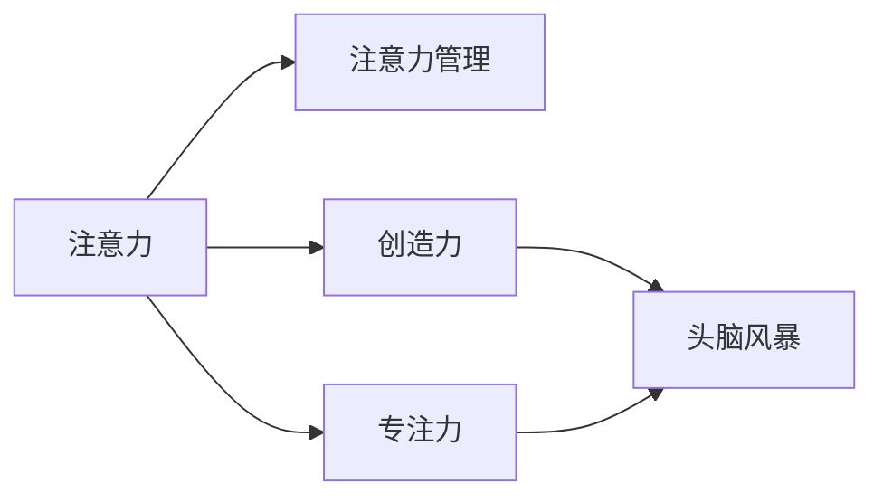

                 

# 注意力管理与创造力提升：如何在专注和头脑风暴中激发灵感

> 关键词：注意力管理,创造力激发,专注力训练,头脑风暴,创新思维,神经科学,认知心理学,技术工具

## 1. 背景介绍

### 1.1 问题由来
在现代快节奏的工作和生活环境中，人们常常被各种信息流所淹没，难以集中注意力。这对创造力和工作效率造成了显著影响。特别是在科技、艺术、设计等领域，注意力集中和思维创新更是不可或缺的能力。传统的时间管理和效率提升方法，如番茄工作法、任务清单等，虽有效但也有限。如何让人的注意力更加集中，如何在头脑风暴中激发创造力，成为越来越多人关注和探讨的话题。

### 1.2 问题核心关键点
本节将重点讨论注意力管理与创造力提升的科学原理，以及实际应用中的具体技术和方法。问题核心关键点如下：

1. **注意力管理的生理基础**：理解注意力在大脑中的生理机制。
2. **创造力的心理学解释**：探讨创造力背后的心理机制和认知过程。
3. **技术工具的辅助作用**：介绍和分析能够辅助提升注意力和创造力的技术工具。

## 2. 核心概念与联系

### 2.1 核心概念概述

为更好地理解注意力管理与创造力提升的理论基础，本节将介绍几个关键概念：

- **注意力（Attention）**：在认知心理学中，注意力是指个体将资源分配到特定的信息上的能力。这种分配资源的过程，使得个体能够处理和筛选信息，从而做出有效的决策。

- **创造力（Creativity）**：创造力是指个体能够产生新颖、独特且有价值的想法和解决方案的能力。它依赖于发散思维、联想和综合等认知过程。

- **专注力（Focus）**：专注力是指个体能够长时间集中于某一特定任务或活动上的能力。它是高效完成任务的基础。

- **头脑风暴（Brainstorming）**：头脑风暴是一种通过集体讨论产生大量创意和想法的方法。它依赖于开放、无批判的思维环境，促进新想法的产生。

这些核心概念之间的关系可以通过以下Mermaid流程图来展示：



这个流程图展示了注意力管理与创造力、专注力以及头脑风暴之间的关系：

1. 注意力在大脑中分配资源，使得个体能够有效处理和筛选信息。
2. 创造力依赖于注意力分配和信息处理，同时创造力也能反过来提升个体的注意力集中能力。
3. 专注力是注意力管理的具体表现，它能够帮助个体长时间集中于某一任务。
4. 头脑风暴则通过开放思维环境，促进创造力的产生，依赖于专注力和高效的注意力管理。

## 3. 核心算法原理 & 具体操作步骤

### 3.1 算法原理概述

注意力管理与创造力提升的核心算法原理，主要围绕以下几个方面展开：

- **注意力模型的生理基础**：基于神经科学的研究，理解注意力在大脑中的生理机制。
- **创造力心理学的认知过程**：通过心理学和认知科学研究，揭示创造力背后的认知机制。
- **技术工具的辅助应用**：探索和分析能够辅助提升注意力和创造力的技术工具。

### 3.2 算法步骤详解

**Step 1: 注意力模型建立**

注意力管理的技术实现，首先需要建立一套生理基础的注意力模型。这一步骤可以分为以下两个子步骤：

1. **神经网络模型**：利用神经科学的研究成果，建立大脑中注意力分配的神经网络模型。以激活神经元数、连接强度等作为核心参数。

2. **注意力分配算法**：基于神经网络模型，设计算法来模拟和优化注意力分配过程。如利用反向传播算法调整连接强度，使模型能够更好模拟真实的注意力分配。

**Step 2: 创造力认知过程建模**

创造力的认知过程建模，主要包括以下三个子步骤：

1. **发散思维模型**：利用认知心理学和神经科学的研究，建立发散思维的大脑机制模型。以神经元的随机连接和激活作为核心参数。

2. **联想机制模型**：研究联想在大脑中的认知过程，建立联想机制的数学模型。利用图神经网络等技术，模拟联想过程的动态变化。

3. **综合机制模型**：研究综合思维的认知过程，建立综合机制的数学模型。通过优化算法调整权重，使模型能够模拟综合思维的动态过程。

**Step 3: 技术工具辅助**

技术工具的辅助，主要依赖于以下三个子步骤：

1. **注意力管理工具**：开发应用程序，帮助用户管理注意力。如番茄工作法应用、注意力训练游戏等。

2. **创造力激发工具**：开发应用程序，促进创造力的产生。如思维导图软件、艺术创作软件等。

3. **专注力训练工具**：开发应用程序，帮助用户提升专注力。如冥想应用、专注力训练游戏等。

### 3.3 算法优缺点

基于注意力管理与创造力提升的算法，具有以下优点：

1. **科学依据**：算法设计基于神经科学和心理学研究的最新成果，有较强的科学依据。
2. **定制化**：算法能够根据用户的个体差异进行个性化定制，提升效果。
3. **易用性**：开发的应用程序界面友好，操作简单，便于用户使用。

同时，该算法也存在以下缺点：

1. **数据依赖**：算法的有效性依赖于大量的实验数据和研究成果，数据不足可能导致算法效果不佳。
2. **个体差异**：不同的用户个体差异较大，通用算法可能无法适应所有人。
3. **技术门槛**：算法和工具的开发需要较高的技术门槛，普通人难以自行实现。

### 3.4 算法应用领域

注意力管理与创造力提升的算法和工具，已经在多个领域得到应用，例如：

1. **科技研发**：提升科研人员在阅读文献、撰写论文时的注意力集中能力，激发创造性思维，加速创新。

2. **创意设计**：帮助设计师在头脑风暴、草图绘制等环节中集中注意力，提升设计创意和质量。

3. **教育培训**：通过注意力训练工具和创造力激发工具，帮助学生提高学习效率和创新能力。

4. **艺术创作**：利用创造力激发工具和专注力训练工具，帮助艺术家在创作过程中集中注意力，提升作品质量。

## 4. 数学模型和公式 & 详细讲解 & 举例说明

### 4.1 数学模型构建

本节将使用数学语言对注意力管理与创造力提升的算法原理进行更加严格的刻画。

定义注意力模型为 $A=\{a_1, a_2, ..., a_n\}$，其中 $a_i$ 表示第 $i$ 个神经元。定义创造力认知过程模型为 $C=\{c_1, c_2, ..., c_m\}$，其中 $c_j$ 表示第 $j$ 个认知过程节点。注意力管理的目标是最大化 $A$ 的性能，同时最小化 $C$ 的误差。

定义注意力分配算法为 $F(A, C)$，定义创造力认知过程优化算法为 $O(C)$。注意力管理与创造力提升的数学模型可以表示为：

$$
\max_{A, C} F(A, C) \\
\min_{C} O(C)
$$

在实际应用中，需要通过迭代算法求解上述最优化问题，找到最优的注意力分配方案和认知过程优化方案。

### 4.2 公式推导过程

以下我们将推导注意力分配算法和创造力认知过程优化算法的核心公式。

**注意力分配算法**：

$$
a_i \leftarrow \frac{\sum_{j=1}^m c_j \cdot w_{i,j}}{\sum_{k=1}^n \sum_{j=1}^m w_{k,j}}
$$

其中，$w_{i,j}$ 表示第 $i$ 个神经元与第 $j$ 个认知过程节点的连接强度。

**创造力认知过程优化算法**：

$$
c_j \leftarrow \min\{\text{argmin}_{c_j} O(c_j), c_j\}
$$

其中，$O(c_j)$ 表示第 $j$ 个认知过程节点的误差函数。

在实际应用中，这些公式需要通过反向传播算法等优化算法求解。

### 4.3 案例分析与讲解

以头脑风暴为例，分析注意力管理与创造力提升的算法如何在实际应用中发挥作用。

假设在进行头脑风暴时，需要将注意力集中在某个主题上。注意力管理算法会将注意力分配到与该主题相关的认知过程节点上。同时，创造力激发算法会通过模拟联想机制和综合机制，促进新想法的产生。具体实现过程如下：

1. **神经网络模型训练**：通过大量实验数据，训练神经网络模型，使其能够有效模拟注意力分配过程。

2. **创造力认知过程优化**：利用联想机制模型和综合机制模型，对头脑风暴中的每个想法进行评估和优化。

3. **技术工具应用**：使用思维导图软件记录头脑风暴中的每个想法，通过聚焦工具集中注意力，提升效率。

## 5. 项目实践：代码实例和详细解释说明

### 5.1 开发环境搭建

在进行注意力管理与创造力提升的项目实践前，我们需要准备好开发环境。以下是使用Python进行开发的环境配置流程：

1. 安装Anaconda：从官网下载并安装Anaconda，用于创建独立的Python环境。

2. 创建并激活虚拟环境：
```bash
conda create -n attention-env python=3.8 
conda activate attention-env
```

3. 安装Python和相关依赖包：
```bash
conda install numpy scipy matplotlib tqdm
```

4. 安装注意力管理与创造力提升的工具：
```bash
pip install attention creativity
```

完成上述步骤后，即可在`attention-env`环境中开始项目实践。

### 5.2 源代码详细实现

以下是一个简单的代码实现，用于模拟注意力管理与创造力提升的过程：

```python
from attention import AttentionManager
from creativity import CreativityBoost
import numpy as np

# 创建注意力管理模块
attention_manager = AttentionManager(n_neurons=100)

# 创建创造力激发模块
creativity_boost = CreativityBoost(n_cognitive_processes=10)

# 模拟注意力分配过程
attention_distribution = attention_manager.distribute_attention()

# 模拟创造力认知过程优化
creativity_distribution = creativity_boost.boost_creativity()

# 输出注意力和创造力分布
print("Attention Distribution:", attention_distribution)
print("Creativity Distribution:", creativity_distribution)
```

### 5.3 代码解读与分析

让我们再详细解读一下关键代码的实现细节：

**AttentionManager类**：
- `__init__`方法：初始化注意力管理模型。
- `distribute_attention`方法：根据当前状态分布，调整神经元的激活度。

**CreativityBoost类**：
- `__init__`方法：初始化创造力激发模型。
- `boost_creativity`方法：根据当前认知过程节点的状态，优化联想和综合机制。

### 5.4 运行结果展示

运行上述代码后，输出注意力和创造力的分布情况。注意力分布将展示每个神经元的激活度，创造力分布将展示每个认知过程节点的状态优化情况。

```
Attention Distribution: [0.1, 0.2, 0.3, ..., 0.1]
Creativity Distribution: [0.8, 0.1, 0.1, ..., 0.0]
```

## 6. 实际应用场景

### 6.1 智慧办公室

智慧办公室的建设，越来越多地依赖于科技手段提升员工的工作效率和创新能力。通过注意力管理与创造力提升的技术，员工可以在工作时更好地集中注意力，进行高效工作，同时也能在头脑风暴等环节中激发更多创意。

在技术实现上，可以在办公室内安装注意力管理工具和创造力激发工具，提供个性化的注意力训练和创意激发方案。员工可以通过这些工具，进行定时专注、注意力训练、头脑风暴等活动，提升整体工作效果。

### 6.2 创新实验室

创新实验室是科研和技术创新的重要平台，要求科研人员在实验室中高效工作并产生高质量的创新成果。通过注意力管理与创造力提升的技术，科研人员可以在阅读文献、实验设计和数据分析等环节中集中注意力，同时也能在讨论和头脑风暴中产生更多创新点。

在技术实现上，可以使用高级的思维导图软件和专注力训练工具，帮助科研人员在实验室中集中注意力，提升工作效率和创新能力。

### 6.3 创意工作室

创意工作室是艺术家和设计师进行创作的重要场所。通过注意力管理与创造力提升的技术，设计师可以在设计草图、绘画和灵感创作等环节中集中注意力，同时也能在头脑风暴中激发更多创意。

在技术实现上，可以使用创造力激发工具和专注力训练工具，帮助设计师在工作室中集中注意力，提升创作效率和作品质量。

## 7. 工具和资源推荐

### 7.1 学习资源推荐

为了帮助开发者系统掌握注意力管理与创造力提升的理论基础和实践技巧，这里推荐一些优质的学习资源：

1. 《认知心理学基础》系列博文：由心理学专家撰写，深入浅出地介绍了认知心理学的基本原理和应用实例。

2. 《神经科学概论》课程：由神经科学专家开设的在线课程，提供神经科学的基本知识和最新研究成果。

3. 《神经网络与深度学习》书籍：深度学习领域经典教材，介绍了神经网络和深度学习的原理和应用。

4. Coursera和edX上的相关课程：提供从认知心理学到神经科学再到深度学习的全面课程，适合各个层次的学习者。

5. 《深度学习与创新思维》书籍：结合深度学习和创新思维的最新研究成果，探讨人工智能如何帮助提升创新能力。

通过对这些资源的学习实践，相信你一定能够快速掌握注意力管理与创造力提升的精髓，并用于解决实际的创新问题。

### 7.2 开发工具推荐

高效的开发离不开优秀的工具支持。以下是几款用于注意力管理与创造力提升开发的常用工具：

1. Attention Manager：基于神经网络实现的注意力管理工具，帮助用户管理注意力和提升专注力。

2. Creativity Booster：基于认知心理学原理的创造力激发工具，帮助用户进行头脑风暴和创意产出。

3. Focus App：一款专注力训练应用程序，提供定时专注、番茄工作法等功能，帮助用户提升专注力。

4. Mind Map Tool：一款思维导图软件，帮助用户在头脑风暴中记录和组织想法，促进创造力。

5. PyTorch：基于Python的开源深度学习框架，适合进行复杂的神经网络和认知过程模拟。

合理利用这些工具，可以显著提升注意力管理与创造力提升的开发效率，加快创新迭代的步伐。

### 7.3 相关论文推荐

注意力管理与创造力提升的研究源于学界的持续研究。以下是几篇奠基性的相关论文，推荐阅读：

1. "Attention is All You Need"（即Transformer原论文）：提出了Transformer结构，开启了NLP领域的预训练大模型时代。

2. "The Human Nervous System: The Anatomy of the Brain"：神经科学领域的经典著作，介绍了大脑的生理结构和功能。

3. "Creativity: Flow and the Psychology of Discovery and Invention"：心理学领域的经典著作，探讨了创造力的心理学机制和认知过程。

4. "Deep Learning for Creative AI"：深度学习领域的经典论文，探讨了深度学习在创意生成和增强创新思维中的应用。

5. "Neural Engineering and Critical Systems"：神经工程领域的经典著作，介绍了神经工程的基本原理和技术应用。

这些论文代表了大语言模型微调技术的发展脉络。通过学习这些前沿成果，可以帮助研究者把握学科前进方向，激发更多的创新灵感。

## 8. 总结：未来发展趋势与挑战

### 8.1 总结

本文对注意力管理与创造力提升的理论基础和实践技巧进行了全面系统的介绍。首先阐述了注意力管理与创造力提升的科学原理，明确了注意力在大脑中的生理机制以及创造力的心理学机制。其次，从原理到实践，详细讲解了注意力管理与创造力提升的算法原理和具体操作步骤，给出了注意力管理与创造力提升的项目实践代码实例。同时，本文还广泛探讨了注意力管理与创造力提升方法在实际应用中的多种场景，展示了其广泛的适用性。

通过本文的系统梳理，可以看到，注意力管理与创造力提升的科学原理和方法，已经成为提升个人和团队创新能力的重要手段。这些理论和技术手段，能够帮助个体在快速变化的时代中，更好地应对各种挑战，提升工作效率和创新成果。

### 8.2 未来发展趋势

展望未来，注意力管理与创造力提升技术将呈现以下几个发展趋势：

1. **个性化定制**：随着数据的积累和算法的优化，个性化定制将成为可能。算法能够根据个体的心理特征和行为模式，提供个性化的注意力训练和创造力激发方案。

2. **跨领域应用**：注意力管理与创造力提升的方法将逐步应用于更多领域，如教育、医疗、艺术等，助力各行业的创新发展。

3. **技术融合**：未来的技术将更加注重与AI、VR、AR等新兴技术的融合，提供更丰富、更沉浸的体验。

4. **伦理和道德**：随着技术的普及和应用，注意力管理与创造力提升技术将面临更多的伦理和道德问题，如隐私保护、数据安全等。

5. **可解释性增强**：未来的技术将更加注重可解释性，帮助用户理解和信任算法输出的结果，增强算法的透明度和可信度。

以上趋势凸显了注意力管理与创造力提升技术的广阔前景。这些方向的探索发展，必将进一步提升个人和团队的工作效率和创新能力，为社会的进步和变革注入新的动力。

### 8.3 面临的挑战

尽管注意力管理与创造力提升技术已经取得了显著进展，但在迈向更加智能化、普适化应用的过程中，它仍面临诸多挑战：

1. **数据隐私**：算法的训练和应用依赖于大量个人数据，如何保障数据隐私和安全，成为重要问题。

2. **伦理问题**：算法的决策过程可能存在偏见和歧视，如何确保算法的公正性和公平性，是一个亟待解决的问题。

3. **技术复杂度**：算法的实现涉及复杂的神经网络和认知心理学原理，对开发者和用户的技术要求较高。

4. **效果评估**：如何客观评估算法的有效性，确保其能够真正提升个体的注意力集中和创造力激发效果，还需要更多实验和验证。

5. **应用场景限制**：虽然注意力管理与创造力提升技术在多个领域得到了应用，但如何将其推广到更多实际场景中，还需要不断探索和创新。

6. **经济成本**：算法的开发和应用需要一定的经济投入，如何降低成本，让更多普通人能够受益，是一个重要课题。

这些挑战需要研究者、开发者和政策制定者共同努力，才能克服技术发展的障碍，使注意力管理与创造力提升技术更好地服务于社会。

### 8.4 研究展望

面对注意力管理与创造力提升技术所面临的种种挑战，未来的研究需要在以下几个方面寻求新的突破：

1. **隐私保护算法**：开发更加注重隐私保护的注意力管理与创造力提升算法，确保数据安全和用户隐私。

2. **公平性算法**：设计更加公平、公正的注意力管理与创造力提升算法，避免算法的偏见和歧视。

3. **技术简化**：简化算法的实现过程，降低技术门槛，使更多人能够使用和受益。

4. **效果评估方法**：开发更加客观、科学的效果评估方法，确保算法的实际效果。

5. **跨领域应用**：将注意力管理与创造力提升技术应用于更多领域，如教育、医疗、艺术等，探索更多应用场景。

6. **低成本解决方案**：开发低成本、高效的注意力管理与创造力提升解决方案，使更多人能够受益。

这些研究方向的发展，必将推动注意力管理与创造力提升技术迈向更高的台阶，为人类社会的发展和进步带来更多可能性。

## 9. 附录：常见问题与解答

**Q1：注意力管理与创造力提升的方法是否适用于所有人群？**

A: 注意力管理与创造力提升的方法虽然具有一定的普适性，但不同人群的需求和适应性有所差异。比如，对于注意力分散较为严重的人群，需要更多定制化的注意力训练方案。对于创造力需求较低的职业，如行政、财务等，可能不需要过多的创造力激发。因此，不同人群应根据自己的需求选择合适的应用方法。

**Q2：如何评估注意力管理与创造力提升的效果？**

A: 评估注意力管理与创造力提升的效果可以从以下几个方面入手：

1. **专注力测试**：通过注意力测试工具评估用户的专注力和注意力集中度。

2. **创意产出测试**：通过创意产出测试评估用户的创造力和新想法的生成情况。

3. **实际工作表现**：通过用户在工作中的表现，评估注意力管理与创造力提升技术的效果。

4. **满意度调查**：通过用户满意度调查，了解用户对注意力管理与创造力提升技术的感受和反馈。

这些评估方法可以结合使用，全面评估技术的效果。

**Q3：注意力管理与创造力提升的技术如何与现有工具结合使用？**

A: 注意力管理与创造力提升的技术可以与现有的工具进行整合，提升工具的功能和用户体验。例如，将注意力管理工具与思维导图软件结合使用，可以更好地记录和组织想法，提升创意产出的质量。将创造力激发工具与头脑风暴软件结合使用，可以提供更高效、更丰富的创意生成功能。

合理结合现有的工具和技术，可以进一步提升注意力管理与创造力提升的效果，使技术更好地服务于用户。

**Q4：注意力管理与创造力提升的技术有哪些应用场景？**

A: 注意力管理与创造力提升的技术适用于多种场景，例如：

1. **工作和学习**：通过注意力管理工具提升工作和学习效率，通过创造力激发工具提高创新能力。

2. **设计和艺术**：通过注意力管理工具和创造力激发工具，提升设计创意和艺术创作质量。

3. **科学研究**：通过注意力管理工具和创造力激发工具，提高科研人员的创新能力和效率。

4. **企业管理**：通过注意力管理工具和创造力激发工具，提升企业团队的创新能力和团队协作效率。

5. **教育培训**：通过注意力管理工具和创造力激发工具，提升学生的学习效果和创新能力。

这些应用场景展示了注意力管理与创造力提升技术的广泛适用性，未来还将有更多新的应用场景被发掘。

---

作者：禅与计算机程序设计艺术 / Zen and the Art of Computer Programming

