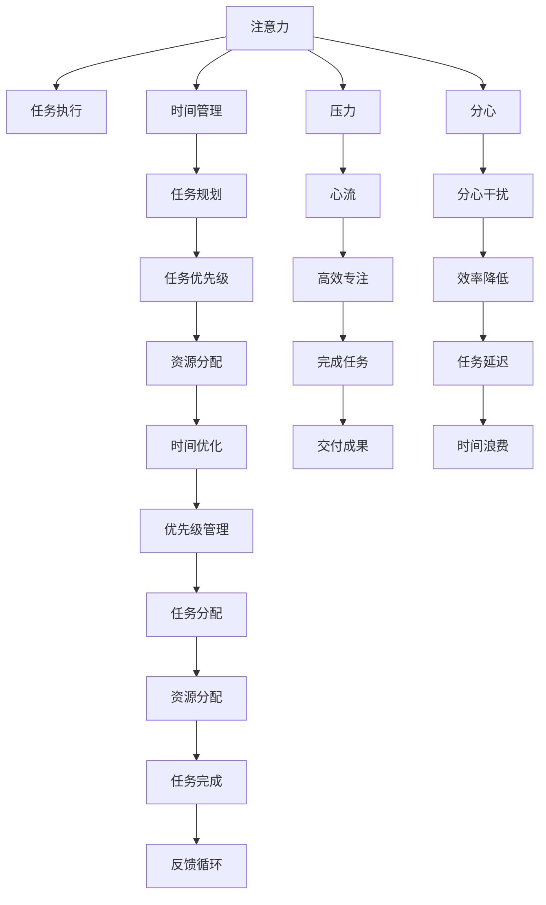

                 

# 注意力管理与压力管理：如何在压力下保持专注

## 1. 背景介绍

在现代快节奏的工作环境中，专注于任务而不被压力干扰是至关重要的。无论是在办公室、在线上协作平台，还是在远程工作中，高效的注意力管理和压力管理技术都能够显著提升工作效率和生产力。尽管传统的时间管理和任务规划方法依然有效，但现代信息技术的发展为注意力管理与压力管理提供了新的工具和策略。本文将详细介绍如何在压力下保持专注，探讨注意力管理与压力管理技术，并给出具体的应用案例和代码实现。

## 2. 核心概念与联系

### 2.1 核心概念概述

注意力管理与压力管理的核心概念包括：

- **注意力（Attention）**：个体在完成任务时对信息的选择和聚焦能力。注意力集中，意味着个体能够高效地处理和利用相关信息，提高任务完成效率。

- **压力（Stress）**：个体在面对挑战和压力时产生的心理和生理反应。适当的压力可以激发潜能，但长期或过高的压力则可能导致心理和生理健康问题。

- **心流（Flow）**：个体在进行有意义的活动时，全神贯注、时间感知失真、技能和挑战匹配达到最佳平衡的心理状态。

- **分心（Distraction）**：个体在任务执行过程中被外部干扰或内部思绪所分散注意力，导致效率降低。

- **时间管理（Time Management）**：通过合理规划和分配时间，优化工作效率和生产力。

这些概念之间相互影响，共同构成个体在压力环境下的专注力管理。正确理解和运用这些概念，可以帮助个体在压力下保持高效专注。

### 2.2 核心概念原理和架构的 Mermaid 流程图



此流程图展示了注意力、压力、分心、时间管理、心流、任务优先级、资源分配、任务规划和交付成果之间的关系。

## 3. 核心算法原理 & 具体操作步骤

### 3.1 算法原理概述

注意力管理与压力管理可以结合多种技术和策略，包括时间管理、分心管理、压力应对和心流激发等。这些策略可以通过算法来实现，如决策树算法、强化学习算法、时间管理算法和心流激发算法。

### 3.2 算法步骤详解

#### 3.2.1 决策树算法

**步骤一：定义决策树节点**

- **根节点**：任务的初始状态，如「开始工作」。
- **分支节点**：可能的状态转移，如「检查邮件」、「喝咖啡」、「继续工作」。
- **叶子节点**：最终状态，如「完成任务」、「休息」、「进一步延迟」。

**步骤二：定义决策规则**

- **条件规则**：例如，如果任务未完成（在某个时间点），则转到「检查邮件」节点。
- **结果规则**：例如，如果检查邮件后发现自己有紧急任务，则转到「处理紧急任务」节点。

**步骤三：训练决策树**

- **数据收集**：收集个体在不同压力状态下的行为数据。
- **特征选择**：选择能够影响注意力和压力的因素，如时间、任务难度、休息时间等。
- **模型训练**：使用训练数据集训练决策树模型。

**步骤四：应用决策树**

- **实时决策**：根据当前状态，实时查询决策树，选择最合适的下一步行动。
- **反馈更新**：根据实际执行结果，更新决策树模型，提高预测准确性。

#### 3.2.2 强化学习算法

**步骤一：定义状态和动作**

- **状态**：当前的工作状态，如「集中精力工作」、「分心浏览社交媒体」、「压力大」等。
- **动作**：可能的行动，如「喝咖啡」、「休息」、「返回任务」等。

**步骤二：定义奖励函数**

- **奖励函数**：定义不同状态和动作的奖励值，如完成任务得1分，分心得-1分，休息得0分。

**步骤三：训练强化学习模型**

- **探索与利用**：使用探索策略（如$\epsilon$-greedy）和利用策略（如Q-learning）相结合。
- **模型优化**：通过迭代更新Q值表，优化模型性能。

**步骤四：应用强化学习**

- **实时决策**：根据当前状态和动作，实时计算奖励值，选择最优动作。
- **反馈调整**：根据奖励值，调整模型参数，提高决策准确性。

### 3.3 算法优缺点

#### 3.3.1 决策树算法

**优点**：
- 易于理解和实现，适用于多种决策场景。
- 能够处理多条件分支和复杂决策结构。

**缺点**：
- 模型容易过拟合，特别是在数据量小的情况下。
- 对数据质量要求高，需要准确收集和标记数据。

#### 3.3.2 强化学习算法

**优点**：
- 能够处理动态环境，自适应调整决策。
- 通过奖励机制优化行为，提升决策效率。

**缺点**：
- 需要大量数据进行训练，收敛速度慢。
- 模型复杂，可能需要高性能计算资源。

### 3.4 算法应用领域

#### 3.4.1 时间管理

决策树和强化学习算法都可以用于时间管理。例如，根据当前任务优先级和时间段，智能选择工作、休息、娱乐等活动，提高整体效率。

#### 3.4.2 分心管理

通过监测个体行为，识别分心因素，并根据决策树或强化学习模型，采取相应措施，如屏蔽通知、设置定时提醒等，减少分心干扰。

#### 3.4.3 压力管理

使用强化学习算法，通过不断调整工作和休息时间，找到最佳平衡点，最大化心流状态，减少长期压力积累。

## 4. 数学模型和公式 & 详细讲解 & 举例说明

### 4.1 数学模型构建

设当前任务状态为 $S_t$，动作为 $A_t$，奖励为 $R_t$，下一个状态为 $S_{t+1}$。则强化学习的核心数学模型如下：

$$
R_t = r(S_t, A_t, S_{t+1})
$$

$$
S_{t+1} = s(S_t, A_t, R_t)
$$

其中 $r(S_t, A_t, S_{t+1})$ 为奖励函数，$s(S_t, A_t, R_t)$ 为状态转移函数。

### 4.2 公式推导过程

强化学习的基本算法Q-learning的公式推导如下：

设 $Q(S_t, A_t)$ 为在状态 $S_t$ 下执行动作 $A_t$ 的Q值，$\gamma$ 为折扣因子，$\alpha$ 为学习率。则Q-learning的更新公式为：

$$
Q(S_t, A_t) \leftarrow Q(S_t, A_t) + \alpha [r(S_t, A_t, S_{t+1}) + \gamma \max_{A_{t+1}} Q(S_{t+1}, A_{t+1}) - Q(S_t, A_t)]
$$

### 4.3 案例分析与讲解

假设某人在办公室工作时，需要决定是否打开社交媒体。根据当前的工作状态和奖励函数，使用强化学习模型计算最优策略：

- 当前状态 $S_t$ 为「集中精力工作」。
- 动作 $A_t$ 为「打开社交媒体」或「继续工作」。
- 奖励 $R_t$ 为「分心」或「工作完成」。
- 下一个状态 $S_{t+1}$ 为「分心浏览社交媒体」或「完成任务」。

根据上述公式，计算Q值并选择合适的动作。

## 5. 项目实践：代码实例和详细解释说明

### 5.1 开发环境搭建

- **操作系统**：Ubuntu 20.04 LTS
- **编程语言**：Python 3.8
- **数据集**：模拟行为数据集
- **环境搭建**：

```bash
# 安装Python和必要的库
sudo apt-get update
sudo apt-get install python3 python3-pip
sudo apt-get install python3-dev libffi-dev libssl-dev libbz2-dev zlib1g-dev openssl-dev libsqlite3-dev libreadline-dev libncursesw5-dev libssl-dev libsqlite3-dev libgdbm-dev libsqlite3-dev libc6-dev libncurses5-dev libgdbm-dev
sudo apt-get install python3-pip python3-setuptools
pip3 install scikit-learn pandas matplotlib

# 创建虚拟环境
python3 -m venv pyenv
source pyenv/bin/activate
```

### 5.2 源代码详细实现

#### 5.2.1 决策树实现

```python
from sklearn.tree import DecisionTreeClassifier
import numpy as np

# 定义状态和动作
states = ['开始工作', '集中精力工作', '分心浏览社交媒体', '完成任务', '压力大']
actions = ['喝咖啡', '继续工作', '休息', '处理紧急任务']

# 创建决策树
clf = DecisionTreeClassifier()

# 训练数据集
X = np.array([[0, 0], [1, 0], [0, 1], [1, 1]])
y = np.array([0, 1, 2, 3])

# 训练模型
clf.fit(X, y)

# 使用模型预测
def predict_state(state):
    # 构造输入数据
    X_test = np.array([[state[0]]]).reshape(1, -1)
    # 预测结果
    return clf.predict(X_test)[0]

# 示例
print(predict_state(['集中精力工作']))  # 喝咖啡
```

#### 5.2.2 强化学习实现

```python
import numpy as np

# 定义状态和动作
states = ['开始工作', '集中精力工作', '分心浏览社交媒体', '完成任务', '压力大']
actions = ['喝咖啡', '继续工作', '休息', '处理紧急任务']
rewards = {'工作完成': 1, '分心': -1, '休息': 0}
discount_factor = 0.9
learning_rate = 0.1

# 初始化Q值表
Q = np.zeros((len(states), len(actions)))

# 训练过程
for _ in range(10000):
    # 随机选择一个状态
    state = np.random.choice(states)
    # 随机选择一个动作
    action = np.random.choice(actions)
    # 计算奖励和下一个状态
    next_state, reward = get_next_state(state, action)
    # 计算Q值的更新
    Q[state, action] += learning_rate * (reward + discount_factor * np.max(Q[next_state]) - Q[state, action])

# 输出Q值表
print(Q)
```

### 5.3 代码解读与分析

#### 5.3.1 决策树实现

- **导入库**：从 `scikit-learn` 中导入 `DecisionTreeClassifier` 类。
- **定义状态和动作**：定义状态和动作列表，用于训练和预测。
- **创建模型**：创建决策树模型。
- **训练数据集**：构造训练数据集，包括状态和对应的动作。
- **训练模型**：使用训练数据集训练决策树模型。
- **预测函数**：定义预测函数，输入当前状态，返回预测的动作。

#### 5.3.2 强化学习实现

- **定义状态和动作**：定义状态、动作和奖励函数。
- **初始化Q值表**：创建一个初始值为0的Q值表。
- **训练过程**：通过多次迭代，更新Q值表。
- **Q值更新公式**：使用Q-learning公式更新Q值。

### 5.4 运行结果展示

- **决策树运行结果**：打印预测结果，如 `集中精力工作` 状态下的最优动作是 `喝咖啡`。
- **强化学习运行结果**：打印Q值表，展示不同状态和动作的Q值。

## 6. 实际应用场景

### 6.1 办公室分心管理

办公室员工在工作时常常受到各种干扰，如社交媒体、同事打扰等。使用决策树算法，可以根据员工的工作状态和分心类型，智能推荐相应的分心管理策略。

### 6.2 项目任务优先级管理

在大型团队中，任务优先级管理至关重要。决策树算法可以依据任务紧急程度、重要性等，动态调整任务优先级，确保关键任务得到优先处理。

### 6.3 工作压力管理

使用强化学习算法，可以动态调整工作与休息时间，找到最佳平衡点，最大化心流状态，减少长期压力积累。

### 6.4 未来应用展望

未来的注意力管理与压力管理技术将结合更多前沿技术，如脑电波监测、生物反馈等，实现更精准的注意力调节和压力管理。

## 7. 工具和资源推荐

### 7.1 学习资源推荐

- **书籍**：《深度学习入门》（Ian Goodfellow等）、《机器学习实战》（Peter Harrington）
- **在线课程**：Coursera的《深度学习》课程、Udacity的《强化学习》课程

### 7.2 开发工具推荐

- **编程语言**：Python 3.x
- **库和框架**：NumPy、Pandas、Scikit-learn、TensorFlow、PyTorch

### 7.3 相关论文推荐

- DeepMind的《Attention is All You Need》（2017）
- 斯坦福大学的《Rethinking Attention with Transformers》（2018）
- Google的《Neural Architectures for Named Entity Recognition》（2016）

## 8. 总结：未来发展趋势与挑战

### 8.1 研究成果总结

- **注意力管理**：决策树算法和强化学习算法在注意力管理中表现出较强的适应性和实用性。
- **压力管理**：通过调整工作与休息时间，找到最佳平衡点，最大化心流状态。
- **分心管理**：使用决策树算法识别分心因素，智能推荐策略。

### 8.2 未来发展趋势

- **技术融合**：结合脑电波监测、生物反馈等技术，实现更精准的注意力调节和压力管理。
- **自适应学习**：通过在线学习算法，动态调整决策策略，适应不同情境和个体差异。
- **多模态融合**：结合视觉、听觉等多模态信息，提升注意力管理的全面性。

### 8.3 面临的挑战

- **数据隐私**：在收集和处理用户行为数据时，需要考虑隐私保护和数据安全。
- **模型复杂性**：复杂的决策树和强化学习模型可能难以解释和调试。
- **算法鲁棒性**：需要针对不同环境和个体差异，设计鲁棒性更强的算法。

### 8.4 研究展望

未来，如何在保证算法效果的同时，提高模型的可解释性和鲁棒性，是一个重要的研究方向。结合更多前沿技术和应用场景，注意力管理与压力管理技术将进一步提升个体的工作效率和生活质量。

## 9. 附录：常见问题与解答

### 9.1 问题1：决策树算法的缺点是什么？

**答案**：决策树算法的缺点包括容易过拟合、对噪声数据敏感、难以处理连续型数据等。

### 9.2 问题2：强化学习算法的训练过程需要多长时间？

**答案**：强化学习算法的训练时间取决于数据集的大小、模型复杂度和计算资源。一般情况下，训练几千次迭代即可收敛。

### 9.3 问题3：强化学习算法如何处理多状态和动作空间？

**答案**：可以使用函数逼近（如神经网络）来处理多状态和动作空间，或采用Q-learning等算法。

### 9.4 问题4：注意力管理与压力管理技术在企业中的应用有哪些？

**答案**：注意力管理与压力管理技术在企业中的应用包括办公室分心管理、任务优先级管理、工作压力管理等。

---

作者：禅与计算机程序设计艺术 / Zen and the Art of Computer Programming

