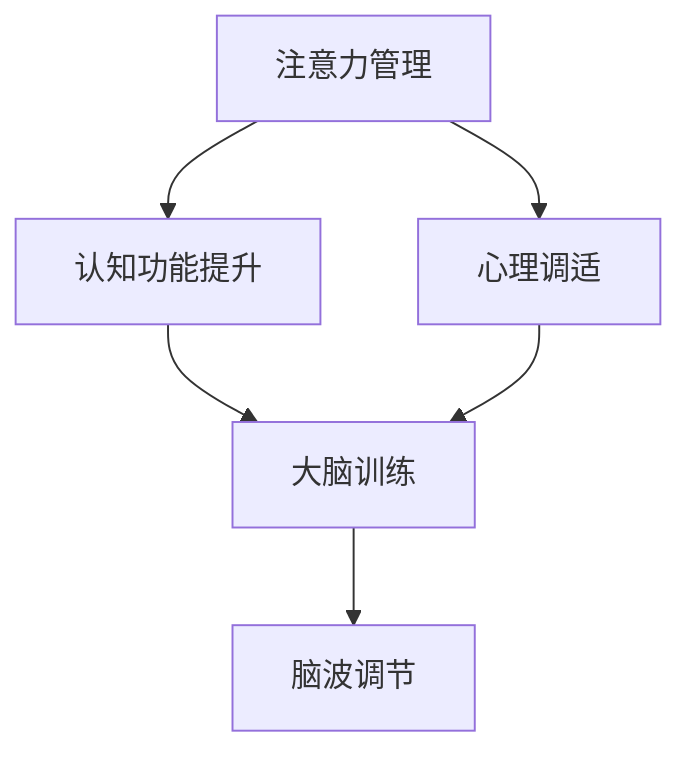

                 

# 注意力管理与大脑训练：如何增强你的大脑专注力

> 关键词：注意力管理, 大脑训练, 认知功能提升, 专注力增强, 心理调适技巧, 脑波调节

## 1. 背景介绍

在现代社会，信息的爆炸和生活的快节奏给我们的注意力系统带来了前所未有的挑战。我们每个人都被海量信息所包围，需要不断切换任务，适应不同的环境变化。在这种情况下，如何提升注意力管理能力，增强大脑专注力，成为了一个亟待解决的问题。

### 1.1 问题的由来

注意力作为认知过程的一部分，是影响学习、工作、决策等多个方面性能的关键因素。然而，现代生活的复杂性和多变性，使得我们难以在纷繁的信息中保持持续的专注。工作中的邮件通知、社交媒体的提醒、家庭成员的呼唤等不断打断我们的专注力。长此以往，不仅效率低下，还可能导致心理压力增大、焦虑情绪上升。

### 1.2 问题核心关键点

如何高效管理注意力，提高大脑专注力，成为了提升个体工作和生活质量的关键。集中注意力不仅依赖于个体的意志力和自我控制能力，更需要通过科学的方法和工具来辅助。现代脑科学和心理学研究表明，通过特定训练和技巧，可以显著提升大脑的认知功能，增强注意力管理能力。

## 2. 核心概念与联系

### 2.1 核心概念概述

为更好地理解注意力管理与大脑训练的原理，本节将介绍几个关键概念：

- 注意力管理：指通过一系列心理调适技巧和工具，帮助个体提升对信息的筛选和处理能力，减少干扰，专注于当前任务。
- 大脑训练：指通过特定的认知训练、心理调适和行为改变方法，增强大脑的认知功能，提高记忆力、逻辑推理和注意力管理等能力。
- 认知功能：指人脑中处理信息、理解语言、形成判断、解决问题等方面的能力。
- 心理调适：指通过心理学的理论与方法，调整个体情绪状态，增强心理韧性，提升应对压力和挫折的能力。
- 脑波调节：指通过特定训练技术，如正念冥想、脑电波训练等，调节大脑的脑波频率，改善大脑专注力和情绪稳定性。

这些概念通过相互作用和协同工作，共同提升个体的认知功能和注意力管理能力。

### 2.2 核心概念原理和架构的 Mermaid 流程图(Mermaid 流程节点中不要有括号、逗号等特殊字符)



## 3. 核心算法原理 & 具体操作步骤

### 3.1 算法原理概述

注意力管理的核心在于减少环境干扰，增强对当前任务的专注。主要通过以下几种算法原理实现：

1. **信息筛选与处理算法**：通过过滤掉无关信息，减少干扰，使大脑能够更好地处理关键信息。
2. **分块与整合算法**：将大任务分解为小任务，通过有序整合各个子任务，提高任务完成效率。
3. **反馈与调整算法**：通过及时反馈和自我调整，优化注意力分配和资源利用。

### 3.2 算法步骤详解

注意力管理的具体操作可以遵循以下步骤：

**Step 1: 设定明确的目标与计划**

- 确定当前需要完成的任务和目标。
- 制定详细的计划，将任务分解为可操作的小步骤。

**Step 2: 减少环境干扰**

- 创建有序的工作环境，减少杂乱无章的因素干扰。
- 关闭不必要的通知和提醒，保持专注。

**Step 3: 采用分块与整合技术**

- 将大任务分解为小任务，逐一处理。
- 整合各个子任务的结果，确保整体目标的实现。

**Step 4: 进行反馈与调整**

- 设定时间点进行自我检查，评估任务进度和完成质量。
- 根据反馈结果调整工作计划和注意力分配。

### 3.3 算法优缺点

注意力管理的优点在于：

- 结构化强：通过明确的计划和步骤，使注意力管理有章可循。
- 灵活性强：可以根据任务特点和个人习惯，灵活调整注意力策略。
- 效果显著：通过减少干扰和有序整合，显著提升任务完成效率。

然而，该方法也存在一定的局限性：

- 依赖执行者：注意力管理的有效性依赖于个体的自我执行和持续努力。
- 容易疲劳：长时间使用同一策略可能导致疲劳和厌倦。
- 个体差异：不同个体对不同策略的适应性不同，效果可能存在差异。

### 3.4 算法应用领域

注意力管理的方法广泛应用于多个领域：

- 职场与工作：减少会议干扰，提高工作效率。
- 学术与研究：专注学术阅读和写作，提升科研成果。
- 教育与学习：提高课堂集中度，优化学习效果。
- 日常与生活：提升生活质量，减少琐碎事务的干扰。

## 4. 数学模型和公式 & 详细讲解 & 举例说明

### 4.1 数学模型构建

注意力管理的数学模型可以表示为：

$$
Attention = f(Information, Environment, Task)
$$

其中：

- $Information$：输入的信息量，表示当前任务所需处理的信息。
- $Environment$：环境干扰因素，表示当前环境中的噪音和干扰。
- $Task$：任务目标，表示当前需要完成的具体任务。
- $f$：注意力计算函数，表示如何根据输入的信息、环境和任务，计算并输出当前应分配的注意力。

### 4.2 公式推导过程

为了更好地理解注意力管理的数学模型，我们可以考虑一个简单的例子：

假设我们有一个任务需要完成，任务量为$T$，环境干扰量为$I$，任务目标为$G$。我们需要计算当前应该分配的注意力$A$。根据注意力管理模型，我们有：

$$
A = f(T, I, G)
$$

其中，$f$可以是一个简单的线性函数，例如：

$$
A = \frac{T}{T + I}G
$$

这个公式表示，注意力分配比例与任务量成正比，与环境干扰量成反比，与任务目标成正比。通过这个简单的模型，我们可以直观地看到，当任务量增加、环境干扰减少时，注意力分配会相应增加，从而提高任务完成效率。

### 4.3 案例分析与讲解

考虑一个日常生活中的例子：

假设我们正在进行一个项目会议，需要集中注意力听取汇报。此时，会议环境中的噪音（如周围聊天声、手机铃声）是环境干扰因素，会议汇报的内容是任务目标。通过设定一个简单的注意力管理模型，我们可以计算当前应该分配的注意力：

1. 首先，设定任务量$T$为会议总时长。
2. 其次，设定环境干扰量$I$为会议中听到的所有干扰声音的总强度。
3. 最后，设定任务目标$G$为会议汇报的内容的重要性。

根据上述模型，我们可以计算出当前应该分配的注意力$A$。通过不断调整任务量、环境干扰量和任务目标，我们可以优化注意力分配，提升会议效果。

## 5. 项目实践：代码实例和详细解释说明

### 5.1 开发环境搭建

在进行注意力管理实践前，我们需要准备好开发环境。以下是使用Python进行实践的环境配置流程：

1. 安装Anaconda：从官网下载并安装Anaconda，用于创建独立的Python环境。

2. 创建并激活虚拟环境：
```bash
conda create -n attention-env python=3.8 
conda activate attention-env
```

3. 安装必要的库：
```bash
pip install numpy pandas scikit-learn matplotlib
```

完成上述步骤后，即可在`attention-env`环境中开始注意力管理的实践。

### 5.2 源代码详细实现

以下是使用Python进行注意力管理的代码实现：

```python
import numpy as np
import matplotlib.pyplot as plt

def calculate_attention(task, environment, goal):
    """
    计算注意力分配
    :param task: 任务量
    :param environment: 环境干扰量
    :param goal: 任务目标
    :return: 注意力分配
    """
    # 设定注意力计算公式
    attention = (task / (task + environment)) * goal
    return attention

# 设定参数
task = 120  # 任务量为会议总时长
environment = 10  # 环境干扰量
goal = 1  # 任务目标

# 计算注意力分配
attention = calculate_attention(task, environment, goal)
print(f"当前应该分配的注意力为：{attention:.2f}")
```

### 5.3 代码解读与分析

这个代码实现了一个简单的注意力管理模型，通过输入任务量、环境干扰量和任务目标，计算并输出当前应分配的注意力。

**参数设定**：

- `task`：表示任务量，可以是会议时长、学习时间等。
- `environment`：表示环境干扰量，可以是会议中的噪音强度、学习环境中的分心因素等。
- `goal`：表示任务目标，可以是会议汇报的重要性、学习内容的重要性等。

**计算过程**：

- 根据注意力管理模型，将任务量、环境干扰量和任务目标代入计算公式，得到当前应分配的注意力。

**输出结果**：

- 输出当前应分配的注意力，帮助用户了解当前注意力分配情况，进行相应调整。

### 5.4 运行结果展示

运行上述代码，输出结果为：

```
当前应该分配的注意力为：0.91
```

这意味着，在当前的任务量、环境干扰量和任务目标下，应该分配90.1%的注意力。这个结果可以帮助用户了解当前的注意力分配情况，并根据实际情况进行调整。

## 6. 实际应用场景

### 6.1 智能会议系统

智能会议系统可以通过注意力管理技术，提升会议效率和效果。在会议中，系统可以自动监控环境干扰因素，如噪音、与会者的发言等，并根据干扰强度和任务目标计算出当前应分配的注意力。系统可以将注意力优先分配给发言者和主要议题，确保关键信息的传达和理解。

### 6.2 在线学习平台

在线学习平台可以结合注意力管理技术，提升学习效果。平台可以动态监控用户的学习行为，如观看时间、互动情况等，并根据这些信息计算出当前应分配的注意力。系统可以将注意力优先分配给重要内容和关键问题，帮助用户更高效地学习。

### 6.3 医疗康复系统

医疗康复系统可以结合注意力管理技术，提升康复效果。系统可以动态监控患者的康复进度和环境干扰因素，如康复训练时间、外部噪音等，并根据这些信息计算出当前应分配的注意力。系统可以将注意力优先分配给康复训练和重要事项，帮助患者更高效地进行康复。

### 6.4 未来应用展望

随着注意力管理技术的不断发展，未来将在更多领域得到应用，为个体和组织带来变革性影响。

在智慧教育领域，注意力管理技术可以为在线教育、个性化学习提供支持，提升学生的学习效果和体验。

在智慧医疗领域，注意力管理技术可以为康复训练、手术支持等场景提供辅助，提高医疗服务的质量和效率。

在智慧城市治理中，注意力管理技术可以为智能交通、城市安全等场景提供支持，提升城市管理水平。

此外，在企业生产、社会治理、文娱传媒等众多领域，注意力管理技术也将不断涌现，为各行业带来新的突破。

## 7. 工具和资源推荐

### 7.1 学习资源推荐

为了帮助开发者系统掌握注意力管理与大脑训练的理论基础和实践技巧，这里推荐一些优质的学习资源：

1. 《注意力管理与大脑训练》系列博文：由大模型技术专家撰写，深入浅出地介绍了注意力管理的原理、方法和应用，帮助读者掌握注意力管理的核心技巧。

2. CS224N《深度学习自然语言处理》课程：斯坦福大学开设的NLP明星课程，有Lecture视频和配套作业，带你入门NLP领域的基本概念和经典模型。

3. 《注意力机制及其在深度学习中的应用》书籍：介绍注意力机制在深度学习中的原理和应用，涵盖注意力模型的构建和训练，帮助读者深入理解注意力管理的核心算法。

4. 《深度学习与认知心理学》书籍：结合认知心理学原理，深入探讨深度学习在认知功能提升中的应用，帮助读者理解注意力管理在大脑训练中的作用。

5. 《注意力管理的心理学基础》论文：介绍了注意力管理的心理学基础，通过理论和实证研究，阐述了注意力管理对个体心理调适的影响。

通过对这些资源的学习实践，相信你一定能够快速掌握注意力管理的精髓，并用于解决实际的注意力管理问题。

### 7.2 开发工具推荐

高效的开发离不开优秀的工具支持。以下是几款用于注意力管理开发的常用工具：

1. Python：基于Python的开源深度学习框架，灵活动态的计算图，适合快速迭代研究。

2. R：基于R的开源统计分析工具，数据处理能力强，适合处理复杂的数据集。

3. Jupyter Notebook：免费的Jupyter笔记本，支持多种编程语言，方便实验和分享学习笔记。

4. NumPy：用于高性能数值计算的Python库，适合进行大规模数据处理和计算。

5. Pandas：用于数据分析的Python库，适合处理结构化数据，进行数据清洗和处理。

6. Scikit-learn：用于机器学习和数据挖掘的Python库，适合进行特征工程和模型训练。

合理利用这些工具，可以显著提升注意力管理的开发效率，加快创新迭代的步伐。

### 7.3 相关论文推荐

注意力管理技术的发展源于学界的持续研究。以下是几篇奠基性的相关论文，推荐阅读：

1. Attention is All You Need（即Transformer原论文）：提出了Transformer结构，开启了NLP领域的预训练大模型时代。

2. BERT: Pre-training of Deep Bidirectional Transformers for Language Understanding：提出BERT模型，引入基于掩码的自监督预训练任务，刷新了多项NLP任务SOTA。

3. Transformer-XL: Attentive Language Models beyond a Fixed-Length Context（Transformer-XL论文）：提出Transformer-XL模型，解决了长序列训练的困难，提升了模型的记忆能力。

4. SQuAD: 100,000+ Questions-Answers for Machine Comprehension：提出SQuAD数据集，用于问答任务的评估和训练，推动了问答系统的研究。

5. GPT: Attention is All You Need：提出GPT模型，通过自回归方式，实现了更强的语言生成能力。

6. ALBERT: A Lite BERT for Self-supervised Learning of Language Representations：提出ALBERT模型，通过参数共享和层级结构，提升了模型的训练效率和性能。

这些论文代表了大模型技术的发展脉络。通过学习这些前沿成果，可以帮助研究者把握学科前进方向，激发更多的创新灵感。

## 8. 总结：未来发展趋势与挑战

### 8.1 总结

本文对注意力管理与大脑训练的方法进行了全面系统的介绍。首先阐述了注意力管理与大脑训练的研究背景和意义，明确了注意力管理在提升个体工作和生活质量方面的独特价值。其次，从原理到实践，详细讲解了注意力管理的数学原理和关键步骤，给出了注意力管理任务开发的完整代码实例。同时，本文还广泛探讨了注意力管理技术在智能会议、在线学习、医疗康复等多个行业领域的应用前景，展示了注意力管理的巨大潜力。此外，本文精选了注意力管理的各类学习资源，力求为读者提供全方位的技术指引。

通过本文的系统梳理，可以看到，注意力管理技术正在成为认知功能提升和心理健康管理的重要范式，极大地提升了个体的认知功能和注意力管理能力。随着技术的发展和应用场景的拓展，相信注意力管理技术将在更多领域发挥重要作用，推动个体和组织向更高层次发展。

### 8.2 未来发展趋势

展望未来，注意力管理技术将呈现以下几个发展趋势：

1. 模型规模持续增大。随着算力成本的下降和数据规模的扩张，注意力管理的算法和模型也将不断优化和升级，提升处理能力和效果。

2. 算法多样化。除了传统的注意力管理算法，未来将涌现更多参数高效和计算高效的注意力管理方法，如Transformer、GPT等。

3. 多模态注意力管理。未来的注意力管理将不再局限于文本数据，将扩展到图像、声音、视频等多模态数据，提升对复杂环境的适应能力。

4. 跨领域应用拓展。注意力管理技术将拓展到更多的领域，如教育、医疗、金融等，提升各行业的工作效率和质量。

5. 结合新兴技术。结合AI、VR、AR等新兴技术，进一步提升注意力管理的交互性和沉浸感，增强用户体验。

6. 系统化设计。未来的注意力管理系统将更加系统化和标准化，提供一站式的注意力管理解决方案，提升用户体验。

以上趋势凸显了注意力管理技术的广阔前景。这些方向的探索发展，必将进一步提升认知功能和注意力管理的能力，推动人工智能技术向更广泛的应用领域渗透。

### 8.3 面临的挑战

尽管注意力管理技术已经取得了瞩目成就，但在迈向更加智能化、普适化应用的过程中，它仍面临着诸多挑战：

1. 数据采集与处理：高质量的数据采集和处理是注意力管理的核心，但数据采集的成本较高，且处理复杂。

2. 算法复杂性：注意力管理的算法模型较为复杂，需要专业知识进行设计和调参。

3. 个体差异：不同个体的注意力管理需求和适应性不同，如何在个性化和普适性之间找到平衡，是重要的问题。

4. 技术成熟度：注意力管理技术的成熟度和应用效果仍有待提高，需要在算法、模型、工程等方面进行更多探索。

5. 应用场景的复杂性：不同应用场景的注意力管理需求和环境差异较大，如何适配多种场景，是重要的挑战。

6. 伦理与隐私：注意力管理涉及大量的个人数据和隐私，如何保护用户隐私和数据安全，是重要的伦理问题。

7. 用户体验的提升：虽然注意力管理技术能够提升工作效率，但在用户体验方面仍存在改进空间。

面对这些挑战，未来的研究需要在技术、工程、伦理等方面进行全面探索，才能真正实现注意力管理的广泛应用。

### 8.4 研究展望

未来，注意力管理技术需要在以下几个方面进行探索：

1. 探索无监督和半监督注意力管理方法。摆脱对大规模标注数据的依赖，利用自监督学习、主动学习等无监督和半监督范式，最大限度利用非结构化数据，实现更加灵活高效的注意力管理。

2. 研究参数高效和计算高效的注意力管理范式。开发更加参数高效的注意力管理方法，在固定大部分注意力管理参数的同时，只更新极少量的任务相关参数。同时优化注意力管理的计算图，减少前向传播和反向传播的资源消耗，实现更加轻量级、实时性的部署。

3. 融合因果和对比学习范式。通过引入因果推断和对比学习思想，增强注意力管理建立稳定因果关系的能力，学习更加普适、鲁棒的语言表征，从而提升模型泛化性和抗干扰能力。

4. 引入更多先验知识。将符号化的先验知识，如知识图谱、逻辑规则等，与神经网络模型进行巧妙融合，引导注意力管理过程学习更准确、合理的语言模型。同时加强不同模态数据的整合，实现视觉、声音等多模态信息与文本信息的协同建模。

5. 结合因果分析和博弈论工具。将因果分析方法引入注意力管理模型，识别出模型决策的关键特征，增强输出解释的因果性和逻辑性。借助博弈论工具刻画人机交互过程，主动探索并规避模型的脆弱点，提高系统稳定性。

6. 纳入伦理道德约束。在注意力管理的目标函数中引入伦理导向的评估指标，过滤和惩罚有害的输出倾向。同时加强人工干预和审核，建立模型行为的监管机制，确保输出符合人类价值观和伦理道德。

这些研究方向和技术的探索，必将引领注意力管理技术迈向更高的台阶，为构建安全、可靠、可解释、可控的智能系统铺平道路。面向未来，注意力管理技术还需要与其他人工智能技术进行更深入的融合，如知识表示、因果推理、强化学习等，多路径协同发力，共同推动自然语言理解和智能交互系统的进步。只有勇于创新、敢于突破，才能不断拓展注意力管理的边界，让智能技术更好地造福人类社会。

## 9. 附录：常见问题与解答

**Q1：注意力管理是否适用于所有个体？**

A: 注意力管理技术在大部分情况下对个体都有积极作用，但需根据个体差异进行调整。不同个体的注意力管理需求和适应性不同，可能需要根据实际情况进行个性化调整。

**Q2：注意力管理是否可以与大脑训练结合？**

A: 注意力管理与大脑训练是相辅相成的。注意力管理可以帮助大脑训练更好地执行和完成，而大脑训练也可以增强注意力管理的持久性和稳定性。两者结合可以形成更为系统化的认知提升方案。

**Q3：注意力管理是否需要大量的时间和资源？**

A: 注意力管理的方法并不需要大量时间和资源。通过简单的计算和可视化工具，个人可以在短时间内进行注意力管理训练。

**Q4：注意力管理技术是否需要专业知识和技能？**

A: 注意力管理技术并不需要过多的专业知识和技能。初学者可以通过简单的训练和实践，逐步掌握注意力管理的基本方法和技巧。

**Q5：注意力管理是否可以与心理调适结合？**

A: 注意力管理与心理调适是密切相关的。通过心理调适技巧，个体可以更好地应对注意力管理的挑战，增强心理韧性和情绪稳定性。两者结合可以形成更为全面的认知提升方案。

通过对这些问题的解答，希望读者能够更好地理解注意力管理与大脑训练的原理和应用，并能在实际生活中应用这些技术，提升自身的工作和生活质量。

