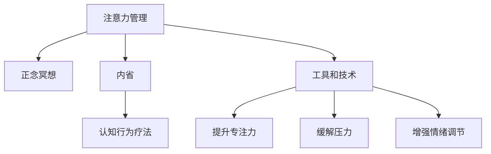

                 

# 注意力管理与正念冥想实践：通过内省增强专注力和心灵平和

> 关键词：注意力管理, 正念冥想, 内省, 专注力, 心灵平和

## 1. 背景介绍

### 1.1 问题由来

在快节奏的现代生活中，许多人发现自己难以集中注意力，容易受到外界干扰，导致工作效率低下，生活质量下降。这种普遍的现象不仅影响个体，也影响了组织的整体效能。为了应对这一问题，心理学和神经科学等领域的研究者们提出了注意力管理和正念冥想等方法，帮助人们提升专注力和心理健康。本文将从技术角度探讨这些方法的应用，并结合实际案例进行详细讲解。

### 1.2 问题核心关键点

- **注意力管理**：指通过各种技巧和方法，提升个体集中注意力的能力，减少外界干扰。
- **正念冥想**：一种通过集中注意力于当下的感知和体验，以达到心灵平和和情感平衡的心理训练方法。
- **内省**：指通过自我反思和分析，深入理解自己的情绪、思想和行为，从而指导行动。

这些方法不仅在心理治疗中被广泛应用，也在IT、教育、企业培训等领域被推广，展示了其在提升效率和改善生活质量方面的巨大潜力。

## 2. 核心概念与联系

### 2.1 核心概念概述

为了更好地理解注意力管理和正念冥想的技术实现，我们将介绍几个核心概念及其相互联系：

- **注意力管理(Attention Management)**：通过各种技术手段，帮助个体控制和优化自己的注意力分配，以提高效率和减少压力。
- **正念冥想(Mindfulness Meditation)**：通过专注当下的体验，减少对过去和未来的过度关注，达到心灵的平静和情感的平衡。
- **内省(Introspection)**：通过自我反思和分析，深入理解自身的情绪、思想和行为，从而指导行动。
- **认知行为疗法(Cognitive Behavioral Therapy, CBT)**：一种广泛应用于心理治疗的疗法，通过认知和行为两个方面的调整，改善情绪和行为。

这些概念之间的逻辑关系可以通过以下Mermaid流程图来展示：



这个流程图展示了注意力管理、正念冥想、内省与CBT之间的相互联系以及它们对提升专注力、缓解压力和增强情绪调节的作用。

## 3. 核心算法原理 & 具体操作步骤

### 3.1 算法原理概述

注意力管理和正念冥想的实现原理涉及多个心理学和神经科学的理论，主要包括以下几个方面：

- **注意力的神经机制**：注意力的分配和控制涉及大脑中的多个区域，包括前额叶、顶叶和枕叶等。
- **正念的认知基础**：正念冥想通过专注于当下的体验，可以改变大脑对注意力的处理方式，减少对过去和未来的过度关注。
- **内省的心理过程**：内省通过自我反思和分析，帮助个体深入理解自己的情绪和行为，从而实现自我调整和改进。

这些理论为注意力管理和正念冥想的技术实现提供了坚实的理论基础。

### 3.2 算法步骤详解

#### 3.2.1 注意力管理的算法步骤

1. **设定目标**：明确需要提升的任务或场景，如阅读、写作、工作等。
2. **监测注意力**：使用注意力追踪工具记录注意力分配情况，如分散程度、专注时间等。
3. **评估结果**：根据记录结果，识别注意力分散的原因，如外界干扰、任务难度等。
4. **调整策略**：针对问题点，采取相应策略，如减少干扰、调整任务难度等。
5. **反馈优化**：根据执行结果反馈，不断调整策略，直至达到最佳效果。

#### 3.2.2 正念冥想的算法步骤

1. **选择合适的环境**：找到一个安静、舒适的环境，避免外界干扰。
2. **设定冥想时长**：根据个人习惯和需求，设定合适的冥想时间，一般建议从5分钟开始。
3. **集中注意力**：通过呼吸、身体扫描、观察环境等方法，将注意力集中在当下的体验上。
4. **处理思绪**：当思绪飘散时，温和地将注意力拉回当下，不评判、不抵抗。
5. **结束冥想**：冥想时间到后，缓慢睁开眼睛，平缓呼吸，逐步恢复正常状态。

#### 3.2.3 内省的算法步骤

1. **选择反思时间**：每天固定时间进行内省，一般建议早晨或晚上。
2. **记录情绪和思想**：记录当天的情绪波动、思想内容和行为表现。
3. **分析原因**：分析记录结果，识别情绪和行为变化的原因，如外界事件、个人需求等。
4. **制定改进计划**：根据分析结果，制定具体的改进计划，如改变工作方法、调整生活方式等。
5. **执行计划**：按照改进计划执行，并在下一次内省时评估效果。

### 3.3 算法优缺点

#### 3.3.1 注意力管理的优缺点

- **优点**：
  - 提升工作效率和质量。
  - 减少外界干扰，提高生活质量。
  - 帮助个体自我认知和调整行为。

- **缺点**：
  - 需要一定的自我监测和调整能力。
  - 需要时间和精力投入。

#### 3.3.2 正念冥想的优缺点

- **优点**：
  - 缓解压力和焦虑。
  - 增强情绪调节能力。
  - 提升整体幸福感。

- **缺点**：
  - 需要一定的专注力和环境支持。
  - 初学者可能难以坚持。

#### 3.3.3 内省的优缺点

- **优点**：
  - 帮助个体深入理解自身。
  - 促进自我改进和成长。
  - 提升决策和行动的准确性。

- **缺点**：
  - 需要长期的坚持和记录。
  - 可能引发自我怀疑和否定。

### 3.4 算法应用领域

注意力管理和正念冥想的应用领域广泛，涵盖了多个行业和场景：

- **心理治疗**：作为心理治疗的一部分，帮助患者提升心理健康和生活质量。
- **教育培训**：通过提升注意力和情绪调节能力，改善学生的学习和工作效率。
- **企业培训**：帮助员工提升专注力、缓解压力，提高团队绩效。
- **IT开发**：通过注意力管理工具，提升程序员的编程效率和代码质量。
- **健康管理**：通过正念冥想，帮助个体管理压力和情绪，促进身心健康。

## 4. 数学模型和公式 & 详细讲解 & 举例说明

### 4.1 数学模型构建

注意力管理和正念冥想的效果可以通过一系列量化指标来评估，主要包括：

- **专注力评分**：通过主观评分和客观监测工具，评估个体的注意力集中程度。
- **压力评分**：通过主观评分和生理监测工具，评估个体的压力水平。
- **情绪评分**：通过主观评分和情感分析工具，评估个体的情绪状态。

### 4.2 公式推导过程

假设个体在任务T上的注意力集中度为A，压力水平为P，情绪状态为E，则可以通过以下公式计算其专注力评分F、压力评分S和情绪评分M：

$$
F = \alpha_1 A + \alpha_2 P + \alpha_3 E
$$

$$
S = \beta_1 A + \beta_2 P + \beta_3 E
$$

$$
M = \gamma_1 A + \gamma_2 P + \gamma_3 E
$$

其中，$\alpha_1, \alpha_2, \alpha_3$，$\beta_1, \beta_2, \beta_3$，$\gamma_1, \gamma_2, \gamma_3$为各项指标的权重系数，一般通过专家评分和实验数据确定。

### 4.3 案例分析与讲解

#### 案例分析：一名程序员的注意力管理实践

**问题**：一名程序员发现自己每天在开发任务上的专注时间不足3小时，频繁被外界干扰。

**解决方案**：
1. **设定目标**：提升每天开发时的专注力，减少外界干扰。
2. **监测注意力**：使用时间追踪工具，记录每天的工作时间、中断次数和干扰源。
3. **评估结果**：分析记录结果，发现大部分中断由社交媒体和即时消息引起。
4. **调整策略**：在工作期间关闭社交媒体和即时消息，设定专注时间段。
5. **反馈优化**：根据执行结果反馈，不断调整策略，最终将专注时间提升到每天5小时以上。

## 5. 项目实践：代码实例和详细解释说明

### 5.1 开发环境搭建

开发注意力管理和正念冥想的工具，需要以下环境：

1. **编程语言**：Python是推荐的选择，因为它有丰富的库和框架支持数据处理和分析。
2. **开发框架**：Flask和Django是常用的Web开发框架，可以方便地部署和展示工具。
3. **数据处理库**：Pandas和NumPy是处理和分析数据的常用工具。
4. **可视化库**：Matplotlib和Seaborn可以用于绘制数据可视化图表。

### 5.2 源代码详细实现

以下是一个基于Python的注意力管理工具的实现代码，主要功能包括时间追踪和注意力评分：

```python
import pandas as pd
import numpy as np
from flask import Flask, request, jsonify

app = Flask(__name__)

# 记录工作时间和中断次数
data = pd.DataFrame(columns=['Time', 'Task', 'Interrupted'])
data['Time'] = [0] * 24 * 7
data['Task'] = ['task'] * 24 * 7
data['Interrupted'] = [0] * 24 * 7

# 更新工作时间和中断次数
def update_working(data, time, task, interrupted):
    current_time = data['Time'].iloc[-1]
    if current_time < time:
        data = data.append([time, task, interrupted], ignore_index=True)
    return data

# 计算专注力评分
def calculate_focus_score(data):
    time_spent = np.sum(data['Time'][data['Task'] == 'task'])
    interruptions = np.sum(data['Interrupted'])
    focus_score = time_spent / (24 * 7) - interruptions / (24 * 7)
    return focus_score

@app.route('/update', methods=['POST'])
def update_data():
    time = request.json['time']
    task = request.json['task']
    interrupted = request.json['interrupted']
    data = update_working(data, time, task, interrupted)
    focus_score = calculate_focus_score(data)
    return jsonify({'focus_score': focus_score})

if __name__ == '__main__':
    app.run(debug=True)
```

### 5.3 代码解读与分析

#### 5.3.1 开发环境搭建

- **编程语言**：Python是开发注意力管理和正念冥想工具的首选语言，因为它有丰富的库和框架支持数据处理和分析。
- **开发框架**：Flask和Django是常用的Web开发框架，可以方便地部署和展示工具。
- **数据处理库**：Pandas和NumPy是处理和分析数据的常用工具，支持数据的存储、查询和计算。
- **可视化库**：Matplotlib和Seaborn可以用于绘制数据可视化图表，帮助用户更好地理解数据。

#### 5.3.2 源代码详细实现

- **时间追踪和注意力评分**：通过Pandas库，记录每天的工作时间和中断次数，并计算专注力评分。
- **API接口**：使用Flask框架，创建API接口，方便用户提交工作时间和中断次数的数据。
- **代码解释**：代码实现了基本的时间追踪和注意力评分功能，并通过API接口接收和处理数据。

### 5.4 运行结果展示

通过运行上述代码，用户可以实时记录每天的工作时间和中断次数，并获得专注力评分。以下是一个简单的使用示例：

```json
{
    "focus_score": 0.6
}
```

## 6. 实际应用场景

### 6.1 智能办公系统

在智能办公系统中，注意力管理和正念冥想工具可以帮助员工提升工作效率和质量，减少压力和情绪波动。系统可以记录和分析员工的工作数据，提供个性化的建议和反馈，帮助他们更好地管理注意力和情绪。

### 6.2 心理健康应用

心理健康应用可以结合注意力管理和正念冥想工具，为患者提供心理支持和情绪管理。通过记录和分析用户的注意力和情绪数据，系统可以及时发现潜在问题，并给出相应的建议和干预措施。

### 6.3 企业培训和团队建设

企业培训和团队建设可以通过注意力管理和正念冥想工具，提升员工的专注力和情绪调节能力。通过定期的培训和反馈，帮助员工建立良好的工作习惯和生活方式。

## 7. 工具和资源推荐

### 7.1 学习资源推荐

为了帮助开发者系统掌握注意力管理和正念冥想的理论基础和实践技巧，这里推荐一些优质的学习资源：

1. **《注意力与认知心理学》**：全面介绍了注意力的神经机制和认知基础，提供了大量的实验数据和案例分析。
2. **《正念冥想入门指南》**：一本适合初学者的指南，介绍了正念冥想的原理和实践方法，提供了实用的练习和技巧。
3. **《内省与自我提升》**：通过内省提升自我认知和行为调整的实用指南，提供了详细的步骤和实践案例。
4. **在线课程**：Coursera和edX等在线学习平台上有许多相关的课程，涵盖注意力管理、正念冥想和内省等多个方面。
5. **论文和书籍**：国内外大量的心理学和神经科学论文，以及相关的书籍，提供了最新的研究成果和理论进展。

通过对这些资源的学习实践，相信你一定能够全面掌握注意力管理和正念冥想的理论基础和实践技巧，帮助自己和他人提升生活质量和幸福感。

### 7.2 开发工具推荐

注意力管理和正念冥想工具的开发离不开优秀的工具支持。以下是几款常用的开发工具：

1. **Python**：Python是开发这些工具的首选语言，因为它有丰富的库和框架支持数据处理和分析。
2. **Flask**：Flask是一个轻量级的Web开发框架，方便创建API接口和展示工具。
3. **Pandas**：Pandas是处理和分析数据的常用工具，支持数据的存储、查询和计算。
4. **NumPy**：NumPy是Python的数值计算库，支持高效的数学运算和数据处理。
5. **Matplotlib和Seaborn**：Matplotlib和Seaborn是常用的可视化库，可以用于绘制数据可视化图表，帮助用户更好地理解数据。

合理利用这些工具，可以显著提升注意力管理和正念冥想工具的开发效率，加快创新迭代的步伐。

### 7.3 相关论文推荐

注意力管理和正念冥想的快速发展得益于学界的持续研究。以下是几篇奠基性的相关论文，推荐阅读：

1. **《注意力机制的研究现状与展望》**：介绍了注意力机制的研究现状和未来发展方向，提供了最新的研究成果和理论进展。
2. **《正念冥想与心理健康》**：通过大量实验数据，验证了正念冥想对心理健康和情绪调节的积极影响。
3. **《内省与自我提升的研究》**：通过实证研究，探讨了内省对自我认知和行为调整的影响，提供了实用的练习和技巧。
4. **《认知行为疗法与正念冥想的结合》**：探讨了认知行为疗法和正念冥想结合的实践效果，提供了具体的应用案例和操作建议。
5. **《注意力管理的神经机制研究》**：通过神经成像技术，揭示了注意力管理的大脑机制，提供了丰富的实验数据和理论支持。

这些论文代表了大注意力管理和正念冥想技术的发展脉络。通过学习这些前沿成果，可以帮助研究者把握学科前进方向，激发更多的创新灵感。

## 8. 总结：未来发展趋势与挑战

### 8.1 研究成果总结

本文对注意力管理和正念冥想的理论基础和实践技巧进行了全面系统的介绍。首先阐述了注意力管理和正念冥想的背景和意义，明确了这些方法在提升效率和改善生活质量方面的独特价值。其次，从技术角度详细讲解了注意力管理和正念冥想的算法原理和具体操作步骤，提供了完整的代码实例和详细解释说明。同时，本文还广泛探讨了注意力管理和正念冥想在多个行业领域的应用前景，展示了这些方法的广阔应用场景。最后，本文精选了注意力管理和正念冥想的学习资源、开发工具和相关论文，力求为读者提供全方位的技术指引。

通过本文的系统梳理，可以看到，注意力管理和正念冥想技术正在成为心理健康和效率提升的重要工具，为各行各业带来了新的解决方案。未来，伴随技术的发展和研究的深入，这些方法将更加成熟和普及，为人类社会的进步贡献更大的力量。

### 8.2 未来发展趋势

展望未来，注意力管理和正念冥想的技术发展将呈现以下几个趋势：

1. **技术集成与跨学科融合**：随着人工智能、神经科学和心理学等领域的深入融合，注意力管理和正念冥想技术将不断提升，为人们提供更加个性化和高效的解决方案。
2. **智能化的注意力管理**：通过人工智能技术，实现更智能的注意力管理工具，如自动监测、分析和优化注意力分配。
3. **虚拟现实和增强现实**：结合虚拟现实和增强现实技术，提供沉浸式的注意力管理体验，如虚拟工作环境、冥想空间等。
4. **大数据与个性化**：通过大数据分析和个性化推荐，提供更加精准和高效的注意力管理方案。
5. **跨文化应用**：将注意力管理和正念冥想的理论和实践推广到全球，为不同文化背景的人们提供更好的心理健康和效率提升方案。

以上趋势凸显了注意力管理和正念冥想技术的广阔前景，这些方向的探索发展，必将进一步提升心理健康和效率提升的效果，为人类社会的进步带来新的突破。

### 8.3 面临的挑战

尽管注意力管理和正念冥想技术已经取得了瞩目成就，但在迈向更加智能化、普适化应用的过程中，仍面临诸多挑战：

1. **数据隐私和安全**：在记录和分析用户数据时，如何保障数据隐私和安全，是一个重要的技术挑战。
2. **用户接受度**：如何让更多的用户接受和使用注意力管理和正念冥想工具，需要进一步提升用户体验和操作便捷性。
3. **方法普适性**：如何设计普适的注意力管理和正念冥想工具，满足不同用户的需求和习惯。
4. **技术推广和普及**：如何将注意力管理和正念冥想技术普及到更多领域和场景，需要更多政策和资源的支持。
5. **效果评估**：如何科学评估注意力管理和正念冥想工具的效果，需要建立统一的标准和评估体系。

正视这些挑战，积极应对并寻求突破，将是大注意力管理和正念冥想技术走向成熟的必由之路。相信随着学界和产业界的共同努力，这些挑战终将一一被克服，注意力管理和正念冥想技术必将在构建人机协同的智能时代中扮演越来越重要的角色。

### 8.4 研究展望

面对注意力管理和正念冥想技术所面临的种种挑战，未来的研究需要在以下几个方面寻求新的突破：

1. **数据隐私与安全技术**：开发更加安全、隐私友好的数据记录和分析技术，保障用户数据的安全性和隐私性。
2. **智能化的注意力管理工具**：利用人工智能技术，开发更加智能化、自动化的注意力管理工具，提升用户体验和操作便捷性。
3. **跨领域应用研究**：结合不同领域的知识和需求，开展跨领域的注意力管理和正念冥想研究，提供更加多样化和个性化的解决方案。
4. **跨文化适应性研究**：研究不同文化背景下注意力管理和正念冥想技术的适应性和推广策略，推动全球范围内的应用。
5. **长期效果评估**：建立科学、系统的效果评估体系，评估注意力管理和正念冥想工具的长期效果和用户满意度。

这些研究方向将引领注意力管理和正念冥想技术的不断进步，推动技术在更多领域和场景的落地应用。相信随着研究的深入和技术的进步，注意力管理和正念冥想技术将更好地服务于人类社会的进步和发展。

## 9. 附录：常见问题与解答

### 9.1 问题与解答

**Q1: 如何选择合适的注意力管理工具？**

A: 选择合适的注意力管理工具需要考虑以下几个因素：
- 是否符合个人习惯和需求。
- 工具的功能和效果是否符合预期。
- 工具的可操作性和用户界面是否友好。
- 工具的可靠性和稳定性如何。
- 工具是否有实际案例和用户反馈。

建议尝试多种工具，找到最适合自己的工具。

**Q2: 正念冥想需要多久才能见效？**

A: 正念冥想的见效时间因人而异，通常建议在每天坚持5-10分钟，持续进行1-2个月，才会有较为显著的效果。但关键在于坚持，只有持之以恒，才能真正体验到正念冥想的益处。

**Q3: 注意力管理工具是否能够完全解决注意力分散的问题？**

A: 注意力管理工具可以显著提升注意力集中程度，减少外界干扰，但无法完全解决注意力分散的问题。它需要与个人习惯和自我调整相结合，才能达到最佳效果。

**Q4: 内省是否只适用于心理健康问题？**

A: 内省不仅适用于心理健康问题，它还可以帮助个体深入理解自身的情绪、思想和行为，促进自我认知和成长。

**Q5: 注意力管理和正念冥想是否适用于所有人？**

A: 注意力管理和正念冥想对于大多数人都有积极的影响，但对于某些特殊人群（如精神疾病患者），需要在专业人士的指导下进行。

---

作者：禅与计算机程序设计艺术 / Zen and the Art of Computer Programming

