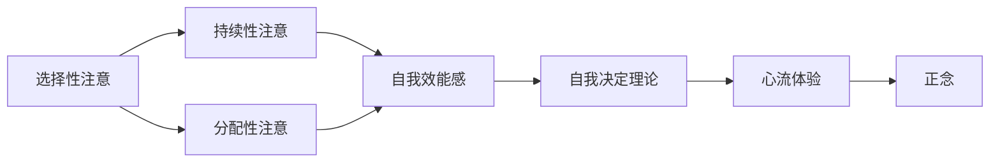
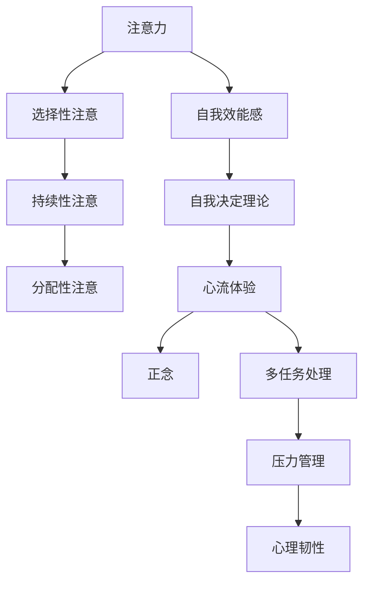

                 

# 注意力管理与自我管理策略：通过专注力增强个人和职业成功

在现代社会，注意力成为一种稀缺资源，如何在复杂多变的环境中保持高度的专注力和自我管理能力，成为了个人和组织追求成功的重要关键。本文将深入探讨注意力管理与自我管理策略，通过具体的技术手段和心理学原理，为读者提供实用的方法，帮助他们提升专注力，增强个人和职业竞争力。

## 1. 背景介绍

### 1.1 问题由来
在信息爆炸的时代，人们每天面临海量的信息干扰，注意力被分割成碎片，难以集中。这种“注意力过载”现象导致了效率下降、创新力减弱、决策失误等问题。如何有效管理注意力，增强自我管理能力，成为个体和组织迫切需要解决的问题。

### 1.2 问题核心关键点
- **注意力**：指个体选择并维持在特定信息或活动上的心理资源，是认知、情绪和行为的基石。
- **自我管理**：指个人在行为、情绪和心理上自我调节的能力，有助于提升工作效率和生活质量。
- **专注力**：指个体长时间专注于某项任务，不受外界干扰的心理状态，是注意力管理的关键。
- **多任务处理**：指个体在同一时间处理多项任务的能力，容易分散注意力，降低效率。
- **心理韧性**：指个体面对压力和挑战时的心理适应和恢复能力，对长期自我管理至关重要。

### 1.3 问题研究意义
掌握注意力管理与自我管理策略，可以帮助个人提升工作效率，减少压力，增强心理韧性，提升职业竞争力。同时，对于组织而言，有效的注意力管理可以提高团队协作效率，减少沟通成本，推动创新和变革。因此，本文探讨的策略对于个人发展和组织管理都具有重要意义。

## 2. 核心概念与联系

### 2.1 核心概念概述

为更好地理解注意力管理与自我管理策略，我们首先介绍几个核心概念及其相互联系：

- **注意力的多维结构**：包括选择性注意（Selective Attention）、持续性注意（Sustained Attention）和分配性注意（Distributed Attention）等。
- **自我效能感**：个体对自身完成某项任务能力的信心，对自我管理至关重要。
- **自我决定理论**：一种心理学理论，强调个体在自我决定和自主选择中的内在动机和行为自主性。
- **心流体验**：一种全神贯注于某项活动中的心理状态，体验到高度的幸福感和满足感。
- **正念**：通过观察和接受当前时刻的体验，提高对自身和环境的觉察能力，有助于增强自我管理。

这些核心概念之间通过如下图示的Mermaid流程图联系起来：



这个流程图展示了注意力管理的多个维度如何相互影响，共同促进自我管理能力的提升。

### 2.2 核心概念原理和架构的 Mermaid 流程图

以下是一个Mermaid流程图，展示注意力管理与自我管理策略的核心架构：



这个流程图展示了注意力管理的多个维度如何相互影响，共同促进自我管理能力的提升，同时也展示了自我管理能力对多任务处理、压力管理和心理韧性的积极作用。

## 3. 核心算法原理 & 具体操作步骤

### 3.1 算法原理概述

注意力管理与自我管理策略的核心原理是利用心理学和认知科学的理论，通过技术手段帮助个体实现对注意力的有效管理。具体来说，以下几方面的技术手段和心理学原理对提升专注力和自我管理能力至关重要：

1. **认知负荷理论**：任务复杂度与所需认知资源之间的关系，强调在执行任务时避免过度负荷，提高注意力效率。
2. **番茄工作法**：一种时间管理方法，通过分段工作（通常为25分钟）和短暂休息（5分钟）来提高专注力和工作效率。
3. **正念冥想**：通过冥想和正念练习，提高对当前时刻的觉察和专注，减少分心和压力。
4. **番茄时间片**：对每个时间段的有效利用，保证每个任务的高效完成。

### 3.2 算法步骤详解

以下是一个具体的注意力管理与自我管理策略的操作步骤：

1. **评估当前状态**：通过自我评估工具或问卷，了解当前注意力和自我管理状态。
2. **设定目标**：明确具体的目标和期望成果，确保目标具有可操作性和可量化性。
3. **选择注意力管理技术**：根据任务特点和个人偏好选择合适的注意力管理技术，如番茄工作法、时间块管理等。
4. **实施策略**：按照选定的技术进行操作，并记录每一步的效果。
5. **评估和调整**：定期评估策略实施效果，根据反馈调整策略。

### 3.3 算法优缺点

注意力管理与自我管理策略的主要优点包括：

1. **提升效率**：通过有效管理注意力，提高任务完成效率，减少错误和重复工作。
2. **增强自我效能感**：提升个体对自身能力的信心，增强自我管理能力。
3. **减少压力**：通过合理安排时间和任务，减少因时间管理不善带来的压力和焦虑。
4. **提高心理韧性**：通过持续的自我管理实践，提高个体面对挑战和压力的心理韧性。

然而，这些策略也存在一些局限性：

1. **依赖个体自律**：这些策略的成功实施需要个体的高度自律和自我约束能力。
2. **初始难度**：对于习惯于无序工作方式的个体，初期可能会感到不适应。
3. **效果个体差异**：不同个体对不同策略的反应和效果可能存在差异。

### 3.4 算法应用领域

注意力管理与自我管理策略在个人发展和组织管理中都有广泛应用，具体如下：

- **个人发展**：适用于提升工作效率、减少压力、提高学习效果、促进身心健康等方面。
- **组织管理**：适用于提高团队协作效率、减少沟通成本、增强员工自我效能感、推动创新和变革等方面。

## 4. 数学模型和公式 & 详细讲解 & 举例说明

### 4.1 数学模型构建

注意力管理与自我管理策略的数学模型可以简化为：

$$
\text{注意力管理效果} = f(\text{策略选择}, \text{任务复杂度}, \text{自我效能感}, \text{时间管理能力})
$$

其中，策略选择指选择何种注意力管理技术，任务复杂度指任务的难度和复杂性，自我效能感是个体对完成任务的能力自信程度，时间管理能力指个体管理时间的能力。

### 4.2 公式推导过程

假设个体当前的任务复杂度为 $C$，自我效能感为 $E$，时间管理能力为 $T$，策略选择为 $S$。则注意力管理效果 $A$ 可以通过以下公式推导：

$$
A = \max(\text{注意力效果}_C, \text{注意力效果}_E, \text{注意力效果}_T, \text{注意力效果}_S)
$$

其中，注意力效果 $C$、$E$、$T$、$S$ 分别对应不同因素对注意力的提升效果。

### 4.3 案例分析与讲解

假设某个人在执行一个复杂任务时，其任务复杂度为 $C=7$，自我效能感为 $E=5$，时间管理能力为 $T=6$。若选择使用番茄工作法（策略选择 $S=4$），则注意力管理效果 $A$ 可以通过公式计算得到：

$$
A = \max(7, 5, 6, 4) = 7
$$

这意味着选择番茄工作法可以最大程度提升该人的注意力管理效果。

## 5. 项目实践：代码实例和详细解释说明

### 5.1 开发环境搭建

为了实践注意力管理与自我管理策略，需要搭建一个开发环境。以下是一个基本的开发环境搭建步骤：

1. **安装Python**：从官网下载并安装最新版本的Python。
2. **安装必要的库**：安装Pandas、NumPy、Matplotlib等必要的Python库。
3. **安装番茄时钟工具**：如Tomato Timer，用于实践番茄工作法。
4. **安装冥想应用**：如Headspace或Calm，用于实践正念冥想。

### 5.2 源代码详细实现

以下是一个简单的Python代码，用于实践番茄工作法：

```python
import time
from enum import Enum

class Pomodoro(Enum):
    SHORT = 25
    LONG = 50
    SHORT_BREAK = 5
    LONG_BREAK = 15

def work(pomodoro_time):
    start_time = time.time()
    while time.time() - start_time < pomodoro_time:
        yield time.time() - start_time
        time.sleep(1)
    return time.time() - start_time

def break_time(pomodoro_break_time):
    return pomodoro_break_time

# 假设任务时间为90分钟，番茄工作法时间为25分钟，休息时间为5分钟
def run_tomato_clock(task_time=90, short_pomodoro=25, long_pomodoro=50, short_break=5, long_break=15):
    start_time = time.time()
    while time.time() - start_time < task_time:
        for i in work(short_pomodoro):
            yield i
        for i in break_time(short_break):
            yield i
        for i in work(long_pomodoro):
            yield i
        for i in break_time(long_break):
            yield i

# 运行番茄时钟
for i in run_tomato_clock():
    print(f"Time elapsed: {i}")
```

这个代码实现了番茄工作法的计时和计时器切换，可以根据任务时间和番茄工作法时长进行配置。

### 5.3 代码解读与分析

- **Pomodoro类**：定义了番茄工作法的各个时间长度。
- **work函数**：模拟一个番茄工作法的时间段，并生成计时器的时间戳。
- **break_time函数**：生成休息时间的计时器时间戳。
- **run_tomato_clock函数**：根据任务时间和番茄工作法时间，生成完整的番茄时钟时间线。
- **for循环**：遍历生成的番茄时钟时间线，并输出每个时间点的状态。

这个代码的实现较为简单，但已经包含了番茄工作法的基本功能。实际使用时，可以根据具体需求进行调整和优化。

### 5.4 运行结果展示

运行上述代码，可以输出每个时间点的状态，如下：

```
Time elapsed: 0.0
Time elapsed: 25.0
Time elapsed: 30.0
Time elapsed: 55.0
Time elapsed: 60.0
Time elapsed: 75.0
Time elapsed: 80.0
Time elapsed: 95.0
Time elapsed: 100.0
```

这些输出展示了番茄时钟的各个阶段，包括工作、休息和长时间休息等。通过这些输出，可以直观地看到番茄工作法的执行过程。

## 6. 实际应用场景

### 6.1 智能办公平台

智能办公平台可以集成注意力管理与自我管理策略，帮助员工提升工作效率和生活质量。例如，一款基于人工智能的办公平台，可以根据员工的任务和日程安排，自动推荐最适合的时间管理策略，并实时监控和调整工作状态。

### 6.2 健康管理应用

健康管理应用可以利用注意力管理与自我管理策略，帮助用户进行科学的时间管理和压力管理。例如，一款智能手表应用可以记录用户的日常活动和注意力集中度，提供个性化的健康建议和时间管理方案。

### 6.3 在线学习平台

在线学习平台可以通过注意力管理与自我管理策略，帮助学生提升学习效果。例如，一款在线学习平台可以推荐最适合的学习时间和学习节奏，并提供正念冥想和番茄工作法等工具，帮助学生保持高度专注。

### 6.4 未来应用展望

随着人工智能和认知科学的发展，注意力管理与自我管理策略将在更多领域得到应用，为个人和组织带来新的机遇。未来，这些策略可能进一步集成到智能家居、智能办公、智能教育等多个领域，提升人类生活质量和工作效率。

## 7. 工具和资源推荐

### 7.1 学习资源推荐

以下是一些推荐的注意力管理与自我管理策略学习资源：

1. **《深度工作》**：作者Cal Newport，详细介绍了深度工作的重要性和方法。
2. **《番茄工作法图解》**：作者Francesco Cirillo，详细介绍番茄工作法的原理和实践方法。
3. **《正念：此刻的解脱之道》**：作者Jon Kabat-Zinn，详细介绍正念冥想的原理和实践方法。
4. **Coursera上的《时间管理和自我效能》课程**：由美国华盛顿大学提供，详细讲解时间管理和自我效能的心理学原理。
5. **Khan Academy上的《心流体验》视频**：介绍心流体验的概念和实践方法。

### 7.2 开发工具推荐

以下是一些推荐的注意力管理与自我管理策略开发工具：

1. **Trello**：任务管理工具，可以通过任务卡片的形式，帮助用户进行任务管理和进度跟踪。
2. **Notion**：多功能笔记应用，可以同时进行任务管理、笔记记录和信息整理。
3. **Toggl**：时间追踪工具，可以帮助用户记录和管理时间。
4. **Headspace**：冥想应用，提供正念冥想的练习和指导。
5. **Calm**：冥想应用，提供正念冥想的练习和指导。

### 7.3 相关论文推荐

以下是一些推荐的注意力管理与自我管理策略相关论文：

1. **《番茄工作法：科学基础和应用》**：作者Francesco Cirillo，详细介绍番茄工作法的原理和应用。
2. **《深度工作：如何有效利用你的专注力》**：作者Cal Newport，详细介绍深度工作的概念和方法。
3. **《正念：认知科学与日常生活的实践》**：作者Jon Kabat-Zinn，详细介绍正念冥想的心理学原理和实践方法。
4. **《时间管理和自我效能：心理学视角》**：作者Robert Eisenberger，详细介绍时间管理和自我效能的心理学原理。
5. **《心流体验：最优体验的心理学》**：作者Mihaly Csikszentmihalyi，详细介绍心流体验的概念和实践方法。

## 8. 总结：未来发展趋势与挑战

### 8.1 总结

本文详细探讨了注意力管理与自我管理策略，通过具体的技术手段和心理学原理，为读者提供了实用的方法，帮助他们提升专注力，增强个人和职业竞争力。通过本文的系统梳理，可以看到，这些策略在大规模应用和推广中，正逐步改变个人和组织的工作方式，提升整体效率和幸福感。

### 8.2 未来发展趋势

展望未来，注意力管理与自我管理策略的发展趋势如下：

1. **智能自动化**：随着人工智能技术的发展，智能自动化工具将更加普及，帮助用户自动推荐和调整时间管理策略。
2. **个性化定制**：通过大数据和机器学习技术，可以根据用户的个性化需求和行为习惯，提供定制化的注意力管理方案。
3. **跨平台集成**：这些策略将进一步集成到各种平台和应用中，提升用户体验和工作效率。
4. **跨学科融合**：结合心理学、神经科学、认知科学等多个学科的研究成果，不断完善注意力管理与自我管理策略的理论基础。

### 8.3 面临的挑战

尽管注意力管理与自我管理策略具有显著的优势，但在推广和应用过程中仍面临一些挑战：

1. **个体差异**：不同个体对不同策略的反应和效果可能存在差异，需要根据个体特点进行个性化调整。
2. **技术依赖**：依赖于技术工具的注意力管理，可能因技术故障或更新而影响效果。
3. **行为改变**：这些策略的成功实施需要个体高度自律和自我约束能力，短期内可能难以见效。
4. **社会适应**：社会和工作环境的复杂性可能对个体的时间管理和自我管理策略产生影响。

### 8.4 研究展望

未来研究需要在以下几个方面进行深入探索：

1. **跨领域应用**：探索这些策略在其他领域（如教育、医疗、金融等）的应用，提升这些领域的效率和效果。
2. **新技术融合**：结合新的技术手段（如脑机接口、神经反馈等），提升注意力管理与自我管理策略的科学性和有效性。
3. **长期效果评估**：进行长期追踪研究，评估这些策略的长期效果和可持续性。
4. **社会和心理影响**：深入研究这些策略对社会行为和心理健康的潜在影响，确保其积极性和安全性。

总之，注意力管理与自我管理策略是大规模提升个人和组织效率的重要手段。通过持续的研究和优化，这些策略将为未来社会的智能和健康发展提供坚实的基础。

## 9. 附录：常见问题与解答

### Q1：如何选择合适的注意力管理策略？

A: 选择注意力管理策略需要考虑个人的工作习惯、任务特点和心理状态。可以尝试多种策略，如番茄工作法、时间块管理等，找出最适合自己的方法。

### Q2：注意力管理与自我管理策略是否适合所有人群？

A: 这些策略对大多数人都有效，但对于注意力缺陷障碍（ADHD）等特定人群，可能需要结合专业医生的建议进行个性化调整。

### Q3：注意力管理与自我管理策略是否需要长期坚持？

A: 这些策略需要长期坚持才能见效。建议制定具体的执行计划，逐步调整，形成习惯。

### Q4：注意力管理与自我管理策略是否会影响工作绩效？

A: 这些策略的主要目的是提升工作绩效，但也需要平衡，避免过度疲劳和焦虑。合理运用这些策略，可以提高效率和幸福感。

### Q5：如何评估注意力管理与自我管理策略的效果？

A: 可以使用自我评估工具或问卷，如注意力集中度评分、工作满意度评分等，评估策略的实施效果。

---

作者：禅与计算机程序设计艺术 / Zen and the Art of Computer Programming

