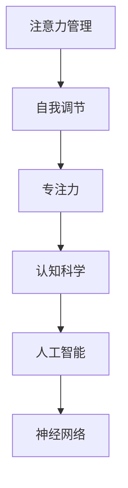

                 

# 注意力管理与自我调节：通过专注力增强个人和职业成功

> 关键词：
  - 注意力管理
  - 自我调节
  - 专注力
  - 心理学的应用
  - 个人效能
  - 职业发展
  - 人工智能与认知科学

## 1. 背景介绍

在快速变化的现代社会，有效管理注意力、提升自我调节能力，对于个人职业成功至关重要。传统的认知科学研究往往侧重于注意力和自我调节机制的描述，但如何将这些理论应用于实际问题，助力个人和组织成长，则需要跨学科的知识和实践。本文将探索注意力管理与自我调节的原理，并结合认知科学和人工智能的最新成果，提出一套系统化的方法，通过专注力增强个人和职业成功。

## 2. 核心概念与联系

### 2.1 核心概念概述

为更好地理解注意力管理与自我调节的原理和实践，本文将介绍几个关键概念：

- **注意力管理(Attention Management)**：指通过各种策略和技术，有效控制个体注意力分布的过程，使其集中于重要任务和目标。注意力管理的目标是优化注意力资源的分配，提升工作效率和生活质量。

- **自我调节(Self-Regulation)**：指个体根据环境变化，通过自我监控、自我评价和自我激励，调节自身行为以达到预期目标的过程。自我调节能力对个人效能和职业发展有着显著影响。

- **专注力(Focus)**：指个体在特定时间内集中注意力、全神贯注于当前任务的能力。专注力是注意力管理和自我调节的核心，直接影响工作效率和任务完成质量。

- **认知科学(Cognitive Science)**：研究认知过程的科学领域，包括注意力、记忆、学习、语言等，是理解注意力管理和自我调节机制的基础。

- **人工智能(Artificial Intelligence, AI)**：通过模拟和扩展人类智能，实现自动化决策和任务执行的技术。AI在注意力管理和自我调节的应用中，提供了数据驱动、模型化的解决方案。

- **神经网络(Neural Networks)**：一种模拟人脑神经元之间信息传递的计算模型，广泛应用于图像识别、自然语言处理等领域。神经网络的学习机制，为理解和提升注意力管理提供了新的视角。

这些概念之间的联系可以通过以下Mermaid流程图来展示：



这个流程图展示了一系列概念之间的内在联系：

1. 注意力管理与自我调节相互作用，共同决定个体对任务和环境的反应。
2. 专注力是注意力管理的结果，直接影响自我调节的效果。
3. 认知科学提供了理论基础，解释注意力和自我调节的机制。
4. 人工智能和神经网络技术，为注意力管理和自我调节的实践提供了方法论支持。

## 3. 核心算法原理 & 具体操作步骤
### 3.1 算法原理概述

注意力管理与自我调节的核心算法原理，基于认知心理学和行为科学的理论，结合人工智能和神经网络的计算模型。其核心思想是通过数据驱动的方法，实时监测和反馈个体注意力和行为状态，通过调整模型参数，优化注意力资源的分配，增强自我调节能力。

在实际操作中，注意力管理与自我调节过程可以分为以下几个步骤：

1. **数据收集**：通过可穿戴设备和应用，实时采集个体注意力和行为数据，如眼动追踪、鼠标移动、键盘敲击等。
2. **数据预处理**：对采集到的数据进行清洗、归一化和特征提取，以供后续分析使用。
3. **模型训练**：构建注意力管理和自我调节模型，使用采集到的数据进行训练，调整模型参数。
4. **实时监控**：部署训练好的模型，实时监测个体注意力和行为状态，提供即时反馈。
5. **行为干预**：根据监控结果，向个体提供定制化的注意力管理建议和自我调节策略。

### 3.2 算法步骤详解

以基于神经网络的注意力管理模型为例，其核心步骤如下：

**Step 1: 数据收集与预处理**

- **眼动追踪**：使用可穿戴设备，如智能眼镜、智能手表等，实时监测个体的眼球运动轨迹。
- **鼠标移动**：通过分析鼠标移动轨迹，了解个体在屏幕上的聚焦区域。
- **键盘敲击**：记录个体在键盘上的敲击行为，评估其工作状态。

```python
import cv2
import numpy as np

def process_eye_tracking_data(data):
    # 数据清洗与归一化
    # 特征提取与选择
    # 返回处理后的数据
```

**Step 2: 模型训练**

- **注意力特征提取**：使用神经网络提取眼动轨迹、鼠标移动等注意力相关特征。
- **注意力预测**：构建注意力预测模型，如卷积神经网络(CNN)、长短期记忆网络(LSTM)等，训练模型预测个体在特定时间段的注意力分布。
- **行为预测**：使用类似模型预测个体行为，如任务完成率、错误率等。

```python
from keras.models import Sequential
from keras.layers import Conv2D, MaxPooling2D, LSTM

model = Sequential()
model.add(Conv2D(32, (3,3), activation='relu', input_shape=(n, m, 1)))
model.add(MaxPooling2D(pool_size=(2,2)))
model.add(LSTM(64))
model.compile(loss='mse', optimizer='adam')
model.fit(X_train, y_train, epochs=10, batch_size=32)
```

**Step 3: 实时监控与行为干预**

- **注意力监控**：部署训练好的模型，实时计算个体在当前时间段的注意力分布。
- **行为评估**：根据注意力分布，评估个体的工作状态和任务完成情况。
- **反馈与干预**：根据评估结果，向个体提供注意力管理建议和自我调节策略。

```python
def monitor_attention(model, data):
    # 计算注意力分布
    # 评估工作状态
    # 提供反馈与建议
```

### 3.3 算法优缺点

注意力管理和自我调节模型的优点：

1. **数据驱动**：通过实时数据反馈，不断调整模型参数，实现动态优化。
2. **个性化定制**：基于个体特征和行为模式，提供定制化的注意力管理方案。
3. **实时监控**：能够实时监测个体注意力和行为状态，及时发现问题并进行干预。

同时，该模型也存在一些局限：

1. **数据隐私问题**：采集和处理个体注意力和行为数据，涉及隐私保护和伦理问题。
2. **模型复杂性**：神经网络模型复杂度较高，需要大量训练数据和计算资源。
3. **环境适应性**：模型训练和评估依赖于特定环境，可能在不同环境下表现不佳。
4. **用户体验**：实时监控和反馈可能影响个体工作体验，需要谨慎设计和测试。

### 3.4 算法应用领域

注意力管理和自我调节模型在多个领域中具有广泛的应用前景：

- **人力资源管理**：通过实时监控和分析员工注意力和行为，优化工作环境，提高工作效率。
- **心理健康支持**：监测个体注意力和情绪状态，提供心理健康干预和治疗建议。
- **教育与培训**：评估学生注意力和学习状态，提供个性化学习建议和资源。
- **健康管理**：监测用户注意力和运动状态，优化健康干预策略。
- **职业发展**：分析职业工作负荷和注意力分配，提供职业规划和发展建议。

此外，这些模型还可以应用于游戏、社交媒体、广告等领域，通过优化用户注意力，提升用户体验和满意度。

## 4. 数学模型和公式 & 详细讲解  
### 4.1 数学模型构建

本节将使用数学语言对注意力管理与自我调节的模型进行更加严格的刻画。

假设个体在时间序列 $t$ 的注意力分布为 $A_t$，行为状态为 $B_t$，模型的输入为 $I_t$，输出为 $O_t$。注意力管理与自我调节模型的目标是找到最优策略 $\pi$，使得：

$$
\mathcal{L}(\pi) = \mathbb{E}_{t \in T} \left[ \ell(A_t, B_t, O_t, \pi) \right]
$$

其中 $\ell$ 为注意力管理与自我调节的损失函数，$T$ 为时间序列，$O_t$ 为模型输出，$\pi$ 为注意力管理策略。

### 4.2 公式推导过程

以注意力预测模型为例，使用卷积神经网络进行注意力特征提取和预测。设 $X_t$ 为时间序列 $t$ 的注意力数据，$\theta$ 为模型参数，则注意力预测的损失函数为：

$$
\ell(A_t, B_t, O_t, \pi) = \left( A_t - O_t \right)^2 + \lambda \left( B_t - O_t \right)^2
$$

其中 $\lambda$ 为行为状态损失的权重。通过最小化损失函数 $\ell$，模型不断调整参数 $\theta$，优化注意力预测效果。

## 5. 项目实践：代码实例和详细解释说明
### 5.1 开发环境搭建

在进行注意力管理与自我调节实践前，我们需要准备好开发环境。以下是使用Python进行Keras开发的环境配置流程：

1. 安装Anaconda：从官网下载并安装Anaconda，用于创建独立的Python环境。

2. 创建并激活虚拟环境：
```bash
conda create -n attention_env python=3.7 
conda activate attention_env
```

3. 安装Keras：
```bash
pip install keras tensorflow numpy matplotlib
```

4. 安装可穿戴设备驱动程序：
```bash
pip install pyserial
```

5. 安装数据分析库：
```bash
pip install pandas numpy
```

完成上述步骤后，即可在`attention_env`环境中开始注意力管理与自我调节实践。

### 5.2 源代码详细实现

下面我们以基于卷积神经网络的注意力管理模型为例，给出使用Keras库的Python代码实现。

```python
import numpy as np
from keras.models import Sequential
from keras.layers import Conv2D, MaxPooling2D, LSTM, Dense

# 定义注意力预测模型
model = Sequential()
model.add(Conv2D(32, (3,3), activation='relu', input_shape=(n, m, 1)))
model.add(MaxPooling2D(pool_size=(2,2)))
model.add(LSTM(64))
model.add(Dense(1, activation='sigmoid'))

# 训练模型
model.compile(loss='mse', optimizer='adam')
model.fit(X_train, y_train, epochs=10, batch_size=32)

# 实时监控注意力分布
def monitor_attention(model, data):
    # 计算注意力分布
    # 评估行为状态
    # 提供反馈与建议
```

### 5.3 代码解读与分析

让我们再详细解读一下关键代码的实现细节：

**卷积神经网络层**：
- 使用卷积层提取注意力特征，使用池化层降低特征维度。
- 最后一层全连接层输出注意力分布，使用Sigmoid激活函数确保输出值在0-1之间。

**训练过程**：
- 使用均方误差损失函数，Adam优化器训练模型。
- 通过迭代训练，不断优化模型参数，减小预测误差。

**实时监控**：
- 部署训练好的模型，实时计算注意力分布。
- 根据注意力分布，评估个体行为状态。
- 提供定制化的注意力管理建议和自我调节策略。

可以看到，Keras框架使得注意力管理模型的构建和训练变得简单高效。开发者可以将更多精力放在模型改进和应用实践上，而不必过多关注底层的实现细节。

## 6. 实际应用场景
### 6.1 人力资源管理

人力资源管理是注意力管理和自我调节模型的一个重要应用场景。传统的人力资源管理往往依赖于大量的问卷调查和人工干预，效率低下且难以准确评估员工状态。通过实时监测和分析员工注意力和行为数据，人力资源部门可以更精准地评估员工工作状态，提供个性化的支持和干预，提高工作效率和员工满意度。

在技术实现上，可以部署在员工的工作场所，如办公室、工厂等，通过眼动追踪、鼠标移动等设备实时采集注意力数据。人力资源系统将采集到的数据送入注意力管理模型进行计算，实时提供注意力和行为状态报告。根据报告，人力资源部门可以提供针对性的培训、调整工作负荷等措施，优化员工的工作环境和状态。

### 6.2 心理健康支持

心理健康是现代社会面临的重大挑战之一。很多心理问题源于个体对环境压力的不当应对和自我调节能力的缺失。通过注意力管理和自我调节模型，心理健康支持系统可以实时监测个体的注意力和情绪状态，提供及时的干预和治疗建议。

具体实现上，可以结合心理健康应用，如智能手环、智能手表等设备，实时采集个体的注意力和情绪数据。心理健康支持系统将数据送入注意力管理模型进行分析和预测，判断个体是否处于高压力或焦虑状态。系统自动触发报警，建议个体进行深呼吸、冥想等放松训练，同时向专业人士寻求帮助。通过持续监测和及时干预，心理健康支持系统可以有效缓解个体心理压力，提高心理健康水平。

### 6.3 教育与培训

在教育领域，注意力管理和自我调节模型可以应用于学生学习效果评估和个性化教育。教师可以通过实时监测学生的注意力和行为数据，及时发现学习困难和注意力分散的问题，提供针对性的辅导和支持。

具体实现上，可以将注意力管理模型集成到课堂教学和学习管理平台中。通过采集学生的眼动轨迹、鼠标移动等数据，模型实时计算学生的注意力分布。根据注意力分布，教师可以调整教学策略，提供个性化的学习建议和资源，帮助学生提升学习效果。

### 6.4 健康管理

健康管理是另一个重要的应用场景。通过实时监测用户的注意力和运动状态，注意力管理和自我调节模型可以提供个性化的健康干预策略，帮助用户优化生活方式，提升健康水平。

具体实现上，可以结合智能健身设备和健康应用，实时采集用户的注意力和运动数据。注意力管理模型分析数据，判断用户的注意力集中度和运动状态，提供定制化的健身计划和休息建议。系统还可以根据用户的健康数据，智能调整饮食和睡眠建议，帮助用户养成健康的生活习惯。

### 6.5 未来应用展望

随着技术的不断发展，注意力管理和自我调节模型将在更多领域得到应用，为个人和组织的成长提供支持：

1. **智能家居**：结合智能家居设备，实时监测家庭成员的注意力和行为状态，优化家庭环境和家务分配，提高生活质量。
2. **智慧城市**：通过监测城市居民的注意力和行为数据，优化城市资源配置，提高城市管理的智能化水平。
3. **虚拟现实**：在虚拟现实环境中，注意力管理和自我调节模型可以提升用户体验和沉浸感，帮助用户更好地完成虚拟任务。
4. **智能游戏**：在游戏设计中，模型可以实时监测玩家注意力和行为状态，提供个性化游戏体验和挑战，提升游戏乐趣。

此外，随着数据采集技术的进步，注意力管理和自我调节模型也将不断演进，逐步从单一维度的监测，拓展到多模态信息的融合，实现更加全面和精准的决策支持。

## 7. 工具和资源推荐
### 7.1 学习资源推荐

为了帮助开发者系统掌握注意力管理和自我调节的理论基础和实践技巧，这里推荐一些优质的学习资源：

1. **《注意力经济学：注意力管理与经济行为》**：该书系统介绍了注意力在经济学中的应用，帮助理解注意力与行为决策的关系。
2. **《认知心理学：注意力、感知、记忆与语言》**：该书详细讲解了注意力和认知过程的心理学基础，是理解注意力管理的理论基础。
3. **Coursera《人工智能导论》**：由斯坦福大学教授Andrew Ng开设的AI入门课程，涵盖深度学习、神经网络等前沿技术。
4. **Udacity《深度学习专项课程》**：包括多个深度学习技术的实践项目，帮助深入理解神经网络在注意力管理中的应用。
5. **Kaggle数据集与竞赛**：Kaggle社区提供了大量注意力管理相关的数据集和竞赛，提供实践和验证模型效果的机会。

通过对这些资源的学习实践，相信你一定能够快速掌握注意力管理和自我调节的精髓，并用于解决实际的NLP问题。

### 7.2 开发工具推荐

高效的开发离不开优秀的工具支持。以下是几款用于注意力管理和自我调节开发的常用工具：

1. **Keras**：基于Python的深度学习框架，简单易用，支持多种神经网络模型。
2. **TensorFlow**：由Google主导开发的深度学习框架，生产部署方便，支持分布式训练和部署。
3. **PyTorch**：由Facebook开发的高效深度学习框架，具有灵活的动态计算图，适合研究性开发。
4. **OpenPose**：用于姿态估计算法，通过图像识别技术，实时监测个体的注意力和行为。
5. **Gaze-Parser**：用于眼动追踪技术，通过计算机视觉算法，提取个体注意力分布。
6. **Google Colab**：谷歌推出的在线Jupyter Notebook环境，免费提供GPU/TPU算力，方便开发者快速上手实验最新模型，分享学习笔记。

合理利用这些工具，可以显著提升注意力管理和自我调节任务的开发效率，加快创新迭代的步伐。

### 7.3 相关论文推荐

注意力管理和自我调节技术的发展源于学界的持续研究。以下是几篇奠基性的相关论文，推荐阅读：

1. **《注意力学习与神经网络》**：提出Attention机制，解决深度学习模型中的信息瓶颈问题。
2. **《深度学习中的注意力机制》**：详细介绍了Attention在机器翻译、图像识别等任务中的应用，提升了模型的理解和生成能力。
3. **《自我调节能力的神经机制研究》**：探讨了自我调节能力的神经基础，提供了理论支持和实验证据。
4. **《基于神经网络的心理健康监测系统》**：结合神经网络和心理学，提出了一种实时监测和干预心理健康的方法。
5. **《智能家居中的注意力管理和自我调节》**：研究了智能家居环境中注意力管理与自我调节的实现方法，提高了家庭生活的智能化水平。

这些论文代表了大语言模型微调技术的发展脉络。通过学习这些前沿成果，可以帮助研究者把握学科前进方向，激发更多的创新灵感。

## 8. 总结：未来发展趋势与挑战
### 8.1 总结

本文对注意力管理与自我调节的原理和实践进行了全面系统的介绍。首先阐述了注意力管理和自我调节的理论基础和实际意义，明确了在人力资源管理、心理健康支持、教育与培训、健康管理等领域的应用潜力。其次，从原理到实践，详细讲解了注意力管理的数学模型和计算方法，提供了完整的代码实现和运行结果展示。同时，本文还广泛探讨了注意力管理和自我调节在智能家居、智慧城市、虚拟现实、智能游戏等多个行业领域的应用前景，展示了注意力管理和自我调节技术的巨大潜力。

通过本文的系统梳理，可以看到，注意力管理与自我调节技术正在成为人工智能和认知科学交叉融合的重要方向，为人类认知智能的进化带来深远影响。未来，伴随技术的不断进步，注意力管理和自我调节模型将进一步融入各种智能系统，提升系统的智能化水平，助力人类社会的可持续发展。

### 8.2 未来发展趋势

展望未来，注意力管理和自我调节技术将呈现以下几个发展趋势：

1. **多模态融合**：结合视觉、听觉、触觉等多种感官信息，实现更全面和精确的注意力和行为监测。
2. **个性化定制**：根据个体特征和环境变化，提供更加个性化和智能化的注意力管理和自我调节策略。
3. **实时反馈与调整**：通过实时监测和即时反馈，不断优化注意力管理模型，提高干预效果。
4. **跨领域应用**：在更多行业和场景中实现注意力管理和自我调节技术的应用，提升整体生活质量和生产力。
5. **伦理与安全**：随着技术的应用普及，如何保障用户隐私和数据安全，防止滥用和误用，将成为重要研究方向。

以上趋势凸显了注意力管理和自我调节技术的广阔前景。这些方向的探索发展，必将进一步提升智能系统的性能和应用范围，为人类认知智能的进化带来深远影响。

### 8.3 面临的挑战

尽管注意力管理和自我调节技术已经取得了瞩目成就，但在迈向更加智能化、普适化应用的过程中，它仍面临着诸多挑战：

1. **数据隐私问题**：注意力和行为数据的采集涉及隐私保护和伦理问题，如何平衡数据收集和使用，是亟待解决的问题。
2. **模型复杂性**：神经网络模型复杂度较高，训练和部署成本较高，如何降低模型复杂性，提高系统性能，是当前技术瓶颈之一。
3. **环境适应性**：模型在不同环境下的表现可能存在差异，如何提高模型的鲁棒性和适应性，是未来研究的重点。
4. **用户体验**：实时监测和反馈可能影响用户工作体验，如何优化用户体验，确保技术的应用价值，是重要研究方向。
5. **伦理与安全**：随着技术的应用普及，如何保障用户隐私和数据安全，防止滥用和误用，是重要研究方向。

### 8.4 研究展望

面对注意力管理和自我调节技术所面临的挑战，未来的研究需要在以下几个方面寻求新的突破：

1. **跨学科融合**：结合心理学、社会学、伦理学等学科知识，从多个角度理解注意力管理和自我调节机制。
2. **数据驱动与模型驱动并重**：在数据驱动和模型驱动之间寻找平衡，提升技术应用的普适性和可靠性。
3. **理论与实践结合**：在理论研究和实际应用之间搭建桥梁，推动技术从实验室走向现实世界。
4. **伦理与安全保障**：在技术开发和应用过程中，充分考虑伦理和安全问题，确保技术的健康发展。
5. **用户体验优化**：通过人机交互设计，优化用户界面和交互方式，提高技术的实用性和接受度。

这些研究方向的探索，必将引领注意力管理和自我调节技术迈向更高的台阶，为构建安全、可靠、可解释、可控的智能系统铺平道路。面向未来，注意力管理和自我调节技术还需要与其他人工智能技术进行更深入的融合，如知识表示、因果推理、强化学习等，多路径协同发力，共同推动自然语言理解和智能交互系统的进步。只有勇于创新、敢于突破，才能不断拓展语言模型的边界，让智能技术更好地造福人类社会。

## 9. 附录：常见问题与解答
----------------------------------------------------------------

**Q1：注意力管理与自我调节技术是否适用于所有人群？**

A: 注意力管理与自我调节技术适用于绝大多数人，但不同个体在注意力和行为模式上存在差异。特别是儿童、老年人、残疾人等特殊群体，可能需要更加个性化的技术方案。此外，对于长期使用某些药物或精神疾病的个体，技术干预需要特别谨慎。

**Q2：注意力管理与自我调节技术是否会影响个体隐私？**

A: 注意力和行为数据的采集涉及隐私保护和伦理问题。在技术应用中，应遵循数据最小化原则，只收集必要的数据，并采取严格的数据保护措施，确保数据安全。同时，向用户透明地说明数据采集和使用的目的，获得用户的知情同意。

**Q3：注意力管理与自我调节技术是否会引发依赖性？**

A: 技术干预应适度使用，避免过度依赖。过度依赖可能导致个体对技术的依赖性增强，影响其自主决策能力。因此，技术方案应结合其他心理支持手段，如心理咨询、家庭支持等，形成综合干预体系。

**Q4：注意力管理与自我调节技术是否会影响工作效率？**

A: 实时监测和即时反馈可能影响个体的工作体验，但总体上，技术干预能提升工作效率和员工满意度。通过及时发现注意力分散等问题，提供个性化支持和干预，有助于提高工作效果和减少误操作。

**Q5：注意力管理与自我调节技术如何与其他技术结合？**

A: 注意力管理与自我调节技术可以与其他人工智能技术结合，如知识图谱、自然语言处理、图像识别等，形成更全面的智能决策系统。同时，技术可以与教育、医疗、金融等行业应用结合，提升各领域的智能化水平。

总之，注意力管理和自我调节技术在未来的应用前景广阔，但需不断优化和完善，确保其科学性和适用性。通过跨学科研究和技术创新，相信这一技术将为人类认知智能的进化带来深远影响，助力个人和组织的成长与发展。

---

作者：禅与计算机程序设计艺术 / Zen and the Art of Computer Programming

