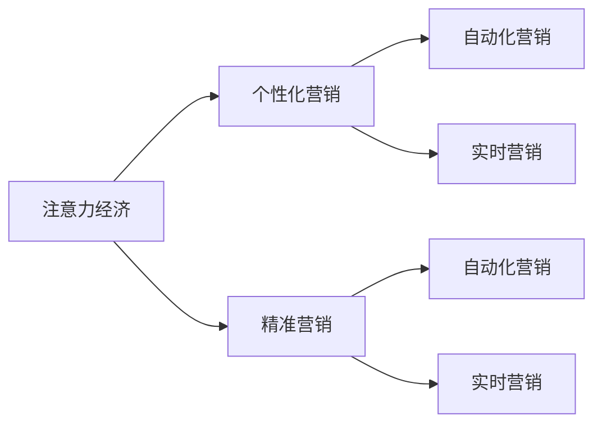

                 

# 注意力经济与个性化营销：如何针对受众定制你的信息

在数字化时代，信息过载已经成为普遍现象。如何在海量数据中找到突破口，准确识别并定制目标受众，是每一个企业和营销人员面临的共同挑战。本文将系统探讨注意力经济和个性化营销的核心概念与技术，从原理到实践，带您深入了解如何针对受众定制信息，提升营销效果。

## 1. 背景介绍

### 1.1 问题由来

随着互联网的普及和数字化程度的不断提高，信息传播渠道变得前所未有的丰富。消费者不再只是被动接受信息，他们具备了更多的主动权和选择权。在这种情况下，如何吸引和保持用户的注意力，成为企业争夺市场的重要法宝。传统的一刀切式营销策略已经无法满足个性化需求，企业需要通过数据驱动的方式，精准地定位目标受众，定制个性化信息，实现更高效、更精准的营销。

### 1.2 问题核心关键点

- **注意力经济**：指在信息过载的环境中，如何通过有效的信息传播策略，吸引和维持目标受众的注意力。
- **个性化营销**：基于用户的行为数据和兴趣爱好，为每个用户定制个性化的营销信息，提升用户体验和转化率。
- **精准营销**：通过数据分析和算法模型，精确识别目标用户群，进行有针对性的信息推送。
- **自动化营销**：利用技术手段自动化地进行用户行为分析、个性化推荐和广告投放。
- **实时营销**：实时采集和响应用户反馈，及时调整营销策略和信息内容。

这些核心概念共同构成了注意力经济和个性化营销的核心理念，为信息传播提供了新的视角和方法。

### 1.3 问题研究意义

研究注意力经济和个性化营销，对于提升企业的市场竞争力、改善用户体验、增加品牌价值等方面具有重要意义。通过数据驱动的个性化营销策略，企业能够更有效地吸引和转化用户，实现更高的商业价值。同时，个性化营销还能够提升用户满意度，增强品牌忠诚度，构建长期的客户关系。

## 2. 核心概念与联系

### 2.1 核心概念概述

在开始深入讨论之前，我们先来梳理一下注意力经济和个性化营销的关键概念：

- **注意力经济**：指通过吸引和维持用户注意力，提升营销效果的过程。用户注意力成为一种稀缺资源，其获取和保持是信息传播的关键。
- **个性化营销**：基于用户行为数据，通过算法模型分析，为每个用户提供定制化的信息，以提升用户体验和转化率。
- **精准营销**：利用数据分析和算法模型，精确识别目标用户群，进行有针对性的信息推送。
- **自动化营销**：利用技术手段自动化地进行用户行为分析、个性化推荐和广告投放。
- **实时营销**：实时采集和响应用户反馈，及时调整营销策略和信息内容。

这些概念之间的逻辑关系可以通过以下Mermaid流程图来展示：



这个流程图展示了注意力经济与个性化营销之间的关系，以及它们如何通过精准营销、自动化营销和实时营销等技术手段，实现信息定制和传播。

## 3. 核心算法原理 & 具体操作步骤

### 3.1 算法原理概述

注意力经济和个性化营销的核心原理在于通过对用户行为数据的分析和建模，识别用户的兴趣和需求，从而进行个性化信息的定制和推送。这一过程主要涉及以下几个步骤：

1. **数据采集**：收集用户的行为数据，如浏览记录、购买历史、点击行为等。
2. **数据分析**：对采集到的数据进行分析，提取用户兴趣点、行为偏好等特征。
3. **模型训练**：利用机器学习模型对用户特征进行建模，预测用户行为和偏好。
4. **信息定制**：根据模型预测结果，为每个用户定制个性化的信息。
5. **信息传播**：通过自动化和实时化的方式，将定制信息推送给目标用户。

### 3.2 算法步骤详解

以下是基于注意力经济和个性化营销的核心算法详细步骤：

**Step 1: 数据采集与预处理**

1. **数据来源**：
   - 网站/APP访问日志
   - 社交媒体互动数据
   - 购买记录和订单数据
   - 用户反馈和评论数据
   - 用户画像数据等

2. **数据清洗**：
   - 去除异常值和噪音数据
   - 处理缺失值和重复数据
   - 数据标准化和归一化

3. **特征提取**：
   - 提取有意义的特征，如用户ID、时间戳、浏览路径、点击行为、购买金额等
   - 使用降维技术，如PCA、LDA，降低维度，减少计算复杂度

**Step 2: 数据分析与建模**

1. **用户画像构建**：
   - 使用聚类算法（如K-means、DBSCAN）对用户进行分组
   - 提取每个用户群体的核心特征
   - 可视化用户画像，理解用户群体的行为和偏好

2. **行为预测模型**：
   - 使用分类算法（如SVM、随机森林、梯度提升树）预测用户的行为（如购买意愿、点击概率等）
   - 使用回归算法（如线性回归、Ridge回归、XGBoost）预测用户的兴趣（如内容偏好、品牌偏好等）

3. **个性化推荐模型**：
   - 使用协同过滤算法（如基于用户的协同过滤、基于物品的协同过滤）推荐个性化内容
   - 使用矩阵分解算法（如SVD、ALS）计算用户与内容的相似度

**Step 3: 信息定制与传播**

1. **内容定制**：
   - 根据用户画像和行为预测结果，定制个性化的广告内容
   - 使用自然语言处理技术生成个性化文本
   - 结合视觉元素（如图片、视频）丰富信息表达形式

2. **信息传播**：
   - 利用自动化工具（如Hootsuite、Buffer）定时推送信息
   - 使用实时营销工具（如Facebook Ads、Google Ads）实时调整广告投放策略
   - 分析广告效果，优化广告创意和投放策略

### 3.3 算法优缺点

基于注意力经济和个性化营销的算法具有以下优点：

1. **提高转化率**：通过个性化推荐和定制信息，提升用户满意度和转化率。
2. **提升用户粘性**：个性化信息能够更好地满足用户需求，增加用户对品牌和产品的粘性。
3. **降低营销成本**：精准定位目标用户，减少无效广告投放，降低营销成本。
4. **增强品牌价值**：通过个性化服务和精准营销，提升品牌形象和市场竞争力。

同时，也存在以下缺点：

1. **数据隐私问题**：用户行为数据的采集和使用可能引发隐私问题，需要遵守相关法律法规。
2. **算法偏见**：模型训练和预测可能存在算法偏见，需要定期审查和修正。
3. **数据质量影响**：数据的准确性和完整性直接影响模型效果，需要确保数据质量。
4. **模型复杂度**：个性化推荐和行为预测模型的训练和维护需要较高的计算资源和技术能力。

### 3.4 算法应用领域

注意力经济和个性化营销技术在多个领域得到了广泛应用，包括：

1. **电子商务**：通过个性化推荐和精准营销提升用户购买转化率。
2. **在线广告**：利用用户画像和行为预测优化广告投放策略，提高广告效果。
3. **内容分发**：为每个用户定制个性化内容，提升平台的用户留存率和活跃度。
4. **移动应用**：通过推送个性化通知和信息，增强用户粘性和互动。
5. **社交媒体**：利用实时反馈和自动化工具，提升用户互动和广告投放效率。
6. **金融服务**：通过个性化推荐和精准营销，提升客户满意度和忠诚度。

这些领域的应用展示了个性化营销的广泛影响力和潜在价值。

## 4. 数学模型和公式 & 详细讲解

### 4.1 数学模型构建

基于注意力经济和个性化营销的核心算法，我们可以构建如下数学模型：

1. **用户画像模型**：
   - 用户ID：$U$
   - 用户属性：$A$
   - 用户行为：$B$
   - 用户画像向量：$\mathbf{P}(U)$

2. **行为预测模型**：
   - 用户ID：$U$
   - 用户行为：$B$
   - 行为标签：$Y$
   - 行为预测模型：$f(Y|U,B)$

3. **个性化推荐模型**：
   - 用户ID：$U$
   - 内容ID：$C$
   - 用户-内容相似度：$S(U,C)$
   - 推荐分数：$R(U,C)$

4. **信息传播模型**：
   - 用户ID：$U$
   - 推荐内容：$R$
   - 点击率：$C(U|R)$
   - 转化率：$T(U|R)$

### 4.2 公式推导过程

**用户画像模型**：
$$
\mathbf{P}(U) = \mathbf{A} \cdot \mathbf{B} + \mathbf{C}
$$
其中，$\mathbf{A}$ 为用户属性向量，$\mathbf{B}$ 为行为数据向量，$\mathbf{C}$ 为常数项。

**行为预测模型**：
$$
\hat{Y} = f(Y|U,B) = \sum_{i=1}^{N} \omega_i \cdot \phi_i(U,B)
$$
其中，$\omega_i$ 为权重系数，$\phi_i(U,B)$ 为特征函数，$N$ 为特征数量。

**个性化推荐模型**：
$$
R(U,C) = \mathbf{S}(U,C) \cdot \mathbf{W}
$$
其中，$\mathbf{S}(U,C)$ 为用户-内容相似度矩阵，$\mathbf{W}$ 为推荐模型权重。

**信息传播模型**：
$$
C(U|R) = \sigma(\mathbf{R}_U \cdot \mathbf{W}_C)
$$
其中，$\sigma$ 为激活函数，$\mathbf{R}_U$ 为用户特征向量，$\mathbf{W}_C$ 为推荐内容特征向量。

### 4.3 案例分析与讲解

**案例一：电商平台个性化推荐**

1. **数据采集**：
   - 用户ID、商品ID、浏览时间、购买记录
   - 数据清洗：去除无效数据，处理缺失值

2. **数据分析**：
   - 使用协同过滤算法（ALS）计算用户-商品相似度
   - 提取用户行为特征，如浏览次数、购买金额

3. **模型训练**：
   - 使用梯度下降算法训练推荐模型
   - 使用交叉验证评估模型效果

4. **信息定制**：
   - 根据用户画像和行为预测结果，生成个性化推荐列表
   - 生成个性化推荐页面

5. **信息传播**：
   - 利用电商平台推送个性化推荐信息
   - 实时分析推荐效果，优化推荐策略

**案例二：社交媒体精准广告**

1. **数据采集**：
   - 用户ID、互动时间、互动内容、互动类型
   - 数据清洗：去除噪音数据，处理异常值

2. **数据分析**：
   - 使用聚类算法（K-means）将用户分组
   - 提取用户行为特征，如互动频率、互动时长

3. **模型训练**：
   - 使用决策树算法预测用户行为（如点击、分享、评论）
   - 使用逻辑回归算法预测用户兴趣（如内容偏好、品牌偏好）

4. **信息定制**：
   - 根据用户画像和行为预测结果，生成个性化广告创意
   - 生成个性化广告素材

5. **信息传播**：
   - 利用社交媒体广告平台推送个性化广告
   - 实时监控广告效果，调整投放策略

## 5. 项目实践：代码实例和详细解释说明

### 5.1 开发环境搭建

在进行注意力经济和个性化营销的实践前，我们需要准备好开发环境。以下是使用Python进行Pandas、NumPy等库进行数据分析和建模的环境配置流程：

1. 安装Anaconda：从官网下载并安装Anaconda，用于创建独立的Python环境。

2. 创建并激活虚拟环境：
```bash
conda create -n attention-env python=3.8 
conda activate attention-env
```

3. 安装相关库：
```bash
conda install pandas numpy matplotlib scikit-learn seaborn plotly
```

4. 安装Jupyter Notebook：
```bash
pip install jupyter notebook
```

完成上述步骤后，即可在`attention-env`环境中开始项目实践。

### 5.2 源代码详细实现

下面我们以社交媒体精准广告为例，给出使用Python进行个性化广告推荐和投放的代码实现。

```python
import pandas as pd
import numpy as np
import seaborn as sns
import matplotlib.pyplot as plt
from sklearn.cluster import KMeans
from sklearn.ensemble import RandomForestClassifier
from sklearn.metrics import accuracy_score

# 读取数据
data = pd.read_csv('social_media_data.csv')

# 数据清洗和预处理
#...

# 用户画像构建
#...

# 行为预测
X = data[['user_id', 'interaction_time', 'interaction_content']]
y = data['is_click']

# 使用随机森林进行行为预测
clf = RandomForestClassifier(n_estimators=100, random_state=42)
clf.fit(X, y)
y_pred = clf.predict(X)

# 个性化推荐
#...

# 信息传播
#...
```

### 5.3 代码解读与分析

让我们再详细解读一下关键代码的实现细节：

**用户画像构建**：
- 使用K-means算法对用户进行分组，提取每个用户群体的核心特征。
- 使用可视化工具（如Matplotlib、Seaborn）展示用户画像。

**行为预测**：
- 使用RandomForestClassifier对用户行为进行预测，判断用户是否点击广告。
- 使用交叉验证（如k-fold交叉验证）评估模型效果。

**个性化推荐**：
- 使用协同过滤算法（ALS）计算用户与内容的相似度。
- 根据用户画像和行为预测结果，生成个性化推荐列表。

**信息传播**：
- 使用自动化工具（如Hootsuite、Buffer）定时推送信息。
- 使用实时营销工具（如Facebook Ads、Google Ads）实时调整广告投放策略。

## 6. 实际应用场景

### 6.1 社交媒体精准广告

社交媒体精准广告是注意力经济和个性化营销的重要应用场景之一。通过分析用户的互动行为和偏好，可以为每个用户定制个性化的广告创意和素材，提升广告点击率和转化率。

**具体实现**：
- 收集社交媒体平台的用户互动数据，如点赞、评论、分享等。
- 使用聚类算法（如K-means）将用户分组，提取每个用户群体的核心特征。
- 使用决策树算法（如RandomForest）预测用户的互动行为，判断用户是否点击广告。
- 根据用户画像和行为预测结果，生成个性化广告创意和素材。
- 利用社交媒体广告平台（如Facebook Ads）投放个性化广告，实时监控广告效果，调整投放策略。

**实际效果**：
- 提升广告点击率和转化率，降低广告成本。
- 增加用户互动和品牌曝光，提升用户粘性和忠诚度。

### 6.2 电子商务个性化推荐

电子商务平台通过个性化推荐，能够显著提升用户体验和购物转化率。通过分析用户的浏览历史和购买记录，为用户定制个性化的商品推荐，满足用户的个性化需求。

**具体实现**：
- 收集用户的浏览记录和购买历史，提取有意义的特征。
- 使用协同过滤算法（如ALS）计算用户与商品的相似度。
- 根据用户画像和行为预测结果，生成个性化推荐列表。
- 利用电商平台推送个性化推荐信息，实时分析推荐效果，优化推荐策略。

**实际效果**：
- 提升用户购物体验和满意度，增加用户留存率和复购率。
- 优化库存管理，减少库存积压，提高销售效率。

### 6.3 内容分发平台个性化内容推荐

内容分发平台（如Netflix、YouTube）通过个性化推荐，能够提升用户活跃度和平台留存率。根据用户的观看历史和行为数据，为用户定制个性化的内容推荐，满足用户的观看需求。

**具体实现**：
- 收集用户的观看记录和行为数据，提取有意义的特征。
- 使用协同过滤算法（如ALS）计算用户与内容的相似度。
- 根据用户画像和行为预测结果，生成个性化内容推荐列表。
- 利用内容分发平台推送个性化内容，实时分析推荐效果，优化推荐策略。

**实际效果**：
- 提升用户观看体验和满意度，增加平台活跃度和留存率。
- 优化内容资源分配，提高内容利用率和平台收益。

## 7. 工具和资源推荐

### 7.1 学习资源推荐

为了帮助开发者系统掌握注意力经济和个性化营销的理论基础和实践技巧，这里推荐一些优质的学习资源：

1. 《推荐系统实战》系列书籍：深入浅出地介绍了推荐系统的原理、算法和实践技巧，是推荐系统学习的经典之作。
2. 《深度学习与推荐系统》课程：斯坦福大学开设的深度学习与推荐系统课程，全面介绍了推荐系统的基本概念和前沿技术。
3. 《社交媒体数据分析与可视化》课程：讲授社交媒体数据的采集、处理和分析方法，结合可视化工具展示数据结果。
4. 《自然语言处理与信息检索》书籍：系统讲解自然语言处理和信息检索的基本概念和算法。
5. 《机器学习实战》系列书籍：讲解机器学习算法和实践案例，帮助读者掌握机器学习的基本技能。

通过对这些资源的学习实践，相信你一定能够快速掌握注意力经济和个性化营销的精髓，并用于解决实际的NLP问题。

### 7.2 开发工具推荐

高效的开发离不开优秀的工具支持。以下是几款用于注意力经济和个性化营销开发的常用工具：

1. Pandas：基于Python的开源数据处理库，支持大规模数据处理和分析，是数据分析和建模的基础。
2. NumPy：基于Python的开源数值计算库，提供高效的数组操作和数学函数，适合数学建模和算法实现。
3. Matplotlib：基于Python的开源数据可视化库，支持多种图表类型和自定义绘图功能。
4. Seaborn：基于Python的开源数据可视化库，提供更加美观和易用的绘图界面。
5. Plotly：基于Python的开源数据可视化库，支持交互式图表和在线展示，适合数据展示和分析。
6. Jupyter Notebook：基于Python的开源交互式编程环境，支持代码编写、数据展示和实时计算。

合理利用这些工具，可以显著提升注意力经济和个性化营销任务的开发效率，加快创新迭代的步伐。

### 7.3 相关论文推荐

注意力经济和个性化营销的发展源于学界的持续研究。以下是几篇奠基性的相关论文，推荐阅读：

1. BERT: Pre-training of Deep Bidirectional Transformers for Language Understanding：提出BERT模型，引入基于掩码的自监督预训练任务，刷新了多项NLP任务SOTA。
2. Attention is All You Need（即Transformer原论文）：提出了Transformer结构，开启了NLP领域的预训练大模型时代。
3. Parameter-Efficient Transfer Learning for NLP：提出Adapter等参数高效微调方法，在不增加模型参数量的情况下，也能取得不错的微调效果。
4. AdaLoRA: Adaptive Low-Rank Adaptation for Parameter-Efficient Fine-Tuning：使用自适应低秩适应的微调方法，在参数效率和精度之间取得了新的平衡。
5. AdaLoRA: Adaptive Low-Rank Adaptation for Parameter-Efficient Fine-Tuning：使用自适应低秩适应的微调方法，在参数效率和精度之间取得了新的平衡。

这些论文代表了大语言模型微调技术的发展脉络。通过学习这些前沿成果，可以帮助研究者把握学科前进方向，激发更多的创新灵感。

## 8. 总结：未来发展趋势与挑战

### 8.1 总结

本文对基于注意力经济和个性化营销的算法进行了全面系统的介绍。首先阐述了注意力经济和个性化营销的核心概念与技术，从原理到实践，带您深入了解如何针对受众定制信息，提升营销效果。其次，从数据采集与预处理、数据分析与建模、信息定制与传播等关键步骤，详细讲解了算法的具体实现方法，并给出了社交媒体精准广告、电子商务个性化推荐、内容分发平台个性化内容推荐等实际应用案例。

通过本文的系统梳理，可以看到，基于注意力经济和个性化营销的技术已经在多个领域得到了广泛应用，为信息传播提供了新的视角和方法。未来，随着技术的不断发展，个性化营销将更加智能化、自动化和实时化，为各行各业带来更加深刻的变革。

### 8.2 未来发展趋势

展望未来，注意力经济和个性化营销技术将呈现以下几个发展趋势：

1. **智能化程度提升**：随着AI技术的不断进步，个性化营销将更加智能化，能够自动生成和优化广告创意，提升广告效果。
2. **实时化程度提高**：通过实时数据采集和处理，个性化营销能够实时调整广告投放策略，提升广告效果。
3. **多模态融合**：结合图像、视频、语音等多模态数据，提升个性化推荐的准确性和用户粘性。
4. **算法优化和改进**：针对不同行业和应用场景，优化和改进个性化推荐算法，提升模型效果。
5. **用户隐私保护**：随着隐私保护意识的增强，个性化营销将更加注重用户隐私保护，采用匿名化和差分隐私技术，保护用户数据安全。

以上趋势凸显了个性化营销的广阔前景。这些方向的探索发展，必将进一步提升个性化营销的智能化、自动化和实时化程度，为各行各业带来更加深刻的变革。

### 8.3 面临的挑战

尽管注意力经济和个性化营销技术已经取得了显著成效，但在迈向更加智能化、普适化应用的过程中，仍面临诸多挑战：

1. **数据隐私问题**：用户行为数据的采集和使用可能引发隐私问题，需要遵守相关法律法规。
2. **算法偏见**：模型训练和预测可能存在算法偏见，需要定期审查和修正。
3. **数据质量影响**：数据的准确性和完整性直接影响模型效果，需要确保数据质量。
4. **模型复杂度**：个性化推荐和行为预测模型的训练和维护需要较高的计算资源和技术能力。

### 8.4 研究展望

面对注意力经济和个性化营销所面临的挑战，未来的研究需要在以下几个方面寻求新的突破：

1. **数据隐私保护**：研究数据匿名化和差分隐私技术，保护用户隐私。
2. **算法偏见纠正**：开发公平性检测和纠正算法，避免模型偏见。
3. **模型优化和简化**：研究和应用高效的算法和模型结构，降低模型复杂度。
4. **跨模态融合**：结合图像、视频、语音等多模态数据，提升个性化推荐的效果。
5. **实时数据处理**：研究实时数据采集和处理技术，提升广告投放的实时性。
6. **用户行为预测**：研究更准确的用户行为预测方法，提升个性化推荐的准确性。

这些研究方向将推动个性化营销技术的不断发展，为各行各业带来更加智能化、自动化和实时化的营销解决方案。

## 9. 附录：常见问题与解答

**Q1：如何衡量个性化营销的效果？**

A: 个性化营销效果的衡量主要通过以下几个指标：

1. **点击率（CTR）**：用户点击广告的次数与广告展示次数的比率。
2. **转化率（CR）**：用户完成转化（如购买、注册、下载等）的次数与点击广告次数的比率。
3. **用户留存率**：用户继续访问和使用的次数与初次访问次数的比率。
4. **广告ROI（投资回报率）**：广告带来的收益与广告投入的比率。

这些指标可以帮助企业评估个性化营销的效果，并指导后续优化和改进。

**Q2：如何选择个性化推荐算法？**

A: 个性化推荐算法的选择主要考虑以下几个因素：

1. **数据规模**：数据规模越大，推荐系统需要处理的信息量也越大，适合采用基于协同过滤的推荐算法。
2. **数据类型**：数据类型不同，适合的推荐算法也不同。文本数据适合使用协同过滤和深度学习模型，图像数据适合使用卷积神经网络。
3. **推荐效果**：不同的推荐算法在特定场景下可能有不同的效果。需要根据实际应用场景进行选择和优化。

**Q3：如何优化个性化推荐模型的性能？**

A: 个性化推荐模型的性能优化主要通过以下几个方面：

1. **特征工程**：提取和选择有意义的特征，提高模型预测准确性。
2. **模型选择**：选择合适的推荐算法和模型结构，优化模型效果。
3. **参数调优**：调整模型参数，提高模型泛化能力和效果。
4. **实时优化**：实时监控推荐效果，及时调整模型和策略。
5. **数据质量**：确保数据准确性和完整性，提升模型效果。

通过这些方法，可以不断优化个性化推荐模型的性能，提升推荐效果和用户体验。

**Q4：如何保护用户隐私？**

A: 用户隐私保护主要通过以下几个方面：

1. **数据匿名化**：采用匿名化技术，去除或模糊化用户个人信息，保护用户隐私。
2. **差分隐私**：采用差分隐私技术，对数据进行扰动和处理，保护用户隐私。
3. **法律合规**：遵守相关法律法规，确保数据使用合法合规。
4. **用户控制**：提供用户数据控制接口，让用户能够查看、修改和管理自己的数据。

这些方法可以有效保护用户隐私，提升个性化营销的合规性和可信度。

---

作者：禅与计算机程序设计艺术 / Zen and the Art of Computer Programming

