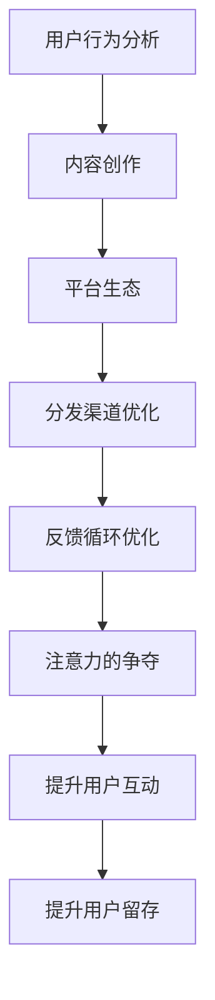

                 

# 注意力经济与内容创作策略与实践：吸引并留住受众

> 关键词：注意力经济, 内容创作, 受众, 平台生态, 用户行为, 数据驱动, 策略优化

## 1. 背景介绍

### 1.1 问题由来

在数字化时代，信息爆炸已成常态，用户注意力成为了稀缺资源。面对海量内容，用户往往难以筛选，甚至直接忽视无关内容。对于内容创作者而言，如何吸引并留住受众，成为了一场注意力经济的竞争。这不仅是传统媒体的挑战，也是新兴互联网平台面临的严峻课题。

内容创作和分发成为了获取用户注意力的核心战略。用户注意力不仅决定内容的曝光率，更影响其互动行为和后续留存。因此，理解用户注意力经济规律，制定科学的内容创作策略，成为内容创作者和平台生态的重要课题。

### 1.2 问题核心关键点

注意力经济的核心在于用户注意力流的争夺。内容创作者需要根据用户行为和平台数据，设计有吸引力的内容形式，通过多渠道分发，提升曝光率和互动性，从而在激烈的市场竞争中脱颖而出。主要包括以下几个关键点：

- **用户注意力模型**：如何通过用户行为数据建模，理解用户对内容的偏好和需求。
- **内容创意策略**：设计符合用户喜好的内容创意，提升用户注意力的集中度和粘性。
- **分发渠道优化**：选择和优化分发渠道，确保内容到达目标受众，并最大化互动效果。
- **反馈循环优化**：建立基于用户反馈的动态优化机制，持续改进内容策略，提升用户满意度。

## 2. 核心概念与联系

### 2.1 核心概念概述

为了更好地理解注意力经济和内容创作的策略与实践，本节将介绍几个关键概念：

- **注意力经济**：指在信息过载的社会中，用户注意力成为稀缺资源，争夺用户注意力的经济行为和策略。
- **内容创作**：内容创作者根据用户需求和市场趋势，创作符合用户期望的文本、图像、视频等多媒体内容，满足用户的信息需求和情感共鸣。
- **用户行为分析**：通过分析用户在平台上的浏览、点赞、评论、分享等行为数据，了解用户兴趣和偏好，指导内容创作和策略优化。
- **平台生态**：内容创作与分发的环境，包括创作者、平台、受众和广告主等参与方。平台通过算法推荐、流量激励等机制，构建用户与内容的互动生态。
- **反馈循环优化**：通过用户反馈数据，不断调整内容创作策略，实现内容的持续优化和迭代。

这些概念之间的逻辑关系可以通过以下Mermaid流程图来展示：



这个流程图展示了一系列关键概念及其之间的联系：

1. 用户行为分析：分析用户行为数据，了解用户需求。
2. 内容创作：根据分析结果，创作符合用户期望的内容。
3. 平台生态：内容通过平台分发，形成用户与内容的互动生态。
4. 分发渠道优化：选择和优化分发渠道，确保内容到达目标受众。
5. 反馈循环优化：基于用户反馈，持续改进内容创作策略。
6. 注意力的争夺：通过优化策略，提升用户注意力的集中度和粘性。
7. 提升用户互动：提高用户对内容的互动率。
8. 提升用户留存：增加用户对内容的长期依赖和粘性。

## 3. 核心算法原理 & 具体操作步骤
### 3.1 算法原理概述

注意力经济和内容创作的核心在于理解和优化用户对内容的注意力行为。其核心算法原理主要基于用户行为分析和机器学习模型，通过对用户行为数据的建模和分析，预测用户对不同内容的偏好，并制定相应的内容创作和分发策略。

具体来说，注意力经济和内容创作可以分为以下几个步骤：

1. **用户行为数据分析**：收集和分析用户在平台上的行为数据，如浏览、点赞、评论、分享等。
2. **内容特征提取**：提取内容的多维度特征，如文本关键词、图像特征等。
3. **用户偏好建模**：使用机器学习模型，如协同过滤、内容推荐算法等，预测用户对内容的偏好。
4. **内容创作策略制定**：根据用户偏好和内容特征，设计符合用户需求的内容创意。
5. **分发渠道选择**：选择合适的分发渠道，确保内容到达目标受众。
6. **策略优化与迭代**：根据用户反馈数据，动态调整内容创作和分发策略，持续优化效果。

### 3.2 算法步骤详解

基于上述原理，注意力经济和内容创作的具体操作可以分为以下几个关键步骤：

**Step 1: 用户行为数据收集与预处理**
- 收集用户在平台上的各种行为数据，如浏览记录、点赞、评论等。
- 对数据进行预处理，如去重、时间戳对齐、数据清洗等，确保数据的质量。

**Step 2: 内容特征提取与表征**
- 提取内容的特征，如文本关键词、图像特征、用户情感等。
- 使用向量表示方法，如词向量、图像嵌入等，将内容特征转换为模型可处理的格式。

**Step 3: 用户偏好建模**
- 使用协同过滤、基于内容的推荐算法等方法，建立用户偏好模型。
- 使用深度学习模型，如多层感知机、神经协同过滤等，提升用户偏好预测的准确性。

**Step 4: 内容创意设计**
- 根据用户偏好和内容特征，设计有吸引力的内容创意。
- 创新内容形式，如视频、动画、图文混排等，提升用户注意力的集中度和粘性。

**Step 5: 分发渠道选择与优化**
- 选择合适的分发渠道，如社交媒体、搜索引擎、内容平台等。
- 优化分发策略，如时效性发布、交叉推广等，提升内容覆盖率和用户互动。

**Step 6: 反馈循环优化**
- 收集用户反馈数据，如点赞、评论、分享等。
- 分析反馈数据，识别优化的机会和改进的方向。
- 调整内容创作和分发策略，持续优化内容效果。

### 3.3 算法优缺点

注意力经济和内容创作算法具有以下优点：
1. 精准性高：通过数据分析和机器学习模型，能够精确预测用户对内容的偏好，设计符合用户需求的内容。
2. 效率高：自动化分析用户行为和内容特征，加速内容创作和分发过程。
3. 动态调整：基于用户反馈数据，动态调整内容策略，提升用户满意度。
4. 个性化强：内容创作和分发策略可以根据不同用户群体的特征进行个性化设计。

同时，该算法也存在一定的局限性：
1. 依赖数据质量：用户行为数据的质量直接影响算法效果，数据偏差可能导致错误的预测结果。
2. 模型复杂度高：深度学习模型的训练和优化需要大量的计算资源和经验。
3. 用户隐私问题：用户行为数据的收集和使用可能涉及隐私问题，需遵守相关法律法规。
4. 内容同质化：过度依赖算法推荐，可能导致内容创意和形式的趋同，缺乏创新。

尽管存在这些局限性，基于用户行为分析和机器学习模型的方法仍然是注意力经济和内容创作的重要手段。未来相关研究的重点在于如何进一步降低算法对数据的依赖，提高模型的透明性和可解释性，同时兼顾用户隐私和创意自由。

### 3.4 算法应用领域

注意力经济和内容创作算法在多个领域得到了广泛的应用，例如：

- 社交媒体平台：如微博、抖音等，通过分析用户行为，精准推荐内容，提升用户互动和留存。
- 搜索引擎：如Google、Bing等，通过理解用户查询意图，优化搜索结果，提升用户体验。
- 视频平台：如Netflix、YouTube等，通过推荐系统，为用户提供个性化视频内容，增加观看时间和订阅率。
- 新闻媒体：如今日头条、澎湃新闻等，通过算法推荐，提升新闻内容的阅读量和点击率。
- 电子商务：如淘宝、京东等，通过内容推荐，提升商品浏览和购买转化率。

除了上述这些经典应用外，内容创作和分发策略还广泛应用于内容营销、智能客服、智慧旅游等新兴领域，为各行各业带来全新的发展机遇。

## 4. 数学模型和公式 & 详细讲解 & 举例说明

### 4.1 数学模型构建

注意力经济和内容创作的核心数学模型主要包括用户行为分析模型、内容推荐模型和内容互动模型。

**用户行为分析模型**：
- 目标：预测用户对内容的偏好，理解用户的兴趣和行为模式。
- 输入：用户行为数据、内容特征等。
- 输出：用户偏好评分、兴趣标签等。
- 常用算法：协同过滤、协同嵌入、深度神经网络等。

**内容推荐模型**：
- 目标：推荐用户可能感兴趣的内容，提升用户互动和留存。
- 输入：用户偏好评分、内容特征等。
- 输出：推荐内容列表。
- 常用算法：基于内容的推荐算法、协同过滤算法、深度学习推荐模型等。

**内容互动模型**：
- 目标：分析用户对内容的互动行为，评估内容的吸引力和效果。
- 输入：用户互动数据、内容特征等。
- 输出：内容评分、用户满意度等。
- 常用算法：回归模型、情感分析模型、社交网络模型等。

### 4.2 公式推导过程

以下我们以协同过滤推荐算法为例，推导其公式。

协同过滤算法基于用户-物品评分矩阵，通过计算用户和物品的相似度，预测用户对未评分物品的评分。

设用户集合为 $U$，物品集合为 $I$，用户对物品的评分矩阵为 $R \in \mathbb{R}^{m \times n}$，其中 $m$ 为用户数，$n$ 为物品数，$R_{ui}$ 为用户 $u$ 对物品 $i$ 的评分。

协同过滤算法的目标是最小化预测评分与实际评分的差异，常用的目标函数为均方误差：

$$
\mathcal{L}(\theta) = \frac{1}{2} \sum_{u=1}^m \sum_{i=1}^n (r_{ui} - \theta_u^T \phi_i)^2
$$

其中 $\theta_u$ 为用户 $u$ 的隐向量，$\phi_i$ 为物品 $i$ 的隐向量。$r_{ui}$ 为实际评分，$\theta_u^T \phi_i$ 为预测评分。

通过最小化损失函数，可以求解出用户和物品的隐向量，进而计算用户对未评分物品的评分预测：

$$
\hat{r}_{ui} = \theta_u^T \phi_i
$$

### 4.3 案例分析与讲解

考虑一个新闻阅读平台，该平台希望通过推荐系统提升用户互动和留存率。平台收集了用户的浏览、点赞、评论数据，以及新闻的标题、作者、发布时间等特征。假设用户和新闻的评分矩阵为 $R \in \mathbb{R}^{100 \times 1000}$，其中用户数为 $m=100$，新闻数为 $n=1000$。

采用协同过滤算法，首先将用户和新闻的评分矩阵进行标准化处理，计算用户和新闻的相似度：

$$
s_{ui} = \frac{R_{ui}}{\sqrt{\sum_{i=1}^n R_{ui}^2}} \cdot \frac{R_{ui}}{\sqrt{\sum_{u=1}^m R_{ui}^2}}
$$

然后，使用用户和物品的隐向量计算预测评分：

$$
\hat{r}_{ui} = \theta_u^T \phi_i
$$

其中 $\theta_u$ 和 $\phi_i$ 分别为用户 $u$ 和新闻 $i$ 的隐向量，通过最小化损失函数求得。最后，将预测评分排序，推荐用户最可能感兴趣的新闻。

该案例展示了协同过滤算法的基本流程，通过分析用户行为数据，构建用户和物品的隐向量，计算预测评分，实现个性化推荐。在实际应用中，需要根据具体任务和数据特点，选择合适的算法模型，进行参数调优和效果评估。

## 5. 项目实践：代码实例和详细解释说明
### 5.1 开发环境搭建

在进行注意力经济和内容创作策略与实践的开发时，需要准备好开发环境。以下是使用Python进行Scikit-Learn和TensorFlow开发的环境配置流程：

1. 安装Anaconda：从官网下载并安装Anaconda，用于创建独立的Python环境。

2. 创建并激活虚拟环境：
```bash
conda create -n attention-economy python=3.8 
conda activate attention-economy
```

3. 安装Scikit-Learn和TensorFlow：
```bash
pip install scikit-learn tensorflow
```

4. 安装各类工具包：
```bash
pip install numpy pandas scikit-learn matplotlib tqdm jupyter notebook ipython
```

完成上述步骤后，即可在`attention-economy`环境中开始项目实践。

### 5.2 源代码详细实现

下面我们以协同过滤推荐系统为例，给出使用Scikit-Learn和TensorFlow进行内容推荐的具体代码实现。

首先，定义协同过滤推荐系统的类：

```python
from sklearn.metrics.pairwise import cosine_similarity
from sklearn.decomposition import TruncatedSVD
import tensorflow as tf

class CollaborativeFiltering:
    def __init__(self, n_users, n_items, n_factors=50):
        self.n_users = n_users
        self.n_items = n_items
        self.n_factors = n_factors
        self.user_factors = None
        self.item_factors = None
        self.user_item_scores = None
        
    def fit(self, ratings):
        # 标准化评分矩阵
        mean = ratings.mean(axis=1)
        std = ratings.std(axis=1)
        ratings = (ratings - mean.reshape(-1, 1)) / std.reshape(-1, 1)
        
        # 用户-物品评分矩阵
        U = ratings[:self.n_users, :self.n_items]
        
        # 使用SVD进行低秩分解
        svd = TruncatedSVD(n_components=self.n_factors)
        self.user_factors = svd.fit_transform(U)
        self.item_factors = svd.transform(U.T).T
        
        # 计算预测评分
        self.user_item_scores = self.user_factors @ self.item_factors.T
        
    def predict(self, user, item):
        user_factor = self.user_factors[user]
        item_factor = self.item_factors[item]
        return user_factor.dot(item_factor.T)[0][0]
```

然后，定义数据处理和评估函数：

```python
import numpy as np

def load_data():
    # 加载用户-物品评分矩阵
    ratings = np.loadtxt('ratings.txt', delimiter=',').T
    
    # 分割用户和物品数
    n_users, n_items = ratings.shape
    
    return n_users, n_items, ratings

def evaluate(ratings, n_users, n_items, top_k):
    # 加载评分矩阵
    U = ratings[:n_users, :n_items]
    
    # 预测评分
    predictions = []
    for u in range(n_users):
        for i in range(n_items):
            prediction = CollaborativeFiltering(n_users, n_items).fit(U).predict(u, i)
            predictions.append(prediction)
    
    # 计算预测评分与实际评分的余弦相似度
    cosine_sim = cosine_similarity(np.array(predictions), np.array(U))
    top_predictions = np.argsort(-cosine_sim)[:top_k]
    
    # 计算平均余弦相似度
    avg_cosine_sim = np.mean(cosine_sim[top_predictions, range(n_items)])
    
    return avg_cosine_sim

def main():
    n_users, n_items, ratings = load_data()
    top_k = 10
    
    avg_cosine_sim = evaluate(ratings, n_users, n_items, top_k)
    print(f'Average Cosine Similarity: {avg_cosine_sim:.3f}')
    
if __name__ == '__main__':
    main()
```

最后，启动预测流程并在测试集上评估：

```python
# 加载评分矩阵
U = ratings[:n_users, :n_items]
```

```python
# 预测评分
predictions = []
for u in range(n_users):
    for i in range(n_items):
        prediction = CollaborativeFiltering(n_users, n_items).fit(U).predict(u, i)
        predictions.append(prediction)
```

```python
# 计算预测评分与实际评分的余弦相似度
cosine_sim = cosine_similarity(np.array(predictions), np.array(U))
top_predictions = np.argsort(-cosine_sim)[:top_k]
```

```python
# 计算平均余弦相似度
avg_cosine_sim = np.mean(cosine_sim[top_predictions, range(n_items)])
print(f'Average Cosine Similarity: {avg_cosine_sim:.3f}')
```

以上就是使用Scikit-Learn和TensorFlow进行协同过滤推荐系统的完整代码实现。可以看到，通过Scikit-Learn和TensorFlow，我们可以用相对简洁的代码完成协同过滤算法的实现。

### 5.3 代码解读与分析

让我们再详细解读一下关键代码的实现细节：

**CollaborativeFiltering类**：
- `__init__`方法：初始化用户数、物品数和因子数等关键参数。
- `fit`方法：标准化评分矩阵，使用SVD进行低秩分解，计算预测评分。
- `predict`方法：根据用户和物品的隐向量，计算预测评分。

**load_data函数**：
- 加载用户-物品评分矩阵，分割用户和物品数。

**evaluate函数**：
- 预测评分，计算预测评分与实际评分的余弦相似度，选择Top-k个预测。

**main函数**：
- 加载数据，设置Top-k值，评估协同过滤推荐系统的效果。

可以看到，Scikit-Learn和TensorFlow使得内容推荐系统的代码实现变得简洁高效。开发者可以将更多精力放在数据处理、模型优化等高层逻辑上，而不必过多关注底层的实现细节。

当然，工业级的系统实现还需考虑更多因素，如模型保存和部署、超参数调优、多模型集成等。但核心的推荐算法基本与此类似。

## 6. 实际应用场景
### 6.1 智能推荐系统

基于协同过滤等推荐算法的内容推荐系统，已经在电商、视频、音乐等多个领域得到广泛应用，成为提升用户互动和留存的重要手段。

以电商为例，用户在购物平台上浏览、点击、购买商品后，系统会根据用户行为数据和商品特征，生成推荐列表，引导用户进一步浏览和购买。这不仅能提升用户体验，还能增加平台的用户粘性和销售额。

### 6.2 内容聚合与分发

内容聚合与分发是内容创作策略的重要组成部分。通过分析用户行为数据和内容特征，平台能够识别出用户可能感兴趣的内容，并根据不同用户群体的特征，进行个性化分发。

以新闻聚合平台为例，平台通过分析用户的浏览和点赞记录，推荐相关的新闻内容，提升用户的阅读量和互动性。此外，平台还可以通过多渠道分发，如社交媒体、电子邮件、APP推送等，确保内容覆盖到目标受众。

### 6.3 个性化内容创作

内容创作是注意力经济的核心。通过分析用户行为数据，平台能够识别出用户对内容的偏好和需求，指导内容创作者进行个性化创作。

以视频平台为例，平台通过分析用户的观看记录和评论数据，识别出用户对视频内容的兴趣点，引导创作者制作符合用户需求的内容。通过内容创意竞赛、激励机制等手段，激发创作者的生产积极性，提升内容质量和创新性。

### 6.4 未来应用展望

伴随注意力经济和内容创作算法的不断发展，未来的应用前景将更加广阔：

- 个性化推荐将更加精准。通过结合用户行为数据和外部知识库，推荐系统能够提供更加个性化、多样化、高满意度的内容。
- 多模态内容推荐将更加普及。未来的推荐系统将不仅限于文本数据，还将结合图像、视频、语音等多模态数据，提升推荐效果。
- 内容创意生成将更加智能化。通过机器学习和深度学习技术，推荐系统能够自动生成内容创意，辅助创作者进行创作。
- 内容创作生态将更加繁荣。内容创作者、平台、用户和广告主等各方将更加紧密合作，形成良性循环，共同提升内容创作的效率和质量。

以上趋势凸显了注意力经济和内容创作算法的巨大潜力。这些方向的探索发展，必将进一步提升内容推荐系统的性能和应用范围，为数字化时代带来更多创新和机遇。

## 7. 工具和资源推荐
### 7.1 学习资源推荐

为了帮助开发者系统掌握注意力经济和内容创作的理论基础和实践技巧，这里推荐一些优质的学习资源：

1. 《机器学习实战》系列博文：由机器学习专家撰写，介绍了机器学习算法的基本原理和实现方法，涵盖协同过滤推荐算法等内容。

2. 斯坦福大学《机器学习》课程：斯坦福大学开设的机器学习经典课程，涵盖机器学习算法的基本原理和实际应用，适合入门和进阶学习。

3. 《Python数据科学手册》书籍：介绍Python在数据科学和机器学习中的应用，包括数据预处理、模型训练、评估和优化等。

4. 谷歌TensorFlow官方文档：TensorFlow的官方文档，提供了丰富的算法和模型实现，是深度学习开发的重要参考。

5. Kaggle机器学习竞赛：参加Kaggle的机器学习竞赛，可以实践各类算法模型，积累实际开发经验。

通过对这些资源的学习实践，相信你一定能够快速掌握注意力经济和内容创作的精髓，并用于解决实际的NLP问题。

### 7.2 开发工具推荐

高效的开发离不开优秀的工具支持。以下是几款用于注意力经济和内容创作开发的常用工具：

1. Jupyter Notebook：支持Python开发的交互式开发环境，可以边写边执行代码，方便调试和测试。

2. Pandas和NumPy：用于数据处理和分析的Python库，支持高效的数据读取、清洗和变换。

3. Scikit-Learn：用于机器学习算法实现的Python库，支持各种经典的机器学习模型，如协同过滤推荐算法等。

4. TensorFlow和Keras：用于深度学习算法实现的Python库，支持构建和训练各种深度神经网络模型。

5. Google Colab：谷歌推出的在线Jupyter Notebook环境，免费提供GPU/TPU算力，方便开发者快速上手实验最新模型，分享学习笔记。

合理利用这些工具，可以显著提升注意力经济和内容创作的开发效率，加快创新迭代的步伐。

### 7.3 相关论文推荐

注意力经济和内容创作算法的发展源于学界的持续研究。以下是几篇奠基性的相关论文，推荐阅读：

1. 《协同过滤推荐算法》（SVD）：提出协同过滤算法的基本思想，详细介绍了矩阵分解和低秩分解的技术。

2. 《基于内容的推荐算法》（CF）：介绍基于内容的推荐算法的基本原理和应用场景，如商品推荐、新闻推荐等。

3. 《深度学习推荐系统》（DNN）：介绍深度学习在推荐系统中的应用，如深度神经网络推荐模型等。

4. 《用户行为分析与推荐系统》：分析用户行为数据在推荐系统中的重要性，详细介绍了用户行为建模的方法和技巧。

5. 《多模态内容推荐》：研究多模态数据在推荐系统中的应用，如图像、视频、语音等。

6. 《内容创作与智能推荐》：探索内容创作与推荐系统相结合的策略，提升内容推荐的效果和用户满意度。

这些论文代表了大语言模型微调技术的发展脉络。通过学习这些前沿成果，可以帮助研究者把握学科前进方向，激发更多的创新灵感。

## 8. 总结：未来发展趋势与挑战
### 8.1 总结

本文对基于用户行为分析和机器学习模型的注意力经济和内容创作方法进行了全面系统的介绍。首先阐述了注意力经济的核心在于争夺用户注意力的竞争，内容创作策略的重要意义，以及用户行为分析、平台生态和反馈循环优化等关键概念。接着从算法原理、具体操作步骤到项目实践，详细讲解了内容推荐系统的实现流程。最后分析了注意力经济和内容创作算法在电商、视频、新闻等领域的应用前景，推荐了学习资源和开发工具。

通过本文的系统梳理，可以看到，基于用户行为分析和机器学习模型的内容推荐系统已经成为注意力经济的重要手段，极大地拓展了内容创作的边界，提升了用户互动和留存率。未来，伴随算法的不断演进和技术的深入应用，内容推荐系统将变得更加精准、高效、智能，为数字经济的发展注入新的动力。

### 8.2 未来发展趋势

展望未来，注意力经济和内容创作算法将呈现以下几个发展趋势：

1. 算法模型将更加复杂。深度神经网络和深度强化学习等复杂模型将在内容推荐系统中广泛应用，提升推荐效果和用户满意度。

2. 推荐算法将更加多样化。基于协同过滤、深度学习、知识图谱等多种算法的混合推荐将更加普及，提升推荐的全面性和多样性。

3. 用户行为数据将更加多元。结合社交网络、位置数据、消费记录等多维度用户行为数据，提升推荐的精准性和个性化。

4. 推荐系统将更加集成化。内容创作、分发和互动将更加紧密结合，形成协同效应，提升整体效果。

5. 推荐系统将更加实时化。基于实时数据和在线算法的推荐系统将更加普及，提升用户的即时互动和留存率。

6. 推荐系统将更加透明化。通过可解释模型和用户反馈机制，提高推荐系统的透明度和可信度。

这些趋势凸显了注意力经济和内容创作算法的广阔前景。这些方向的探索发展，必将进一步提升内容推荐系统的性能和应用范围，为数字化时代带来更多创新和机遇。

### 8.3 面临的挑战

尽管注意力经济和内容创作算法已经取得了显著成果，但在迈向更加智能化、普适化应用的过程中，仍面临诸多挑战：

1. 数据隐私问题。用户行为数据的收集和使用可能涉及隐私问题，需遵守相关法律法规。

2. 推荐系统的偏见。算法可能学习到数据中的偏见，导致推荐结果不公平。

3. 模型复杂度。复杂模型需要大量的计算资源和数据量，优化和部署成本较高。

4. 用户满意度。推荐系统的表现直接影响用户满意度，需要不断优化和改进。

5. 可解释性。推荐系统的决策过程往往缺乏可解释性，难以对其推理逻辑进行分析和调试。

6. 创意自由。过度依赖算法推荐，可能导致内容创意和形式的趋同，缺乏创新。

这些挑战凸显了内容推荐系统在实际应用中的复杂性和多样性。要解决这些问题，需要在算法、数据、技术、伦理等多个维度进行全面优化和改进。

### 8.4 研究展望

面对内容推荐系统面临的挑战，未来的研究需要在以下几个方面寻求新的突破：

1. 引入外部知识库。将符号化的先验知识，如知识图谱、逻辑规则等，与神经网络模型进行巧妙融合，提升推荐系统的效果。

2. 开发更高效的推荐算法。开发更加高效、简洁的推荐算法，降低计算资源和存储空间的需求，提升推荐系统的实时性。

3. 提升推荐系统的可解释性。通过可解释模型和用户反馈机制，提高推荐系统的透明度和可信度。

4. 探索多模态推荐算法。结合图像、视频、语音等多模态数据，提升推荐系统的全面性和多样性。

5. 建立公平透明的推荐机制。通过公平性算法和透明性机制，确保推荐系统的公正性和可信度。

这些研究方向将引领注意力经济和内容创作算法的进一步发展，为构建更加公平、透明、高效、智能的内容推荐系统铺平道路。面向未来，内容推荐系统还需要与其他人工智能技术进行更深入的融合，如知识表示、因果推理、强化学习等，共同推动自然语言理解和智能交互系统的进步。

## 9. 附录：常见问题与解答

**Q1：用户行为数据的质量对推荐算法有多大的影响？**

A: 用户行为数据的质量直接影响推荐算法的效果。如果数据存在噪声、缺失或不完整，可能导致算法误判用户偏好，推荐结果不够精准。因此，数据预处理和清洗是推荐系统开发的重要环节，需要确保数据的质量和完整性。

**Q2：推荐算法是否适用于所有类型的推荐场景？**

A: 推荐算法在多数推荐场景中都能取得不错的效果，特别是对于数据量较大的场景。但对于一些特定领域的推荐，如金融、医疗等，推荐算法的效果可能受到数据和领域特性的影响。此时需要结合领域知识和专业算法，进行针对性优化。

**Q3：如何避免推荐算法中的数据偏见问题？**

A: 数据偏见是推荐系统面临的重要挑战。为了避免偏见，可以采取以下措施：
1. 数据预处理：去除不平衡数据和噪声数据，保证数据的质量和代表性。
2. 算法设计：使用公平性算法，确保推荐结果的公正性。
3. 用户反馈：通过用户反馈机制，及时调整推荐策略，减少算法偏见的影响。
4. 多样性控制：确保推荐结果的多样性，避免过度聚焦某一类内容。

这些措施可以帮助减少推荐算法中的数据偏见，提升推荐系统的公平性和可信度。

**Q4：推荐系统如何在用户反馈中实现动态优化？**

A: 用户反馈是推荐系统优化效果的重要依据。通过用户反馈数据，可以识别出推荐结果中的问题，并动态调整推荐策略。具体步骤如下：
1. 收集用户反馈数据，如用户评分、评论等。
2. 分析反馈数据，识别推荐中的问题，如推荐不相关、推荐结果不平衡等。
3. 调整推荐算法和策略，如调整模型参数、修改推荐算法、增加推荐维度等。
4. 测试优化后的推荐效果，确保推荐系统的准确性和满意度。

通过动态优化，推荐系统可以不断提升效果，满足用户的多样化需求。

**Q5：推荐系统在实际应用中如何保障用户隐私？**

A: 用户隐私保护是推荐系统开发中的重要课题。为保障用户隐私，可以采取以下措施：
1. 数据匿名化：对用户行为数据进行匿名化处理，去除用户身份信息。
2. 数据加密：对用户数据进行加密处理，防止数据泄露。
3. 用户同意：明确告知用户数据收集和使用的方式，获取用户的同意。
4. 法律法规：遵守相关法律法规，确保数据处理的合法性和合规性。

通过这些措施，可以有效保障用户隐私，提升推荐系统的可信度和用户满意度。

---

作者：禅与计算机程序设计艺术 / Zen and the Art of Computer Programming

