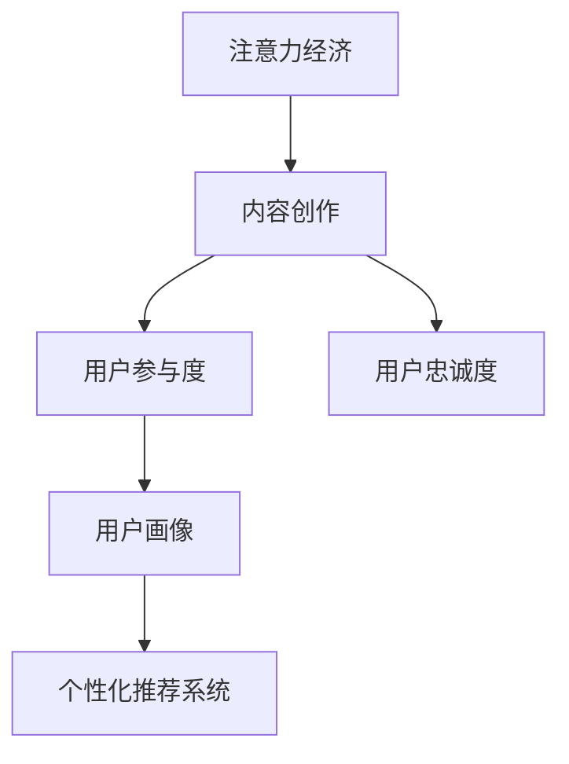

                 

# 注意力经济与内容创作策略：吸引并留住受众的参与度和忠诚度

> 关键词：注意力经济, 内容创作, 用户参与度, 用户忠诚度, 用户行为分析, 内容推荐, 社交网络, 用户画像, 个性化推荐系统

## 1. 背景介绍

### 1.1 问题由来
在信息爆炸的互联网时代，用户注意力成为了一种稀缺资源，特别是在充斥着海量的内容信息和广告信息的环境下，如何吸引并留住用户的注意力，成为了互联网企业的重要战略。特别是内容平台，如社交网络、新闻网站、视频平台等，内容的创作、分发和互动策略直接关系到用户参与度和忠诚度。

在用户注意力争夺战中，大企业凭借其品牌影响力和优质内容，占据了主导地位，但中小型企业也并非无计可施。通过深入理解注意力经济的基本原理，并利用数据驱动的策略进行内容创作和运营，可以有效地提升用户参与度和忠诚度。

### 1.2 问题核心关键点
本文聚焦于以下核心问题：
1. **注意力经济**：探讨注意力资源的价值和分配机制，理解用户行为背后的心理因素。
2. **内容创作策略**：提出如何通过内容创作提升用户参与度和忠诚度的方法。
3. **用户参与度和忠诚度提升**：分析用户参与度和忠诚度的影响因素，并提出有效的提升策略。
4. **数据驱动的运营策略**：介绍如何利用用户数据进行内容推荐、用户画像等策略优化。
5. **未来应用展望**：展望注意力经济和内容创作在更多场景中的应用前景。

## 2. 核心概念与联系

### 2.1 核心概念概述

为更好地理解注意力经济和内容创作策略，本节将介绍几个密切相关的核心概念：

- **注意力经济**：指在信息过载的背景下，用户注意力成为稀缺资源，通过吸引用户注意力来实现商业价值的一种经济形态。
- **内容创作**：指创作出能够吸引用户注意、满足用户需求、提供价值的内容。
- **用户参与度**：指用户与内容互动的频率和深度，如评论、点赞、分享等行为。
- **用户忠诚度**：指用户对内容平台或品牌的长期依赖和信任程度。
- **用户画像**：通过用户行为数据构建的用户特征模型，用于个性化推荐等策略。
- **个性化推荐系统**：基于用户画像进行内容推荐，提升用户满意度和参与度。

这些核心概念之间的逻辑关系可以通过以下Mermaid流程图来展示：



这个流程图展示了几者之间的联系：注意力经济通过内容创作吸引用户，提升用户参与度和忠诚度；用户画像帮助个性化推荐系统优化内容推荐，进而提升用户参与度和忠诚度。

## 3. 核心算法原理 & 具体操作步骤
### 3.1 算法原理概述

注意力经济和内容创作策略的核心在于理解用户行为背后的心理和行为规律，并设计有效的内容创作和分发机制。下面将从几个关键维度进行详细介绍：

- **用户行为分析**：利用用户数据，分析用户行为模式和偏好，识别出用户关注的重点内容。
- **内容创作策略**：基于用户行为分析结果，设计吸引用户注意力、提升用户满意度的内容创作方案。
- **内容分发策略**：通过科学的分发机制，确保优质内容能够被目标用户群体发现和关注。
- **用户参与度提升**：通过互动设计、奖励机制等手段，鼓励用户参与和反馈，提升用户对内容的情感投入。
- **用户忠诚度提升**：通过构建社区、用户成长体系等措施，增强用户对内容平台或品牌的长期依赖和信任。

### 3.2 算法步骤详解

1. **用户行为数据分析**
   - 收集用户行为数据，包括但不限于点击、浏览、评论、点赞、分享等行为。
   - 利用统计学和机器学习工具，分析用户行为模式，识别热门内容特征和用户偏好。
   - 通过聚类、关联规则挖掘等方法，构建用户画像，识别不同用户群体特征。

2. **内容创作策略设计**
   - 根据用户画像和热门内容特征，设计内容创作方案，如话题热门、情感共鸣、用户互动等。
   - 采用多模态内容形式，如图文、视频、音频等，提升内容的吸引力和可读性。
   - 引入用户生成内容（UGC），鼓励用户参与内容创作，提升用户参与度和忠诚度。

3. **内容分发策略优化**
   - 设计推荐算法，根据用户画像和行为数据，推荐符合用户兴趣的内容。
   - 利用A/B测试等方法，不断优化内容分发策略，提高内容曝光率和点击率。
   - 引入算法推送、社交网络分享等机制，扩大内容传播范围。

4. **用户参与度提升策略**
   - 设计互动机制，如评论、点赞、分享、打赏等，鼓励用户参与互动。
   - 引入奖励机制，如积分、优惠券等，激励用户积极参与内容创作和分享。
   - 利用数据分析工具，及时反馈用户参与效果，优化互动策略。

5. **用户忠诚度提升策略**
   - 构建社区，建立用户之间的连接和互动，增强用户粘性。
   - 设计用户成长体系，通过积分、等级、特权等措施，激励用户长期使用。
   - 提供个性化服务，如定制化推荐、专属活动等，提升用户体验和满意度。

### 3.3 算法优缺点

注意力经济和内容创作策略的优点在于：
1. **用户参与度和忠诚度提升**：通过科学的内容创作和分发机制，提升用户对内容的兴趣和互动，增强用户粘性。
2. **数据驱动**：依赖大量用户数据，通过分析挖掘，可以精准把握用户需求和行为规律，优化内容策略。
3. **快速迭代**：通过A/B测试和数据分析，可以迅速调整内容创作和分发策略，实现快速迭代优化。

同时，该方法也存在一定的局限性：
1. **用户隐私问题**：大量用户数据的收集和使用，可能引发用户隐私和数据安全问题。
2. **算法依赖**：依赖推荐的算法和模型，需要持续优化算法以应对用户行为的变化。
3. **内容质量风险**：低质量内容可能误导用户，造成用户体验下降，甚至引发负面影响。
4. **技术门槛高**：需要较高技术水平，特别是在数据收集、分析、模型优化等方面。

尽管存在这些局限性，但就目前而言，注意力经济和内容创作策略是提升用户参与度和忠诚度的有效手段。未来相关研究的重点在于如何进一步优化算法、保护用户隐私、提升内容质量，以实现更加精准、高效的内容创作和分发。

### 3.4 算法应用领域

注意力经济和内容创作策略在多个领域得到了广泛的应用，例如：

- **社交网络平台**：如微信、微博、抖音等，通过内容创作和互动策略，提升用户参与度和忠诚度。
- **新闻网站**：如今日头条、网易新闻等，通过个性化推荐和内容创作，增加用户停留时间和阅读深度。
- **视频平台**：如腾讯视频、爱奇艺等，通过优质视频内容和用户互动，提升用户黏性和满意度。
- **电商平台**：如淘宝、京东等，通过个性化推荐和用户评价，增加用户购物体验和忠诚度。
- **内容创作平台**：如知乎、豆瓣等，通过优质内容和社区互动，增强用户粘性和信任感。

除了上述这些经典应用外，注意力经济和内容创作策略还在更多场景中得到创新性地应用，如健康平台、教育平台、旅游平台等，为相关行业带来了新的增长动力。

## 4. 数学模型和公式 & 详细讲解 & 举例说明

### 4.1 数学模型构建

注意力经济和内容创作策略可以通过一系列数学模型进行描述和优化。本节将从用户行为数据分析和内容推荐两个维度进行数学建模。

**用户行为数据分析模型**
用户行为数据可以表示为一个多维向量 $X$，每个维度表示一种行为，如点击、浏览、评论等。设用户 $u$ 在时间窗口 $t$ 内的行为向量为 $x_u(t)$，所有用户的行为向量集合为 $X$。

用户行为数据矩阵 $X$ 可以表示为：
$$
X = \begin{bmatrix}
x_1(t) & x_2(t) & \cdots & x_n(t) \\
x_1(t-1) & x_2(t-1) & \cdots & x_n(t-1) \\
\vdots & \vdots & \ddots & \vdots \\
x_1(0) & x_2(0) & \cdots & x_n(0)
\end{bmatrix}
$$

**内容推荐模型**
设推荐系统需要推荐给用户 $u$ 的内容项 $i$，内容项的评分向量为 $y_i$，所有内容项的评分向量集合为 $Y$。内容项 $i$ 对用户 $u$ 的评分 $y_{ui}$ 可以表示为：
$$
y_{ui} = w_i^\top \phi_u
$$
其中，$w_i$ 为内容项 $i$ 的权重向量，$\phi_u$ 为用户 $u$ 的特征向量。

设推荐系统的目标是最小化用户对内容的评分误差，即：
$$
\min_{w_i,\phi_u} \sum_{u,i} (y_{ui} - w_i^\top \phi_u)^2
$$

### 4.2 公式推导过程

**用户行为数据分析模型推导**
用户行为数据矩阵 $X$ 可以通过奇异值分解（SVD）进行建模。设 $X$ 的奇异值分解为 $X = U \Sigma V^\top$，其中 $U$ 和 $V$ 为正交矩阵，$\Sigma$ 为对角矩阵，对角线上的元素为奇异值。

用户 $u$ 的特征向量 $\phi_u$ 可以表示为 $V_u = V \alpha_u$，其中 $\alpha_u$ 为 $u$ 的特征向量。设用户 $u$ 在时间窗口 $t$ 内的行为向量为 $x_u(t)$，可以表示为 $x_u(t) = V \alpha_u$。

**内容推荐模型推导**
设推荐系统需要推荐给用户 $u$ 的内容项 $i$，内容项的评分向量为 $y_i$，所有内容项的评分向量集合为 $Y$。内容项 $i$ 对用户 $u$ 的评分 $y_{ui}$ 可以表示为：
$$
y_{ui} = w_i^\top \phi_u = \sum_j w_{ij} \phi_{uj}
$$
其中 $w_{ij}$ 为内容项 $i$ 和用户 $u$ 的交互权重。

推荐系统的目标是最小化用户对内容的评分误差，即：
$$
\min_{w_{ij},\phi_{uj}} \sum_{u,i} (y_{ui} - \sum_j w_{ij} \phi_{uj})^2
$$

通过上述数学模型，可以更好地理解用户行为和内容推荐的本质，从而进行更有效的策略设计。

### 4.3 案例分析与讲解

**案例1：社交网络平台的内容推荐**
社交网络平台如微信、微博等，通过用户行为数据进行内容推荐。用户行为数据包括点赞、评论、分享等，平台通过SVD分解用户行为数据矩阵，提取用户特征向量 $\phi_u$。内容项的评分向量 $y_i$ 可以通过用户的交互数据（如点赞数、评论数等）来计算，权重 $w_i$ 可以通过用户的特征向量进行加权。

**案例2：新闻网站的用户参与度提升**
新闻网站如今日头条、网易新闻等，通过个性化推荐提升用户参与度。用户行为数据包括点击、浏览时间、退出时间等，平台通过SVD分解用户行为数据矩阵，提取用户特征向量 $\phi_u$。内容项的评分向量 $y_i$ 可以通过点击次数、停留时间等来计算，权重 $w_i$ 可以通过用户的特征向量进行加权。

**案例3：视频平台的用户忠诚度提升**
视频平台如腾讯视频、爱奇艺等，通过用户忠诚度提升策略增加用户黏性。用户行为数据包括观看时长、评分、评论等，平台通过SVD分解用户行为数据矩阵，提取用户特征向量 $\phi_u$。内容项的评分向量 $y_i$ 可以通过观看时长、评分等来计算，权重 $w_i$ 可以通过用户的特征向量进行加权。

## 5. 项目实践：代码实例和详细解释说明

### 5.1 开发环境搭建

在进行注意力经济和内容创作策略的实践前，我们需要准备好开发环境。以下是使用Python进行TensorFlow开发的环境配置流程：

1. 安装Anaconda：从官网下载并安装Anaconda，用于创建独立的Python环境。

2. 创建并激活虚拟环境：
```bash
conda create -n tf-env python=3.8 
conda activate tf-env
```

3. 安装TensorFlow：根据CUDA版本，从官网获取对应的安装命令。例如：
```bash
conda install tensorflow-gpu=2.7 -c conda-forge
```

4. 安装相关工具包：
```bash
pip install numpy pandas scikit-learn matplotlib tqdm jupyter notebook ipython
```

完成上述步骤后，即可在`tf-env`环境中开始实践。

### 5.2 源代码详细实现

下面我们以推荐系统为例，给出使用TensorFlow进行内容推荐模型的PyTorch代码实现。

首先，定义推荐模型的输入和输出：

```python
import tensorflow as tf
import tensorflow_datasets as tfds

# 加载数据集
train_data, eval_data = tfds.load('yelp_review_full', split=['train', 'eval'], shuffle_files=True, as_supervised=True)

# 定义输入和输出
input_fn = tf.data.Dataset.from_tensor_slices(({'inputs': [tf.sparse.from_dense(review)})).shuffle(buffer_size=10000).batch(batch_size=32)
label_fn = tf.data.Dataset.from_tensor_slices({'targets': [tf.sparse.from_dense(stars)}).batch(batch_size=32)
```

然后，定义模型结构：

```python
class Recommender(tf.keras.Model):
    def __init__(self, vocab_size, embedding_dim, hidden_units, num_classes):
        super(Recommender, self).__init__()
        self.embedding = tf.keras.layers.Embedding(vocab_size, embedding_dim)
        self.fc1 = tf.keras.layers.Dense(hidden_units, activation='relu')
        self.fc2 = tf.keras.layers.Dense(num_classes, activation='softmax')
    
    def call(self, inputs):
        x = self.embedding(inputs['inputs'])
        x = tf.keras.layers.Dropout(0.2)(x)
        x = self.fc1(x)
        x = self.fc2(x)
        return x

# 定义模型参数
vocab_size = 10000
embedding_dim = 128
hidden_units = 256
num_classes = 5

# 创建模型
model = Recommender(vocab_size, embedding_dim, hidden_units, num_classes)
```

接着，定义优化器和损失函数：

```python
# 定义优化器
optimizer = tf.keras.optimizers.Adam()

# 定义损失函数
loss_fn = tf.keras.losses.SparseCategoricalCrossentropy(from_logits=True)
```

然后，定义训练和评估函数：

```python
# 定义训练函数
def train_step(x):
    with tf.GradientTape() as tape:
        logits = model(x['inputs'])
        loss_value = loss_fn(y_true=x['targets'], y_pred=logits)
    gradients = tape.gradient(loss_value, model.trainable_variables)
    optimizer.apply_gradients(zip(gradients, model.trainable_variables))

# 定义评估函数
def eval_step(x):
    logits = model(x['inputs'])
    return tf.argmax(logits, axis=1)
```

最后，启动训练流程并在验证集上评估：

```python
# 设置训练参数
epochs = 10
batch_size = 32

# 训练模型
for epoch in range(epochs):
    for (inputs, targets) in train_dataset:
        train_step(inputs)
    eval_loss = eval_loss_fn(train_dataset)
    print(f"Epoch {epoch+1}, train loss: {train_loss:.3f}")
    
    print(f"Epoch {epoch+1}, eval loss: {eval_loss:.3f}")
    
print("Model trained.")
```

以上就是使用TensorFlow进行内容推荐模型的完整代码实现。可以看到，TensorFlow提供了强大的工具和API，可以方便地进行模型的定义、训练和评估。

### 5.3 代码解读与分析

让我们再详细解读一下关键代码的实现细节：

**输入和输出定义**
- `tf.data.Dataset.from_tensor_slices`：将输入数据集转换为TensorFlow数据集，支持批处理和打乱操作。
- `tf.sparse.from_dense`：将稠密张量转换为稀疏张量，用于表示文本和标签数据。

**模型结构定义**
- `tf.keras.layers.Embedding`：定义嵌入层，将输入文本转换为低维向量表示。
- `tf.keras.layers.Dense`：定义全连接层，用于特征提取和分类。
- `tf.keras.layers.Dropout`：定义Dropout层，用于防止过拟合。

**优化器和损失函数定义**
- `tf.keras.optimizers.Adam`：定义Adam优化器，进行模型参数更新。
- `tf.keras.losses.SparseCategoricalCrossentropy`：定义交叉熵损失函数，用于计算模型预测与真实标签之间的差异。

**训练和评估函数定义**
- `train_step`：定义训练函数，计算损失值和梯度，并进行参数更新。
- `eval_step`：定义评估函数，计算模型在验证集上的损失和准确率。

**训练流程**
- 设置训练参数，包括训练轮数和批处理大小。
- 对数据集进行循环迭代，对每个样本进行前向传播和后向传播，计算损失值和梯度，进行参数更新。
- 在验证集上评估模型性能，输出训练损失和验证损失。

可以看到，TensorFlow提供了丰富的API和工具，可以高效地进行模型训练和评估。开发者可以根据具体需求，灵活使用TensorFlow的各项功能。

## 6. 实际应用场景

### 6.1 社交网络平台

社交网络平台如微信、微博等，通过内容推荐提升用户参与度。平台通过用户行为数据进行内容推荐，通过优化推荐算法和内容创作策略，提升用户参与度和忠诚度。例如，微信通过朋友圈、公众号等形式，提供个性化的内容推荐，增强用户粘性。

### 6.2 新闻网站

新闻网站如今日头条、网易新闻等，通过个性化推荐提升用户参与度。平台通过用户行为数据进行内容推荐，通过优化推荐算法和内容创作策略，提升用户参与度和忠诚度。例如，今日头条通过算法推荐新闻文章，增加用户停留时间和阅读深度。

### 6.3 视频平台

视频平台如腾讯视频、爱奇艺等，通过用户忠诚度提升策略增加用户黏性。平台通过用户行为数据进行内容推荐，通过优化推荐算法和内容创作策略，提升用户参与度和忠诚度。例如，腾讯视频通过个性化的内容推荐和互动机制，增加用户观看时长和满意度。

### 6.4 未来应用展望

随着注意力经济和内容创作策略的不断演进，未来的应用前景将更加广阔。例如，在医疗、教育、旅游等垂直领域，注意力经济和内容创作策略也将发挥重要作用。

在医疗领域，通过个性化推荐和互动策略，增加患者对医疗信息的关注和参与。在教育领域，通过优质内容创作和推荐，提升学生的学习兴趣和成绩。在旅游领域，通过个性化推荐和用户生成内容，提升游客的体验和满意度。

## 7. 工具和资源推荐

### 7.1 学习资源推荐

为了帮助开发者系统掌握注意力经济和内容创作策略的理论基础和实践技巧，这里推荐一些优质的学习资源：

1. 《深度学习入门》系列博文：由深度学习专家撰写，详细介绍了注意力经济和内容推荐的基本概念和实现方法。

2. CS231n《深度学习课程》课程：斯坦福大学开设的深度学习课程，涵盖深度学习的基础理论和实际应用。

3. 《Python深度学习》书籍：介绍使用Python进行深度学习开发，包括注意力经济和内容创作策略的案例分析。

4. TensorFlow官方文档：TensorFlow的官方文档，提供了全面的API参考和代码示例，是学习TensorFlow的重要资源。

5. Google Colab：谷歌提供的免费Jupyter Notebook环境，支持GPU和TPU，方便开发者快速上手实验。

通过对这些资源的学习实践，相信你一定能够快速掌握注意力经济和内容创作策略的精髓，并用于解决实际的NLP问题。

### 7.2 开发工具推荐

高效的开发离不开优秀的工具支持。以下是几款用于注意力经济和内容创作策略开发的常用工具：

1. TensorFlow：由Google主导开发的深度学习框架，生产部署方便，适合大规模工程应用。

2. PyTorch：基于Python的开源深度学习框架，灵活动态的计算图，适合快速迭代研究。

3. TensorFlow Hub：提供预训练模型的集合，可以方便地集成到自己的项目中。

4. Weights & Biases：模型训练的实验跟踪工具，可以记录和可视化模型训练过程中的各项指标，方便对比和调优。

5. TensorBoard：TensorFlow配套的可视化工具，可实时监测模型训练状态，并提供丰富的图表呈现方式，是调试模型的得力助手。

6. Google Colab：谷歌提供的免费Jupyter Notebook环境，支持GPU和TPU，方便开发者快速上手实验。

合理利用这些工具，可以显著提升注意力经济和内容创作策略的开发效率，加快创新迭代的步伐。

### 7.3 相关论文推荐

注意力经济和内容创作策略的发展源于学界的持续研究。以下是几篇奠基性的相关论文，推荐阅读：

1. Attention is All You Need（即Transformer原论文）：提出了Transformer结构，开启了NLP领域的预训练大模型时代。

2. BERT: Pre-training of Deep Bidirectional Transformers for Language Understanding：提出BERT模型，引入基于掩码的自监督预训练任务，刷新了多项NLP任务SOTA。

3. 《深度学习与NLP》课程：斯坦福大学开设的NLP明星课程，有Lecture视频和配套作业，带你入门NLP领域的基本概念和经典模型。

4. 《NLP理论与实践》书籍：介绍自然语言处理的基本概念、经典模型和应用案例。

5. 《注意力机制在深度学习中的应用》论文：系统综述了注意力机制在深度学习中的理论基础和实际应用，适用于希望深入理解注意力机制的读者。

这些论文代表了大语言模型微调技术的发展脉络。通过学习这些前沿成果，可以帮助研究者把握学科前进方向，激发更多的创新灵感。

## 8. 总结：未来发展趋势与挑战

### 8.1 总结

本文对注意力经济和内容创作策略进行了全面系统的介绍。首先阐述了注意力经济的基本原理和应用场景，明确了内容创作和分发策略的重要性。其次，从原理到实践，详细讲解了注意力经济和内容创作策略的数学模型和关键步骤，给出了推荐系统的完整代码实现。同时，本文还广泛探讨了注意力经济和内容创作策略在多个领域的应用前景，展示了其广阔的应用空间。此外，本文精选了注意力经济和内容创作策略的学习资源和工具，力求为读者提供全方位的技术指引。

通过本文的系统梳理，可以看到，注意力经济和内容创作策略在大规模信息传播中发挥了重要作用，帮助企业和平台提升用户参与度和忠诚度。未来，随着技术的不断进步和应用的不断拓展，这种策略将更加精准、高效，为人类社会的数字化进程注入新的动力。

### 8.2 未来发展趋势

展望未来，注意力经济和内容创作策略将呈现以下几个发展趋势：

1. **个性化推荐算法优化**：随着用户行为数据的多样化和复杂化，个性化推荐算法将不断优化，更加精准地匹配用户兴趣。

2. **多模态内容创作**：未来的内容创作将不再局限于文本形式，而是融合图像、视频、音频等多模态信息，提升内容的吸引力和可读性。

3. **用户生成内容（UGC）**：平台将更加重视用户生成内容，通过互动机制激励用户参与内容创作，提升用户粘性和满意度。

4. **算法和模型集成**：未来的推荐系统将集成多种算法和模型，如深度学习、强化学习、协同过滤等，实现更高效的推荐效果。

5. **数据隐私保护**：随着用户隐私保护意识的增强，未来的推荐系统将更加注重数据隐私保护，采取匿名化、差分隐私等措施。

6. **多领域应用拓展**：注意力经济和内容创作策略将在更多领域得到应用，如医疗、教育、旅游等，为相关行业带来新的增长动力。

以上趋势凸显了注意力经济和内容创作策略的广阔前景。这些方向的探索发展，必将进一步提升推荐系统的性能和应用范围，为数字化社会带来新的变革。

### 8.3 面临的挑战

尽管注意力经济和内容创作策略已经取得了显著成果，但在迈向更加智能化、普适化应用的过程中，它仍面临诸多挑战：

1. **数据隐私问题**：用户行为数据的收集和使用可能引发用户隐私和数据安全问题。如何保护用户隐私，同时充分利用用户数据，仍是一大难题。

2. **算法公平性**：推荐算法可能存在偏见，对某些用户群体不公平。如何设计公平、无偏的推荐算法，是未来需要解决的问题。

3. **内容质量控制**：低质量内容可能误导用户，影响用户体验。如何对内容质量进行有效控制，是平台运营的重要任务。

4. **算法复杂度**：推荐算法越来越复杂，需要更高的计算资源和时间成本。如何降低算法复杂度，实现更高效的推荐，是未来需要优化的问题。

5. **用户粘性管理**：虽然个性化推荐能够提升用户粘性，但如何持续提升用户粘性，避免用户流失，仍是一大挑战。

6. **多领域应用适配**：虽然注意力经济和内容创作策略在多个领域得到了应用，但在不同领域可能需要定制化策略，如何适配多领域应用，仍需进一步研究。

正视注意力经济和内容创作策略面临的这些挑战，积极应对并寻求突破，将是推动其向更高层次发展的关键。

### 8.4 研究展望

面对注意力经济和内容创作策略所面临的挑战，未来的研究需要在以下几个方面寻求新的突破：

1. **多模态数据融合**：融合图像、视频、音频等多模态数据，提升内容的吸引力和可读性。

2. **用户行为数据挖掘**：深入挖掘用户行为数据，构建更加精细化的用户画像，提升推荐精准度。

3. **用户生成内容（UGC）优化**：通过用户生成内容（UGC）提升用户粘性和满意度，实现更高效的内容创作。

4. **推荐算法优化**：不断优化推荐算法，提高推荐效果和用户满意度。

5. **隐私保护技术**：引入隐私保护技术，如差分隐私、匿名化等，保护用户隐私。

6. **公平性研究**：研究公平推荐算法，避免推荐偏见，实现更公平的用户体验。

7. **内容质量控制**：引入内容质量控制机制，提升推荐系统的可靠性。

8. **实时推荐系统**：设计实时推荐系统，实现更高效的内容分发和互动。

这些研究方向的探索，必将引领注意力经济和内容创作策略迈向更高的台阶，为构建安全、可靠、可解释、可控的智能系统铺平道路。面向未来，注意力经济和内容创作策略还需要与其他人工智能技术进行更深入的融合，如知识表示、因果推理、强化学习等，多路径协同发力，共同推动自然语言理解和智能交互系统的进步。只有勇于创新、敢于突破，才能不断拓展注意力经济和内容创作的边界，让智能技术更好地造福人类社会。

## 9. 附录：常见问题与解答

**Q1：如何评估推荐系统的性能？**

A: 推荐系统的性能评估可以从以下几个方面进行：
1. **准确率**：推荐系统推荐内容与用户真实兴趣的匹配程度，通常使用准确率、召回率、F1值等指标评估。
2. **覆盖率**：推荐系统推荐的覆盖面，即推荐系统推荐了多少不同内容项。
3. **多样性**：推荐内容的多样性，即推荐内容是否具有多样性和新颖性。
4. **新鲜度**：推荐内容的更新频率，即推荐内容是否经常更新。
5. **用户体验**：用户对推荐内容的满意度，通常通过用户反馈和行为数据评估。

**Q2：如何选择推荐算法？**

A: 推荐算法的选择应综合考虑以下几个因素：
1. **数据特征**：根据数据特征选择适合的算法，如协同过滤适用于稀疏矩阵数据，基于内容的推荐适用于高维数据。
2. **算法复杂度**：根据计算资源和时间成本选择算法，如深度学习算法通常计算复杂度较高，适合大数据量和小样本数据。
3. **推荐效果**：根据推荐效果选择算法，如基于矩阵分解的算法适用于用户兴趣明确的场景，基于深度学习的算法适用于用户兴趣模糊的场景。
4. **公平性**：根据公平性需求选择算法，如协同过滤算法可能存在推荐偏见，需要设计公平推荐算法。
5. **实时性**：根据实时性需求选择算法，如实时推荐系统需要设计高效的推荐算法，如深度学习算法通常需要较高的计算资源。

**Q3：如何平衡推荐系统的推荐效果和用户隐私保护？**

A: 推荐系统的推荐效果和用户隐私保护是一个需要平衡的问题。可以通过以下方法进行平衡：
1. **匿名化**：对用户行为数据进行匿名化处理，去除敏感信息，保护用户隐私。
2. **差分隐私**：引入差分隐私技术，通过噪声引入，保护用户隐私，同时保持推荐效果。
3. **用户授权**：在推荐系统中引入用户授权机制，让用户自主选择是否分享数据。
4. **算法透明**：设计透明的推荐算法，让用户了解推荐过程，增强用户信任。
5. **数据最小化**：仅收集必要的用户数据，减少对用户隐私的侵害。

**Q4：如何设计公平推荐算法？**

A: 设计公平推荐算法可以通过以下方法：
1. **消除偏见**：在推荐算法中消除固有的偏见，如使用公平性约束、修正算法等。
2. **公平性评估**：引入公平性评估指标，如公平性评分、平衡度等，评估推荐算法的公平性。
3. **多样性控制**：通过多样性控制机制，确保推荐内容的多样性，避免对某些用户群体的不公平。
4. **用户反馈机制**：引入用户反馈机制，及时调整推荐算法，提升推荐公平性。

**Q5：如何在推荐系统中引入用户生成内容（UGC）？**

A: 在推荐系统中引入用户生成内容（UGC）可以通过以下方法：
1. **UGC采集**：通过社交媒体、用户评论等渠道采集UGC，丰富推荐内容。
2. **UGC筛选**：对UGC进行筛选和过滤，去除低质量内容，提升UGC质量。
3. **UGC推荐**：将UGC作为推荐内容，增加用户粘性和满意度。
4. **UGC互动**：通过UGC互动机制，如评论、点赞、分享等，提升用户参与度。
5. **UGC激励**：通过激励机制，如积分、优惠券等，鼓励用户生成UGC。

这些问题的回答展示了注意力经济和内容创作策略在实际应用中需要注意的关键点，帮助开发者更好地理解和应用这些技术。

---

作者：禅与计算机程序设计艺术 / Zen and the Art of Computer Programming

