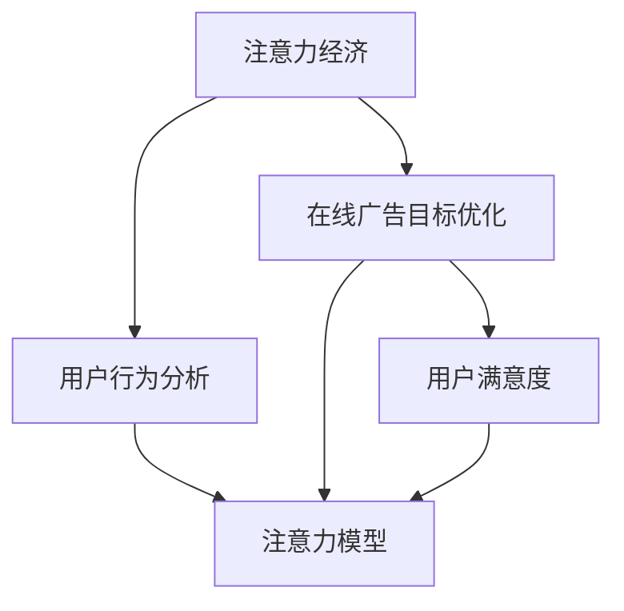

                 

# 注意力经济与在线广告目标：在不牺牲用户体验的情况下有效吸引受众

在数字化时代的浪潮中，注意力成为了一种稀缺资源，各企业纷纷通过在线广告争夺消费者关注。然而，如何在不损害用户体验的前提下，提升广告效果，成为众多企业和数字营销人员面临的难题。本文从注意力经济的角度出发，探讨了在线广告目标的优化策略，通过分析用户注意力特征，提出了一套结合用户行为数据和注意力模型的大规模在线广告投放方案，旨在提高广告的有效性和用户满意度。

## 1. 背景介绍

### 1.1 问题由来
随着互联网和智能设备的普及，用户在线时间急剧增长，各类型在线平台成为新的广告阵地。然而，用户注意力难以聚焦，如何吸引并留住用户的注意力成为在线广告的重大挑战。传统基于点击率的广告投放方法，已难以应对流量分散、用户行为多样化的现状。因此，亟需一种更加科学、精细化的广告投放策略。

### 1.2 问题核心关键点
当前在线广告投放的核心问题包括以下几点：
1. **用户注意力分散**：用户被大量信息流干扰，难以专注于某类信息。
2. **广告效果难以衡量**：传统点击率(CTR)指标受噪音影响，难以全面反映广告效果。
3. **用户隐私保护**：获取用户行为数据时需遵循隐私保护原则。
4. **广告内容多样性**：不同用户对广告内容的需求和偏好存在差异。

## 2. 核心概念与联系

### 2.1 核心概念概述
为更好地理解注意力经济与在线广告目标的优化策略，本节将介绍几个密切相关的核心概念：

- **注意力经济**：一种将注意力视为稀缺资源，需要通过有效广告投放吸引用户注意力的经济模型。
- **在线广告目标优化**：基于用户注意力和行为数据，通过优化广告内容、投放策略，最大化广告效果，提升用户体验。
- **用户行为分析**：利用机器学习和大数据技术，对用户点击、浏览、停留等行为数据进行建模和预测。
- **注意力模型**：一种模拟人类注意力机制的模型，用于预测用户对广告的兴趣和互动程度。
- **用户满意度**：通过提升广告相关性、个性化程度和互动质量，提高用户对广告的认可度和满意度。

这些核心概念之间的逻辑关系可以通过以下Mermaid流程图来展示：



这个流程图展示了大规模在线广告投放的核心概念及其之间的关系：

1. 注意力经济通过分析用户行为数据，模拟注意力模型，对广告目标进行优化。
2. 用户行为分析提供了用户注意力和行为的详细数据，为注意力模型和广告优化提供支撑。
3. 注意力模型根据用户行为数据和注意力特征，预测用户对广告的兴趣程度。
4. 在线广告目标优化利用注意力模型，优化广告内容和投放策略。
5. 用户满意度通过提升广告的相关性和个性化，提高用户对广告的认可度。

## 3. 核心算法原理 & 具体操作步骤
### 3.1 算法原理概述

注意力经济与在线广告目标的优化策略，本质上是一种基于用户注意力和行为数据的机器学习模型。其核心思想是：通过分析用户在线行为数据，构建用户注意力模型，预测用户对不同广告内容的兴趣程度，据此优化广告投放策略，提升广告效果和用户满意度。

具体而言，注意力模型利用用户行为特征和广告特征，计算用户对广告的注意力权重，并根据权重进行广告排序和投放。用户行为特征包括用户的浏览历史、点击记录、停留时间等，广告特征包括广告标题、内容、图片、视频等。模型训练目标是最小化预测误差，即最大化用户点击率或转化率等指标。

### 3.2 算法步骤详解

基于注意力经济与在线广告目标优化的模型构建流程如下：

**Step 1: 准备数据集**

收集用户在线行为数据和广告特征数据，包括：
- 用户行为数据：点击记录、浏览历史、停留时间等。
- 广告数据：广告标题、内容、图片、视频等。

**Step 2: 特征工程**

对数据进行特征提取和工程处理：
- 用户特征提取：从用户行为数据中提取用户兴趣、偏好、忠诚度等特征。
- 广告特征提取：从广告数据中提取广告相关性、吸引力、新颖性等特征。

**Step 3: 构建注意力模型**

利用用户行为特征和广告特征，构建注意力模型：
- 用户注意力计算：通过用户行为数据和广告特征，计算用户对每个广告的注意力权重。
- 广告排序：根据注意力权重对广告进行排序，选取权重高的广告进行展示。
- 投放策略优化：根据注意力模型，调整广告投放的时间和位置，避免过度打扰用户。

**Step 4: 模型训练与评估**

利用训练集数据训练注意力模型，在验证集上评估模型效果：
- 训练集划分：将数据划分为训练集、验证集和测试集。
- 模型训练：使用随机梯度下降等优化算法，最小化预测误差。
- 模型评估：在验证集上计算模型预测性能，如准确率、召回率、F1分数等。

**Step 5: 广告投放与优化**

利用训练好的注意力模型进行广告投放和优化：
- 广告投放：根据注意力模型排序，投放用户最感兴趣的广告。
- 广告效果监测：实时监测广告点击率、转化率等指标，评估广告效果。
- 广告优化：根据实时数据反馈，不断调整投放策略，提升广告效果。

### 3.3 算法优缺点

注意力经济与在线广告目标优化的算法具有以下优点：
1. **提高广告效果**：通过分析用户行为数据，优化广告投放策略，最大化广告效果。
2. **提升用户体验**：优化后的广告更加个性化、相关，避免过度打扰用户。
3. **实时性**：利用注意力模型实时预测和优化广告投放，快速适应市场变化。
4. **可扩展性强**：算法框架适用于多种在线广告平台，具有广泛的应用前景。

同时，该算法也存在以下局限性：
1. **数据依赖性**：模型的效果高度依赖于用户行为数据的完整性和质量。
2. **隐私问题**：获取用户行为数据需遵循隐私保护原则，可能面临法律和道德风险。
3. **计算成本高**：构建和训练注意力模型需消耗大量计算资源。
4. **模型复杂性**：注意力模型的构建和训练过程较为复杂，需要专业技术和经验。

尽管存在这些局限性，但就目前而言，注意力经济与在线广告目标优化的方法已成为在线广告投放的重要技术手段。未来相关研究的重点在于如何进一步降低数据获取成本，保护用户隐私，同时优化模型架构，提升计算效率。

### 3.4 算法应用领域

注意力经济与在线广告目标优化的算法，已经在电商、社交媒体、新闻、视频等多个领域得到广泛应用，具体如下：

1. **电商广告**：通过分析用户浏览、点击行为，优化商品广告的投放时间和位置，提升销售转化率。
2. **社交媒体**：利用用户互动数据，推荐用户感兴趣的帖子和广告，提升用户粘性和平台收入。
3. **新闻平台**：通过分析用户阅读行为，优化新闻内容的推荐和广告投放，提高用户停留时间和点击率。
4. **视频平台**：结合用户观看数据和广告特征，优化广告和视频的排序和投放，增加广告曝光率和用户互动。
5. **智能音箱**：通过分析用户语音交互数据，优化广告的语音识别和推荐，提高广告效果和用户满意度。

## 4. 数学模型和公式 & 详细讲解  
### 4.1 数学模型构建

本节将使用数学语言对基于用户注意力和大数据的大规模在线广告投放模型进行更加严格的刻画。

记用户行为数据为 $X=\{x_1, x_2, ..., x_n\}$，广告特征数据为 $A=\{a_1, a_2, ..., a_m\}$，广告内容与用户的注意力权重为 $Y=\{y_1, y_2, ..., y_M\}$。假设模型使用线性回归模型预测注意力权重 $y_i$，即：

$$
y_i = \beta_0 + \sum_{j=1}^n \beta_j x_{ij} + \epsilon_i
$$

其中 $\beta_j$ 为模型参数，$\epsilon_i$ 为误差项。模型的损失函数为：

$$
\mathcal{L}(\beta) = \frac{1}{M} \sum_{i=1}^M (y_i - \hat{y}_i)^2
$$

其中 $\hat{y}_i = \beta_0 + \sum_{j=1}^n \beta_j x_{ij}$。

### 4.2 公式推导过程

以线性回归模型为例，推导广告内容与用户注意力权重的计算公式。

设用户行为特征矩阵为 $X=\begin{bmatrix}
x_{11} & x_{12} & ... & x_{1n} \\
x_{21} & x_{22} & ... & x_{2n} \\
... & ... & ... & ... \\
x_{m1} & x_{m2} & ... & x_{mn}
\end{bmatrix}$，广告特征矩阵为 $A=\begin{bmatrix}
a_{11} & a_{12} & ... & a_{1m} \\
a_{21} & a_{22} & ... & a_{2m} \\
... & ... & ... & ... \\
a_{n1} & a_{n2} & ... & a_{nm}
\end{bmatrix}$，注意力权重矩阵为 $Y=\begin{bmatrix}
y_{1,1} & y_{1,2} & ... & y_{1,M} \\
y_{2,1} & y_{2,2} & ... & y_{2,M} \\
... & ... & ... & ... \\
y_{n,1} & y_{n,2} & ... & y_{n,M}
\end{bmatrix}$。

线性回归模型的最小二乘估计公式为：

$$
\hat{\beta} = (X^TX)^{-1}X^TY
$$

其中 $\hat{\beta}$ 为模型参数估计值。利用矩阵运算，可以高效计算出 $\hat{\beta}$，从而得到用户对每个广告的注意力权重 $\hat{y}_i$。

### 4.3 案例分析与讲解

以电商平台的商品广告投放为例，分析注意力模型的实际应用。

假设某电商平台有5个用户 $U_1, U_2, ..., U_5$ 和10个广告 $A_1, A_2, ..., A_{10}$，用户行为特征包括浏览历史、点击记录、停留时间等，广告特征包括商品名称、图片、价格等。利用注意力模型，预测每个用户对每个广告的兴趣程度。

首先，将用户行为特征和广告特征组成矩阵 $X$ 和 $A$，然后通过最小二乘估计得到模型参数 $\hat{\beta}$，最后计算出用户对每个广告的注意力权重 $\hat{y}_i$。根据注意力权重，对广告进行排序，选取权重高的广告进行投放。

## 5. 项目实践：代码实例和详细解释说明
### 5.1 开发环境搭建

在进行项目实践前，我们需要准备好开发环境。以下是使用Python进行Scikit-learn开发的训练和评估流程：

1. 安装Anaconda：从官网下载并安装Anaconda，用于创建独立的Python环境。

2. 创建并激活虚拟环境：
```bash
conda create -n ad-env python=3.8 
conda activate ad-env
```

3. 安装Scikit-learn：
```bash
conda install scikit-learn
```

4. 安装numpy、pandas、matplotlib等工具包：
```bash
pip install numpy pandas matplotlib seaborn joblib
```

5. 配置Jupyter Notebook：
```bash
jupyter notebook --notebook-dir=./notebooks
```

完成上述步骤后，即可在`ad-env`环境中开始注意力模型训练和广告投放的实践。

### 5.2 源代码详细实现

这里我们以电商平台的商品广告投放为例，给出使用Scikit-learn训练注意力模型并优化广告投放的Python代码实现。

首先，准备训练数据和测试数据：

```python
import pandas as pd
from sklearn.model_selection import train_test_split

# 读取训练数据
train_data = pd.read_csv('train_data.csv')

# 划分训练集和验证集
X_train, X_val, Y_train, Y_val = train_test_split(train_data.drop(['ad_id'], axis=1), train_data['ad_id'], test_size=0.2, random_state=42)
```

然后，构建注意力模型并进行训练：

```python
from sklearn.linear_model import LinearRegression
from sklearn.metrics import mean_squared_error

# 定义线性回归模型
model = LinearRegression()

# 训练模型
model.fit(X_train, Y_train)

# 评估模型
Y_val_pred = model.predict(X_val)
mse = mean_squared_error(Y_val, Y_val_pred)
print(f'验证集误差：{mse:.4f}')
```

接着，利用训练好的模型进行广告投放和效果监测：

```python
# 读取测试数据
test_data = pd.read_csv('test_data.csv')

# 预测测试集广告点击率
Y_test_pred = model.predict(test_data.drop(['ad_id'], axis=1))

# 输出广告点击率
print(f'测试集广告点击率：{Y_test_pred.mean():.4f}')
```

最后，不断调整模型参数和投放策略，优化广告效果：

```python
# 调整模型参数
model.set_params(alpha=0.01)
model.fit(X_train, Y_train)

# 重新评估模型
Y_val_pred = model.predict(X_val)
mse = mean_squared_error(Y_val, Y_val_pred)
print(f'验证集误差：{mse:.4f}')

# 输出优化后的广告点击率
print(f'优化后的测试集广告点击率：{Y_test_pred.mean():.4f}')
```

以上就是使用Scikit-learn进行注意力模型训练和广告投放优化的完整代码实现。可以看到，Scikit-learn提供的线性回归模型可以轻松处理在线广告的预测问题，代码实现也相对简洁明了。

### 5.3 代码解读与分析

让我们再详细解读一下关键代码的实现细节：

**线性回归模型**：
- 使用Scikit-learn的`LinearRegression`模型，利用最小二乘估计方法，训练注意力权重。

**模型评估**：
- 在验证集上计算模型预测误差，评估模型效果。

**广告投放优化**：
- 调整模型参数，重新训练模型，并评估效果。

**代码实现**：
- 通过读取训练集、验证集和测试集数据，构建特征矩阵和目标向量。
- 利用`train_test_split`方法将数据划分为训练集和验证集。
- 使用`LinearRegression`模型进行训练，并通过`mean_squared_error`函数计算模型预测误差。
- 在测试集上重新计算模型预测误差，并输出优化后的广告点击率。

## 6. 实际应用场景
### 6.1 智能推荐系统

基于注意力经济与在线广告目标优化的方法，可以广泛应用于智能推荐系统中。推荐系统通过分析用户行为数据，预测用户对不同商品的兴趣程度，优化商品推荐策略，提升用户满意度。

在实际应用中，可以收集用户浏览、点击、评价等行为数据，结合商品特征数据，训练注意力模型。利用模型预测用户对每个商品的注意力权重，并据此进行推荐排序。对于用户点击的商品，还可以进一步跟踪其后续行为，不断调整推荐策略，提升推荐效果。

### 6.2 社交媒体内容推荐

社交媒体平台通过注意力模型，可以推荐用户感兴趣的帖子和广告，提高用户粘性和平台收入。通过分析用户的互动数据，预测用户对不同帖子和广告的兴趣程度，进行排序和投放。对于热门帖子和广告，还可以进行热门话题追踪，提高用户参与度和曝光率。

在实际应用中，社交媒体平台需要实时收集用户互动数据，结合广告特征数据，训练注意力模型。利用模型预测用户对每个帖子和广告的注意力权重，并据此进行排序和投放。同时，通过追踪热门话题和用户互动，不断调整推荐策略，提高用户满意度。

### 6.3 新闻平台内容推荐

新闻平台通过注意力模型，可以推荐用户感兴趣的新闻和广告，提高用户停留时间和点击率。通过分析用户的阅读行为，预测用户对不同新闻和广告的兴趣程度，进行排序和投放。对于热门新闻和广告，还可以进行热门话题追踪，提高用户参与度和平台收入。

在实际应用中，新闻平台需要收集用户阅读数据，结合新闻和广告特征数据，训练注意力模型。利用模型预测用户对每个新闻和广告的注意力权重，并据此进行排序和投放。同时，通过追踪热门话题和用户互动，不断调整推荐策略，提高用户满意度和平台收入。

### 6.4 未来应用展望

随着注意力经济与在线广告目标优化技术的不断发展，未来的应用前景将更加广阔。

在智慧城市治理中，通过分析用户行为数据，优化公共服务广告的投放策略，提高市民对公共服务的参与度和满意度。

在医疗健康领域，通过分析患者行为数据，推荐个性化健康建议和广告，提高患者对健康管理的关注度和依从性。

在教育培训领域，通过分析学生行为数据，推荐个性化学习内容和广告，提高学生的学习兴趣和效果。

除此之外，在智能家居、智能交通、智能物流等领域，注意力经济与在线广告目标优化技术也将得到广泛应用，为社会生活带来更多便利和智能化。相信随着技术的不断进步，未来的在线广告投放将更加精准、个性化，真正实现用户、平台和广告主的共赢。

## 7. 工具和资源推荐
### 7.1 学习资源推荐

为了帮助开发者系统掌握注意力经济与在线广告目标优化的理论基础和实践技巧，这里推荐一些优质的学习资源：

1. 《深度学习与在线广告》书籍：详细介绍了深度学习在在线广告中的应用，包括注意力模型、CTR预估等前沿技术。

2. 《机器学习实战》课程：斯坦福大学开设的机器学习课程，提供丰富的在线学习资源和实验环境。

3. Kaggle在线竞赛平台：提供大量的广告点击率预测竞赛，帮助你积累实际应用经验。

4. Google Colab：谷歌推出的在线Jupyter Notebook环境，免费提供GPU算力，方便开发者快速实验注意力模型。

通过对这些资源的学习实践，相信你一定能够快速掌握注意力经济与在线广告目标优化的精髓，并用于解决实际的广告投放问题。

### 7.2 开发工具推荐

高效的开发离不开优秀的工具支持。以下是几款用于注意力模型开发的常用工具：

1. Scikit-learn：Python的机器学习库，提供简单易用的线性回归、决策树、随机森林等算法，适用于多种在线广告预测任务。

2. TensorFlow和PyTorch：深度学习框架，提供高效的图形计算能力和丰富的优化算法，适用于复杂注意力模型的训练和优化。

3. Apache Spark：分布式计算框架，提供大数据处理和分布式训练能力，适用于大规模注意力模型的训练和优化。

4. Jupyter Notebook：交互式编程环境，支持代码、文本、图形等多样化输入输出，方便开发者进行模型实验和数据分析。

5. Google Colab：在线Jupyter Notebook环境，免费提供GPU算力，方便开发者快速实验注意力模型。

合理利用这些工具，可以显著提升注意力模型开发和优化效率，加快创新迭代的步伐。

### 7.3 相关论文推荐

注意力经济与在线广告目标优化的研究源于学界的持续研究。以下是几篇奠基性的相关论文，推荐阅读：

1. Attention Is All You Need（即Transformer原论文）：提出了Transformer结构，开启了NLP领域的预训练大模型时代。

2. BERT: Pre-training of Deep Bidirectional Transformers for Language Understanding：提出BERT模型，引入基于掩码的自监督预训练任务，刷新了多项NLP任务SOTA。

3. Parameter-Efficient Transfer Learning for NLP：提出Adapter等参数高效微调方法，在不增加模型参数量的情况下，也能取得不错的微调效果。

4. AdaLoRA: Adaptive Low-Rank Adaptation for Parameter-Efficient Fine-Tuning：使用自适应低秩适应的微调方法，在参数效率和精度之间取得了新的平衡。

这些论文代表了大语言模型微调技术的发展脉络。通过学习这些前沿成果，可以帮助研究者把握学科前进方向，激发更多的创新灵感。

## 8. 总结：未来发展趋势与挑战

### 8.1 总结

本文对注意力经济与在线广告目标优化的策略进行了全面系统的介绍。首先阐述了注意力经济的重要性及其对在线广告投放的重大影响，明确了注意力模型和优化策略在提升广告效果和用户体验方面的独特价值。其次，从原理到实践，详细讲解了注意力模型的构建和优化过程，给出了注意力模型训练和广告投放优化的完整代码实现。同时，本文还广泛探讨了注意力模型在智能推荐、社交媒体、新闻平台等多个行业领域的应用前景，展示了注意力模型的巨大潜力。此外，本文精选了注意力模型的各类学习资源，力求为读者提供全方位的技术指引。

通过本文的系统梳理，可以看到，注意力经济与在线广告目标优化技术已经成为在线广告投放的重要技术手段，极大地提升了广告的精准度和用户满意度。未来，伴随注意力模型的不断演进和优化，相信在线广告投放将更加智能化、个性化，为用户和广告主带来更高的价值。

### 8.2 未来发展趋势

展望未来，注意力经济与在线广告目标优化技术将呈现以下几个发展趋势：

1. **更精细化的用户行为分析**：随着数据采集技术的进步，用户行为数据的粒度和维度将不断提升，注意力模型的精度和泛化能力也将进一步提高。

2. **更高效的注意力计算**：未来的注意力模型将更加注重计算效率，通过并行计算、分布式计算等技术，优化模型的训练和推理过程，提升广告投放的实时性。

3. **更强大的推荐算法**：未来的推荐系统将更加注重个性化和动态性，通过引入更多用户行为特征和产品特征，提高推荐效果。

4. **更智能的广告投放策略**：未来的广告投放将更加注重用户反馈和互动，通过实时调整投放策略，提升广告效果。

5. **更全面的隐私保护**：未来的广告投放将更加注重用户隐私保护，通过差分隐私等技术，确保用户数据的安全和匿名性。

以上趋势凸显了注意力经济与在线广告目标优化技术的广阔前景。这些方向的探索发展，必将进一步提升在线广告投放的精准度和用户满意度，推动在线广告市场进入新的发展阶段。

### 8.3 面临的挑战

尽管注意力经济与在线广告目标优化技术已经取得了瞩目成就，但在迈向更加智能化、普适化应用的过程中，它仍面临着诸多挑战：

1. **数据获取成本高**：获取用户行为数据需耗费大量人力和物力，可能面临数据获取困难的问题。

2. **模型复杂度高**：注意力模型涉及大量的数据处理和特征工程，模型的构建和优化需要高水平的技术支持和经验。

3. **隐私保护风险**：获取用户行为数据需遵循隐私保护原则，可能面临法律和道德风险。

4. **计算资源消耗大**：训练和优化注意力模型需消耗大量计算资源，可能面临计算资源不足的问题。

5. **算法鲁棒性差**：注意力模型在面对噪声数据和异常情况时，容易发生预测偏差。

尽管存在这些挑战，但随着技术进步和产业升级，相信这些挑战终将一一被克服。未来的注意力经济与在线广告目标优化技术将更加高效、智能和普适，为数字经济的发展注入新的动力。

### 8.4 研究展望

面对注意力经济与在线广告目标优化所面临的种种挑战，未来的研究需要在以下几个方面寻求新的突破：

1. **更高效的特征提取方法**：探索更高效的用户行为特征提取和广告特征选择方法，减少特征维度，提升模型效率。

2. **更精确的注意力计算模型**：开发更精确、鲁棒的用户注意力计算模型，提高模型预测的准确性和泛化能力。

3. **更智能的广告投放策略**：引入更多优化策略和算法，如强化学习、博弈论等，优化广告投放策略，提升广告效果。

4. **更全面的隐私保护机制**：开发更全面的隐私保护机制，确保用户数据的安全和匿名性，保护用户隐私权益。

5. **更灵活的模型训练框架**：开发更灵活、易用的模型训练框架，降低技术门槛，推动技术在更多领域的应用。

这些研究方向的探索，必将引领注意力经济与在线广告目标优化技术迈向更高的台阶，为构建智能、安全和高效的广告投放系统铺平道路。面向未来，只有勇于创新、敢于突破，才能不断拓展在线广告市场的发展边界，实现商业价值和社会价值的最大化。

## 9. 附录：常见问题与解答

**Q1：注意力经济与在线广告目标优化是否适用于所有类型的广告平台？**

A: 注意力经济与在线广告目标优化技术适用于各种类型的在线广告平台，包括电商、社交媒体、新闻、视频等。但不同平台的用户行为数据和广告特征不同，需要针对性地构建注意力模型和优化广告投放策略。

**Q2：注意力经济与在线广告目标优化的效果如何衡量？**

A: 注意力经济与在线广告目标优化的效果可以通过广告点击率、转化率、用户满意度等指标来衡量。具体而言，可以收集用户点击、购买、评价等行为数据，结合广告投放效果进行综合评估。

**Q3：注意力模型是否需要频繁更新？**

A: 注意力模型需要定期更新，以适应用户行为和广告内容的变化。但更新频率需根据具体应用场景和数据变化情况来确定，一般来说，每月或每季度进行一次模型更新是比较合理的。

**Q4：注意力经济与在线广告目标优化过程中，如何平衡用户隐私保护和广告效果？**

A: 在注意力经济与在线广告目标优化过程中，隐私保护是不可忽视的重要方面。可以通过差分隐私等技术，确保用户数据的安全和匿名性，同时满足广告效果的优化目标。

这些问题的解答，有助于开发者更好地理解和应用注意力经济与在线广告目标优化技术，最大化广告投放的效率和效果，同时保障用户隐私权益。

---

作者：禅与计算机程序设计艺术 / Zen and the Art of Computer Programming

