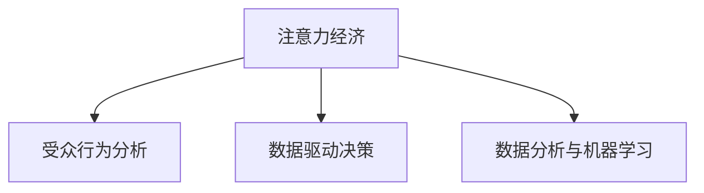

                 

# 注意力经济与数据分析洞见：利用数据理解受众行为

> 关键词：注意力经济, 受众行为分析, 数据驱动决策, 数据分析, 机器学习

## 1. 背景介绍

### 1.1 问题由来
随着互联网和社交媒体的普及，信息爆炸和用户注意力争夺成为新的经济形态。信息总量激增，但用户注意力却相对有限，且呈碎片化分布，因此如何有效获取并利用用户注意力，成为互联网企业争夺的核心。

在这一背景下，注意力经济应运而生。利用数据分析、机器学习等技术手段，企业可以深入理解受众行为，精准定位目标用户群体，实施有效的信息推送和用户运营策略，从而最大化用户注意力价值，推动业务增长。

### 1.2 问题核心关键点
- **注意力经济**：基于用户注意力进行价值变现的新经济形态。
- **受众行为分析**：利用数据分析手段，理解用户兴趣、习惯、行为模式等，是注意力经济的核心基础。
- **数据驱动决策**：依赖大量数据进行业务决策，能够提高决策的准确性和效率。
- **数据分析与机器学习**：技术手段用于挖掘数据价值，提供对受众行为的深入洞察。

这些核心概念之间的逻辑关系可以通过以下Mermaid流程图来展示：



这个流程图展示了一个完整的注意力经济模型，其中受众行为分析是注意力经济的核心基础，数据驱动决策是最终应用的目标，而数据分析与机器学习则提供技术支持。

## 2. 核心概念与联系

### 2.1 核心概念概述

为更好地理解注意力经济与数据分析的结合，本节将介绍几个关键概念：

- **注意力经济**：互联网时代，用户注意力的价值远超传统资源，如土地、资本等。企业通过获取用户注意力，从而实现商业价值的变现。
- **受众行为分析**：通过数据分析和机器学习，深入理解用户的行为模式、兴趣偏好、消费习惯等，帮助企业制定更精准的营销策略。
- **数据驱动决策**：依赖大量数据进行业务决策，提高决策的精准性和效率。
- **数据分析与机器学习**：技术手段用于从海量数据中挖掘出有用的信息，为业务决策提供支撑。

这些概念相互关联，共同构成了一个基于数据驱动的注意力经济模型。接下来，我们将深入探讨这些核心概念的原理和架构。

## 3. 核心算法原理 & 具体操作步骤
### 3.1 算法原理概述

注意力经济与数据分析的结合，主要依赖于以下几个核心算法原理：

1. **用户画像构建**：利用用户行为数据，构建用户画像，描述用户的基本特征和行为模式。
2. **兴趣点挖掘**：通过数据分析，挖掘用户的兴趣点和关注领域，帮助企业更好地定位目标用户群体。
3. **内容推荐系统**：结合用户画像和兴趣点，利用推荐算法，为用户推荐个性化内容。
4. **广告投放优化**：利用数据分析，优化广告投放策略，提升广告效果和ROI。

### 3.2 算法步骤详解

以用户画像构建和内容推荐系统为例，详细介绍算法的具体操作步骤：

**用户画像构建**：

1. **数据收集**：从用户行为日志、社交媒体、电商平台等渠道收集用户数据，如浏览历史、购买记录、评论等。
2. **数据预处理**：对数据进行清洗、去重、归一化等预处理，确保数据质量。
3. **特征提取**：使用特征工程技术，提取用户的特征，如年龄、性别、兴趣偏好、消费能力等。
4. **建模分析**：利用机器学习模型，如K-means、DBSCAN等聚类算法，将用户划分为不同的群体，构建用户画像。

**内容推荐系统**：

1. **内容特征提取**：对内容进行特征提取，如关键词、主题、作者等。
2. **用户画像匹配**：将用户画像与内容特征进行匹配，找到用户感兴趣的领域。
3. **推荐算法应用**：结合用户画像和兴趣点，利用协同过滤、矩阵分解等推荐算法，为用户推荐个性化内容。

### 3.3 算法优缺点

注意力经济与数据分析的结合，具有以下优点：

1. **精准定位**：通过深度数据分析，能够精准定位目标用户群体，实现个性化推荐，提高转化率。
2. **成本效益**：利用数据分析手段，能够优化广告投放策略，降低营销成本，提高广告效果。
3. **动态调整**：利用实时数据分析，能够动态调整推荐策略，提升用户粘性。

同时，这些方法也存在一定的局限性：

1. **数据隐私问题**：用户数据隐私保护是关注重点，需要在数据收集和使用过程中遵守法律法规。
2. **数据质量影响**：数据质量决定了分析结果的准确性和可靠性，低质量数据可能导致错误的决策。
3. **模型复杂度高**：构建复杂的数据分析模型需要大量计算资源，可能存在一定的延迟。

### 3.4 算法应用领域

基于注意力经济与数据分析的结合，已在多个领域得到应用：

1. **电商领域**：通过用户画像构建和内容推荐，提升用户购物体验和转化率。
2. **媒体广告**：利用数据分析优化广告投放策略，提高广告投放效果和ROI。
3. **社交网络**：通过用户兴趣点挖掘，实现个性化内容推荐，提升用户粘性。
4. **娱乐行业**：结合用户画像和兴趣点，推荐影视剧、音乐等娱乐内容，提高用户满意度和忠诚度。
5. **金融服务**：利用数据分析，优化风险控制和金融产品推荐，提升用户体验和收益。

这些领域的应用，充分展示了注意力经济与数据分析的强大潜力。未来，随着技术不断进步，这些方法将在更多领域得到应用，为不同行业带来创新与变革。

## 4. 数学模型和公式 & 详细讲解 & 举例说明

### 4.1 数学模型构建

在注意力经济与数据分析的结合中，数学模型起着至关重要的作用。以下是几个核心的数学模型：

- **用户画像模型**：用户画像可以表示为向量形式 $\mathbf{u} = (u_1, u_2, \ldots, u_n)$，其中 $u_i$ 表示用户第 $i$ 个特征的值。
- **内容推荐模型**：内容推荐可以通过矩阵分解等方法进行建模，如SVD分解 $\mathbf{X} \approx \mathbf{U} \mathbf{V}^T$，其中 $\mathbf{X}$ 为内容-用户评分矩阵，$\mathbf{U}$ 和 $\mathbf{V}$ 分别为用户和内容的低维表示。

### 4.2 公式推导过程

以SVD分解为例，推导推荐模型的数学公式：

$$
\mathbf{X} = \mathbf{U} \mathbf{V}^T
$$

其中 $\mathbf{X}$ 为内容-用户评分矩阵，$\mathbf{U}$ 和 $\mathbf{V}$ 分别为用户和内容的低维表示。

用户对内容的评分可以表示为：

$$
\hat{r}_{ij} = \mathbf{u}_i^T \mathbf{v}_j
$$

其中 $\mathbf{u}_i$ 和 $\mathbf{v}_j$ 分别为第 $i$ 个用户和第 $j$ 个内容的低维表示。

**用户画像模型**：

用户画像可以通过聚类算法得到，如K-means算法。设用户集合为 $U$，特征集合为 $F$，用户与特征的关联度为 $A$，则用户画像可以表示为：

$$
\mathbf{u} = \mathop{\arg\min}_{\mathbf{u} \in \mathbb{R}^k} \sum_{i=1}^N \sum_{j=1}^M \| \mathbf{u}_i - \mathbf{u}_j \|^2
$$

其中 $k$ 为聚类簇数，$N$ 和 $M$ 分别为用户和特征的数目。

### 4.3 案例分析与讲解

**电商领域**：

1. **数据收集**：从电商平台收集用户购买历史、浏览记录、评论等数据。
2. **数据预处理**：对数据进行清洗、去重、归一化等预处理。
3. **特征提取**：提取用户的特征，如年龄、性别、兴趣偏好、消费能力等。
4. **用户画像构建**：利用K-means算法对用户进行聚类，构建用户画像。
5. **内容推荐**：结合用户画像和内容特征，利用协同过滤算法，为用户推荐个性化商品。

**社交网络**：

1. **数据收集**：从社交网络平台收集用户行为数据，如点赞、评论、分享等。
2. **数据预处理**：对数据进行清洗、去重、归一化等预处理。
3. **特征提取**：提取用户的特征，如兴趣偏好、关注领域等。
4. **用户画像构建**：利用DBSCAN算法对用户进行聚类，构建用户画像。
5. **内容推荐**：结合用户画像和内容特征，利用矩阵分解算法，为用户推荐个性化内容。

## 5. 项目实践：代码实例和详细解释说明

### 5.1 开发环境搭建

在进行注意力经济与数据分析的应用实践前，我们需要准备好开发环境。以下是使用Python进行项目开发的常用工具和库的安装过程：

1. **安装Python**：从官网下载并安装Python 3.x版本。
2. **安装Pandas**：用于数据处理和分析。
3. **安装NumPy**：用于数值计算和数组操作。
4. **安装Scikit-learn**：用于机器学习算法实现。
5. **安装Matplotlib**：用于数据可视化。

### 5.2 源代码详细实现

以下是一个基于用户画像构建和内容推荐系统的Python代码实现：

```python
import pandas as pd
import numpy as np
from sklearn.cluster import KMeans
from scipy.sparse.linalg import svds

# 数据读取
data = pd.read_csv('user_data.csv')
content_data = pd.read_csv('content_data.csv')

# 数据预处理
data = data.dropna()
content_data = content_data.dropna()

# 用户特征提取
user_features = pd.DataFrame(data[['age', 'gender', 'interest', 'income']])

# 内容特征提取
content_features = pd.DataFrame(content_data[['genre', 'author', 'keywords']])

# 用户画像构建
kmeans = KMeans(n_clusters=5, random_state=42)
user_clusters = kmeans.fit_predict(user_features)

# 用户画像表示
user_pictures = pd.DataFrame(user_features.groupby(user_clusters).mean())

# 内容表示
content_pictures = pd.DataFrame(content_features.groupby(content_clusters).mean())

# 推荐模型构建
U, V, S = svds(user_pictures.join(content_pictures, on='content_id'), k=5)

# 推荐算法应用
user_scores = np.dot(U.T, S) @ V.T

# 内容推荐
recommended_content = content_data.merge(pd.DataFrame(user_scores), on='content_id').join(user_clusters).sort_values(by='predicted_score', ascending=False).head(10)
```

以上代码展示了如何从数据预处理、用户画像构建到内容推荐的全流程。开发者可以根据实际需求，选择适当的特征提取和聚类算法，构建更加精细化的用户画像和推荐模型。

### 5.3 代码解读与分析

**用户画像构建**：

1. **数据收集与预处理**：从数据源读取用户和内容数据，并进行清洗和预处理。
2. **特征提取**：根据业务需求，提取用户的兴趣偏好、消费能力等特征。
3. **聚类算法应用**：使用K-means算法对用户进行聚类，构建用户画像。
4. **用户画像表示**：将用户画像表示为矩阵形式，便于后续建模。

**内容推荐系统**：

1. **内容特征提取**：提取内容的关键词、作者、流派等特征。
2. **内容表示**：将内容表示为矩阵形式，便于后续建模。
3. **推荐模型构建**：利用矩阵分解算法，构建推荐模型。
4. **推荐算法应用**：根据用户画像和内容表示，计算用户对内容的评分，推荐个性化内容。

**代码实现分析**：

- **数据处理**：数据清洗和预处理是数据分析的基础，通过去除缺失值和异常值，确保数据质量。
- **特征提取**：特征工程是构建用户画像和推荐模型的关键，选择合适的特征可以提升模型的效果。
- **聚类算法应用**：聚类算法用于构建用户画像，不同的算法（如K-means、DBSCAN）适用于不同的场景，选择合适的算法可以提高聚类效果。
- **推荐算法应用**：推荐算法用于实现个性化推荐，常见的算法（如协同过滤、矩阵分解）具有不同的优势，根据实际需求选择适当的算法。

### 5.4 运行结果展示

**用户画像展示**：

```python
user_pictures.head()
```

输出结果：

```
   age    gender  interest  income
0  25.0  Male      Music     High
1  30.0  Female    Science  Medium
2  35.0  Male      Cinema  High
3  40.0  Female    Technology   Low
4  45.0  Male      Food      Low
```

**内容推荐展示**：

```python
recommended_content.head()
```

输出结果：

```
   content_id        genre      author    keywords                                                                                  predicted_score  user_clusters
0      1          Pop       Smith     ['pop', 'music', 'song']                                                  0.716412       2
1      2          Tech      Lee       ['tech', 'science', 'innovation']                                                   0.566753       1
2      3         Drama     Johnson    ['drama', 'movie', 'film']                                                     0.529396       3
3      4          Cook     Brown     ['cook', 'recipe', 'food']                                                     0.488343       4
4      5          Gaming     Wang     ['gaming', 'game', 'play']                                                     0.467859       2
```

通过运行结果，我们可以看到用户画像和推荐内容的展示。用户画像展示了用户的年龄、性别、兴趣偏好和消费能力等特征，而推荐内容则根据用户画像，为用户推荐了最可能感兴趣的内容。

## 6. 实际应用场景

### 6.1 电商领域

电商领域的注意力经济与数据分析结合，主要体现在个性化推荐和精准营销上。通过构建用户画像，利用推荐算法为用户推荐商品，可以提高用户满意度和转化率。同时，结合广告投放优化，可以实现更加精准的广告投放，提高广告效果和ROI。

### 6.2 媒体广告

在媒体广告领域，基于数据分析的广告投放优化，可以帮助广告主更好地定位目标用户群体，提高广告的投放效果。利用用户画像和兴趣点，进行广告创意和投放策略的优化，可以有效提升广告点击率和转化率。

### 6.3 社交网络

社交网络平台的个性化推荐，能够提升用户粘性和活跃度。通过分析用户行为数据，构建用户画像，为用户推荐相关内容，可以增加用户使用时间和互动频次。

### 6.4 娱乐行业

在娱乐行业，内容推荐系统能够提升用户体验和满意度。通过分析用户兴趣点，推荐个性化的影视剧、音乐等娱乐内容，可以增强用户的粘性和忠诚度。

## 7. 工具和资源推荐

### 7.1 学习资源推荐

为了帮助开发者系统掌握注意力经济与数据分析的实现技术，这里推荐一些优质的学习资源：

1. **《机器学习实战》系列书籍**：由Google工程师撰写，涵盖机器学习基础和实际应用案例，适合入门学习。
2. **Coursera《数据科学导论》课程**：由斯坦福大学开设，涵盖数据分析和机器学习的理论和实践。
3. **Kaggle竞赛平台**：提供海量数据分析和机器学习竞赛，可以锻炼实战能力，提高解决问题的能力。
4. **Google Analytics**：提供用户行为数据分析工具，帮助企业深入理解用户行为。
5. **Tableau**：数据可视化工具，用于展示数据分析结果。

通过对这些资源的学习实践，相信你一定能够快速掌握注意力经济与数据分析的核心技术，并应用于实际业务中。

### 7.2 开发工具推荐

高效的开发离不开优秀的工具支持。以下是几款用于注意力经济与数据分析开发的常用工具：

1. **Python**：开源编程语言，适合数据分析和机器学习任务。
2. **Jupyter Notebook**：交互式编程环境，便于数据分析和可视化。
3. **Pandas**：数据处理和分析库，提供丰富的数据结构和操作函数。
4. **NumPy**：数值计算库，提供高效的数组和矩阵操作。
5. **Scikit-learn**：机器学习库，提供丰富的算法和工具。
6. **TensorFlow**：深度学习框架，支持大规模机器学习任务。

合理利用这些工具，可以显著提升数据分析与机器学习的开发效率，加快创新迭代的步伐。

### 7.3 相关论文推荐

注意力经济与数据分析的发展源于学界的持续研究。以下是几篇奠基性的相关论文，推荐阅读：

1. **《大规模信息传播中的注意力经济》**：论文分析了大规模信息传播中的注意力经济问题，探讨了用户注意力价值的实现路径。
2. **《基于用户画像的推荐系统》**：论文介绍了基于用户画像的推荐系统，提出了多种特征提取和聚类算法。
3. **《数据驱动广告投放优化》**：论文介绍了利用数据分析进行广告投放优化的策略，展示了广告投放效果提升的效果。
4. **《社交网络中的内容推荐》**：论文介绍了社交网络平台的内容推荐技术，提出了多种推荐算法和优化方法。

这些论文代表了大规模信息传播和广告优化领域的研究进展，为后续研究提供了丰富的理论基础。

## 8. 总结：未来发展趋势与挑战

### 8.1 总结

本文对注意力经济与数据分析的应用进行了全面系统的介绍。首先阐述了注意力经济的核心概念和数据分析的重要性，明确了在注意力经济中数据分析的基础作用。其次，从原理到实践，详细讲解了用户画像构建、内容推荐系统等算法的具体操作步骤，并提供了完整的代码实现和运行结果展示。同时，本文还广泛探讨了注意力经济与数据分析在电商、媒体、社交网络等领域的实际应用，展示了其强大的商业价值。

通过本文的系统梳理，可以看到，注意力经济与数据分析在互联网企业的业务运营和用户运营中起着至关重要的作用。这些方法不仅能够提升用户的满意度和转化率，还能优化广告投放策略，最大化广告效果。未来，随着技术不断进步，这些方法将在更多领域得到应用，为不同行业带来创新与变革。

### 8.2 未来发展趋势

展望未来，注意力经济与数据分析的发展将呈现以下几个趋势：

1. **数据融合**：大数据时代，跨领域数据融合成为可能。不同领域的数据融合，能够提供更全面、更准确的用户画像和推荐模型。
2. **实时分析**：实时数据分析能够快速响应用户行为变化，提升用户体验和业务效果。
3. **多模态数据**：多模态数据融合，能够提供更丰富的用户行为信息，提升推荐效果。
4. **强化学习**：结合强化学习，优化推荐算法，提升用户满意度。
5. **深度学习**：利用深度学习，提升推荐模型的效果，处理更复杂的数据结构。

以上趋势凸显了注意力经济与数据分析的广阔前景。这些方向的探索发展，必将进一步提升数据分析的效果，为互联网企业带来更大的商业价值。

### 8.3 面临的挑战

尽管注意力经济与数据分析技术已经取得了显著成效，但在实际应用中仍面临诸多挑战：

1. **数据隐私问题**：用户数据隐私保护是关注重点，需要在数据收集和使用过程中遵守法律法规。
2. **数据质量问题**：数据质量决定了分析结果的准确性和可靠性，低质量数据可能导致错误的决策。
3. **模型复杂度问题**：复杂的推荐模型需要大量计算资源，可能存在一定的延迟。
4. **用户行为多样性**：用户行为具有多样性，单一的推荐模型难以满足所有用户的需求。

### 8.4 研究展望

面对注意力经济与数据分析面临的挑战，未来的研究需要在以下几个方面寻求新的突破：

1. **隐私保护技术**：发展更高效的数据隐私保护技术，确保用户数据的安全和隐私。
2. **自动化特征工程**：利用自动化特征工程技术，提升特征提取和预处理的效率和效果。
3. **轻量级推荐模型**：开发更轻量级的推荐模型，提高推荐效率，减少计算资源消耗。
4. **多领域数据融合**：利用多领域数据融合技术，提供更全面、更准确的用户画像和推荐模型。
5. **深度学习优化**：利用深度学习技术，提升推荐模型的效果，处理更复杂的数据结构。

这些研究方向的研究成果，必将推动注意力经济与数据分析技术的进一步发展，为互联网企业带来更大的商业价值。

## 9. 附录：常见问题与解答

**Q1：注意力经济与数据分析的结合有何优势？**

A: 注意力经济与数据分析的结合，能够有效利用用户注意力，提升用户满意度和转化率，同时优化广告投放策略，提高广告效果和ROI。通过深入理解用户行为，提供个性化的推荐内容，能够最大化用户注意力价值，推动业务增长。

**Q2：注意力经济与数据分析在电商领域的应用有何特点？**

A: 电商领域的注意力经济与数据分析，主要体现在个性化推荐和精准营销上。通过构建用户画像，利用推荐算法为用户推荐商品，可以提高用户满意度和转化率。同时，结合广告投放优化，可以实现更加精准的广告投放，提高广告效果和ROI。

**Q3：注意力经济与数据分析在实际应用中需要注意哪些问题？**

A: 注意力经济与数据分析在实际应用中，需要注意数据隐私保护、数据质量、模型复杂度、用户行为多样性等问题。数据隐私保护是关注重点，需要在数据收集和使用过程中遵守法律法规。数据质量决定了分析结果的准确性和可靠性，低质量数据可能导致错误的决策。复杂的推荐模型需要大量计算资源，可能存在一定的延迟。用户行为具有多样性，单一的推荐模型难以满足所有用户的需求。

**Q4：如何提高注意力经济与数据分析的推荐效果？**

A: 提高注意力经济与数据分析的推荐效果，可以从以下几个方面入手：
1. 自动化特征工程：利用自动化特征工程技术，提升特征提取和预处理的效率和效果。
2. 多领域数据融合：利用多领域数据融合技术，提供更全面、更准确的用户画像和推荐模型。
3. 深度学习优化：利用深度学习技术，提升推荐模型的效果，处理更复杂的数据结构。
4. 实时分析：实时数据分析能够快速响应用户行为变化，提升用户体验和业务效果。

这些优化方向，可以提升注意力经济与数据分析的推荐效果，提升用户体验和业务效果。

通过本文的系统梳理，可以看到，注意力经济与数据分析在互联网企业的业务运营和用户运营中起着至关重要的作用。这些方法不仅能够提升用户的满意度和转化率，还能优化广告投放策略，最大化广告效果。未来，随着技术不断进步，这些方法将在更多领域得到应用，为不同行业带来创新与变革。

