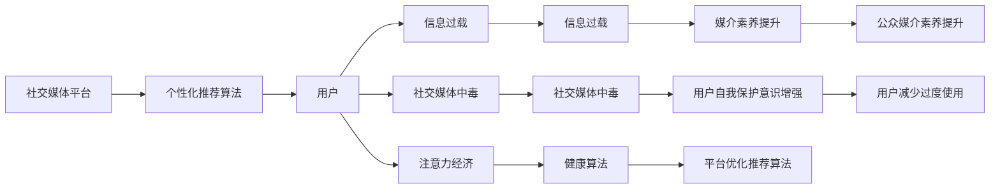

                 

# 注意力经济与社交媒体中毒：如何打破循环并获得自由

> 关键词：注意力经济, 社交媒体, 信息过载, 数据隐私, 数字鸿沟, 媒介素养, 健康算法

## 1. 背景介绍

在信息爆炸的时代，社交媒体和大数据正在重塑我们的认知世界。通过精心设计的内容、算法推荐，社交媒体平台源源不断地吸引着用户的注意力，让他们深陷其中，无法自拔。这种依赖性不仅损害了个人的注意力和经济福祉，也加剧了社会的不平等。本文章将深入探讨这种注意力经济的机制，分析其对个人和社会的影响，并提出可行的解决方案。

### 1.1 问题由来

随着社交媒体的普及，人们越来越多地花费在获取和消费信息上，而这类信息大多数来自社交媒体平台。这些平台通过精确的算法推荐系统，个性化地推送用户感兴趣的内容，从而极大地提升了用户粘性。然而，这种高度定制化的信息流，在带来便利的同时，也引发了一系列问题。

### 1.2 问题核心关键点

1. **注意力经济**：社交媒体和内容平台的商业模式主要基于用户注意力的获取和消费，而非内容本身的质量。
2. **社交媒体中毒**：由于算法推荐，用户逐渐形成依赖，长时间沉浸在社交媒体中，影响心理健康和社会交往。
3. **信息过载**：海量的信息流增加了用户的信息负担，难以从中提取有用的信息，导致认知负担增加。
4. **数据隐私**：社交媒体通过收集用户的浏览和行为数据，进行个性化推荐，引发对数据隐私的担忧。
5. **数字鸿沟**：由于技术使用的差异，数字素养高的用户更容易从社交媒体中获益，而数字素养低的用户则可能被排除在外。
6. **媒介素养**：在信息过载和个性化推荐的背景下，提升媒介素养变得尤为关键，用户需要学会辨别和筛选信息。
7. **健康算法**：社交媒体平台需要采取措施，优化算法，减少对用户注意力的过度捕获。

这些关键点共同构成了当前社会中注意力经济和社交媒体中毒的复杂问题。本文将围绕这些点展开讨论，并提出相关解决方案。

## 2. 核心概念与联系

### 2.1 核心概念概述

- **注意力经济**：一种以注意力为货币的经济形态，其中注意力和认知成为重要的资源。
- **社交媒体中毒**：用户对社交媒体产生依赖，过度消费和沉浸于其中，导致注意力分散，身心健康受损。
- **信息过载**：用户面临的信息量超出了其处理能力，导致认知负担和决策困难。
- **数据隐私**：用户在社交媒体上的数据被平台收集、分析，涉及个人隐私和数据安全问题。
- **数字鸿沟**：技术使用水平的不平等，导致不同群体在获取信息、机会等方面存在显著差异。
- **媒介素养**：公众对媒体信息的辨别、筛选和批判性思考的能力。
- **健康算法**：社交媒体平台通过优化算法，减少对用户注意力的过度捕获，保护用户心理健康。

### 2.2 核心概念原理和架构的 Mermaid 流程图(Mermaid 流程节点中不要有括号、逗号等特殊字符)



这个流程图展示了社交媒体平台、个性化推荐算法、用户行为、信息过载、社交媒体中毒、注意力经济、健康算法、媒介素养、用户自我保护意识之间的逻辑联系。社交媒体平台通过个性化推荐算法吸引用户，导致信息过载和社交媒体中毒，进而形成注意力经济。同时，健康算法和媒介素养提升对平台优化推荐算法和用户自我保护意识的增强具有积极影响。

## 3. 核心算法原理 & 具体操作步骤

### 3.1 算法原理概述

社交媒体平台的核心算法是推荐系统，该系统通过机器学习算法，根据用户的历史行为和偏好，动态地调整信息流，从而最大化用户在该平台上的停留时间。这种算法旨在通过不断改进，让用户对平台的粘性更强，但同时也可能导致信息过载和注意力分散。

### 3.2 算法步骤详解

1. **数据收集与预处理**：平台收集用户的浏览历史、点击记录、搜索行为等数据，进行清洗和预处理。
2. **特征提取**：将用户的浏览行为转化为算法可理解的形式，如向量表示。
3. **模型训练**：使用机器学习算法（如协同过滤、内容推荐、深度学习等）对特征进行训练，生成推荐模型。
4. **推荐生成**：根据用户特征和历史行为，模型生成个性化推荐内容。
5. **用户反馈与优化**：收集用户对推荐内容的反馈，调整模型参数，优化推荐效果。

### 3.3 算法优缺点

**优点**：
- 提升用户体验：通过个性化推荐，满足用户特定需求，提高用户粘性。
- 精准定位：通过用户行为分析，实现内容的精准定位。

**缺点**：
- 信息过载：算法推荐可能让用户接触到大量无关信息，难以区分重要信息。
- 注意力分散：个性化推荐可能让用户陷入无意义的浏览中，影响注意力集中。
- 数据隐私：平台收集用户数据，存在隐私泄露和滥用的风险。

### 3.4 算法应用领域

个性化推荐算法广泛应用在电商、新闻、视频等多个领域。例如，电商平台的商品推荐、新闻网站的内容推荐、视频平台的个性化播放列表等，都是基于用户的特定需求和历史行为，进行精准推荐。

## 4. 数学模型和公式 & 详细讲解 & 举例说明

### 4.1 数学模型构建

设社交媒体平台的用户为 $U$，商品/内容为 $I$，用户对内容的评分矩阵为 $R \in \mathbb{R}^{m \times n}$，其中 $m$ 为用户数，$n$ 为商品/内容数。推荐系统使用协同过滤算法，通过计算用户之间的相似度 $S_{ij}$ 和商品/内容的相似度 $S_{ik}$，生成推荐矩阵 $R'$：

$$
R'_{i,j} = \sum_{k=1}^n R_{i,k}S_{ik}S_{kj}
$$

### 4.2 公式推导过程

1. **用户相似度计算**：采用余弦相似度计算用户之间的相似度：

$$
S_{ij} = \cos(\theta_i - \theta_j) = \frac{\theta_i \cdot \theta_j}{\lVert \theta_i \rVert \lVert \theta_j \rVert}
$$

其中 $\theta_i$ 和 $\theta_j$ 分别表示用户 $i$ 和 $j$ 的兴趣向量。

2. **商品/内容相似度计算**：采用余弦相似度计算商品/内容之间的相似度：

$$
S_{ik} = \cos(\alpha_i - \alpha_k) = \frac{\alpha_i \cdot \alpha_k}{\lVert \alpha_i \rVert \lVert \alpha_k \rVert}
$$

其中 $\alpha_i$ 和 $\alpha_k$ 分别表示商品/内容 $i$ 和 $k$ 的特征向量。

3. **推荐矩阵计算**：根据相似度矩阵计算推荐矩阵 $R'$：

$$
R'_{i,j} = \sum_{k=1}^n R_{i,k}S_{ik}S_{kj}
$$

其中 $R'_{i,j}$ 表示用户 $i$ 对商品 $j$ 的推荐评分。

### 4.3 案例分析与讲解

假设一个用户 A 浏览了多个商品，平台收集了用户的评分和浏览历史，可以使用协同过滤算法，计算用户 A 和商品 B 的相似度，生成用户 A 对商品 B 的推荐评分：

1. 计算用户 A 的兴趣向量 $\theta_A$ 和商品 B 的特征向量 $\alpha_B$。
2. 计算用户 A 和商品 B 的相似度 $S_{AB}$。
3. 根据用户 A 的评分和相似度，计算商品 B 的推荐评分 $R'_{A,B}$。

通过这种方式，平台可以生成精准的推荐内容，满足用户的特定需求。

## 5. 项目实践：代码实例和详细解释说明

### 5.1 开发环境搭建

为了进行协同过滤算法的实现，我们需要搭建一个Python开发环境。以下步骤供参考：

1. 安装Python：从官网下载并安装Python，确保版本为3.7及以上。
2. 安装NumPy、SciPy、Pandas、Scikit-learn等必要库：

```bash
pip install numpy scipy pandas scikit-learn
```

3. 安装推荐系统库：安装lightfm库，用于实现协同过滤算法：

```bash
pip install lightfm
```

### 5.2 源代码详细实现

以下是一个简单的协同过滤推荐系统实现：

```python
from lightfm import LightFM
import pandas as pd

# 加载数据
data = pd.read_csv('user_item.csv', index_col=['user_id', 'item_id'])

# 训练模型
model = LightFM(factors=10, loss='squared_loss', regularization='auto')
model.fit(data)

# 预测评分
preds = model.predict(user_id=1, item_id=2)
print(preds)
```

### 5.3 代码解读与分析

1. **数据加载**：使用Pandas加载用户-商品评分数据，并设置用户 ID 和商品 ID 为索引。
2. **模型训练**：使用LightFM训练协同过滤模型，设置因子数为10，损失函数为平方损失函数，正则化为自动正则化。
3. **评分预测**：使用训练好的模型预测用户1对商品2的评分，并输出结果。

通过这个简单的代码实例，我们可以看到协同过滤算法的实现步骤，并理解如何使用Python和相关库进行推荐系统开发。

### 5.4 运行结果展示

运行上述代码，输出预测评分。例如，如果输出结果为0.8，表示模型预测用户1对商品2的评分约为8。

## 6. 实际应用场景

### 6.1 智能推荐系统

智能推荐系统广泛应用于电商、新闻、视频等多个领域，通过个性化推荐，提升用户满意度，增加平台的活跃度和粘性。例如，亚马逊的推荐系统、YouTube的个性化播放列表等。

### 6.2 广告精准投放

广告主通过分析用户行为数据，构建用户画像，进行精准投放，提升广告效果和ROI。例如，Google的精准广告投放系统、Facebook的广告定向推荐等。

### 6.3 内容创作与分发

社交媒体平台通过推荐算法，优化内容分发，提升用户参与度和平台粘性。例如，Instagram的推荐帖子和话题标签、TikTok的个性化视频推荐等。

### 6.4 未来应用展望

未来的推荐系统将更加智能、个性化，能够根据用户的实时行为动态调整推荐内容。同时，平台需要关注用户数据隐私和算法透明度，优化推荐策略，提升用户体验。

## 7. 工具和资源推荐

### 7.1 学习资源推荐

1. **Coursera《机器学习》课程**：由斯坦福大学开设，涵盖监督学习、无监督学习、协同过滤等内容，适合初学者。
2. **《推荐系统》书籍**：深入介绍推荐系统的原理和应用，包括协同过滤、基于内容的推荐、深度学习推荐等。
3. **Kaggle竞赛**：参与推荐系统竞赛，了解实际应用中的推荐系统开发和优化。
4. **LightFM官方文档**：学习LightFM库的使用，进行推荐系统开发。

### 7.2 开发工具推荐

1. **Python**：推荐系统开发的常用编程语言，Python生态系统丰富，适合进行数据分析和机器学习开发。
2. **Jupyter Notebook**：交互式开发环境，适合进行代码调试和数据分析。
3. **TensorFlow/PyTorch**：深度学习框架，适合进行推荐算法的实现和优化。
4. **Scikit-learn**：机器学习库，适合进行数据预处理和模型训练。

### 7.3 相关论文推荐

1. **《推荐系统的协同过滤算法》**：介绍协同过滤算法的原理和应用。
2. **《深度学习在推荐系统中的应用》**：介绍深度学习在推荐系统中的研究和应用。
3. **《社会计算与信息检索》**：深入探讨社交媒体和信息检索中的推荐系统优化。

## 8. 总结：未来发展趋势与挑战

### 8.1 研究成果总结

本文详细探讨了注意力经济和社交媒体中毒的问题，分析了推荐系统的核心算法和应用，提出了解决方案和未来发展方向。推荐系统已经成为各领域的重要工具，但其带来的问题也日益显著，需要通过技术、伦理和政策等多方面的努力来解决。

### 8.2 未来发展趋势

1. **个性化推荐系统**：未来的推荐系统将更加智能，能够实时分析用户行为，动态调整推荐内容。
2. **数据隐私保护**：平台将更加注重用户数据隐私保护，引入隐私计算和差分隐私等技术。
3. **跨平台协同推荐**：跨平台的协同推荐系统将更加普及，提升用户的综合体验。
4. **健康算法优化**：社交媒体平台将优化推荐算法，减少对用户注意力的过度捕获，保护用户心理健康。

### 8.3 面临的挑战

1. **信息过载**：海量信息流导致用户信息负担增加，难以从中提取有用的信息。
2. **注意力分散**：个性化推荐可能导致用户注意力分散，影响生产力和社交能力。
3. **数据隐私**：平台对用户数据收集和分析存在隐私泄露和滥用的风险。
4. **算法透明性**：推荐算法的黑箱性质可能导致用户不信任，影响平台黏性。
5. **伦理和社会责任**：平台需要考虑算法对社会公正和伦理的影响，避免产生不平等。

### 8.4 研究展望

未来推荐系统的研究将更加注重数据隐私保护、算法透明性和社会责任。如何平衡商业利益和社会价值，将是重要研究方向。同时，通过提升公众媒介素养，提升用户对算法的理解和应用，也将是重要课题。

## 9. 附录：常见问题与解答

**Q1：如何理解推荐系统的核心算法？**

A: 推荐系统通过收集用户行为数据，构建用户画像和物品特征，使用协同过滤、内容推荐、深度学习等算法进行模型训练，生成推荐结果。协同过滤算法基于用户和物品的相似度进行推荐，内容推荐算法基于物品特征进行推荐，深度学习推荐算法基于用户和物品的交互数据进行推荐。

**Q2：推荐系统有哪些应用场景？**

A: 推荐系统广泛应用于电商、新闻、视频、广告等多个领域。例如，电商平台的商品推荐、新闻网站的内容推荐、视频平台的个性化播放列表、广告的精准投放等。

**Q3：推荐系统存在哪些问题？**

A: 推荐系统可能存在信息过载、注意力分散、数据隐私问题等。信息过载可能导致用户难以从中提取有用信息，注意力分散可能影响用户注意力集中，数据隐私问题可能引起用户隐私泄露和滥用。

**Q4：如何提升推荐系统的推荐效果？**

A: 提升推荐系统推荐效果需要优化算法、增加数据量、提升用户交互数据质量等。例如，通过引入深度学习算法、优化协同过滤算法、增加用户行为数据等方法，提升推荐效果。

**Q5：如何保护用户数据隐私？**

A: 保护用户数据隐私需要加强数据加密、访问控制、差分隐私等技术，同时平台需要明确隐私政策，透明公开数据使用方式，提升用户信任。

---

作者：禅与计算机程序设计艺术 / Zen and the Art of Computer Programming

