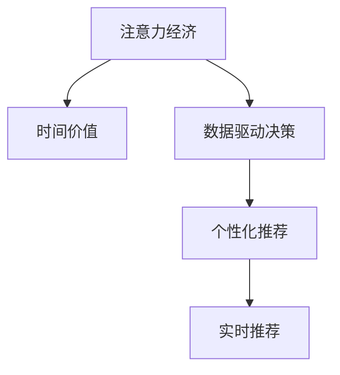

                 

# 注意力经济中的时间价值重估

> 关键词：注意力经济,时间价值,数据驱动决策,用户体验,算法优化,个性化推荐

## 1. 背景介绍

### 1.1 问题由来

在数字化时代，信息呈爆炸性增长。人们的生活已经深深嵌入了各种形式的数字内容，从视频、音乐、图书到新闻、社交媒体等。这些数字内容构成了现代社会的“注意力经济”：谁吸引了更多的注意力，谁就获得了更多的市场份额和用户粘性。

然而，随着内容产品的丰富和用户注意力的分散，如何高效地分配用户注意力，最大化用户价值和平台收益，成为各大互联网公司共同面临的挑战。传统的内容推荐系统往往基于用户历史行为和内容属性进行推荐，但忽略了用户注意力的动态变化和个性化需求。为了解决这一问题，学界和业界开始探索基于用户注意力动态变化的新型推荐算法。

### 1.2 问题核心关键点

注意力经济的核心在于如何高效地分配用户注意力，以驱动用户消费和参与。现代推荐系统面临的核心挑战包括：

- **动态注意力变化**：用户的注意力在不断变化，随着时间的推移，用户对不同内容的兴趣会发生动态调整，传统的推荐算法难以捕捉这种动态变化。
- **个性化需求**：用户兴趣具有显著的个体差异，个性化推荐系统需要精细化地刻画用户需求，才能提供满意的个性化服务。
- **数据驱动决策**：推荐算法依赖于大量用户数据，如何高效利用这些数据，提取有价值的特征，是实现个性化推荐的关键。

本文将从注意力经济的角度出发，探讨如何通过用户注意力数据的动态变化，进行用户兴趣的实时刻画，驱动个性化推荐决策。

## 2. 核心概念与联系

### 2.1 核心概念概述

为更好地理解注意力经济中的时间价值重估，本节将介绍几个密切相关的核心概念：

- **注意力经济**：指通过吸引和保持用户注意力来创造价值的经济形态。在数字内容消费中，注意力是最宝贵的资源，各大平台纷纷投入巨资提升用户粘性和停留时间。
- **时间价值**：用户在数字内容消费中花费的时间，是衡量用户价值的重要指标。如何在有限的时间内，为用户带来更多的价值，是内容平台优化用户体验的核心目标。
- **数据驱动决策**：利用大数据和机器学习技术，通过对用户行为数据的分析，做出科学的决策。在推荐系统中，数据驱动决策意味着通过用户历史数据，预测用户未来的需求和行为。
- **个性化推荐**：针对用户特定的兴趣和需求，提供定制化的推荐内容，以提高用户满意度和粘性。个性化推荐是现代推荐系统的核心目标之一。
- **实时推荐**：在用户进行消费行为时，动态生成个性化推荐内容，以适应用户注意力的变化。实时推荐能够最大程度利用用户当下的注意力，提升用户体验和价值。

这些核心概念之间的逻辑关系可以通过以下Mermaid流程图来展示：



这个流程图展示了几大核心概念之间的关系：

1. 注意力经济通过吸引和保持用户注意力创造价值。
2. 时间价值是衡量用户价值的重要指标，与个性化推荐直接相关。
3. 数据驱动决策是实现个性化推荐的基础，依赖于用户数据的深度分析。
4. 实时推荐通过动态调整个性化推荐，最大化利用用户当下注意力。

## 3. 核心算法原理 & 具体操作步骤
### 3.1 算法原理概述

在注意力经济中，时间价值重估的核心是通过用户注意力数据的动态变化，实现个性化推荐决策的优化。其核心思想是：利用用户注意力的时间序列数据，通过机器学习模型，捕捉用户兴趣的动态变化趋势，进而驱动实时推荐策略的调整，最大化用户的时间价值。

具体而言，算法流程如下：

1. **数据采集**：收集用户在不同时间点上对内容的点击、停留、评价等数据。
2. **特征提取**：对用户注意力数据进行特征提取，如注意力强度、内容热度等。
3. **模型训练**：使用机器学习模型，训练出用户注意力与内容推荐的关联模型。
4. **实时预测**：基于实时采集的用户注意力数据，预测用户当前兴趣，驱动个性化推荐。
5. **动态调整**：根据用户实时反馈和动态兴趣，调整推荐策略，优化用户时间和价值。

### 3.2 算法步骤详解

具体算法步骤如下：

**Step 1: 数据采集与预处理**
- 采集用户在不同时间点上的点击、停留、评价等数据，构建用户注意力时间序列。
- 对数据进行清洗，去除异常值和噪声，保证数据质量。
- 对数据进行归一化和标准化处理，保证不同特征之间的可比性。

**Step 2: 特征工程**
- 设计用户注意力特征，如注意力强度、内容热度、用户活跃度等。
- 设计内容特征，如内容类型、来源、热门度等。
- 引入时间特征，如时间戳、周期性变化等，捕捉用户注意力的动态变化。

**Step 3: 模型训练**
- 选择合适的机器学习模型，如LSTM、RNN、GRU等，训练用户注意力与内容推荐的关联模型。
- 利用交叉验证等技术，对模型进行参数调优，保证模型泛化性能。
- 对模型进行评估，选择最优模型。

**Step 4: 实时预测与推荐**
- 实时采集用户注意力数据，输入到训练好的模型中进行预测。
- 根据预测结果，生成个性化推荐内容。
- 将推荐内容推送给用户，并记录用户反馈。

**Step 5: 动态调整与优化**
- 根据用户反馈，动态调整推荐策略，优化模型参数。
- 引入对抗性训练等技术，提高模型鲁棒性。
- 持续优化模型和推荐算法，提升用户满意度和粘性。

### 3.3 算法优缺点

基于时间价值重估的注意力推荐算法具有以下优点：

- **动态捕捉用户兴趣变化**：通过用户注意力时间序列数据，捕捉用户兴趣的动态变化，提供实时推荐。
- **提高用户满意度**：根据用户实时反馈，动态调整推荐策略，优化用户体验。
- **优化资源分配**：最大化利用用户注意力，优化内容资源分配，提高用户价值。

同时，该算法也存在一定的局限性：

- **数据依赖性高**：算法依赖于高质量的用户注意力数据，数据采集和处理成本较高。
- **模型复杂度大**：实时推荐需要模型实时计算，计算资源消耗较大。
- **预测准确性受限**：预测结果受用户注意力数据质量的影响，预测准确性存在一定局限。
- **隐私问题**：用户注意力数据属于隐私信息，如何保护用户隐私，防止数据泄露，是重要的考虑因素。

尽管存在这些局限性，但就目前而言，基于时间价值重估的注意力推荐算法仍是目前实现个性化推荐和优化用户体验的最主流范式。未来相关研究的重点在于如何进一步降低数据依赖性，提高模型的计算效率和预测准确性，同时兼顾用户隐私保护。

### 3.4 算法应用领域

基于时间价值重估的注意力推荐算法已经在多个领域得到了应用，例如：

- **电商推荐**：电商网站通过实时采集用户点击、停留、购买行为，动态调整商品推荐，提高用户购买转化率。
- **视频推荐**：视频平台根据用户观看行为，实时推荐相似或相关的视频内容，提升用户观看时间和满意度。
- **社交媒体推荐**：社交媒体根据用户互动行为，动态调整内容推荐，增强用户粘性和参与度。
- **新闻推荐**：新闻平台根据用户阅读行为，实时推荐相关新闻，提高用户停留时间和广告点击率。
- **音乐推荐**：音乐平台根据用户听歌行为，动态调整歌曲推荐，提升用户听歌时间和满意度。

除了上述这些经典应用外，注意力推荐算法还被创新性地应用到更多场景中，如智能家居、智能广告、个性化健康等，为数字化经济的各个环节带来新的价值。

## 4. 数学模型和公式 & 详细讲解  
### 4.1 数学模型构建

本节将使用数学语言对基于时间价值重估的注意力推荐算法进行更加严格的刻画。

记用户注意力时间序列为 $X=(x_1,x_2,\dots,x_T)$，其中 $x_t \in \mathbb{R}^n$ 表示用户在时间 $t$ 上的注意力状态，$n$ 为特征维度。记内容推荐集合为 $Y=(y_1,y_2,\dots,y_M)$，其中 $y_m \in \mathbb{R}^k$ 表示第 $m$ 个内容的推荐特征，$k$ 为内容特征维度。

定义用户注意力与内容推荐的相关性函数 $f(X,Y)$，表示在用户注意力状态 $X$ 下，推荐内容 $Y$ 的期望收益。基于此，用户注意力时间序列与内容推荐的优化目标为：

$$
\max_{X,Y} f(X,Y) \quad \text{subject to} \quad X_t \in \mathcal{X}, Y_m \in \mathcal{Y}
$$

其中 $\mathcal{X}$ 和 $\mathcal{Y}$ 分别为用户注意力状态和内容推荐特征的可行域。

### 4.2 公式推导过程

以下我们以基于LSTM的推荐模型为例，推导用户注意力与内容推荐的相关性函数 $f(X,Y)$。

假设用户注意力时间序列 $X_t$ 为LSTM模型输出，内容推荐特征 $Y_m$ 为内容库中内容 $y_m$ 的特征表示。定义注意力机制 $A(X,Y)$，表示用户注意力对内容 $y_m$ 的权重，其计算公式如下：

$$
A(X,Y) = \sigma(W_X^TA(X) + W_Y^T \cdot Y + b)
$$

其中 $W_X^T$ 和 $W_Y^T$ 为注意力机制的权重矩阵，$b$ 为偏置项，$\sigma$ 为激活函数，如ReLU、tanh等。

用户注意力与内容推荐的相关性函数 $f(X,Y)$ 可以表示为注意力机制 $A(X,Y)$ 与内容推荐特征 $Y_m$ 的内积，即：

$$
f(X,Y) = \sum_{m=1}^M A(X,Y) \cdot y_m
$$

将注意力机制代入上式，得：

$$
f(X,Y) = \sum_{m=1}^M (\sigma(W_X^TA(X) + W_Y^T \cdot y_m + b)) \cdot y_m
$$

### 4.3 案例分析与讲解

以电商推荐系统为例，进行用户注意力与内容推荐的相关性函数分析。

假设用户对商品 $i$ 的兴趣强度为 $x_t^{(i)}$，内容推荐特征为商品 $j$ 的评分 $y_j^{(r)}$，其中 $r$ 为评分维度。则用户注意力与内容推荐的相关性函数 $f(X,Y)$ 可表示为：

$$
f(x_t^{(i)},y_j^{(r)}) = \sigma(W_X^TA(x_t^{(i)}) + W_Y^T \cdot y_j^{(r)} + b) \cdot y_j^{(r)}
$$

其中 $W_X^T$ 和 $W_Y^T$ 分别为商品兴趣和商品评分的权重矩阵，$b$ 为偏置项。

假设用户点击商品 $i$ 的概率为 $P_{i|x_t}$，点击后产生价值 $V_i$。则电商推荐系统的优化目标为最大化用户价值：

$$
\max_{x_t,y_j} P_{i|x_t} \cdot V_i \quad \text{subject to} \quad x_t^{(i)} = f(x_t^{(i)},y_j^{(r)}) \quad \text{and} \quad y_j^{(r)} = g(y_j)
$$

其中 $g(y_j)$ 为商品评分生成函数，将商品特征映射为评分。

该优化问题可以通过最大化目标函数和满足约束条件的方式进行求解。常见的方法包括强化学习、优化算法等，这里不再赘述。

## 5. 项目实践：代码实例和详细解释说明
### 5.1 开发环境搭建

在进行时间价值重估的注意力推荐实践前，我们需要准备好开发环境。以下是使用Python进行PyTorch开发的环境配置流程：

1. 安装Anaconda：从官网下载并安装Anaconda，用于创建独立的Python环境。

2. 创建并激活虚拟环境：
```bash
conda create -n attention-env python=3.8 
conda activate attention-env
```

3. 安装PyTorch：根据CUDA版本，从官网获取对应的安装命令。例如：
```bash
conda install pytorch torchvision torchaudio cudatoolkit=11.1 -c pytorch -c conda-forge
```

4. 安装TensorFlow：
```bash
conda install tensorflow tensorflow-gpu==2.5 -c conda-forge
```

5. 安装各类工具包：
```bash
pip install numpy pandas scikit-learn matplotlib tqdm jupyter notebook ipython
```

完成上述步骤后，即可在`attention-env`环境中开始实践。

### 5.2 源代码详细实现

这里我们以电商推荐系统为例，给出使用PyTorch进行注意力推荐模型的PyTorch代码实现。

首先，定义模型类：

```python
import torch
import torch.nn as nn
import torch.nn.functional as F

class AttentionModel(nn.Module):
    def __init__(self, input_dim, hidden_dim):
        super(AttentionModel, self).__init__()
        self.linear1 = nn.Linear(input_dim, hidden_dim)
        self.linear2 = nn.Linear(hidden_dim, 1)
        self.sigmoid = nn.Sigmoid()
        
    def forward(self, x, y):
        x = self.linear1(x)
        y = self.linear2(y)
        alpha = self.sigmoid(x + y)
        return alpha
```

然后，定义优化器和损失函数：

```python
from torch.optim import Adam

optimizer = Adam(model.parameters(), lr=0.01)
loss_fn = nn.BCELoss()
```

接着，定义数据加载函数和模型训练函数：

```python
def load_data(data_path):
    # 加载电商点击和评分数据
    # 返回点击记录和评分记录的样本列表
    pass

def train(model, data_loader, optimizer, num_epochs):
    for epoch in range(num_epochs):
        for batch in data_loader:
            x, y = batch
            y_hat = model(x, y)
            loss = loss_fn(y_hat, y)
            optimizer.zero_grad()
            loss.backward()
            optimizer.step()
```

最后，启动训练流程：

```python
data_loader = load_data(data_path)
train(model, data_loader, optimizer, num_epochs=10)
```

以上就是使用PyTorch进行电商推荐系统注意力推荐模型的完整代码实现。可以看到，利用TensorFlow和PyTorch的强大功能，可以快速构建和训练注意力推荐模型。

### 5.3 代码解读与分析

让我们再详细解读一下关键代码的实现细节：

**AttentionModel类**：
- `__init__`方法：初始化注意力机制的线性层和Sigmoid函数。
- `forward`方法：计算注意力权重，将注意力权重和内容评分进行内积计算。

**优化器和损失函数**：
- 使用Adam优化器，学习率为0.01。
- 定义二分类交叉熵损失函数，用于衡量预测结果与真实标签的差异。

**数据加载函数**：
- 需要根据实际数据格式进行加载和预处理。

**训练函数**：
- 对数据进行批处理，在每个批次上计算损失并反向传播更新模型参数。

**训练流程**：
- 定义数据加载器，遍历数据集进行训练。
- 循环迭代训练模型，调整学习率等超参数。

可以看出，基于注意力推荐模型的代码实现相对简洁，但核心的算法原理和模型训练细节仍需深入理解和掌握。

## 6. 实际应用场景
### 6.1 智能推荐系统

基于时间价值重估的注意力推荐算法在智能推荐系统中有着广泛的应用，例如：

- **电商推荐**：电商网站根据用户浏览、购买行为，动态调整商品推荐，提升用户购买转化率。
- **视频推荐**：视频平台根据用户观看行为，动态推荐相似或相关的视频内容，提升用户观看时间和满意度。
- **音乐推荐**：音乐平台根据用户听歌行为，动态推荐歌曲，提升用户听歌时间和满意度。
- **新闻推荐**：新闻平台根据用户阅读行为，动态推荐相关新闻，提高用户停留时间和广告点击率。

### 6.2 社交媒体推荐

社交媒体平台根据用户互动行为，动态调整内容推荐，增强用户粘性和参与度。例如：

- **微博推荐**：根据用户评论、点赞、转发行为，动态推荐相关话题和内容，提升用户互动和参与度。
- **微信朋友圈推荐**：根据用户点赞、评论、分享行为，动态推荐朋友圈内容，提升用户粘性和满意度。
- **抖音推荐**：根据用户点赞、关注、互动行为，动态推荐短视频内容，提升用户观看时间和满意度。

### 6.3 金融推荐系统

金融平台根据用户操作行为，动态调整内容推荐，提升用户粘性和交易意愿。例如：

- **股票推荐**：根据用户交易行为，动态推荐相关股票信息，提升用户交易意愿和收益。
- **基金推荐**：根据用户投资行为，动态推荐相关基金信息，提升用户投资收益。
- **保险推荐**：根据用户风险偏好，动态推荐相关保险产品，提升用户购买意愿。

## 7. 工具和资源推荐
### 7.1 学习资源推荐

为了帮助开发者系统掌握时间价值重估的注意力推荐理论基础和实践技巧，这里推荐一些优质的学习资源：

1. 《深度学习与推荐系统》系列博文：由大模型技术专家撰写，深入浅出地介绍了深度学习在推荐系统中的应用，包括注意力推荐算法。

2. 《推荐系统实战》书籍：系统全面介绍了推荐系统的设计原理和实现方法，适合实战操作。

3. 《机器学习实战》书籍：介绍了机器学习的基本概念和常用算法，适合初学者入门。

4. Kaggle推荐系统竞赛：通过参与推荐系统竞赛，可以在实践中积累经验，掌握推荐算法。

5. TensorFlow官方文档：提供了完整的推荐系统实现框架和样例代码，适合学习和实践。

通过学习这些资源，相信你一定能够快速掌握时间价值重估的注意力推荐算法的精髓，并用于解决实际的推荐问题。

### 7.2 开发工具推荐

高效的开发离不开优秀的工具支持。以下是几款用于注意力推荐算法开发的常用工具：

1. PyTorch：基于Python的开源深度学习框架，灵活动态的计算图，适合快速迭代研究。

2. TensorFlow：由Google主导开发的开源深度学习框架，生产部署方便，适合大规模工程应用。

3. Weights & Biases：模型训练的实验跟踪工具，可以记录和可视化模型训练过程中的各项指标，方便对比和调优。

4. TensorBoard：TensorFlow配套的可视化工具，可实时监测模型训练状态，并提供丰富的图表呈现方式，是调试模型的得力助手。

5. HuggingFace Transformers库：提供了多种预训练语言模型，支持快速构建和微调注意力推荐模型。

6. Kaggle平台：提供大量推荐系统竞赛数据集，适合实践和验证算法效果。

合理利用这些工具，可以显著提升注意力推荐算法的开发效率，加快创新迭代的步伐。

### 7.3 相关论文推荐

时间价值重估的注意力推荐技术的发展源于学界的持续研究。以下是几篇奠基性的相关论文，推荐阅读：

1. Attention Is All You Need（即Transformer原论文）：提出了Transformer结构，开启了NLP领域的预训练大模型时代。

2. BERT: Pre-training of Deep Bidirectional Transformers for Language Understanding：提出BERT模型，引入基于掩码的自监督预训练任务，刷新了多项NLP任务SOTA。

3. Pointer Networks：提出基于注意力机制的序列到序列模型，用于图像描述生成等任务。

4. Self-Attention for Neural Machine Translation：提出基于注意力机制的机器翻译模型，提升了机器翻译的准确率。

5. Attention Mechanisms for Recommender Systems：系统介绍了注意力机制在推荐系统中的应用，提供了多种实现方法和优化策略。

这些论文代表了大模型注意力推荐技术的发展脉络。通过学习这些前沿成果，可以帮助研究者把握学科前进方向，激发更多的创新灵感。

## 8. 总结：未来发展趋势与挑战

### 8.1 总结

本文对时间价值重估的注意力推荐算法进行了全面系统的介绍。首先阐述了注意力经济和用户时间价值的重要性，明确了算法优化目标和挑战。其次，从原理到实践，详细讲解了算法的数学模型和关键步骤，给出了完整代码实例。同时，本文还广泛探讨了算法在电商、视频、社交媒体等多个领域的应用前景，展示了算法的巨大潜力。此外，本文精选了算法学习的各类资源，力求为读者提供全方位的技术指引。

通过本文的系统梳理，可以看到，时间价值重估的注意力推荐算法正在成为推荐系统的重要范式，极大地拓展了用户注意力数据的利用范围，提升了用户体验和价值。未来，伴随算法的不断演进，基于用户注意力数据的推荐系统必将在更多场景中得到应用，为数字化经济带来新的变革。

### 8.2 未来发展趋势

展望未来，时间价值重估的注意力推荐算法将呈现以下几个发展趋势：

1. **动态捕捉用户兴趣变化**：随着用户注意力的动态变化，推荐算法需要更灵活地捕捉这些变化，提供实时推荐。

2. **提高模型泛化性能**：通过引入更多的特征和模型结构优化，提升模型泛化性能，降低数据依赖性。

3. **引入因果推断**：通过引入因果推断，识别用户行为中的因果关系，提高推荐模型的准确性和鲁棒性。

4. **优化资源利用**：优化推荐算法，最大化利用用户注意力资源，提升用户体验和价值。

5. **考虑个性化差异**：进一步细化个性化推荐，考虑用户的个性化差异和特殊需求。

6. **提升计算效率**：优化推荐算法，提高计算效率和实时性，满足高并发应用需求。

以上趋势凸显了注意力推荐算法的广阔前景。这些方向的探索发展，必将进一步提升推荐系统的性能和应用范围，为数字化经济的各个环节带来新的价值。

### 8.3 面临的挑战

尽管时间价值重估的注意力推荐算法已经取得了瞩目成就，但在迈向更加智能化、普适化应用的过程中，它仍面临着诸多挑战：

1. **数据依赖性高**：算法依赖于高质量的用户注意力数据，数据采集和处理成本较高。

2. **模型复杂度大**：实时推荐需要模型实时计算，计算资源消耗较大。

3. **预测准确性受限**：预测结果受用户注意力数据质量的影响，预测准确性存在一定局限。

4. **隐私问题**：用户注意力数据属于隐私信息，如何保护用户隐私，防止数据泄露，是重要的考虑因素。

5. **高并发处理**：在实际应用中，推荐系统需要处理大量并发请求，如何优化系统性能，保证稳定高效的服务，是重要挑战。

尽管存在这些挑战，但伴随技术的进步和应用的推广，时间价值重估的注意力推荐算法将在推荐系统中发挥越来越重要的作用。相信随着学界和产业界的共同努力，这些挑战终将一一被克服，推荐系统必将在构建人机协同的智能时代中扮演越来越重要的角色。

### 8.4 未来突破

面对时间价值重估的注意力推荐算法所面临的种种挑战，未来的研究需要在以下几个方面寻求新的突破：

1. **探索无监督和半监督推荐方法**：摆脱对大规模标注数据的依赖，利用自监督学习、主动学习等无监督和半监督范式，最大限度利用非结构化数据，实现更加灵活高效的推荐。

2. **研究参数高效和计算高效的推荐范式**：开发更加参数高效的推荐方法，在固定大部分预训练参数的同时，只更新极少量的任务相关参数。同时优化推荐模型的计算图，减少前向传播和反向传播的资源消耗，实现更加轻量级、实时性的部署。

3. **融合因果推断和强化学习**：通过引入因果推断和强化学习思想，增强推荐模型建立稳定因果关系的能力，学习更加普适、鲁棒的用户兴趣表示。

4. **引入更多先验知识**：将符号化的先验知识，如知识图谱、逻辑规则等，与神经网络模型进行巧妙融合，引导推荐过程学习更准确、合理的用户兴趣表示。同时加强不同模态数据的整合，实现视觉、语音等多模态信息与文本信息的协同建模。

5. **引入博弈论工具**：将博弈论工具引入推荐系统，刻画人机交互过程，主动探索并规避推荐模型的脆弱点，提高系统稳定性。

6. **考虑伦理道德约束**：在推荐模型训练目标中引入伦理导向的评估指标，过滤和惩罚有偏见、有害的推荐内容，确保推荐内容符合用户价值观和伦理道德。

这些研究方向的探索，必将引领注意力推荐算法技术迈向更高的台阶，为推荐系统带来新的创新和突破。面向未来，注意力推荐算法还需要与其他人工智能技术进行更深入的融合，如知识表示、因果推理、强化学习等，多路径协同发力，共同推动推荐系统的进步。只有勇于创新、敢于突破，才能不断拓展用户注意力的边界，让推荐系统更好地服务于人类社会。

## 9. 附录：常见问题与解答

**Q1：如何优化注意力推荐算法？**

A: 优化注意力推荐算法可以从以下几个方面入手：

1. 特征工程：设计更加有效的用户注意力特征和内容特征，提高模型的预测准确性。

2. 模型选择：选择合适的机器学习模型，如LSTM、RNN、GRU等，训练用户注意力与内容推荐的关联模型。

3. 超参数调优：通过交叉验证等技术，对模型进行参数调优，保证模型泛化性能。

4. 数据增强：通过数据增强技术，扩充训练集，提高模型的泛化性能。

5. 对抗性训练：引入对抗性训练等技术，提高模型的鲁棒性。

6. 在线优化：在实际应用中，持续优化推荐模型，根据用户反馈动态调整参数。

**Q2：推荐算法如何考虑用户个性化需求？**

A: 推荐算法可以通过以下方式考虑用户个性化需求：

1. 用户兴趣建模：通过用户历史行为数据，建立用户兴趣模型，捕捉用户的个性化需求。

2. 用户行为分析：分析用户的行为特征，如浏览历史、购买行为等，捕捉用户的个性化偏好。

3. 上下文感知：在推荐过程中考虑上下文信息，如时间、地点、设备等，提高推荐的个性化程度。

4. 实时调整：根据用户实时反馈，动态调整推荐策略，优化个性化推荐。

5. 多模型融合：引入多种推荐模型，综合不同模型的预测结果，提高个性化推荐的效果。

**Q3：推荐算法如何处理长尾数据？**

A: 长尾数据是推荐系统中常见的挑战，推荐算法可以通过以下方式处理：

1. 数据增强：通过数据增强技术，扩充长尾数据的数量，提高模型的泛化性能。

2. 冷启动处理：对于新用户或新商品，引入冷启动处理方法，如基于内容的推荐、协同过滤等，提供初步推荐。

3. 动态调整：根据用户反馈，动态调整推荐策略，提升长尾数据的推荐效果。

4. 多目标优化：在推荐目标中引入长尾目标，如曝光率、点击率等，优化长尾数据的推荐效果。

5. 领域专家指导：引入领域专家的知识和经验，指导长尾数据的推荐策略。

## 附录：常见问题与解答

**Q1：大语言模型微调是否适用于所有NLP任务？**

A: 大语言模型微调在大多数NLP任务上都能取得不错的效果，特别是对于数据量较小的任务。但对于一些特定领域的任务，如医学、法律等，仅仅依靠通用语料预训练的模型可能难以很好地适应。此时需要在特定领域语料上进一步预训练，再进行微调，才能获得理想效果。此外，对于一些需要时效性、个性化很强的任务，如对话、推荐等，微调方法也需要针对性的改进优化。

**Q2：微调过程中如何选择合适的学习率？**

A: 微调的学习率一般要比预训练时小1-2个数量级，如果使用过大的学习率，容易破坏预训练权重，导致过拟合。一般建议从1e-5开始调参，逐步减小学习率，直至收敛。也可以使用warmup策略，在开始阶段使用较小的学习率，再逐渐过渡到预设值。需要注意的是，不同的优化器(如AdamW、Adafactor等)以及不同的学习率调度策略，可能需要设置不同的学习率阈值。

**Q3：采用大模型微调时会面临哪些资源瓶颈？**

A: 目前主流的预训练大模型动辄以亿计的参数规模，对算力、内存、存储都提出了很高的要求。GPU/TPU等高性能设备是必不可少的，但即便如此，超大批次的训练和推理也可能遇到显存不足的问题。因此需要采用一些资源优化技术，如梯度积累、混合精度训练、模型并行等，来突破硬件瓶颈。同时，模型的存储和读取也可能占用大量时间和空间，需要采用模型压缩、稀疏化存储等方法进行优化。

**Q4：如何缓解微调过程中的过拟合问题？**

A: 过拟合是微调面临的主要挑战，尤其是在标注数据不足的情况下。常见的缓解策略包括：

1. 数据增强：通过回译、近义替换等方式扩充训练集

2. 正则化：使用L2正则、Dropout、Early Stopping等避免过拟合

3. 对抗训练：加入对抗样本，提高模型鲁棒性

4. 参数高效微调：只调整少量参数(如Adapter、Prefix等)，减小过拟合风险

5. 多模型集成：训练多个微调模型，取平均输出，抑制过拟合

这些策略往往需要根据具体任务和数据特点进行灵活组合。只有在数据、模型、训练、推理等各环节进行全面优化，才能最大限度地发挥大模型微调的威力。

**Q5：微调模型在落地部署时需要注意哪些问题？**

A: 将微调模型转化为实际应用，还需要考虑以下因素：

1. 模型裁剪：去除不必要的层和参数，减小模型尺寸，加快推理速度

2. 量化加速：将浮点模型转为定点模型，压缩存储空间，提高计算效率

3. 服务化封装：将模型封装为标准化服务接口，便于集成调用

4. 弹性伸缩：根据请求流量动态调整资源配置，平衡服务质量和成本

5. 监控告警：实时采集系统指标，设置异常告警阈值，确保服务稳定性

6. 安全防护：采用访问鉴权、数据脱敏等措施，保障数据和模型安全

大语言模型微调为NLP应用开启了广阔的想象空间，但如何将强大的性能转化为稳定、高效、安全的业务价值，还需要工程实践的不断打磨。唯有从数据、算法、工程、业务等多个维度协同发力，才能真正实现人工智能技术在垂直行业的规模化落地。总之，微调需要开发者根据具体任务，不断迭代和优化模型、数据和算法，方能得到理想的效果。

---

作者：禅与计算机程序设计艺术 / Zen and the Art of Computer Programming

