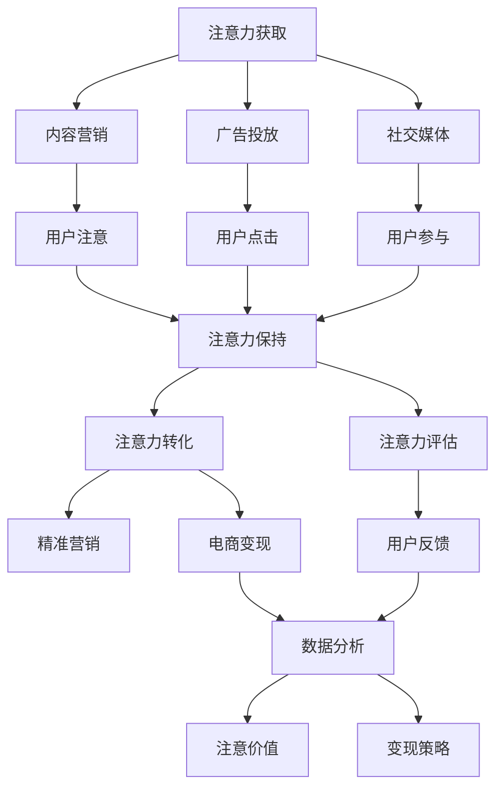

                 

# 注意力经济对企业创新管理的影响

## 1. 背景介绍

在数字化时代，注意力经济（Attention Economy）正成为企业创新管理中一个重要的考量因素。注意力经济主要指的是在信息爆炸的互联网时代，企业如何通过各种手段吸引和保持用户的注意力，从而实现商业价值的最大化。传统的企业运营模式正在向以注意力为核心的模式转型，在内容营销、产品设计、市场策略等方面都需要新的思考和布局。

### 1.1 问题由来

随着互联网技术的发展，信息的获取和传播速度大幅提升，用户面临的信息过载问题日益严重。企业作为信息的发出者和接收者，必须思考如何在海量信息中找到自己的定位，赢得用户的青睐。注意力经济的兴起，意味着企业必须通过吸引和保持用户的注意力，实现价值链的增值。

### 1.2 问题核心关键点

注意力经济的核心在于如何有效分配企业的资源，使得投入的资源能够最大化地转化为用户注意力的获取，进而转化为商业价值。核心关键点包括：

- 用户注意力的获取：如何通过优质的内容、互动的体验等吸引用户的注意力。
- 注意力保持：如何设计用户界面、提升用户体验等，使得用户能够在企业平台上保持较长时间的注意力。
- 注意力转化：如何通过精准的营销策略、产品推荐等将用户的注意力转化为实际的消费行为。

## 2. 核心概念与联系

### 2.1 核心概念概述

注意力经济涉及多个关键概念，包括但不限于：

- **注意力获取**：通过内容营销、广告投放、社交媒体等方式吸引用户的注意。
- **注意力保持**：通过优化产品设计、提供个性化推荐、提升用户体验等方式保持用户注意力。
- **注意力转化**：通过精准营销、电商变现等方式将用户的注意力转化为购买行为。
- **注意力评估**：通过数据分析、用户反馈等方式评估注意力的实际价值。
- **注意力变现**：将注意力资源通过广告收入、会员增值、交易抽成等方式进行变现。

这些概念之间相互关联，形成了一个完整的注意力经济生态系统。注意力获取是基础，注意力保持是保障，注意力转化是结果，而注意力评估和变现则是价值反馈和提升的途径。

### 2.2 核心概念原理和架构的 Mermaid 流程图



这个流程图展示了注意力经济从获取到变现的全过程，反映了各个环节之间的相互依赖和联系。

## 3. 核心算法原理 & 具体操作步骤

### 3.1 算法原理概述

注意力经济的算法原理主要基于用户行为数据的分析，通过对用户注意力数据的采集、分析和预测，指导企业的产品设计、市场策略和营销活动。其核心在于通过算法模型，将注意力资源的获取、保持和变现转化为具体的商业决策。

### 3.2 算法步骤详解

1. **数据采集**：收集用户的点击、浏览、互动等行为数据，作为算法的输入。
2. **数据处理**：对采集到的数据进行清洗、处理和特征提取，形成可用于模型训练的数据集。
3. **模型训练**：利用机器学习、深度学习等算法，训练出能够预测用户注意力的模型。
4. **决策优化**：根据模型的预测结果，优化企业的产品设计、广告投放策略、营销活动等，提高注意力资源获取和转化的效率。
5. **效果评估**：通过对比实际效果与模型预测，评估算法的准确性和效果，并不断优化模型。

### 3.3 算法优缺点

**优点**：
- 提高效率：通过算法模型，企业可以更精确地获取和保持用户注意力，减少资源浪费。
- 提升转化率：精准的注意力转化策略能够显著提高用户的购买转化率。
- 个性化推荐：算法可以为用户提供个性化的内容推荐，提升用户体验。

**缺点**：
- 数据依赖：算法的准确性高度依赖于数据的质量和量，数据不足或偏差可能导致模型失效。
- 模型复杂度：深度学习等复杂模型对算力、数据量要求高，可能增加企业成本。
- 隐私风险：用户数据的收集和分析可能涉及隐私问题，需要谨慎处理。

### 3.4 算法应用领域

注意力经济的应用领域非常广泛，包括但不限于：

- **内容分发平台**：如视频网站、社交媒体平台等，通过算法优化内容推荐，提高用户停留时间和点击率。
- **电商平台**：通过个性化推荐和精准广告投放，提升转化率和用户满意度。
- **广告投放**：通过用户行为数据优化广告投放策略，提高广告点击率和转化率。
- **在线教育**：通过算法推荐课程和资源，提升用户学习效果和平台活跃度。
- **移动应用**：通过用户行为分析优化应用界面和功能，提升用户粘性。

## 4. 数学模型和公式 & 详细讲解 & 举例说明

### 4.1 数学模型构建

注意力经济的数学模型通常基于用户行为数据的统计分析和预测模型。一个典型的模型包括：

- **用户行为模型**：通过统计分析用户点击、浏览等行为数据，建立用户行为模型。
- **注意力预测模型**：利用机器学习算法，预测用户对特定内容的注意力权重。
- **优化模型**：根据注意力预测结果，优化产品设计、广告投放策略等。

### 4.2 公式推导过程

以用户行为模型为例，假设用户在某时间段内的点击次数为 $C_i$，浏览时长为 $T_i$，则用户注意力权重 $A_i$ 可以表示为：

$$
A_i = \alpha C_i + \beta T_i + \gamma
$$

其中 $\alpha, \beta, \gamma$ 为模型参数，需要根据数据进行拟合。注意力预测模型则可以根据用户行为数据和产品特征，建立分类或回归模型，预测用户对特定内容的注意力权重。

### 4.3 案例分析与讲解

假设某电商平台的营销团队希望通过算法优化广告投放策略。他们收集了用户的点击和浏览数据，并对不同广告进行了A/B测试。通过建立用户行为模型和注意力预测模型，他们发现：

- 用户点击次数高的广告，用户停留时间较长。
- 用户浏览时长长的广告，用户转化率较高。

据此，他们调整了广告投放策略，优先展示点击次数高且用户停留时间长的广告，结果广告点击率和转化率显著提升。

## 5. 项目实践：代码实例和详细解释说明

### 5.1 开发环境搭建

要进行注意力经济相关的算法开发，首先需要搭建好开发环境。以下是使用Python和Scikit-learn、TensorFlow等库进行开发的流程：

1. 安装Python：推荐使用Anaconda，安装Python 3.8及以上版本。
2. 安装Scikit-learn：`pip install scikit-learn`
3. 安装TensorFlow：`pip install tensorflow`
4. 安装Pandas：`pip install pandas`
5. 安装NumPy：`pip install numpy`

### 5.2 源代码详细实现

以下是一个简单的用户行为分析模型的代码实现：

```python
import pandas as pd
from sklearn.ensemble import RandomForestRegressor

# 加载数据
data = pd.read_csv('user_behavior.csv')

# 数据预处理
# 补全缺失值
data.fillna(0, inplace=True)

# 特征工程
X = data[['click_count', 'browsing_time']]
y = data['attention_weight']

# 建立模型
model = RandomForestRegressor(n_estimators=100, random_state=42)

# 训练模型
model.fit(X, y)

# 预测
attention_predictions = model.predict(X)
```

### 5.3 代码解读与分析

上述代码实现了基于随机森林模型预测用户注意力的过程。具体步骤如下：

1. **数据加载和预处理**：使用Pandas库读取用户行为数据，并进行缺失值处理。
2. **特征工程**：将点击次数和浏览时长作为模型的输入特征。
3. **模型建立**：使用Scikit-learn的随机森林回归模型进行训练。
4. **模型训练和预测**：训练模型，并使用模型对用户行为数据进行预测，得到用户注意力的预测结果。

## 6. 实际应用场景

### 6.1 智能推荐系统

智能推荐系统是注意力经济的重要应用场景。通过分析用户的行为数据，推荐系统可以为用户推荐感兴趣的内容，提高用户的停留时间和转化率。

### 6.2 广告优化

广告优化是注意力经济的另一重要应用场景。通过分析用户的点击和浏览数据，优化广告的投放策略，提高广告的点击率和转化率，降低广告成本。

### 6.3 内容分发

内容分发平台如YouTube、Netflix等，通过算法优化内容推荐，提高用户的停留时间和点击率，提升平台的用户粘性和广告收入。

### 6.4 未来应用展望

随着算法技术的不断进步，注意力经济将进一步拓展其应用场景和深度。未来可能的发展方向包括：

- **多模态注意力**：将注意力从文本扩展到图像、视频等多模态数据，提高内容的交互性和丰富性。
- **个性化社交网络**：通过算法优化社交网络的推荐算法，提升用户互动和粘性。
- **跨平台协同**：通过算法优化不同平台间的用户行为数据，实现跨平台的用户体验和互动。
- **实时数据流分析**：利用实时数据流分析技术，进行动态的用户行为预测和策略调整。

## 7. 工具和资源推荐

### 7.1 学习资源推荐

- **《深度学习入门：基于Python的理论与实现》**：深入浅出地介绍了深度学习的理论基础和实现方法。
- **《数据科学导论》**：全面介绍了数据科学的基本概念和工具，包括数据采集、处理、分析和可视化。
- **Coursera《机器学习》课程**：由斯坦福大学开设的机器学习课程，涵盖机器学习的基本原理和应用。

### 7.2 开发工具推荐

- **Jupyter Notebook**：免费的交互式编程环境，支持Python等多种语言，适合数据科学和机器学习开发。
- **TensorFlow**：由Google开发的深度学习框架，适合大规模的机器学习模型开发。
- **PyTorch**：Facebook开发的深度学习框架，灵活且易于使用。
- **Keras**：基于TensorFlow和Theano的高级神经网络API，适合快速原型开发。

### 7.3 相关论文推荐

- **《Attention is All You Need》**：Transformer模型原论文，开创了大规模预训练语言模型的新纪元。
- **《Attention as a Gateway to Interpretability》**：研究如何通过注意力机制提高模型的可解释性。
- **《A Survey on Attention-based Models for Recommendation》**：综述了基于注意力机制的推荐系统。

## 8. 总结：未来发展趋势与挑战

### 8.1 研究成果总结

本文详细介绍了注意力经济的概念、原理、算法和应用，并给出了具体的代码实现和案例分析。通过研究，我们了解到注意力经济是企业创新管理中不可忽视的重要因素，它通过算法优化用户注意力的获取、保持和转化，提升企业的商业价值。

### 8.2 未来发展趋势

未来，随着算法技术的不断进步，注意力经济的应用将更加广泛和深入。预计会涌现出更多基于注意力经济的新型商业模式和创新管理模式。

### 8.3 面临的挑战

尽管注意力经济的应用前景广阔，但其发展仍面临以下挑战：

- **数据隐私问题**：用户数据的收集和分析可能涉及隐私问题，需要谨慎处理。
- **算法复杂度**：深度学习等复杂算法对算力、数据量要求高，可能增加企业成本。
- **模型解释性**：算法的黑盒性质可能影响模型的可解释性和可信度。

### 8.4 研究展望

为应对这些挑战，未来的研究应集中在以下几个方向：

- **隐私保护**：研究如何在保证算法效果的前提下，降低对用户数据的依赖和风险。
- **算法优化**：探索更高效的算法模型，降低对算力的依赖，提升模型的实时性和可解释性。
- **跨领域应用**：将注意力经济的应用扩展到更多的行业领域，如医疗、教育、金融等，推动跨领域的数据融合和创新。

## 9. 附录：常见问题与解答

**Q1: 如何衡量用户注意力的实际价值？**

A: 用户注意力的实际价值通常通过点击率、停留时间、转化率等指标来衡量。通过建立用户行为模型和注意力预测模型，可以更好地量化用户注意力的价值。

**Q2: 注意力经济和传统商业模式有何不同？**

A: 传统商业模式主要依赖产品的实体价值和使用价值，而注意力经济则强调用户注意力的获取和转化。企业通过吸引和保持用户的注意力，实现商业价值的增值。

**Q3: 注意力经济的应用前景如何？**

A: 随着数字化进程的加速，注意力经济的应用前景非常广阔。它可以应用于内容分发、广告优化、社交网络等多个领域，为企业的创新管理提供新的思路和方法。

**Q4: 如何在实际应用中平衡用户隐私和注意力经济的效果？**

A: 用户隐私和注意力经济的效果需要平衡。企业可以通过匿名化处理、用户授权等方式，在保护用户隐私的前提下，收集和使用用户行为数据。

**Q5: 注意力经济的核心是什么？**

A: 注意力经济的核心在于如何通过算法模型，将注意力资源的获取、保持和变现转化为具体的商业决策。通过精准的注意力优化，实现用户注意力的最大化利用。

---

作者：禅与计算机程序设计艺术 / Zen and the Art of Computer Programming

