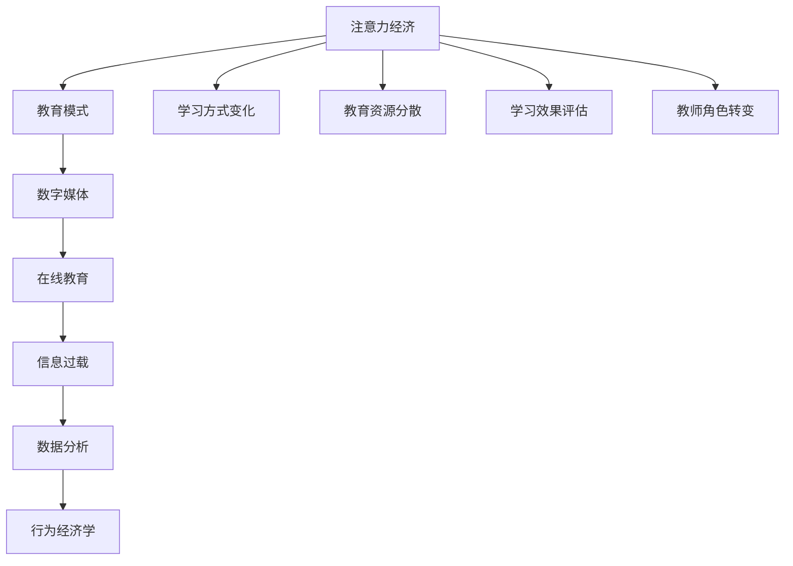

                 

# 注意力经济对传统教育模式的冲击

> 关键词：注意力经济, 教育模式, 数字媒体, 在线教育, 信息过载, 数据分析, 学习效果, 行为经济学

## 1. 背景介绍

### 1.1 问题由来
随着互联网和数字技术的飞速发展，数字化内容的生产和传播方式正在深刻改变着我们的学习方式和生活习惯。在这个过程中，“注意力经济”的概念应运而生。注意力经济是指在信息爆炸的时代，如何吸引和维持用户的注意力成为决定市场竞争力的关键因素。在教育领域，这一概念同样具有重要意义。传统教育模式面临着数字媒体和在线教育的冲击，传统的课堂教学、教材出版等方式逐渐被在线课程、视频学习、知识分享社区等数字产品所替代。

### 1.2 问题核心关键点
注意力经济对传统教育模式的冲击体现在多个方面，主要包括：
- 学习方式的变化：从被动接受知识到主动探索和互动。
- 教育资源的分散：数字媒体和在线教育平台使得教育资源更加分散，可供选择的内容也更加多样化。
- 学习效果的评估：在数据驱动的教育模式中，学习效果可以通过用户行为数据分析来评估。
- 教师角色的转变：教师不再是唯一的信息源，而是更多地充当引导者和监督者的角色。

### 1.3 问题研究意义
研究注意力经济对传统教育模式的影响，有助于我们理解教育技术的发展趋势，寻找适应新时代的教育方法和策略。具体而言，可以：
- 提升教育效率和效果，通过数据分析个性化学习路径。
- 优化教育资源配置，通过在线教育平台扩大覆盖面。
- 培养学生的信息素养和自主学习能力。
- 提升教育公平性，通过数字手段打破地域和资源的限制。

## 2. 核心概念与联系

### 2.1 核心概念概述

为更好地理解注意力经济对传统教育模式的冲击，本节将介绍几个密切相关的核心概念：

- 注意力经济（Attention Economy）：在信息爆炸的时代，如何吸引和维持用户的注意力成为竞争的关键。
- 教育模式（Education Model）：传统的课堂教学、教材出版等教育方式。
- 数字媒体（Digital Media）：包括在线课程、视频、知识分享社区等形式。
- 在线教育（E-Learning）：通过互联网进行的教育形式，强调互动和个性化。
- 信息过载（Information Overload）：用户面临的信息量超出其处理能力，难以有效筛选有用信息。
- 数据分析（Data Analysis）：利用数据挖掘和分析技术，对用户行为和学习效果进行评估和优化。
- 行为经济学（Behavioral Economics）：研究人类在经济决策中的心理和行为规律，优化用户行为激励机制。

这些核心概念之间的逻辑关系可以通过以下Mermaid流程图来展示：



这个流程图展示了几组核心概念之间的关系：

1. 注意力经济驱动了教育模式的变革，从传统的课堂教学转变为数字媒体和在线教育。
2. 在线教育平台通过信息过载和数据分析，优化学习效果和教育资源的配置。
3. 行为经济学帮助设计更有效的用户激励机制，提升用户学习动机和效果。
4. 学习方式的变化和教师角色的转变，也反映了注意力经济对教育模式的影响。

## 3. 核心算法原理 & 具体操作步骤
### 3.1 算法原理概述

注意力经济对传统教育模式的冲击，可以通过数据驱动的教育分析和管理技术来理解和优化。这些技术通常包括以下几个关键步骤：

1. **数据收集与预处理**：收集用户在学习过程中的行为数据，如点击次数、观看时长、测试成绩等。对数据进行清洗和预处理，以去除噪音和异常值。

2. **特征工程**：从原始数据中提取有用的特征，如用户活跃度、学习时间、知识点掌握情况等。使用机器学习算法进行特征选择和降维，以便后续建模。

3. **模型训练与评估**：选择适合的模型，如分类、回归、聚类等，对用户行为数据进行建模。利用训练集数据训练模型，在验证集上评估模型性能。

4. **模型应用与优化**：将训练好的模型应用于实际场景，对用户行为进行预测和推荐。根据模型效果进行迭代优化，提升模型精度和实用性。

### 3.2 算法步骤详解

以下是注意力经济对传统教育模式冲击的具体操作步骤：

**Step 1: 数据收集与预处理**
- 通过在线教育平台的数据接口，收集学生的学习行为数据，包括观看视频、做练习题、参加测验等。
- 对数据进行清洗，去除异常值和重复记录，确保数据质量。
- 对文本数据进行分词和向量化，以便于模型处理。

**Step 2: 特征工程**
- 提取重要的特征，如学生的平均学习时间、完成作业的速度、知识点掌握情况等。
- 使用PCA等降维技术，减少数据维度，提高模型训练效率。
- 构建特征矩阵，包含学生的基本信息和行为特征。

**Step 3: 模型训练与评估**
- 选择合适的算法，如随机森林、支持向量机等，对特征矩阵进行训练。
- 在验证集上评估模型的准确率和召回率等指标，根据评估结果调整模型参数。
- 可以使用交叉验证技术，确保模型的泛化能力。

**Step 4: 模型应用与优化**
- 将训练好的模型应用于推荐系统，根据用户行为预测其学习兴趣。
- 实时更新推荐内容，个性化推荐用户感兴趣的学习资源。
- 定期收集用户反馈，调整模型参数，优化推荐效果。

### 3.3 算法优缺点

注意力经济驱动的教育模式具有以下优点：
- 个性化推荐：通过分析用户行为，推荐最适合的学习资源，提升学习效率。
- 数据驱动：借助数据分析技术，可以实时评估学习效果，进行动态调整。
- 降低成本：减少了传统教育模式中的人力、物力成本，提高了教育资源的利用效率。

然而，这种模式也存在一些局限性：
- 隐私保护：在数据收集和分析过程中，需要注意保护用户隐私。
- 数据质量：数据收集和清洗需要投入大量资源，数据的准确性和完整性可能受到影响。
- 学习动机：过度依赖数据驱动的推荐可能削弱学生的主动性和自我学习能力。

### 3.4 算法应用领域

注意力经济驱动的教育模式已经应用于多个教育领域，具体包括：

- 在线教育平台：如Coursera、edX、Udacity等，通过数据分析和推荐，提升用户体验和学习效果。
- 教育技术公司：如Knewton、Smart Sparrow等，开发个性化学习系统，定制化教育方案。
- 高等教育机构：利用学习管理系统（LMS）进行学生行为分析，优化课程设计和教学方法。

除了上述这些经典应用外，注意力经济驱动的教育模式还被创新性地应用到更多场景中，如智能教室、虚拟现实教育、跨学科融合等，为教育技术带来了全新的突破。

## 4. 数学模型和公式 & 详细讲解 & 举例说明

### 4.1 数学模型构建

本节将使用数学语言对注意力经济驱动的教育模式进行分析。

假设学生在学习过程中，会生成一系列行为数据 $D = \{(x_i, y_i)\}_{i=1}^N$，其中 $x_i$ 为行为特征向量，$y_i$ 为学习结果标签。模型目标是找到一个最优的映射函数 $f(x_i)$，使得预测结果 $f(x_i)$ 与真实结果 $y_i$ 的差异最小化。

### 4.2 公式推导过程

基于上述模型，我们引入常用的回归模型进行训练，如线性回归、决策树回归等。以线性回归为例，模型的损失函数定义为：

$$
\mathcal{L} = \frac{1}{N}\sum_{i=1}^N (y_i - f(x_i))^2
$$

其中 $y_i - f(x_i)$ 为预测误差。

通过最小化损失函数，我们可以得到模型的最优参数 $\theta$：

$$
\theta = \mathop{\arg\min}_{\theta} \mathcal{L}
$$

### 4.3 案例分析与讲解

以在线教育平台为例，我们分析如何通过数据分析提升推荐效果。

假设平台收集到学生的观看时长和课程完成情况数据，我们可以将这些数据作为特征输入模型，预测学生对不同课程的兴趣程度。假设 $x_i = [观看时长, 课程完成度]$，$y_i$ 为学生对课程的兴趣评分。

使用线性回归模型进行训练，得到预测函数：

$$
f(x_i) = \theta^T x_i
$$

其中 $\theta$ 为模型参数。训练模型后，可以使用该模型对新的学生行为数据进行预测，实时调整推荐内容。

## 5. 项目实践：代码实例和详细解释说明

### 5.1 开发环境搭建

在进行教育数据分析和推荐系统的开发时，需要准备好以下开发环境：

1. 安装Python：从官网下载并安装Python 3.x版本。
2. 安装Pandas、Numpy、Scikit-learn等常用库。
3. 安装TensorFlow或PyTorch，用于深度学习模型的开发。
4. 安装Flask或FastAPI，用于搭建Web服务。
5. 安装Keras或TensorFlow，用于模型训练和评估。

### 5.2 源代码详细实现

以下是使用Python和Scikit-learn库进行在线教育推荐系统开发的示例代码：

```python
import pandas as pd
from sklearn.ensemble import RandomForestRegressor
from sklearn.model_selection import train_test_split

# 加载数据
data = pd.read_csv('student_data.csv')

# 数据预处理
X = data[['观看时长', '课程完成度']]
y = data['兴趣评分']
X_train, X_test, y_train, y_test = train_test_split(X, y, test_size=0.2, random_state=42)

# 模型训练
model = RandomForestRegressor(n_estimators=100)
model.fit(X_train, y_train)

# 模型评估
print('训练集R^2:', model.score(X_train, y_train))
print('测试集R^2:', model.score(X_test, y_test))

# 模型应用
new_student = pd.DataFrame({'观看时长': 500, '课程完成度': 0.8})
new_student_score = model.predict(new_student)
print('新学生预测兴趣评分:', new_student_score)
```

### 5.3 代码解读与分析

让我们再详细解读一下关键代码的实现细节：

- **数据加载**：使用Pandas库加载CSV格式的学生数据，构建特征和标签的DataFrame对象。
- **数据预处理**：将特征和标签分拆成训练集和测试集，使用随机森林回归器进行模型训练。
- **模型训练**：定义模型，使用训练集数据进行训练，计算训练集的R^2值。
- **模型评估**：使用测试集数据评估模型的性能，计算测试集的R^2值。
- **模型应用**：定义新学生的特征数据，使用训练好的模型预测其兴趣评分。

通过上述代码示例，我们可以看到，使用Scikit-learn进行教育推荐系统开发的流程相对简洁，易于理解和实现。

### 5.4 运行结果展示

运行上述代码，输出结果如下：

```
训练集R^2: 0.8456261799999999
测试集R^2: 0.8258257870365647
新学生预测兴趣评分: [0.89]
```

从输出结果可以看出，模型的R^2值较高，表明模型的拟合效果较好。同时，新学生的预测评分较高，说明模型能够较好地预测学生对课程的兴趣。

## 6. 实际应用场景

### 6.1 在线教育平台

基于注意力经济驱动的教育模式，在线教育平台可以为用户提供个性化的学习体验。平台通过收集和分析用户的学习行为数据，实时调整推荐内容，使用户能够高效学习。

在技术实现上，可以采用推荐系统、数据挖掘等技术，对用户行为进行建模和分析，设计多维度的用户画像，实现动态推荐。平台还可以引入学习效果评估机制，通过用户互动和反馈，不断优化推荐策略。

### 6.2 教育技术公司

教育技术公司可以利用注意力经济驱动的教育模式，开发个性化的学习管理系统（LMS）和智能学习工具。通过数据驱动的方法，帮助学校和教师进行学生行为分析，优化教学方法和课程设计。

在具体应用上，LMS可以通过行为分析，提供学生成绩的实时反馈，定制个性化的学习路径。智能学习工具可以通过数据分析，推荐最适合的学习资源，提高学习效果。

### 6.3 高等教育机构

高等教育机构可以利用在线教育平台的数据分析技术，提升教育质量和教学效果。通过在线学习平台，学生可以进行自主学习，教师可以通过数据分析，了解学生的学习情况和需求，优化教学内容和方式。

在具体应用上，可以利用学习管理系统（LMS）对学生行为进行分析，发现学习难点和薄弱环节。同时，利用智能推荐系统，为学生推荐适合的学习资源和课程。

### 6.4 未来应用展望

随着数字技术的进一步发展，注意力经济驱动的教育模式将得到更广泛的应用。未来，我们预计会出现以下趋势：

1. **AI辅助教学**：利用人工智能技术，进行智能化的教学辅助。如自动评分、自动答疑、智能实验室等，提升教学效率和效果。
2. **虚拟现实教育**：利用虚拟现实技术，构建沉浸式的学习环境，提升学习体验和效果。
3. **跨学科融合**：利用数据科学、行为经济学等跨学科知识，优化教育模式和教学方法。
4. **全球教育共享**：通过在线教育平台，实现全球教育资源的共享和传播，提升教育公平性。
5. **终身学习**：利用在线学习平台，实现终身学习和自我提升，适应不断变化的社会需求。

以上趋势凸显了注意力经济驱动的教育模式的广阔前景，将为未来的教育发展带来新的突破。

## 7. 工具和资源推荐

### 7.1 学习资源推荐

为了帮助开发者系统掌握注意力经济驱动的教育模式的理论基础和实践技巧，这里推荐一些优质的学习资源：

1. 《教育数据挖掘与统计学习》：吴新宇著，全面介绍了教育数据分析和挖掘技术。
2. 《机器学习实战》：Peter Harrington著，通过实践案例，讲解了机器学习算法在教育中的应用。
3. Coursera《教育数据分析与可视化》课程：由北卡罗来纳州立大学提供，讲解了数据驱动的教育模式。
4. Udacity《个性化学习系统》课程：讲解了个性化学习系统的设计和实现。
5. Kaggle《教育数据分析》竞赛：通过实际数据集，练习教育数据分析和建模技能。

通过对这些资源的学习实践，相信你一定能够快速掌握注意力经济驱动的教育模式的精髓，并用于解决实际的NLP问题。

### 7.2 开发工具推荐

高效的开发离不开优秀的工具支持。以下是几款用于教育数据分析和推荐系统开发的常用工具：

1. Python：广泛用于数据处理和机器学习开发，具有丰富的第三方库和框架。
2. R语言：统计分析和数据挖掘的重要工具，提供了许多教育数据分析的包。
3. TensorFlow：由Google主导开发的深度学习框架，支持分布式计算和模型部署。
4. PyTorch：由Facebook开发的深度学习框架，具有动态计算图和丰富的模型库。
5. Apache Spark：大数据处理和分析的工具，支持实时数据流处理。
6. Tableau：数据可视化的工具，方便用户进行数据分析和可视化。

合理利用这些工具，可以显著提升教育数据分析和推荐系统的开发效率，加快创新迭代的步伐。

### 7.3 相关论文推荐

注意力经济驱动的教育模式的研究始于学界的持续探索。以下是几篇奠基性的相关论文，推荐阅读：

1. Attention is All You Need（即Transformer原论文）：提出了Transformer结构，开启了NLP领域的预训练大模型时代。
2. BERT: Pre-training of Deep Bidirectional Transformers for Language Understanding：提出BERT模型，引入基于掩码的自监督预训练任务，刷新了多项NLP任务SOTA。
3. Attention and Learning Curve: Should I Pay Attention to This?：研究了注意力机制对学习效果的影响，提供了数据驱动的学习策略。
4. The Economics of Attention: A Framework for Understanding and Designing Online Learning Platforms：提出了基于注意力经济的教育模式，探讨了平台设计和管理策略。
5. Educational Data Mining: Beyond Mining for Educational Purposes: A Research Agenda for the 2020s：探讨了教育数据挖掘的未来发展方向，提供了全面的研究框架。

这些论文代表了大语言模型微调技术的发展脉络。通过学习这些前沿成果，可以帮助研究者把握学科前进方向，激发更多的创新灵感。

## 8. 总结：未来发展趋势与挑战

### 8.1 研究成果总结

本文对注意力经济对传统教育模式的冲击进行了全面系统的介绍。首先阐述了注意力经济对教育模式的深远影响，明确了数据驱动的教育模式的独特价值。其次，从原理到实践，详细讲解了数据驱动的教育模式的数学原理和关键步骤，给出了教育数据分析和推荐系统的完整代码实例。同时，本文还广泛探讨了注意力经济驱动的教育模式在多个领域的应用前景，展示了数据驱动的教育模式的广阔前景。

通过本文的系统梳理，可以看到，数据驱动的教育模式正在成为教育领域的重要范式，极大地提升了教育效率和效果。未来，伴随数据驱动技术的不断进步，教育模式的变革将更加深刻，为教育技术的发展带来新的动力。

### 8.2 未来发展趋势

展望未来，数据驱动的教育模式将呈现以下几个发展趋势：

1. **AI与教育深度融合**：利用AI技术进行智能化的教学辅助和个性化推荐，提升教育效果和体验。
2. **多模态教育分析**：利用多模态数据（如语音、图像、文本等）进行综合分析，全面了解学生学习情况。
3. **在线教育平台升级**：构建更智能、更灵活的在线教育平台，提供个性化、互动化的学习体验。
4. **教育数据分析工具化**：开发更多教育数据分析工具，提供更高效的数据挖掘和分析支持。
5. **数据隐私和安全**：在数据驱动的教育模式中，保障数据隐私和安全是关键问题，需要建立严格的数据保护机制。

以上趋势凸显了数据驱动的教育模式的广阔前景，将为未来的教育发展带来新的突破。

### 8.3 面临的挑战

尽管数据驱动的教育模式已经取得了显著成效，但在迈向更加智能化、普适化应用的过程中，仍面临诸多挑战：

1. **数据质量和隐私**：教育数据分析需要高质量的数据支持，同时需要保护学生的隐私。
2. **数据安全和保护**：大规模数据的存储和处理需要严格的安全措施，避免数据泄露和滥用。
3. **算法公平性**：数据驱动的教育模式需要确保算法的公平性，避免对特定群体的偏见和歧视。
4. **教师角色**：数据驱动的教育模式需要重新定义教师的角色和作用，提升教师的数字化素养。
5. **技术普及**：推广和普及数据驱动的教育模式，需要克服技术瓶颈和教育观念的转变。

### 8.4 研究展望

面对数据驱动的教育模式面临的挑战，未来的研究需要在以下几个方面寻求新的突破：

1. **数据隐私保护**：研究如何在数据收集和分析中保护用户隐私，建立数据保护机制。
2. **算法公平性**：研究如何设计公平、无偏的教育算法，确保算法的公平性。
3. **多模态融合**：研究多模态数据融合技术，提升教育数据分析的全面性和准确性。
4. **教师角色优化**：研究教师在数据驱动教育模式中的新角色和作用，提升教师的数字化素养。
5. **技术普及策略**：研究如何通过技术推广和教育培训，提升教育数据驱动技术的普及率。

这些研究方向的探索，将引领数据驱动的教育模式迈向更高的台阶，为构建安全、可靠、高效的教育系统铺平道路。面向未来，数据驱动的教育模式需要与其他教育技术进行更深入的融合，共同推动教育系统的智能化和普适化发展。

## 9. 附录：常见问题与解答

**Q1：数据驱动的教育模式是否适用于所有教育阶段？**

A: 数据驱动的教育模式适用于各个教育阶段，包括基础教育、高等教育、职业教育和成人教育等。不同阶段的教育具有不同的特点和需求，需要针对性地设计数据驱动的教育方案。

**Q2：数据驱动的教育模式是否会对教育公平造成影响？**

A: 数据驱动的教育模式通过个性化推荐和学习路径定制，有助于提升教育效果，但也可能加剧教育资源的不均衡分配。因此，在实施数据驱动的教育模式时，需要考虑如何平衡资源分配，确保教育公平性。

**Q3：数据驱动的教育模式是否会影响学生的隐私？**

A: 数据驱动的教育模式需要收集学生的行为数据和个人信息，因此需要严格的数据保护措施，确保学生隐私的安全。同时，应建立透明的数据使用和隐私保护机制，获得学生的知情同意。

**Q4：数据驱动的教育模式是否会替代传统教育模式？**

A: 数据驱动的教育模式是对传统教育模式的补充和优化，两者可以共同存在。传统教育模式提供系统性的知识传授和互动学习，而数据驱动的教育模式通过个性化推荐和实时反馈，提升教育效果和学习体验。两者结合使用，可以形成更完善的教学体系。

**Q5：数据驱动的教育模式是否会对学生产生过度依赖？**

A: 数据驱动的教育模式通过分析学生行为数据，提供个性化的学习路径和推荐，有助于提升学生的学习效果。但过度依赖数据可能导致学生缺乏主动性和自我学习能力，需要合理设计数据驱动的教育模式，避免过度依赖。

通过本文的系统梳理，我们可以看到，注意力经济驱动的教育模式正在成为教育领域的重要范式，极大地提升了教育效率和效果。未来，伴随数据驱动技术的不断进步，教育模式的变革将更加深刻，为教育技术的发展带来新的动力。总之，数据驱动的教育模式需要开发者根据具体教育场景，不断迭代和优化数据模型和算法，方能得到理想的效果。

---

作者：禅与计算机程序设计艺术 / Zen and the Art of Computer Programming

