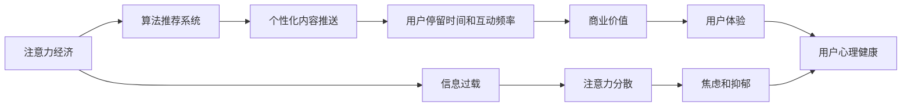

                 

# 注意力经济对心理健康的影响

> 关键词：注意力经济,心理健康,社交媒体,信息过载,用户行为,压力应对策略

## 1. 背景介绍

### 1.1 问题由来

随着互联网的飞速发展和普及，社交媒体和数字平台已经成为我们日常生活中不可或缺的一部分。这些平台不仅改变了我们的信息获取方式，也在一定程度上重塑了我们的社会关系和心理状态。尤其是在注意力经济的驱动下，内容的生产、分发和消费变得更加高效，但同时也带来了诸多不容忽视的心理健康问题。

### 1.2 问题核心关键点

注意力经济的核心在于对用户注意力的争夺和利用。在数字化时代，各种数字平台通过算法推荐系统，精准地推送内容，以此吸引用户停留更长时间，增加点击率、转化率等指标。这种模式虽然提高了内容分发效率，但也导致了信息过载、注意力分散等问题，进而影响了用户的心理健康。

### 1.3 问题研究意义

研究注意力经济对心理健康的影响，对于理解数字时代人类行为变化、优化数字平台内容策略、提升用户心理健康水平具有重要意义：

1. **提升平台体验**：了解注意力经济对用户心理的影响，有助于平台设计更加人性化的内容推送机制，减少用户压力，提升用户满意度和黏性。
2. **促进用户福祉**：通过科学合理的内容设计，减少用户的心理负担，预防注意力分散、焦虑等心理问题，改善用户体验。
3. **推动技术进步**：研究注意力经济与心理健康的关系，能够激发新的算法和技术创新，提升数字平台的智能化和个性化水平。
4. **社会价值**：揭示数字技术对心理健康的影响，有助于制定相关政策和法规，保护用户权益，促进社会和谐。

## 2. 核心概念与联系

### 2.1 核心概念概述

注意力经济（Economy of Attention）是指在信息爆炸的互联网时代，数字平台通过对用户注意力的争夺和利用，实现商业价值的变现。这种经济模式的核心在于对用户注意力资源的高效管理和利用，通过算法推荐、个性化内容推送等手段，最大化用户的停留时间和互动频率。

心理健康（Mental Health）指个体在心理和社会功能上保持良好状态，能够正常地应对压力和挑战，保持内心的平衡和和谐。心理健康的评估通常包括情绪状态、压力应对能力、人际关系等方面的考量。

### 2.2 核心概念原理和架构的 Mermaid 流程图



这个流程图展示了注意力经济对用户心理健康影响的逻辑链条：数字平台通过算法推荐和个性化内容推送，吸引用户更多地停留在平台上，增加商业价值，进而影响用户的心理健康。信息过载和注意力分散是导致心理问题的主要因素，而焦虑和抑郁则是常见的心理疾病。

## 3. 核心算法原理 & 具体操作步骤

### 3.1 算法原理概述

基于注意力经济的数字平台，通过算法推荐系统来实现对用户注意力的高效管理和利用。算法的核心在于预测用户的行为和偏好，并据此推送个性化内容。这种算法通常基于机器学习模型，利用历史行为数据进行训练，进而对用户的行为进行预测。

### 3.2 算法步骤详解

1. **数据采集与处理**：收集用户的浏览、点击、评论等行为数据，构建用户画像，提取特征向量。
2. **模型训练**：基于用户行为数据，训练机器学习模型，如深度神经网络、协同过滤等，预测用户对不同内容的兴趣。
3. **内容推送**：根据模型的预测结果，推送个性化的内容给用户，以吸引用户停留更长时间，增加互动频率。
4. **效果评估**：通过用户停留时间、点击率、转化率等指标评估推荐效果，根据反馈调整模型参数，提升推荐精度。

### 3.3 算法优缺点

#### 优点

- **提升用户体验**：通过个性化推荐，满足用户个性化需求，提高用户满意度和黏性。
- **优化资源利用**：精准推送内容，减少无效内容的展示，优化平台资源利用效率。
- **商业价值提升**：通过增加用户停留时间和互动频率，提高平台流量和转化率，增加商业收益。

#### 缺点

- **信息过载**：算法推荐可能导致用户面对大量无关内容，引起信息过载，增加心理负担。
- **注意力分散**：个性化推荐吸引用户频繁切换内容，导致注意力分散，难以专注于单一任务。
- **心理压力**：面对大量推送内容，用户需要不断做出选择，增加了决策疲劳和心理压力。

### 3.4 算法应用领域

注意力经济和心理健康的影响广泛应用于社交媒体、新闻网站、视频平台等多个数字平台。这些平台通过个性化推荐系统，吸引用户更多地参与内容消费，但同时也带来了信息过载、注意力分散等问题，对用户心理健康产生了负面影响。

## 4. 数学模型和公式 & 详细讲解

### 4.1 数学模型构建

基于注意力经济的推荐系统可以构建为一个二分类问题。假设用户对内容的兴趣可以用二元变量 $Y \in \{0, 1\}$ 表示，$Y=1$ 表示用户对内容感兴趣，$Y=0$ 表示用户对内容不感兴趣。

推荐系统的目标是最小化预测误差 $L$，即：

$$
L = \frac{1}{N}\sum_{i=1}^N \ell(Y_i, \hat{Y}_i)
$$

其中 $N$ 是训练样本数量，$\ell$ 是损失函数，$\hat{Y}_i$ 是模型对第 $i$ 个样本的预测结果。常用的损失函数包括交叉熵损失、均方误差损失等。

### 4.2 公式推导过程

以深度神经网络为例，假设模型结构如下：

$$
\hat{Y}_i = f(X_i; \theta)
$$

其中 $f$ 是模型函数，$\theta$ 是模型参数，$X_i$ 是样本特征向量。

对于二分类问题，常用的交叉熵损失函数为：

$$
\ell(Y_i, \hat{Y}_i) = -Y_i \log(\hat{Y}_i) - (1-Y_i) \log(1-\hat{Y}_i)
$$

将其代入损失函数，得：

$$
L = \frac{1}{N}\sum_{i=1}^N [-Y_i \log(\hat{Y}_i) - (1-Y_i) \log(1-\hat{Y}_i)]
$$

为了求解最优的 $\theta$，通常采用梯度下降等优化算法：

$$
\theta \leftarrow \theta - \eta \nabla_{\theta}L
$$

其中 $\eta$ 是学习率，$\nabla_{\theta}L$ 是损失函数对参数 $\theta$ 的梯度，可通过反向传播算法高效计算。

### 4.3 案例分析与讲解

以社交媒体平台为例，假设用户 $i$ 对内容 $j$ 的兴趣可以通过其历史行为数据表示为二元变量 $Y_{ij}$，即 $Y_{ij}=1$ 表示用户 $i$ 对内容 $j$ 感兴趣，$Y_{ij}=0$ 表示用户 $i$ 对内容 $j$ 不感兴趣。

在模型训练阶段，平台收集大量用户行为数据 $D=\{(x_i,y_i)\}_{i=1}^N$，其中 $x_i$ 是用户特征向量，$y_i$ 是用户对内容感兴趣的二元变量。通过训练神经网络模型，预测用户对不同内容的兴趣，从而实现个性化内容推送。

在模型应用阶段，对于新用户 $i'$，平台根据其特征向量 $x_{i'}$，使用训练好的模型 $f$ 预测其对不同内容的兴趣，选择最感兴趣的内容进行推送。

## 5. 项目实践：代码实例和详细解释说明

### 5.1 开发环境搭建

为进行深度学习模型的开发和训练，我们需要准备好相应的开发环境。以下是Python环境下进行深度学习项目开发的常见步骤：

1. **安装Python**：从官网下载并安装Python，建议选择Python 3.x版本。
2. **安装PyTorch**：使用pip命令安装PyTorch，并进行版本选择。
3. **安装其他依赖包**：如NumPy、Pandas、scikit-learn等，使用pip命令进行安装。
4. **创建虚拟环境**：使用venv命令创建虚拟环境，安装项目所需的依赖包。

### 5.2 源代码详细实现

以下是一个简单的基于神经网络的内容推荐模型示例，使用PyTorch实现。假设我们有一个简单的二分类模型，用于预测用户对内容的兴趣。

```python
import torch
import torch.nn as nn
import torch.optim as optim

# 定义模型
class Model(nn.Module):
    def __init__(self):
        super(Model, self).__init__()
        self.fc1 = nn.Linear(in_features, hidden_size)
        self.fc2 = nn.Linear(hidden_size, 1)
        self.sigmoid = nn.Sigmoid()

    def forward(self, x):
        x = self.fc1(x)
        x = self.sigmoid(self.fc2(x))
        return x

# 加载数据
train_data = ...
train_labels = ...
test_data = ...
test_labels = ...

# 定义模型参数
hidden_size = 64
learning_rate = 0.001

# 创建模型实例
model = Model()

# 定义优化器和损失函数
optimizer = optim.Adam(model.parameters(), lr=learning_rate)
criterion = nn.BCELoss()

# 训练模型
for epoch in range(num_epochs):
    optimizer.zero_grad()
    outputs = model(train_data)
    loss = criterion(outputs, train_labels)
    loss.backward()
    optimizer.step()

    # 评估模型
    test_outputs = model(test_data)
    test_loss = criterion(test_outputs, test_labels)
    print('Epoch {}: Test Loss {}'.format(epoch+1, test_loss.item()))
```

### 5.3 代码解读与分析

上述代码实现了一个简单的二分类模型，用于预测用户对内容的兴趣。模型的前向传播过程包括两个全连接层，最后使用sigmoid函数将输出映射到[0,1]区间，表示用户对内容的兴趣程度。

训练过程中，使用Adam优化器进行参数更新，交叉熵损失函数用于评估模型的预测精度。在每个epoch结束后，评估模型在测试集上的性能，输出测试损失。

### 5.4 运行结果展示

训练完成后，可以使用模型对新用户进行预测，输出感兴趣内容的推荐列表。

## 6. 实际应用场景

### 6.1 社交媒体平台

在社交媒体平台上，算法推荐系统已经成为用户获取信息的重要方式。用户通过点赞、评论、分享等行为，不断反馈自己的兴趣偏好，平台则根据这些反馈数据，精准推送个性化的内容，增加用户停留时间和互动频率。但这种模式也导致了信息过载和注意力分散等问题，影响了用户的心理健康。

### 6.2 新闻网站

新闻网站通过算法推荐系统，将相关新闻推送给用户，提高内容的点击率和阅读量。然而，大量推送不相关或低质量内容，可能导致用户注意力分散，影响用户的心理健康和决策能力。

### 6.3 视频平台

视频平台通过个性化推荐，向用户推荐感兴趣的视频内容。这种模式增加了用户黏性，但也可能导致用户过度沉迷，影响其心理状态和生活质量。

### 6.4 未来应用展望

随着技术的进步和应用场景的拓展，未来的注意力经济和心理健康将面临新的挑战和机遇。

1. **隐私保护**：随着用户数据的增多，平台需要加强隐私保护，减少对用户隐私的侵犯。可以通过匿名化、数据脱敏等技术手段，保护用户隐私，提高用户信任。
2. **内容多样性**：平台需要提供多样化的内容，避免内容同质化，减少用户的心理压力。可以通过引入高质量的外部内容，增加内容的丰富性和多样化。
3. **算法透明性**：平台需要提高算法透明度，让用户了解推荐机制，减少对算法的误解和信任危机。可以通过算法解释和用户反馈机制，提高算法透明性。
4. **心理健康监测**：平台可以引入心理健康监测工具，及时发现和干预用户的心理健康问题，减少心理疾病的发生率。
5. **健康教育**：平台可以提供心理健康教育内容，帮助用户提升心理应对能力，增强心理韧性。

## 7. 工具和资源推荐

### 7.1 学习资源推荐

为了帮助开发者和研究者深入理解注意力经济和心理健康的关系，以下是一些推荐的学习资源：

1. **《注意力经济学：数字时代的新挑战》**：深入探讨数字时代注意力经济的运作机制和影响，提供理论和实践的结合。
2. **《数字时代的心理压力》**：分析数字化环境对用户心理健康的冲击，提出应对策略。
3. **《机器学习：原理、算法与应用》**：详细讲解机器学习模型的构建和应用，为研究注意力经济提供了理论基础。
4. **Coursera《数据科学导论》**：提供从数据采集到模型评估的完整数据科学学习路径，涵盖注意力经济和心理健康的相关课程。
5. **Google AI博客**：定期发布关于AI和心理健康的研究进展和实践案例，提供前沿资讯。

### 7.2 开发工具推荐

为了提高注意力经济和心理健康研究的效率，以下是一些推荐的工具：

1. **Jupyter Notebook**：提供交互式编程环境，方便代码调试和数据可视化。
2. **TensorBoard**：可视化模型训练过程，帮助调试模型参数和学习率。
3. **PyTorch Lightning**：简化深度学习模型开发和训练，提供自动化的模型训练和管理。
4. **Scikit-learn**：提供丰富的机器学习算法库，支持多种数据预处理和特征工程方法。
5. **Spark**：用于大数据处理的分布式计算框架，支持大规模数据处理和算法训练。

### 7.3 相关论文推荐

为了获取最新的学术研究进展，以下是一些推荐的相关论文：

1. **《注意力经济：数字时代的新模式》**：分析注意力经济对用户行为和心理的影响，提出改进建议。
2. **《社交媒体对心理健康的影响》**：评估社交媒体使用与心理健康之间的关系，探讨心理干预措施。
3. **《个性化推荐系统的心理健康影响》**：研究个性化推荐系统对用户心理健康的影响，提出优化策略。
4. **《信息过载与注意力分散》**：分析信息过载和注意力分散对用户认知和情绪的影响，提供解决方案。
5. **《机器学习在心理健康领域的应用》**：探讨机器学习技术在心理健康评估和干预中的应用，提供实例分析。

## 8. 总结：未来发展趋势与挑战

### 8.1 研究成果总结

本文通过分析注意力经济和心理健康的关系，探讨了基于推荐系统的用户行为模式对心理健康的潜在影响。研究发现，注意力经济通过算法推荐系统，吸引了用户更多的注意力，增加了用户停留时间和互动频率，但也导致了信息过载和注意力分散等问题，进而影响了用户的心理健康。

### 8.2 未来发展趋势

未来的注意力经济和心理健康将呈现以下几个发展趋势：

1. **个性化与多样化并重**：平台需要平衡个性化推荐和内容多样性，避免内容同质化，减少用户的心理压力。
2. **隐私保护与透明性提升**：加强隐私保护和算法透明性，减少用户对算法的误解和信任危机，提高用户满意度。
3. **心理健康监测与干预**：引入心理健康监测工具，及时发现和干预用户的心理健康问题，减少心理疾病的发生率。
4. **健康教育与心理韧性提升**：平台可以提供心理健康教育内容，帮助用户提升心理应对能力，增强心理韧性。

### 8.3 面临的挑战

尽管注意力经济和心理健康研究取得了一定的进展，但仍面临诸多挑战：

1. **数据隐私与安全**：用户数据隐私和安全问题仍是关注的重点，如何在保护隐私的前提下进行推荐系统优化。
2. **算法透明度与公平性**：算法透明度不足、不公平等问题仍需进一步解决，确保算法的公正性和可信度。
3. **信息过载与注意力分散**：如何有效控制信息过载，避免注意力分散，提升用户决策能力，增强心理韧性。
4. **心理健康监测与干预**：心理健康的实时监测与干预技术仍需进一步提升，确保心理健康评估的准确性和干预的有效性。

### 8.4 研究展望

未来的研究需要在以下几个方面进行突破：

1. **多模态推荐系统**：结合用户的多模态数据（如行为数据、社交网络数据、生理数据等），提升推荐系统的个性化和多样化水平，减少信息过载和注意力分散。
2. **因果推断与对抗性学习**：引入因果推断和对抗性学习技术，提高推荐系统的鲁棒性和可解释性，减少用户的心理负担。
3. **主动学习与持续学习**：通过主动学习与持续学习，动态调整推荐策略，适应用户心理状态的变化，提升用户体验。
4. **跨学科研究**：结合心理学、社会学、计算机科学等多学科知识，全面评估注意力经济对心理健康的影响，提出更加科学合理的优化方案。

## 9. 附录：常见问题与解答

**Q1: 注意力经济对用户心理健康有哪些负面影响？**

A: 注意力经济通过算法推荐系统吸引了用户更多的注意力，但也导致了信息过载和注意力分散等问题，进而影响了用户的心理健康。具体表现包括：

1. **信息过载**：用户面对大量无关内容，导致决策疲劳和信息焦虑，增加了心理负担。
2. **注意力分散**：频繁切换内容，导致难以专注于单一任务，影响工作效率和学习效果。
3. **心理健康问题**：长时间沉浸在信息流中，可能导致注意力不集中、焦虑、抑郁等心理问题。

**Q2: 如何缓解注意力经济对用户心理健康的负面影响？**

A: 缓解注意力经济对用户心理健康的负面影响，可以从以下几个方面入手：

1. **控制信息量**：限制推送信息的数量和频率，避免信息过载。可以引入算法阈值，控制每个用户每天接收的信息量。
2. **内容多样化**：提供多样化的内容，避免内容同质化，减少用户的心理压力。可以引入高质量的外部内容，增加内容的丰富性和多样化。
3. **用户参与决策**：增加用户对推荐内容的选择权，避免信息强制推送，减少用户心理负担。
4. **心理教育和干预**：提供心理健康教育内容，帮助用户提升心理应对能力，增强心理韧性。

**Q3: 如何在推荐系统中引入心理健康监测？**

A: 在推荐系统中引入心理健康监测，可以通过以下方式实现：

1. **用户行为数据分析**：分析用户的行为数据，识别可能的心理健康问题，如过度使用、注意力不集中等。
2. **心理状态评估**：通过问卷调查、情绪分析等方法，评估用户的心理健康状态，识别潜在的心理健康问题。
3. **个性化推荐调整**：根据用户的心理健康状态，调整推荐策略，减少信息过载和注意力分散。
4. **心理健康干预**：提供心理健康干预服务，如心理咨询、心理支持等，帮助用户应对心理健康问题。

**Q4: 如何提高推荐算法的透明度和公平性？**

A: 提高推荐算法的透明度和公平性，可以通过以下方式实现：

1. **算法解释与可视化**：提供推荐算法的解释和可视化工具，让用户了解推荐机制，减少对算法的误解和信任危机。
2. **数据透明与隐私保护**：公开数据收集和使用规则，保护用户隐私，增强用户信任。
3. **公平性评估与优化**：评估推荐算法在公平性方面的表现，优化算法以减少偏见和歧视。

**Q5: 注意力经济和心理健康的研究有哪些未来趋势？**

A: 注意力经济和心理健康的研究未来趋势包括：

1. **多模态推荐系统**：结合用户的多模态数据，提升推荐系统的个性化和多样化水平，减少信息过载和注意力分散。
2. **因果推断与对抗性学习**：引入因果推断和对抗性学习技术，提高推荐系统的鲁棒性和可解释性，减少用户的心理负担。
3. **主动学习与持续学习**：通过主动学习与持续学习，动态调整推荐策略，适应用户心理状态的变化，提升用户体验。
4. **跨学科研究**：结合心理学、社会学、计算机科学等多学科知识，全面评估注意力经济对心理健康的影响，提出更加科学合理的优化方案。

---

作者：禅与计算机程序设计艺术 / Zen and the Art of Computer Programming

