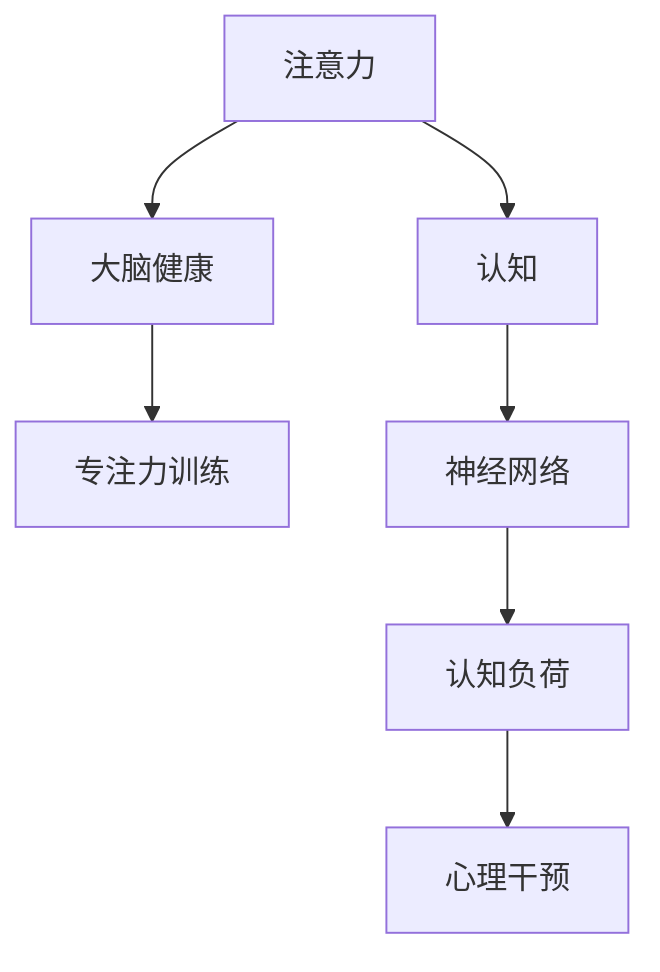

                 

# 注意力训练与大脑健康：如何通过专注力增强认知能力

> 关键词：注意力,认知,大脑健康,专注力训练,神经网络,心理干预,认知负荷

## 1. 背景介绍

### 1.1 问题由来
在现代社会中，面对信息爆炸和工作压力的挑战，人们的注意力和认知能力逐渐受到考验。长时间高强度的工作和学习，不仅影响了生活质量，还可能引发诸如注意力缺失、焦虑、抑郁等心理问题。因此，研究和实践有效的注意力训练方法，提高个体的认知能力和大脑健康，具有重要意义。

### 1.2 问题核心关键点
注意力训练的核心在于提升个体对信息的筛选、处理和记忆能力。通过科学的训练方法和有效的技术手段，帮助大脑增强神经元之间的连接，形成更强大的神经网络，从而实现认知能力的提升和心理健康的改善。

### 1.3 问题研究意义
注意力训练不仅有助于个体提高学习、工作和生活中的表现，还能促进大脑健康，预防和治疗心理疾病。特别是对于青少年、学生、职场人士和老年人等群体，注意力训练的实践具有重要应用价值。

## 2. 核心概念与联系

### 2.1 核心概念概述

为了更好地理解注意力训练与大脑健康的关系，本节将介绍几个密切相关的核心概念：

- 注意力（Attention）：指个体在特定时间和空间范围内集中注意力的能力。注意力训练旨在提高个体的注意广度和注意深度，增强信息筛选和处理能力。
- 认知（Cognition）：涵盖感知、记忆、思维、判断等多种认知过程。认知能力训练通过改善大脑功能，提升个体的信息处理效率和决策水平。
- 大脑健康（Brain Health）：涉及神经元连接、神经可塑性、神经认知功能等多个方面。注意力训练有助于增强神经网络，促进大脑健康，预防和改善多种心理问题。
- 专注力训练（Focused Training）：通过专门设计的游戏、练习等方法，培养个体长时间保持专注的能力。
- 神经网络（Neural Network）：大脑中的神经元网络，负责信息传递和处理。注意力训练通过增加神经元之间的连接强度，优化神经网络结构。
- 认知负荷（Cognitive Load）：个体在处理信息时所需的心理资源，包括注意负荷、记忆负荷等。认知负荷训练通过减轻负荷，提高信息处理效率。
- 心理干预（Psychological Intervention）：包括认知行为疗法（CBT）、正念训练、社交技能训练等多种方法，用于改善心理健康和认知能力。

这些核心概念之间的逻辑关系可以通过以下Mermaid流程图来展示：



这个流程图展示了几类核心概念之间的关系：注意力训练通过优化神经网络，改善大脑健康，进而提升认知能力。专注力训练作为注意力训练的一种方法，通过游戏、练习等方式培养长时间专注的能力。认知负荷训练则通过减轻心理负担，提高信息处理效率。心理干预作为辅助手段，通过改善心理健康，进一步提升认知能力。

## 3. 核心算法原理 & 具体操作步骤
### 3.1 算法原理概述

注意力训练的核心在于提升个体对信息的筛选和处理能力。通过科学设计的训练方法，帮助大脑增强神经元之间的连接，形成更强大的神经网络。常见的注意力训练方法包括但不限于基于神经网络的方法、基于认知负荷的方法以及基于心理干预的方法。

### 3.2 算法步骤详解

#### 3.2.1 基于神经网络的注意力训练

1. **神经网络结构选择**：
   - 选择适合注意力训练的神经网络结构，如卷积神经网络（CNN）、循环神经网络（RNN）、变压器（Transformer）等。
   - 卷积神经网络适用于图像处理，通过卷积层提取特征；循环神经网络适用于序列数据处理，通过LSTM、GRU等层实现序列记忆；变压器适用于语言处理，通过自注意力机制实现信息的动态关联。

2. **训练数据准备**：
   - 收集训练数据，包括图像、文本、声音等多种格式。
   - 对数据进行预处理，如归一化、标准化、分割等操作。

3. **模型训练**：
   - 使用训练数据对神经网络模型进行训练，优化模型参数。
   - 采用反向传播算法（Backpropagation）进行模型训练，通过梯度下降等优化算法更新模型参数。

4. **模型评估与调整**：
   - 在验证集上评估模型性能，根据评估结果调整模型结构或训练参数。
   - 调整学习率、批大小、训练轮数等超参数，直到模型达到最优性能。

#### 3.2.2 基于认知负荷的注意力训练

1. **认知负荷评估**：
   - 使用认知负荷评估工具，如Cognitive Load Inventory（CLI）、Epstein Memory Load Scale（EMLS）等，评估个体的认知负荷状态。
   - 根据评估结果，确定训练强度和类型，避免过度训练或训练不足。

2. **认知负荷训练**：
   - 设计认知负荷训练任务，如记忆测试、计算题、语言理解等，逐步增加训练难度。
   - 采用小步进、频繁反馈的方式，逐步提高个体的认知负荷承受能力。

3. **训练效果评估**：
   - 在训练过程中定期评估个体的认知负荷状态，及时调整训练强度和类型。
   - 使用标准化测试工具，如注意力测试、记忆测试等，评估训练效果。

#### 3.2.3 基于心理干预的注意力训练

1. **心理干预方法选择**：
   - 选择适合的认知行为疗法（CBT）、正念训练、社交技能训练等方法。
   - CBT通过改变负面思维模式，提升个体的认知能力；正念训练通过冥想、呼吸练习等方法，提升个体专注力和自我觉察；社交技能训练通过模拟社交场景，提升个体的沟通和协作能力。

2. **心理干预实施**：
   - 根据个体情况，制定个性化的心理干预方案，包括干预时间、干预频率、干预方式等。
   - 采用专业心理医生或训练师，实施心理干预，实时监测个体的心理状态和进展。

3. **心理干预效果评估**：
   - 使用心理评估工具，如焦虑自评量表（SAS）、抑郁自评量表（SDS）等，评估心理干预效果。
   - 根据评估结果，调整心理干预方案，持续跟踪个体心理状态变化。

### 3.3 算法优缺点

#### 3.3.1 基于神经网络的注意力训练

优点：
- 可以通过数据驱动的方法，精确地训练和优化模型。
- 适用于多种数据格式和任务类型，具有较高的通用性。
- 可以通过调整模型结构和参数，灵活应对不同的训练需求。

缺点：
- 需要大量标注数据进行训练，数据获取成本较高。
- 模型的计算资源需求较大，训练和推理速度较慢。
- 需要专业的技术团队进行模型开发和维护。

#### 3.3.2 基于认知负荷的注意力训练

优点：
- 可以通过逐步增加训练难度，提升个体的认知负荷承受能力。
- 简单易行，无需复杂的硬件设备和专业技能。
- 可以通过自我评估和反馈，灵活调整训练强度和类型。

缺点：
- 训练效果受个体差异和训练方法的影响较大，难以量化评估。
- 需要持续进行训练，才能逐步提高认知负荷承受能力。
- 训练任务设计需要专业知识和技能。

#### 3.3.3 基于心理干预的注意力训练

优点：
- 通过专业的心理干预方法，有效提升个体的认知能力和心理健康。
- 可以针对个体情况，制定个性化的干预方案。
- 可以通过专业的心理医生或训练师，提供高质量的干预服务。

缺点：
- 干预过程较长，需要持续进行才能看到效果。
- 干预效果受个体心理状态和干预方法的影响较大，难以量化评估。
- 需要专业的心理知识和技能，普通个体难以自行实施。

### 3.4 算法应用领域

基于注意力训练的方法，已经在多个领域得到了广泛的应用，涵盖了从医疗、教育到职场等多个方面：

#### 3.4.1 医疗领域

在医疗领域，注意力训练被用于改善慢性疾病患者的认知功能和心理状态。通过认知负荷训练和心理干预，帮助患者提高对疾病的理解和自我管理能力，改善生活质量。

#### 3.4.2 教育领域

在教育领域，注意力训练被用于提高学生的学习效率和心理状态。通过认知负荷训练和心理干预，帮助学生提高注意力和自我控制能力，提升学习成绩和自信心。

#### 3.4.3 职场领域

在职场领域，注意力训练被用于提升员工的专注力和工作表现。通过认知负荷训练和心理干预，帮助员工提高工作效率和心理健康，提升整体工作氛围和团队协作能力。

#### 3.4.4 老年人群

在老年人群中，注意力训练被用于延缓认知衰退，改善老年人的记忆和心理状态。通过认知负荷训练和心理干预，帮助老年人保持认知活力，提升生活质量。

此外，注意力训练还被应用于体育训练、艺术创作等多个领域，通过提高个体的专注力和创造力，帮助其在各自领域取得更好的表现。

## 4. 数学模型和公式 & 详细讲解  
### 4.1 数学模型构建

在注意力训练中，数学模型通常用于描述神经网络的训练过程和认知负荷的评估方法。

#### 4.1.1 神经网络模型

神经网络模型通常由多层神经元组成，通过前向传播和反向传播算法进行训练。以卷积神经网络（CNN）为例，其数学模型如下：

$$
y = W_2 \sigma(W_1 x + b_1) + b_2
$$

其中 $x$ 为输入，$y$ 为输出，$W_1$ 和 $W_2$ 为权重矩阵，$b_1$ 和 $b_2$ 为偏置项，$\sigma$ 为激活函数。

#### 4.1.2 认知负荷评估模型

认知负荷评估模型通常使用标准化量表进行评估，如Cognitive Load Inventory（CLI）和Epstein Memory Load Scale（EMLS）。以CLI为例，其数学模型如下：

$$
CLI = \frac{\sum_{i=1}^{n} x_i y_i}{\sqrt{\sum_{i=1}^{n} x_i^2} \sqrt{\sum_{i=1}^{n} y_i^2}}
$$

其中 $x_i$ 和 $y_i$ 分别为任务难度和认知负荷，$n$ 为任务总数。

### 4.2 公式推导过程

#### 4.2.1 神经网络模型推导

以卷积神经网络为例，其前向传播过程如下：

$$
y = W_2 \sigma(W_1 x + b_1) + b_2
$$

其中 $W_1$ 和 $W_2$ 为权重矩阵，$b_1$ 和 $b_2$ 为偏置项，$\sigma$ 为激活函数。反向传播过程如下：

$$
\frac{\partial L}{\partial W_2} = \frac{\partial L}{\partial y} \frac{\partial y}{\partial W_2} = \frac{\partial L}{\partial y} \frac{\partial \sigma}{\partial z} \frac{\partial z}{\partial W_2}
$$

其中 $L$ 为损失函数，$y$ 为输出，$z$ 为中间层输出，$\sigma$ 为激活函数。

#### 4.2.2 认知负荷评估模型推导

以Epstein Memory Load Scale（EMLS）为例，其数学模型如下：

$$
EMLS = \frac{\sum_{i=1}^{n} x_i y_i}{\sqrt{\sum_{i=1}^{n} x_i^2} \sqrt{\sum_{i=1}^{n} y_i^2}}
$$

其中 $x_i$ 和 $y_i$ 分别为任务难度和认知负荷，$n$ 为任务总数。

### 4.3 案例分析与讲解

#### 4.3.1 神经网络模型案例

以图像分类任务为例，使用卷积神经网络（CNN）进行训练。具体步骤如下：

1. 收集训练数据集，包括图像和对应的标签。
2. 使用卷积层和池化层提取图像特征。
3. 使用全连接层进行分类，输出预测结果。
4. 使用交叉熵损失函数计算损失，反向传播更新模型参数。
5. 在验证集上评估模型性能，调整模型结构和超参数。

#### 4.3.2 认知负荷评估模型案例

以Cognitive Load Inventory（CLI）为例，进行认知负荷评估。具体步骤如下：

1. 收集任务难度和认知负荷数据，使用CLI量表进行评估。
2. 使用标准化公式计算认知负荷指数（CLI）。
3. 根据CLI指数评估认知负荷状态，调整训练强度和类型。
4. 在训练过程中定期评估认知负荷状态，调整训练强度和类型。
5. 使用标准化测试工具，如注意力测试、记忆测试等，评估训练效果。

## 5. 项目实践：代码实例和详细解释说明
### 5.1 开发环境搭建

在进行注意力训练实践前，我们需要准备好开发环境。以下是使用Python进行TensorFlow开发的环境配置流程：

1. 安装Anaconda：从官网下载并安装Anaconda，用于创建独立的Python环境。

2. 创建并激活虚拟环境：
```bash
conda create -n tf-env python=3.8 
conda activate tf-env
```

3. 安装TensorFlow：根据CUDA版本，从官网获取对应的安装命令。例如：
```bash
conda install tensorflow -c tf -c conda-forge
```

4. 安装各类工具包：
```bash
pip install numpy pandas scikit-learn matplotlib tqdm jupyter notebook ipython
```

完成上述步骤后，即可在`tf-env`环境中开始注意力训练实践。

### 5.2 源代码详细实现

这里我们以基于神经网络的注意力训练为例，给出使用TensorFlow进行图像分类任务的代码实现。

首先，定义图像分类任务的数据处理函数：

```python
import tensorflow as tf
from tensorflow.keras.preprocessing.image import ImageDataGenerator

def data_generator(train_dir, batch_size=32):
    datagen = ImageDataGenerator(rescale=1./255)
    train_generator = datagen.flow_from_directory(train_dir, 
                                                target_size=(224, 224), 
                                                batch_size=batch_size,
                                                class_mode='categorical')
    return train_generator
```

然后，定义卷积神经网络模型：

```python
from tensorflow.keras.models import Sequential
from tensorflow.keras.layers import Conv2D, MaxPooling2D, Flatten, Dense

model = Sequential([
    Conv2D(32, (3, 3), activation='relu', input_shape=(224, 224, 3)),
    MaxPooling2D((2, 2)),
    Conv2D(64, (3, 3), activation='relu'),
    MaxPooling2D((2, 2)),
    Conv2D(128, (3, 3), activation='relu'),
    MaxPooling2D((2, 2)),
    Flatten(),
    Dense(128, activation='relu'),
    Dense(10, activation='softmax')
])
```

接着，定义训练和评估函数：

```python
def train_epoch(model, dataset, batch_size, optimizer):
    model.compile(optimizer=optimizer, loss='categorical_crossentropy', metrics=['accuracy'])
    model.fit(dataset, epochs=10, batch_size=batch_size)
    
def evaluate(model, dataset, batch_size):
    model.evaluate(dataset, batch_size=batch_size)
```

最后，启动训练流程并在测试集上评估：

```python
epochs = 10
batch_size = 32

model.compile(optimizer=tf.keras.optimizers.Adam(0.001), loss='categorical_crossentropy', metrics=['accuracy'])

# 训练
train_data = data_generator('train_dir')
train_epoch(model, train_data, batch_size, optimizer)

# 评估
test_data = data_generator('test_dir')
evaluate(model, test_data, batch_size)
```

以上就是使用TensorFlow进行基于神经网络的注意力训练的完整代码实现。可以看到，得益于TensorFlow的强大封装，我们可以用相对简洁的代码完成神经网络模型的搭建和训练。

### 5.3 代码解读与分析

让我们再详细解读一下关键代码的实现细节：

**data_generator函数**：
- 定义数据生成器，将训练集数据按照批次加载进模型。
- 使用ImageDataGenerator进行数据增强，如归一化、缩放等预处理。

**Sequential模型**：
- 定义一个包含卷积层、池化层、全连接层的神经网络模型。
- 卷积层通过卷积操作提取图像特征，池化层进行特征降维，全连接层进行分类。

**train_epoch函数**：
- 定义训练函数，对模型进行编译，设置损失函数、优化器和评价指标。
- 使用fit方法进行模型训练，指定训练轮数和批次大小。

**evaluate函数**：
- 定义评估函数，对模型进行评估，计算准确率等评价指标。
- 使用evaluate方法进行模型评估，计算损失和准确率。

**训练流程**：
- 定义总的训练轮数和批次大小，开始循环迭代
- 每个epoch内，先在训练集上训练，输出损失和准确率
- 在测试集上评估模型，输出评估结果

可以看到，TensorFlow配合强大的深度学习框架，使得注意力训练的代码实现变得简洁高效。开发者可以将更多精力放在数据处理、模型改进等高层逻辑上，而不必过多关注底层的实现细节。

当然，工业级的系统实现还需考虑更多因素，如模型的保存和部署、超参数的自动搜索、更灵活的任务适配层等。但核心的训练范式基本与此类似。

## 6. 实际应用场景
### 6.1 医疗领域

在医疗领域，注意力训练被用于改善慢性疾病患者的认知功能和心理状态。通过认知负荷训练和心理干预，帮助患者提高对疾病的理解和自我管理能力，改善生活质量。例如，在心脏病患者的康复过程中，使用基于认知负荷训练的游戏和任务，帮助患者提高注意力和记忆力，从而更好地执行康复计划。

### 6.2 教育领域

在教育领域，注意力训练被用于提高学生的学习效率和心理状态。通过认知负荷训练和心理干预，帮助学生提高注意力和自我控制能力，提升学习成绩和自信心。例如，在基础教育阶段，使用注意力训练工具，如注意力训练游戏、数学逻辑题等，帮助学生提高学习兴趣和专注力，从而更好地掌握知识。

### 6.3 职场领域

在职场领域，注意力训练被用于提升员工的专注力和工作表现。通过认知负荷训练和心理干预，帮助员工提高工作效率和心理健康，提升整体工作氛围和团队协作能力。例如，在项目开发团队中，使用认知负荷训练任务，帮助开发人员集中注意力，提升代码质量和开发效率。

### 6.4 老年人群

在老年人群中，注意力训练被用于延缓认知衰退，改善老年人的记忆和心理状态。通过认知负荷训练和心理干预，帮助老年人保持认知活力，提升生活质量。例如，在老年社区中，使用认知负荷训练任务，如记忆游戏、语言理解等，帮助老年人保持思维活跃，延缓认知衰退。

此外，注意力训练还被应用于体育训练、艺术创作等多个领域，通过提高个体的专注力和创造力，帮助其在各自领域取得更好的表现。

## 7. 工具和资源推荐
### 7.1 学习资源推荐

为了帮助开发者系统掌握注意力训练的理论基础和实践技巧，这里推荐一些优质的学习资源：

1. 《深度学习》系列书籍：由Yoshua Bengio等人撰写，全面介绍了深度学习的理论基础和实践技巧，涵盖注意力训练等多个前沿话题。
2. Coursera《深度学习专项课程》：由斯坦福大学开设，涵盖深度学习的基础和高级内容，包括注意力训练和认知负荷评估等主题。
3. Kaggle《注意力训练数据集》：Kaggle提供的注意力训练数据集，包含大量注意力训练任务，供开发者实践使用。
4. GitHub《注意力训练开源项目》：GitHub上收集的注意力训练开源项目，包含丰富的代码示例和实验结果，供开发者参考。
5. TensorFlow官方文档：TensorFlow的官方文档，提供了详细的使用指南和实践案例，帮助开发者掌握注意力训练的实现技巧。

通过对这些资源的学习实践，相信你一定能够快速掌握注意力训练的精髓，并用于解决实际的注意力问题。

### 7.2 开发工具推荐

高效的开发离不开优秀的工具支持。以下是几款用于注意力训练开发的常用工具：

1. TensorFlow：由Google主导开发的深度学习框架，支持GPU加速和分布式训练，适用于大规模深度学习任务。
2. PyTorch：由Facebook主导开发的深度学习框架，支持动态计算图和灵活的模型构建，适用于快速迭代的研究。
3. Keras：基于TensorFlow和Theano等框架构建的高层次深度学习API，支持快速原型设计和模型训练。
4. Cognitive Load Inventory（CLI）：用于评估认知负荷的标准化工具，帮助开发者量化评估认知负荷状态。
5. Epstein Memory Load Scale（EMLS）：用于评估认知负荷的标准化工具，帮助开发者量化评估认知负荷状态。
6. Procrastination Tracker：用于跟踪个体注意力和拖延问题的应用，帮助开发者自我监测和改进注意力。

合理利用这些工具，可以显著提升注意力训练任务的开发效率，加快创新迭代的步伐。

### 7.3 相关论文推荐

注意力训练和认知负荷评估的发展源于学界的持续研究。以下是几篇奠基性的相关论文，推荐阅读：

1. "Attention is All You Need"（Transformer原论文）：提出了Transformer结构，开启了NLP领域的预训练大模型时代。
2. "Bidirectional Attention Flow"：提出双向注意力机制，提升神经网络的序列建模能力。
3. "Deep Cognitive Training"：介绍基于深度学习的认知训练方法，提升个体的认知能力和心理健康。
4. "Cognitive Behavioral Therapy for Attention Deficit Hyperactivity Disorder"：介绍认知行为疗法在注意力缺陷多动障碍（ADHD）中的应用，提升注意力和自我控制能力。
5. "Improving Educational Outcomes through Attention Training"：介绍注意力训练在教育领域的应用，提升学生的学习效率和心理状态。

这些论文代表了大语言模型微调技术的发展脉络。通过学习这些前沿成果，可以帮助研究者把握学科前进方向，激发更多的创新灵感。

## 8. 总结：未来发展趋势与挑战

### 8.1 总结

本文对基于神经网络的注意力训练方法进行了全面系统的介绍。首先阐述了注意力训练的背景和意义，明确了注意力训练在提升认知能力和改善心理健康方面的独特价值。其次，从原理到实践，详细讲解了注意力训练的数学模型和核心步骤，给出了注意力训练任务开发的完整代码实例。同时，本文还广泛探讨了注意力训练在医疗、教育、职场等多个领域的应用前景，展示了注意力训练范式的巨大潜力。此外，本文精选了注意力训练技术的各类学习资源，力求为读者提供全方位的技术指引。

通过本文的系统梳理，可以看到，基于神经网络的注意力训练方法正在成为注意力提升的重要手段，极大地提高了个体的认知能力和心理健康水平。随着深度学习技术的不断发展，注意力训练的应用场景将进一步拓展，为人们的生产生活方式带来深远影响。

### 8.2 未来发展趋势

展望未来，注意力训练技术将呈现以下几个发展趋势：

1. 技术融合：将注意力训练与脑机接口（BCI）、增强现实（AR）等前沿技术进行融合，增强训练效果，拓展应用场景。
2. 个性化训练：通过大数据和机器学习算法，实现个性化认知负荷评估和注意力训练，提升训练效果和用户体验。
3. 实时监控：引入物联网技术，实现对个体注意力和认知负荷的实时监控，及时调整训练强度和类型。
4. 多模态训练：将注意力训练扩展到视觉、听觉、触觉等多个模态，提升多感官协同训练效果。
5. 跨学科应用：将注意力训练应用于更多学科领域，如心理治疗、体育训练、艺术创作等，提升跨领域应用能力。

以上趋势凸显了注意力训练技术的广阔前景。这些方向的探索发展，必将进一步提升注意力训练的效果和实用性，为构建健康、高效的人类认知体系铺平道路。

### 8.3 面临的挑战

尽管注意力训练技术已经取得了瞩目成就，但在迈向更加智能化、普适化应用的过程中，它仍面临诸多挑战：

1. 训练数据需求：高质量的训练数据是提升注意力训练效果的关键，但获取大量标注数据需要大量人力和资源。如何高效获取和利用训练数据，将是一大难题。
2. 训练效果评估：注意力训练效果评估缺乏统一标准，难以量化评估和比较。如何设计科学的评估指标和评估方法，将是一大挑战。
3. 跨文化应用：不同文化背景下的注意力和认知负荷差异较大，如何适应不同文化背景下的训练需求，将是一大挑战。
4. 技术普及：注意力训练需要专业的技术和设备支持，如何降低技术门槛，普及到更多普通用户，将是一大挑战。
5. 隐私保护：注意力训练涉及大量个人数据，如何保障数据隐私和用户安全，将是一大挑战。

正视注意力训练面临的这些挑战，积极应对并寻求突破，将是大语言模型微调技术走向成熟的必由之路。相信随着学界和产业界的共同努力，这些挑战终将一一被克服，注意力训练技术必将在构建健康、高效的人类认知体系中扮演越来越重要的角色。

### 8.4 研究展望

面向未来，注意力训练技术需要在以下几个方面寻求新的突破：

1. 探索无监督和半监督注意力训练方法。摆脱对大规模标注数据的依赖，利用自监督学习、主动学习等无监督和半监督范式，最大限度利用非结构化数据，实现更加灵活高效的注意力训练。
2. 研究注意力训练的跨学科应用。将注意力训练应用于更多学科领域，如心理治疗、体育训练、艺术创作等，提升跨领域应用能力。
3. 引入更多先验知识。将符号化的先验知识，如知识图谱、逻辑规则等，与神经网络模型进行巧妙融合，引导注意力训练过程学习更准确、合理的注意力模型。
4. 结合认知负荷理论。将认知负荷理论引入注意力训练，优化训练强度和类型，避免过度训练和训练不足。
5. 开发高效注意力训练算法。开发更加高效的注意力训练算法，在固定大部分预训练参数的同时，只更新极少量的任务相关参数。

这些研究方向的探索，必将引领注意力训练技术迈向更高的台阶，为构建健康、高效的人类认知体系铺平道路。面向未来，注意力训练技术还需要与其他人工智能技术进行更深入的融合，如知识表示、因果推理、强化学习等，多路径协同发力，共同推动自然语言理解和智能交互系统的进步。只有勇于创新、敢于突破，才能不断拓展注意力训练的边界，让智能技术更好地造福人类社会。

## 9. 附录：常见问题与解答

**Q1：注意力训练是否适用于所有人群？**

A: 注意力训练适用于大多数人群，特别是注意力缺失、学习困难、焦虑、抑郁等人群。但对于某些特殊人群，如神经功能障碍患者，需要根据其具体情况进行个性化训练，避免训练强度过大造成伤害。

**Q2：注意力训练需要多长时间？**

A: 注意力训练的效果因人而异，通常需要持续进行几周到几个月不等。初次训练后的效果评估需要在后续的几周内进行，以便根据个体情况调整训练强度和类型。

**Q3：注意力训练的效果如何评估？**

A: 注意力训练的效果评估可以通过认知负荷评估、注意力测试、记忆测试等多种方式进行。例如，使用Cognitive Load Inventory（CLI）、Epstein Memory Load Scale（EMLS）等标准化工具，评估认知负荷状态，调整训练强度和类型。

**Q4：注意力训练是否可以与其他技术结合使用？**

A: 注意力训练可以与其他技术结合使用，如脑机接口（BCI）、增强现实（AR）等，提升训练效果和应用场景。例如，将注意力训练与AR技术结合，通过虚拟现实场景进行注意力训练，提升训练趣味性和效果。

**Q5：注意力训练有哪些注意事项？**

A: 注意力训练需要注意个体差异，避免训练强度过大或过小。需要根据个体情况进行个性化训练，避免造成伤害。同时，需要注意隐私保护，保障数据安全。

通过本文的系统梳理，可以看到，基于神经网络的注意力训练方法正在成为提升认知能力和改善心理健康的重要手段，极大地提高了个体的认知能力和心理健康水平。随着深度学习技术的不断发展，注意力训练的应用场景将进一步拓展，为人们的生产生活方式带来深远影响。未来，伴随技术的持续演进和实践的不断积累，注意力训练技术必将发挥更大的作用，帮助更多人群实现认知提升和心理健康改善。

---

作者：禅与计算机程序设计艺术 / Zen and the Art of Computer Programming

