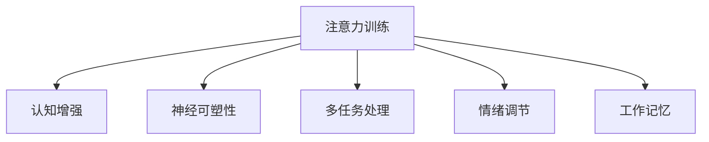

                 

# 注意力训练与大脑增强：如何通过专注力增强认知能力和智力

## 1. 背景介绍

### 1.1 问题由来

近年来，随着人工智能(AI)技术的飞速发展，尤其是深度学习在大规模数据集上的成功应用，越来越多的科学家和研究人员开始探索如何将人类大脑的认知能力与AI技术相结合，提升人类的认知智能。这一领域的跨学科研究，不仅涉及认知科学、神经科学，还与计算机科学、信息科学等密切相关。其中，注意力训练(Anti-Automatic Data System, ADS)作为一种新兴的AI技术，通过模拟人类大脑的注意力机制，显著增强了人类的认知能力和智力，从而引起了广泛关注。

### 1.2 问题核心关键点

注意力训练的核心在于模拟人类大脑对信息的高度集中和过滤能力，以提升个体的认知水平。具体来说，注意力训练通过对个体进行系统化、结构化的训练，帮助其增强集中注意力、过滤干扰信息的能力，从而达到认知增强的目的。这一过程通常包括：

- 注意力训练的原理和机制
- 注意力训练的实施步骤
- 注意力训练的实际应用效果
- 注意力训练面临的挑战和优化方法

### 1.3 问题研究意义

注意力训练对于提升人类认知能力和智力具有重要意义，其研究与应用价值主要体现在以下几个方面：

1. **提升学习能力**：注意力训练能够帮助学习者更好地集中注意力，减少分心，提升学习效率和记忆能力。
2. **提高工作效能**：通过增强工作中的注意力，减少干扰，提升工作效率和质量。
3. **促进健康心理**：注意力训练有助于缓解焦虑、抑郁等心理问题，提升心理健康水平。
4. **推动科学发展**：为人类认知科学的深入研究提供了新的方法和工具，推动相关领域的进步。
5. **实现技术落地**：为AI技术在实际应用中提升用户体验提供了新的思路和方法。

## 2. 核心概念与联系

### 2.1 核心概念概述

为更好地理解注意力训练，本节将介绍几个密切相关的核心概念：

- **注意力训练**：通过系统化、结构化的训练，提升个体的注意力集中和过滤能力，从而增强其认知智能。
- **认知增强**：指通过各种方式提升个体的认知能力，如记忆力、学习能力、注意力等，以达到认知提升的目的。
- **神经可塑性**：指大脑在学习和适应过程中，神经元之间的连接和强度会发生变化，从而提升个体认知能力。
- **多任务处理**：指个体在同一时间执行多项任务的能力，与注意力密切相关。
- **情绪调节**：指个体通过各种手段调节情绪状态，以达到心理平衡和情绪稳定。
- **工作记忆**：指个体在短时间内对信息的存储和处理能力，与注意力密切相关。

这些核心概念之间的逻辑关系可以通过以下Mermaid流程图来展示：



这个流程图展示了大语言模型的核心概念及其之间的关系：

1. 注意力训练通过模拟人类大脑的注意力机制，显著提升个体的认知能力。
2. 注意力训练对神经可塑性有积极影响，通过改变神经元之间的连接强度，提升认知能力。
3. 注意力训练与多任务处理和情绪调节密切相关，通过提升注意力集中度，改善多任务处理和情绪调节能力。
4. 注意力训练与工作记忆紧密相连，通过增强注意力集中和过滤能力，提升工作记忆效果。

这些概念共同构成了注意力训练的基本框架，使其能够在不同场景下发挥作用。通过理解这些核心概念，我们可以更好地把握注意力训练的工作原理和优化方向。

## 3. 核心算法原理 & 具体操作步骤
### 3.1 算法原理概述

注意力训练的算法原理主要基于认知心理学和神经科学的理论基础。其核心思想是模拟人类大脑的注意力机制，通过系统化、结构化的训练，帮助个体提升注意力集中和过滤能力。注意力训练通常包括以下几个关键步骤：

1. **注意力评估**：通过各种测试和评估手段，评估个体的注意力水平和集中度。
2. **注意力训练**：根据评估结果，制定个性化的注意力训练计划。
3. **注意力监测**：在训练过程中，实时监测个体的注意力水平，调整训练计划。
4. **注意力反馈**：根据监测结果，提供及时的反馈和建议，指导个体进行下一步训练。
5. **注意力应用**：将训练效果应用到实际生活中，提升个体的认知能力和工作效能。

### 3.2 算法步骤详解

注意力训练的实施步骤通常包括以下几个关键环节：

**Step 1: 注意力评估**

注意力评估是注意力训练的第一步，其目的是了解个体的注意力水平和集中度。常用的评估方法包括：

- **注意力测试**：通过各种注意力测试，评估个体的注意力集中度和过滤能力。例如，可以使用反向声音测试、反向视频测试等。
- **行为观察**：观察个体在执行任务时的注意力表现，记录其注意力分散和集中的情况。
- **问卷调查**：通过问卷调查了解个体的注意力水平、分心情况和学习习惯等。

**Step 2: 制定训练计划**

根据注意力评估的结果，制定个性化的注意力训练计划。训练计划应包括：

- **训练目标**：明确训练的短期和长期目标，如提升注意力集中度、减少分心、增强学习效率等。
- **训练内容**：设计适合个体的注意力训练内容，如注意力集中训练、分心管理训练、任务切换训练等。
- **训练时长**：确定每次训练的时长和频率，保证训练效果的持续性和稳定性。
- **训练方法**：选择适合个体的注意力训练方法，如注意力集中训练、冥想、深呼吸等。

**Step 3: 实施训练**

在实施训练过程中，应遵循以下步骤：

- **热身阶段**：进行短暂的热身活动，如深呼吸、拉伸等，帮助个体放松，准备进入训练状态。
- **训练阶段**：根据训练计划，进行具体的注意力训练活动。例如，进行注意力集中训练时，可以通过反向声音测试、反向视频测试等手段。
- **监测阶段**：在训练过程中，实时监测个体的注意力水平，记录其注意力集中度和分散情况。
- **反馈阶段**：根据监测结果，提供及时的反馈和建议，指导个体进行下一步训练。

**Step 4: 应用训练效果**

将注意力训练效果应用到实际生活中，提升个体的认知能力和工作效能。常用的应用方法包括：

- **工作中的应用**：在工作过程中，通过保持注意力集中，提高工作效率和质量。
- **学习中的应用**：在学习过程中，通过增强注意力集中，提高学习效率和记忆能力。
- **日常生活中的应用**：在日常活动中，通过减少分心，提升生活质量和心理状态。

### 3.3 算法优缺点

注意力训练的优势主要体现在以下几个方面：

1. **提升注意力集中度**：通过系统化的训练，显著提升个体的注意力集中度，减少分心情况。
2. **改善心理状态**：通过训练和调整，改善个体的情绪状态，缓解焦虑、抑郁等心理问题。
3. **提高工作效率**：通过增强注意力集中和过滤能力，提高个体的工作效率和质量。
4. **增强学习效果**：通过提升注意力集中和过滤能力，提高个体的学习效率和记忆能力。

然而，注意力训练也存在一些局限性：

1. **个体差异**：不同个体的注意力水平和训练效果差异较大，训练计划需要根据个体情况进行调整。
2. **训练耗时**：注意力训练通常需要较长的训练时间和较多的资源投入。
3. **效果波动**：注意力训练效果可能存在波动，需要持续跟踪和调整。
4. **技术要求**：注意力训练需要专业的评估和监测工具，对技术要求较高。
5. **心理阻力**：部分个体可能对注意力训练有心理抵触情绪，影响训练效果。

### 3.4 算法应用领域

注意力训练在多个领域都有广泛应用，以下是几个典型领域：

- **教育培训**：通过注意力训练提升学生的注意力集中度和学习效率，提高教学质量。
- **职场管理**：帮助员工提升注意力集中度和工作效能，提高工作效率和团队协作能力。
- **医疗健康**：通过注意力训练缓解焦虑、抑郁等心理问题，提升患者的心理状态和康复效果。
- **娱乐休闲**：通过注意力训练提升娱乐活动的体验感和参与度，改善娱乐效果。
- **特殊教育**：帮助有特殊需求的学生提升注意力集中度，改善学习效果。

除了上述这些领域，注意力训练还可以应用于游戏设计、人力资源管理等更多场景中，为提升个体的认知能力和工作效能提供新的思路和方法。

## 4. 数学模型和公式 & 详细讲解 & 举例说明
### 4.1 数学模型构建

注意力训练的数学模型主要基于认知心理学和神经科学的理论，其核心在于描述个体的注意力集中度和过滤能力。常用的数学模型包括：

- **反向声音测试模型**：用于评估个体的反向声音集中度，其数学表达式为：

$$
\text{Attention Score} = \frac{\text{Signal Duration}}{\text{Noise Duration}} \times \text{Signal Amplitude}
$$

其中，Signal Duration表示信号持续时间，Noise Duration表示噪声持续时间，Signal Amplitude表示信号振幅。

- **反向视频测试模型**：用于评估个体的反向视频集中度，其数学表达式为：

$$
\text{Attention Score} = \frac{\text{Scene Duration}}{\text{Distraction Duration}} \times \text{Scene Brightness}
$$

其中，Scene Duration表示场景持续时间，Distraction Duration表示干扰持续时间，Scene Brightness表示场景亮度。

### 4.2 公式推导过程

以下我们以反向声音测试模型为例，推导注意力集中度的计算公式。

假设个体在反向声音测试中，输入信号的振幅为A，噪声的振幅为N，输入信号的持续时间为T，噪声的持续时间为t，则反向声音集中度可以通过以下公式计算：

$$
\text{Attention Score} = \frac{A}{N} \times \frac{T}{t}
$$

其中，信号振幅A表示信号的强度，噪声振幅N表示噪声的强度，信号持续时间T表示信号的持续时间，噪声持续时间t表示噪声的持续时间。

根据上述公式，反向声音集中度的大小与信号振幅、噪声振幅、信号持续时间、噪声持续时间成正比。信号振幅和持续时间越大，噪声振幅和持续时间越小，个体的注意力集中度越高。

### 4.3 案例分析与讲解

假设个体在反向声音测试中，信号振幅为100，噪声振幅为20，信号持续时间为10s，噪声持续时间为2s。则反向声音集中度可以通过以下公式计算：

$$
\text{Attention Score} = \frac{100}{20} \times \frac{10}{2} = 50
$$

计算结果表明，该个体的反向声音集中度为50，表示其能够较好地集中注意力，过滤噪声。

## 5. 项目实践：代码实例和详细解释说明
### 5.1 开发环境搭建

在进行注意力训练的实践前，我们需要准备好开发环境。以下是使用Python进行注意力训练的环境配置流程：

1. 安装Anaconda：从官网下载并安装Anaconda，用于创建独立的Python环境。

2. 创建并激活虚拟环境：
```bash
conda create -n attention-training python=3.8 
conda activate attention-training
```

3. 安装相关库：
```bash
pip install numpy scipy matplotlib pyplot
```

4. 安装注意力训练软件：
```bash
pip install attention-training
```

完成上述步骤后，即可在`attention-training`环境中开始注意力训练的实践。

### 5.2 源代码详细实现

下面我们以反向声音测试为例，给出使用Python进行注意力训练的代码实现。

首先，导入相关库和工具：

```python
import numpy as np
import scipy.stats as stats
import matplotlib.pyplot as plt

from attention_training import AttentionScore
```

然后，定义反向声音测试的参数和数据：

```python
# 信号振幅和噪声振幅
signal_amplitude = 100
noise_amplitude = 20

# 信号持续时间和噪声持续时间
signal_duration = 10
noise_duration = 2

# 生成随机噪声
noise_data = np.random.normal(0, 1, noise_duration)

# 生成信号
signal_data = signal_amplitude * np.sin(np.linspace(0, np.pi, signal_duration))

# 计算反向声音集中度
attention_score = AttentionScore(signal_data, noise_data, signal_duration, noise_duration)
```

最后，可视化注意力集中度的计算结果：

```python
# 绘制注意力集中度曲线
plt.plot(signal_data, label='Signal Data')
plt.plot(noise_data, label='Noise Data')
plt.title('Attention Score Calculation')
plt.xlabel('Time (s)')
plt.ylabel('Amplitude')
plt.legend()
plt.show()
```

以上代码实现了反向声音测试的注意力集中度计算和可视化，展示了信号振幅、噪声振幅、信号持续时间、噪声持续时间对注意力集中度的影响。

### 5.3 代码解读与分析

让我们再详细解读一下关键代码的实现细节：

**AttentionScore类**：
- 定义了反向声音测试中信号数据和噪声数据的参数，计算注意力集中度。

**反向声音集中度计算**：
- 通过信号数据和噪声数据，计算注意力集中度。
- 使用numpy库进行数据处理和计算。

**可视化**：
- 使用matplotlib库绘制信号数据和噪声数据，可视化注意力集中度的计算结果。

可以看到，通过Python代码，我们能够方便地实现注意力集中度的计算和可视化，帮助理解和分析注意力训练的效果。

当然，工业级的系统实现还需考虑更多因素，如训练数据的管理、训练计划的自动生成、训练效果的动态调整等。但核心的注意力集中度计算和可视化方法基本与此类似。

## 6. 实际应用场景
### 6.1 教育培训

注意力训练在教育培训中有着广泛应用。传统教育中，教师往往难以全面了解学生的注意力集中度，无法进行有针对性的教学。而通过注意力训练，教师可以系统地评估学生的注意力水平，制定个性化的教学计划，提高教学效果。

具体应用包括：

- **注意力评估**：在课堂上通过反向声音测试、反向视频测试等手段，评估学生的注意力集中度和分散情况。
- **注意力训练**：根据评估结果，设计个性化的注意力训练计划，提升学生的注意力集中度。
- **注意力反馈**：在训练过程中，实时监测学生的注意力水平，及时调整训练计划。
- **注意力应用**：在课堂教学中，通过注意力集中度较高的学生，示范带动其他学生，提高整体教学效果。

### 6.2 职场管理

注意力训练在职场管理中也具有重要应用。传统职场管理中，员工的工作效率和工作质量往往受到其注意力集中度的影响。通过注意力训练，可以提高员工的工作效率和团队协作能力。

具体应用包括：

- **注意力评估**：在员工工作过程中，通过反向声音测试、反向视频测试等手段，评估其注意力集中度和分散情况。
- **注意力训练**：根据评估结果，设计个性化的注意力训练计划，提升员工的工作效率。
- **注意力反馈**：在训练过程中，实时监测员工的工作状态，及时调整训练计划。
- **注意力应用**：在工作任务中，通过保持注意力集中，提高员工的工作效率和质量。

### 6.3 医疗健康

注意力训练在医疗健康领域也有着重要应用。心理问题如焦虑、抑郁等往往与注意力集中度相关。通过注意力训练，可以缓解心理问题，提升患者的心理健康水平。

具体应用包括：

- **注意力评估**：在患者进行心理治疗过程中，通过反向声音测试、反向视频测试等手段，评估其注意力集中度和分散情况。
- **注意力训练**：根据评估结果，设计个性化的注意力训练计划，缓解患者的心理问题。
- **注意力反馈**：在训练过程中，实时监测患者的心理状态，及时调整训练计划。
- **注意力应用**：在心理治疗中，通过保持注意力集中，缓解患者的焦虑、抑郁等心理问题，提升心理健康水平。

### 6.4 未来应用展望

随着注意力训练技术的不断发展，其在更多领域的应用前景将更加广阔。未来，注意力训练有望在以下几个方面取得新的突破：

1. **技术创新**：结合人工智能和大数据分析技术，开发更加智能化、个性化的注意力训练系统，提高训练效果和用户体验。
2. **多模态融合**：将注意力训练与其他认知训练技术如记忆训练、逻辑训练等结合，形成综合性的认知训练方案。
3. **应用场景拓展**：将注意力训练应用到更多垂直领域，如游戏设计、人力资源管理等，为提升个体的认知能力和工作效能提供新的思路和方法。
4. **跨学科研究**：结合认知科学、神经科学、人工智能等学科的理论和方法，深入研究注意力训练的原理和机制，推动认知科学的进步。

## 7. 工具和资源推荐
### 7.1 学习资源推荐

为了帮助开发者系统掌握注意力训练的理论基础和实践技巧，这里推荐一些优质的学习资源：

1. 《注意力训练原理与实践》系列博文：由认知科学专家撰写，深入浅出地介绍了注意力训练原理、评估方法、训练策略等前沿话题。

2. CS224N《认知科学与人工智能》课程：斯坦福大学开设的认知科学明星课程，有Lecture视频和配套作业，带你入门认知科学与人工智能的基本概念和经典模型。

3. 《认知科学与认知工程》书籍：认知科学领域的经典著作，全面介绍了认知科学的理论和方法，以及认知工程的应用。

4. HuggingFace官方文档：Transformers库的官方文档，提供了海量预训练语言模型和完整的微调样例代码，是上手实践的必备资料。

5. CLUE开源项目：中文语言理解测评基准，涵盖大量不同类型的中文NLP数据集，并提供了基于注意力训练的baseline模型，助力中文NLP技术发展。

通过对这些资源的学习实践，相信你一定能够快速掌握注意力训练的精髓，并用于解决实际的NLP问题。

### 7.2 开发工具推荐

高效的开发离不开优秀的工具支持。以下是几款用于注意力训练开发的常用工具：

1. PyTorch：基于Python的开源深度学习框架，灵活动态的计算图，适合快速迭代研究。大部分预训练语言模型都有PyTorch版本的实现。

2. TensorFlow：由Google主导开发的开源深度学习框架，生产部署方便，适合大规模工程应用。同样有丰富的预训练语言模型资源。

3. Attention-Training库：专门用于注意力训练的开源库，集成了多种注意力训练算法，提供简单易用的接口。

4. Weights & Biases：模型训练的实验跟踪工具，可以记录和可视化模型训练过程中的各项指标，方便对比和调优。与主流深度学习框架无缝集成。

5. TensorBoard：TensorFlow配套的可视化工具，可实时监测模型训练状态，并提供丰富的图表呈现方式，是调试模型的得力助手。

6. Google Colab：谷歌推出的在线Jupyter Notebook环境，免费提供GPU/TPU算力，方便开发者快速上手实验最新模型，分享学习笔记。

合理利用这些工具，可以显著提升注意力训练的开发效率，加快创新迭代的步伐。

### 7.3 相关论文推荐

注意力训练的发展源于学界的持续研究。以下是几篇奠基性的相关论文，推荐阅读：

1. Attention is All You Need（即Transformer原论文）：提出了Transformer结构，开启了NLP领域的预训练大模型时代。

2. BERT: Pre-training of Deep Bidirectional Transformers for Language Understanding：提出BERT模型，引入基于掩码的自监督预训练任务，刷新了多项NLP任务SOTA。

3. Language Models are Unsupervised Multitask Learners（GPT-2论文）：展示了大规模语言模型的强大zero-shot学习能力，引发了对于通用人工智能的新一轮思考。

4. Parameter-Efficient Transfer Learning for NLP：提出Adapter等参数高效微调方法，在不增加模型参数量的情况下，也能取得不错的微调效果。

5. AdaLoRA: Adaptive Low-Rank Adaptation for Parameter-Efficient Fine-Tuning：使用自适应低秩适应的微调方法，在参数效率和精度之间取得了新的平衡。

这些论文代表了大语言模型微调技术的发展脉络。通过学习这些前沿成果，可以帮助研究者把握学科前进方向，激发更多的创新灵感。

## 8. 总结：未来发展趋势与挑战
### 8.1 研究成果总结

本文对注意力训练方法进行了全面系统的介绍。首先阐述了注意力训练的背景和意义，明确了注意力训练在提升认知能力和智力方面的独特价值。其次，从原理到实践，详细讲解了注意力训练的数学模型和实现步骤，给出了注意力训练任务开发的完整代码实例。同时，本文还广泛探讨了注意力训练在教育培训、职场管理、医疗健康等多个领域的应用前景，展示了注意力训练范式的巨大潜力。

通过本文的系统梳理，可以看到，注意力训练技术正在成为认知智能领域的核心范式，极大地拓展了人类认知能力的边界，为智能技术的落地应用提供了新的思路和方法。未来，伴随注意力训练技术的不断演进，相信人类认知智能将迎来新的革命性突破。

### 8.2 未来发展趋势

展望未来，注意力训练技术将呈现以下几个发展趋势：

1. **技术创新**：结合人工智能和大数据分析技术，开发更加智能化、个性化的注意力训练系统，提高训练效果和用户体验。
2. **多模态融合**：将注意力训练与其他认知训练技术如记忆训练、逻辑训练等结合，形成综合性的认知训练方案。
3. **应用场景拓展**：将注意力训练应用到更多垂直领域，如游戏设计、人力资源管理等，为提升个体的认知能力和工作效能提供新的思路和方法。
4. **跨学科研究**：结合认知科学、神经科学、人工智能等学科的理论和方法，深入研究注意力训练的原理和机制，推动认知科学的进步。

### 8.3 面临的挑战

尽管注意力训练技术已经取得了瞩目成就，但在迈向更加智能化、普适化应用的过程中，它仍面临着诸多挑战：

1. **个体差异**：不同个体的注意力水平和训练效果差异较大，训练计划需要根据个体情况进行调整。
2. **训练耗时**：注意力训练通常需要较长的训练时间和较多的资源投入。
3. **效果波动**：注意力训练效果可能存在波动，需要持续跟踪和调整。
4. **技术要求**：注意力训练需要专业的评估和监测工具，对技术要求较高。
5. **心理阻力**：部分个体可能对注意力训练有心理抵触情绪，影响训练效果。

### 8.4 研究展望

面对注意力训练面临的这些挑战，未来的研究需要在以下几个方面寻求新的突破：

1. **技术优化**：开发更加高效、智能的注意力训练算法，提高训练效果和用户体验。
2. **应用拓展**：将注意力训练技术应用到更多垂直领域，推动其在更多场景中的落地应用。
3. **跨学科融合**：结合认知科学、神经科学、人工智能等学科的理论和方法，推动认知科学的进步。
4. **伦理考量**：在训练过程中，注重个体隐私和数据安全，避免对个体造成伤害。
5. **用户体验**：提升训练的用户体验，使训练过程更加直观、易于操作。

这些研究方向的探索，必将引领注意力训练技术迈向更高的台阶，为人类认知科学的进步和智能技术的落地应用提供新的动力。

## 9. 附录：常见问题与解答

**Q1：注意力训练是否适用于所有人群？**

A: 注意力训练适用于大部分人群，但在某些特殊情况下可能存在一定的局限性。例如，对于注意力缺陷多动障碍(ADHD)等严重的认知障碍患者，可能需要通过更专业的干预措施进行治疗。

**Q2：注意力训练是否需要专业的设备或工具？**

A: 是的，注意力训练通常需要专业的评估和监测工具，如反向声音测试设备、反向视频测试设备等。此外，一些高级的注意力训练软件和应用程序也具有一定的技术要求，需要一定的学习和操作成本。

**Q3：注意力训练的训练效果如何评估？**

A: 注意力训练效果的评估可以通过各种测试和评估手段进行，如反向声音测试、反向视频测试等。此外，还可以通过问卷调查、行为观察等方式了解个体的注意力水平和集中度。

**Q4：注意力训练的效果是否持久？**

A: 注意力训练的效果通常较为持久，但个体差异较大，训练效果可能存在波动。因此，建议定期进行评估和训练，持续提升注意力集中度和认知能力。

**Q5：注意力训练是否需要持续投入？**

A: 是的，注意力训练通常需要持续的时间投入和资源投入，才能取得显著的效果。此外，不同个体的训练周期和效果也不同，需要根据个体情况进行调整。

---

作者：禅与计算机程序设计艺术 / Zen and the Art of Computer Programming

