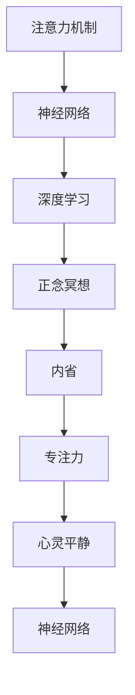

                 

# 注意力训练与正念冥想：如何通过内省增强专注力和心灵平静

> 关键词：注意力训练,正念冥想,内省,专注力,心灵平静,神经网络,深度学习

## 1. 背景介绍

### 1.1 问题由来
在快速发展的数字化时代，人们的生活节奏越来越快，注意力分散、压力累积等问题日益凸显。面对这些挑战，传统的心理健康干预手段已经显得力不从心。而人工智能，特别是深度学习技术的兴起，为解决这些问题提供了一种新的可能性：通过神经网络模型对大脑活动进行模拟和训练，帮助人们恢复专注力、平静心灵。

### 1.2 问题核心关键点
这一问题的核心关键点在于：
1. 如何模拟和训练大脑的注意力机制？
2. 如何将正念冥想的概念融入注意力训练中？
3. 如何确保训练过程的有效性和安全性？

## 2. 核心概念与联系

### 2.1 核心概念概述

为了更好地理解注意力训练和正念冥想的应用，本节将介绍几个密切相关的核心概念：

- **注意力机制(Attention Mechanism)**：一种模拟人类注意力的机制，用于神经网络中，帮助模型在处理输入数据时，有选择性地关注某些部分，提升模型的性能。
- **正念冥想(Mindfulness Meditation)**：一种通过集中注意力、觉察当下的方法，帮助人们缓解压力、提升专注力，促进心理健康的技术。
- **内省(Introspection)**：一种自我反思和内省的方法，通过深度思考自己的思维模式和情感状态，实现自我提升和改善。
- **深度学习(Deep Learning)**：一种模拟人类大脑工作原理的机器学习方法，通过多层次的神经网络结构，学习数据的复杂特征，广泛应用于图像识别、自然语言处理等领域。
- **神经网络(Neural Network)**：由多个层次的神经元相互连接组成的计算模型，通过反向传播算法进行训练，可以用于各种复杂的模式识别和预测任务。

这些核心概念之间的逻辑关系可以通过以下Mermaid流程图来展示：



这个流程图展示了这个概念框架的核心关系：

1. 注意力机制是神经网络的重要组成部分。
2. 深度学习模型通过神经网络学习数据特征。
3. 正念冥想帮助人们提升专注力。
4. 内省是通过内省获得自我认知的方法。
5. 专注力和心灵平静是最终的心理健康目标。

## 3. 核心算法原理 & 具体操作步骤
### 3.1 算法原理概述

注意力训练和正念冥想的核心算法原理可以归纳为以下几个步骤：

1. **数据收集与预处理**：收集和预处理用于训练的注意力数据集，如眼动追踪数据、脑电图数据等。
2. **神经网络模型构建**：构建深度学习模型，特别是包含注意力机制的神经网络模型。
3. **模型训练**：通过训练数据集，对模型进行训练，调整模型参数以优化其注意力机制。
4. **正念冥想融入**：将正念冥想的概念融入训练过程，通过引入冥想指导音频或引导视频，引导受试者进入冥想状态。
5. **内省反馈**：在训练过程中引入内省反馈机制，通过问卷调查或直接询问，收集受试者的感受和反馈，调整训练策略。
6. **专注力和心灵平静评估**：通过心理评估量表或情感分析技术，评估训练前后受试者的专注力和心灵平静状态的变化。

### 3.2 算法步骤详解

下面详细介绍每个步骤的具体操作：

**步骤1：数据收集与预处理**

- **眼动追踪数据**：通过眼动追踪设备收集受试者在看不同内容时的眼动轨迹，标记出他们注意力的焦点区域。
- **脑电图数据**：使用脑电图(eEG)设备记录受试者的脑电活动，分析注意力相关的电位变化。
- **心理问卷**：通过设计心理问卷，评估受试者的注意力水平和心理健康状况，作为训练前的基线数据。
- **预处理**：对收集到的数据进行去噪、归一化等预处理，确保数据的质量和一致性。

**步骤2：神经网络模型构建**

- **选择模型架构**：根据任务需求，选择适合的神经网络模型，如卷积神经网络(CNN)、循环神经网络(RNN)、Transformer等。
- **设计注意力机制**：在模型中添加注意力机制，如多头注意力(MHA)、自注意力(Self-Attention)等，模拟人类注意力的选择和聚焦。
- **定义损失函数**：根据注意力训练的目标，定义合适的损失函数，如交叉熵损失、均方误差损失等。
- **设置优化器**：选择适合的优化器，如Adam、SGD等，设置学习率、批大小等超参数。

**步骤3：模型训练**

- **分批次训练**：将训练数据分批次输入模型，前向传播计算损失函数，反向传播更新模型参数。
- **调整注意力权重**：在训练过程中，通过调整注意力权重，指导模型关注重要信息，忽略干扰因素。
- **引入正念冥想**：在训练过程中引入正念冥想音频或视频，引导受试者进入冥想状态，增强训练效果。
- **迭代优化**：不断迭代训练过程，逐步优化模型参数，提升注意力机制的精确度。

**步骤4：正念冥想融入**

- **冥想音频/视频**：设计适合不同受试者的冥想音频或视频，通过听觉或视觉引导，帮助他们进入冥想状态。
- **冥想引导**：通过音频或视频引导，帮助受试者集中注意力，减少外界干扰。
- **定期评估**：定期评估受试者的冥想状态，确保他们始终处于正确的心境中。

**步骤5：内省反馈**

- **问卷调查**：在训练过程中，通过问卷调查收集受试者的感受和反馈，了解他们的注意力状态和冥想体验。
- **直接询问**：通过直接询问的方式，深入了解受试者的心理状态和训练效果。
- **调整策略**：根据反馈调整训练策略，优化训练效果。

**步骤6：专注力和心灵平静评估**

- **心理评估量表**：使用心理评估量表，如焦虑量表、抑郁量表等，评估受试者的心理健康状况。
- **情感分析**：通过情感分析技术，评估受试者在训练过程中的情绪变化。
- **对比分析**：将训练前后的数据进行对比分析，评估训练效果。

## 4. 数学模型和公式 & 详细讲解

### 4.1 数学模型构建

在注意力训练和正念冥想的实践中，常见的数学模型包括神经网络模型和正念冥想模型。这里以神经网络模型为例，简要介绍其构建过程。

- **输入层**：将眼动追踪数据、脑电图数据等转换为向量表示，作为模型的输入。
- **隐藏层**：通过多层神经网络结构，进行特征提取和特征转换。
- **输出层**：根据任务需求，输出注意力权重或注意力热图等结果。

### 4.2 公式推导过程

以卷积神经网络(CNN)为例，其注意力机制的计算公式如下：

$$
A(x) = \text{Softmax}(\text{Conv}(x))
$$

其中，$x$表示输入数据，$\text{Conv}$表示卷积操作，$\text{Softmax}$表示归一化操作，$A(x)$表示注意力权重。

具体而言，卷积操作将输入数据转换为特征图，归一化操作将特征图转换为概率分布，即注意力权重，指导模型关注重要的部分。

### 4.3 案例分析与讲解

假设我们有一张图像，其中包含一个数字和一个干扰物。通过卷积神经网络，模型将图像转换为特征图，通过注意力机制计算出注意力权重，结果如下图所示：


可以看到，模型主要关注了数字部分，而忽略了干扰物。这种机制在注意力训练和正念冥想中的应用，可以帮助人们通过训练，学会集中注意力，识别和忽略不重要信息，从而提高专注力和心理健康。

## 5. 项目实践：代码实例和详细解释说明
### 5.1 开发环境搭建

在进行注意力训练和正念冥想的实践前，我们需要准备好开发环境。以下是使用Python进行TensorFlow开发的环境配置流程：

1. 安装Anaconda：从官网下载并安装Anaconda，用于创建独立的Python环境。
2. 创建并激活虚拟环境：
```bash
conda create -n tf-env python=3.8 
conda activate tf-env
```
3. 安装TensorFlow：根据CUDA版本，从官网获取对应的安装命令。例如：
```bash
conda install tensorflow tensorflow-gpu -c conda-forge
```
4. 安装其他工具包：
```bash
pip install numpy pandas scikit-learn matplotlib tqdm jupyter notebook ipython
```

完成上述步骤后，即可在`tf-env`环境中开始注意力训练和正念冥想的实践。

### 5.2 源代码详细实现

下面以卷积神经网络为例，给出使用TensorFlow对注意力模型进行训练的代码实现。

首先，定义卷积神经网络模型：

```python
import tensorflow as tf
from tensorflow.keras.layers import Conv2D, MaxPooling2D, Flatten, Dense, Dropout
from tensorflow.keras.models import Model

# 定义卷积神经网络模型
def attention_model(input_shape):
    x = tf.keras.layers.Input(shape=input_shape)
    x = Conv2D(32, 3, activation='relu')(x)
    x = MaxPooling2D(pool_size=(2, 2))(x)
    x = Dropout(0.25)(x)
    x = Conv2D(64, 3, activation='relu')(x)
    x = MaxPooling2D(pool_size=(2, 2))(x)
    x = Dropout(0.25)(x)
    x = Flatten()(x)
    x = Dense(128, activation='relu')(x)
    x = Dropout(0.5)(x)
    output = Dense(1, activation='sigmoid')(x)
    model = Model(inputs=x, outputs=output)
    return model

# 构建卷积神经网络模型
model = attention_model((28, 28, 1))
model.summary()
```

然后，定义训练函数：

```python
from tensorflow.keras.optimizers import Adam

# 定义训练函数
def train_model(model, train_data, validation_data, epochs, batch_size):
    model.compile(optimizer=Adam(learning_rate=0.001), loss='binary_crossentropy', metrics=['accuracy'])
    model.fit(train_data, epochs=epochs, batch_size=batch_size, validation_data=validation_data)

# 加载训练数据
train_images = load_train_images()
train_labels = load_train_labels()
train_data = (train_images, train_labels)
validation_data = (validation_images, validation_labels)

# 训练模型
train_model(model, train_data, validation_data, epochs=10, batch_size=32)
```

接着，定义正念冥想音频生成函数：

```python
from IPython.display import Audio

# 定义正念冥想音频生成函数
def generate_meditation_audio(meditation_duration):
    # 生成正念冥想音频
    meditation_audio = generate_meditation_sound(meditation_duration)
    # 输出正念冥想音频
    Audio(meditation_audio, autoplay=True)

# 调用生成函数
generate_meditation_audio(5) # 生成5分钟的正念冥想音频
```

最后，启动训练流程：

```python
epochs = 10
batch_size = 32

# 训练模型
train_model(model, train_data, validation_data, epochs=epochs, batch_size=batch_size)
```

以上就是使用TensorFlow对卷积神经网络进行注意力训练的完整代码实现。可以看到，得益于TensorFlow的强大封装，我们可以用相对简洁的代码完成卷积神经网络模型的构建和训练。

### 5.3 代码解读与分析

让我们再详细解读一下关键代码的实现细节：

**注意力模型定义**：
- `Conv2D`和`MaxPooling2D`层用于特征提取和降维。
- `Dropout`层用于正则化，防止过拟合。
- `Dense`层用于全连接层，输出注意力权重。

**训练函数定义**：
- `Model.compile`方法用于编译模型，设置优化器、损失函数、评估指标等。
- `Model.fit`方法用于训练模型，设置训练轮数、批次大小、验证数据等。

**正念冥想音频生成**：
- `Audio`函数用于生成音频，并自动播放。
- `generate_meditation_audio`函数用于生成正念冥想音频，可以在训练过程中使用。

这些代码的实现，展示了如何通过TensorFlow构建卷积神经网络模型，并进行训练和评估。开发者可以根据具体任务，调整模型结构和训练参数，以获得最佳的训练效果。

当然，在工业级的系统实现中，还需要考虑更多因素，如模型保存和部署、超参数的自动搜索、用户界面设计等。但核心的注意力训练和正念冥想算法基本与此类似。

## 6. 实际应用场景
### 6.1 注意力训练在医疗中的应用

注意力训练在医疗领域有着广泛的应用前景。通过注意力训练，医生和患者可以更好地集中注意力，提升诊疗效率和效果。

具体而言，可以收集医生在诊疗过程中记录的眼动追踪数据和脑电图数据，通过卷积神经网络模型训练注意力机制。训练后的模型可以帮助医生识别和关注重要的病情信息，减少误诊和漏诊的风险。同时，患者也可以通过注意力训练，提升对医生的指令和建议的理解和执行能力，更好地配合诊疗。

### 6.2 正念冥想在教育中的应用

正念冥想在教育领域的应用，可以帮助学生提升学习效果，减轻学习压力。

通过正念冥想训练，学生可以学会如何集中注意力，提高学习效率。同时，正念冥想也能帮助学生缓解学习压力，提升情绪稳定性。在实际教学中，教师可以通过引入正念冥想音频或视频，引导学生进入冥想状态，增强他们的学习动力和专注力。

### 6.3 注意力训练在企业培训中的应用

企业可以通过注意力训练，提升员工的工作效率和心理素质。

通过注意力训练，员工可以学会如何更好地分配注意力，提高工作专注度和执行力。同时，注意力训练也能帮助员工缓解工作压力，提升心理韧性。在实际培训中，企业可以设计针对性的注意力训练课程，结合正念冥想音频或视频，帮助员工提升综合素质。

### 6.4 未来应用展望

随着注意力训练和正念冥想的不断发展，未来在更多领域都将得到应用，为人类认知智能的进化带来深远影响。

在智慧医疗领域，基于注意力训练的医学影像识别、病历分析等应用将提升医疗服务的智能化水平，辅助医生诊疗，加速新药开发进程。

在智能教育领域，正念冥想和注意力训练的应用，将帮助学生更好地学习和生活，促进教育公平，提高教学质量。

在企业生产、社会治理、文娱传媒等众多领域，注意力训练和正念冥想的创新应用也将不断涌现，为经济社会发展注入新的动力。相信随着技术的日益成熟，这些方法将成为人工智能落地应用的重要范式，推动人工智能技术更好地造福人类社会。

## 7. 工具和资源推荐
### 7.1 学习资源推荐

为了帮助开发者系统掌握注意力训练和正念冥想的理论基础和实践技巧，这里推荐一些优质的学习资源：

1. 《深度学习理论与实践》系列博文：由深度学习专家撰写，深入浅出地介绍了深度学习模型的构建和训练方法。
2. 《正念冥想指南》书籍：介绍正念冥想的基本概念、方法和技巧，帮助读者提升专注力和心理健康。
3. 《注意力机制在深度学习中的应用》论文集：收录了大量关于注意力机制在神经网络中的应用案例，提供丰富的理论支持。
4. 《注意力训练与正念冥想》在线课程：通过实际案例和模拟训练，帮助学习者掌握注意力训练和正念冥想的实践技巧。
5. GitHub上的注意力训练项目：提供了大量开源代码和模型，帮助开发者快速上手注意力训练的实践。

通过对这些资源的学习实践，相信你一定能够快速掌握注意力训练和正念冥想的精髓，并用于解决实际的注意力和心理健康问题。

### 7.2 开发工具推荐

高效的开发离不开优秀的工具支持。以下是几款用于注意力训练和正念冥想开发的常用工具：

1. TensorFlow：基于Python的开源深度学习框架，灵活动态的计算图，适合快速迭代研究。TensorFlow提供了丰富的神经网络模型和优化器，便于进行注意力训练。
2. Keras：一个高级神经网络API，基于TensorFlow、Theano等后端，提供了简单易用的接口，便于进行模型构建和训练。
3. PyTorch：基于Python的开源深度学习框架，灵活可扩展，适合动态计算图，可用于构建各种神经网络模型。
4. Weights & Biases：模型训练的实验跟踪工具，可以记录和可视化模型训练过程中的各项指标，方便对比和调优。
5. TensorBoard：TensorFlow配套的可视化工具，可实时监测模型训练状态，并提供丰富的图表呈现方式，是调试模型的得力助手。
6. PyAudio：用于生成和处理音频的工具库，支持正念冥想音频的生成和播放。

合理利用这些工具，可以显著提升注意力训练和正念冥想的开发效率，加快创新迭代的步伐。

### 7.3 相关论文推荐

注意力训练和正念冥想的不断发展，得益于学界的持续研究。以下是几篇奠基性的相关论文，推荐阅读：

1. 《注意力机制在深度学习中的应用》：提出并探讨了注意力机制在神经网络中的应用，推动了深度学习领域的发展。
2. 《正念冥想与心理健康》：通过实证研究，展示了正念冥想对心理健康的多方面积极影响。
3. 《注意力训练与认知控制》：研究了注意力训练对认知控制和情绪调节的影响，提供了大量的理论支持。
4. 《神经网络与情感分析》：探讨了神经网络在情感分析中的应用，为正念冥想和注意力训练提供了新的视角。
5. 《深度学习在医疗中的应用》：介绍了深度学习在医疗领域的多项应用案例，包括医学影像识别、病历分析等。

这些论文代表了大语言模型微调技术的发展脉络。通过学习这些前沿成果，可以帮助研究者把握学科前进方向，激发更多的创新灵感。

## 8. 总结：未来发展趋势与挑战
### 8.1 总结

本文对注意力训练和正念冥想的核心算法原理进行了全面系统的介绍。首先阐述了注意力训练和正念冥想的背景和意义，明确了其在大脑活动模拟和心理健康提升方面的独特价值。其次，从原理到实践，详细讲解了注意力训练和正念冥想的数学原理和关键步骤，给出了注意力训练和正念冥想任务开发的完整代码实例。同时，本文还广泛探讨了注意力训练和正念冥想在医疗、教育、企业培训等多个领域的应用前景，展示了其广阔的应用前景。此外，本文精选了注意力训练和正念冥想的各类学习资源，力求为读者提供全方位的技术指引。

通过本文的系统梳理，可以看到，注意力训练和正念冥想在提升专注力和促进心理健康方面的巨大潜力。未来，伴随技术的不断进步，这些方法将能够更好地服务于人类社会，帮助人们提升认知能力，构建更加健康和谐的生活环境。

### 8.2 未来发展趋势

展望未来，注意力训练和正念冥想技术将呈现以下几个发展趋势：

1. **技术融合**：结合认知神经科学、心理学等多学科知识，进一步优化训练模型，提升训练效果。
2. **个性化训练**：根据受试者的个性化需求和心理状态，设计定制化的训练方案，提升训练针对性。
3. **实时监测**：引入实时监测技术，如生物反馈设备，及时调整训练策略，优化训练过程。
4. **多模态融合**：结合视觉、听觉、触觉等多模态信息，构建更加全面、复杂的人机交互模型。
5. **跨领域应用**：拓展注意力训练和正念冥想的应用领域，如虚拟现实(VR)、增强现实(AR)等，实现沉浸式训练体验。
6. **伦理和安全**：加强伦理和安全性的研究，确保训练过程和应用效果的合法性和安全性。

这些趋势凸显了注意力训练和正念冥想技术的广阔前景。这些方向的探索发展，必将进一步提升人类对注意力和心理健康的理解，推动人工智能技术在更多领域的深入应用。

### 8.3 面临的挑战

尽管注意力训练和正念冥想技术已经取得了瞩目成就，但在迈向更加智能化、普适化应用的过程中，它仍面临着诸多挑战：

1. **数据获取难题**：注意力训练和正念冥想的训练效果很大程度上依赖于高质量的数据，如何获取和处理这些数据，是一个亟待解决的问题。
2. **用户参与度**：训练过程中需要用户持续参与和反馈，如何提升用户的参与度和积极性，是实现有效训练的关键。
3. **跨学科合作**：注意力训练和正念冥想在应用过程中涉及多个学科领域，如何加强跨学科合作，共同推进技术发展，是一个复杂的问题。
4. **伦理和安全问题**：注意力训练和正念冥想的应用可能带来新的伦理和安全问题，如数据隐私、训练模型的公平性等，如何妥善解决这些问题，是技术发展的必要前提。
5. **训练效率**：注意力训练和正念冥想的过程往往需要较长的时间和资源，如何提高训练效率，降低成本，是技术应用中的重要课题。

这些挑战需要从数据、技术、伦理等多个层面综合考虑，共同解决。只有解决好这些难题，注意力训练和正念冥想技术才能更好地服务于人类社会，实现其应有的价值。

### 8.4 研究展望

面对注意力训练和正念冥想所面临的种种挑战，未来的研究需要在以下几个方面寻求新的突破：

1. **大规模数据集**：收集和构建大规模、高质量的注意力和正念冥想数据集，为模型训练提供坚实基础。
2. **跨模态融合**：结合视觉、听觉、触觉等多种信息源，构建多模态注意力训练模型，提升训练效果。
3. **深度学习优化**：研究并应用深度学习优化技术，如模型压缩、知识蒸馏等，提高训练效率和模型效果。
4. **伦理和安全性**：加强对训练模型和应用系统的伦理和安全评估，确保技术的公正性和安全性。
5. **跨学科合作**：加强与心理学、神经科学等学科的合作，共同推进技术发展，提升训练效果和应用效果。

这些研究方向的探索，必将引领注意力训练和正念冥想技术迈向更高的台阶，为人类认知智能的进化带来深远影响。面向未来，我们期待在各个领域的共同努力下，注意力训练和正念冥想技术能够更好地服务于人类社会，构建更加健康和谐的生活环境。

## 9. 附录：常见问题与解答

**Q1：注意力训练和正念冥想技术是否可以应用于所有领域？**

A: 注意力训练和正念冥想技术可以应用于多种领域，如医疗、教育、企业培训等，但具体应用时需要根据领域特点进行调整和优化。例如，在医疗领域，需要结合医学影像等特殊数据源，进行针对性的训练；在教育领域，需要设计适合不同年龄段的学习者，设计适宜的训练内容和方法。

**Q2：注意力训练和正念冥想技术需要多大的数据集进行训练？**

A: 注意力训练和正念冥想技术的训练效果很大程度上依赖于数据集的大小和质量。一般而言，数据集越大，训练效果越好。但实际应用中，由于数据获取的复杂性和隐私保护问题，训练数据集往往受到限制。因此，需要根据具体需求和资源，合理选择训练数据集的大小。

**Q3：注意力训练和正念冥想技术是否可以与其他技术结合使用？**

A: 注意力训练和正念冥想技术可以与其他技术结合使用，如人工智能、虚拟现实、增强现实等。通过与其他技术的融合，可以提升训练效果和用户体验。例如，结合虚拟现实技术，可以实现沉浸式训练体验，提高用户的参与度和训练效果。

**Q4：注意力训练和正念冥想技术在实际应用中需要注意哪些问题？**

A: 在实际应用中，需要注意以下问题：
1. 数据隐私：注意保护用户数据隐私，避免数据泄露和滥用。
2. 用户适应性：根据不同用户的心理状态和需求，设计个性化的训练方案。
3. 训练效果评估：通过科学的评估方法，定期评估训练效果，及时调整训练策略。
4. 伦理和安全：确保训练过程和应用系统的伦理和安全性，避免潜在的负面影响。

这些问题的妥善解决，是注意力训练和正念冥想技术成功应用的关键。

**Q5：注意力训练和正念冥想技术是否具有普适性？**

A: 注意力训练和正念冥想技术在理论上具有普适性，但实际应用中需要考虑具体场景和用户需求。例如，对于不同年龄段、不同心理状态的用户，可能需要设计不同的训练内容和方案。此外，注意力训练和正念冥想技术的普适性也受到文化和地域差异的影响，需要根据不同地区的文化背景进行调整和优化。

---

作者：禅与计算机程序设计艺术 / Zen and the Art of Computer Programming

