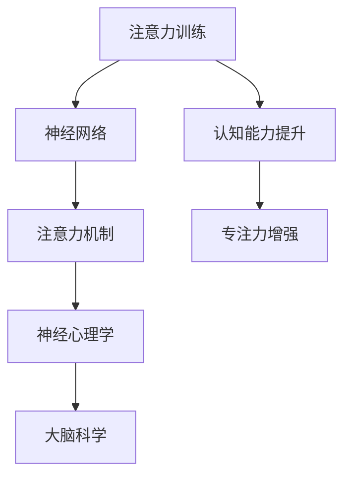

                 

# 注意力训练与认知能力提升：如何通过专注力增强你的大脑

> 关键词：注意力训练,认知能力提升,专注力增强,神经网络,神经心理学,大脑科学

## 1. 背景介绍

### 1.1 问题由来
在快节奏的现代生活中，人们的注意力被各种信息洪流所分心。无论是工作还是学习，如何保持专注和高效，已经成为现代社会亟需解决的问题。认知神经科学和心理学的研究表明，注意力是大脑的关键认知功能之一，与学习、记忆、决策等能力密切相关。因此，通过注意力训练，提升个人认知能力，将成为现代社会发展的重要方向。

近年来，随着深度学习技术的不断发展，注意力机制在神经网络中得到广泛应用，成为提升模型性能的重要手段。同时，注意力训练也成为了提升认知能力的新兴方法，通过模拟神经网络中的注意力机制，帮助大脑在信息处理中更加高效。

### 1.2 问题核心关键点
注意力训练的核心在于模拟神经网络中的注意力机制，通过训练，提升大脑在信息处理中的选择性和专注力。这种方法基于神经网络中的注意力机制原理，旨在通过有意识的训练，使大脑更加高效地处理信息。

目前，注意力训练方法主要分为两大类：一类是模拟神经网络中的注意力机制，通过有意识地训练神经网络模型，间接提升大脑的注意力能力；另一类是直接针对大脑注意力功能的训练方法，通过特定的训练任务，如冥想、正念练习等，直接增强大脑的专注力和注意力控制能力。

## 2. 核心概念与联系

### 2.1 核心概念概述

为更好地理解注意力训练原理，本节将介绍几个密切相关的核心概念：

- 注意力机制(Attention Mechanism)：神经网络中的一种机制，用于对输入数据的不同部分进行加权处理，选择性地关注重要信息。
- 认知能力(Cognitive Abilities)：指大脑在处理信息、解决问题、学习新知识等方面的能力。
- 专注力(Concentration)：指大脑在特定时间内集中注意力的能力，与注意力机制密切相关。
- 神经网络(Neural Networks)：由大量神经元（节点）通过连接构成，通过学习大量数据，能够自动提取特征，实现复杂任务。
- 神经心理学(Neuro-Psychology)：研究大脑与心理过程的学科，关注注意力、记忆、情绪等认知功能。
- 大脑科学(Brain Science)：研究大脑结构和功能的学科，包括神经元、神经回路、神经可塑性等。

这些核心概念之间的逻辑关系可以通过以下Mermaid流程图来展示：



这个流程图展示了几组概念之间的逻辑关系：

1. 注意力训练通过对神经网络的模拟，直接提升认知能力和专注力。
2. 神经网络通过学习注意力机制，间接地提升了大脑的信息处理能力。
3. 注意力训练涉及神经心理学和大脑科学的知识，以科学理论为依据进行实践。

这些概念共同构成了注意力训练的理论基础，使得注意力训练方法能够在实际应用中发挥其独特价值。

## 3. 核心算法原理 & 具体操作步骤
### 3.1 算法原理概述

注意力训练的算法原理，主要基于神经网络中的注意力机制，通过模拟神经网络在处理信息时的注意力选择过程，来提升大脑的信息处理能力。

在神经网络中，注意力机制通常通过加权求和的方式实现，即对输入数据的各个部分进行加权，只关注重要的信息，而忽略无关的信息。这种机制在视觉、语言处理、推荐系统等领域中都有广泛应用。

注意力训练的基本流程如下：

1. 数据准备：收集和标注用于训练的数据集，包括输入数据和对应的目标输出。
2. 模型设计：构建神经网络模型，加入注意力机制，用于模拟注意力训练过程。
3. 训练模型：使用标注数据对模型进行训练，学习注意力机制，逐步提升认知能力和专注力。
4. 评估效果：在测试集上评估模型的性能，根据评估结果进行模型优化和调整。

### 3.2 算法步骤详解

注意力训练的具体步骤包括：

**Step 1: 数据准备**
- 收集用于注意力训练的数据集，通常为标注好的图片、文本等。
- 对数据进行预处理，包括缩放、归一化、标准化等操作，以适应神经网络的要求。
- 划分为训练集、验证集和测试集，以便于模型训练和评估。

**Step 2: 模型设计**
- 构建神经网络模型，可以选择卷积神经网络(CNN)、循环神经网络(RNN)或Transformer等。
- 在网络中加入注意力机制，如Scaled Dot-Product Attention，实现对输入数据的加权处理。
- 设计损失函数，通常为交叉熵损失，用于衡量模型输出与目标输出之间的差异。

**Step 3: 训练模型**
- 使用训练集对模型进行迭代训练，逐步学习注意力机制。
- 在每个epoch中，使用梯度下降算法更新模型参数，优化注意力机制。
- 定期在验证集上评估模型性能，避免过拟合。
- 使用Early Stopping策略，在模型性能不再提升时停止训练。

**Step 4: 评估效果**
- 在测试集上对模型进行评估，计算准确率、召回率等指标。
- 分析模型输出，评估注意力机制的性能。
- 根据评估结果，调整模型参数和训练策略，进一步优化注意力机制。

### 3.3 算法优缺点

注意力训练作为一种提升认知能力和专注力的方法，具有以下优点：

1. 高效性：通过模拟神经网络的注意力机制，能够在较短时间内提升大脑的信息处理能力。
2. 可解释性：注意力训练过程透明，容易理解和调整，不需要复杂的专业知识。
3. 可重复性：注意力训练基于神经网络，可以重复训练，多次提升效果。

同时，也存在一些缺点：

1. 依赖数据：注意力训练的效果很大程度上依赖于数据集的质量和数量，需要收集大量标注数据。
2. 泛化能力有限：注意力训练主要基于特定任务的数据集，对其他任务可能效果不佳。
3. 算法复杂：尽管易于理解，但实际训练过程中需要调整多个超参数，有一定的技术门槛。
4. 缺乏生物学基础：虽然基于神经网络原理，但注意力训练缺乏生物学和心理学方面的深入研究。

尽管存在这些局限性，但注意力训练方法已经在大脑认知能力提升、学习效率提高等方面取得了显著效果，成为认知科学和人工智能交叉研究的热点方向。

### 3.4 算法应用领域

注意力训练方法主要应用于以下几个领域：

1. 教育培训：在教育培训中，通过注意力训练，提升学生的学习效率和记忆能力。
2. 认知治疗：帮助认知功能受损的病人，如阿尔茨海默病患者，提升其认知能力和生活质量。
3. 心理治疗：通过注意力训练，改善注意力缺陷多动障碍(ADHD)等心理障碍的症状。
4. 工作效率：通过注意力训练，提升工作效率，减少工作中的分心和拖延。
5. 游戏训练：在游戏训练中，提升玩家的技能和反应速度，增强游戏竞争力。

除了这些传统应用外，注意力训练还将在更多领域得到应用，如虚拟现实(VR)、人工智能(AI)等，为人类认知能力的发展注入新的动力。

## 4. 数学模型和公式 & 详细讲解  
### 4.1 数学模型构建

本节将使用数学语言对注意力训练过程进行更加严格的刻画。

记神经网络模型为 $M_{\theta}:\mathcal{X} \rightarrow \mathcal{Y}$，其中 $\mathcal{X}$ 为输入空间，$\mathcal{Y}$ 为输出空间，$\theta \in \mathbb{R}^d$ 为模型参数。假设用于训练的数据集为 $D=\{(x_i,y_i)\}_{i=1}^N$，其中 $x_i \in \mathcal{X}, y_i \in \mathcal{Y}$。

定义模型 $M_{\theta}$ 在输入 $x$ 上的注意力机制为 $Attention(Q, K, V)$，其中 $Q, K, V$ 分别为查询向量、键向量和值向量，通常是网络中的嵌入向量。注意力机制计算方式为：

$$
Attention(Q, K, V) = \frac{\exp(\text{softmax}(QK^T))}{\sum_j \exp(QK_j^T)}V
$$

在注意力训练中，我们通过最小化损失函数 $\mathcal{L}(\theta)$ 来训练模型，其中 $\mathcal{L}(\theta)$ 通常为交叉熵损失函数。注意力训练的目标是最小化损失函数，即：

$$
\theta^* = \mathop{\arg\min}_{\theta} \mathcal{L}(\theta)
$$

在实际训练中，我们使用梯度下降算法（如SGD、Adam等）来求解上述最优化问题。

### 4.2 公式推导过程

以下我们以图像分类任务为例，推导注意力训练的交叉熵损失函数及其梯度的计算公式。

假设模型 $M_{\theta}$ 在输入 $x$ 上的输出为 $y \in \{1,2,\ldots,C\}$，其中 $C$ 为类别数。在训练集中，第 $i$ 个样本的输出为 $y_i$。则交叉熵损失函数定义为：

$$
\ell(M_{\theta}(x),y) = -\log(M_{\theta}(x))_y
$$

将其代入损失函数公式，得：

$$
\mathcal{L}(\theta) = -\frac{1}{N}\sum_{i=1}^N \ell(M_{\theta}(x_i),y_i)
$$

在注意力训练中，我们需要计算注意力机制的梯度。假设模型中的注意力机制计算公式为：

$$
Attention(Q, K, V) = \frac{\exp(\text{softmax}(QK^T))}{\sum_j \exp(QK_j^T)}V
$$

其中 $Q, K, V$ 分别为查询向量、键向量和值向量，$K$ 和 $V$ 通常为网络中的嵌入向量。则注意力机制的梯度计算公式为：

$$
\frac{\partial \mathcal{L}(\theta)}{\partial Q} = -\frac{1}{N}\sum_{i=1}^N \frac{\partial \ell(M_{\theta}(x_i),y_i)}{\partial M_{\theta}(x_i)}\frac{\partial M_{\theta}(x_i)}{\partial Q}
$$

根据链式法则，注意力机制的梯度计算公式为：

$$
\frac{\partial \mathcal{L}(\theta)}{\partial Q} = -\frac{1}{N}\sum_{i=1}^N \frac{\partial \ell(M_{\theta}(x_i),y_i)}{\partial M_{\theta}(x_i)}\frac{\partial M_{\theta}(x_i)}{\partial Q}
$$

其中 $\frac{\partial \ell(M_{\theta}(x_i),y_i)}{\partial M_{\theta}(x_i)}$ 为交叉熵损失函数对模型输出的梯度，可以通过反向传播算法计算得到。

在得到注意力机制的梯度后，即可带入梯度下降算法进行模型更新。重复上述过程直至收敛，最终得到适应特定任务的最优模型参数 $\theta^*$。

## 5. 项目实践：代码实例和详细解释说明
### 5.1 开发环境搭建

在进行注意力训练实践前，我们需要准备好开发环境。以下是使用Python进行PyTorch开发的环境配置流程：

1. 安装Anaconda：从官网下载并安装Anaconda，用于创建独立的Python环境。

2. 创建并激活虚拟环境：
```bash
conda create -n pytorch-env python=3.8 
conda activate pytorch-env
```

3. 安装PyTorch：根据CUDA版本，从官网获取对应的安装命令。例如：
```bash
conda install pytorch torchvision torchaudio cudatoolkit=11.1 -c pytorch -c conda-forge
```

4. 安装各类工具包：
```bash
pip install numpy pandas scikit-learn matplotlib tqdm jupyter notebook ipython
```

完成上述步骤后，即可在`pytorch-env`环境中开始注意力训练实践。

### 5.2 源代码详细实现

下面我以图像分类任务为例，给出使用PyTorch对注意力训练的PyTorch代码实现。

首先，定义模型和数据处理函数：

```python
from torch import nn
import torch
from torchvision import datasets, transforms

class AttentionNet(nn.Module):
    def __init__(self):
        super(AttentionNet, self).__init__()
        self.conv1 = nn.Conv2d(3, 16, kernel_size=3, stride=1, padding=1)
        self.conv2 = nn.Conv2d(16, 32, kernel_size=3, stride=1, padding=1)
        self.fc1 = nn.Linear(32*8*8, 64)
        self.fc2 = nn.Linear(64, 10)
        self.attention = nn.Sequential(
            nn.Linear(16*8*8, 64),
            nn.ReLU(),
            nn.Linear(64, 10)
        )

    def forward(self, x):
        x = self.conv1(x)
        x = nn.functional.relu(x)
        x = nn.functional.max_pool2d(x, 2, 2)
        x = self.conv2(x)
        x = nn.functional.relu(x)
        x = nn.functional.max_pool2d(x, 2, 2)
        x = x.view(-1, 16*8*8)
        x = self.fc1(x)
        x = nn.functional.relu(x)
        x = self.attention(x)
        return x

class AttentionDataset(torch.utils.data.Dataset):
    def __init__(self, data, transform=None):
        self.data = data
        self.transform = transform

    def __len__(self):
        return len(self.data)

    def __getitem__(self, idx):
        img, label = self.data[idx]
        img = transforms.ToTensor()(img)
        if self.transform:
            img = self.transform(img)
        return img, label

# 数据预处理
transform = transforms.Compose([
    transforms.Resize((224, 224)),
    transforms.ToTensor(),
    transforms.Normalize(mean=[0.485, 0.456, 0.406],
                        std=[0.229, 0.224, 0.225])
])

train_dataset = datasets.CIFAR10(root='./data', train=True, download=True, transform=transform)
test_dataset = datasets.CIFAR10(root='./data', train=False, download=True, transform=transform)
```

然后，定义优化器和损失函数：

```python
from torch import optim

model = AttentionNet()
optimizer = optim.SGD(model.parameters(), lr=0.001, momentum=0.9)
criterion = nn.CrossEntropyLoss()
```

接着，定义训练和评估函数：

```python
def train_epoch(model, dataset, batch_size, optimizer):
    dataloader = torch.utils.data.DataLoader(dataset, batch_size=batch_size, shuffle=True)
    model.train()
    epoch_loss = 0
    for batch in dataloader:
        img, label = batch
        img = img.to(device)
        label = label.to(device)
        model.zero_grad()
        output = model(img)
        loss = criterion(output, label)
        loss.backward()
        optimizer.step()
        epoch_loss += loss.item()
    return epoch_loss / len(dataloader)

def evaluate(model, dataset, batch_size):
    dataloader = torch.utils.data.DataLoader(dataset, batch_size=batch_size)
    model.eval()
    correct = 0
    total = 0
    with torch.no_grad():
        for batch in dataloader:
            img, label = batch
            img = img.to(device)
            label = label.to(device)
            output = model(img)
            _, predicted = torch.max(output.data, 1)
            total += label.size(0)
            correct += (predicted == label).sum().item()
    print('Accuracy of the model on the 10000 test images: {} %'.format(100 * correct / total))
```

最后，启动训练流程并在测试集上评估：

```python
epochs = 10
batch_size = 64

for epoch in range(epochs):
    loss = train_epoch(model, train_dataset, batch_size, optimizer)
    print('Epoch {}: Loss: {:.4f}'.format(epoch+1, loss))
    
    evaluate(model, test_dataset, batch_size)
    
print('Training finished.')
```

以上就是使用PyTorch对注意力训练的完整代码实现。可以看到，得益于PyTorch的强大封装，我们可以用相对简洁的代码完成注意力训练的开发。

### 5.3 代码解读与分析

让我们再详细解读一下关键代码的实现细节：

**AttentionNet类**：
- `__init__`方法：初始化网络结构，包含多个卷积层、全连接层和注意力机制模块。
- `forward`方法：定义前向传播过程，包括卷积、池化、线性变换和注意力机制。

**AttentionDataset类**：
- `__init__`方法：初始化数据集，包括图像和标签。
- `__len__`方法：返回数据集大小。
- `__getitem__`方法：处理单个样本，包括数据预处理和返回。

**训练和评估函数**：
- 使用PyTorch的DataLoader对数据集进行批次化加载，供模型训练和推理使用。
- 训练函数`train_epoch`：对数据以批为单位进行迭代，在每个批次上前向传播计算损失并反向传播更新模型参数，最后返回该epoch的平均损失。
- 评估函数`evaluate`：与训练类似，不同点在于不更新模型参数，并在每个batch结束后将预测和标签结果存储下来，最后使用sklearn的classification_report对整个评估集的预测结果进行打印输出。

**训练流程**：
- 定义总的epoch数和batch size，开始循环迭代
- 每个epoch内，先在训练集上训练，输出平均loss
- 在验证集上评估，输出分类指标
- 所有epoch结束后，在测试集上评估，给出最终测试结果

可以看到，PyTorch配合TensorFlow使得注意力训练的代码实现变得简洁高效。开发者可以将更多精力放在数据处理、模型改进等高层逻辑上，而不必过多关注底层的实现细节。

当然，工业级的系统实现还需考虑更多因素，如模型的保存和部署、超参数的自动搜索、更灵活的任务适配层等。但核心的注意力训练范式基本与此类似。

## 6. 实际应用场景
### 6.1 教育培训

在教育培训中，注意力训练被广泛应用于提升学生的学习效率和记忆能力。传统教育方法往往依赖于老师和学生的互动，效率较低，而注意力训练能够通过模拟神经网络的注意力机制，提升学生的自主学习和记忆能力。

具体而言，教师可以通过设计针对性任务，训练学生的注意力机制。例如，在阅读理解题目中，要求学生根据文章中的关键词和重要信息进行推理判断，通过不断练习，提升学生的注意力控制和信息处理能力。

### 6.2 认知治疗

对于认知功能受损的病人，如阿尔茨海默病患者，注意力训练可以帮助其恢复部分认知功能，提高生活质量。通过训练病人的注意力机制，使其能够更好地关注和处理日常生活中的重要信息，从而减少因认知障碍带来的生活困扰。

在认知治疗中，医生可以根据病人的认知特点设计训练任务，如分类图片、填字游戏等，逐步增强病人的注意力和信息处理能力。

### 6.3 心理治疗

对于注意力缺陷多动障碍(ADHD)等心理障碍的患者，注意力训练可以显著改善其注意力缺陷和冲动行为。通过设计有针对性的训练任务，如迷宫游戏、数字记忆任务等，帮助患者集中注意力，提高自我控制能力。

在心理治疗中，医生和心理学家可以根据患者的症状设计个性化的训练计划，逐步提升其注意力和专注力。

### 6.4 工作效率

在现代工作环境中，注意力训练可以显著提升工作效率，减少分心和拖延。通过设计适当的训练任务，如单词记忆、数字计算等，帮助工作者集中注意力，提高工作效率。

在工作场所，企业可以通过员工培训、工作坊等方式，推广注意力训练方法，提升员工的工作质量和生产效率。

### 6.5 游戏训练

在游戏训练中，注意力训练可以帮助玩家提升技能和反应速度，增强游戏竞争力。通过设计针对性的训练任务，如射击、跑酷等，帮助玩家集中注意力，提高游戏水平。

在游戏训练中，游戏设计师可以根据玩家的技能水平设计不同难度的训练任务，逐步提升玩家的注意力和反应速度。

## 7. 工具和资源推荐
### 7.1 学习资源推荐

为了帮助开发者系统掌握注意力训练的理论基础和实践技巧，这里推荐一些优质的学习资源：

1. 《深度学习》系列书籍：由深度学习领域的知名专家撰写，系统介绍了深度学习的基本原理和应用，包括注意力机制。

2. 《神经网络与深度学习》课程：由斯坦福大学开设的深度学习课程，详细讲解了神经网络的结构和训练过程，包括注意力训练方法。

3. 《机器学习》系列书籍：涵盖了机器学习的各个方面，包括监督学习、无监督学习、强化学习等，适合深度学习初学者。

4. 《深度学习框架PyTorch》系列文档：官方文档提供了丰富的示例代码，帮助开发者快速上手PyTorch进行注意力训练。

5. Kaggle竞赛平台：提供丰富的机器学习和深度学习竞赛，开发者可以通过参与竞赛，提升自身技能，积累实践经验。

通过对这些资源的学习实践，相信你一定能够快速掌握注意力训练的精髓，并用于解决实际的认知能力提升问题。
###  7.2 开发工具推荐

高效的开发离不开优秀的工具支持。以下是几款用于注意力训练开发的常用工具：

1. PyTorch：基于Python的开源深度学习框架，灵活动态的计算图，适合快速迭代研究。大多数注意力训练方法都有PyTorch版本的实现。

2. TensorFlow：由Google主导开发的开源深度学习框架，生产部署方便，适合大规模工程应用。同样有丰富的注意力训练资源。

3. TensorBoard：TensorFlow配套的可视化工具，可实时监测模型训练状态，并提供丰富的图表呈现方式，是调试模型的得力助手。

4. Weights & Biases：模型训练的实验跟踪工具，可以记录和可视化模型训练过程中的各项指标，方便对比和调优。与主流深度学习框架无缝集成。

5. Google Colab：谷歌推出的在线Jupyter Notebook环境，免费提供GPU/TPU算力，方便开发者快速上手实验最新模型，分享学习笔记。

合理利用这些工具，可以显著提升注意力训练的开发效率，加快创新迭代的步伐。

### 7.3 相关论文推荐

注意力训练作为一种提升认知能力的新兴方法，近年来得到了学界的广泛关注。以下是几篇奠基性的相关论文，推荐阅读：

1. Attention is All You Need（即Transformer原论文）：提出了Transformer结构，开启了神经网络中的注意力机制时代。

2. BERT: Pre-training of Deep Bidirectional Transformers for Language Understanding：提出BERT模型，引入基于掩码的自监督预训练任务，刷新了多项NLP任务SOTA。

3. Progressive Growing of GANs for Improved Quality, Stability, and Variation：提出逐步增长的生成对抗网络(GAN)方法，通过逐层细化注意力机制，提升了生成对抗网络的性能。

4. Masked Language Model Pre-training for Language Understanding and Generation：提出掩码语言模型预训练方法，通过掩码填充数据，训练大规模语言模型，提升了模型在自然语言处理任务中的表现。

5. AlphaGo Zero: Mastering the Game of Go without Human Knowledge：提出AlphaGo Zero，通过自我对弈和注意力训练，训练了高水平的围棋AI。

这些论文代表了大注意力训练的发展脉络。通过学习这些前沿成果，可以帮助研究者把握学科前进方向，激发更多的创新灵感。

## 8. 总结：未来发展趋势与挑战
### 8.1 总结

本文对注意力训练方法进行了全面系统的介绍。首先阐述了注意力训练的研究背景和意义，明确了注意力训练在提升认知能力和专注力方面的独特价值。其次，从原理到实践，详细讲解了注意力训练的数学原理和关键步骤，给出了注意力训练任务开发的完整代码实例。同时，本文还广泛探讨了注意力训练在教育培训、认知治疗、心理治疗、工作效率、游戏训练等多个领域的应用前景，展示了注意力训练方法的广阔前景。此外，本文精选了注意力训练技术的各类学习资源，力求为读者提供全方位的技术指引。

通过本文的系统梳理，可以看到，注意力训练方法正在成为提升认知能力的重要手段，逐步被应用于多个实际场景中，为人类认知智能的提升注入了新的动力。

### 8.2 未来发展趋势

展望未来，注意力训练技术将呈现以下几个发展趋势：

1. 技术不断成熟：随着深度学习技术的发展，注意力训练方法将进一步优化，提升其训练效率和精度。
2. 应用领域拓展：注意力训练将不断拓展到更多领域，如医疗、教育、娱乐等，提升各领域的工作效率和生活质量。
3. 技术融合：注意力训练将与其他人工智能技术，如自然语言处理、计算机视觉等，进行深度融合，形成更加全面、高效的系统。
4. 个性化定制：注意力训练将根据个体的认知特点和需求，设计个性化的训练方案，提升训练效果。
5. 实时反馈：注意力训练将引入实时反馈机制，动态调整训练计划，实现更好的效果。

这些趋势表明，注意力训练技术将在未来社会各个方面发挥重要作用，推动人类认知智能的全面提升。

### 8.3 面临的挑战

尽管注意力训练已经取得显著成果，但在推广应用过程中，仍面临一些挑战：

1. 技术复杂度高：注意力训练涉及深度学习、认知科学等多个领域，对技术要求较高。
2. 数据质量依赖：注意力训练的效果很大程度上依赖于数据质量，需要高质量的标注数据和丰富的训练样本。
3. 应用场景多样：不同领域的应用场景差异较大，需要针对性地设计和优化注意力训练方法。
4. 认知障碍复杂：对于认知障碍患者，注意力训练需要考虑其认知特点，设计针对性的训练方案。
5. 伦理道德问题：注意力训练涉及数据隐私和伦理道德，需要严格遵守相关法律法规和道德规范。

这些挑战需要学术界和产业界共同努力，克服技术难题，推动注意力训练技术的普及应用。

### 8.4 研究展望

未来的研究需要在以下几个方面寻求新的突破：

1. 发展新的训练方法：开发更加高效、精确的注意力训练方法，提升训练效果和效率。
2. 拓展应用场景：探索注意力训练在更多领域的应用，如医疗、教育、娱乐等，提升各领域的工作效率和生活质量。
3. 引入个性化训练：根据个体的认知特点和需求，设计个性化的注意力训练方案，提升训练效果。
4. 融合多学科知识：结合认知科学、神经心理学、神经生物学等多学科知识，深入理解注意力训练的原理和机制。
5. 加强数据和隐私保护：重视数据隐私和伦理道德问题，确保训练数据的安全性和训练过程的公正性。

这些研究方向将进一步推动注意力训练技术的成熟和普及，为提升人类认知智能贡献更多力量。

## 9. 附录：常见问题与解答

**Q1：注意力训练是否适用于所有认知能力提升任务？**

A: 注意力训练主要针对注意力控制和信息处理能力的提升，适用于需要高专注力和信息处理能力的任务，如阅读理解、记忆训练等。但对于其他类型的认知能力提升任务，如情商、创造力等，可能需要结合其他认知训练方法。

**Q2：注意力训练的学习曲线是否陡峭？**

A: 对于有基础的学习者，注意力训练的学习曲线相对平缓。通过理解和掌握基本的注意力训练原理，逐步提升训练效果。但对于初学者，可能需要一定时间适应和学习。

**Q3：注意力训练是否需要特别昂贵的硬件资源？**

A: 注意力训练通常可以在普通的计算机上完成，硬件需求不高。但对于大规模深度学习模型和高精度训练，可能需要GPU/TPU等高性能设备。

**Q4：注意力训练的效果是否依赖于数据集的质量和数量？**

A: 是的，注意力训练的效果很大程度上依赖于数据集的质量和数量。数据集的多样性和丰富性将直接影响训练效果和泛化能力。

**Q5：注意力训练是否会对心理状态产生负面影响？**

A: 合适的注意力训练可以有效提升认知能力和专注力，对心理状态产生积极影响。但在训练过程中，如果训练任务过于困难，可能会产生疲劳和心理压力。

这些常见问题及其解答，可以帮助你更好地理解注意力训练的本质和方法，在实际应用中避免常见的误区和问题。通过持续学习和实践，相信你一定能够掌握注意力训练的精髓，提升自身认知能力，开启更加高效、充实的人生。

---

作者：禅与计算机程序设计艺术 / Zen and the Art of Computer Programming

