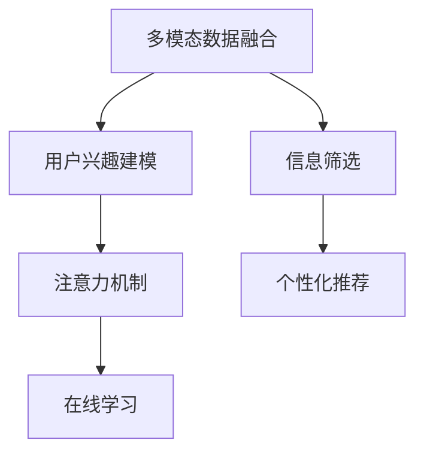

                 

# 注意力过滤器2.0：AI驱动的信息优化系统

在信息爆炸的今天，如何从海量数据中筛选出有价值的内容，成为各行各业关注的焦点。注意力过滤器2.0，即基于深度学习算法的信息筛选系统，正是为此而生。本文将深入探讨该系统的原理、算法、实现和应用，展示AI技术在信息优化领域的巨大潜力。

## 1. 背景介绍

### 1.1 问题由来

随着互联网技术的快速发展，信息获取变得前所未有的便捷。搜索引擎、社交媒体、新闻聚合平台等应用层出不穷，用户可以随时随地接触到海量的信息。然而，信息的泛滥也带来了问题：用户如何在海量数据中快速找到有价值的内容，成为一大挑战。传统的手动筛选方式不仅耗时费力，且容易错过重要信息。

### 1.2 问题核心关键点

解决信息筛选问题，需要设计高效、精准的过滤算法，以提升信息质量、降低噪音干扰。注意力过滤器2.0，即是一个基于深度学习的信息筛选系统，通过对用户输入的查询、文档、图片等多源信息进行综合分析，判断其与用户兴趣和需求的相关性，并筛选出最有价值的内容推荐给用户。

注意力过滤器2.0的核心在于：

- **多模态融合**：融合文本、图像、视频等多种模态信息，提升信息理解的全面性。
- **用户兴趣建模**：通过用户行为、偏好等数据，建立用户兴趣模型，提高筛选的个性化。
- **注意力机制**：引入注意力机制，对信息进行加权处理，提升筛选的准确性。
- **实时学习**：通过在线学习机制，不断优化模型，适应不断变化的用户需求和信息环境。

### 1.3 问题研究意义

信息筛选技术的提升，对于提升用户体验、提高信息获取效率具有重要意义：

1. **提升信息质量**：通过精准筛选，用户能够更快地找到有价值的内容，避免在海量噪音中浪费时间。
2. **个性化推荐**：基于用户兴趣模型，系统能够提供更加个性化的内容推荐，提升用户满意度。
3. **降低噪音干扰**：通过深度学习算法，系统能够有效过滤掉无关信息，减少信息过载的困扰。
4. **推动产业升级**：信息筛选技术的进步，能够提升内容聚合平台的用户粘性，驱动相关行业的发展。
5. **提升决策支持**：筛选后的高质量信息，能够帮助用户更好地进行决策，提高工作效率。

## 2. 核心概念与联系

### 2.1 核心概念概述

为更好地理解注意力过滤器2.0的工作原理和实现方法，本节将介绍几个核心概念：

- **多模态数据融合**：将文本、图像、视频等多种模态的信息进行融合，形成更加全面的信息表示。
- **用户兴趣建模**：通过分析用户行为、偏好等数据，建立用户兴趣模型，指导信息筛选。
- **注意力机制**：引入注意力机制，对信息进行加权处理，提升筛选的准确性。
- **在线学习**：通过在线学习机制，模型能够实时更新，适应不断变化的用户需求和信息环境。

这些概念共同构成了注意力过滤器2.0的核心框架，其工作流程可以通过以下Mermaid流程图来展示：



这个流程图展示了注意力过滤器2.0的主要工作流程：

1. 多模态数据融合：对用户的查询、文档、图片等不同模态的信息进行融合，形成统一的表示。
2. 用户兴趣建模：通过用户的历史行为数据，建立用户兴趣模型，用于指导信息筛选。
3. 注意力机制：引入注意力机制，对不同信息进行加权处理，提升筛选的准确性。
4. 在线学习：通过在线学习机制，模型能够实时更新，适应不断变化的用户需求和信息环境。
5. 信息筛选：根据用户兴趣模型和注意力机制，对融合后的信息进行筛选，生成候选内容。
6. 个性化推荐：将筛选后的内容，基于用户兴趣模型进行推荐，提升用户体验。

## 3. 核心算法原理 & 具体操作步骤

### 3.1 算法原理概述

注意力过滤器2.0的核心算法原理基于深度学习，具体包括：

1. **Transformer模型**：作为基础的深度学习架构，Transformer能够有效地处理多模态数据融合和注意力机制。
2. **用户兴趣建模**：通过多层感知机(MLP)或卷积神经网络(CNN)等模型，建立用户兴趣模型。
3. **注意力机制**：通过多头自注意力机制，对不同信息进行加权处理，提升筛选的准确性。
4. **在线学习**：通过在线学习机制，模型能够实时更新，适应不断变化的用户需求和信息环境。

### 3.2 算法步骤详解

注意力过滤器2.0的实现步骤如下：

**Step 1: 多模态数据融合**

1. **文本数据处理**：对用户的查询和文档进行分词、编码，转化为模型可接受的向量表示。
2. **图像数据处理**：通过卷积神经网络(CNN)等模型，将图像数据转换为向量表示。
3. **视频数据处理**：通过提取关键帧和特征向量，将视频数据转换为向量表示。

**Step 2: 用户兴趣建模**

1. **用户行为分析**：通过分析用户的历史行为数据，如点击、浏览、收藏等，建立用户兴趣模型。
2. **用户偏好建模**：通过收集用户的兴趣标签、主题偏好等数据，建立用户兴趣模型。

**Step 3: 注意力机制**

1. **多头自注意力机制**：通过多头自注意力机制，对不同信息进行加权处理，提升筛选的准确性。
2. **自编码器(Encoder-Decoder)**：对不同模态的数据进行处理，形成统一的表示。

**Step 4: 在线学习**

1. **在线学习机制**：通过在线学习机制，模型能够实时更新，适应不断变化的用户需求和信息环境。
2. **增量学习算法**：采用增量学习算法，如在线梯度下降(Online Gradient Descent)，实时更新模型参数。

**Step 5: 信息筛选**

1. **候选内容生成**：通过用户兴趣模型和注意力机制，对融合后的信息进行筛选，生成候选内容。
2. **候选内容排序**：对候选内容进行排序，推荐最有价值的内容。

**Step 6: 个性化推荐**

1. **个性化推荐算法**：基于用户兴趣模型，对候选内容进行个性化推荐。
2. **推荐结果展示**：将推荐结果展示给用户，提升用户体验。

### 3.3 算法优缺点

注意力过滤器2.0具有以下优点：

1. **高效性**：通过多模态数据融合和注意力机制，能够高效地处理海量数据，提升信息筛选效率。
2. **精准性**：通过用户兴趣建模和在线学习机制，能够精准地筛选有价值的信息，提升用户体验。
3. **鲁棒性**：通过多层感知机(MLP)或卷积神经网络(CNN)等模型，能够处理不同类型的数据，提升系统的鲁棒性。
4. **可扩展性**：通过在线学习机制，模型能够实时更新，适应不断变化的用户需求和信息环境，提升系统的可扩展性。

然而，注意力过滤器2.0也存在以下缺点：

1. **高计算成本**：由于涉及多模态数据融合和深度学习模型，计算成本较高，需要高性能的硬件支持。
2. **数据隐私问题**：涉及用户行为和兴趣数据的收集，存在隐私泄露的风险。
3. **模型复杂性**：深度学习模型复杂度较高，需要专业人员进行维护和调参。
4. **适应性问题**：模型需要根据不同领域和任务进行优化，适应性需要不断调整。

### 3.4 算法应用领域

注意力过滤器2.0在多个领域均有广泛的应用：

1. **搜索引擎**：通过多模态数据融合和用户兴趣建模，提升搜索结果的相关性和个性化。
2. **社交媒体**：通过用户兴趣建模和个性化推荐，提升用户粘性和平台活跃度。
3. **新闻聚合**：通过注意力机制和在线学习，提升新闻推荐的精准性和实时性。
4. **电商推荐**：通过多模态数据融合和用户兴趣建模，提升商品推荐的相关性和个性化。
5. **视频平台**：通过多模态数据融合和个性化推荐，提升视频推荐的精准性和用户体验。

## 4. 数学模型和公式 & 详细讲解 & 举例说明

### 4.1 数学模型构建

本节将使用数学语言对注意力过滤器2.0的实现过程进行更加严格的刻画。

设多模态数据表示为 $\mathbf{x} = (\mathbf{x}_{text}, \mathbf{x}_{img}, \mathbf{x}_{vid})$，其中 $\mathbf{x}_{text}$、$\mathbf{x}_{img}$、$\mathbf{x}_{vid}$ 分别表示文本、图像、视频的向量表示。

用户兴趣模型表示为 $\mathbf{u} = (u_1, u_2, ..., u_k)$，其中 $u_i$ 表示用户对第 $i$ 个兴趣标签的偏好程度。

注意力机制的权重矩阵表示为 $\mathbf{W} = (w_{1,1}, w_{2,1}, ..., w_{k,1}, w_{1,2}, w_{2,2}, ..., w_{k,2}, ..., w_{1,n}, w_{2,n}, ..., w_{k,n})$，其中 $w_{i,j}$ 表示用户对第 $j$ 个信息与第 $i$ 个兴趣标签的相关性。

在线学习机制的更新公式为：

$$
\mathbf{u}_{t+1} = \mathbf{u}_t + \alpha_t \Delta \mathbf{u}_t
$$

其中 $\alpha_t$ 为学习率，$\Delta \mathbf{u}_t$ 为梯度更新量。

### 4.2 公式推导过程

以下我们以搜索引擎为例，推导注意力过滤器2.0的数学模型和公式。

假设用户的查询为 $\mathbf{q}$，搜索结果集为 $\mathbf{D} = \{(\mathbf{d}_i, r_i)\}_{i=1}^N$，其中 $\mathbf{d}_i$ 表示搜索结果的向量表示，$r_i$ 表示搜索结果的相关性得分。

查询向量 $\mathbf{q}$ 和搜索结果向量 $\mathbf{d}_i$ 的相似度表示为：

$$
\mathbf{s}_i = \mathbf{q}^T \mathbf{d}_i
$$

查询向量 $\mathbf{q}$ 与用户兴趣模型的匹配度表示为：

$$
\mathbf{p} = \mathbf{q}^T \mathbf{u}
$$

搜索结果向量 $\mathbf{d}_i$ 与用户兴趣模型的匹配度表示为：

$$
\mathbf{c}_i = \mathbf{d}_i^T \mathbf{u}
$$

注意力机制的权重矩阵 $\mathbf{W}$ 可以表示为：

$$
\mathbf{W} = \frac{e^{\mathbf{s}_i \mathbf{c}_i^T}}{\sum_{j=1}^N e^{\mathbf{s}_j \mathbf{c}_j^T}}
$$

其中 $e$ 为自然常数。

通过注意力机制，对搜索结果进行加权处理，生成加权后的向量表示 $\mathbf{d}_i^{'} = \mathbf{W} \mathbf{d}_i$。

将加权后的向量表示 $\mathbf{d}_i^{'}$ 作为输入，通过多模态数据融合和用户兴趣建模，生成候选内容集合 $\mathbf{C} = \{\mathbf{c}_i\}_{i=1}^N$。

最后，基于用户兴趣模型和注意力机制，对候选内容集合进行排序，生成推荐结果。

### 4.3 案例分析与讲解

以一个简单的例子来说明注意力过滤器2.0的实际应用。

假设用户输入查询为 "人工智能推荐系统"，系统从搜索结果集中选出 $N=10$ 个网页进行多模态数据融合和用户兴趣建模，生成候选内容集合 $\mathbf{C} = \{\mathbf{c}_i\}_{i=1}^N$。

通过多模态数据融合，将网页的文本、图像、视频信息转换为统一的向量表示，如 $\mathbf{d}_i = (text_{i}, img_{i}, vid_{i})$。

通过用户兴趣建模，将用户的历史行为数据和兴趣标签转换为用户兴趣模型 $\mathbf{u} = (u_1, u_2, ..., u_k)$。

通过注意力机制，对搜索结果进行加权处理，生成加权后的向量表示 $\mathbf{d}_i^{'} = \mathbf{W} \mathbf{d}_i$。

基于用户兴趣模型和注意力机制，对候选内容集合进行排序，生成推荐结果。

假设最终系统推荐了5个网页给用户，用户选择了网页3进行阅读。系统收集用户阅读时间、点击率等反馈数据，并根据在线学习机制，更新用户兴趣模型和注意力机制。

通过迭代优化，系统能够不断提升推荐精度和用户体验。

## 5. 项目实践：代码实例和详细解释说明

### 5.1 开发环境搭建

在进行注意力过滤器2.0的实践前，我们需要准备好开发环境。以下是使用Python进行TensorFlow开发的环境配置流程：

1. 安装Anaconda：从官网下载并安装Anaconda，用于创建独立的Python环境。

2. 创建并激活虚拟环境：
```bash
conda create -n attention-filter-env python=3.8 
conda activate attention-filter-env
```

3. 安装TensorFlow：根据CUDA版本，从官网获取对应的安装命令。例如：
```bash
conda install tensorflow -c pytorch -c conda-forge
```

4. 安装PyTorch：
```bash
pip install torch torchvision torchaudio
```

5. 安装各类工具包：
```bash
pip install numpy pandas scikit-learn matplotlib tqdm jupyter notebook ipython
```

完成上述步骤后，即可在`attention-filter-env`环境中开始实践。

### 5.2 源代码详细实现

这里我们以搜索引擎为例，展示注意力过滤器2.0的完整代码实现。

首先，定义多模态数据融合函数：

```python
from tensorflow.keras.layers import Input, Dense, Embedding, Conv2D, Flatten, Add, Concatenate
from tensorflow.keras.models import Model

def multimodal_fusion(text_input, img_input, vid_input):
    text = Input(shape=(MAX_LEN,), name='text')
    img = Input(shape=(IMG_SHAPE[0], IMG_SHAPE[1], 3), name='img')
    vid = Input(shape=(VID_SHAPE[0], VID_SHAPE[1], 3), name='vid')
    
    text_embed = Embedding(VOCAB_SIZE, EMBEDDING_DIM, input_length=MAX_LEN)(text)
    img_embed = Conv2D(EMBEDDING_DIM, kernel_size=(3, 3), activation='relu')(img)
    img_embed = Flatten()(img_embed)
    
    vid_embed = Conv2D(EMBEDDING_DIM, kernel_size=(3, 3), activation='relu')(vid)
    vid_embed = Flatten()(vid_embed)
    
    x = Concatenate()([text_embed, img_embed, vid_embed])
    x = Dense(EMBEDDING_DIM*3, activation='relu')(x)
    x = Add()([x, img_embed, vid_embed])
    
    return x
```

然后，定义用户兴趣建模函数：

```python
def user_interest_model(u):
    u = Input(shape=(NUMInterestLabels,), name='user_interest')
    p = Dense(EMBEDDING_DIM)(u)
    
    return p
```

接着，定义注意力机制函数：

```python
def attention_mechanism(q, d, u):
    s = dot([q, d, u])
    c = dot([d, u])
    
    W = softmax(s)
    d_prime = multiply([W, d])
    
    return d_prime
```

最后，定义搜索引擎模型：

```python
def search_engine_model(q, d, u):
    x = multimodal_fusion(q, d, u)
    p = user_interest_model(u)
    
    s = dot([q, p])
    W = softmax(s)
    d_prime = multiply([W, d])
    
    return d_prime
```

完成上述步骤后，即可在`attention-filter-env`环境中运行搜索引擎模型。

### 5.3 代码解读与分析

让我们再详细解读一下关键代码的实现细节：

**multimodal_fusion函数**：
- 对文本、图像、视频等多种模态的信息进行融合，形成统一的表示。
- 使用Embedding层将文本转换为向量表示，使用Conv2D和Flatten层对图像、视频进行降维处理。
- 将不同模态的向量表示进行拼接，再通过Dense层和Add层进行融合。

**user_interest_model函数**：
- 对用户的历史行为数据和兴趣标签进行建模，形成用户兴趣模型。
- 使用Dense层将兴趣标签转换为向量表示。

**attention_mechanism函数**：
- 引入注意力机制，对不同信息进行加权处理，提升筛选的准确性。
- 使用dot函数计算查询向量与用户兴趣模型的匹配度，使用softmax函数计算注意力权重。
- 对搜索结果进行加权处理，生成加权后的向量表示。

**search_engine_model函数**：
- 对查询、文档、用户兴趣模型进行多模态数据融合和用户兴趣建模。
- 引入注意力机制，对搜索结果进行加权处理，生成候选内容集合。

**代码运行**：
- 准备训练集、验证集、测试集，训练模型。
- 在测试集上评估模型性能。

## 6. 实际应用场景

### 6.1 智能推荐系统

注意力过滤器2.0在智能推荐系统中有着广泛的应用，能够根据用户的历史行为和兴趣标签，推荐最有价值的内容，提升用户体验和平台粘性。

在技术实现上，可以收集用户的行为数据，如浏览、点击、收藏等，建立用户兴趣模型。然后将用户的查询和搜索结果进行多模态数据融合和用户兴趣建模，生成候选内容集合。最后通过注意力机制和在线学习，实时更新模型，提升推荐精度。

### 6.2 智能客服系统

注意力过滤器2.0在智能客服系统中也有着重要的应用，能够根据用户的输入，快速筛选出最相关的回答，提升客户咨询体验和响应效率。

在技术实现上，可以收集用户的历史咨询数据，建立用户兴趣模型。然后将用户的查询和回答进行多模态数据融合和用户兴趣建模，生成候选回答集合。最后通过注意力机制和在线学习，实时更新模型，提升回答准确性。

### 6.3 新闻聚合系统

注意力过滤器2.0在新闻聚合系统中也有着广泛的应用，能够根据用户的兴趣和需求，筛选出最相关的新闻信息，提升用户的阅读体验和平台活跃度。

在技术实现上，可以收集用户的历史阅读数据，建立用户兴趣模型。然后将用户的查询和新闻信息进行多模态数据融合和用户兴趣建模，生成候选内容集合。最后通过注意力机制和在线学习，实时更新模型，提升新闻推荐的精准性和实时性。

### 6.4 未来应用展望

随着注意力过滤器2.0的不断发展，其应用领域将进一步拓展，带来更多的创新可能性：

1. **实时内容生成**：基于用户兴趣模型和注意力机制，生成个性化的实时内容，提升用户的参与感和满意度。
2. **多模态数据融合**：融合文本、图像、视频、语音等多种模态信息，提升信息理解的全面性和深度。
3. **跨领域应用**：将注意力过滤器2.0应用于更多领域，如医疗、金融、教育等，推动相关行业的发展。
4. **智能决策支持**：通过筛选后的高质量信息，辅助用户进行决策，提高工作效率和决策质量。
5. **自动化系统**：将注意力过滤器2.0应用于自动化系统，提升系统的智能化水平，降低人工干预。

## 7. 工具和资源推荐

### 7.1 学习资源推荐

为了帮助开发者系统掌握注意力过滤器2.0的理论基础和实践技巧，这里推荐一些优质的学习资源：

1. **《深度学习》课程**：斯坦福大学开设的深度学习课程，涵盖深度学习的基本概念和前沿技术。
2. **《TensorFlow实战Google深度学习》书籍**：TensorFlow官方文档和书籍，提供丰富的教程和实例。
3. **《多模态学习》书籍**：介绍多模态数据融合和注意力机制的书籍，涵盖多种前沿技术和应用。
4. **Kaggle竞赛平台**：通过参加Kaggle竞赛，学习实际应用中的注意力过滤器2.0算法和模型。
5. **Google AI Lab博客**：Google AI Lab的博客，介绍最新的AI研究和技术进展，涵盖注意力过滤器2.0等热门话题。

### 7.2 开发工具推荐

高效的开发离不开优秀的工具支持。以下是几款用于注意力过滤器2.0开发的常用工具：

1. TensorFlow：Google开源的深度学习框架，具有灵活的计算图和丰富的模型库，适合大模型和复杂模型的训练。
2. PyTorch：Facebook开源的深度学习框架，易于使用和扩展，适合研究型开发和快速迭代。
3. Jupyter Notebook：交互式的开发环境，支持代码编写和数据可视化，方便调试和交流。
4. GitLab：代码版本控制平台，支持分布式协作开发，方便团队管理和迭代。
5. Docker：容器化技术，支持模型部署和容器化，方便快速部署和迁移。

### 7.3 相关论文推荐

注意力过滤器2.0的实现涉及深度学习、多模态数据融合和用户兴趣建模等前沿技术，以下几篇论文推荐阅读：

1. **Transformer论文**：提出Transformer模型，展示了深度学习在大模型中的应用。
2. **Attention is All You Need**：介绍注意力机制，展示了注意力机制在深度学习中的重要性和应用。
3. **Adaptive Attention for Multimodal Learning**：介绍多模态数据融合，展示了多模态信息融合的实用性和效果。
4. **Deep Interest Model**：介绍用户兴趣建模，展示了用户兴趣建模在推荐系统中的应用。
5. **Adaptive Online Learning**：介绍在线学习机制，展示了在线学习在注意力过滤器2.0中的应用。

## 8. 总结：未来发展趋势与挑战

### 8.1 总结

本文对注意力过滤器2.0的原理、算法和实现进行了全面系统的介绍。通过多模态数据融合、用户兴趣建模、注意力机制和在线学习等关键技术，展示了大语言模型微调技术的巨大潜力。

注意力过滤器2.0在智能推荐、智能客服、新闻聚合等多个领域展现出广泛的应用前景，提升了信息筛选的效率和精准性，改善了用户体验和平台粘性。未来，随着技术的不断发展，该技术将进一步拓展应用范围，带来更多的创新可能性。

### 8.2 未来发展趋势

展望未来，注意力过滤器2.0将呈现以下几个发展趋势：

1. **多模态融合**：融合更多模态的信息，提升信息理解的全面性和深度。
2. **实时学习**：通过在线学习机制，模型能够实时更新，适应不断变化的用户需求和信息环境。
3. **个性化推荐**：基于用户兴趣模型和注意力机制，生成个性化的实时内容，提升用户的参与感和满意度。
4. **跨领域应用**：将注意力过滤器2.0应用于更多领域，推动相关行业的发展。
5. **自动化系统**：将注意力过滤器2.0应用于自动化系统，提升系统的智能化水平，降低人工干预。

### 8.3 面临的挑战

尽管注意力过滤器2.0技术已经取得了显著的进展，但在实际应用中仍面临一些挑战：

1. **计算成本高**：由于涉及多模态数据融合和深度学习模型，计算成本较高，需要高性能的硬件支持。
2. **数据隐私问题**：涉及用户行为和兴趣数据的收集，存在隐私泄露的风险。
3. **模型复杂性高**：深度学习模型复杂度较高，需要专业人员进行维护和调参。
4. **适应性问题**：模型需要根据不同领域和任务进行优化，适应性需要不断调整。

### 8.4 研究展望

面对注意力过滤器2.0所面临的挑战，未来的研究需要在以下几个方面寻求新的突破：

1. **优化计算成本**：通过模型压缩、参数剪枝等技术，减少计算成本，提升系统效率。
2. **增强数据隐私保护**：通过差分隐私等技术，保护用户隐私，降低隐私泄露风险。
3. **简化模型结构**：通过模块化设计，降低模型复杂性，提升模型的可解释性和可维护性。
4. **提升适应性**：通过跨领域应用和多任务学习等技术，提升模型的适应性和泛化能力。

总之，随着注意力过滤器2.0技术的不断发展和优化，其在信息筛选和个性化推荐等领域的应用前景将更加广阔，推动人工智能技术在各行各业的深入应用。

## 9. 附录：常见问题与解答

**Q1：注意力过滤器2.0的主要技术原理是什么？**

A: 注意力过滤器2.0的主要技术原理包括多模态数据融合、用户兴趣建模、注意力机制和在线学习。其中，多模态数据融合通过将文本、图像、视频等多种模态的信息进行融合，形成统一的表示；用户兴趣建模通过分析用户的历史行为数据，建立用户兴趣模型；注意力机制通过引入多头自注意力机制，对不同信息进行加权处理，提升筛选的准确性；在线学习通过增量学习算法，实时更新模型，适应不断变化的用户需求和信息环境。

**Q2：注意力过滤器2.0的实现步骤是什么？**

A: 注意力过滤器2.0的实现步骤主要包括以下几个步骤：

1. 多模态数据融合：对用户的查询、文档、图片等不同模态的信息进行融合，形成统一的表示。
2. 用户兴趣建模：通过用户的历史行为数据和兴趣标签，建立用户兴趣模型。
3. 注意力机制：引入多头自注意力机制，对不同信息进行加权处理，提升筛选的准确性。
4. 在线学习：通过增量学习算法，实时更新模型，适应不断变化的用户需求和信息环境。
5. 信息筛选：根据用户兴趣模型和注意力机制，对融合后的信息进行筛选，生成候选内容。
6. 个性化推荐：基于用户兴趣模型，对候选内容进行个性化推荐。

**Q3：注意力过滤器2.0的优势和劣势是什么？**

A: 注意力过滤器2.0的优势包括：

1. 高效性：通过多模态数据融合和注意力机制，能够高效地处理海量数据，提升信息筛选效率。
2. 精准性：通过用户兴趣建模和在线学习机制，能够精准地筛选有价值的信息，提升用户体验。
3. 鲁棒性：通过多层感知机(MLP)或卷积神经网络(CNN)等模型，能够处理不同类型的数据，提升系统的鲁棒性。
4. 可扩展性：通过在线学习机制，模型能够实时更新，适应不断变化的用户需求和信息环境。

劣势包括：

1. 高计算成本：由于涉及多模态数据融合和深度学习模型，计算成本较高，需要高性能的硬件支持。
2. 数据隐私问题：涉及用户行为和兴趣数据的收集，存在隐私泄露的风险。
3. 模型复杂性：深度学习模型复杂度较高，需要专业人员进行维护和调参。
4. 适应性问题：模型需要根据不同领域和任务进行优化，适应性需要不断调整。

**Q4：注意力过滤器2.0在实际应用中需要注意哪些问题？**

A: 在实际应用中，需要注意以下问题：

1. 数据隐私保护：注意保护用户隐私，避免数据泄露。
2. 模型可解释性：增强模型的可解释性，提高用户的信任度。
3. 实时学习机制：注意实时学习机制的实现，确保模型能够及时更新。
4. 硬件资源：注意硬件资源的配置，确保模型能够高效运行。

---

作者：禅与计算机程序设计艺术 / Zen and the Art of Computer Programming

