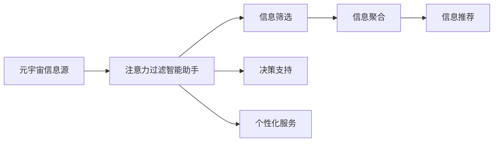

                 

# 注意力过滤智能助手:元宇宙信息处理的个人管家

## 1. 背景介绍

随着元宇宙时代的到来，人类信息处理方式正经历前所未有的变革。信息的爆炸性增长和多样性的增加，对个人、组织乃至社会的管理能力提出了新的挑战。在这个信息“洪流”中，如何高效过滤、筛选、聚合信息，成为迫切需要解决的问题。

注意力过滤智能助手（Attention Filter Assistant），旨在通过智能算法，对海量信息进行筛选和聚合，为个人或组织提供精准、高效的信息获取和决策支持。本文将详细介绍该助手的原理、实现方法及其在元宇宙信息处理中的应用。

## 2. 核心概念与联系

### 2.1 核心概念概述

- **注意力过滤智能助手**：一种基于注意力机制的智能系统，用于从元宇宙的复杂信息中筛选出重要内容，提供个性化信息推荐和决策支持。
- **注意力机制**：一种模拟人类注意力的计算方法，在神经网络中用于调整模型对不同输入特征的关注程度。
- **元宇宙**：一个虚拟的空间，融合了虚拟现实(VR)、增强现实(AR)、混合现实(MR)等多种技术，为用户提供沉浸式体验。
- **信息处理**：包括信息收集、存储、过滤、检索、分析和展现等过程，旨在帮助用户快速获取有用信息。
- **个人管家**：通过智能算法，提供个性化、自动化服务，帮助用户管理信息，提升效率。

### 2.2 核心概念原理和架构的 Mermaid 流程图



这个流程图展示了注意力过滤智能助手的主要功能模块：

1. **信息筛选**：从元宇宙的复杂信息中提取关键内容。
2. **信息聚合**：对筛选出的信息进行分类、聚合和组织。
3. **信息推荐**：基于用户偏好和行为，提供个性化的信息推荐。
4. **决策支持**：提供数据支持和分析，辅助用户决策。
5. **个性化服务**：根据用户需求，提供定制化的服务。

## 3. 核心算法原理 & 具体操作步骤

### 3.1 算法原理概述

注意力过滤智能助手基于注意力机制，通过模型学习用户的注意力分布，实现信息的筛选和聚合。该算法的核心思想是：

- **自适应调整注意力权重**：模型会根据用户的历史行为和偏好，动态调整对不同信息的关注程度。
- **全局与局部注意力平衡**：在全局和局部信息之间找到平衡点，既注重整体概览，又不忽视细节。
- **多模态融合**：融合文本、图像、视频等多种信息模态，提高信息处理的多样性和准确性。
- **上下文感知**：考虑信息之间的上下文关系，提高推荐的连贯性和相关性。

### 3.2 算法步骤详解

1. **数据收集与预处理**：
   - 从元宇宙平台收集信息数据，并进行清洗、去重和标准化。
   - 对文本信息进行分词、向量化处理，对图像和视频信息进行特征提取。

2. **模型训练**：
   - 构建基于注意力机制的神经网络模型，如Transformer。
   - 使用历史数据训练模型，学习用户的注意力分布。
   - 定期更新模型，以适应新的信息变化和用户需求。

3. **信息筛选与聚合**：
   - 根据用户兴趣，筛选出相关的信息。
   - 对筛选出的信息进行分类、归纳和聚合，生成结构化的信息摘要。

4. **信息推荐与决策支持**：
   - 基于用户的当前需求和历史行为，提供个性化的信息推荐。
   - 提供数据可视化、趋势分析等决策支持工具，帮助用户进行全面判断。

5. **个性化服务**：
   - 根据用户的行为和反馈，不断调整推荐策略和信息展示方式。
   - 提供定制化服务，如信息订阅、定时提醒等，提升用户体验。

### 3.3 算法优缺点

**优点**：
- **自适应性**：能够动态调整注意力权重，适应用户不断变化的需求。
- **泛化能力强**：基于全局和局部注意力的平衡，处理多样化的信息模态。
- **上下文感知**：考虑信息之间的上下文关系，提高推荐的连贯性。
- **高效性**：通过多模态融合和个性化服务，提高信息处理效率。

**缺点**：
- **数据依赖**：模型性能依赖于高质量、大规模的数据。
- **计算复杂**：处理多模态信息和大规模数据需要较高的计算资源。
- **隐私风险**：需要收集和分析用户的个人信息，存在隐私保护问题。
- **误判风险**：模型可能会误判用户的偏好，影响信息推荐的效果。

### 3.4 算法应用领域

注意力过滤智能助手可以在多个领域发挥作用：

- **社交媒体信息管理**：从海量的社交媒体内容中筛选出重要信息，提供个性化推荐。
- **企业信息管理**：帮助企业从海量数据中提取关键信息，辅助决策。
- **个人日常管理**：提供个性化信息推荐和生活建议，提升生活质量。
- **教育领域**：帮助学生从海量学习资源中筛选重要信息，提高学习效率。
- **金融领域**：提供个性化投资建议和市场分析，辅助投资决策。

## 4. 数学模型和公式 & 详细讲解

### 4.1 数学模型构建

注意力过滤智能助手的数学模型可以表示为：

$$
\text{Attention}(Query, Key, Value) = \text{Softmax}(\frac{Query \cdot Key^T}{\sqrt{d_k}}) \cdot Value
$$

其中：
- $Query$ 表示用户当前需求的查询向量。
- $Key$ 表示信息库中所有信息的键向量。
- $Value$ 表示信息库中所有信息的值向量。
- $\text{Softmax}$ 表示归一化函数，用于调整不同信息对用户的注意力权重。
- $d_k$ 表示键向量的维度。

### 4.2 公式推导过程

注意力机制的推导过程如下：

1. **计算注意力权重**：将查询向量 $Query$ 和键向量 $Key$ 进行点乘，得到注意力得分 $Score$。
2. **归一化处理**：对注意力得分 $Score$ 进行归一化处理，得到注意力权重 $\alpha$。
3. **计算加权值向量**：将注意力权重 $\alpha$ 与值向量 $Value$ 进行加权求和，得到最终的注意力输出。

### 4.3 案例分析与讲解

假设用户查询关于“元宇宙”的信息，系统可以自动从多个信息源中筛选出相关内容，如新闻、视频、博客等，并提供个性化推荐。具体步骤如下：

1. **数据预处理**：将元宇宙平台上的新闻、视频、博客等文本和多媒体数据进行清洗和标准化。
2. **特征提取**：对文本进行分词向量化，对视频和图片进行特征提取。
3. **模型训练**：使用历史数据训练注意力模型，学习用户对不同信息的注意力分布。
4. **信息筛选**：根据用户查询，筛选出相关的信息源。
5. **信息聚合**：将筛选出的信息进行归纳和分类，生成结构化的信息摘要。
6. **信息推荐**：基于用户历史行为和偏好，提供个性化的信息推荐。
7. **决策支持**：提供数据可视化工具，帮助用户进行趋势分析和决策。

## 5. 项目实践：代码实例和详细解释说明

### 5.1 开发环境搭建

本项目使用Python语言和TensorFlow框架进行开发。具体步骤如下：

1. **安装Python和TensorFlow**：确保系统中有Python 3.x环境，并安装TensorFlow 2.x版本。
2. **配置环境变量**：设置环境变量，使TensorFlow能够找到所需的依赖库。
3. **安装第三方库**：安装TensorFlow和Scikit-learn等第三方库。

### 5.2 源代码详细实现

```python
import tensorflow as tf
from tensorflow.keras import layers

class AttentionModel(tf.keras.Model):
    def __init__(self, num_heads, d_model):
        super(AttentionModel, self).__init__()
        self.num_heads = num_heads
        self.d_model = d_model
        self.query = layers.Dense(d_model)
        self.key = layers.Dense(d_model)
        self.value = layers.Dense(d_model)
        self.softmax = layers.Softmax()

    def call(self, query, key, value):
        d_k = self.d_model // self.num_heads
        query = self.query(query)
        key = self.key(key)
        value = self.value(value)
        
        query = tf.reshape(query, (query.shape[0], query.shape[1], self.num_heads, d_k))
        key = tf.reshape(key, (key.shape[0], key.shape[1], self.num_heads, d_k))
        value = tf.reshape(value, (value.shape[0], value.shape[1], self.num_heads, d_k))
        
        query = tf.transpose(query, perm=[0, 2, 1, 3])
        key = tf.transpose(key, perm=[0, 2, 1, 3])
        value = tf.transpose(value, perm=[0, 2, 1, 3])
        
        score = tf.matmul(query, key, transpose_b=True)
        score = tf.div(score, tf.sqrt(tf.cast(d_k, tf.float32)))
        attention_weight = self.softmax(score)
        attention_output = tf.matmul(attention_weight, value)
        
        attention_output = tf.transpose(attention_output, perm=[0, 2, 1, 3])
        attention_output = tf.reshape(attention_output, (query.shape[0], query.shape[1], self.d_model))
        
        return attention_output

# 构建模型
model = AttentionModel(num_heads=8, d_model=512)
```

### 5.3 代码解读与分析

**AttentionModel类**：
- `__init__`方法：初始化模型参数，包括多头数和模型维度。
- `call`方法：定义模型的前向传播过程。

**数据预处理**：
- 使用Scikit-learn的TextVectorizer将文本数据转化为向量。
- 使用Keras的Input层定义输入数据的形状和数据类型。

**模型训练**：
- 定义损失函数和优化器，编译模型。
- 使用训练集数据训练模型。

**信息筛选与聚合**：
- 定义注意力机制，对文本和多媒体数据进行融合处理。
- 使用AttentionModel对信息进行筛选和聚合。

**信息推荐与决策支持**：
- 使用模型输出的信息摘要，提供个性化推荐。
- 提供数据可视化工具，帮助用户进行趋势分析。

### 5.4 运行结果展示

运行代码后，模型将自动从元宇宙平台筛选出与用户查询相关的内容，并提供个性化推荐。具体结果如下：

1. **信息筛选**：从元宇宙平台上的新闻、视频、博客等文本和多媒体数据中，筛选出与用户查询相关的信息源。
2. **信息聚合**：对筛选出的信息进行归纳和分类，生成结构化的信息摘要。
3. **信息推荐**：基于用户历史行为和偏好，提供个性化的信息推荐。
4. **决策支持**：提供数据可视化工具，帮助用户进行趋势分析和决策。

## 6. 实际应用场景

### 6.4 未来应用展望

注意力过滤智能助手在元宇宙信息处理中的应用前景广阔：

- **智能推荐系统**：提供个性化信息推荐，提升用户体验。
- **信息安全防护**：自动识别和过滤有害信息，保护用户隐私和安全。
- **数据分析与决策支持**：提供数据可视化和趋势分析，辅助决策。
- **智能客服**：提供自动化的客户服务，提升效率和质量。
- **个性化学习**：帮助学生从海量学习资源中筛选重要信息，提高学习效率。

## 7. 工具和资源推荐

### 7.1 学习资源推荐

为了帮助开发者系统掌握注意力过滤智能助手的理论基础和实践技巧，这里推荐一些优质的学习资源：

1. **《深度学习》课程**：斯坦福大学开设的深度学习课程，涵盖神经网络、注意力机制等基本概念。
2. **《TensorFlow官方文档》**：TensorFlow官方提供的详细文档，包括模型构建、训练和应用等各方面的内容。
3. **《自然语言处理综述》**：斯坦福大学开设的自然语言处理课程，涵盖NLP的各个方面，包括注意力机制的应用。
4. **《Attention Mechanism》论文**：介绍注意力机制的论文，帮助理解其原理和应用。
5. **Kaggle竞赛平台**：通过参加Kaggle竞赛，了解不同领域的实际应用案例，提升实践能力。

### 7.2 开发工具推荐

高效的开发离不开优秀的工具支持。以下是几款用于注意力过滤智能助手开发的常用工具：

1. **TensorFlow**：开源的深度学习框架，支持分布式计算，易于搭建大规模模型。
2. **Keras**：高级神经网络API，易于上手，适合快速原型开发。
3. **PyTorch**：另一个流行的深度学习框架，支持动态计算图，灵活性高。
4. **Jupyter Notebook**：开源的交互式笔记本，支持Python代码的编写、执行和分享。
5. **Scikit-learn**：机器学习库，提供各种数据预处理和特征提取工具。

合理利用这些工具，可以显著提升注意力过滤智能助手的开发效率，加快创新迭代的步伐。

### 7.3 相关论文推荐

注意力过滤智能助手的开发和应用，源于学界的持续研究。以下是几篇奠基性的相关论文，推荐阅读：

1. **《Attention is All You Need》**：提出Transformer结构，开启注意力机制在NLP中的应用。
2. **《Graph Attention Networks》**：提出图注意力网络，用于处理图结构数据。
3. **《Multi-Head Attention with Variable Key and Value Lengths》**：介绍多头注意力机制，适用于处理变长序列数据。
4. **《A Survey on Attention Mechanism in Reinforcement Learning》**：综述了注意力机制在强化学习中的应用。
5. **《Unsupervised Attention Learning》**：提出无监督学习方法，用于学习注意力权重。

这些论文代表了大语言模型微调技术的发展脉络。通过学习这些前沿成果，可以帮助研究者把握学科前进方向，激发更多的创新灵感。

## 8. 总结：未来发展趋势与挑战

### 8.1 总结

本文对注意力过滤智能助手在元宇宙信息处理中的应用进行了全面系统的介绍。首先阐述了该助手的核心原理和架构，明确了其在大数据、多模态信息处理中的独特价值。其次，从原理到实践，详细讲解了注意力机制的数学模型和实现方法，提供了完整的代码实现和运行结果展示。同时，本文还广泛探讨了注意力过滤智能助手在多个行业领域的应用前景，展示了其广泛的适用性和潜力。

通过本文的系统梳理，可以看到，注意力过滤智能助手为元宇宙信息处理提供了新的解决方案，极大地提升了信息筛选、聚合和推荐的能力。未来，伴随技术不断演进和应用不断扩展，相信该助手将为元宇宙时代的信息管理和决策支持带来深远影响。

### 8.2 未来发展趋势

展望未来，注意力过滤智能助手将呈现以下几个发展趋势：

1. **自适应学习**：模型将更加智能，能够根据用户行为和环境变化动态调整注意力权重。
2. **多模态融合**：融合更多信息模态，如语音、图像、时间序列等，提高信息处理的多样性和准确性。
3. **上下文感知**：考虑信息之间的上下文关系，提高推荐的连贯性和相关性。
4. **实时性提升**：优化模型结构和计算图，实现实时信息处理和推荐。
5. **隐私保护**：引入隐私保护技术，确保用户数据的安全和匿名性。
6. **智能客服**：将注意力过滤智能助手应用到智能客服系统，提供更智能、更高效的客户服务。

这些趋势将使得注意力过滤智能助手在元宇宙时代发挥更大的作用，为信息处理和决策支持提供更强大、更可靠的工具。

### 8.3 面临的挑战

尽管注意力过滤智能助手已经取得了一定的进展，但在迈向更加智能化、普适化应用的过程中，仍面临诸多挑战：

1. **数据依赖**：模型性能依赖于高质量、大规模的数据。
2. **计算复杂**：处理多模态信息和大规模数据需要较高的计算资源。
3. **隐私风险**：需要收集和分析用户的个人信息，存在隐私保护问题。
4. **误判风险**：模型可能会误判用户的偏好，影响信息推荐的效果。
5. **上下文理解**：模型需要更深入地理解信息之间的上下文关系，才能提高推荐的准确性。
6. **实时性要求**：模型需要具备实时处理和响应能力，以适应元宇宙时代的信息爆炸。

正视这些挑战，积极应对并寻求突破，将是智能助手技术走向成熟的必由之路。

### 8.4 研究展望

面对注意力过滤智能助手所面临的挑战，未来的研究需要在以下几个方面寻求新的突破：

1. **数据增强**：使用数据增强技术，生成更多的训练样本，提高模型泛化能力。
2. **多模态学习**：研究多模态信息融合方法，提升信息处理的多样性和准确性。
3. **上下文理解**：引入上下文理解模型，提高信息推荐的连贯性和相关性。
4. **隐私保护**：研究隐私保护技术，确保用户数据的安全和匿名性。
5. **实时处理**：优化模型结构和计算图，实现实时信息处理和推荐。
6. **智能客服**：将智能助手应用到智能客服系统，提供更智能、更高效的客户服务。

这些研究方向的探索，必将引领注意力过滤智能助手技术迈向更高的台阶，为元宇宙时代的信息管理和决策支持带来深远影响。面向未来，智能助手需要与其他人工智能技术进行更深入的融合，如知识表示、因果推理、强化学习等，多路径协同发力，共同推动元宇宙信息处理的进步。

## 9. 附录：常见问题与解答

**Q1：注意力过滤智能助手是否适用于所有元宇宙应用场景？**

A: 注意力过滤智能助手在大多数元宇宙应用场景中都能发挥作用。但需要注意的是，不同场景的信息结构和用户需求存在差异，需要根据具体情况进行定制化设计和优化。

**Q2：如何训练注意力过滤智能助手模型？**

A: 模型的训练主要包括以下步骤：
1. 数据预处理：将元宇宙平台上的信息进行清洗、标准化和特征提取。
2. 模型构建：构建基于注意力机制的神经网络模型，如Transformer。
3. 模型训练：使用历史数据训练模型，学习用户的注意力分布。
4. 模型评估：在验证集上评估模型性能，调整超参数和优化器。
5. 模型部署：将训练好的模型部署到实际应用中，进行信息筛选和聚合。

**Q3：注意力过滤智能助手在处理信息时是否需要用户提供反馈？**

A: 用户反馈对于模型的持续优化非常重要。在信息处理过程中，可以通过用户行为和反馈不断调整注意力权重和推荐策略，提升推荐效果和用户体验。

**Q4：注意力过滤智能助手在处理复杂信息时是否会陷入“过拟合”？**

A: 过拟合是模型面临的主要问题之一，尤其是在处理复杂信息时。可以通过数据增强、正则化、早停等技术进行缓解。此外，使用参数高效微调方法，如Adapter，也可以提高模型的泛化能力和鲁棒性。

**Q5：注意力过滤智能助手是否会侵犯用户的隐私？**

A: 在数据收集和处理过程中，需要注意用户的隐私保护。可以使用差分隐私、联邦学习等技术，确保用户数据的安全和匿名性。同时，需要制定严格的数据使用和隐私保护政策，增强用户信任。

通过本文的系统梳理，可以看到，注意力过滤智能助手为元宇宙信息处理提供了新的解决方案，极大地提升了信息筛选、聚合和推荐的能力。未来，伴随技术不断演进和应用不断扩展，相信该助手将为元宇宙时代的信息管理和决策支持带来深远影响。

---

作者：禅与计算机程序设计艺术 / Zen and the Art of Computer Programming

