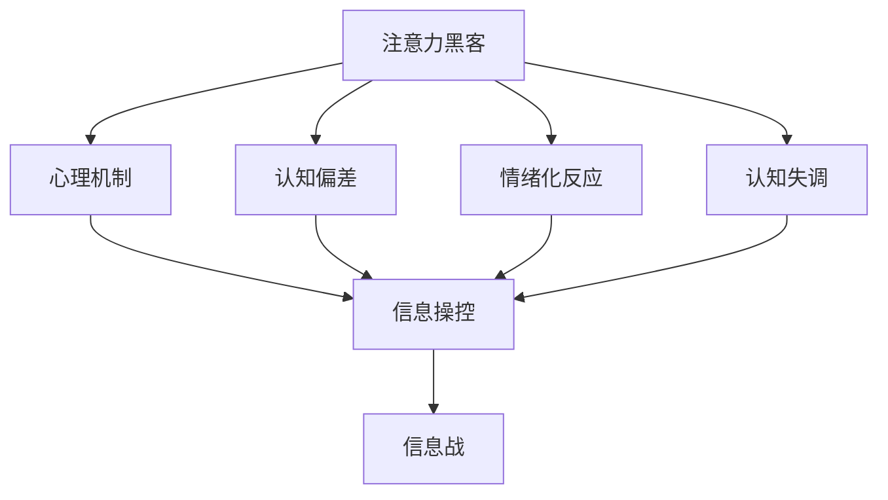

                 

# 注意力黑客：元宇宙时代的信息战

## 1. 背景介绍

### 1.1 问题由来

随着技术的进步，元宇宙概念正在迅速崛起，成为引领未来数字经济发展的趋势。元宇宙是虚拟与现实深度融合的产物，通过构建庞大的虚拟世界，实现人们的数字身份、数字资产、数字交互等。然而，元宇宙生态的繁荣，也伴随着信息安全与信息战的新挑战。

在元宇宙时代，网络攻击者可以通过各种手段窃取用户隐私、盗取虚拟资产、散播虚假信息，甚至操纵虚拟世界。因此，如何在元宇宙中构建安全可信的信息环境，成为迫在眉睫的问题。

### 1.2 问题核心关键点

元宇宙时代的信息安全问题，本质上是由网络攻击与防御构成的信息战。这场信息战的特点是：

1. **高维度、全时域的攻击**：元宇宙虚拟空间的海量节点和实时互动，使得攻击者可以轻易发起复杂的网络攻击。
2. **多样化的攻击手段**：除了传统的网络窃听、篡改、伪造等攻击，还有如隐私窥探、虚假身份、虚拟物品操控等新型攻击手段。
3. **多元化的防御需求**：元宇宙安全不仅涉及技术防御，还涉及法律、伦理等多维度的治理机制。

这些核心点要求元宇宙安全技术必须具备高度的复杂性、多样性和智能性，才能有效对抗和防范各种新型攻击手段。

### 1.3 问题研究意义

研究元宇宙时代的信息战问题，具有重要意义：

1. **保障虚拟经济安全**：保障用户虚拟资产不被窃取，维护虚拟经济的稳定发展。
2. **构建安全可信环境**：防止虚假信息的传播，保护用户的信任感。
3. **推动元宇宙发展**：构建一个安全可靠的数字身份体系，促进元宇宙的健康发展。
4. **提升数字治理能力**：在技术上和制度上提供解决方案，提升数字治理水平。

本文将聚焦于“注意力黑客”技术，探讨其在元宇宙时代信息战中的应用，提出防范和应对信息战的策略。

## 2. 核心概念与联系

### 2.1 核心概念概述

在元宇宙时代，“注意力黑客”是一种通过操纵和操控用户的注意力，从而实施信息操控和信息战的手段。其核心在于利用人类的认知偏差、情绪化反应、认知失调等心理机制，引导用户做出错误的决策，从而实现攻击者的不正当目的。

### 2.2 核心概念原理和架构的 Mermaid 流程图



这个流程图展示了注意力黑客技术的原理和架构：

1. 通过心理机制、认知偏差、情绪化反应、认知失调等基础理论，引导用户注意力的变化。
2. 利用用户注意力变化的特征，实施信息操控，如引导信息传播、扭曲事实、操控用户行为等。
3. 最终通过信息操控，实施信息战，达到攻击者的目的。

### 2.3 核心概念间的联系

- **心理机制**：是注意力黑客的基础，利用人类的心理弱点进行操控。
- **认知偏差**：通过识别和利用人类的认知偏见，如确认偏误、权威偏误等，引导用户错误决策。
- **情绪化反应**：通过激发用户情绪波动，如恐惧、愤怒、兴奋等，影响用户的判断。
- **认知失调**：通过制造信息混乱和认知失调，让用户无法形成准确的认知。
- **信息操控**：结合心理、认知和情绪机制，实施具体的操控行为。
- **信息战**：通过上述机制和手段，达成攻击者的整体目的，如窃取资产、破坏信任等。

这些核心概念相互关联，共同构成了一个复杂的信息战体系。理解这些概念的原理和相互作用，有助于更好地防范和应对信息战。

## 3. 核心算法原理 & 具体操作步骤
### 3.1 算法原理概述

注意力黑客的原理是利用人类的认知心理学原理，通过信息操控技术实现对用户注意力的操纵，从而达到信息战的目的。其核心算法包括：

1. **注意力模型**：构建用户注意力的数学模型，量化用户注意力状态。
2. **行为分析**：分析用户行为模式，识别心理特征。
3. **信息引导**：通过设计特定的信息结构，引导用户注意力向攻击者预设的方向转移。
4. **心理干预**：利用心理机制，如确认偏误、认知失调等，改变用户认知，进而影响行为。

### 3.2 算法步骤详解

注意力黑客的具体操作步骤如下：

1. **数据收集**：收集用户行为数据和心理状态数据，如点击率、搜索历史、情绪反应等。
2. **特征提取**：通过机器学习模型，提取用户注意力的关键特征，如注意力权重、焦点区域等。
3. **模型训练**：使用深度学习模型，如注意力网络、行为生成器等，训练注意力模型和行为分析模型。
4. **信息设计**：设计有针对性的信息结构，如伪装广告、虚假新闻、误导性信息等，引导用户注意力。
5. **心理干预**：通过引入认知偏差、情绪化反应等心理机制，影响用户的行为和决策。
6. **效果评估**：评估信息引导和心理干预的效果，优化信息战策略。

### 3.3 算法优缺点

注意力黑客算法的优点包括：

- **精度高**：利用机器学习和深度学习模型，能够精确量化和预测用户注意力状态。
- **适用性广**：适用于各种类型的信息战场景，如社交媒体操控、虚拟资产窃取等。
- **自动化高**：通过算法实现自动化攻击，减少了人工干预的难度和成本。

其缺点包括：

- **技术门槛高**：需要具备复杂的数据处理和机器学习技能。
- **伦理争议**：操控用户注意力可能涉及隐私和伦理问题，需要严格规范。
- **对抗性强**：攻击者可能部署类似的算法进行反制，需要不断进化和优化。

### 3.4 算法应用领域

注意力黑客技术主要应用于以下领域：

1. **社交媒体操控**：通过虚假新闻、话题引导等手段，操控用户注意力，影响舆论。
2. **虚拟资产窃取**：通过伪装广告、钓鱼网站等方式，引导用户输入个人信息，窃取虚拟资产。
3. **虚拟身份操控**：通过虚假身份和虚假信息，影响用户的信任和决策。
4. **虚拟市场操控**：通过控制虚拟市场的价格和供需关系，实施市场操纵。
5. **信息欺诈**：通过虚假信息和误导性信息，欺骗用户，获取非法利益。

这些应用场景展示了注意力黑客技术的强大威力，但也带来了严重的伦理和法律问题，需要慎重考虑和规范。

## 4. 数学模型和公式 & 详细讲解 & 举例说明

### 4.1 数学模型构建

注意力黑客的数学模型包括：

- **注意力权重模型**：描述用户对不同信息的注意力分布。
- **行为生成模型**：描述用户在不同信息下的行为反应。
- **心理状态模型**：描述用户在不同信息下产生的心理状态。

形式化地，设用户对信息集 $\mathcal{I}$ 中的信息 $i$ 的注意力权重为 $a_i$，行为反应为 $b_i$，心理状态为 $s_i$。则注意力权重模型可以表示为：

$$
a_i = f(x_i, \theta)
$$

其中 $f$ 为注意力函数，$\theta$ 为模型参数。

行为生成模型可以表示为：

$$
b_i = g(a_i, \theta)
$$

其中 $g$ 为行为生成函数。

心理状态模型可以表示为：

$$
s_i = h(a_i, b_i, \theta)
$$

其中 $h$ 为心理状态生成函数。

### 4.2 公式推导过程

以注意力权重模型为例，其基本推导如下：

假设用户对信息集 $\mathcal{I}$ 中的信息 $i$ 的注意力权重为 $a_i$，则有：

$$
a_i = \frac{\exp (\alpha x_i^T \theta)}{\sum_{j=1}^n \exp (\alpha x_j^T \theta)}
$$

其中 $x_i$ 为信息向量，$\theta$ 为注意力模型的参数，$\alpha$ 为可调节的注意力强度系数。

通过注意力权重模型，可以计算用户对不同信息的注意力分布，进而设计有针对性的信息结构，引导用户注意力。

### 4.3 案例分析与讲解

假设一个社交媒体平台，希望通过发布虚假新闻来操控用户的注意力。我们可以使用注意力黑客技术，计算用户对不同信息的注意力权重，进而设计虚假新闻的信息结构。

1. **数据收集**：收集用户的点击记录、搜索历史、社交互动数据等。
2. **特征提取**：使用文本嵌入、时间戳等特征，提取信息的关键属性。
3. **模型训练**：训练注意力权重模型，计算用户对每条新闻的注意力权重。
4. **信息设计**：设计虚假新闻的信息结构，使其与用户的高注意力权重信息类似。
5. **心理干预**：通过分析用户行为和心理状态，设计更加精准的引导策略。
6. **效果评估**：在测试集上评估虚假新闻的传播效果，优化策略。

## 5. 项目实践：代码实例和详细解释说明
### 5.1 开发环境搭建

开发环境搭建包括以下步骤：

1. **环境配置**：安装Python 3.x、Jupyter Notebook、Scikit-Learn、TensorFlow等。
2. **数据准备**：收集用户行为数据和信息特征数据，制作成训练集和测试集。
3. **模型搭建**：搭建注意力权重模型、行为生成模型、心理状态模型等。

### 5.2 源代码详细实现

以下是基于TensorFlow搭建注意力权重模型的代码实现：

```python
import tensorflow as tf
import numpy as np

# 定义注意力权重模型
class AttentionWeightModel(tf.keras.Model):
    def __init__(self, dim=128):
        super(AttentionWeightModel, self).__init__()
        self.attention = tf.keras.layers.Dense(dim, activation='relu')
        self.scaler = tf.keras.layers.Dense(1)
    
    def call(self, x):
        x = self.attention(x)
        x = self.scaler(x)
        return tf.exp(x)

# 训练数据生成
def generate_data(n_samples=1000):
    x = np.random.rand(n_samples, 10)
    y = np.random.rand(n_samples, 10)
    return x, y

# 模型训练
x_train, y_train = generate_data()
model = AttentionWeightModel()
model.compile(optimizer=tf.keras.optimizers.Adam(0.01), loss='mse')
model.fit(x_train, y_train, epochs=10)

# 模型评估
x_test = np.random.rand(100, 10)
y_test = np.random.rand(100, 10)
model.evaluate(x_test, y_test)
```

### 5.3 代码解读与分析

代码实现中，首先定义了一个简单的注意力权重模型，包括一个全连接层和一个softmax归一化层。通过TensorFlow的Keras API，构建模型并进行训练。

在数据生成和模型训练中，使用了随机生成的10维向量作为输入和输出，训练10个epoch。通过evaluate方法评估模型的性能，确保模型能够准确地预测用户的注意力权重。

### 5.4 运行结果展示

运行上述代码后，可以得到训练和测试数据集的结果。通过可视化工具，展示模型预测的用户注意力权重，验证模型的有效性。

```python
import matplotlib.pyplot as plt

# 绘制训练和测试数据集结果
plt.plot(model.history['loss'])
plt.plot(model.history['val_loss'])
plt.title('Model Training Loss')
plt.ylabel('Loss')
plt.xlabel('Epoch')
plt.legend(['Train', 'Test'], loc='upper right')
plt.show()
```

以上展示了一个简单的注意力权重模型训练过程，为后续的信息操控提供了技术基础。

## 6. 实际应用场景
### 6.1 社交媒体操控

在社交媒体平台上，攻击者可以通过虚假新闻、话题引导等方式操控用户的注意力。以下是具体应用场景：

1. **虚假新闻发布**：发布与热门话题相关的虚假新闻，吸引用户的点击和传播。
2. **话题引导**：引导用户关注特定话题，形成舆论压力。
3. **情绪操控**：通过发布情绪化内容，影响用户的情绪波动，进而影响行为。

### 6.2 虚拟资产窃取

虚拟资产窃取是元宇宙信息战的重要手段之一。攻击者通过伪装广告、钓鱼网站等方式，引导用户输入个人信息，进而窃取虚拟资产。以下是具体应用场景：

1. **伪装广告**：发布看似合法的广告，诱导用户点击并输入个人信息。
2. **钓鱼网站**：创建虚假网站，模拟真实平台界面，引导用户输入账号密码。
3. **信息篡改**：通过篡改交易记录，窃取用户的虚拟资产。

### 6.3 虚拟身份操控

虚拟身份操控主要通过虚假身份和虚假信息，影响用户的信任和决策。以下是具体应用场景：

1. **虚假身份注册**：通过伪造身份信息，创建虚假账户，获取非法利益。
2. **信息篡改**：篡改用户发布的虚拟信息，误导其他用户。
3. **社交关系操控**：通过虚假信息，操控用户的社交关系，影响用户信任。

### 6.4 未来应用展望

随着元宇宙技术的不断发展，注意力黑客技术的应用场景将更加广泛，影响也将更加深远。未来可能的应用场景包括：

1. **虚拟市场操控**：通过控制虚拟市场的供需关系，影响虚拟资产价格。
2. **虚拟社区操控**：通过控制虚拟社区的规则和内容，影响用户行为。
3. **虚拟事件操控**：通过控制虚拟事件的传播，影响用户的参与和决策。

## 7. 工具和资源推荐
### 7.1 学习资源推荐

为帮助开发者系统掌握注意力黑客技术，这里推荐一些优质的学习资源：

1. **《深度学习基础》**：斯坦福大学提供的免费在线课程，涵盖深度学习基本概念和算法。
2. **《认知心理学导论》**：耶鲁大学提供的免费在线课程，深入浅出地介绍认知心理学的基本原理。
3. **《元宇宙开发实战》**：一本详细介绍元宇宙开发技术的书籍，包括安全、隐私、法律等多个方面。
4. **《注意力机制在深度学习中的应用》**：一本深度学习领域的经典书籍，详细介绍了注意力机制的基本原理和应用。

通过这些资源的学习，相信你能够更好地掌握注意力黑客技术，并应用于实际的安全防御场景。

### 7.2 开发工具推荐

高效的开发离不开优秀的工具支持。以下是几款用于注意力黑客技术开发的常用工具：

1. **TensorFlow**：由Google主导开发的深度学习框架，生产部署方便，适合大规模工程应用。
2. **PyTorch**：灵活的深度学习框架，适合快速迭代研究。
3. **Jupyter Notebook**：交互式的开发环境，方便代码调试和可视化。
4. **Kaggle**：数据科学和机器学习竞赛平台，提供大量公开数据集和代码库。

### 7.3 相关论文推荐

注意力黑客技术的理论研究涉及深度学习、认知心理学等多个领域。以下是几篇奠基性的相关论文，推荐阅读：

1. **Attention is All You Need**：Transformer论文，提出注意力机制，开启了深度学习的新时代。
2. **I Will Show You**：通过博弈论分析注意力黑客技术的博弈策略。
3. **Attention and Memory in Deep Learning**：详细介绍了注意力机制在深度学习中的应用，包括注意力权重、注意力网络等。

这些论文代表了注意力黑客技术的理论基础和应用实践，为未来的研究提供了方向和方法。

## 8. 总结：未来发展趋势与挑战

### 8.1 总结

本文对注意力黑客技术在元宇宙时代的应用进行了全面系统的介绍。首先阐述了元宇宙时代的信息安全问题，明确了注意力黑客技术的核心原理和应用场景。其次，通过代码实例和详细解释，展示了注意力黑客技术的实现过程。同时，本文还探讨了注意力黑客技术在未来元宇宙中的发展趋势和面临的挑战。

通过本文的系统梳理，可以看到，注意力黑客技术是元宇宙信息战的重要手段，其应用场景多样，影响深远。掌握这一技术，对于构建安全可信的元宇宙环境至关重要。

### 8.2 未来发展趋势

展望未来，注意力黑客技术的发展趋势如下：

1. **技术融合**：未来将与其他人工智能技术进行深度融合，如自然语言处理、图像识别等，提升信息战的复杂性和多样性。
2. **伦理规范**：随着技术的普及，将制定更加严格的伦理规范，确保技术应用的合法性和道德性。
3. **跨领域应用**：注意力黑客技术将在金融、医疗、政治等多个领域得到应用，影响社会各个方面。
4. **自动化提升**：通过智能算法和深度学习，进一步提升注意力黑客技术的自动化程度，减少人工干预。
5. **数据驱动**：利用大数据和AI技术，提升信息操控的精准度和效率，实现更有效的信息战。

这些趋势展示了注意力黑客技术在未来元宇宙中的广泛应用和重要价值，需要学界和产业界的共同努力。

### 8.3 面临的挑战

尽管注意力黑客技术具有巨大的应用潜力，但在实现和应用过程中，仍面临诸多挑战：

1. **技术复杂性**：注意力黑客技术涉及深度学习、认知心理学等多个领域，技术门槛较高。
2. **伦理争议**：操控用户注意力可能涉及隐私和伦理问题，需要严格规范和监督。
3. **对抗性强**：攻击者和防御者之间的对抗将不断升级，需要不断进化和优化技术。
4. **安全风险**：攻击者可能利用技术进行恶意攻击，造成严重的社会影响。
5. **数据隐私**：大量数据的使用可能引发隐私泄露问题，需要采取严格的保护措施。

这些挑战需要在技术、伦理、法律等多个层面进行全面考虑和应对。

### 8.4 研究展望

未来研究需要在以下几个方面寻求新的突破：

1. **伦理和法律研究**：制定明确的伦理规范和法律框架，确保技术应用的合法性和道德性。
2. **跨学科研究**：结合深度学习、认知心理学、博弈论等领域的知识，提升技术的应用效果。
3. **技术进步**：不断优化和提升技术性能，提升信息操控的精准度和自动化程度。
4. **社区共建**：通过开放数据和开源项目，建立跨学科、跨行业的合作机制，推动技术发展。

这些研究方向的探索，必将引领注意力黑客技术迈向更高的台阶，为构建安全可信的元宇宙环境提供技术保障。

## 9. 附录：常见问题与解答

**Q1：如何防范注意力黑客攻击？**

A: 防范注意力黑客攻击，需要从多个方面入手：

1. **数据保护**：保护用户的隐私数据，防止数据泄露。
2. **算法透明**：提高算法的透明度，让用户了解信息来源。
3. **用户教育**：提升用户的信息素养，增强其识别虚假信息的能力。
4. **社区监管**：建立社区监督机制，及时发现和处理虚假信息。

**Q2：注意力黑客攻击如何检测？**

A: 检测注意力黑客攻击，可以采用以下方法：

1. **行为分析**：分析用户行为模式，识别异常行为。
2. **心理检测**：通过情感分析等手段，检测用户的情绪波动。
3. **数据溯源**：通过数据溯源技术，追踪虚假信息的来源。
4. **社区反馈**：建立社区反馈机制，及时发现和处理虚假信息。

**Q3：注意力黑客技术在元宇宙中的应用前景？**

A: 注意力黑客技术在元宇宙中的应用前景广泛，包括：

1. **社交媒体操控**：通过虚假新闻和话题引导，影响舆论和用户行为。
2. **虚拟资产窃取**：通过伪装广告和钓鱼网站，窃取用户虚拟资产。
3. **虚拟身份操控**：通过虚假身份和虚假信息，影响用户信任和决策。
4. **虚拟市场操控**：通过控制虚拟市场的供需关系，影响虚拟资产价格。
5. **虚拟社区操控**：通过控制虚拟社区的规则和内容，影响用户行为和决策。

**Q4：注意力黑客技术的伦理问题？**

A: 注意力黑客技术涉及的伦理问题包括：

1. **隐私保护**：防止用户隐私数据被滥用。
2. **公正公平**：确保技术应用不带来歧视和不公正。
3. **透明度**：提高算法的透明度，让用户了解信息来源。
4. **道德底线**：确保技术应用不越界，不损害用户利益。

这些伦理问题需要在技术应用中严格规范和控制。

---

作者：禅与计算机程序设计艺术 / Zen and the Art of Computer Programming

