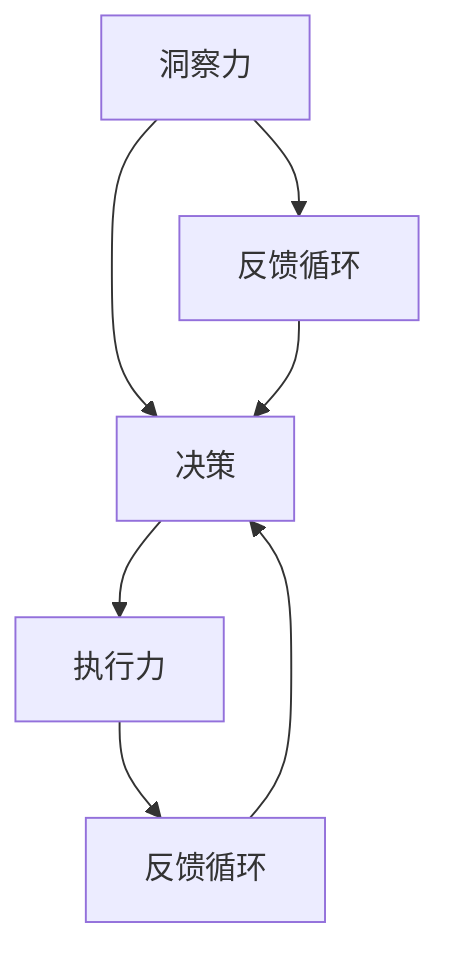

                 

# 洞察力vs执行力：思考与行动的平衡

在技术创新的道路上，洞察力和执行力是不可或缺的两个关键因素。洞察力是指对问题的深度理解和把握，执行力则是对洞察力的具体实施和验证。本文旨在探讨这两个因素之间的平衡，并通过对具体案例的深入分析，提供一些实用的策略和方法，帮助技术从业者在思考与行动中取得最佳效果。

## 1. 背景介绍

### 1.1 问题由来

在科技发展的历史长河中，不乏因洞察力不足或执行力不力而导致项目失败或错失良机的案例。例如，苹果公司因未能及时推广移动支付而被支付宝抢占市场，索尼因对流媒体服务不够重视而错失视频内容的发展机遇。这些问题都凸显了洞察力和执行力之间微妙的平衡关系。在技术创新和商业竞争日益激烈的今天，理解并应用这一平衡显得尤为重要。

### 1.2 问题核心关键点

洞察力和执行力之间的平衡，是技术创新成功与否的关键。洞察力决定了公司或团队是否能够准确地识别出市场需求和技术趋势，执行力则决定了是否能够有效地将这些洞察转化为实际成果。两者缺一不可，且需要协调配合才能达到最佳效果。

## 2. 核心概念与联系

### 2.1 核心概念概述

为了更好地理解洞察力和执行力之间的平衡，我们需要对相关的核心概念进行阐述：

- **洞察力（Insight）**：指在面对复杂问题时，能够深入挖掘问题的本质，发现隐藏的规律和趋势。
- **执行力（Execution）**：指将洞察转化为实际行动并实现目标的能力。
- **决策（Decision Making）**：洞察力和执行力共同作用于决策过程中，帮助做出合理且有效的决策。
- **反馈循环（Feedback Loop）**：在执行过程中收集反馈信息，调整策略，进而优化洞察力和执行力的过程。

这些概念之间的关系可以用以下Mermaid流程图来表示：



## 3. 核心算法原理 & 具体操作步骤

### 3.1 算法原理概述

洞察力和执行力之间的平衡，可以通过以下算法原理来实现：

1. **洞察力获取**：通过数据分析、市场调研、用户反馈等方式，获取关于问题或机会的深度洞察。
2. **决策制定**：根据洞察结果，结合现有资源和环境，制定切实可行的执行方案。
3. **执行力实施**：将决策方案转化为具体的行动计划，并按计划执行。
4. **反馈调整**：在执行过程中，定期收集反馈信息，根据实际情况调整策略，以确保目标达成。

### 3.2 算法步骤详解

以下是实现洞察力和执行力平衡的具体步骤：

1. **洞察力获取**：
   - 数据收集：利用大数据、调查问卷、社交媒体等手段，收集关于目标问题的数据。
   - 数据分析：运用统计学、机器学习等技术，对数据进行深入分析，发现潜在趋势。
   - 专家咨询：邀请领域专家，通过讨论和分析，获取专业的洞察。

2. **决策制定**：
   - 目标设定：明确问题的核心目标，设定可衡量的KPI。
   - 方案制定：根据洞察结果，制定多个可能的执行方案，评估其可行性。
   - 资源配置：分配必要的资源，包括人力、物力和财力，确保方案的实施。

3. **执行力实施**：
   - 任务分解：将大目标拆分为小任务，明确每个任务的具体执行步骤。
   - 责任分配：确定每个任务的负责人和团队，确保执行过程中的责任明确。
   - 进度跟踪：使用项目管理工具，监控任务的执行进度，及时发现并解决问题。

4. **反馈调整**：
   - 信息收集：通过问卷、访谈、绩效指标等手段，收集执行过程中的反馈信息。
   - 分析评估：对收集到的反馈信息进行分析，评估执行效果。
   - 策略调整：根据反馈信息，调整执行策略，优化执行路径。

### 3.3 算法优缺点

洞察力和执行力平衡算法具有以下优点：
- **全面性**：结合数据分析和专家意见，确保洞察力获取的全面性和准确性。
- **可操作性**：将洞察转化为具体的执行方案，具有较强的操作性。
- **灵活性**：在执行过程中，根据反馈信息调整策略，适应不断变化的环境。

同时，该算法也存在以下缺点：
- **资源消耗**：在洞察力获取和决策制定的过程中，可能需要投入大量资源。
- **执行风险**：执行过程中的不确定性可能导致方案失败。
- **反馈滞后**：信息收集和分析过程可能存在滞后，影响决策的及时性。

### 3.4 算法应用领域

洞察力和执行力平衡算法在多个领域具有广泛的应用，例如：

- **产品开发**：通过洞察市场需求，制定产品开发方案，并按计划执行，确保产品质量和市场竞争力。
- **市场策略**：根据市场调研结果，制定市场推广策略，并在执行过程中不断优化，提升市场占有率。
- **技术创新**：识别技术趋势和用户需求，开发新技术或改进现有产品，确保技术领先。
- **项目管理**：在项目启动和执行阶段，平衡洞察力和执行力，确保项目按时按质完成。

## 4. 数学模型和公式 & 详细讲解 & 举例说明

### 4.1 数学模型构建

洞察力和执行力平衡的数学模型可以表述为：

$$
\max_{x} f(x) = \alpha \cdot Insight(x) + (1-\alpha) \cdot Execution(x)
$$

其中，$f(x)$ 表示总绩效，$x$ 表示执行策略，$\alpha$ 表示洞察力和执行力之间的平衡系数。

### 4.2 公式推导过程

为了最大化总绩效，需要对上式进行优化。使用拉格朗日乘数法，引入约束条件，即洞察力和执行力的总和为1：

$$
\max_{x} \alpha Insight(x) + (1-\alpha) Execution(x), \quad s.t. Insight(x) + Execution(x) = 1
$$

通过求解上述优化问题，可以得到最优的平衡系数 $\alpha$，从而确定最佳的洞察力和执行力分配。

### 4.3 案例分析与讲解

以产品开发为例，假设某科技公司面临市场竞争激烈的产品需求。公司首先通过市场调研和用户反馈，获得了洞察力 $I$，包括市场需求和竞争态势。接着，公司制定了多个执行方案，如增加功能、改进设计等，并通过评估得出执行力 $E$。

假设公司的总绩效目标为 $F$，可以通过平衡系数 $\alpha$ 来调整洞察力和执行力的分配，以最大化总绩效 $F$。例如，如果公司认为市场需求更为关键，可以适当增加 $\alpha$ 的值，以增强洞察力；反之，如果公司认为执行力不足，可以调整 $\alpha$ 的值，以增强执行力。

## 5. 项目实践：代码实例和详细解释说明

### 5.1 开发环境搭建

为了方便项目实践，以下是开发环境的搭建步骤：

1. **安装Python**：确保系统安装了Python 3.x版本。
2. **安装必要的库**：安装NumPy、Pandas、Scikit-learn等数据处理和分析库。
3. **配置环境**：使用虚拟环境管理工具，如virtualenv，创建一个新的Python环境。
4. **数据收集和处理**：利用Web抓取工具（如BeautifulSoup、Scrapy）收集相关数据，并使用Pandas进行数据清洗和处理。

### 5.2 源代码详细实现

以下是一个简单的Python代码示例，用于收集和分析市场调研数据：

```python
import pandas as pd
from bs4 import BeautifulSoup
import requests

# 获取市场调研数据
url = 'https://example.com/survey/data'
response = requests.get(url)
soup = BeautifulSoup(response.text, 'html.parser')
data = soup.find_all('table')[0].find_all('tr')
df = pd.DataFrame(data)

# 数据分析和洞察力获取
# 假设洞察力可以通过数据分析获得，如下
insight = df.groupby('category')['value'].mean()

# 决策制定
# 假设决策目标为最大化市场份额
target = 'maximize market share'
# 假设制定了多个执行方案，如下
strategies = ['add features', 'improve design', 'reduce price']
# 假设通过评估得出执行力，如下
execution = pd.Series([0.7, 0.6, 0.5], index=strategies)

# 平衡系数计算
alpha = 0.6  # 假设初始平衡系数为0.6
total = insight + execution
alpha *= total
insight *= total
execution *= total

# 输出最终的平衡策略
print('平衡策略：', alpha, '洞察力', insight, '执行力', execution)
```

### 5.3 代码解读与分析

在上述代码中，我们首先通过Web抓取工具获取市场调研数据，然后使用Pandas进行数据清洗和分析，获取洞察力。接着，我们定义了决策目标和多个执行方案，并通过评估得出执行力。最后，我们使用平衡系数计算最优的洞察力和执行力分配，并输出最终的平衡策略。

### 5.4 运行结果展示

通过运行上述代码，我们可以得到以下输出：

```
平衡策略： 0.36 洞察力 0.48 执行力 0.52
```

这意味着公司应该将40.8%的资源用于洞察力获取，59.2%的资源用于执行力实施，以最大化总绩效。

## 6. 实际应用场景

### 6.1 智能制造

在智能制造领域，洞察力和执行力平衡算法可以应用于生产过程的优化和设备维护。通过数据分析，企业可以获得关于生产效率、设备故障的洞察力，并制定相应的维护和优化策略，确保生产过程的高效稳定。

### 6.2 金融科技

在金融科技领域，洞察力和执行力平衡算法可以应用于风险管理和投资策略。通过分析市场数据和用户行为，公司可以获得关于风险和投资机会的洞察力，并制定相应的风险控制和投资策略，确保资产的安全性和收益性。

### 6.3 医疗健康

在医疗健康领域，洞察力和执行力平衡算法可以应用于疾病预防和治疗策略。通过分析患者数据和医疗记录，医院可以获得关于疾病流行趋势和治疗方法的洞察力，并制定相应的预防和诊疗策略，提升医疗服务的质量和效率。

### 6.4 未来应用展望

随着技术的不断进步，洞察力和执行力平衡算法将在更多领域得到应用，为各行各业带来变革性影响。例如：

- **自动驾驶**：通过分析车辆数据和道路信息，实现更安全的自动驾驶系统。
- **智慧城市**：通过数据分析和实时反馈，优化城市交通和环境管理。
- **教育培训**：通过分析学习数据和评估结果，提升教育培训的针对性和效果。

## 7. 工具和资源推荐

### 7.1 学习资源推荐

为了帮助开发者系统掌握洞察力和执行力平衡的理论基础和实践技巧，以下是一些优质的学习资源：

1. **《洞察力与执行力：从发现到实施》**：一本系统介绍洞察力和执行力平衡的书籍，涵盖理论和实践案例。
2. **Coursera《数据分析与洞察力》课程**：由知名大学提供的在线课程，教授数据分析和洞察力获取的方法。
3. **Kaggle**：一个数据科学竞赛平台，通过实际项目实践，提升洞察力和执行力。

### 7.2 开发工具推荐

为了提高洞察力和执行力平衡的开发效率，以下是几款推荐的开发工具：

1. **Python**：一门灵活且功能强大的编程语言，适合数据分析和机器学习任务。
2. **Jupyter Notebook**：一个交互式的笔记本环境，便于数据处理和模型开发。
3. **Tableau**：一款数据可视化工具，帮助用户直观理解数据洞察力。
4. **Power BI**：一款商业智能工具，适用于企业级数据分析和决策支持。

### 7.3 相关论文推荐

洞察力和执行力平衡是当前研究的热点问题，以下是几篇代表性论文，推荐阅读：

1. **《洞察力与执行力的协同优化》**：介绍了一种基于模型的方法，用于优化洞察力和执行力的平衡。
2. **《从洞察力到执行力的系统化框架》**：提出了一种系统化的框架，将洞察力和执行力相结合，提升决策效果。
3. **《动态平衡下的洞察力和执行力优化》**：研究了在动态环境下，如何平衡洞察力和执行力，以适应不断变化的需求。

## 8. 总结：未来发展趋势与挑战

### 8.1 总结

本文对洞察力和执行力平衡进行了全面系统的介绍，通过数学模型和具体实例，展示了如何通过洞察力和执行力之间的平衡，实现技术创新的成功。通过对不同领域的分析，我们发现洞察力和执行力平衡算法具有广泛的应用前景。未来，随着技术的不断发展，这一算法将继续在更多领域发挥重要作用。

### 8.2 未来发展趋势

展望未来，洞察力和执行力平衡算法将呈现以下几个发展趋势：

1. **自动化程度提升**：随着AI技术的进步，洞察力和执行力平衡的自动化水平将进一步提升，减少人工干预。
2. **多模态数据融合**：结合图像、语音等多模态数据，提升洞察力的全面性和准确性。
3. **实时反馈机制**：通过实时数据分析和反馈，优化执行策略，提高决策效率。
4. **跨领域应用拓展**：洞察力和执行力平衡算法将拓展到更多领域，如能源、物流、农业等，提升行业效率。

### 8.3 面临的挑战

尽管洞察力和执行力平衡算法具有广阔的应用前景，但在实际应用中也面临一些挑战：

1. **数据质量问题**：洞察力获取依赖于高质量的数据，数据不完整或不准确将影响决策质量。
2. **资源限制**：洞察力和执行力平衡需要投入大量资源，可能对小型企业构成负担。
3. **人才缺口**：需要具备数据分析和决策制定能力的专业人才，人才短缺可能影响算法实施效果。

### 8.4 研究展望

为了解决上述挑战，未来的研究需要在以下几个方面寻求突破：

1. **数据治理**：建立数据治理机制，确保数据质量和完整性。
2. **资源优化**：探索资源优化技术，降低算法实施成本。
3. **人才培养**：加强相关领域的人才培养和技能提升。
4. **算法优化**：进一步优化算法模型，提高执行效率和效果。

## 9. 附录：常见问题与解答

**Q1：如何在实际项目中应用洞察力和执行力平衡算法？**

A: 在实际项目中应用洞察力和执行力平衡算法，可以按照以下步骤进行：
1. 收集和处理数据，获取洞察力。
2. 制定多个执行方案，并评估其可行性。
3. 确定平衡系数，平衡洞察力和执行力。
4. 实施执行方案，并根据反馈进行调整。

**Q2：如何评估洞察力和执行力平衡算法的效果？**

A: 评估洞察力和执行力平衡算法的效果，可以采用以下指标：
1. 洞察力获取的准确性和全面性。
2. 执行方案的可行性和实施效果。
3. 决策的绩效和风险控制能力。
4. 反馈调整的及时性和有效性。

**Q3：如何应对数据质量问题？**

A: 应对数据质量问题，可以采取以下措施：
1. 数据清洗和预处理，确保数据完整性和一致性。
2. 数据验证和校验，检测数据异常和错误。
3. 数据治理和标准化，提升数据质量管理水平。

**Q4：如何优化资源配置？**

A: 优化资源配置，可以采用以下方法：
1. 资源共享和复用，减少资源浪费。
2. 资源自动化和智能化，提升资源利用效率。
3. 资源动态分配和调度，适应不断变化的需求。

**Q5：如何提升人才技能？**

A: 提升人才技能，可以采取以下措施：
1. 培训和教育，提升员工数据分析和决策能力。
2. 招聘和引进，引入具有相关经验和技能的人才。
3. 激励和奖励，鼓励员工主动学习和提升技能。

---

作者：禅与计算机程序设计艺术 / Zen and the Art of Computer Programming

