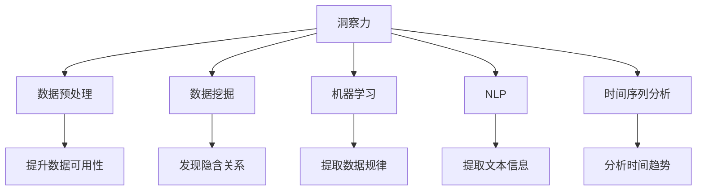

                 

# 洞察力与决策科学：从数据到智慧的转化过程

> 关键词：洞察力,决策科学,数据驱动,智慧转化,机器学习,数据挖掘,自然语言处理(NLP)

## 1. 背景介绍

### 1.1 问题由来

在信息化高速发展的今天，数据已成为支撑现代决策的基石。无论政府、企业还是个人，在面对复杂多变的社会环境时，都离不开数据的支撑。然而，单纯的数据堆砌并不能转化为有效的决策支持，如何将海量数据转化为洞察力，成为当前信息时代的重要课题。

随着机器学习和数据挖掘技术的不断发展，近年来一种全新的决策科学范式——数据驱动的决策科学应运而生。这种范式强调通过数据分析、挖掘、预测等技术，将数据转化为可操作的洞察力，进而辅助决策者制定最优决策。这种范式以机器学习和数据挖掘为核心，借助算法模型，从数据中发现规律、模式和趋势，从而赋能决策者，提升决策的效率和效果。

### 1.2 问题核心关键点

数据驱动决策科学的核心在于如何从数据中提取有价值的信息，将其转化为洞察力，并最终应用于决策过程。这一过程主要包括以下几个步骤：

1. **数据获取与预处理**：收集相关数据，并进行清洗、去重、归一化等预处理工作，以提升数据的可用性。

2. **数据建模与分析**：选择合适的算法模型，对数据进行建模和分析，提取有价值的信息。

3. **洞察力生成**：通过可视化、报告生成等技术手段，将分析结果转化为可操作的洞察力。

4. **决策支持**：将洞察力应用于实际决策场景，辅助决策者进行判断和选择。

这一过程的关键在于选择合适的算法模型，并结合实际业务场景进行优化和调整。以下是几种常用的算法模型和技术手段：

- **机器学习**：通过训练模型对数据进行分类、回归、聚类等操作，提取数据中的规律和趋势。
- **数据挖掘**：通过关联规则、频繁项集、分类等方法，发现数据中的隐含关系和模式。
- **自然语言处理(NLP)**：通过文本分析、情感分析等技术，从非结构化数据中提取有价值的信息。
- **时间序列分析**：通过预测、分解等方法，从时间维度上对数据进行分析和预测。

## 2. 核心概念与联系

### 2.1 核心概念概述

为了更好地理解数据驱动决策科学的原理和架构，本节将介绍几个核心概念：

- **洞察力(Insights)**：基于数据挖掘和分析，从数据中提取的有价值的信息，用于辅助决策。
- **决策科学(Decision Science)**：应用数据分析、挖掘、预测等技术手段，将数据转化为洞察力，辅助决策者制定决策的学科。
- **数据驱动(数据驱动决策科学)**：强调数据在决策过程中的核心作用，通过数据挖掘和分析，辅助决策。
- **数据预处理(Preprocessing)**：对原始数据进行清洗、归一化、特征工程等预处理操作，以提升数据的可用性和分析效果。
- **机器学习(Machine Learning)**：通过训练算法模型，对数据进行分类、回归、聚类等操作，提取数据中的规律和趋势。
- **数据挖掘(Data Mining)**：通过关联规则、频繁项集、分类等方法，发现数据中的隐含关系和模式。
- **自然语言处理(NLP)**：通过文本分析、情感分析等技术，从非结构化数据中提取有价值的信息。
- **时间序列分析(Time Series Analysis)**：通过预测、分解等方法，从时间维度上对数据进行分析和预测。

这些核心概念之间的逻辑关系可以通过以下Mermaid流程图来展示：



这个流程图展示了大数据驱动决策科学的核心概念及其之间的关系：

1. 洞察力通过数据预处理、数据挖掘、机器学习、NLP、时间序列分析等技术手段，从数据中提取有价值的信息。
2. 数据预处理通过清洗、归一化、特征工程等操作，提升数据的可用性和分析效果。
3. 数据挖掘通过关联规则、频繁项集、分类等方法，发现数据中的隐含关系和模式。
4. 机器学习通过训练算法模型，对数据进行分类、回归、聚类等操作，提取数据中的规律和趋势。
5. NLP通过文本分析、情感分析等技术，从非结构化数据中提取有价值的信息。
6. 时间序列分析通过预测、分解等方法，从时间维度上对数据进行分析和预测。

这些概念共同构成了数据驱动决策科学的基础，使其能够将数据转化为洞察力，辅助决策者制定最优决策。

## 3. 核心算法原理 & 具体操作步骤

### 3.1 算法原理概述

数据驱动决策科学的算法原理主要基于统计学、机器学习、数据挖掘等领域的技术方法。其核心思想是通过对数据的分析、挖掘和预测，提取有价值的信息，用于辅助决策。

具体来说，数据驱动决策科学的算法流程通常包括以下几个步骤：

1. **数据预处理**：清洗、归一化、特征工程等预处理操作，提升数据的可用性。
2. **数据建模**：选择合适的算法模型，对数据进行建模和分析，提取数据中的规律和趋势。
3. **洞察力生成**：通过可视化、报告生成等技术手段，将分析结果转化为可操作的洞察力。
4. **决策支持**：将洞察力应用于实际决策场景，辅助决策者进行判断和选择。

这些步骤通过一系列技术手段，将数据转化为洞察力，并最终应用于决策支持过程。

### 3.2 算法步骤详解

数据驱动决策科学的算法步骤通常包括以下几个关键步骤：

**Step 1: 数据预处理**
- 收集相关数据，并进行清洗、去重、归一化等预处理工作，以提升数据的可用性。
- 进行特征工程，提取、构造、选择有用的特征，以提升模型的预测能力。
- 数据可视化，通过图表、报告等形式展示数据特点和分析结果。

**Step 2: 数据建模与分析**
- 选择合适的算法模型，对数据进行建模和分析，提取数据中的规律和趋势。
- 使用交叉验证、调参等技术手段，优化模型性能，提高模型的泛化能力。
- 进行模型评估，通过各种评估指标（如准确率、召回率、F1值等），衡量模型的效果。

**Step 3: 洞察力生成**
- 将分析结果通过图表、报告、仪表盘等形式展示，形成可视化洞察力。
- 将洞察力转化为可操作的建议和决策方案，辅助决策者进行判断和选择。
- 定期更新和迭代，确保洞察力与最新数据一致，保持决策支持的准确性。

**Step 4: 决策支持**
- 将洞察力应用于实际决策场景，结合领域知识和经验，进行决策。
- 建立决策反馈机制，根据决策效果进行调整和优化，提升决策支持的效果。

### 3.3 算法优缺点

数据驱动决策科学具有以下优点：
1. 数据驱动：通过数据分析和挖掘，发现数据中的规律和趋势，提高决策的科学性和准确性。
2. 自动化：通过算法模型，自动化分析数据，减轻人工工作量，提高分析效率。
3. 泛化性强：通过模型训练和调参，提升模型的泛化能力，适用于各种实际场景。
4. 可视化：通过可视化技术，将分析结果直观展示，便于决策者理解和应用。

同时，数据驱动决策科学也存在一些局限性：
1. 数据依赖：算法模型和决策支持的效果高度依赖数据质量，数据获取和预处理工作量大。
2. 模型复杂性：选择和调参合适的算法模型，需要一定的专业知识和经验。
3. 领域特定性：不同领域的数据特点和业务需求不同，需要根据实际场景进行调整。
4. 解释性不足：一些复杂模型（如深度学习模型）的决策过程难以解释，缺乏透明性和可信性。
5. 数据隐私和安全：在数据驱动决策过程中，涉及大量敏感信息，需注意数据隐私和安全问题。

尽管存在这些局限性，但就目前而言，数据驱动决策科学已成为决策科学的主流范式。未来相关研究的重点在于如何进一步降低数据依赖，提高模型的透明度和可解释性，同时兼顾数据隐私和安全等伦理问题。

### 3.4 算法应用领域

数据驱动决策科学在各个领域都有广泛的应用，例如：

- 金融风险管理：通过对历史交易数据和市场数据的分析，预测市场风险，优化资产配置。
- 市场营销：通过客户行为数据的分析，识别潜在客户，进行精准营销和个性化推荐。
- 供应链管理：通过对供应商数据和市场需求数据的分析，优化供应链计划和库存管理。
- 医疗诊断：通过患者历史数据和临床数据的分析，辅助医生进行疾病诊断和治疗方案选择。
- 智能制造：通过对生产数据和设备数据的分析，优化生产流程，提高生产效率和产品质量。
- 城市治理：通过对交通数据和公共服务数据的分析，优化城市资源配置和管理。
- 环境保护：通过对环境监测数据的分析，预测环境变化趋势，制定环境保护策略。

除了上述这些经典领域外，数据驱动决策科学还被创新性地应用到更多场景中，如智能客服、智能推荐、智能安防等，为各行各业带来新的技术突破。随着算法技术的不断演进，相信数据驱动决策科学将在更多领域得到应用，为社会经济发展带来新的动力。

## 4. 数学模型和公式 & 详细讲解 & 举例说明

### 4.1 数学模型构建

本节将使用数学语言对数据驱动决策科学的算法流程进行更加严格的刻画。

假设有一组数据集 $D = \{(x_i, y_i)\}_{i=1}^N$，其中 $x_i$ 为输入特征，$y_i$ 为输出标签。设选择的模型为 $f(x) = \theta^T \phi(x)$，其中 $\theta$ 为模型参数，$\phi(x)$ 为特征映射函数。

定义模型 $f(x)$ 在数据集 $D$ 上的经验风险为：

$$
\mathcal{L}(\theta) = \frac{1}{N} \sum_{i=1}^N \ell(f(x_i), y_i)
$$

其中 $\ell$ 为损失函数，用于衡量模型预测输出与真实标签之间的差异。常见的损失函数包括均方误差损失、交叉熵损失等。

### 4.2 公式推导过程

以下我们以回归任务为例，推导线性回归模型的损失函数及其梯度计算公式。

假设模型 $f(x) = \theta^T \phi(x)$，其中 $\phi(x)$ 为特征映射函数，$\theta$ 为模型参数。训练集为 $D=\{(x_i,y_i)\}_{i=1}^N$，则经验风险为：

$$
\mathcal{L}(\theta) = \frac{1}{N} \sum_{i=1}^N (y_i - f(x_i))^2
$$

对于模型 $f(x) = \theta^T \phi(x)$，其梯度计算公式为：

$$
\frac{\partial \mathcal{L}(\theta)}{\partial \theta} = -\frac{2}{N} \sum_{i=1}^N (y_i - f(x_i)) \phi(x_i)
$$

在得到损失函数的梯度后，即可带入优化算法，完成模型的迭代优化。

### 4.3 案例分析与讲解

**案例分析：金融风险管理**

在金融风险管理领域，数据驱动决策科学通过分析历史交易数据和市场数据，预测市场风险，优化资产配置。

具体来说，可以收集历史交易数据 $x$，包括股票价格、交易量、波动率等特征，将其作为输入。同时收集市场数据 $y$，包括宏观经济指标、行业趋势等，作为输出。通过对这些数据进行预处理和特征工程，构建线性回归模型 $f(x) = \theta^T \phi(x)$。通过最小化损失函数 $\mathcal{L}(\theta)$，训练模型以预测市场风险 $y$。

在训练完成后，利用训练好的模型对新的市场数据进行预测，评估市场风险，辅助决策者进行资产配置。通过持续的训练和调优，模型可以适应市场变化，提高预测准确性。

## 5. 项目实践：代码实例和详细解释说明

### 5.1 开发环境搭建

在进行数据驱动决策科学项目实践前，我们需要准备好开发环境。以下是使用Python进行scikit-learn开发的环境配置流程：

1. 安装Anaconda：从官网下载并安装Anaconda，用于创建独立的Python环境。

2. 创建并激活虚拟环境：
```bash
conda create -n decision-env python=3.8 
conda activate decision-env
```

3. 安装必要的库：
```bash
conda install scikit-learn matplotlib pandas seaborn jupyter notebook ipython
```

4. 安装可视化工具：
```bash
pip install matplotlib seaborn
```

5. 安装数据分析库：
```bash
pip install pandas numpy
```

完成上述步骤后，即可在`decision-env`环境中开始项目实践。

### 5.2 源代码详细实现

下面我们以线性回归模型为例，给出使用scikit-learn进行数据驱动决策科学开发的PyTorch代码实现。

首先，定义训练集和测试集：

```python
from sklearn.datasets import load_boston
from sklearn.model_selection import train_test_split
from sklearn.preprocessing import StandardScaler
import pandas as pd

# 加载数据集
boston = load_boston()
X = pd.DataFrame(boston.data, columns=boston.feature_names)
y = pd.Series(boston.target)

# 数据预处理
scaler = StandardScaler()
X_scaled = scaler.fit_transform(X)

# 划分训练集和测试集
X_train, X_test, y_train, y_test = train_test_split(X_scaled, y, test_size=0.2, random_state=42)
```

然后，定义模型和训练函数：

```python
from sklearn.linear_model import LinearRegression
from sklearn.metrics import mean_squared_error

# 定义模型
model = LinearRegression()

# 训练模型
def train_model(model, X_train, y_train, epochs=1000):
    for epoch in range(epochs):
        model.fit(X_train, y_train)
    return model

# 训练模型并评估
model = train_model(model, X_train, y_train)
train_mse = mean_squared_error(y_train, model.predict(X_train))
test_mse = mean_squared_error(y_test, model.predict(X_test))
print(f"Train MSE: {train_mse:.3f}")
print(f"Test MSE: {test_mse:.3f}")
```

最后，训练并评估模型：

```python
epochs = 1000

# 训练模型
model = train_model(model, X_train, y_train)

# 评估模型
train_mse = mean_squared_error(y_train, model.predict(X_train))
test_mse = mean_squared_error(y_test, model.predict(X_test))
print(f"Train MSE: {train_mse:.3f}")
print(f"Test MSE: {test_mse:.3f}")
```

以上就是使用scikit-learn进行线性回归模型训练的完整代码实现。可以看到，scikit-learn的简洁高效特性使得模型训练和评估变得非常简单。

### 5.3 代码解读与分析

让我们再详细解读一下关键代码的实现细节：

**数据预处理**

- 首先使用scikit-learn的`load_boston`函数加载波士顿房价数据集，并提取其特征和目标变量。
- 对特征进行标准化处理，使用`StandardScaler`对数据进行归一化。
- 使用`train_test_split`函数将数据集划分为训练集和测试集。

**模型定义与训练**

- 定义线性回归模型，使用`LinearRegression`类。
- 定义训练函数`train_model`，在每次迭代中，使用模型的`fit`方法进行模型训练。
- 在训练完成后，使用`mean_squared_error`函数计算模型在训练集和测试集上的均方误差。

**模型评估**

- 在训练模型后，使用均方误差评估模型性能。
- 通过打印输出，展示模型在训练集和测试集上的均方误差。

可以看到，scikit-learn提供了丰富的机器学习工具和接口，使得模型训练和评估变得非常高效。开发者可以快速迭代和优化模型，而不必过多关注底层实现细节。

## 6. 实际应用场景

### 6.1 金融风险管理

数据驱动决策科学在金融风险管理中的应用非常广泛。通过分析历史交易数据和市场数据，可以预测市场风险，优化资产配置。

具体来说，可以收集历史交易数据，包括股票价格、交易量、波动率等特征，将其作为输入。同时收集市场数据，包括宏观经济指标、行业趋势等，作为输出。通过对这些数据进行预处理和特征工程，构建线性回归模型。通过最小化损失函数，训练模型以预测市场风险。

在训练完成后，利用训练好的模型对新的市场数据进行预测，评估市场风险，辅助决策者进行资产配置。通过持续的训练和调优，模型可以适应市场变化，提高预测准确性。

### 6.2 市场营销

在市场营销领域，数据驱动决策科学通过分析客户行为数据，识别潜在客户，进行精准营销和个性化推荐。

具体来说，可以收集客户的历史购买数据、浏览行为数据、社交媒体互动数据等，将其作为输入。同时收集客户的基本信息、兴趣标签等，作为输出。通过对这些数据进行预处理和特征工程，构建分类模型（如逻辑回归、支持向量机等）。通过最小化损失函数，训练模型以识别潜在客户。

在训练完成后，利用训练好的模型对新的客户数据进行预测，识别潜在客户，进行精准营销和个性化推荐。通过持续的训练和调优，模型可以适应市场变化，提高营销效果。

### 6.3 供应链管理

在供应链管理领域，数据驱动决策科学通过分析供应商数据和市场需求数据，优化供应链计划和库存管理。

具体来说，可以收集供应商的历史订单数据、交货时间数据、质量数据等，将其作为输入。同时收集市场需求数据，包括销售量、季节性变化等，作为输出。通过对这些数据进行预处理和特征工程，构建时间序列预测模型（如ARIMA模型）。通过最小化损失函数，训练模型以预测市场需求。

在训练完成后，利用训练好的模型对市场需求进行预测，优化供应链计划和库存管理。通过持续的训练和调优，模型可以适应市场需求变化，提高供应链效率。

## 7. 工具和资源推荐

### 7.1 学习资源推荐

为了帮助开发者系统掌握数据驱动决策科学的理论基础和实践技巧，这里推荐一些优质的学习资源：

1. 《数据科学基础》系列书籍：涵盖数据科学的基础概念、技术和工具，适合初学者入门。
2. 《机器学习实战》系列书籍：通过实际案例，介绍机器学习算法的实现和应用，适合实战练习。
3. 《统计学习方法》课程：由北京大学教授李航主讲，系统讲解统计学习方法的基本理论和算法，适合深入学习。
4. 《Python数据分析与可视化》课程：由DataCamp提供，涵盖数据清洗、探索性分析、可视化等技术，适合实践练习。
5. Kaggle平台：提供海量数据集和竞赛，适合数据驱动决策科学的实战练习。

通过对这些资源的学习实践，相信你一定能够快速掌握数据驱动决策科学的精髓，并用于解决实际的决策问题。

### 7.2 开发工具推荐

高效的数据驱动决策科学开发离不开优秀的工具支持。以下是几款用于数据驱动决策科学开发的常用工具：

1. Jupyter Notebook：开源的交互式计算环境，支持多种编程语言，适合数据科学项目开发。
2. Pandas：Python的数据分析库，提供了高效的数据处理和分析工具，适合数据预处理。
3. Matplotlib和Seaborn：Python的可视化库，提供了丰富的图表生成工具，适合数据可视化。
4. Scikit-learn：Python的机器学习库，提供了丰富的算法模型和评估工具，适合模型训练和评估。
5. TensorBoard：TensorFlow的可视化工具，提供了丰富的图表生成和模型监控功能，适合模型训练和调优。
6. Weights & Biases：模型训练的实验跟踪工具，提供了丰富的实验管理和可视化功能，适合模型训练和调优。

合理利用这些工具，可以显著提升数据驱动决策科学开发的效率，加快创新迭代的步伐。

### 7.3 相关论文推荐

数据驱动决策科学的发展源于学界的持续研究。以下是几篇奠基性的相关论文，推荐阅读：

1. 《回归分析导论》（Introduction to Statistical Learning）：李航教授的经典著作，系统讲解回归分析的基本理论和算法。
2. 《机器学习》（Pattern Recognition and Machine Learning）：由Christopher Bishop撰写，系统讲解机器学习的基本理论和算法。
3. 《数据挖掘与统计学习》（Data Mining and Statistical Learning）：由Jordan于Stanford讲授的公开课，系统讲解数据挖掘和统计学习的基本理论和算法。
4. 《深度学习》（Deep Learning）：由Ian Goodfellow等人撰写，系统讲解深度学习的基本理论和算法。
5. 《自然语言处理综论》（Speech and Language Processing）：由Daniel Jurafsky和James H. Martin撰写，系统讲解自然语言处理的基本理论和算法。

这些论文代表了大数据驱动决策科学的发展脉络。通过学习这些前沿成果，可以帮助研究者把握学科前进方向，激发更多的创新灵感。

## 8. 总结：未来发展趋势与挑战

### 8.1 总结

本文对数据驱动决策科学的方法和应用进行了全面系统的介绍。首先阐述了数据驱动决策科学的研究背景和意义，明确了数据驱动决策科学在决策支持中的核心作用。其次，从原理到实践，详细讲解了数据驱动决策科学的数学原理和关键步骤，给出了数据驱动决策科学任务开发的完整代码实例。同时，本文还广泛探讨了数据驱动决策科学在金融风险管理、市场营销、供应链管理等多个领域的应用前景，展示了数据驱动决策科学的巨大潜力。此外，本文精选了数据驱动决策科学的各类学习资源，力求为读者提供全方位的技术指引。

通过本文的系统梳理，可以看到，数据驱动决策科学通过数据分析和挖掘，将数据转化为洞察力，为决策支持提供了科学依据，赋能决策者制定最优决策。未来，随着数据驱动决策科学方法的不断演进，相信这一学科将在更多领域得到应用，为社会经济发展带来新的动力。

### 8.2 未来发展趋势

展望未来，数据驱动决策科学将呈现以下几个发展趋势：

1. 数据质量提升：随着数据采集和处理技术的不断进步，数据的准确性和完整性将进一步提高，提升数据分析和挖掘的效果。
2. 模型自动化：通过自动化模型选择和调参，减少人工干预，提高模型训练和部署的效率。
3. 多模态融合：将不同模态的数据（如文本、图像、语音等）进行融合，提升决策支持的全面性和准确性。
4. 实时决策支持：通过流式数据处理和实时分析，提供实时决策支持，满足动态变化的决策需求。
5. 领域特定算法：针对特定领域的需求，开发专门的数据驱动决策算法，提升决策支持的效果。
6. 人机协同：将决策支持系统与人类专家的经验结合，形成人机协同的决策支持系统。

以上趋势凸显了数据驱动决策科学的发展方向，这些方向的探索发展，必将进一步提升数据驱动决策科学的效果和应用范围，为决策支持带来新的突破。

### 8.3 面临的挑战

尽管数据驱动决策科学已经取得了瞩目成就，但在迈向更加智能化、普适化应用的过程中，它仍面临着诸多挑战：

1. 数据质量瓶颈：数据的准确性和完整性是数据驱动决策科学的基础，但实际应用中数据采集和处理常常面临噪声、缺失等问题。如何提高数据质量，是数据驱动决策科学需要解决的首要问题。
2. 模型复杂性：复杂的数据驱动决策模型需要更多的计算资源和时间，如何在保证性能的同时，提升模型的训练效率，是未来的一个重要研究方向。
3. 模型透明度：一些复杂模型（如深度学习模型）的决策过程难以解释，缺乏透明性和可信性，如何提高模型的透明度和可解释性，是未来的一个关键挑战。
4. 数据隐私和安全：在数据驱动决策过程中，涉及大量敏感信息，如何保护数据隐私和安全，是数据驱动决策科学需要解决的一个重要问题。
5. 模型适应性：数据驱动决策模型需要适应不同领域和场景，如何设计可扩展、可迁移的模型，是未来的一个重要研究方向。

尽管存在这些挑战，但未来的研究需要在以下几个方面寻求新的突破：

1. 探索无监督和半监督学习范式。摆脱对大规模标注数据的依赖，利用无监督和半监督学习，最大限度利用非结构化数据，实现更加灵活高效的决策支持。
2. 研究参数高效和计算高效的模型。开发更加参数高效和计算高效的模型，在保证性能的同时，提升模型的训练和推理效率。
3. 引入因果推断思想。通过因果推断，增强模型建立稳定因果关系的能力，学习更加普适、鲁棒的数据驱动决策模型。
4. 结合领域知识。将符号化的领域知识与数据驱动决策模型结合，引导模型学习更全面、准确的数据驱动决策模型。
5. 纳入伦理道德约束。在决策支持过程中，引入伦理导向的评估指标，过滤和惩罚有害的输出倾向，确保决策支持的道德和伦理。

这些研究方向的探索，必将引领数据驱动决策科学迈向更高的台阶，为构建安全、可靠、可解释、可控的智能决策系统铺平道路。面向未来，数据驱动决策科学还需要与其他人工智能技术进行更深入的融合，如知识表示、因果推理、强化学习等，多路径协同发力，共同推动决策科学的进步。

## 9. 附录：常见问题与解答

**Q1：数据驱动决策科学与传统决策科学的区别是什么？**

A: 数据驱动决策科学和传统决策科学的主要区别在于数据在决策过程中的作用。传统决策科学强调基于领域知识和专家经验，通过逻辑推理和判断进行决策。而数据驱动决策科学则强调基于数据分析和挖掘，通过模型预测和推理进行决策。数据驱动决策科学通过数据驱动模型，将大量数据转化为洞察力，为决策提供科学依据。

**Q2：如何选择适合的数据驱动决策模型？**

A: 选择适合的数据驱动决策模型，需要考虑数据的特点和业务需求。通常有以下几种常见的数据驱动决策模型：

- 回归模型：适用于预测连续变量，如房价预测、销售预测等。
- 分类模型：适用于分类问题，如客户分类、疾病分类等。
- 聚类模型：适用于发现数据中的自然分组，如市场细分、客户分群等。
- 关联规则模型：适用于发现数据中的隐含关系，如购物篮分析、推荐系统等。

在选择模型时，需要根据具体任务和数据特点进行选择，并通过交叉验证等技术手段，评估模型的效果和泛化能力。

**Q3：数据驱动决策科学在实际应用中需要注意哪些问题？**

A: 在实际应用中，数据驱动决策科学需要注意以下问题：

1. 数据质量：数据驱动决策科学依赖高质量的数据，需要确保数据的准确性和完整性。
2. 模型解释性：一些复杂模型（如深度学习模型）的决策过程难以解释，需要提高模型的透明度和可解释性。
3. 数据隐私：在数据驱动决策过程中，涉及大量敏感信息，需要保护数据隐私和安全。
4. 模型鲁棒性：数据驱动决策模型需要适应不同领域和场景，需要设计可扩展、可迁移的模型。
5. 实时性：数据驱动决策模型需要实时响应，需要考虑模型的训练和推理效率。

只有综合考虑这些因素，才能真正发挥数据驱动决策科学的潜力，提供高质量的决策支持。

**Q4：数据驱动决策科学有哪些实际应用场景？**

A: 数据驱动决策科学在各个领域都有广泛的应用，例如：

- 金融风险管理：通过分析历史交易数据和市场数据，预测市场风险，优化资产配置。
- 市场营销：通过分析客户行为数据，识别潜在客户，进行精准营销和个性化推荐。
- 供应链管理：通过分析供应商数据和市场需求数据，优化供应链计划和库存管理。
- 医疗诊断：通过患者历史数据和临床数据，辅助医生进行疾病诊断和治疗方案选择。
- 智能制造：通过分析生产数据和设备数据，优化生产流程，提高生产效率和产品质量。
- 城市治理：通过分析交通数据和公共服务数据，优化城市资源配置和管理。
- 环境保护：通过分析环境监测数据，预测环境变化趋势，制定环境保护策略。

数据驱动决策科学的应用场景非常广泛，涵盖金融、营销、制造、医疗、城市治理等多个领域。通过将数据转化为洞察力，数据驱动决策科学为决策者提供科学依据，提升决策的科学性和准确性。

