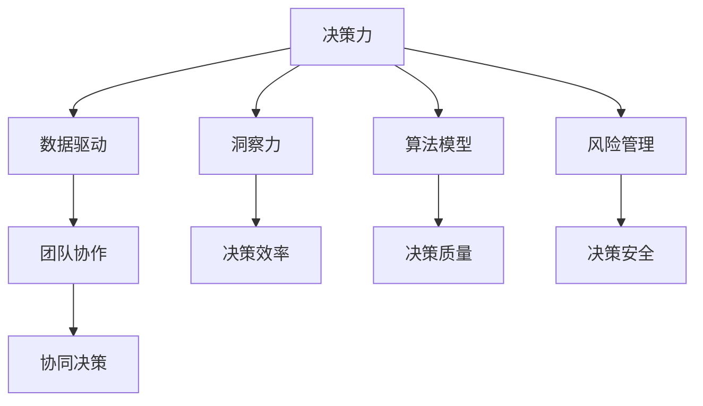

                 

# 洞察力与领导力：决策者的核心竞争力

> 关键词：决策力, 领导力, 数据驱动, 洞察力, 算法模型, 风险管理, 团队协作

## 1. 背景介绍

### 1.1 问题由来

在现代企业和社会管理中，决策者的洞察力和领导力是至关重要的核心竞争力。随着信息技术的飞速发展和数据量的爆炸性增长，传统的基于直觉和经验的决策方式已经难以适应复杂多变的环境。决策者需要掌握更科学、更系统的方法，以高效应对不确定性和竞争压力。

数据驱动决策和人工智能技术的崛起，为决策者提供了新的工具和思路。但数据本身只是手段，如何从海量数据中提取有效信息，并转化为有用的决策依据，才是真正考验决策者洞察力和领导力的关键。本文将从算法模型、数据应用和团队协作等角度，深入探讨决策者的核心竞争力，为数据驱动决策提供科学的方法和工具。

### 1.2 问题核心关键点

- **决策力**：通过科学算法模型和数据分析，提升决策的准确性和及时性。
- **领导力**：引导团队进行有效的数据应用和决策过程，协调多方资源。
- **数据驱动**：利用先进的数据处理和机器学习技术，提升决策的效率和质量。
- **洞察力**：从海量数据中识别出关键信息，发现潜在的趋势和机会。
- **风险管理**：通过算法模型和数据分析，识别和评估决策中的风险。
- **团队协作**：在跨部门和跨领域的协作中，有效沟通和共享数据，提升整体决策能力。

## 2. 核心概念与联系

### 2.1 核心概念概述

为更好地理解决策者的核心竞争力，本节将介绍几个密切相关的核心概念：

- **决策力(Decision-making)**：指在复杂环境中，通过系统化的方法和工具，快速准确地做出合理决策的能力。
- **领导力(Leadership)**：指在组织中，引导团队成员高效协作，实现共同目标的能力。
- **数据驱动(Data-driven)**：指基于数据和事实进行决策，而非单纯依赖经验和直觉。
- **洞察力(Insight)**：指从数据中识别出关键信息和趋势，为决策提供支撑的能力。
- **算法模型(Algorithms & Models)**：指用于数据处理和分析的各类算法和模型，如机器学习、深度学习等。
- **风险管理(Risk Management)**：指评估决策中的潜在风险，制定应对策略，保障决策安全性。
- **团队协作(Collaboration)**：指在跨部门和跨领域的协作中，共享数据和信息，实现协同决策。

这些核心概念之间的逻辑关系可以通过以下Mermaid流程图来展示：



这个流程图展示了几大核心概念之间的相互关系：

1. **决策力**：驱动数据驱动、洞察力、算法模型和风险管理，是整个决策过程的引擎。
2. **数据驱动**：提供洞察力的信息基础，是决策力的关键支持。
3. **洞察力**：提升决策效率和质量，是决策力的核心要素。
4. **算法模型**：提供数据分析和处理的工具，是决策力的技术支撑。
5. **风险管理**：保障决策安全性，是决策力的重要保障。
6. **团队协作**：促进跨部门和跨领域的协同，是决策力的组织基础。

这些概念共同构成了决策者的核心竞争力，通过合理应用，可以实现高效、准确、安全的决策过程。

## 3. 核心算法原理 & 具体操作步骤
### 3.1 算法原理概述

数据驱动决策的算法模型一般包括以下几个步骤：

1. **数据收集**：从不同来源收集相关的数据，确保数据的多样性和完整性。
2. **数据清洗**：处理数据中的噪声、缺失值等，确保数据的质量。
3. **特征提取**：从原始数据中提取出有意义的特征，用于后续分析和建模。
4. **模型训练**：选择合适的算法模型，使用标注数据进行训练，学习数据中的规律和模式。
5. **预测与评估**：对新数据进行预测，并评估模型的性能和效果。
6. **决策制定**：结合业务知识和模型输出，制定最终的决策方案。

### 3.2 算法步骤详解

**Step 1: 数据收集**

数据收集是决策的基础，一般包括内部数据和外部数据：

- 内部数据：如销售数据、客户反馈、生产数据等。
- 外部数据：如市场报告、行业新闻、社会经济指标等。

使用SQL、ETL工具等技术手段，从数据库、API、网站等多种来源收集数据，并建立统一的数据仓库。

**Step 2: 数据清洗**

数据清洗包括处理数据中的噪声、缺失值、异常值等，以确保数据的质量。常用的数据清洗技术包括：

- 数据标准化：如处理日期格式、文本编码等。
- 数据去重：消除重复数据，避免数据冗余。
- 数据填补：处理缺失值，使用插值法、均值填充等方法。
- 数据去噪：使用过滤、平滑等技术，去除数据中的噪声和异常值。

Python中常用的数据清洗库包括Pandas、NumPy等，可以高效处理数据。

**Step 3: 特征提取**

特征提取是将原始数据转换为模型可以使用的特征向量的过程。常用的特征提取方法包括：

- 自然语言处理(NLP)：如分词、词性标注、命名实体识别等。
- 图像处理：如边缘检测、特征提取等。
- 时间序列分析：如移动平均、差分等。

Python中常用的特征提取库包括NLTK、Scikit-learn、OpenCV等。

**Step 4: 模型训练**

模型训练是数据驱动决策的核心步骤，包括选择合适的算法模型和训练数据。常用的算法模型包括：

- 线性回归、逻辑回归、支持向量机(SVM)等传统机器学习模型。
- 随机森林、GBDT、XGBoost等集成学习方法。
- 神经网络、深度学习模型，如卷积神经网络(CNN)、循环神经网络(RNN)、变换器(Transformer)等。

模型训练需要选择合适的优化算法和超参数，使用交叉验证等技术评估模型性能。常用的优化算法包括梯度下降、Adam等，超参数调优可以使用Grid Search、Random Search等方法。

**Step 5: 预测与评估**

预测与评估是模型训练后的关键步骤，使用测试集和新数据对模型进行预测，并评估其性能。常用的评估指标包括：

- 准确率、精确率、召回率、F1分数等。
- ROC曲线、AUC值等。
- MSE、RMSE等回归模型评估指标。

Python中常用的评估库包括Scikit-learn、TensorFlow等。

**Step 6: 决策制定**

决策制定是将模型输出与业务知识结合，制定最终决策的过程。常用的决策制定方法包括：

- 规则引擎：根据业务规则自动生成决策结果。
- 决策树：基于模型输出和业务规则，逐步推理生成决策结果。
- 集成模型：结合多个模型的输出，综合决策结果。

决策制定需要考虑多方面的因素，如业务需求、市场环境、资源限制等，最终形成可执行的决策方案。

### 3.3 算法优缺点

数据驱动决策的算法模型具有以下优点：

- **高效性**：自动化处理大量数据，提升决策效率。
- **准确性**：使用统计分析和机器学习技术，提高决策的准确性。
- **客观性**：基于数据和事实，避免主观偏见，增强决策的科学性。

但同时，这些算法模型也存在以下缺点：

- **数据依赖性**：模型性能依赖于数据质量和数据量，数据不全或偏差可能影响结果。
- **模型复杂性**：复杂模型可能难以解释，缺乏透明度。
- **计算资源消耗大**：大模型和高维特征提取需要大量计算资源。
- **过度依赖技术**：模型训练和调优需要专业知识，对技术要求较高。

## 4. 数学模型和公式 & 详细讲解 & 举例说明
### 4.1 数学模型构建

在数据驱动决策中，常用的数学模型包括线性回归、逻辑回归、决策树、随机森林、神经网络等。以下以线性回归模型为例，介绍数学模型构建过程。

设有一个线性回归问题，需要拟合模型 $y = \theta_0 + \theta_1 x_1 + \theta_2 x_2 + \cdots + \theta_n x_n$，其中 $\theta_0,\theta_1,\cdots,\theta_n$ 为模型参数，$x_1,x_2,\cdots,x_n$ 为特征向量，$y$ 为目标变量。

最小二乘法是常用的线性回归优化方法，目标函数为：

$$
\min_{\theta} \sum_{i=1}^m (y_i - \theta_0 - \theta_1 x_{i1} - \theta_2 x_{i2} - \cdots - \theta_n x_{in})^2
$$

其中 $m$ 为样本数量，$y_i$ 为目标变量，$x_{ij}$ 为特征向量 $x_i$ 的第 $j$ 维数据。

求解该优化问题，得到模型参数 $\theta$，可以用于预测新数据。

### 4.2 公式推导过程

线性回归的目标函数可以重写为矩阵形式：

$$
\min_{\theta} ||X\theta - y||^2_F
$$

其中 $X$ 为特征矩阵，$y$ 为目标向量，$||\cdot||^2_F$ 为矩阵的 Frobenius 范数。

使用梯度下降法求解上述优化问题，目标函数的一阶导数为：

$$
\nabla_\theta \frac{1}{2} ||X\theta - y||^2_F = X^T(X\theta - y)
$$

目标函数的二阶导数为：

$$
\nabla^2_\theta \frac{1}{2} ||X\theta - y||^2_F = X^TX
$$

使用梯度下降法更新模型参数：

$$
\theta = \theta - \eta \nabla_\theta \frac{1}{2} ||X\theta - y||^2_F
$$

其中 $\eta$ 为学习率，通常取值在 $0.001$ 到 $0.01$ 之间。

### 4.3 案例分析与讲解

以预测房价为例，使用线性回归模型进行建模。收集历史房价数据，包含房屋面积、房间数、地理位置等特征，目标变量为房价。将数据标准化，使用 $X$ 表示特征矩阵，$y$ 表示目标向量。

使用梯度下降法求解线性回归模型，得到最优参数 $\theta$，可以使用以下Python代码实现：

```python
import numpy as np
from sklearn.linear_model import LinearRegression

# 假设数据为X, y
X = np.array([[10, 2], [15, 3], [20, 4]])
y = np.array([100, 150, 200])

# 创建线性回归模型
model = LinearRegression()

# 训练模型
model.fit(X, y)

# 预测新数据
X_new = np.array([[12, 3]])
y_new = model.predict(X_new)
print(y_new)
```

这段代码使用Scikit-learn库中的线性回归模型，训练模型并预测新数据，输出结果为预测房价。

## 5. 项目实践：代码实例和详细解释说明
### 5.1 开发环境搭建

在进行数据驱动决策的实践前，我们需要准备好开发环境。以下是使用Python进行PyTorch开发的环境配置流程：

1. 安装Anaconda：从官网下载并安装Anaconda，用于创建独立的Python环境。

2. 创建并激活虚拟环境：
```bash
conda create -n pytorch-env python=3.8 
conda activate pytorch-env
```

3. 安装PyTorch：根据CUDA版本，从官网获取对应的安装命令。例如：
```bash
conda install pytorch torchvision torchaudio cudatoolkit=11.1 -c pytorch -c conda-forge
```

4. 安装TensorFlow：使用pip安装TensorFlow及其依赖库。例如：
```bash
pip install tensorflow
```

5. 安装各类工具包：
```bash
pip install numpy pandas scikit-learn matplotlib tqdm jupyter notebook ipython
```

完成上述步骤后，即可在`pytorch-env`环境中开始项目实践。

### 5.2 源代码详细实现

以下是一个简单的线性回归模型的实现示例：

```python
import numpy as np

class LinearRegression:
    def __init__(self, learning_rate=0.01, n_iter=1000):
        self.learning_rate = learning_rate
        self.n_iter = n_iter
        self.weights = None
        self.bias = None
    
    def fit(self, X, y):
        n_samples, n_features = X.shape
        self.weights = np.zeros(n_features)
        self.bias = 0
        
        for _ in range(self.n_iter):
            y_pred = np.dot(X, self.weights) + self.bias
            dw = (1 / n_samples) * np.dot(X.T, (y_pred - y))
            db = (1 / n_samples) * np.sum(y_pred - y)
            self.weights -= self.learning_rate * dw
            self.bias -= self.learning_rate * db
    
    def predict(self, X):
        return np.dot(X, self.weights) + self.bias

# 测试数据
X = np.array([[1, 2], [3, 4], [5, 6]])
y = np.array([2, 4, 6])

# 创建线性回归模型
model = LinearRegression()

# 训练模型
model.fit(X, y)

# 预测新数据
X_new = np.array([[7, 8]])
y_new = model.predict(X_new)
print(y_new)
```

这段代码实现了一个简单的线性回归模型，通过梯度下降法更新模型参数，并预测新数据。

### 5.3 代码解读与分析

**LinearRegression类**：
- `__init__`方法：初始化学习率和迭代次数，以及模型参数。
- `fit`方法：使用梯度下降法训练模型，更新模型参数。
- `predict`方法：使用模型参数进行新数据的预测。

**测试数据**：
- `X`：特征矩阵。
- `y`：目标向量。

**模型训练**：
- 使用梯度下降法更新模型参数，迭代次数为1000次。

**模型预测**：
- 使用模型参数进行新数据的预测，输出预测结果。

## 6. 实际应用场景

### 6.1 风险管理

金融行业是数据驱动决策的重要应用领域之一，风险管理是其中最核心的环节。金融企业需要实时监测市场变化，识别潜在风险，制定应对策略。

例如，使用线性回归模型进行信用评分，通过分析客户的财务数据、信用历史等，预测客户的违约概率。在训练过程中，可以使用历史违约数据进行标注，使用梯度下降法优化模型参数。

### 6.2 市场营销

市场营销中，数据分析和预测是关键。企业需要根据历史销售数据，预测未来的销售趋势，制定营销策略。

例如，使用时间序列分析模型预测销售额，通过分析销售数据的时间序列规律，预测未来的销售趋势。在训练过程中，可以使用历史销售数据进行标注，使用梯度下降法优化模型参数。

### 6.3 供应链管理

供应链管理需要实时监测供应链各个环节的数据，预测供需关系，优化库存管理。

例如，使用支持向量机(SVM)进行需求预测，通过分析历史订单数据和市场趋势，预测未来的需求量。在训练过程中，可以使用历史订单数据进行标注，使用梯度下降法优化模型参数。

### 6.4 未来应用展望

未来，数据驱动决策的应用领域将更加广泛，涉及各行各业。例如：

- **医疗健康**：使用深度学习模型进行疾病诊断和治疗方案预测，提升医疗服务的质量和效率。
- **交通运输**：使用大数据分析优化交通流量，提高运输效率和安全性。
- **智能制造**：使用工业互联网数据进行设备维护预测，优化生产流程，降低成本。
- **智慧城市**：使用传感器数据进行城市管理优化，提升城市运行效率和居民生活质量。

## 7. 工具和资源推荐
### 7.1 学习资源推荐

为了帮助开发者系统掌握数据驱动决策的理论基础和实践技巧，这里推荐一些优质的学习资源：

1. 《Python数据科学手册》系列博文：由知名数据科学家撰写，深入浅出地介绍了Python数据科学库的使用方法，涵盖数据清洗、特征提取、模型训练等。

2. 《机器学习实战》课程：由Coursera开设的机器学习入门课程，通过实践项目，带你系统掌握机器学习算法和数据处理技术。

3. 《深度学习》书籍：Ian Goodfellow等人所著，全面介绍了深度学习的基本原理和应用，是深度学习领域的经典教材。

4. TensorFlow官方文档：TensorFlow的官方文档，提供了详细的API和案例，帮助你快速上手数据驱动决策的实现。

5. PyTorch官方文档：PyTorch的官方文档，提供了丰富的算法和模型实现，是数据驱动决策的重要工具。

通过对这些资源的学习实践，相信你一定能够快速掌握数据驱动决策的技术和应用，为企业的决策制定提供强有力的支持。

### 7.2 开发工具推荐

高效的开发离不开优秀的工具支持。以下是几款用于数据驱动决策开发的常用工具：

1. Python：作为数据驱动决策的主流语言，Python提供了丰富的数据处理和机器学习库，如Pandas、NumPy、Scikit-learn、TensorFlow等。

2. Jupyter Notebook：提供交互式编程环境，支持代码块、图形、公式等多种格式，方便开发者进行数据分析和模型训练。

3. Scikit-learn：Python中最常用的机器学习库，提供了多种经典的机器学习算法，如线性回归、随机森林、支持向量机等。

4. TensorFlow：由Google主导开发的开源深度学习框架，提供强大的GPU加速和分布式训练能力，适合处理大规模数据。

5. PyTorch：由Facebook主导的深度学习框架，提供动态计算图和灵活的模型设计，适合快速迭代研究。

合理利用这些工具，可以显著提升数据驱动决策的开发效率，加快创新迭代的步伐。

### 7.3 相关论文推荐

数据驱动决策的研究源于学界的持续研究。以下是几篇奠基性的相关论文，推荐阅读：

1. 《Grokking Linear Regression》：详细介绍了线性回归模型的原理和应用，是数据科学入门的经典教材。

2. 《Support Vector Machines》：介绍支持向量机模型的原理和应用，是机器学习领域的经典教材。

3. 《Deep Learning》：Ian Goodfellow等人所著，全面介绍了深度学习的基本原理和应用，是深度学习领域的经典教材。

4. 《Scikit-learn User Guide》：Scikit-learn库的官方文档，详细介绍了库中的各种算法和模型。

5. 《TensorFlow Getting Started》：TensorFlow官方文档中的入门教程，详细介绍了TensorFlow的搭建和使用。

这些论文代表了大数据驱动决策的发展脉络。通过学习这些前沿成果，可以帮助研究者把握学科前进方向，激发更多的创新灵感。

## 8. 总结：未来发展趋势与挑战

### 8.1 总结

本文对数据驱动决策的算法模型进行了全面系统的介绍。首先阐述了数据驱动决策的背景和重要性，明确了算法模型的关键作用。其次，从算法原理到具体操作步骤，详细讲解了数据驱动决策的实现流程，给出了代码实例。同时，本文还探讨了数据驱动决策在金融、市场营销、供应链管理等多个领域的应用前景，展示了数据驱动决策的广阔前景。此外，本文精选了数据驱动决策的相关学习资源，力求为读者提供全方位的技术指引。

通过本文的系统梳理，可以看到，数据驱动决策的算法模型正在成为决策支持系统的重要组成部分，极大地提升了决策的效率和准确性。数据驱动决策技术的应用前景广阔，必将在更多领域发挥重要作用。

### 8.2 未来发展趋势

展望未来，数据驱动决策技术将呈现以下几个发展趋势：

1. **算法模型多样化**：除了传统的机器学习模型，未来的算法模型将更加多样化，如深度学习、强化学习、迁移学习等，为决策提供更多选择。

2. **数据处理自动化**：使用自动机器学习(AutoML)等技术，自动化处理数据预处理、特征提取等任务，提升决策效率。

3. **模型解释性提升**：使用可解释性算法和模型，提升决策过程的透明度和可信度，满足合规要求。

4. **跨领域应用推广**：数据驱动决策技术将在更多领域得到应用，如医疗、金融、智能制造等，为各行各业带来变革性影响。

5. **实时化决策支持**：使用流计算和大数据技术，实现实时数据处理和决策支持，满足业务实时需求。

6. **集成多源数据**：使用数据融合和数据联邦技术，集成多源数据，提升决策的全面性和准确性。

这些趋势凸显了数据驱动决策技术的广阔前景，这些方向的探索发展，必将进一步提升决策系统的性能和应用范围，为人类认知智能的进化带来深远影响。

### 8.3 面临的挑战

尽管数据驱动决策技术已经取得了瞩目成就，但在迈向更加智能化、普适化应用的过程中，它仍面临着诸多挑战：

1. **数据质量问题**：数据质量直接影响决策结果，但现实中的数据往往存在噪声、缺失值等问题，需要进行预处理和清洗。

2. **算法复杂性**：复杂算法模型难以解释，缺乏透明度，可能存在过度拟合等问题，影响决策过程的可信度。

3. **计算资源消耗大**：大规模数据和复杂模型的训练需要大量计算资源，可能存在成本高、效率低等问题。

4. **模型泛化能力不足**：模型在不同数据集上的表现差异较大，存在泛化能力不足的问题，需要进一步提升模型泛化能力。

5. **技术门槛高**：数据驱动决策技术需要较高的技术水平，一般需要专业的数据科学家和工程师，可能存在人才短缺问题。

6. **数据隐私和安全**：数据驱动决策涉及大量敏感数据，存在数据隐私和安全问题，需要建立有效的数据保护机制。

正视数据驱动决策面临的这些挑战，积极应对并寻求突破，将是大数据驱动决策走向成熟的必由之路。相信随着学界和产业界的共同努力，这些挑战终将一一被克服，数据驱动决策必将在构建人机协同的智能系统中扮演越来越重要的角色。

### 8.4 研究展望

面对数据驱动决策技术所面临的种种挑战，未来的研究需要在以下几个方面寻求新的突破：

1. **数据预处理自动化**：使用自动机器学习(AutoML)等技术，自动化处理数据预处理、特征提取等任务，提升决策效率。

2. **模型解释性提升**：使用可解释性算法和模型，提升决策过程的透明度和可信度，满足合规要求。

3. **跨领域应用推广**：数据驱动决策技术将在更多领域得到应用，如医疗、金融、智能制造等，为各行各业带来变革性影响。

4. **实时化决策支持**：使用流计算和大数据技术，实现实时数据处理和决策支持，满足业务实时需求。

5. **集成多源数据**：使用数据融合和数据联邦技术，集成多源数据，提升决策的全面性和准确性。

6. **引入专家知识**：将专家知识和规则嵌入模型中，提升模型的全面性和准确性。

这些研究方向将引领数据驱动决策技术迈向更高的台阶，为构建安全、可靠、可解释、可控的智能系统铺平道路。面向未来，数据驱动决策技术还需要与其他人工智能技术进行更深入的融合，如知识表示、因果推理、强化学习等，多路径协同发力，共同推动智能决策系统的进步。只有勇于创新、敢于突破，才能不断拓展决策系统的边界，让智能决策技术更好地造福人类社会。

## 9. 附录：常见问题与解答

**Q1：数据驱动决策与传统决策方式有何不同？**

A: 数据驱动决策与传统决策方式的不同主要体现在以下几个方面：

1. **数据驱动**：决策过程依赖数据和事实，而非单纯依赖经验和直觉。
2. **模型化**：使用数学模型和算法，对数据进行系统化处理和分析。
3. **自动化**：使用机器学习和自动化技术，提升决策效率和准确性。
4. **透明性**：决策过程可解释，模型和算法透明，便于监督和审核。
5. **风险管理**：通过模型和算法，评估决策中的潜在风险，保障决策安全性。

数据驱动决策利用先进的数据处理和机器学习技术，能够更全面、系统地处理数据，提升决策的效率和准确性。

**Q2：如何选择适合的数据驱动决策算法？**

A: 选择适合的数据驱动决策算法需要考虑以下几个因素：

1. **问题类型**：根据决策问题的类型，选择适合的算法模型，如分类、回归、聚类等。
2. **数据规模**：根据数据的规模和特征维度，选择适合的算法模型，如线性回归、决策树、神经网络等。
3. **计算资源**：根据计算资源的限制，选择适合的算法模型，如随机森林、梯度提升树、深度学习等。
4. **业务需求**：根据业务需求，选择适合的算法模型，如信用评分、销售预测、供应链优化等。

常用的数据驱动决策算法包括：

1. 线性回归、逻辑回归、支持向量机(SVM)等传统机器学习模型。
2. 随机森林、GBDT、XGBoost等集成学习方法。
3 神经网络、深度学习模型，如卷积神经网络(CNN)、循环神经网络(RNN)、变换器(Transformer)等。

通过综合考虑以上因素，选择适合的算法模型，能够实现高效的决策过程。

**Q3：数据驱动决策中的数据质量问题如何处理？**

A: 数据质量问题直接影响决策结果，需要采取以下措施进行处理：

1. **数据清洗**：处理数据中的噪声、缺失值、异常值等，确保数据的质量。常用的数据清洗技术包括数据标准化、去重、填补等。

2. **数据预处理**：对数据进行标准化、归一化等预处理操作，便于后续分析和建模。

3. **数据增强**：通过数据增强技术，如数据合成、数据扩充等，增加数据量和多样性，提升模型泛化能力。

4. **异常检测**：使用异常检测技术，识别和处理异常数据，避免异常数据对模型的影响。

5. **数据验证**：使用交叉验证等技术，验证数据的合理性和有效性，避免数据偏见。

6. **数据治理**：建立数据治理机制，确保数据的完整性、一致性和安全性，提升数据质量。

通过以上措施，可以有效处理数据质量问题，提升数据驱动决策的效果。

**Q4：数据驱动决策中的算法复杂性如何处理？**

A: 数据驱动决策中的算法复杂性是一个重要问题，需要采取以下措施进行处理：

1. **算法简化**：使用简化版的算法模型，如线性回归、决策树等，降低模型复杂度。

2. **特征选择**：选择重要的特征，降低特征维度，提升模型效率。

3. **模型压缩**：使用模型压缩技术，如剪枝、量化等，减小模型规模，提升推理速度。

4. **模型解释**：使用可解释性算法和模型，提升决策过程的透明度和可信度。

5. **自动化调参**：使用自动化调参技术，如Grid Search、Random Search等，优化算法模型。

6. **模型验证**：使用交叉验证等技术，验证模型的泛化能力和鲁棒性，避免过度拟合。

通过以上措施，可以有效处理算法复杂性问题，提升数据驱动决策的效果。

**Q5：数据驱动决策中的计算资源消耗大如何处理？**

A: 数据驱动决策中的计算资源消耗大是一个重要问题，需要采取以下措施进行处理：

1. **模型简化**：使用简化版的算法模型，如线性回归、决策树等，降低模型复杂度。

2. **分布式计算**：使用分布式计算技术，如Hadoop、Spark等，提升计算效率。

3. **模型并行**：使用模型并行技术，如模型并行、数据并行等，提高计算速度。

4. **硬件加速**：使用GPU、TPU等高性能硬件设备，加速模型训练和推理。

5. **模型压缩**：使用模型压缩技术，如剪枝、量化等，减小模型规模，降低计算资源消耗。

6. **优化算法**：使用优化算法，如梯度下降、Adam等，提高模型训练效率。

通过以上措施，可以有效处理计算资源消耗大的问题，提升数据驱动决策的效果。

**Q6：数据驱动决策中的模型泛化能力不足如何处理？**

A: 数据驱动决策中的模型泛化能力不足是一个重要问题，需要采取以下措施进行处理：

1. **数据扩充**：使用数据扩充技术，如数据合成、数据增强等，增加数据量和多样性，提升模型泛化能力。

2. **模型集成**：使用模型集成技术，如Bagging、Boosting等，提升模型泛化能力。

3. **迁移学习**：使用迁移学习技术，从其他相关领域学习知识，提升模型泛化能力。

4. **领域自适应**：使用领域自适应技术，如领域自适应算法等，提升模型在不同领域上的泛化能力。

5. **模型验证**：使用交叉验证等技术，验证模型的泛化能力和鲁棒性，避免过度拟合。

6. **模型融合**：使用模型融合技术，将多个模型的输出进行融合，提升模型泛化能力。

通过以上措施，可以有效处理模型泛化能力不足的问题，提升数据驱动决策的效果。

**Q7：数据驱动决策中的技术门槛高如何处理？**

A: 数据驱动决策中的技术门槛高是一个重要问题，需要采取以下措施进行处理：

1. **培训和学习**：通过培训和学习，提升团队的算法和数据分析能力。

2. **工具支持**：使用简单易用的工具和平台，降低技术门槛，如Jupyter Notebook、Scikit-learn、TensorFlow等。

3. **自动化技术**：使用自动化技术，如自动机器学习(AutoML)等，降低技术门槛。

4. **社区支持**：加入数据科学社区，获取技术支持和资源，提升团队的技术水平。

5. **团队协作**：加强团队协作，建立跨部门协作机制，提升团队的技术水平。

通过以上措施，可以有效处理技术门槛高的问题，提升数据驱动决策的效果。

**Q8：数据驱动决策中的数据隐私和安全如何处理？**

A: 数据驱动决策中的数据隐私和安全是一个重要问题，需要采取以下措施进行处理：

1. **数据匿名化**：使用数据匿名化技术，去除或模糊处理敏感信息，保护数据隐私。

2. **数据加密**：使用数据加密技术，保护数据传输和存储的安全性。

3. **数据访问控制**：使用数据访问控制技术，限制数据的访问权限，保护数据安全。

4. **安全审计**：建立数据安全审计机制，定期审计数据访问和使用情况，保护数据安全。

5. **合规管理**：建立数据合规管理机制，确保数据使用符合法律法规要求。

通过以上措施，可以有效处理数据隐私和安全问题，提升数据驱动决策的效果。

---
作者：禅与计算机程序设计艺术 / Zen and the Art of Computer Programming

