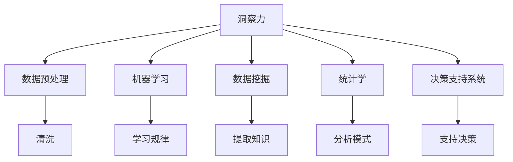

                 

# 洞察力：知识创新的领航员

在现代社会，知识和信息爆炸式的增长对个人和组织提出了前所未有的挑战和机遇。如何从海量数据中提取有价值的洞察力，成为推动知识创新和决策的关键。本文将从背景、核心概念、算法原理、具体实现、实际应用、工具推荐、总结和展望等多个维度，全面探讨洞察力的获取和利用，为知识创新和决策提供方法论和工具支持。

## 1. 背景介绍

### 1.1 问题由来
随着数字化时代的到来，数据无处不在。从社交媒体到金融市场，从科学研究到企业运营，每个角落都充满了数据。然而，数据本身并不具有价值，只有通过深度的洞察力分析，才能转化为实际的决策依据。洞察力（Insight）是理解数据背后模式、关系和趋势的能力，是知识创新的核心要素。

### 1.2 问题核心关键点
获取和利用洞察力的过程涉及多个步骤：
1. **数据采集**：获取高质量、可信任的数据。
2. **数据预处理**：清洗、转换和归一化数据。
3. **数据分析**：采用统计学、机器学习和数据挖掘技术进行分析。
4. **洞察力发现**：识别出数据中的模式、关系和趋势。
5. **决策支持**：将洞察力转化为实际决策依据。

本文将深入探讨如何利用这些步骤，高效地获取和利用洞察力，为知识创新和决策提供支持。

## 2. 核心概念与联系

### 2.1 核心概念概述

为更好地理解洞察力的获取和利用，本节将介绍几个核心概念：

- **洞察力（Insight）**：通过分析数据获得的，对于过去、现在和未来的理解。洞察力帮助决策者做出更好的决策。
- **数据预处理（Data Preprocessing）**：清洗、转换和归一化数据，使之适合于后续分析。
- **机器学习（Machine Learning）**：一种从数据中自动学习规律和模式的技术，为洞察力发现提供手段。
- **数据挖掘（Data Mining）**：从数据中提取有用信息和知识的过程，为洞察力发现提供方法。
- **统计学（Statistics）**：分析和解释数据以发现和验证数据中的模式和关系，为洞察力发现提供工具。
- **决策支持系统（Decision Support System, DSS）**：利用洞察力为决策者提供支持的系统，增强决策的科学性和效率。

这些概念之间的逻辑关系可以通过以下Mermaid流程图来展示：



这个流程图展示了洞察力获取和利用的核心流程：

1. 从数据中获取洞察力。
2. 对数据进行预处理，清洗和转换数据。
3. 应用机器学习技术，自动学习规律和模式。
4. 通过数据挖掘技术，提取有用知识和信息。
5. 利用统计学方法，分析和解释数据中的模式和关系。
6. 将洞察力集成到决策支持系统中，辅助决策。

## 3. 核心算法原理 & 具体操作步骤

### 3.1 算法原理概述

洞察力的获取和利用，本质上是一个数据驱动的决策过程。其核心思想是：通过数据预处理、统计分析、机器学习和数据挖掘等技术手段，从数据中发现模式、关系和趋势，辅助决策者做出更好的决策。

形式化地，假设原始数据集为 $D=\{(x_i,y_i)\}_{i=1}^N$，其中 $x_i$ 为输入特征，$y_i$ 为标签或目标变量。洞察力发现的算法框架可以表示为：

1. **数据预处理**：清洗和转换原始数据 $D$ 为模型可接受的格式 $D'$。
2. **特征工程**：选择合适的特征 $x'$，使得 $x'$ 能更好地代表 $x_i$。
3. **模型训练**：使用机器学习算法，在预处理后的数据上训练模型 $M$。
4. **模型评估**：评估模型 $M$ 的性能，确保其能有效发现数据中的规律和模式。
5. **洞察力发现**：利用模型 $M$ 对新数据进行预测和分析，发现数据中的洞察力。
6. **决策支持**：将洞察力应用于决策支持系统，辅助决策者做出更好的决策。

### 3.2 算法步骤详解

基于上述算法框架，洞察力的获取和利用一般包括以下几个关键步骤：

**Step 1: 数据采集**
- 选择合适的数据源，收集数据。
- 确保数据的准确性、完整性和一致性。
- 存储和管理数据，便于后续处理和分析。

**Step 2: 数据预处理**
- 清洗数据，去除噪声和异常值。
- 转换数据，标准化和归一化。
- 特征选择，提取对洞察力发现有价值的特征。

**Step 3: 特征工程**
- 特征提取：将原始数据转换为模型可接受的特征。
- 特征转换：对特征进行转换，如PCA、线性变换等。
- 特征融合：将多个特征融合，提高模型的表达能力。

**Step 4: 模型训练**
- 选择合适的模型，如线性回归、决策树、神经网络等。
- 划分数据集，进行训练和验证。
- 调整模型参数，优化模型性能。

**Step 5: 洞察力发现**
- 使用训练好的模型对新数据进行预测和分析。
- 识别数据中的模式、关系和趋势。
- 可视化洞察力结果，帮助理解数据。

**Step 6: 决策支持**
- 将洞察力集成到决策支持系统中。
- 利用洞察力辅助决策者做出更好的决策。
- 监测和评估决策效果，不断优化洞察力模型。

### 3.3 算法优缺点

洞察力的获取和利用方法具有以下优点：
1. 数据驱动：利用数据自动发现规律和模式，提高决策的科学性和准确性。
2. 自动化：使用机器学习算法，减少人工干预，提高效率。
3. 可解释性：利用统计方法和可视化工具，理解模型的决策过程。
4. 灵活性：适用于各种数据类型和分析任务，灵活性高。

同时，该方法也存在一定的局限性：
1. 依赖高质量数据：数据质量和完整性对洞察力发现至关重要。
2. 模型复杂度高：高质量的模型往往复杂，需要较强的计算资源。
3. 存在过拟合风险：模型过于复杂或训练数据不足，可能造成过拟合。
4. 模型偏见：模型可能继承数据中的偏见，影响决策的公正性。
5. 决策透明性不足：复杂模型难以理解，可能存在“黑箱”问题。

尽管存在这些局限性，但整体而言，洞察力获取和利用方法是大数据时代知识创新和决策的重要工具。

### 3.4 算法应用领域

洞察力获取和利用方法在多个领域得到广泛应用，包括但不限于：

- **金融市场**：利用历史数据和实时数据，预测市场趋势，辅助投资决策。
- **医疗健康**：分析病人数据，发现疾病模式，提高诊疗准确性。
- **零售行业**：分析消费者行为，优化产品推荐和定价策略。
- **制造业**：通过分析生产数据，优化生产流程，提高生产效率。
- **环境监测**：利用环境数据，预测气候变化，支持环保政策制定。

## 4. 数学模型和公式 & 详细讲解 & 举例说明

### 4.1 数学模型构建

本节将使用数学语言对洞察力的获取和利用进行更加严格的刻画。

假设原始数据集为 $D=\{(x_i,y_i)\}_{i=1}^N$，其中 $x_i$ 为输入特征，$y_i$ 为标签或目标变量。

定义洞察力发现的算法框架为：
1. **数据预处理**：清洗和转换原始数据 $D$ 为模型可接受的格式 $D'$。
2. **特征工程**：选择合适的特征 $x'$，使得 $x'$ 能更好地代表 $x_i$。
3. **模型训练**：使用机器学习算法，在预处理后的数据上训练模型 $M$。
4. **模型评估**：评估模型 $M$ 的性能，确保其能有效发现数据中的规律和模式。
5. **洞察力发现**：利用模型 $M$ 对新数据进行预测和分析，发现数据中的洞察力。
6. **决策支持**：将洞察力集成到决策支持系统中，辅助决策者做出更好的决策。

### 4.2 公式推导过程

以下我们以线性回归模型为例，推导数据预处理和模型训练的基本公式。

假设原始数据集 $D=\{(x_i,y_i)\}_{i=1}^N$，其中 $x_i$ 为输入特征，$y_i$ 为标签或目标变量。定义线性回归模型为 $M_{\theta}(x) = \theta^T x$，其中 $\theta$ 为模型参数。

假设预处理后的数据为 $D'=\{(x'_i,y_i)\}_{i=1}^N$，其中 $x'_i$ 为预处理后的特征。则线性回归模型可以表示为：

$$
M_{\theta}(x) = \theta^T x = \theta^T A(x')
$$

其中 $A$ 为特征转换矩阵，将 $x'$ 转换为线性回归模型的输入。

定义损失函数为均方误差损失：

$$
\mathcal{L}(\theta) = \frac{1}{N} \sum_{i=1}^N (y_i - M_{\theta}(x_i))^2
$$

目标是最小化损失函数：

$$
\theta^* = \mathop{\arg\min}_{\theta} \mathcal{L}(\theta)
$$

通过梯度下降算法，可以求解上述优化问题，得到最优参数 $\theta^*$。

### 4.3 案例分析与讲解

假设我们有一组房屋销售数据，其中包含房屋面积、位置、年龄等信息，目标变量为房屋售价。我们的任务是通过这些数据预测房屋售价，为房地产市场提供洞察力支持。

1. **数据预处理**：清洗和转换原始数据，去除噪声和异常值。
2. **特征工程**：选择和提取有意义的特征，如面积、位置、年龄等。
3. **模型训练**：使用线性回归模型，训练参数 $\theta$。
4. **模型评估**：在验证集上评估模型性能，确保其有效性。
5. **洞察力发现**：使用训练好的模型对新数据进行预测和分析，发现房屋售价的模式和趋势。
6. **决策支持**：根据洞察力结果，为房地产开发商和买家提供决策支持。

通过上述步骤，我们能够从房地产数据中发现洞察力，为市场分析提供科学依据。

## 5. 项目实践：代码实例和详细解释说明

### 5.1 开发环境搭建

在进行洞察力获取和利用实践前，我们需要准备好开发环境。以下是使用Python进行Scikit-learn开发的示例环境配置流程：

1. 安装Anaconda：从官网下载并安装Anaconda，用于创建独立的Python环境。

2. 创建并激活虚拟环境：
```bash
conda create -n insight-env python=3.8 
conda activate insight-env
```

3. 安装Scikit-learn：
```bash
pip install scikit-learn pandas numpy matplotlib seaborn jupyter notebook ipython
```

4. 安装各类工具包：
```bash
pip install scikit-learn pandas numpy matplotlib seaborn jupyter notebook ipython
```

完成上述步骤后，即可在`insight-env`环境中开始洞察力获取和利用实践。

### 5.2 源代码详细实现

下面我们以房屋销售价格预测任务为例，给出使用Scikit-learn进行线性回归的Python代码实现。

首先，导入必要的库：

```python
import pandas as pd
import numpy as np
import matplotlib.pyplot as plt
from sklearn.model_selection import train_test_split
from sklearn.linear_model import LinearRegression
from sklearn.metrics import mean_squared_error, r2_score
```

然后，准备数据：

```python
# 读取数据
data = pd.read_csv('house_sales.csv')

# 处理缺失值和异常值
data.fillna(method='ffill', inplace=True)

# 划分训练集和测试集
X = data.drop('price', axis=1)
y = data['price']
X_train, X_test, y_train, y_test = train_test_split(X, y, test_size=0.2, random_state=42)

# 标准化数据
from sklearn.preprocessing import StandardScaler
scaler = StandardScaler()
X_train = scaler.fit_transform(X_train)
X_test = scaler.transform(X_test)
```

接着，训练模型：

```python
# 训练线性回归模型
model = LinearRegression()
model.fit(X_train, y_train)
```

然后，评估模型：

```python
# 预测并评估
y_pred = model.predict(X_test)
rmse = np.sqrt(mean_squared_error(y_test, y_pred))
r2 = r2_score(y_test, y_pred)
print(f'RMSE: {rmse:.2f}, R^2: {r2:.2f}')
```

最后，可视化结果：

```python
# 绘制散点图和预测曲线
plt.scatter(X_test, y_test)
plt.plot(X_test, y_pred, color='red')
plt.xlabel('特征值')
plt.ylabel('房价')
plt.show()
```

以上就是使用Scikit-learn进行线性回归的完整代码实现。可以看到，Scikit-learn提供了便捷的数据预处理和模型训练功能，极大简化了洞察力获取和利用的开发过程。

### 5.3 代码解读与分析

让我们再详细解读一下关键代码的实现细节：

**数据预处理**：
- 使用`fillna`方法处理缺失值，采用前向填充方式。
- 划分训练集和测试集，使用`train_test_split`方法。

**特征工程**：
- 使用`StandardScaler`标准化数据，将特征值转换为标准正态分布。

**模型训练**：
- 使用`LinearRegression`模型，训练参数。

**模型评估**：
- 计算均方根误差（RMSE）和决定系数（R^2）评估模型性能。

**可视化结果**：
- 使用`plt`库绘制散点图和预测曲线，展示模型的预测效果。

通过上述代码，我们可以高效地获取和利用洞察力，辅助决策者做出更好的决策。

## 6. 实际应用场景

### 6.1 智能投资分析

在金融领域，洞察力的获取和利用可以显著提升投资决策的科学性和准确性。通过分析历史市场数据和实时新闻，洞察力模型可以预测股票、债券等资产的价格波动，为投资者提供决策依据。

具体而言，可以收集历史股价、交易量、财务报表等数据，构建特征集合。利用机器学习算法，如时间序列预测模型、因子模型等，训练洞察力模型。在实际应用中，洞察力模型可以实时分析市场新闻和交易数据，预测股票价格变化，辅助投资者进行买卖决策。

### 6.2 医疗健康监测

在医疗领域，洞察力的获取和利用可以提升疾病的早期诊断和个性化治疗的效果。通过分析病人的生理数据、基因信息和生活习惯，洞察力模型可以预测疾病风险，为医生提供诊断和治疗建议。

具体而言，可以收集病人的生理指标、基因序列、生活习惯等数据，构建特征集合。利用机器学习算法，如分类模型、回归模型等，训练洞察力模型。在实际应用中，洞察力模型可以分析病人的实时生理数据，预测其是否患有某种疾病，辅助医生进行早期诊断和治疗。

### 6.3 智能客服系统

在客服领域，洞察力的获取和利用可以显著提升客户服务的质量和效率。通过分析客户的历史对话记录和反馈，洞察力模型可以理解客户需求，提供个性化服务。

具体而言，可以收集客户的历史对话记录和反馈，构建特征集合。利用机器学习算法，如序列建模、情感分析等，训练洞察力模型。在实际应用中，洞察力模型可以分析客户的实时对话，理解其需求，提供个性化的服务建议，提升客户满意度。

### 6.4 未来应用展望

随着洞察力获取和利用方法的不断进步，其应用领域将进一步扩展，带来更深远的变革。

在智慧城市治理中，洞察力模型可以实时分析交通流量、环境数据、社会动态等，优化城市管理，提升公共服务质量。在环境保护中，洞察力模型可以分析气候数据、生态信息等，预测环境变化，支持环保政策制定。在教育领域，洞察力模型可以分析学生行为数据，提供个性化教育方案，提高教育质量。

未来，伴随技术的不断发展，洞察力获取和利用方法将与更多人工智能技术进行融合，如知识表示、因果推理、强化学习等，带来更多创新应用。

## 7. 工具和资源推荐

### 7.1 学习资源推荐

为了帮助开发者系统掌握洞察力的获取和利用方法，这里推荐一些优质的学习资源：

1. 《数据科学入门：从Python到机器学习》系列博文：详细介绍了数据分析、数据预处理、机器学习等基础知识。

2. 《深度学习》在线课程：由斯坦福大学开设的深度学习课程，涵盖了深度学习的基本概念和经典算法。

3. 《数据挖掘与统计学习》书籍：介绍数据挖掘和统计学习的经典算法，适合深入理解洞察力获取和利用的数学基础。

4. Kaggle：世界知名的数据科学竞赛平台，提供丰富的数据集和案例分析，帮助开发者实战练习。

5. PyTorch官方文档：深入介绍PyTorch框架，包括数据预处理、模型训练、模型评估等核心功能。

通过对这些资源的学习实践，相信你一定能够快速掌握洞察力的获取和利用方法，并将其应用于实际问题中。

### 7.2 开发工具推荐

高效的开发离不开优秀的工具支持。以下是几款用于洞察力获取和利用开发的常用工具：

1. Python：通用编程语言，易于开发和扩展。
2. Scikit-learn：Python的机器学习库，提供丰富的数据预处理和模型训练功能。
3. Pandas：Python的数据处理库，支持快速、高效的数据清洗和转换。
4. Matplotlib和Seaborn：Python的可视化库，支持数据可视化和交互式展示。
5. TensorFlow和PyTorch：深度学习框架，支持复杂模型的训练和推理。
6. Jupyter Notebook：交互式编程环境，支持代码块、代码执行、结果展示等。

合理利用这些工具，可以显著提升洞察力获取和利用的开发效率，加速技术创新。

### 7.3 相关论文推荐

洞察力的获取和利用方法的发展源于学界的持续研究。以下是几篇奠基性的相关论文，推荐阅读：

1. An Introduction to Statistical Learning（《统计学习入门》）：介绍统计学习的经典算法，适合初学者入门。
2. Deep Learning（《深度学习》）：深度学习领域的经典教材，涵盖深度学习的基本概念和算法。
3. Data Mining：Concepts and Techniques（《数据挖掘：概念与技术》）：介绍数据挖掘的经典算法，适合深入理解数据预处理和分析方法。
4. Machine Learning Yearning：Andrew Ng的机器学习实战指南，涵盖机器学习的基本概念和实战技巧。
5. Insight Mining（《洞察力挖掘》）：专门介绍洞察力挖掘的学术论文集，涵盖最新的洞察力获取和利用方法。

这些论文代表了大数据时代洞察力获取和利用方法的发展脉络。通过学习这些前沿成果，可以帮助研究者把握学科前进方向，激发更多的创新灵感。

## 8. 总结：未来发展趋势与挑战

### 8.1 研究成果总结

本文对洞察力的获取和利用方法进行了全面系统的介绍。首先阐述了洞察力获取和利用的背景、核心概念和算法框架，明确了洞察力在知识创新和决策中的重要性。其次，从数据预处理、特征工程、模型训练、洞察力发现等多个维度，详细讲解了洞察力获取和利用的具体步骤和实现方法。最后，本文还探讨了洞察力在多个实际领域的应用前景，以及未来发展的趋势和挑战。

通过本文的系统梳理，可以看到，洞察力的获取和利用方法正在成为大数据时代知识创新和决策的重要工具，极大地拓展了数据分析和机器学习的应用范围，为社会各行各业带来了深刻的变革。

### 8.2 未来发展趋势

展望未来，洞察力的获取和利用方法将呈现以下几个发展趋势：

1. 数据类型多样化：未来将拓展到更多数据类型，如图像、视频、时间序列等，提升数据的全面性和多样性。
2. 模型复杂度提升：随着深度学习的发展，模型复杂度将进一步提升，提供更准确、更精细的洞察力。
3. 自动化水平提高：自动化和智能化的数据预处理、特征工程和模型训练技术将不断进步，减少人工干预。
4. 实时性增强：实时数据流处理和流式学习技术将使洞察力发现变得更加及时、高效。
5. 跨领域融合：与更多人工智能技术的融合，如知识表示、因果推理、强化学习等，拓展洞察力获取和利用方法的适用范围。

### 8.3 面临的挑战

尽管洞察力的获取和利用方法已经取得了瞩目成就，但在迈向更加智能化、普适化应用的过程中，仍面临诸多挑战：

1. 数据隐私和安全：大规模数据采集和使用涉及隐私和安全问题，需要合理的隐私保护和数据安全措施。
2. 数据质量和标注：高质量数据的获取和标注对洞察力发现至关重要，但获取高质量数据和标注的成本较高。
3. 模型复杂性：高质量的洞察力模型往往复杂，需要较强的计算资源和专业知识。
4. 可解释性：复杂模型难以解释其决策过程，可能存在“黑箱”问题，需要增强模型的可解释性。
5. 实时性要求：某些应用场景需要实时洞察力，如何提高模型的实时性是一个挑战。

### 8.4 研究展望

面对洞察力获取和利用方法所面临的挑战，未来的研究需要在以下几个方面寻求新的突破：

1. 数据隐私和安全：开发更好的数据隐私保护技术，确保数据使用过程中的安全性。
2. 数据标注自动化：利用半监督学习、主动学习等技术，自动标注数据，降低标注成本。
3. 模型压缩和加速：开发更高效的模型压缩和加速技术，提升模型的实时性和资源利用率。
4. 模型可解释性：开发可解释性强的模型，增强模型的透明度和可信度。
5. 实时数据流处理：研究实时数据流处理和流式学习技术，提升洞察力的实时性。

这些研究方向的探索，必将引领洞察力获取和利用方法迈向更高的台阶，为知识创新和决策提供更强大的技术支持。

## 9. 附录：常见问题与解答

**Q1：如何选择合适的数据源？**

A: 选择合适的数据源需要考虑数据的准确性、完整性、时效性和可用性。通常可以优先考虑公开数据集，如政府公开数据、学术数据等，确保数据质量和合法性。同时，可以通过数据爬虫等方式获取更多数据，但需要确保符合法律法规和伦理标准。

**Q2：数据预处理过程中需要注意哪些问题？**

A: 数据预处理是洞察力获取和利用中非常重要的一环。需要注意：
1. 数据清洗：去除噪声和异常值，确保数据质量。
2. 数据转换：将数据转换为模型可接受的格式，如标准化、归一化、特征工程等。
3. 特征选择：选择有意义的特征，避免过拟合。

**Q3：如何选择和训练合适的模型？**

A: 选择合适的模型需要考虑数据类型、任务类型和模型复杂度。通常可以从简单模型（如线性回归、逻辑回归）开始，逐步尝试更复杂的模型（如神经网络、决策树等）。训练模型时，需要进行交叉验证和超参数调优，选择最优模型。

**Q4：如何评估洞察力模型的性能？**

A: 洞察力模型的评估需要考虑多方面的指标，如准确率、召回率、F1分数、RMSE、R^2等。通常需要进行交叉验证和模型评估，选择最优模型。同时，需要可视化模型结果，理解模型的决策过程和洞察力发现。

**Q5：如何确保洞察力模型的可解释性？**

A: 确保洞察力模型的可解释性，需要选择合适的模型和算法，如决策树、线性回归等。同时，可以利用LIME、SHAP等工具，对模型进行可视化解释。

---

作者：禅与计算机程序设计艺术 / Zen and the Art of Computer Programming

