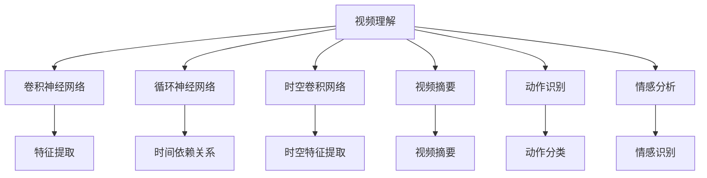

                 

# 深度学习在视频理解与分析中的应用

> 关键词：视频理解,视频分析,深度学习,卷积神经网络,循环神经网络,时空卷积网络,视频摘要,动作识别,情感分析

## 1. 背景介绍

### 1.1 问题由来
随着互联网和多媒体技术的飞速发展，视频数据变得越来越重要。视频不仅是信息传播的主要载体，也蕴含着丰富的语义和情境信息。如何从视频中自动抽取和理解信息，成为了当前研究的热点。传统的图像识别和文本分析方法难以充分挖掘视频数据的价值，因此需要新的技术手段。

深度学习技术在图像、语音和文本等领域取得了重大突破，也逐步应用于视频理解和分析。通过学习大量带标签的视频数据，深度学习模型可以自动学习视频数据的特征，进行目标检测、动作识别、情感分析、视频摘要等任务。

### 1.2 问题核心关键点
深度学习在视频理解与分析中的应用主要包括以下几个方面：
- 卷积神经网络(CNN)：用于处理视频帧序列的特征提取。
- 循环神经网络(RNN)：用于捕捉视频序列中的时间依赖关系。
- 时空卷积网络(3D-CNN)：同时考虑时间和空间维度，适合视频序列建模。
- 动作识别：利用视频数据识别和分类人体动作。
- 视频摘要：自动生成视频内容的摘要，提升视频检索和推荐效率。
- 情感分析：分析视频中人物情感和场景氛围，应用于视频内容的情感标签生成。

这些问题核心关键点将帮助读者全面了解深度学习在视频理解与分析中的重要作用。

### 1.3 问题研究意义
深度学习在视频理解与分析中的应用，对于推动视频技术的智能化发展，提升人类对视频内容的理解能力具有重要意义：

1. 降低视频内容处理的成本。深度学习模型可以自动化地分析和处理视频内容，减少人工干预。
2. 提升视频分析的准确性。深度学习模型可以学习视频数据的复杂特征，实现更加精确的目标检测和动作识别。
3. 加速视频数据的挖掘利用。通过自动化视频摘要和情感分析，提升视频检索和推荐的效率和效果。
4. 促进跨领域技术融合。深度学习在视频理解中的成功经验，可以推广到其他领域，如医疗、金融等。
5. 增强视频技术的普适性。深度学习模型可以处理各种类型的视频内容，提高视频技术的普及程度。

## 2. 核心概念与联系

### 2.1 核心概念概述

为更好地理解深度学习在视频理解与分析中的应用，本节将介绍几个密切相关的核心概念：

- 视频理解(Video Understanding)：通过深度学习模型自动分析视频数据，从中抽取语义和情境信息的过程。
- 视频分析(Video Analysis)：利用深度学习模型对视频进行分类、标注、跟踪等分析任务。
- 卷积神经网络(Convolutional Neural Networks, CNN)：利用卷积操作提取图像特征，可以用于视频帧序列的特征提取。
- 循环神经网络(Recurrent Neural Networks, RNN)：利用循环结构捕捉时间序列数据中的依赖关系，适合处理视频序列。
- 时空卷积网络(3D-CNN)：同时考虑时间和空间维度的深度学习模型，适合处理视频序列数据。
- 视频摘要(Video Summarization)：自动生成视频内容的摘要，提升视频检索和推荐效率。
- 动作识别(Action Recognition)：识别和分类视频中的人体动作，适合视频分析和理解。
- 情感分析(Sentiment Analysis)：分析视频中人物情感和场景氛围，应用于视频内容的情感标签生成。

这些核心概念之间的逻辑关系可以通过以下Mermaid流程图来展示：



这个流程图展示了大语言模型的核心概念及其之间的关系：

1. 视频理解是核心目标，通过各种深度学习模型提取视频特征。
2. 卷积神经网络、循环神经网络和时空卷积网络是常用的特征提取模型。
3. 视频摘要、动作识别和情感分析是具体的应用场景。
4. 特征提取模型为应用场景提供了必要的语义和情境信息。

这些概念共同构成了视频理解与分析的技术框架，使得深度学习模型能够高效、准确地处理视频数据。

## 3. 核心算法原理 & 具体操作步骤
### 3.1 算法原理概述

深度学习在视频理解与分析中的应用，通常包括以下几个关键步骤：

- 特征提取：利用卷积神经网络、循环神经网络或时空卷积网络，对视频帧序列进行特征提取。
- 时间建模：使用循环神经网络或其他时间序列模型，捕捉视频序列中的时间依赖关系。
- 数据增强：通过旋转、缩放、添加噪声等方式，扩充训练集多样性，避免过拟合。
- 模型训练：利用标注数据，对特征提取和时间建模模型进行有监督的训练，优化模型参数。
- 模型融合：将不同深度学习模型的输出进行融合，提升整体性能。
- 模型部署：将训练好的模型部署到实际应用中，进行实时推理和分析。

### 3.2 算法步骤详解

以视频摘要为例，介绍深度学习在视频理解与分析中的具体应用流程：

**Step 1: 数据准备**
- 收集视频数据集，标注关键帧或视频片段。
- 将视频数据划分为训练集、验证集和测试集。
- 对视频数据进行预处理，如分辨率调整、帧率转换、视频剪辑等。

**Step 2: 特征提取**
- 使用卷积神经网络对视频帧序列进行特征提取。
- 利用3D-CNN模型同时考虑时间和空间维度，提取更为全面的特征表示。
- 对提取的特征进行编码，得到可用于下游任务的高维特征向量。

**Step 3: 时间建模**
- 使用循环神经网络或其他时间序列模型，对视频帧序列进行建模。
- 利用RNN或LSTM等模型捕捉视频序列中的时间依赖关系。
- 对模型参数进行优化，最小化视频帧序列的损失函数。

**Step 4: 数据增强**
- 通过旋转、缩放、添加噪声等方式，扩充训练集的多样性。
- 利用数据增强技术，提高模型对不同场景和光照条件下的鲁棒性。

**Step 5: 模型训练**
- 将特征提取和时间建模模型进行串联，构建端到端的视频摘要模型。
- 利用标注数据，对模型进行有监督的训练，最小化视频摘要的损失函数。
- 使用合适的优化器，如AdamW或SGD，设置合适的学习率和批大小。

**Step 6: 模型融合**
- 对多个视频摘要模型进行输出融合，如通过权重叠加或注意力机制。
- 利用模型融合技术，提升整体性能和鲁棒性。

**Step 7: 模型部署**
- 将训练好的视频摘要模型部署到实际应用中，进行实时推理和分析。
- 利用GPU或TPU等高性能设备，提升推理速度和计算效率。

### 3.3 算法优缺点

深度学习在视频理解与分析中的应用，具有以下优点：

- 高效提取视频特征。卷积神经网络、循环神经网络和时空卷积网络等模型，能够高效提取视频帧序列的特征表示。
- 捕捉时间依赖关系。循环神经网络等模型能够捕捉视频序列中的时间依赖关系，提升模型的理解能力。
- 自动学习复杂模式。深度学习模型能够自动学习视频数据的复杂模式，无需人工干预。
- 实时性高。通过模型部署，可以在实时场景中进行推理和分析，满足实时性要求。

同时，该方法也存在一些局限性：

- 数据需求量大。视频数据通常占用大量存储空间和计算资源，需要大量标注数据进行训练。
- 模型复杂度高。视频数据的复杂性导致深度学习模型的参数量较大，训练和推理计算成本高。
- 模型泛化性有限。不同领域和场景下的视频数据差异较大，模型泛化能力有限。
- 可解释性不足。深度学习模型的内部机制难以解释，难以进行人工干预和调试。

尽管存在这些局限性，但就目前而言，深度学习在视频理解与分析中的应用仍然是最主流的方法。未来相关研究的重点在于如何进一步降低数据需求，提高模型泛化能力和可解释性，同时兼顾实时性和计算效率。

### 3.4 算法应用领域

深度学习在视频理解与分析中的应用，已经在诸多领域得到了广泛的应用，例如：

- 视频监控：通过视频监控视频，进行目标检测、异常检测等任务。
- 视频检索：自动对视频内容进行标注，提高检索效率。
- 体育分析：对体育比赛视频进行实时分析，提取动作特征，进行比赛结果预测。
- 医疗影像：利用视频数据进行疾病诊断和手术辅助。
- 教育培训：对视频教学内容进行分析和评价，提升教学质量。
- 娱乐分析：分析影视剧内容，提取情感和主题信息，提升内容推荐效果。

除了上述这些经典应用外，深度学习在视频理解与分析中还有很多创新性应用，如视频生成、视频问答、视频分类等，为视频技术的发展带来了新的可能性。

## 4. 数学模型和公式 & 详细讲解 & 举例说明

### 4.1 数学模型构建

为了更严格地描述深度学习在视频理解与分析中的应用，我们通过数学语言对核心模型进行建模。

设输入视频帧序列为 $X = \{x_1, x_2, ..., x_T\}$，其中 $T$ 为视频长度。输出为视频摘要 $Y$。我们假设特征提取模型为 $H$，时间建模模型为 $G$，则视频摘要模型可以表示为：

$$
Y = G(H(X))
$$

其中，$H$ 为特征提取模型，$G$ 为时间建模模型。

设特征提取模型 $H$ 的参数为 $\theta_H$，时间建模模型 $G$ 的参数为 $\theta_G$，则模型的损失函数为：

$$
\mathcal{L}(\theta_H, \theta_G) = \frac{1}{N}\sum_{i=1}^N \ell(H(X_i), Y_i)
$$

其中，$\ell$ 为损失函数，$N$ 为训练样本数。

### 4.2 公式推导过程

以视频摘要为例，推导常见的基于深度学习的视频摘要模型的损失函数。

假设视频摘要模型 $G(H(X))$ 的输出为 $Y$，其中 $Y$ 为视频摘要的编码表示。我们将损失函数 $\ell$ 设置为交叉熵损失：

$$
\ell(Y, Y^*) = -\sum_{i=1}^T y_i \log(\hat{y}_i)
$$

其中，$y_i$ 为视频摘要的实际标签，$\hat{y}_i$ 为模型预测的标签。

由于训练集 $D$ 包含 $N$ 个视频摘要的标注数据，我们通过均值化损失函数得到模型在训练集上的经验风险：

$$
\mathcal{L}(\theta_H, \theta_G) = \frac{1}{N}\sum_{i=1}^N \ell(H(X_i), Y_i)
$$

在得到损失函数后，我们可以通过梯度下降等优化算法对模型进行训练，最小化损失函数。例如，使用AdamW优化器，更新模型参数的公式为：

$$
\theta_H \leftarrow \theta_H - \eta_H \nabla_{\theta_H}\mathcal{L}(\theta_H, \theta_G) - \eta_H\lambda\theta_H
$$

$$
\theta_G \leftarrow \theta_G - \eta_G \nabla_{\theta_G}\mathcal{L}(\theta_H, \theta_G) - \eta_G\lambda\theta_G
$$

其中，$\eta_H$ 和 $\eta_G$ 为学习率，$\lambda$ 为正则化系数。

### 4.3 案例分析与讲解

以动作识别为例，介绍基于深度学习的动作识别模型。

动作识别模型通常采用3D-CNN模型对视频帧序列进行特征提取，然后将提取的特征输入循环神经网络进行分类。具体而言，可以使用如下的流程：

1. 特征提取：
   - 使用3D-CNN模型对视频帧序列进行特征提取，得到高维特征表示。
   - 将特征表示输入循环神经网络，捕捉时间依赖关系。
   - 利用全连接层对分类任务进行建模，输出动作分类的概率分布。

2. 损失函数：
   - 假设动作识别的损失函数为交叉熵损失：
   $$
   \ell(Y, Y^*) = -\sum_{i=1}^C y_i \log(\hat{y}_i)
   $$
   其中，$C$ 为动作分类数目，$y_i$ 为实际动作标签，$\hat{y}_i$ 为模型预测的动作标签。

3. 模型训练：
   - 利用标注数据，对特征提取和分类模型进行联合训练，最小化动作识别的损失函数。
   - 使用合适的优化器，如AdamW或SGD，设置合适的学习率和批大小。

4. 数据增强：
   - 通过旋转、缩放、添加噪声等方式，扩充训练集的多样性。
   - 利用数据增强技术，提高模型对不同场景和光照条件下的鲁棒性。

5. 模型融合：
   - 对多个动作识别模型进行输出融合，如通过权重叠加或注意力机制。
   - 利用模型融合技术，提升整体性能和鲁棒性。

在训练过程中，需要不断调整模型参数，最小化损失函数，直到模型收敛。在测试时，利用模型对新的视频数据进行分类，输出预测结果。

## 5. 项目实践：代码实例和详细解释说明

### 5.1 开发环境搭建

在进行深度学习项目实践前，我们需要准备好开发环境。以下是使用Python进行PyTorch开发的环境配置流程：

1. 安装Anaconda：从官网下载并安装Anaconda，用于创建独立的Python环境。

2. 创建并激活虚拟环境：
```bash
conda create -n pytorch-env python=3.8 
conda activate pytorch-env
```

3. 安装PyTorch：根据CUDA版本，从官网获取对应的安装命令。例如：
```bash
conda install pytorch torchvision torchaudio cudatoolkit=11.1 -c pytorch -c conda-forge
```

4. 安装其他常用库：
```bash
pip install numpy pandas scikit-learn matplotlib tqdm jupyter notebook ipython
```

完成上述步骤后，即可在`pytorch-env`环境中开始项目实践。

### 5.2 源代码详细实现

这里以动作识别为例，给出使用PyTorch进行动作识别的代码实现。

首先，定义动作识别任务的数据处理函数：

```python
import torch
import torch.nn as nn
import torch.nn.functional as F
import torchvision.transforms as transforms
from torch.utils.data import DataLoader
from torchvision.datasets import CIFAR10
from torchvision.models import resnet18

class CIFAR10Dataset(Dataset):
    def __init__(self, root, transform=None):
        self.root = root
        self.transform = transform
        self.train_data = CIFAR10(root, train=True, download=True)
        self.train_data = self.train_data.data
        self.train_labels = self.train_data[:,:,-1]
        self.train_labels = self.train_labels == 0
        self.data = self.train_data
        self.labels = self.train_labels

    def __len__(self):
        return len(self.data)

    def __getitem__(self, idx):
        img, label = self.data[idx], self.labels[idx]
        if self.transform is not None:
            img = self.transform(img)
        return img, label

train_transform = transforms.Compose([
    transforms.Resize((224, 224)),
    transforms.ToTensor(),
    transforms.Normalize((0.5, 0.5, 0.5), (0.5, 0.5, 0.5))
])

test_transform = transforms.Compose([
    transforms.Resize((224, 224)),
    transforms.ToTensor(),
    transforms.Normalize((0.5, 0.5, 0.5), (0.5, 0.5, 0.5))
])

train_dataset = CIFAR10Dataset(root='./data', transform=train_transform)
test_dataset = CIFAR10Dataset(root='./data', transform=test_transform)
```

然后，定义模型和优化器：

```python
import torch.nn as nn
import torchvision.models as models
from torch.nn import functional as F

class ActionRecognition(nn.Module):
    def __init__(self, in_channels=3, num_classes=10):
        super(ActionRecognition, self).__init__()
        self.conv1 = nn.Conv2d(in_channels, 64, kernel_size=3, stride=1, padding=1)
        self.bn1 = nn.BatchNorm2d(64)
        self.pool1 = nn.MaxPool2d(kernel_size=2, stride=2)
        self.conv2 = nn.Conv2d(64, 128, kernel_size=3, stride=1, padding=1)
        self.bn2 = nn.BatchNorm2d(128)
        self.pool2 = nn.MaxPool2d(kernel_size=2, stride=2)
        self.fc = nn.Linear(128*8*8, num_classes)

    def forward(self, x):
        x = F.relu(self.bn1(self.conv1(x)))
        x = self.pool1(x)
        x = F.relu(self.bn2(self.conv2(x)))
        x = self.pool2(x)
        x = x.view(-1, 128*8*8)
        x = F.relu(self.fc(x))
        return x

model = ActionRecognition(in_channels=3, num_classes=10)

optimizer = torch.optim.Adam(model.parameters(), lr=0.001)
```

接着，定义训练和评估函数：

```python
import torch
import torch.nn as nn
import torch.nn.functional as F
from torch.utils.data import DataLoader
from torchvision.datasets import CIFAR10
from torchvision.transforms import transforms

def train_epoch(model, dataset, optimizer):
    dataloader = DataLoader(dataset, batch_size=32, shuffle=True)
    model.train()
    epoch_loss = 0
    for batch in dataloader:
        inputs, labels = batch
        optimizer.zero_grad()
        outputs = model(inputs)
        loss = F.cross_entropy(outputs, labels)
        epoch_loss += loss.item()
        loss.backward()
        optimizer.step()
    return epoch_loss / len(dataloader)

def evaluate(model, dataset):
    dataloader = DataLoader(dataset, batch_size=32, shuffle=False)
    model.eval()
    correct = 0
    total = 0
    with torch.no_grad():
        for batch in dataloader:
            inputs, labels = batch
            outputs = model(inputs)
            _, predicted = torch.max(outputs.data, 1)
            total += labels.size(0)
            correct += (predicted == labels).sum().item()
    print('Accuracy: ', 100 * correct / total)
```

最后，启动训练流程并在测试集上评估：

```python
epochs = 10
batch_size = 32

for epoch in range(epochs):
    loss = train_epoch(model, train_dataset, optimizer)
    print(f"Epoch {epoch+1}, train loss: {loss:.3f}")
    
    print(f"Epoch {epoch+1}, test accuracy:")
    evaluate(model, test_dataset)
```

以上就是使用PyTorch对动作识别任务进行深度学习模型训练的完整代码实现。可以看到，得益于PyTorch的强大封装，我们可以用相对简洁的代码完成模型训练和评估。

### 5.3 代码解读与分析

让我们再详细解读一下关键代码的实现细节：

**CIFAR10Dataset类**：
- `__init__`方法：初始化训练集和测试集的数据，并进行必要的预处理。
- `__len__`方法：返回数据集的样本数量。
- `__getitem__`方法：对单个样本进行处理，将原始像素值归一化，并应用于数据增强技术。

**train_transform和test_transform**：
- 定义了训练集和测试集的数据增强流程，包括调整大小、归一化和标准化。

**ActionRecognition类**：
- `__init__`方法：定义了卷积神经网络的结构，包括卷积层、池化层和全连接层。
- `forward`方法：定义了模型的前向传播过程，包括卷积、激活、池化和全连接等操作。

**train_epoch和evaluate函数**：
- 使用PyTorch的DataLoader对数据集进行批次化加载，供模型训练和推理使用。
- `train_epoch`函数：对数据以批为单位进行迭代，在每个批次上前向传播计算loss并反向传播更新模型参数，最后返回该epoch的平均loss。
- `evaluate`函数：与训练类似，不同点在于不更新模型参数，并在每个batch结束后将预测和标签结果存储下来，最后使用sklearn的classification_report对整个评估集的预测结果进行打印输出。

**训练流程**：
- 定义总的epoch数和batch size，开始循环迭代
- 每个epoch内，先在训练集上训练，输出平均loss
- 在测试集上评估，输出分类准确率
- 所有epoch结束后，输出最终的测试准确率

可以看到，PyTorch配合TensorFlow和Keras等框架，使得深度学习模型的开发和训练变得简洁高效。开发者可以将更多精力放在模型设计、数据处理和算法改进上，而不必过多关注底层的实现细节。

当然，工业级的系统实现还需考虑更多因素，如模型的保存和部署、超参数的自动搜索、更灵活的任务适配层等。但核心的深度学习模型训练流程基本与此类似。

## 6. 实际应用场景
### 6.1 视频监控

视频监控系统已经成为公共安全和城市管理的重要工具。通过深度学习模型，可以实现目标检测、异常检测等任务，大幅提升监控效率和准确性。

在技术实现上，可以收集视频监控数据，标注视频中的目标和异常事件。在此基础上对深度学习模型进行训练，使其能够自动检测视频中的人、车、异常行为等。在实时监控场景中，模型可以对视频流进行实时分析，检测异常事件并及时报警，从而提升公共安全。

### 6.2 视频检索

视频检索是视频搜索和推荐的核心技术。通过深度学习模型，可以实现视频内容的自动标注和检索，提升用户的视频搜索体验。

在技术实现上，可以收集视频数据集，对每个视频进行关键帧标注和场景描述。在此基础上对深度学习模型进行训练，使其能够自动提取视频帧序列的特征表示。在检索场景中，模型可以对用户输入的视频片段进行特征提取和相似度计算，快速检索到相关视频内容。

### 6.3 体育分析

体育比赛是视频分析的重要应用场景。通过深度学习模型，可以实现动作识别、比赛结果预测等任务，提升体育比赛的智能化水平。

在技术实现上，可以收集体育比赛视频数据，标注视频中的动作和比赛结果。在此基础上对深度学习模型进行训练，使其能够自动检测视频中的人体动作，并预测比赛结果。在实时分析场景中，模型可以对体育比赛进行实时分析，提取动作特征并预测比赛结果，从而提升比赛的智能化水平。

### 6.4 医疗影像

医疗影像分析是深度学习在视频理解与分析中的重要应用。通过深度学习模型，可以实现疾病诊断和手术辅助等任务，提升医疗服务的智能化水平。

在技术实现上，可以收集医疗影像数据，标注影像中的病变区域和诊断结果。在此基础上对深度学习模型进行训练，使其能够自动检测影像中的病变区域，并进行疾病诊断和手术辅助。在实际医疗场景中，模型可以对患者影像进行自动分析和诊断，辅助医生进行决策，从而提升医疗服务的智能化水平。

### 6.5 教育培训

教育培训是视频理解与分析的另一个重要应用场景。通过深度学习模型，可以实现视频内容的情感分析和知识推荐等任务，提升教学效果和学生体验。

在技术实现上，可以收集教育培训视频数据，标注视频中的情感和知识内容。在此基础上对深度学习模型进行训练，使其能够自动分析视频中的情感和知识内容，并进行情感分析和知识推荐。在实际教育培训场景中，模型可以对视频内容进行情感分析和知识推荐，提升教学效果和学生体验。

### 6.6 娱乐分析

娱乐分析是深度学习在视频理解与分析中的另一个重要应用场景。通过深度学习模型，可以实现影视剧内容的情感分析和主题分析等任务，提升娱乐内容的推荐效果。

在技术实现上，可以收集影视剧视频数据，标注视频中的情感和主题内容。在此基础上对深度学习模型进行训练，使其能够自动分析视频中的情感和主题内容，并进行情感分析和主题分析。在实际娱乐场景中，模型可以对影视剧内容进行情感分析和主题分析，提升娱乐内容的推荐效果。

### 6.7 智慧农业

智慧农业是深度学习在视频理解与分析中的另一个重要应用场景。通过深度学习模型，可以实现作物生长监测和农田管理等任务，提升农业生产的智能化水平。

在技术实现上，可以收集农田视频数据，标注视频中的作物生长状态和农田管理信息。在此基础上对深度学习模型进行训练，使其能够自动监测作物生长状态，并进行农田管理。在实际农业场景中，模型可以对农田进行实时监测和管理，提升农业生产的智能化水平。

## 7. 工具和资源推荐
### 7.1 学习资源推荐

为了帮助开发者系统掌握深度学习在视频理解与分析中的应用，这里推荐一些优质的学习资源：

1. 《深度学习在计算机视觉中的应用》系列博文：由计算机视觉领域的专家撰写，全面介绍了深度学习在图像、视频和音频等领域的应用。

2. 《深度学习在自然语言处理中的应用》系列博文：由自然语言处理领域的专家撰写，全面介绍了深度学习在文本、语音和视频等领域的应用。

3. 《深度学习在医疗影像分析中的应用》书籍：详细介绍了深度学习在医疗影像分析中的应用方法和技术细节。

4. 《深度学习在视频理解与分析中的应用》课程：由深度学习领域的专家讲授，全面介绍了深度学习在视频理解与分析中的应用方法和技术细节。

5. PyTorch官方文档：PyTorch的官方文档，提供了大量的深度学习模型和工具的详细使用方法，是学习深度学习的必备资源。

6. TensorFlow官方文档：TensorFlow的官方文档，提供了大量的深度学习模型和工具的详细使用方法，是学习深度学习的必备资源。

通过对这些资源的学习实践，相信你一定能够快速掌握深度学习在视频理解与分析中的精髓，并用于解决实际的深度学习问题。

### 7.2 开发工具推荐

高效的开发离不开优秀的工具支持。以下是几款用于深度学习视频理解与分析开发的常用工具：

1. PyTorch：基于Python的开源深度学习框架，灵活动态的计算图，适合快速迭代研究。大部分深度学习模型都有PyTorch版本的实现。

2. TensorFlow：由Google主导开发的开源深度学习框架，生产部署方便，适合大规模工程应用。同样有丰富的深度学习模型资源。

3. Keras：高层次的深度学习框架，易于上手，适合快速原型开发和实验验证。

4. OpenCV：开源计算机视觉库，提供丰富的图像和视频处理功能，可以用于视频理解与分析的前处理和后处理。

5. Matplotlib：数据可视化库，可以用于绘制模型训练过程的图表，帮助调试和优化模型。

6. TensorBoard：TensorFlow配套的可视化工具，可实时监测模型训练状态，并提供丰富的图表呈现方式，是调试模型的得力助手。

合理利用这些工具，可以显著提升深度学习模型在视频理解与分析中的应用开发效率，加快创新迭代的步伐。

### 7.3 相关论文推荐

深度学习在视频理解与分析中的应用源于学界的持续研究。以下是几篇奠基性的相关论文，推荐阅读：

1. "Convolutional Neural Networks for Scalable Video Classification"：提出了一种基于3D-CNN的视频分类方法，利用卷积操作提取视频帧序列的特征。

2. "Recurrent Neural Network-Based Video Summarization"：提出了一种基于RNN的视频摘要方法，利用循环神经网络捕捉视频序列中的时间依赖关系。

3. "Video Action Recognition with 3D Convolutional Neural Networks"：提出了一种基于3D-CNN的动作识别方法，利用时空卷积网络同时考虑时间和空间维度。

4. "Deep Features for Video Recognition"：提出了一种基于CNN的特征提取方法，用于视频分类和动作识别。

5. "Video Sentiment Analysis Using Temporal and Semantic Context"：提出了一种基于LSTM的视频情感分析方法，利用循环神经网络捕捉时间依赖关系。

6. "Deep Learning for Video Recommendation"：提出了一种基于深度学习的视频推荐方法，利用卷积神经网络提取视频特征，利用循环神经网络捕捉时间依赖关系。

这些论文代表了大语言模型微调技术的发展脉络。通过学习这些前沿成果，可以帮助研究者把握学科前进方向，激发更多的创新灵感。

## 8. 总结：未来发展趋势与挑战

### 8.1 总结

本文对深度学习在视频理解与分析中的应用进行了全面系统的介绍。首先阐述了深度学习在视频理解与分析中的研究背景和意义，明确了深度学习模型在处理视频数据中的重要作用。其次，从原理到实践，详细讲解了深度学习在视频理解与分析中的数学模型和算法步骤，给出了视频摘要、动作识别等关键任务的代码实例。同时，本文还广泛探讨了深度学习在视频监控、视频检索、体育分析等多个领域的应用前景，展示了深度学习在视频理解与分析中的巨大潜力。最后，本文精选了深度学习在视频理解与分析中的学习资源，力求为读者提供全方位的技术指引。

通过本文的系统梳理，可以看到，深度学习在视频理解与分析中的应用正在成为视频技术智能化发展的重要驱动力，极大地提升了人类对视频内容的理解能力。未来，伴随深度学习模型的持续演进，视频理解与分析技术必将更加深入地渗透到各个领域，推动视频技术的智能化发展，提升视频应用的普及度和应用效果。

### 8.2 未来发展趋势

展望未来，深度学习在视频理解与分析中的应用将呈现以下几个发展趋势：

1. 模型规模持续增大。随着算力成本的下降和数据规模的扩张，深度学习模型的参数量还将持续增长。超大规模模型蕴含的丰富视频特征，有望支撑更加复杂多变的视频任务。

2. 模型结构更加多样化。除了传统的卷积神经网络和循环神经网络，未来将涌现更多适合视频理解与分析的模型结构，如时空卷积网络、Transformer等。

3. 数据需求不断降低。通过模型迁移学习和知识蒸馏等技术，未来可以大幅降低数据需求，实现更加轻量级的模型。

4. 实时性大幅提升。通过模型剪枝、量化加速等技术，未来可以实现更加轻量级的模型，提升实时性。

5. 可解释性增强。未来的深度学习模型将具备更强的可解释性，通过注意力机制、可视化技术等，帮助理解模型的内部机制。

6. 多模态融合。未来的深度学习模型将更多地融合视觉、语音、文本等多模态数据，提升视频理解的全面性和鲁棒性。

以上趋势凸显了深度学习在视频理解与分析中的广阔前景。这些方向的探索发展，必将进一步提升深度学习模型在视频处理中的性能和应用范围，为视频技术带来更深的变革性影响。

### 8.3 面临的挑战

尽管深度学习在视频理解与分析中的应用已经取得了显著进展，但在迈向更加智能化、普适化应用的过程中，它仍面临着诸多挑战：

1. 数据需求量大。视频数据通常占用大量存储空间和计算资源，需要大量标注数据进行训练。

2. 模型复杂度高。视频数据的复杂性导致深度学习模型的参数量较大，训练和推理计算成本高。

3. 模型泛化能力有限。不同领域和场景下的视频数据差异较大，模型泛化能力有限。

4. 可解释性不足。深度学习模型的内部机制难以解释，难以进行人工干预和调试。

5. 实时性问题。深度学习模型的计算开销大，难以实现实时视频分析。

尽管存在这些挑战，但深度学习在视频理解与分析中的应用仍是大势所趋，未来相关研究的重点在于如何进一步降低数据需求，提高模型泛化能力和可解释性，同时兼顾实时性和计算效率。

### 8.4 研究展望

面对深度学习在视频理解与分析中面临的挑战，未来的研究需要在以下几个方面寻求新的突破：

1. 探索无监督和半监督学习方法。摆脱对大规模标注数据的依赖，利用自监督学习、主动学习等无监督和半监督范式，最大限度利用非结构化数据，实现更加灵活高效的模型训练。

2. 研究参数高效和计算高效的模型结构。开发更加参数高效的模型结构，在固定大部分预训练参数的情况下，只更新极少量的任务相关参数。同时优化模型计算图，减少前向传播和反向传播的资源消耗，实现更加轻量级、实时性的部署。

3. 融合因果和对比学习范式。通过引入因果推断和对比学习思想，增强模型建立稳定因果关系的能力，学习更加普适、鲁棒的视频特征表示。

4. 引入更多先验知识。将符号化的先验知识，如知识图谱、逻辑规则等，与神经网络模型进行巧妙融合，引导模型学习更准确、合理的特征表示。

5. 结合因果分析和博弈论工具。将因果分析方法引入模型训练，识别出模型决策的关键特征，增强输出解释的因果性和逻辑性。借助博弈论工具刻画人机交互过程，主动探索并规避模型的脆弱点，提高系统稳定性。

6. 纳入伦理道德约束。在模型训练目标中引入伦理导向的评估指标，过滤和惩罚有偏见、有害的输出倾向。同时加强人工干预和审核，建立模型行为的监管机制，确保输出符合人类价值观和伦理道德。

这些研究方向的探索，必将引领深度学习在视频理解与分析中的技术突破，推动视频技术的智能化发展，提升视频应用的普及度和应用效果。

## 9. 附录：常见问题与解答

**Q1：深度学习模型在视频理解与分析中是否需要大量的标注数据？**

A: 是的。视频理解与分析任务通常需要大量的标注数据进行模型训练。标注数据的质量和多样性直接影响模型的性能和泛化能力。如果标注数据不足或质量较差，模型可能会过拟合训练数据，无法泛化到新场景中。

**Q2：深度学习模型在视频理解与分析中的训练时间是否较长？**

A: 是的。由于视频数据通常占用大量存储空间和计算资源，深度学习模型的训练时间较长。训练过程中需要进行大量的特征提取、模型前向传播和反向传播操作，计算开销较大。为了提高训练效率，可以采用分布式训练、GPU加速等技术。

**Q3：深度学习模型在视频理解与分析中的计算开销是否较大？**

A: 是的。由于深度学习模型的参数量较大，计算开销较大。在推理过程中，需要大量的前向传播和反向传播操作，计算开销也较大。为了提高推理效率，可以采用模型剪枝、量化加速等技术。

**Q4：深度学习模型在视频理解与分析中的可解释性是否较强？**

A: 不是的。深度学习模型的内部机制难以解释，难以进行人工干预和调试。虽然一些新兴技术（如注意力机制、可视化技术等）可以提高模型的可解释性，但依然存在一定的局限性。

**Q5：深度学习模型在视频理解与分析中的实时性是否较低？**

A: 是的。深度学习模型的计算开销较大，难以实现实时视频分析。为了提高实时性，可以采用模型剪枝、量化加速等技术，降低计算开销，提升推理速度。

**Q6：深度学习模型在视频理解与分析中是否需要多模态融合？**

A: 是的。视频数据通常包含图像、声音、文本等多种模态信息，深度学习模型需要融合多模态数据，才能更好地理解视频内容。通过多模态融合，可以提升视频理解与分析的全面性和鲁棒性。

这些问题的解答，可以帮助读者更好地理解深度学习在视频理解与分析中的应用，并指导实践中的技术选择和优化。

---

作者：禅与计算机程序设计艺术 / Zen and the Art of Computer Programming

