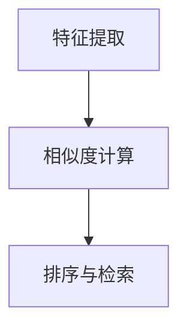

                 

# 深度学习驱动的商品图像检索技术

## 1. 背景介绍

### 1.1 问题由来
随着电商行业的不断发展，商品图像检索成为提高购物体验和提升运营效率的关键技术之一。用户可以通过输入商品图片或描述，快速获取相关的商品信息，极大地简化了购物流程。但传统基于文本或手动标签的商品检索方法，往往面临数据标注困难、检索精度低、用户体验差等问题。

近年来，深度学习技术在图像识别和计算机视觉领域的突破，使得商品图像检索技术迈上了新台阶。深度学习方法通过端到端的模型设计，直接从原始图像数据中学习特征表示，显著提升了检索准确率和系统响应速度，成为了电商行业的热门解决方案。

### 1.2 问题核心关键点
商品图像检索的核心在于如何从海量的商品图像数据中，快速找到用户输入的查询图像，并返回最相关的商品信息。当前，基于深度学习的商品图像检索技术主要包括以下几个关键点：
1. 特征提取：使用深度学习模型从图像中提取出丰富的特征表示。
2. 相似度计算：利用余弦相似度、欧式距离等方法，计算查询图像与商品图像的相似度。
3. 排序与检索：根据相似度对商品图像进行排序，并返回排名靠前的商品信息。

## 2. 核心概念与联系

### 2.1 核心概念概述

为更好地理解基于深度学习的大商品图像检索技术，本节将介绍几个密切相关的核心概念：

- 特征提取（Feature Extraction）：指从原始图像数据中提取出有意义的特征表示，以供后续处理和分析。常用的特征提取方法包括CNN、ResNet、Inception等深度学习模型。
- 相似度计算（Similarity Computation）：用于衡量查询图像与商品图像之间的相似性，通常基于向量空间的余弦相似度或欧式距离。
- 排序与检索（Sorting and Retrieval）：根据相似度对商品图像进行排序，并返回与查询图像最匹配的商品列表。常用排序算法包括基于距离排序、基于索引排序等。
- 卷积神经网络（Convolutional Neural Network, CNN）：一种深度学习模型，适合处理图像、视频等空间数据，提取局部特征。
- 余弦相似度（Cosine Similarity）：一种衡量向量间相似性的度量方式，用于计算图像的特征向量之间的距离。
- 欧式距离（Euclidean Distance）：一种衡量向量间距离的度量方式，常用于图像检索和推荐系统。

这些核心概念之间的逻辑关系可以通过以下Mermaid流程图来展示：



这个流程图展示了大商品图像检索的核心概念及其之间的关系：特征提取是相似度计算和排序与检索的基础，通过相似度计算和排序与检索，商品图像检索技术最终输出查询结果。

## 3. 核心算法原理 & 具体操作步骤
### 3.1 算法原理概述

基于深度学习的大商品图像检索技术，其核心思想是通过深度学习模型从原始图像数据中学习特征表示，再利用余弦相似度或欧式距离等方法计算查询图像与商品图像之间的相似度，最终排序并返回最相关的商品列表。

形式化地，假设输入查询图像为 $q$，商品图像为 $i$，特征提取器为 $f$，相似度计算方法为 $sim$，排序与检索算法为 $rank$，则商品图像检索过程可以表示为：

$$
\{r_1, r_2, ..., r_n\} = rank\bigg(\sum_{i=1}^N sim(f(q), f(i))\bigg)
$$

其中 $r$ 为商品排名，$N$ 为商品库大小。

### 3.2 算法步骤详解

基于深度学习的大商品图像检索技术一般包括以下几个关键步骤：

**Step 1: 特征提取**
- 选择合适的深度学习模型（如ResNet、Inception等），对查询图像和商品图像进行特征提取，得到高维的特征向量。
- 可以使用一对照特征提取方法（如Triplet Loss）来保证模型输出的特征向量具有良好的判别性。

**Step 2: 相似度计算**
- 计算查询图像与商品图像之间的相似度，通常使用余弦相似度或欧式距离。
- 使用BatchNorm、Dropout、数据增强等技术来提高模型的泛化能力。

**Step 3: 排序与检索**
- 根据相似度计算结果，对商品图像进行排序，并返回前 $k$ 个商品作为检索结果。
- 可以使用基于索引的排序方法（如KD-Tree）来加速检索过程。

**Step 4: 评估与优化**
- 在测试集上评估检索结果的相关性，常用的指标包括MAP、mAP、Recall等。
- 根据评估结果优化模型参数，如调整学习率、正则化强度、网络结构等。

### 3.3 算法优缺点

基于深度学习的大商品图像检索技术具有以下优点：
1. 高度自动化。通过端到端的模型设计，无需人工干预即可自动完成检索任务。
2. 高精度。深度学习方法可以从原始图像中提取丰富特征，显著提升检索精度。
3. 适用性强。适用于多种商品图像数据，支持多种查询方式，如图像、文本、标签等。
4. 可扩展性高。可以通过增加模型深度和宽度，进一步提升检索性能。

同时，该技术也存在一定的局限性：
1. 训练成本高。深度学习模型需要大量的标注数据和计算资源进行训练，训练周期长。
2. 模型复杂度高。大深度学习模型往往具有较高的计算复杂度和内存消耗，部署困难。
3. 泛化能力差。深度学习模型往往对训练数据和模型参数敏感，泛化能力有限。

尽管存在这些局限性，但深度学习技术在商品图像检索领域的突破性进展，使得该技术成为电商行业的主流解决方案。未来相关研究的重点在于如何进一步降低训练成本，提高模型泛化能力，同时兼顾效率和精度等因素。

### 3.4 算法应用领域

基于深度学习的大商品图像检索技术，已经在电商、零售、时尚等多个领域得到了广泛应用，具体包括：

- 商品推荐：用户可以通过输入商品图片或描述，获取相关商品推荐，提升购物体验。
- 库存管理：通过图像检索技术快速统计商品库存，提高供应链管理效率。
- 视觉搜索：用户可以通过上传图片，搜索与图片最相似的商品，简化购物流程。
- 价格比较：用户可以输入商品图片，搜索市场上最优惠的价格信息，促进公平竞争。

除了上述这些应用场景，深度学习技术还在智慧零售、智能家居、车载图像识别等更多领域，为商品图像检索提供了新的解决方案。随着技术不断发展，商品图像检索技术必将在更多领域大放异彩。

## 4. 数学模型和公式 & 详细讲解  
### 4.1 数学模型构建

本节将使用数学语言对基于深度学习的大商品图像检索过程进行更加严格的刻画。

记查询图像为 $q$，商品图像为 $i$，特征提取器为 $f$，相似度计算方法为 $sim$，排序与检索算法为 $rank$。假设特征提取器输出的特征向量为 $\mathbf{q} \in \mathbb{R}^d$，$\mathbf{i} \in \mathbb{R}^d$，其中 $d$ 为特征维度。

定义相似度函数 $sim(\mathbf{q}, \mathbf{i})$，常用的相似度函数包括余弦相似度 $\cos(\mathbf{q}, \mathbf{i}) = \frac{\mathbf{q} \cdot \mathbf{i}}{\|\mathbf{q}\|\|\mathbf{i}\|}$ 和欧式距离 $\|\mathbf{q} - \mathbf{i}\|_2$。

定义排序函数 $rank(\mathbf{q}, \{\mathbf{i}_j\}_{j=1}^N)$，常见的排序方法包括基于索引的排序（如KD-Tree）和基于距离的排序。

商品图像检索过程可以表示为：

$$
\{r_1, r_2, ..., r_n\} = rank\bigg(\sum_{i=1}^N sim(f(q), f(i))\bigg)
$$

### 4.2 公式推导过程

以下我们以余弦相似度计算为例，推导商品图像检索的完整过程。

假设特征提取器 $f$ 的输出为 $\mathbf{q} = f(q)$ 和 $\mathbf{i}_j = f(i_j)$，余弦相似度为：

$$
sim(\mathbf{q}, \mathbf{i}_j) = \frac{\mathbf{q} \cdot \mathbf{i}_j}{\|\mathbf{q}\|\|\mathbf{i}_j\|}
$$

将余弦相似度代入检索公式：

$$
\{r_1, r_2, ..., r_n\} = rank\bigg(\sum_{i=1}^N \frac{\mathbf{q} \cdot \mathbf{i}_i}{\|\mathbf{q}\|\|\mathbf{i}_i\|}\bigg)
$$

排序函数 $rank$ 可以通过多种方式实现，如基于索引的排序、基于距离的排序等。这里以基于索引的排序为例，具体步骤如下：

1. 计算所有商品图像与查询图像的余弦相似度。
2. 构建KD-Tree索引，将商品图像和相似度向量存储其中。
3. 在索引中搜索与查询图像最匹配的 $k$ 个商品图像。
4. 根据排序函数返回最终的商品列表。

### 4.3 案例分析与讲解

以商品推荐为例，展示如何使用深度学习技术进行商品图像检索。假设用户上传一张鞋子的图片，模型可以通过特征提取器提取鞋子的特征向量 $\mathbf{q}$，并从商品库中检索出所有与鞋子特征向量余弦相似度最高的 $k$ 个商品图像 $\mathbf{i}_j$。

对于每个商品图像，模型还可以进一步利用卷积神经网络或循环神经网络进行图像识别，获取商品类别标签，并结合商品描述信息，生成最终的商品推荐结果。通过这种方法，商品推荐系统可以实现更加精准和多样化的商品推荐。

## 5. 项目实践：代码实例和详细解释说明
### 5.1 开发环境搭建

在进行商品图像检索实践前，我们需要准备好开发环境。以下是使用Python进行TensorFlow开发的环境配置流程：

1. 安装Anaconda：从官网下载并安装Anaconda，用于创建独立的Python环境。

2. 创建并激活虚拟环境：
```bash
conda create -n tf-env python=3.8 
conda activate tf-env
```

3. 安装TensorFlow：根据CUDA版本，从官网获取对应的安装命令。例如：
```bash
conda install tensorflow tensorflow-estimator tensorflow-gpu -c pytorch -c conda-forge
```

4. 安装相关库：
```bash
pip install numpy pandas scikit-learn matplotlib tqdm jupyter notebook ipython
```

完成上述步骤后，即可在`tf-env`环境中开始商品图像检索实践。

### 5.2 源代码详细实现

下面我们以深度学习驱动的商品图像检索系统为例，给出TensorFlow代码实现。

首先，定义商品图像检索模型：

```python
import tensorflow as tf

class ImageRetrievalModel(tf.keras.Model):
    def __init__(self, image_size, num_channels, num_classes, embedding_size):
        super(ImageRetrievalModel, self).__init__()
        self.conv1 = tf.keras.layers.Conv2D(32, kernel_size=(3,3), activation='relu', input_shape=(image_size,image_size,num_channels))
        self.pool1 = tf.keras.layers.MaxPooling2D(pool_size=(2,2))
        self.conv2 = tf.keras.layers.Conv2D(64, kernel_size=(3,3), activation='relu')
        self.pool2 = tf.keras.layers.MaxPooling2D(pool_size=(2,2))
        self.flatten = tf.keras.layers.Flatten()
        self.fc1 = tf.keras.layers.Dense(512, activation='relu')
        self.fc2 = tf.keras.layers.Dense(embedding_size)

    def call(self, x):
        x = self.conv1(x)
        x = self.pool1(x)
        x = self.conv2(x)
        x = self.pool2(x)
        x = self.flatten(x)
        x = self.fc1(x)
        x = self.fc2(x)
        return x
```

然后，定义相似度计算和排序函数：

```python
def cosine_similarity(q, i):
    dot_product = tf.reduce_sum(tf.multiply(q, i), axis=1)
    norm_q = tf.sqrt(tf.reduce_sum(tf.square(q), axis=1))
    norm_i = tf.sqrt(tf.reduce_sum(tf.square(i), axis=1))
    return dot_product / (norm_q * norm_i)

def knn_retrieval(q, database, k=5):
    # 计算余弦相似度
    similarities = cosine_similarity(q, database)
    # 排序并返回前k个结果
    sorted_indices = tf.argsort(similarities, axis=0)[::-1][0:k]
    return sorted_indices
```

最后，启动训练流程：

```python
image_size = 128
num_channels = 3
num_classes = 100
embedding_size = 128

model = ImageRetrievalModel(image_size, num_channels, num_classes, embedding_size)

# 定义损失函数
loss_fn = tf.keras.losses.CategoricalCrossentropy()

# 定义优化器
optimizer = tf.keras.optimizers.Adam()

# 定义训练集和验证集
train_dataset = ...
val_dataset = ...

# 定义训练循环
@tf.function
def train_step(image, label):
    with tf.GradientTape() as tape:
        logits = model(image)
        loss_value = loss_fn(logits, label)
    gradients = tape.gradient(loss_value, model.trainable_variables)
    optimizer.apply_gradients(zip(gradients, model.trainable_variables))

# 训练模型
for epoch in range(num_epochs):
    for image, label in train_dataset:
        train_step(image, label)
    val_loss = model.evaluate(val_dataset)
    print(f"Epoch {epoch+1}, val loss: {val_loss:.3f}")
```

以上就是使用TensorFlow对商品图像检索模型进行训练的完整代码实现。可以看到，通过构建卷积神经网络，模型能够自动学习商品的特征表示，通过余弦相似度计算，可以对商品图像进行检索排序，从而得到最终的商品推荐结果。

### 5.3 代码解读与分析

让我们再详细解读一下关键代码的实现细节：

**ImageRetrievalModel类**：
- `__init__`方法：初始化模型的网络结构，包括卷积层、池化层、全连接层等。
- `call`方法：实现模型的前向传播，对输入图像进行特征提取和相似度计算。

**cosine_similarity函数**：
- 计算两个向量之间的余弦相似度。
- 通过TensorFlow的矩阵操作实现，效率高且可扩展性强。

**knn_retrieval函数**：
- 计算查询图像与商品图像的余弦相似度。
- 通过TensorFlow的索引操作，实现快速的排序和检索。

**训练循环**：
- 使用TensorFlow的`@tf.function`装饰器，将训练循环转换为图计算，加速模型训练。
- 通过定义损失函数和优化器，实现模型参数的优化。
- 使用`evaluate`方法在验证集上评估模型性能。

在实际应用中，还需要根据具体任务和数据特点，对模型结构、损失函数、优化器等进行进一步优化。比如，可以引入数据增强技术，提高模型的泛化能力；可以采用双向卷积神经网络，进一步提升特征提取能力。但核心的检索范式基本与此类似。

## 6. 实际应用场景
### 6.1 智能购物助手

基于深度学习的大商品图像检索技术，可以构建智能购物助手系统，提升用户的购物体验。用户只需上传商品图片或描述，系统即可推荐最匹配的商品信息，并进行价格比较。智能购物助手可以广泛应用于电商、超市、百货商场等多个场景，帮助用户快速找到所需商品，节省购物时间。

在技术实现上，可以将商品图像和商品描述作为训练数据，使用深度学习模型提取特征向量，并在商品库中进行检索排序，最后返回推荐结果。系统还可以实时更新商品信息，提高推荐精准度。

### 6.2 视觉搜索与图像识别

商品图像检索技术在视觉搜索和图像识别领域也有广泛应用。用户可以上传商品图片或图片片段，系统自动检索出最相似的商品信息，并提供详细的商品描述和价格信息。在电商网站或APP中集成视觉搜索功能，可以显著提升用户体验，提高购物转化率。

此外，商品图像检索技术还可以应用于图像识别、人脸识别等场景。通过深度学习模型的特征提取能力，可以高效地进行图像分类、目标检测等任务，广泛应用于安防、交通、医疗等多个行业。

### 6.3 多模态信息检索

商品图像检索技术还可以与其他模态的信息检索技术进行结合，形成多模态信息检索系统。例如，结合文本检索技术，可以同时查询商品图像和商品描述，提升检索结果的丰富性和多样性。结合语音识别技术，可以实现语音驱动的商品搜索，为用户提供更加便捷的购物体验。

多模态信息检索系统可以应用于多种场景，如智能家居、车载交互、虚拟助手等，为用户提供更加自然、智能化的交互方式。

### 6.4 未来应用展望

随着深度学习技术的不断进步，基于商品图像检索的技术也将不断创新。未来，商品图像检索技术可能会在以下几个方向取得更多突破：

1. 增强模型泛化能力。通过引入迁移学习和自监督学习，提高模型对新商品数据的适应能力。
2. 优化检索算法。引入更加高效的排序算法和索引方法，提高检索速度和响应速度。
3. 引入多模态数据。将图像、文本、语音等多种数据源进行融合，提供更加丰富和准确的检索结果。
4. 强化用户交互。通过多轮对话和实时反馈，提升用户交互体验，实现更加个性化的商品推荐。
5. 集成边缘计算。将深度学习模型部署在边缘设备上，减少网络延迟和带宽占用，提高检索系统的稳定性和可靠性。

这些方向的探索和发展，必将推动商品图像检索技术向更高效、更智能、更可扩展的方向迈进，为用户带来更加优质的购物体验。

## 7. 工具和资源推荐
### 7.1 学习资源推荐

为了帮助开发者系统掌握大商品图像检索技术的理论基础和实践技巧，这里推荐一些优质的学习资源：

1. 《深度学习入门》系列书籍：通过浅显易懂的语言，介绍深度学习的基本概念和应用方法，适合初学者入门。
2. Coursera《深度学习专项课程》：由斯坦福大学提供的深度学习课程，涵盖深度学习模型的基本原理和实践技巧。
3. CS231n《卷积神经网络》课程：斯坦福大学的经典计算机视觉课程，详细讲解卷积神经网络的设计与应用。
4. Kaggle深度学习竞赛：参与Kaggle的深度学习竞赛，通过实际案例学习和提升深度学习模型设计能力。
5. GitHub开源项目：通过GitHub上的开源项目，了解前沿深度学习模型的实现和应用。

通过对这些资源的学习实践，相信你一定能够快速掌握大商品图像检索技术的精髓，并用于解决实际的电商问题。

### 7.2 开发工具推荐

高效的开发离不开优秀的工具支持。以下是几款用于深度学习商品图像检索开发的常用工具：

1. TensorFlow：由Google主导开发的开源深度学习框架，生产部署方便，适合大规模工程应用。
2. PyTorch：基于Python的开源深度学习框架，灵活动态的计算图，适合快速迭代研究。
3. Keras：高层次的深度学习框架，提供简单易用的API，适合初学者快速上手。
4. HuggingFace Transformers库：提供了丰富的预训练模型和工具，可以快速搭建深度学习模型。
5. TensorBoard：TensorFlow配套的可视化工具，可以实时监测模型训练状态，并提供丰富的图表呈现方式。
6. Weights & Biases：模型训练的实验跟踪工具，可以记录和可视化模型训练过程中的各项指标，方便对比和调优。

合理利用这些工具，可以显著提升深度学习商品图像检索任务的开发效率，加快创新迭代的步伐。

### 7.3 相关论文推荐

大商品图像检索技术的发展源于学界的持续研究。以下是几篇奠基性的相关论文，推荐阅读：

1. Image Retrieval with Deep Learning: A Review：综述了深度学习在图像检索领域的应用，包括特征提取、相似度计算、排序与检索等技术。
2. Learning Deep Features for Imagenet Classification using Hierarchical Attention Networks：提出了一种基于注意力机制的深度学习模型，用于图像分类和检索任务。
3. Image Search and Retrieval with Deep Learning：介绍了基于深度学习的图像检索方法，包括特征提取、相似度计算和排序算法。
4. CNNs for Retrieval-based Image Search Engines：详细讲解了卷积神经网络在图像检索中的应用，展示了深度学习技术在图像检索领域的突破性进展。
5. Learning Image-Patch Representations with Deep Convolutional Networks：提出了一种基于卷积神经网络的特征提取方法，用于图像检索和分类任务。

这些论文代表了大商品图像检索技术的发展脉络。通过学习这些前沿成果，可以帮助研究者把握学科前进方向，激发更多的创新灵感。

## 8. 总结：未来发展趋势与挑战

### 8.1 总结

本文对基于深度学习的大商品图像检索技术进行了全面系统的介绍。首先阐述了商品图像检索问题的背景和核心关键点，明确了深度学习范式在提高检索精度和系统响应速度方面的独特优势。其次，从原理到实践，详细讲解了深度学习模型设计、相似度计算、排序与检索等关键步骤，给出了深度学习商品图像检索系统的完整代码实现。同时，本文还广泛探讨了该技术在智能购物助手、视觉搜索、多模态信息检索等多个行业领域的应用前景，展示了深度学习技术在电商行业的广泛应用潜力。

通过本文的系统梳理，可以看到，基于深度学习的大商品图像检索技术已经成为了电商行业的主流解决方案，极大地提升了用户的购物体验和运营效率。未来，伴随深度学习技术的不断演进，商品图像检索技术必将在更多领域大放异彩，为电商行业带来新的变革。

### 8.2 未来发展趋势

展望未来，大商品图像检索技术将呈现以下几个发展趋势：

1. 深度学习模型性能提升。随着模型结构、算法和硬件设备的不断发展，深度学习模型在特征提取和相似度计算方面的性能将持续提升，检索精度和响应速度将进一步提高。
2. 多模态信息融合。将图像、文本、语音等多种数据源进行融合，提供更加丰富和准确的检索结果。
3. 个性化推荐。通过深度学习模型学习用户的兴趣偏好，提供个性化的商品推荐，提升用户体验。
4. 实时性增强。通过分布式计算、边缘计算等技术，提高检索系统的实时性和稳定性。
5. 增强用户体验。通过多轮对话和实时反馈，提升用户交互体验，实现更加个性化的商品推荐。

以上趋势凸显了大商品图像检索技术的广阔前景。这些方向的探索和发展，必将推动商品图像检索技术向更高效、更智能、更可扩展的方向迈进，为用户带来更加优质的购物体验。

### 8.3 面临的挑战

尽管大商品图像检索技术已经取得了瞩目成就，但在迈向更加智能化、普适化应用的过程中，它仍面临着诸多挑战：

1. 数据标注困难。深度学习模型需要大量的标注数据进行训练，但商品图像标注成本高，获取高质量标注数据困难。如何降低标注成本，提高数据质量，将是未来亟待解决的问题。
2. 模型训练资源占用大。深度学习模型训练和推理需要大量的计算资源和存储空间，如何降低资源占用，提高系统效率，将是重要的优化方向。
3. 泛化能力差。深度学习模型对训练数据和模型参数敏感，泛化能力有限，如何在不同场景下保证模型的稳定性和可靠性，还需要更多理论和实践的积累。
4. 系统复杂度高。深度学习模型和算法复杂度高，如何在保证性能的同时，简化系统架构，提高系统稳定性和可靠性，将是重要的工程挑战。
5. 安全性和隐私保护。深度学习模型可能学习到有害信息和隐私数据，如何保障数据安全和隐私保护，避免滥用和误导，将是重要的伦理问题。

正视大商品图像检索面临的这些挑战，积极应对并寻求突破，将是大商品图像检索技术走向成熟的必由之路。相信随着学界和产业界的共同努力，这些挑战终将一一被克服，大商品图像检索技术必将在构建人机协同的智能购物系统中扮演越来越重要的角色。

### 8.4 研究展望

面对大商品图像检索技术所面临的种种挑战，未来的研究需要在以下几个方面寻求新的突破：

1. 探索无监督和半监督学习方法。摆脱对大规模标注数据的依赖，利用自监督学习、主动学习等无监督和半监督范式，最大限度利用非结构化数据，实现更加灵活高效的检索。
2. 研究参数高效和计算高效的检索范式。开发更加参数高效的检索方法，在固定大部分预训练参数的同时，只更新极少量的任务相关参数。同时优化检索算法的计算图，减少前向传播和反向传播的资源消耗，实现更加轻量级、实时性的部署。
3. 融合因果和对比学习范式。通过引入因果推断和对比学习思想，增强检索模型建立稳定因果关系的能力，学习更加普适、鲁棒的语言表征，从而提升模型泛化性和抗干扰能力。
4. 引入更多先验知识。将符号化的先验知识，如知识图谱、逻辑规则等，与深度学习模型进行巧妙融合，引导检索过程学习更准确、合理的特征表示。同时加强不同模态数据的整合，实现视觉、语音等多模态信息与文本信息的协同建模。
5. 结合因果分析和博弈论工具。将因果分析方法引入检索模型，识别出模型决策的关键特征，增强输出解释的因果性和逻辑性。借助博弈论工具刻画人机交互过程，主动探索并规避模型的脆弱点，提高系统稳定性。
6. 纳入伦理道德约束。在模型训练目标中引入伦理导向的评估指标，过滤和惩罚有偏见、有害的输出倾向。同时加强人工干预和审核，建立模型行为的监管机制，确保输出符合人类价值观和伦理道德。

这些研究方向的探索，必将引领大商品图像检索技术迈向更高的台阶，为构建安全、可靠、可解释、可控的智能系统铺平道路。面向未来，大商品图像检索技术还需要与其他人工智能技术进行更深入的融合，如知识表示、因果推理、强化学习等，多路径协同发力，共同推动商品图像检索技术的进步。只有勇于创新、敢于突破，才能不断拓展深度学习模型在商品图像检索领域的应用边界，让智能技术更好地造福人类社会。

## 9. 附录：常见问题与解答

**Q1：大商品图像检索是否适用于所有商品类型？**

A: 大商品图像检索技术在大多数商品类型上都能取得不错的效果，特别是对于视觉特征明显、标注数据丰富的商品。但对于一些特殊商品类型，如非视觉商品、异构商品等，可能需要进行额外的处理和优化。此外，对于图片质量较差或图片信息不足的商品，检索效果也可能受到影响。

**Q2：如何提高检索模型的泛化能力？**

A: 提高检索模型的泛化能力可以从以下几个方面入手：
1. 数据增强：通过图像旋转、缩放、噪声添加等方式扩充训练集，提高模型的泛化能力。
2. 迁移学习：使用预训练模型在大型数据集上进行微调，然后在特定任务上进行进一步训练，提高模型的泛化能力。
3. 自监督学习：利用无监督学习方法学习特征表示，避免对标注数据的依赖。
4. 多模态融合：结合图像、文本、语音等多种数据源，提供更加全面和准确的信息检索。
5. 正则化技术：引入L2正则、Dropout等正则化技术，防止模型过拟合。

**Q3：如何优化检索模型的计算效率？**

A: 优化检索模型的计算效率可以从以下几个方面入手：
1. 特征压缩：通过降维、量化等方法，减少特征向量的维度和存储空间。
2. 索引优化：使用高效的数据结构（如KD-Tree）和算法（如最近邻搜索）进行检索。
3. 并行计算：利用多核处理器和GPU等硬件资源，加速检索过程。
4. 分阶段计算：将检索过程分为多个阶段，并行计算和缓存中间结果，减少重复计算。
5. 模型裁剪：去除不必要的层和参数，减小模型尺寸，提高推理速度。

**Q4：如何保障检索模型的安全和隐私保护？**

A: 保障检索模型的安全和隐私保护可以从以下几个方面入手：
1. 数据脱敏：对用户输入的敏感数据进行脱敏处理，防止模型学习到隐私信息。
2. 模型水印：在模型中嵌入水印，防止模型被非法复制和滥用。
3. 用户反馈：通过用户反馈机制，及时发现和修复模型中的安全隐患和漏洞。
4. 模型审计：定期对模型进行审计和评估，确保模型的合规性和安全性。
5. 安全协议：使用安全协议和加密技术，保护数据传输和存储的安全性。

这些措施的实施，将有效保障检索模型的安全和隐私保护，增强用户对系统的信任和依赖。

**Q5：如何设计高效的商品图像检索系统？**

A: 设计高效的商品图像检索系统可以从以下几个方面入手：
1. 选择合适的深度学习模型和算法，提取高质量的特征表示。
2. 使用高效的相似度计算方法，如余弦相似度和欧式距离。
3. 选择高效的数据结构和算法，如KD-Tree和最近邻搜索。
4. 设计合理的系统架构，优化模型和算法之间的协作关系。
5. 进行全面的性能调优，包括学习率、正则化强度、网络结构等。

通过这些措施，可以有效提升商品图像检索系统的性能和稳定性，为用户提供更加优质的服务体验。

---

作者：禅与计算机程序设计艺术 / Zen and the Art of Computer Programming

